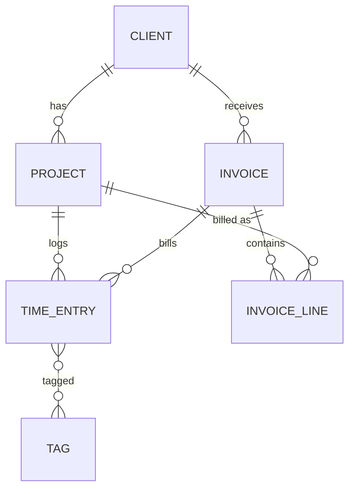

# The Running Project: Billable

Every lesson in this module adds one piece to the same application. By the end you have a complete,
tested, documented web application — and that application is your capstone.

**Billable** is a time-tracking and invoicing tool for freelancers and small agencies. You log the hours
you work for clients, the application turns them into correct invoices with VAT, and it warns you
before a fixed-budget project runs out of money.

Most of you have a day job. You have probably filled in a timesheet, or received an invoice, or argued
about one. That is the point: the rules in this domain are real, the edge cases are real, and "the
number on the invoice is wrong" is a bug everybody understands.

---

## Why this domain

| Outcome | Where Billable forces you to practise it |
|---|---|
| ÕV1 Patterns | Billing types → Strategy (internal projects → Null Object). Budget warnings → Observer. Notifications → Adapter. |
| ÕV2 Math & logic | Money in cents, VAT, rounding time up to 15-minute blocks, due dates, "can this invoice still be edited?" |
| ÕV3 MVC | Server-rendered pages for clients, projects, time entries and invoices |
| ÕV4 ORM | Six related tables, a many-to-many relation, aggregates, an N+1 trap on the time sheet |
| ÕV5 Unit tests | Every calculation is a pure function that can be tested in milliseconds |
| ÕV6 Mocks | The clock, the mailer and the notifier must be replaced in tests |
| ÕV7 Code standard | Agreed in lesson 02, enforced by a formatter and CI from then on |
| ÕV8 Complexity | Invoice generation: overlap detection, rounding, grouping, VAT, numbering — in one transaction |
| ÕV9 Documentation | README, doc comments, diagrams and decision records, all in English |

---

## The domain in plain words

- A **client** is a company or person you work for.
- A **project** belongs to one client. It has a **billing type**:
  - **Hourly** — you bill every (rounded) minute at the project's hourly rate.
  - **Fixed price** — you bill an agreed amount, no matter how long it took.
  - **Capped hourly** — you bill hourly, but never more than an agreed budget cap in total.
  - **Internal** — time is tracked but never billed (added in lesson 08's independent work).
- A **time entry** records a block of work on a project: when it started, when it ended, what you did,
  and whether it is billable.
- A project has a **rounding rule**: every entry is rounded **up** to 1, 6 or 15 minutes before billing.
- **Tags** (e.g. `meeting`, `bugfix`, `design`) can be attached to time entries. One entry can have many
  tags; one tag is used on many entries.
- An **invoice** is generated for one client from all of their billable, not yet invoiced time entries
  up to a chosen date. It has **lines** (one per project), a subtotal, VAT and a total.
- Invoices move through states: **draft → sent → paid**. Only drafts can be edited or deleted.

### Business rules

| # | Rule |
|---|---|
| R1 | All money is stored as **integer cents** (`bigint` columns; PHP `int`, Java `long`). Never `float`/`double` for storing or calculating (formatting a value for display is the only exception). |
| R2 | VAT rate is **24 %** (Estonia, since 1 July 2025). It is stored on each invoice, because rates change. |
| R3 | Amounts are rounded **half up** to the cent, once, at the point where a fraction appears. |
| R4 | A time entry must end after it starts. Maximum length 12 hours. |
| R5 | Each entry's duration is rounded **up** to the project's `rounding_minutes` (1, 6 or 15) before billing. |
| R6 | Hourly amount = rounded minutes × hourly rate ÷ 60, rounded half up to the cent. |
| R7 | Capped: the hourly amount, but the project's total billed amount never exceeds `budget_cap_cents`. |
| R8 | Fixed price: the remaining part of `fixed_price_cents` that has not been billed yet. |
| R9 | When a capped project's value reaches **80 %** of its cap, the owner is warned — **once**. |
| R10 | An invoice cannot be generated if two of the included entries **overlap** in time. The error names both entries. |
| R11 | Invoice numbers are `YYYY-NNNN`, sequential per year, with no gaps and no duplicates: `2026-0001`, `2026-0002`… |
| R12 | Due date is 14 days after the issue date; if that falls on a Saturday or Sunday it moves to the next Monday. |
| R13 | An invoice can be edited or deleted only while it is a draft. Deleting a draft releases its time entries. |
| R14 | Once an entry is on an invoice, it cannot be edited or deleted. |

---

## Data model

Table and column names are identical in both tracks. Laravel creates them with migrations, Spring Boot
with Flyway SQL scripts. Every column is `NOT NULL` unless its notes say "nullable" — this includes
`created_at` and `updated_at`, which the ORM fills on every insert and update.

### `clients` — lesson 03

| Column | Type | Notes |
|---|---|---|
| `id` | bigint, PK | |
| `name` | varchar(120) | required |
| `email` | varchar(255) | required, unique |
| `vat_number` | varchar(20) | nullable, e.g. `EE101234567` |
| `created_at`, `updated_at` | timestamp | |

### `projects` — lesson 03

| Column | Type | Notes |
|---|---|---|
| `id` | bigint, PK | |
| `client_id` | bigint, FK → clients | required, restrict delete |
| `name` | varchar(120) | required |
| `billing_type` | varchar(20) | `hourly`, `fixed`, `capped`; `internal` from lesson 08 |
| `hourly_rate_cents` | bigint | nullable; required for hourly and capped |
| `fixed_price_cents` | bigint | nullable; required for fixed |
| `budget_cap_cents` | bigint | nullable; required for capped |
| `rounding_minutes` | smallint | `1`, `6` or `15`, default `1` |
| `archived_at` | timestamp | nullable |
| `budget_warning_sent_at` | timestamp | nullable — **added in lesson 09** |
| `created_at`, `updated_at` | timestamp | |

### `time_entries` — lesson 06

| Column | Type | Notes |
|---|---|---|
| `id` | bigint, PK | |
| `project_id` | bigint, FK → projects | required, restrict delete |
| `invoice_id` | bigint, FK → invoices | nullable, restrict delete — **added in lesson 13** |
| `started_at` | timestamp | required |
| `ended_at` | timestamp | required, after `started_at` |
| `description` | varchar(255) | required |
| `billable` | boolean | default `true` |
| `created_at`, `updated_at` | timestamp | |

Index: `(project_id, started_at)`.

### `tags` and `tag_time_entry` — lesson 06

| Table | Columns |
|---|---|
| `tags` | `id`, `name` varchar(40) unique, timestamps |
| `tag_time_entry` | `tag_id` FK, `time_entry_id` FK, composite PK, cascade delete both sides |

### `invoices` — lesson 13

| Column | Type | Notes |
|---|---|---|
| `id` | bigint, PK | |
| `client_id` | bigint, FK → clients | required, restrict delete |
| `number` | varchar(9) | unique, `2026-0001` |
| `status` | varchar(10) | `draft`, `sent`, `paid`; default `draft` |
| `issued_on` | date | |
| `due_on` | date | |
| `vat_rate_bp` | integer | basis points: 24 % = `2400` |
| `subtotal_cents`, `vat_cents`, `total_cents` | bigint | |
| `discount_bp` | integer | default `0` — **lesson 13 independent work** (discount) |
| `version` | integer | optimistic locking — **added in lesson 14** (Spring track) |
| `created_at`, `updated_at` | timestamp | |

### `invoice_lines` — lesson 13

| Column | Type | Notes |
|---|---|---|
| `id` | bigint, PK | |
| `invoice_id` | bigint, FK → invoices | cascade delete |
| `project_id` | bigint, FK → projects | restrict delete |
| `description` | varchar(255) | e.g. `Website redesign — 12 h 30 min` |
| `minutes` | integer | rounded billable minutes |
| `amount_cents` | bigint | |
| `discount_cents` | bigint | default `0` — **lesson 13 independent work** (discount) |

No timestamps on `invoice_lines`. Lesson 14's independent work adds indexes on the foreign keys
`time_entries.invoice_id`, `invoice_lines.project_id` and `invoices.client_id`.

### `invoice_sequences` — lesson 14

| Column | Type | Notes |
|---|---|---|
| `year` | integer, PK | e.g. `2026` |
| `last_number` | integer | last number issued in that year |

Locked row by row (`SELECT … FOR UPDATE`) so two invoices generated at the same moment can never get the
same number (R11). Lesson 13 starts with a simpler "max + 1" approach; lesson 14 shows why it breaks.

---

## Code map

Names are fixed so that the lessons, the two tracks and your classmates' code all line up.

| Concept | Laravel | Spring Boot (`ee.ta25.billable`) | Lesson |
|---|---|---|---|
| Home page | `HomeController`, `resources/views/home.blade.php` | `common.HomeController`, `templates/home.html` | 01 |
| Layout | `resources/views/layouts/app.blade.php` | `templates/layout.html` (one `layout(title, content)` fragment) | 01 |
| Code standard | `pint.json`, `CODESTYLE.md` | Spotless in `pom.xml`, `CODESTYLE.md` | 02 |
| Client | `App\Models\Client` | `client.Client`, `client.ClientRepository` | 03 |
| Project | `App\Models\Project` | `project.Project`, `project.ProjectRepository` | 03 |
| Billing type | `App\Enums\BillingType` | `project.BillingType` | 03 (`internal` 08 homework) |
| Money formatting | `euros()` in `app/helpers.php` | `common.Formatters` | 04 |
| 404 for unknown id | route model binding (`ModelNotFoundException`) | `common.NotFoundException` | 04 |
| Client pages | `ClientController` (resource) | `client.ClientController` | 04–05 |
| Client form | `StoreClientRequest`, `UpdateClientRequest` | `client.ClientForm` | 05 |
| CSRF protection | built in (`@csrf` in every POST form) | `common.SecurityConfig` (Spring Security, `permitAll()`, CSRF on) | 05 |
| Project pages | `ProjectController`, `StoreProjectRequest`, `UpdateProjectRequest` | `project.ProjectController`, `project.ProjectForm` | 04–05 homework |
| Time entry | `App\Models\TimeEntry` | `timeentry.TimeEntry`, `timeentry.TimeEntryRepository` | 06 |
| Tag | `App\Models\Tag` | `timeentry.Tag`, `timeentry.TagRepository` | 06 |
| Time sheet | `TimeEntryController`, `StoreTimeEntryRequest` | `timeentry.TimeEntryController`, `timeentry.TimeEntryForm` | 06 |
| Weekly report | `ReportController` | `report.ReportController`, `report.ReportRepository` | 06 homework |
| Time entry service | `App\Services\TimeEntryService` | `timeentry.TimeEntryService`, `timeentry.LogTimeEntryCommand` | 07 |
| Client / project services | `App\Services\ClientService`, `ProjectService` | `client.ClientService` (in class), `project.ProjectService` | 07 (Laravel: both homework) |
| Domain exceptions | `App\Exceptions\ProjectArchivedException`, `ClientHasProjectsException`, `ProjectHasTimeEntriesException`, `TimeEntryInFutureException` | same names in `project`, `client`, `timeentry` | 07 (+ homework) |
| Clock | `now()`; frozen in tests with `travelTo()` | `common.ClockConfig` (`Clock` bean) | 07 homework, 10 |
| Billing strategies | `App\Billing\BillingStrategy`, `HourlyBilling`, `FixedPriceBilling`, `CappedHourlyBilling`, `BillingStrategyResolver::forProject` | `billing.*` (same names) | 08 |
| Internal billing (Null Object) | `App\Billing\InternalBilling` | `billing.InternalBilling` | 08 homework |
| Billable so far | `ProjectService::billableSummary()` → `App\Services\BillableSummary` | `ProjectService.billableSummary()` → `project.BillableSummary` | 08, 10 |
| App settings | `config/billable.php` (`owner_email`, `notifier`, `vat_rate_bp`) | `billable.*` in `application.properties`, bound to `common.BillableProperties` (`@Validated @ConfigurationProperties` record: `ownerEmail`, `mailFrom`, `notifier` as `NotifierType` enum; `vatRateBp` from lesson 10) | 09, 10 |
| Notifier | `App\Contracts\Notifier`, `App\Notifiers\MailNotifier`, `LogNotifier`; `App\Mail\NotificationMail` (12) | `notification.Notifier`, `MailNotifier`, `LogNotifier`, `NotifierType`; `NotifierConfig` (`@Bean` with an exhaustive `switch`) | 09 |
| Notifier decorator | `App\Notifiers\LoggingNotifier` | `notification.LoggingNotifier`, wrapped in `NotifierConfig` | 09 homework |
| Budget warning | `App\Events\TimeEntryLogged`, `App\Listeners\CheckProjectBudget`, `App\Services\BudgetMonitor` | `budget.TimeEntryLoggedEvent`, `budget.BudgetListener`, `budget.BudgetMonitor`; `ProjectRepository.claimBudgetWarning` / `releaseBudgetWarning` (`@Modifying` updates) | 09 |
| Money | `App\Support\Money` (`sum` 11, `allocate` 13 homework) | `common.Money` (same) | 10 |
| Time rounding | `App\Support\TimeRounding` | `common.TimeRounding` | 10 |
| Due date | `App\Support\DueDateCalculator::dueDate()` | `common.DueDateCalculator` | 10 homework |
| Test doubles | `tests/Fakes/InMemoryNotifier`, `Mail::fake()`, `travelTo()` | `InMemoryNotifier` (test sources), Mockito, `Clock.fixed` | 12 |
| Invoice | `App\Models\Invoice`, `InvoiceLine`, `App\Enums\InvoiceStatus` | `invoice.Invoice`, `InvoiceLine`, `InvoiceStatus` | 13 |
| Invoice generation | `App\Invoicing\InvoiceGenerator`, `OverlapDetector`, `TimeSlot`, `InvoiceNumberGenerator` | `invoice.*` (same names, plus `Overlap`, `ProjectAmount`) | 13 |
| Invoicing errors | `App\Invoicing\InvoicingException` (abstract) and `OverlappingEntries…`, `NothingToInvoice…`, `InvoiceNotEditable…`, `InvalidStatusTransition…`, `TimeEntryLockedException` | `invoice.*` (same names) | 13 |
| Invoice actions | `App\Services\InvoiceService` (send, mark paid, delete draft) | `invoice.InvoiceService` (also calls the generator) | 13 |
| Invoice pages | `InvoiceController`, `StoreInvoiceRequest` | `invoice.InvoiceController`, `invoice.InvoiceForm` | 13 |
| Gap-free numbering | `invoice_sequences` row locked in `InvoiceNumberGenerator` (`lockForUpdate`) | `invoice.InvoiceSequence`, `InvoiceSequenceRepository` (`PESSIMISTIC_WRITE`) | 14 |
| Race demo | `invoices:race-demo` (`InvoiceRaceDemo`) | `InvoiceNumberingConcurrencyTest` | 14 |

---

## What exists after each lesson

"In class" is what we build together. "Independent" is what you add on your own before the next lesson.
Your repository should match the **In class** column at the end of each session.

| After | In class | Independent |
|---|---|---|
| 01 | New project, PostgreSQL in Docker, layout + home page, first commit (Spring: tests use a Testcontainers PostgreSQL) | About page; trace a request through the framework |
| 02 | Formatter, `.editorconfig`, `CODESTYLE.md`, CI running the formatter check | Pull request reviewed by a classmate; pre-commit hook |
| 03 | `clients` + `projects` tables, `Client`, `Project`, `BillingType`, seed data, first queries | More query practice; `Project` query methods |
| 04 | Clients list (paginated) and detail page, 404 for unknown id | Projects list + detail, nested under a client |
| 05 | Create / edit / delete client with validation and flash messages, CSRF tokens on every form (Spring: Spring Security with `permitAll()`) | Full CRUD for projects, including conditional validation per billing type |
| 06 | `time_entries`, `tags`, relations, time sheet page, N+1 found and fixed | Tag entries; weekly summary report with aggregate queries |
| 07 | `TimeEntryService`, `ProjectArchivedException`, thin controllers, constructor injection (Spring: also `LogTimeEntryCommand`, `ClientService`) | `ProjectService` (Laravel: also `ClientService`), `docs/architecture.md`, future-entry rule (Spring: `ClockConfig`); advanced: layer test |
| 08 | Billing strategies + `BillingStrategyResolver`, `ProjectService::billableSummary()` → `BillableSummary`, project page shows "billable so far", `docs/patterns.md` | `internal` billing type with `InternalBilling` (Null Object); Active Record vs Repository (scope / query object) |
| 09 | `budget_warning_sent_at`, `Notifier` adapter (`config/billable.php` / `billable.*` properties), `TimeEntryLogged` event, `BudgetMonitor`: 80 % warning sent once (claim → notify → release on failure) | `LoggingNotifier` decorator; reset the warning when the cap changes; anti-pattern hunt |
| 10 | `Money`, `TimeRounding`, VAT in `BillableSummary` (rate from `billable.vat_rate_bp` / `billable.vat-rate-bp`); strategies use `Money` | `DueDateCalculator`; decision table for "can edit invoice" (`docs/invoice-rules.md`) |
| 11 | Unit tests for `Money`, `TimeRounding`, billing strategies; `Money::sum` by TDD; tests in CI | 15+ meaningful unit tests; boundary tables; `docs/testing.md` |
| 12 | Clock and notifier replaced in tests; budget warning tested with mocks; `InMemoryNotifier` fake (Laravel: `NotificationMail`) | Mock-based tests for `TimeEntryService`; one controller test |
| 13 | Invoices: `InvoiceGenerator` with `OverlapDetector`/`TimeSlot`, rounding, VAT, "max + 1" numbering, `InvoicingException` family, `InvoiceService`, pages; Laravel: `TimeEntryFactory`, `InvoiceFactory` (`HasFactory` on `TimeEntry`) | Invoice status transitions; `docs/algorithm.md`; discount with `Money::allocate` (largest remainder); overlap benchmark |
| 14 | Feature / integration tests, duplicate-number race shown and fixed with `invoice_sequences` row lock, invoiced entries locked (Spring: `@Version`) | More feature tests; foreign-key indexes and query-count checks; one security fix; concurrency evidence |
| 15 | README, doc comments, ER + sequence diagrams, first ADR | Remaining ADRs, final polish, defence preparation |

---

## Not in scope

Kept out on purpose so the time goes into the learning outcomes:

- **Authentication and multiple users.** Billable is single-user. (Laravel starter kits and Spring
  Security logins are worth learning — just not here.) The Spring track uses Spring Security only for
  CSRF protection, with every page open (`permitAll()`, lesson 05).
- **JavaScript frameworks.** Pages are server-rendered. Styling comes from one CSS file (Pico.css) so
  nobody spends an evening on CSS.
- **PDF generation, payments, e-invoicing standards.** Mentioned as extensions in the
  [capstone brief](CAPSTONE.md).
