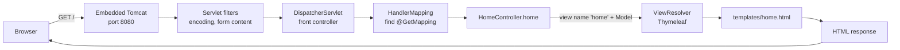
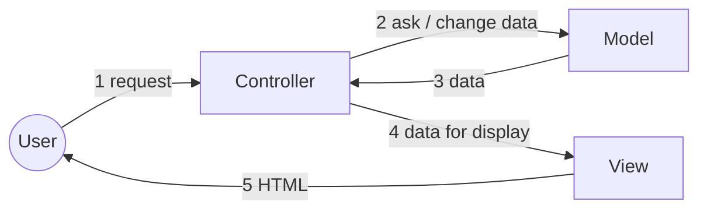

# 01 — Frameworks and the request lifecycle

**Outcomes:** ÕV3 — *realiseerib rakenduse MVC arhitektuuriga rakendusena* · **Time:** 2 h in class + ~2 h independent
**Before this lesson:** your tools are installed (see [What you need](../../README.md#what-you-need)). There is no project yet — this lesson creates it. See [what exists after each lesson](../../PROJECT.md#what-exists-after-each-lesson).
**Walkthroughs:** [Laravel](laravel.md) · [Spring Boot](spring-boot.md)

---

## Why this matters

Almost every web application you will meet at work is built on a framework: Laravel, Symfony, Spring
Boot, Django, Rails, ASP.NET. When you join a team, nobody explains the framework to you. They expect
you to open the project, find the controller for a page, and change it without breaking anything.

To do that you need a mental map: **when a browser asks for a page, which files does the request pass
through, in which order, and who decides what happens next?** If you have this map, you can debug an
unfamiliar project. If you do not, every error message looks random.

Today we create **Billable**, the application you will build for the whole module. It is small today —
one page that says "Billable" and shows today's date — but the path a request takes to reach that page
is exactly the same path that an invoice page will take in lesson 13. Everything we add later hangs on
this skeleton.

## Today's goal

At the end of class you have:

- a new Laravel or Spring Boot project called `billable`,
- PostgreSQL 17 running in Docker, started from a `compose.yaml` file in the project root,
- the application connected to that database,
- a shared layout (Pico.css) and a home page served by `HomeController`,
- a Git repository on GitHub with your first commits.

By the end you can:

1. explain the difference between a library and a framework,
2. describe the parts of an HTTP request and response,
3. name, in order, the files and framework parts a request passes through in your track,
4. explain what the Model, View and Controller are responsible for,
5. say where configuration and secrets live, and why secrets are never committed.

---

## Concepts

### 1. Library or framework?

Both are code that other people wrote so that you do not have to. The difference is **who is in
charge**.

| | Library | Framework |
|---|---|---|
| Who calls whom | **Your code calls the library** when you need it | **The framework calls your code** when it decides it is time |
| Who owns `main` / the entry point | You | The framework |
| Example | Carbon (dates), Guzzle (HTTP client), Jackson (JSON) | Laravel, Spring Boot |
| If you remove it | You replace some function calls | You rewrite the application |

This reversal has a name: **inversion of control** (IoC). The usual summary is the "Hollywood
principle": *don't call us, we'll call you.* You never write "read the HTTP request from the socket,
parse the URL, then call my function". You write a controller method, and the framework calls it when a
matching request arrives.

```
Library:    your code ──calls──▶ library function ──returns──▶ your code continues

Framework:  framework ──calls──▶ your controller ──returns──▶ framework continues
            (framework owns the loop: receive request → pick code → send response)
```

Inversion of control is why a framework feels "magic" at first. The code that runs your controller is
not in your project folder. It is in `vendor/` (Laravel) or inside a jar file in your Maven cache (Spring).
Today's lesson is about making that hidden part visible.

### 2. Why teams use frameworks

- **Solved problems stay solved.** Routing, sessions, CSRF protection, database connections, escaping
  HTML output, validation. Writing these yourself takes months and is easy to get wrong in a
  security-relevant way.
- **A shared structure.** In any Laravel project, controllers are in `app/Http/Controllers`. In any
  Spring Boot project, templates are in `src/main/resources/templates`. A new developer finds things
  on day one.
- **Documentation and hiring.** A framework with a large community has answers for most problems, and
  employers can hire people who already know it.

The cost: you must learn the framework's rules, and you depend on its release cycle. Frameworks change
quickly. **Laravel 12 and Spring Boot 4 are different from the versions most tutorials and AI tools
were trained on.** This guide points out the differences where they matter.

### 3. Convention over configuration

A framework makes default decisions for you. If you follow the convention, you write no configuration.

| Convention | Laravel | Spring Boot |
|---|---|---|
| Where views live | `resources/views/home.blade.php` → `view('home')` | `src/main/resources/templates/home.html` → return `"home"` |
| Which port the dev server uses | 8000 (`php artisan serve`) | 8080 (embedded Tomcat) |
| How the app finds the database driver | `DB_CONNECTION=pgsql` in `.env` | the PostgreSQL driver jar is on the classpath |
| Where static files go | `public/` | `src/main/resources/static/` |

You *can* change every default. You should only do it when you have a reason, because every change is
something the next developer must discover.

### 4. HTTP in five minutes

The browser and the server talk HTTP. Every exchange is one **request** and one **response**. Both are
plain text with a first line, headers, an empty line, and an optional body.

```
GET /about HTTP/1.1                    ← method, path, protocol version
Host: localhost:8000                   ← headers: name: value
Accept: text/html
                                       ← empty line ends the headers
                                       ← (GET has no body)
```

```
HTTP/1.1 200 OK                        ← status code and reason
Content-Type: text/html; charset=UTF-8
Content-Length: 1532

<!DOCTYPE html><html>…</html>          ← body: the HTML the browser shows
```

**Methods** say what the client wants to do:

| Method | Meaning | Billable example | Safe to repeat? |
|---|---|---|---|
| `GET` | Read something | Show the list of clients | Yes — it must not change data |
| `POST` | Create something / submit a form | Save a new client | No |
| `PUT` / `PATCH` | Replace / change something | Update a client | PUT yes, PATCH not always |
| `DELETE` | Remove something | Delete a draft invoice | Yes (deleting twice leaves it deleted) |

HTML forms can only send `GET` and `POST`. Lesson 05 shows how each framework deals with that.

**Status codes** say how it went. Learn these five groups and a few exact codes:

| Code | Group | You will see it when… |
|---|---|---|
| `200 OK` | 2xx success | A page loads normally |
| `302 Found` / `303 See Other` | 3xx redirect | After saving a form, the server sends you to another page (lesson 05) |
| `404 Not Found` | 4xx client error | The URL does not match any route, or `/clients/999` does not exist |
| `419` (Laravel) / `403` (Spring) | 4xx | A form was sent without a valid CSRF token |
| `422 Unprocessable Content` | 4xx | Validation failed (mostly in APIs) |
| `500 Internal Server Error` | 5xx server error | Your code threw an exception |

A 4xx means "the request was wrong". A 5xx means "the server is wrong" — that is always your bug.

**Headers** carry metadata: `Content-Type` (what the body is), `Location` (where to go after a
redirect), `Set-Cookie` / `Cookie` (session), `Cache-Control`. You can see all of them in the browser's
developer tools, **Network** tab. Open it now and keep it open during the course.

HTTP is **stateless**: the server does not remember you between requests. Sessions and cookies are how
frameworks fake memory on top of it.

### 5. The request lifecycle

"Request lifecycle" means: every step between the moment the request reaches the server and the moment
the response leaves it. Both frameworks follow the same idea, the **front controller** pattern: *one*
entry point receives *every* request and then hands it to the right piece of your code.

Without a front controller (old-style PHP), every URL is a separate file (`about.php`, `clients.php`),
and each file must repeat the same setup: sessions, database connection, security checks. With a front
controller, that setup is written once.

#### Laravel

```mermaid
flowchart LR
    B[Browser] -->|GET /| W[Web server<br/>artisan serve / Herd]
    W --> I[public/index.php<br/>front controller]
    I --> A[bootstrap/app.php<br/>create application]
    A --> K[HTTP Kernel]
    K --> M[Middleware<br/>session, cookies, CSRF]
    M --> R[Router<br/>routes/web.php]
    R --> C[HomeController@index]
    C --> V[View<br/>home.blade.php]
    V --> RESP[Response object]
    RESP -->|back out through middleware| B
```

1. **Web server.** `php artisan serve` (or Herd's nginx) receives the request. Every URL that is not a
   real file in `public/` is sent to `public/index.php`.
2. **`public/index.php`** loads Composer's autoloader (`vendor/autoload.php`), so classes can be found
   by namespace, and loads `bootstrap/app.php`.
3. **`bootstrap/app.php`** creates the **application** — Laravel's service container — and registers
   routes and middleware configuration.
4. **The HTTP kernel** takes the `Request` object and sends it through the **middleware** pipeline.
   Middleware are layers that run before and after your code: start the session, decrypt cookies,
   check the CSRF token.
5. **The router** compares the method and path with the routes in `routes/web.php` and finds the
   controller method. No match → 404.
6. **The controller** does the work for this page and returns a view (or a redirect).
7. **The view** (Blade template) is rendered into HTML. Blade templates are compiled to plain PHP and
   cached in `storage/framework/views/`.
8. The HTML is wrapped in a **Response** object, travels back out through the middleware (which can add
   headers or cookies), and is sent to the browser.

#### Spring Boot



1. **Start-up (once).** `BillableApplication.main()` calls `SpringApplication.run(...)`. Spring scans
   your packages, creates objects (**beans**) for your controllers, applies **auto-configuration**
   (for example: "Thymeleaf is on the classpath, so create a Thymeleaf view resolver"), and starts an
   **embedded Tomcat** web server inside the same Java process.
2. **Tomcat** receives the request on port 8080 and passes it through the **servlet filter** chain.
   Filters are Spring's equivalent of middleware.
3. **`DispatcherServlet`** is Spring MVC's front controller. Every request goes through it.
4. **`HandlerMapping`** looks at all `@GetMapping`, `@PostMapping`… annotations collected at start-up
   and finds the method that matches the path. No match → 404.
5. **Your controller method** runs. It puts data into the `Model` and returns a **view name**, a plain
   string such as `"home"`.
6. **`ViewResolver`** turns `"home"` into `templates/home.html`. **Thymeleaf** renders it with the model
   data.
7. The HTML goes back through the filters and Tomcat to the browser.

The big difference: **Laravel boots the framework on every request** (PHP starts fresh each time), while
**Spring boots once** and then serves many requests from the same running process. That is why a
Spring app takes a few seconds to start but then answers fast, and why a PHP change is visible at once
while a Java change needs a recompile (DevTools restarts the app for you).

### 6. MVC — Model, View, Controller

MVC is a way to split an application with a user interface into three kinds of responsibility.



| Part | Responsible for | Must NOT do | In Billable |
|---|---|---|---|
| **Controller** | Read the request, call the right model/service code, choose the response (view or redirect) | Calculations, SQL, HTML | `ClientController`, `InvoiceController` |
| **Model** | The data and the rules about the data: clients, projects, "a draft invoice can be deleted" | Know about HTTP or HTML | `Client`, `Project`, later `Money`, `InvoiceGenerator` |
| **View** | Turn data into HTML | Query the database, make decisions about business rules | `clients/index` template |

**Why split?** Because each part changes for a different reason. The designer changes the view. The
accountant changes the VAT rule (model). A new URL changes the controller. If all three live in one file,
every change risks breaking the other two, and nothing can be tested alone.

**Where does the "M" live?** This confuses everyone at first, because neither framework has a folder
called "model" that contains *all* of it.

- In Laravel, `app/Models/` contains **Eloquent models** — classes that represent database tables.
  That is only part of the M. From lesson 07 on, the M also includes **services** (`app/Services`),
  **billing strategies** (`app/Billing`) and **value objects** (`app/Support/Money`).
- In Spring Boot, the M is spread over each feature package: **entities** (`client/Client.java`),
  **repositories** (`ClientRepository`), later **services** and **value objects**
  (`common/Money.java`).

So "Model" in MVC means *the whole domain layer*: everything that knows the business rules. The rule
that follows is the most important architectural rule of this module:

> **Controllers stay thin. Views stay dumb. The rules live in the model layer.**

Today our "model" is tiny: the controller asks for today's date and passes it to the view. Even this
small example follows the rule — the *view* does not decide what "today" is; the controller supplies
it. In lesson 12 you will see why that matters: a date supplied from outside can be replaced in a test.

### 7. Project structure

You do not need to know every file. You need to know where *your* code goes.

| Purpose | Laravel | Spring Boot |
|---|---|---|
| Entry point | `public/index.php` | `src/main/java/ee/ta25/billable/BillableApplication.java` |
| Your application code | `app/` (namespace `App\`) | `src/main/java/ee/ta25/billable/` |
| Routes | `routes/web.php` | Annotations on controller methods (`@GetMapping`) |
| Controllers | `app/Http/Controllers/` | In the feature package, e.g. `common/HomeController.java` |
| Views / templates | `resources/views/` | `src/main/resources/templates/` |
| Database migrations | `database/migrations/` | `src/main/resources/db/migration/` |
| Configuration | `config/*.php` reading `.env` | `src/main/resources/application.properties` |
| Tests | `tests/Unit`, `tests/Feature` | `src/test/java/ee/ta25/billable/` |
| Dependencies | `composer.json` → `vendor/` | `pom.xml` → `~/.m2/repository` |
| Build output / caches (never commit) | `vendor/`, `storage/`, `node_modules/` | `target/` |

### 8. Configuration and secrets

The same code runs in several **environments**: your laptop, the CI server, a test server, production.
They differ in configuration — database address, passwords, debug mode — not in code.

- **Laravel** keeps environment values in a file called `.env` in the project root. `config/*.php`
  files read them with `env('DB_HOST')`. `.env` is listed in `.gitignore`; **`.env.example`** is
  committed and shows which keys exist, with safe example values.
- **Spring Boot** keeps configuration in `src/main/resources/application.properties`, which *is*
  committed. Any property can be overridden by an environment variable (for example
  `SPRING_DATASOURCE_PASSWORD` overrides `spring.datasource.password`), and a property can have a
  placeholder with a default: `${DB_PASSWORD:secret}`.

**Never commit real secrets** (production passwords, API keys, `APP_KEY` of a real site). Git remembers
everything: deleting the file in the next commit does not remove it from history, and bots scan public
GitHub repositories for keys within minutes. Our database password `secret` is acceptable only because
it protects a throw-away database on your own laptop.

### 9. The database in Docker

Both tracks use the same `compose.yaml`: one service called `postgres`, PostgreSQL 17, database
`billable`, user `billable`, password `secret`, port 5432. Docker gives every student exactly the same
database version without installing PostgreSQL on the laptop, and `docker compose down -v` gives you a
fresh, empty database in seconds.

```
 your laptop                                   Docker container "postgres"
 ┌───────────────────────┐    localhost:5432   ┌──────────────────────┐
 │ Laravel / Spring app  │ ──────────────────▶ │ PostgreSQL 17        │
 └───────────────────────┘                     │ db: billable         │
                                               │ data in volume       │
                                               └──────────────────────┘
```

---

## Laravel vs Spring Boot

| Idea | Laravel | Spring Boot |
|---|---|---|
| Front controller | `public/index.php` | `DispatcherServlet` |
| Middleware | Middleware classes (`bootstrap/app.php`) | Servlet filters, `HandlerInterceptor` |
| Routing | `routes/web.php` | `@GetMapping`, `@PostMapping` on methods |
| Pass data to view | `view('home', ['today' => …])` | `model.addAttribute("today", …)` |
| Template engine | Blade (`{{ $today }}`) | Thymeleaf (`th:text="${today}"`) |
| Shared layout | `@extends('layouts.app')` + `@yield` (or a component layout, `<x-layout>`) | one `th:fragment="layout(title, content)"`; each page: `th:replace="~{layout :: layout(~{::title}, ~{::main})}"` |
| Config | `.env` + `config/*.php` | `application.properties` + env variables |
| Framework boots | On every request | Once, at start-up |
| Run in development | `php artisan serve` → :8000 | `./mvnw spring-boot:run` → :8080 |

## Common mistakes

| Mistake | Why it hurts | What to do instead |
|---|---|---|
| Committing `.env` | Secrets end up in Git history for ever | Check `git status` before the first commit; `.env` must not be listed |
| Putting logic (dates, sums, queries) in the view | Views cannot be unit tested and the logic gets copied to other views | Compute in the controller (later: in a service), pass the result |
| Copying a tutorial for an older version (`spring-boot-starter-web`, `Kernel.php` in Laravel) | Old names still half-work: `spring-boot-starter-web` is only a deprecated alias in Boot 4 (use `spring-boot-starter-webmvc`), and files such as `Kernel.php` no longer exist in Laravel 12 | Check the version of any snippet; follow this guide |
| Running PostgreSQL installed on the laptop *and* in Docker | Port 5432 is taken; the app connects to the wrong database | Stop the local PostgreSQL service, use only Docker |
| Using `latest` as the Docker image tag | A new major version arrives, the data folder layout changes, the container fails to start | Pin the major version: `postgres:17` |
| Editing files in `vendor/` or `target/` | Your change disappears on the next install/build | Only edit your own code; configure the framework through its official hooks |
| Starting the app before Docker Desktop is running | "Connection refused" errors that look like code bugs | Start Docker first, `docker compose ps` shows `postgres` running |

---

## Independent work (~2 h)

Solutions are at the bottom of each walkthrough.

### Task 1 — About page · **Basic**

Add a page at `/about` that uses the shared layout and says in 2–3 sentences what Billable is (use the
text from [PROJECT.md](../../PROJECT.md) in your own words).

Acceptance criteria:
- `GET /about` returns status 200 and shows the page inside the same layout (nav bar, Pico styling).
- The page is served by a controller method, not a closure/static file.
- The browser tab title says "About · Billable".
- Committed with a message like `feat(home): add about page`.

### Task 2 — Trace a request · **Basic**

Write `docs/request-lifecycle.md` **in your own words, in English**. Follow one request, `GET /about`,
from the browser to the HTML and back.

Acceptance criteria:
- A numbered list of at least 6 steps.
- Every step names the **file or framework part** involved (for example `public/index.php`,
  `routes/web.php`, `DispatcherServlet`, `templates/about.html`). For framework parts, name the class.
- At least one piece of evidence that you checked it yourself: output of `php artisan route:list`, or
  Spring's DEBUG log lines for the request (the walkthrough shows how to switch them on).
- One sentence that says where the Model, the View and the Controller are in this request.
- Committed: `docs: describe request lifecycle`.

### Task 3 — Named routes and navigation · **Intermediate**

Add an "About" link to the navigation in the layout. Generate the link from the route, not from a
hard-coded string where your framework supports it, and mark the link of the current page as active
(Pico.css styles `aria-current="page"`).

Acceptance criteria:
- The nav shows "Home" and "About"; the link for the current page has `aria-current="page"`.
- Laravel: routes are named (`home`, `about`) and links use `route('...')`.
  Spring: links use Thymeleaf's `@{...}` link expressions; explain in one sentence in your
  `docs/request-lifecycle.md` how this differs from Laravel's named routes.
- Changing the URL of the About page in one place (route or mapping) does not break the link.

### Task 4 — Measure every request · **Advanced**

Write a middleware (Laravel) or servlet filter (Spring) that measures how long each request takes.

Acceptance criteria:
- Laravel: every response has an `X-Request-Time` header, for example `X-Request-Time: 14.2ms`, and the
  duration is written to the log.
- Spring: each request writes one log line such as `GET / -> 200 in 12 ms`. (A header is harder in
  Spring because the response may already be sent when your filter gets control back — explain this
  in two sentences in your commit message or `docs/request-lifecycle.md`.)
- The class is registered in the framework's normal way, not called by hand from a controller.
- You can point at the step in the lifecycle diagram where your code runs.

---

## Self-check

1. What is the difference between a library and a framework? Give one example of each from your track.
2. What does "inversion of control" mean in one sentence?
3. A request arrives for `GET /clients/7`. The route exists, but there is no client with id 7. Which
   status code should the user get, and which one would mean you have a bug?
4. Name the front controller in your track.
5. Why does a Java change need a restart, but a PHP change does not?
6. Your friend put a SQL query into a Blade/Thymeleaf template "because it was quicker". Which MVC
   rule does this break, and what is the practical problem?
7. Where do you put the database password in your track, and how do you make sure it is not committed?

<details>
<summary>Answers</summary>

1. Your code calls a library; a framework calls your code. Library: Carbon / Jackson. Framework:
   Laravel / Spring Boot.
2. The framework, not your code, controls the program flow and calls your code when needed.
3. `404 Not Found`. A `500` would mean your code crashed instead of handling the missing record.
4. Laravel: `public/index.php`. Spring: `DispatcherServlet`.
5. PHP starts fresh for every request and reads the source files each time. Java code is compiled and
   loaded once when the application starts, so a change needs a recompile and restart (DevTools does it
   automatically).
6. Views must not access data or contain logic. The query cannot be tested, it is hidden from
   whoever reads the controller, and it will be copied to other views.
7. Laravel: `.env` (git-ignored; `.env.example` is committed). Spring: `application.properties` with a
   placeholder like `${DB_PASSWORD:secret}` and the real value from an environment variable. Check with
   `git status` before committing.

</details>

## Checklist

- [ ] `compose.yaml` starts PostgreSQL 17 with the agreed names; `docker compose ps` shows it running
- [ ] The application starts and connects to the database without errors
- [ ] `/` shows "Billable" and today's date, and the date comes from the controller
- [ ] The layout file exists and the home page uses it
- [ ] `.env` (Laravel) is not in Git; no real secrets are committed
- [ ] The project is on GitHub with small commits in the `type: summary` format
- [ ] **ÕV3:** I can draw the request lifecycle of my track and name the file where each step happens
- [ ] **ÕV3:** I can say what the M, the V and the C are in my home page

## Further reading

- Laravel: [Request Lifecycle](https://laravel.com/docs/12.x/lifecycle) · [Directory Structure](https://laravel.com/docs/12.x/structure) · [Configuration](https://laravel.com/docs/12.x/configuration)
- Spring: [Spring Boot reference documentation](https://docs.spring.io/spring-boot/index.html) · [Spring Web MVC — DispatcherServlet](https://docs.spring.io/spring-framework/reference/web/webmvc/mvc-servlet.html)
- [MDN: An overview of HTTP](https://developer.mozilla.org/en-US/docs/Web/HTTP/Overview) · [MDN: HTTP response status codes](https://developer.mozilla.org/en-US/docs/Web/HTTP/Status)
- [Pico.css documentation](https://picocss.com/docs)
