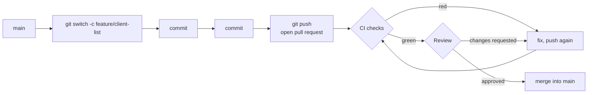

# 02 — An agreed code standard

**Outcomes:** ÕV7 — *kasutab korrektselt kokkulepitud koodistandardit* · **Time:** 2 h in class + ~2 h independent
**Before this lesson:** your project matches the end state of lesson 01 — see [what exists after each lesson](../../PROJECT.md#what-exists-after-each-lesson): project created, PostgreSQL in Docker, layout + home page, pushed to GitHub.
**Walkthroughs:** [Laravel](laravel.md) · [Spring Boot](spring-boot.md)

---

## Why this matters

Read the learning outcome again: *kasutab korrektselt **kokkulepitud** koodistandardit* — "correctly
applies an **agreed** code standard". The key word is **agreed**. A code standard is not a document the
teacher hands out. It is a **decision the team makes together**, writes down in the repository, and then
lets a machine enforce.

Why so much effort for spaces and brackets?

- **Code is read far more often than it is written.** When every file looks the same, your eyes go to
  what the code *does*, not to how it is laid out.
- **Diffs stay small.** If two developers format differently, every commit contains "changes" that are
  only re-indentation. The real change is hidden, and reviews get worse.
- **Arguments end.** Without a standard, code reviews fill up with "put the brace on the next line".
  With a formatter, the machine decides in milliseconds and humans review what matters.
- **It is how teams work.** Almost every company you might join has a formatter in CI. A pull request
  that fails the style check is not merged — nobody even looks at it.

We do it in lesson 02, before there is much code, for a practical reason: adding a standard at the end
produces one giant "reformat everything" commit that proves nothing. From today on, **your Git history
is the evidence for ÕV7**: consistent commit messages, a formatter check in CI on every push, and
reviewed pull requests.

## Today's goal

At the end of class your repository has:

- a **formatter** configured and run over the whole project (Laravel Pint / Spotless with
  google-java-format),
- an **`.editorconfig`** so every editor uses the same basic settings,
- a **`CODESTYLE.md`** with the group's decisions and the date they were agreed,
- a **GitHub Actions workflow** that checks the formatting on every push and pull request,
- one **pull request** that went red because of a formatting error and green after the fix.

By the end you can:

1. explain the difference between a formatter, a linter and a static analyser,
2. name the standard your track follows and the tool that enforces it,
3. write commit messages in the Conventional Commits format,
4. open a pull request and review someone else's code usefully,
5. explain why CI is the gate and a Git hook is only a convenience.

---

## Concepts

### 1. What a code standard covers

A code standard is a set of rules on several levels. Some are checked by machines, some only by people.

| Level | Example rule | Who checks it |
|---|---|---|
| **Layout** | 4 spaces (PHP) / 2 spaces (Java) indentation, one class per file, where braces go | Formatter |
| **Naming** | Classes `UpperCamelCase`, methods `lowerCamelCase`, DB columns `snake_case` | Partly linter, mostly review |
| **Language** | Identifiers, comments and commit messages in English | Review |
| **Constructs** | No unused imports, no `System.out.println` / `dd()` left in code | Linter / static analysis |
| **Design** | No SQL in views, no business logic in controllers | Review (and later: architecture tests) |
| **Process** | Commit message format, branches, pull requests, review before merge | CI, GitHub settings, people |

Machines are good at the top of the table; people are needed for the bottom. The point of automating
the top is to **free human attention for the bottom**.

### 2. Formatter, linter, static analysis

These three tool types are often confused. They answer different questions.

| Tool type | Question it answers | Changes your code? | Laravel track | Spring track |
|---|---|---|---|---|
| **Formatter** | *Does it look right?* (whitespace, line breaks, import order) | Yes — it rewrites the file | Laravel Pint | Spotless + google-java-format |
| **Linter** | *Does it follow our rules?* (naming, forbidden constructs, suspicious patterns) | Usually no — it reports | Pint's rule set covers some; PHP_CodeSniffer | Checkstyle |
| **Static analyser** | *Can this code go wrong?* (wrong types, calling a method that does not exist, null) | No — it reports | PHPStan / Larastan | Error Prone, SpotBugs; the Java compiler itself |

An example of each, in PHP:

```php
// Formatter problem: legal PHP, but not our layout.
public function index() : View { return view('home',['today'=>today()]); }

// Linter problem: formatted fine, but a debugging call was left in.
public function index(): View
{
    dd($request);
    return view('home');
}

// Static analysis problem: looks fine, but $client can be null here.
$client = Client::find($id);
echo $client->name;   // PHPStan level 8: "Cannot access property $name on App\Models\Client|null."
```

A formatter never argues — it just fixes. A linter and a static analyser need a human to decide how to
fix what they found. In class we set up the formatter. Static analysis is the Advanced task.

### 3. The standards behind the tools

**PHP.** The PHP Framework Interop Group (PHP-FIG) publishes standards called PSRs.
**PSR-1** (basic naming) and **PSR-12** (extended coding style) were the common style for years. PSR-12
is now continued as **PER Coding Style** ("PHP Evolving Recommendation"), which is updated when PHP gets
new syntax such as enums or readonly classes. **Laravel Pint** is a formatter built on PHP-CS-Fixer.
Its default **`laravel` preset** is based on PSR-12/PER with some Laravel habits added (for example
imports sorted alphabetically, and a space after the "not" operator: `! $value`). Pint decides these
for you. We use the `laravel` preset
without changes: it is what every Laravel project you meet at work uses.

**Java.** The **Google Java Style Guide** is a complete style guide used by Google and many other
companies. **google-java-format** is a tool that formats code according to that guide, and it is
deliberately **not configurable**: 2-space indentation, 100-character lines, fixed import order. You
cannot argue with it, which is exactly the point. **Spotless** is a build plugin that runs
google-java-format as part of Maven, so formatting is checked by the build itself.

Both choices follow the same principle: **pick a widely used standard and do not customise it**. Every
custom rule is something a new team member must learn, and something the group must maintain.

### 4. Naming conventions

Formatters do not rename anything. Names are your responsibility — and the most important readability
tool you have.

| Thing | PHP / Laravel | Java / Spring | Example (Billable) |
|---|---|---|---|
| Class, interface, enum, record | `UpperCamelCase`, noun | `UpperCamelCase`, noun | `InvoiceGenerator`, `BillingType` |
| Method | `camelCase`, verb | `camelCase`, verb | `calculateVat()`, `findOverlaps()` |
| Boolean method / property | reads as a yes/no question | same | `isDraft()`, `hasBudgetCap()`, `billable` |
| Variable, parameter | `$camelCase` | `camelCase` | `$roundedMinutes`, `hourlyRateCents` |
| Constant | `UPPER_SNAKE_CASE` | `UPPER_SNAKE_CASE` | `VAT_RATE_BP` |
| Enum case | `UpperCamelCase` (`BillingType::Hourly`) | `UPPER_SNAKE_CASE` (`BillingType.HOURLY`) | |
| Namespace / package | `App\Billing` (UpperCamelCase) | `ee.ta25.billable.billing` (lowercase) | |
| Test method | `test_snake_case_sentence` (Laravel default) | `camelCase` or `snake_case` — **group vote** | `test_capped_never_exceeds_cap` |
| DB table | plural `snake_case` | same | `time_entries` |
| DB column | `snake_case` | same | `hourly_rate_cents` |
| URL path | lowercase, plural, hyphens | same | `/clients/7/edit`, `/time-entries` |
| View file | `snake_case` / folder per resource | same | `clients/index.blade.php`, `clients/index.html` |
| Git branch | `type/short-description` | same | `feature/client-list`, `chore/code-standard` |

Good names carry **units and meaning**: `$amountCents` tells you it is an integer number of cents;
`$amount` does not (and in lesson 10 you will see what happens when someone mixes euros and cents).
Avoid abbreviations nobody agreed on (`$cl`, `calcAmt`), and avoid names that say nothing (`$data`,
`$temp`, `Manager`, `doStuff()`).

### 5. English identifiers

All identifiers, comments, commit messages and documentation are in **English**. This is a rule in
Billable's [capstone constraints](../../CAPSTONE.md#hard-constraints) and part of ÕV9.

Why, even in an Estonian school?

- The framework, the libraries and the language keywords are English. Mixed code reads badly:
  `$arve->total()`, `public function kustutaKlient()`, `if ($klient->isActive())`.
- Teams are international. A colleague in Riga or Helsinki must understand your code.
- Estonian letters in identifiers (`$kogusumma_käibemaksuga`) cause real problems in some tools, file
  systems and URLs.

Use the domain words from [PROJECT.md](../../PROJECT.md): *client*, *project*, *time entry*,
*invoice*, *billable*, *rounding*. Using the same words in code, UI and conversation is one of the
simplest ways to avoid misunderstandings.

### 6. EditorConfig

The formatter runs when you ask it to (or in CI). Your editor, however, touches the file every time you
press Enter. **`.editorconfig`** is a small file in the project root that tells every editor (VS Code,
PhpStorm, IntelliJ, and many more — most support it built in) the basic settings for this project:

```ini
# .editorconfig (shortened)
root = true

[*]
charset = utf-8
end_of_line = lf
indent_style = space
insert_final_newline = true
trim_trailing_whitespace = true
```

The most important line for a mixed Windows/macOS group is **`end_of_line = lf`**. Windows editors
traditionally use CRLF (`\r\n`) line endings; macOS and Linux use LF (`\n`). If both kinds get into one
file, every line shows as changed in Git, and shell scripts fail on Linux with strange errors
(`/bin/sh^M: bad interpreter`).

### 7. Conventional Commits

A commit message is a note to your future self and your team: *what* changed and *why*. We use the
**Conventional Commits** format:

```
<type>(<optional scope>): <summary in imperative mood>

<optional body: why this change, what else a reviewer should know>
```

| Type | Use for | Billable example |
|---|---|---|
| `feat` | a new feature for the user | `feat(clients): add paginated client list` |
| `fix` | a bug fix | `fix(invoices): round VAT half up instead of down` |
| `refactor` | code change without changing behaviour | `refactor(time-entries): move rounding into TimeRounding` |
| `test` | adding or changing tests | `test(billing): cover capped strategy at the cap` |
| `docs` | documentation only | `docs: describe request lifecycle` |
| `style` | formatting only, no code change | `style: apply Pint to existing files` |
| `chore` | tooling, dependencies, configuration | `chore: add Spotless with google-java-format` |
| `ci` | CI configuration | `ci: check code style on pull requests` |

Rules:

- **Imperative mood**, like a command: "add", "fix", "remove" — not "added" or "adds". Test: *"If
  applied, this commit will …add paginated client list."*
- Lowercase after the colon, no full stop at the end, keep the first line under ~72 characters.
- The **scope** is the feature: `clients`, `projects`, `time-entries`, `billing`, `invoices`,
  `home`, `ci`. Leave it out when the change is everywhere.
- Use the **body** when the *why* is not obvious: "Rounding down lost one cent on invoices with an odd
  number of minutes (R3)."
- **One logical change per commit.** "feat: add clients and fix nav and update readme" is three commits.

Why a fixed format? Because a history like this can be read in ten seconds — and tools can generate a
changelog from it:

```
$ git log --oneline
a41c9e2 ci: check code style on pull requests
7d0f311 docs: add CODESTYLE.md agreed on 2026-10-07
3be28aa chore: add Pint configuration and editorconfig
e0c5a19 feat(home): add about page
91f4c02 chore: create Laravel project with PostgreSQL and home page
```

compared with `fix`, `asdf`, `changes`, `final version 2`, `wip`.

### 8. Branches and pull requests

Until now you committed directly to `main`. In a team, `main` must always be in a working state, so
work happens on **branches** and reaches `main` through a **pull request** (PR).



1. Start from an up-to-date `main`: `git switch main && git pull`.
2. Create a branch with a descriptive name: `git switch -c feature/client-list`.
3. Commit small steps. Push the branch: `git push -u origin feature/client-list`.
4. On GitHub, open a **pull request** from the branch into `main`. Describe *what* and *why*, and how to
   test it.
5. **CI runs automatically** on the PR. A red check means: fix before anyone reviews.
6. A classmate **reviews** the PR, leaves comments, and approves or requests changes.
7. When CI is green and the review is approved, **merge**. Delete the branch.

A pull request is not bureaucracy. It is the moment where a second person sees the code before it
becomes everyone's problem.

### 9. Code review: what to comment on

The formatter already checked spaces and brackets. **A review comment about formatting means the
tooling is broken** — fix the tooling, not the PR. Spend review time on things machines cannot see:

| Look at | Example comment |
|---|---|
| **Correctness** | "What happens if `ended_at` is before `started_at`? R4 says we must reject that." |
| **Names** | "`$data` → `$unbilledEntries`? I had to read the query to understand what it holds." |
| **Responsibility / layers** | "This calculates VAT in the controller. Could it live in the model layer so it can be tested?" |
| **Missing cases** | "The list has no empty state — what does the page show with zero clients?" |
| **Tests** | "Is there a test for exactly 15 minutes, the boundary of the rounding rule?" |
| **Security** | "`{!! $client->name !!}` outputs raw HTML — a name with `<script>` would run." |
| **Readability of logic** | "This `if` has four conditions. A well-named method (`canBeEdited()`) would explain it." |
| **Docs / English** | "The comment says *what* the code does; could it say *why* instead?" |

How to write a good review comment:

- **Be specific and point at the line.** "This is confusing" helps nobody; say what confused you.
- **Ask, do not command,** when you are not sure: "Could we…?", "What happens if…?"
- **Mark the weight** of the comment: prefix small, optional things with `nit:` ("nit: typo in the
  comment"), and say clearly when something must change before merge.
- **Comment on the code, not the person.** "This method is long", not "you write long methods".
- **Say what is good,** too. It tells the author what to keep doing.

How to receive a review: reply to **every** comment — either change the code (and say "done in
`a1b2c3d`") or explain why you disagree. A review is a conversation, not an exam.

### 10. CI is the gate, hooks are a convenience

**Continuous Integration (CI)** means: every push is built and checked automatically on a server. We use
**GitHub Actions**: a YAML file in `.github/workflows/` describes the steps, and GitHub runs them on a
clean virtual machine for every push and pull request.

A **Git hook** is a script Git runs on *your* machine at certain moments, for example `pre-commit`
before each commit. It gives fast feedback, but:

| | Git hook (pre-commit) | CI (GitHub Actions) |
|---|---|---|
| Where it runs | On your laptop | On GitHub's server |
| Shared with the team? | Only if everyone installs it (hooks are not cloned) | Yes — the workflow file is in the repository |
| Can be skipped? | Yes: `git commit --no-verify` | No (with branch protection, a red check blocks the merge) |
| Clean environment? | No — your local files, your versions | Yes — fresh machine, only what is in Git |
| Purpose | **Convenience**: find problems seconds after you make them | **Gate**: nothing reaches `main` unchecked |

So: **CI is required, a hook is optional.** "It passed on my machine" is exactly what CI protects you
from — for example, a file you forgot to `git add`.

In lesson 02 the CI only checks formatting. Lesson 11 adds the test suite to the same workflow, and
from then on "green CI" means "formatted *and* tested".

### 11. CODESTYLE.md — writing the agreement down

The standard must be **written in the repository**, not remembered. `CODESTYLE.md` in the project root
is short and specific. It records:

1. **When** it was agreed and **by whom** (the group, on a date).
2. **The tools** and the exact commands to format and check.
3. **The rules that tools cannot check**: naming, language, forbidden constructs, layers.
4. **The process**: commit format, branches, review, CI.
5. **The discretionary decisions** the group voted on, with the result.

Most rules come from the standard we adopt; the group does not vote on those. A few items are genuinely
a matter of taste. **For those the group votes in class**, and the result goes into the file:

| Discretionary item | Options |
|---|---|
| Test method names | `test_snake_case` / `camelCase` (with `#[Test]` or `@Test`) |
| Merging pull requests | "Squash and merge" (one commit per PR on `main`) / "Create a merge commit" (keeps every commit) |
| Doc comments | required on every public method / required on public methods of **domain** classes only |

Why vote at all, if the choice hardly matters? **Ownership.** A rule you agreed to is a rule you
follow and defend in a review. A rule you were given is a rule you look for ways around. And the
agreement date shows that the standard existed *before* most of the code — evidence for ÕV7.

---

## Laravel vs Spring Boot

| Idea | Laravel | Spring Boot |
|---|---|---|
| Style standard | PSR-12 / PER + Laravel preset | Google Java Style |
| Formatter | Laravel Pint (`./vendor/bin/pint`) | Spotless + google-java-format (`./mvnw spotless:apply`) |
| Check only (CI) | `./vendor/bin/pint --test` | `./mvnw spotless:check` (runs inside `./mvnw verify`) |
| Configuration | `pint.json` | `<plugin>` in `pom.xml` |
| Indentation | 4 spaces | 2 spaces |
| Static analysis (Advanced) | Larastan (PHPStan) | Checkstyle, Error Prone |
| CI set-up step | `shivammathur/setup-php` | `actions/setup-java` |

## Common mistakes

| Mistake | Why it hurts | What to do instead |
|---|---|---|
| Formatting by hand, "carefully" | Humans are inconsistent; you will miss something and CI turns red | Run the formatter before every commit (or install the hook) |
| One huge `style:` commit mixed with a feature | The reviewer cannot see the real change among 500 whitespace lines | Format in a **separate** commit: `style: apply Pint` |
| Review comments about spacing | Wastes the reviewer's time; the tool should catch it | If the formatter allows it, it is fine. If it matters, change the tool config (as a group) |
| Customising many formatter rules | Every custom rule must be explained, maintained and argued about | Use the preset; change a rule only by group decision, recorded in `CODESTYLE.md` |
| Relying on the pre-commit hook | Hooks are not shared and can be skipped | CI is the gate; the hook is a shortcut |
| Commit messages like `fix`, `wip`, `changes` | History becomes useless for finding when and why something changed | `type(scope): what, in imperative` + body with why |
| Pushing straight to `main` "just this once" | No CI run before the change lands; no review | Always a branch and a PR — even for one line |
| Estonian or mixed-language identifiers | Breaks the English-only rule; hard for others to read | Use the English domain words from PROJECT.md |
| `CODESTYLE.md` copied from the internet | It is not *agreed* — ÕV7 asks for an agreed standard | Write it with the group, record the vote and the date |

---

## Independent work (~2 h)

Solutions are at the bottom of each walkthrough.

### Task 1 — A reviewed pull request · **Basic**

Open a pull request with a real change (for example lesson 01's Task 3 or 4 if you have not done them,
or a "How to run locally" section in your `README.md`). Ask a classmate from the group to review it,
and review one of theirs in return.

Acceptance criteria:
- The PR has a title in Conventional Commits style and a description: what, why, how to test.
- CI is green on the final commit of the PR.
- The reviewer left **at least three comments that are not about formatting** (naming, correctness,
  structure, missing cases, docs…).
- You replied to every comment — with a follow-up commit or an explanation.
- The PR is merged into `main` using the merge method your group voted for, and the branch is deleted.

### Task 2 — Clean commit history habits · **Basic**

Practise the habits that keep history readable. On a new branch, make at least three commits for one
small change, then clean them up **before** you open the PR.

Acceptance criteria:
- You used `git add -p` at least once to commit only part of your changes.
- You fixed a commit message with `git commit --amend` before pushing.
- You combined a "fix typo" commit into the commit it belongs to (interactive rebase with `fixup`).
- `git log --oneline main..HEAD` shows only Conventional Commits messages, each describing one change.
- Add a short **"Commit habits"** section to `CODESTYLE.md` (3–5 bullet points in your own words).

### Task 3 — A shared pre-commit hook · **Intermediate**

Add a pre-commit hook that runs the formatter **check** and blocks the commit if it fails. The hook must
be versioned in the repository so the whole team can use it.

Acceptance criteria:
- The script lives in a committed `hooks/` folder (`hooks/pre-commit`) and is executable.
- `git config core.hooksPath hooks` activates it; `CODESTYLE.md` tells teammates to run this once.
- A commit with a formatting error is refused with a clear message telling the developer which command
  fixes it.
- `CODESTYLE.md` explains in two sentences why the hook does not replace CI.

### Task 4 — Static analysis in CI · **Advanced**

Add a static analysis tool and run it in CI next to the formatter check.

Acceptance criteria:
- Laravel: **Larastan** at **level 5** or higher, configured in `phpstan.neon`, analysing `app/`.
  Spring: **Checkstyle** with a small rule set that does **not** duplicate the formatter (for
  example unused imports, empty catch blocks, `System.out`), or **Error Prone**.
- The tool runs with zero errors on your current code.
- The CI workflow runs it; a deliberate violation makes CI red.
- `CODESTYLE.md` lists the tool, the command, and the level / rules.

---

## Self-check

1. What is the difference between a formatter and a static analyser? Give one example of a problem each
   finds.
2. Which standard does your track follow, and which tool enforces it?
3. Why does ÕV7 say *agreed* standard, and how does your repository prove the agreement?
4. Rewrite as a Conventional Commit: "Fixed the bug where invoice VAT was wrong + some cleanup".
5. A reviewer writes: "Please add a space after the comma on line 12." What does that tell you about
   the project set-up?
6. Your pre-commit hook passed, but CI is red. Name two possible reasons.
7. Why does `end_of_line = lf` matter in a group with Windows and macOS users?

<details>
<summary>Answers</summary>

1. A formatter changes layout (indentation, line breaks, import order); a static analyser reports code
   that can fail, for example calling a property on a value that can be `null`, or a wrong type.
2. Laravel: PSR-12/PER with the Laravel preset, enforced by Pint. Spring: Google Java Style, enforced by
   Spotless with google-java-format.
3. Because a standard only works if the team owns it. `CODESTYLE.md` with an agreement date and the
   recorded vote, plus the CI check that enforces it on every commit after that date.
4. Two commits: `fix(invoices): calculate VAT from the rounded subtotal` and a separate
   `refactor(...)` or `style: ...` for the cleanup. (One logical change per commit.)
5. The formatter is not doing its job — either it is not run in CI, or its rules differ from what the
   group expects. Fix the tooling, not the PR.
6. A file was not committed (works locally, missing on the server); the hook was skipped with
   `--no-verify`; a different tool version; the hook only checks part of what CI checks.
7. Mixed line endings make every line look changed in Git diffs, and scripts with CRLF fail on Linux
   (the CI server).

</details>

## Checklist

- [ ] Formatter configured; running it on the whole project changes nothing (everything is formatted)
- [ ] `.editorconfig` in the project root
- [ ] `CODESTYLE.md` with agreement date, tools and commands, naming table, rules, commit format, review
      process and the group's votes
- [ ] `.github/workflows/` runs the formatter check on every push and pull request
- [ ] The Actions tab shows one red run caused by a formatting error, and the green run after the fix
- [ ] All commits since this lesson follow Conventional Commits
- [ ] **ÕV7:** at least one pull request reviewed by a classmate with non-formatting comments
- [ ] **ÕV7:** I can explain what each tool checks and why CI, not a hook, is the gate

## Further reading

- PHP: [PSR-12](https://www.php-fig.org/psr/psr-12/) · [PER Coding Style](https://www.php-fig.org/per/coding-style/) · [Laravel Pint](https://laravel.com/docs/12.x/pint) · [Larastan](https://github.com/larastan/larastan) · [PHPStan rule levels](https://phpstan.org/user-guide/rule-levels)
- Java: [Google Java Style Guide](https://google.github.io/styleguide/javaguide.html) · [google-java-format](https://github.com/google/google-java-format) · [Spotless Maven plugin](https://github.com/diffplug/spotless/tree/main/plugin-maven) · [Checkstyle](https://checkstyle.org/)
- [EditorConfig](https://editorconfig.org/) · [Conventional Commits 1.0.0](https://www.conventionalcommits.org/en/v1.0.0/)
- GitHub: [About pull request reviews](https://docs.github.com/en/pull-requests/collaborating-with-pull-requests/reviewing-changes-in-pull-requests/about-pull-request-reviews) · [GitHub Actions documentation](https://docs.github.com/en/actions)
- Git: [git-rebase](https://git-scm.com/docs/git-rebase) · [githooks](https://git-scm.com/docs/githooks)
