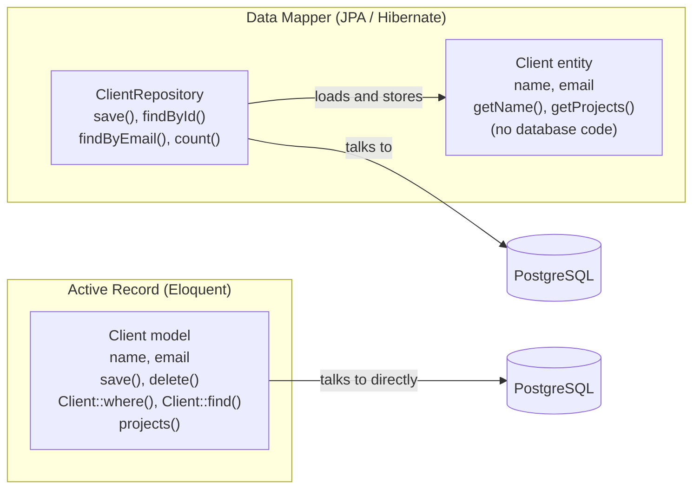
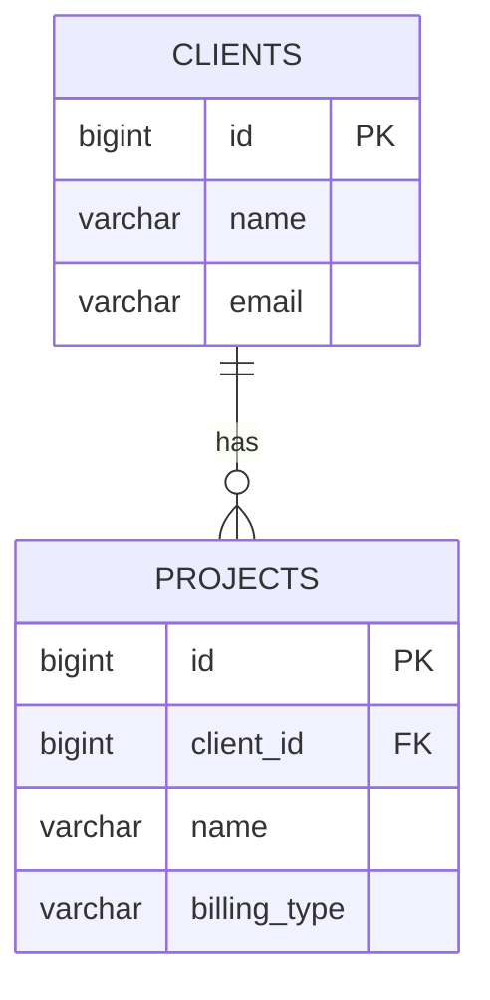

# 03 — ORM basics: models and migrations

**Outcomes:** ÕV4 — *kasutab parimate praktikate kohaselt ORM vahendeid* · **Time:** 2 h in class + ~2 h independent
**Before this lesson:** your project matches the end state of lesson 02 (see [what exists after each lesson](../../PROJECT.md#what-exists-after-each-lesson))
**Walkthroughs:** [Laravel](laravel.md) · [Spring Boot](spring-boot.md)

---

## Why this matters

Almost every business application is a thin layer of rules on top of a database. Billable is no
different: clients, projects, time entries and invoices all live in PostgreSQL tables. Your code must
read and write those tables all the time — and it must do it safely, in a way your colleagues can
understand, and in a way that still works after the schema changes for the tenth time.

An **ORM** is the tool that sits between your objects and the tables. At work you will meet one in
nearly every project: Eloquent in Laravel, Hibernate in Spring, Doctrine in Symfony, Entity Framework
in .NET. If you use it well, you write less code and make fewer mistakes. If you use it without
understanding it, it quietly runs hundreds of queries, loads data you did not ask for, or lets a user
change a field they should never touch.

Today you create the first two tables of Billable — `clients` and `projects` — and learn the habits that
make an ORM safe: **every schema change is a migration**, **you always know which SQL runs**, and **you
decide which fields can be filled from the outside**.

## Today's goal

At the end of class your project has:

- two migrations that create `clients` and `projects` exactly as described in [PROJECT.md](../../PROJECT.md#data-model),
- a `Client` model/entity and a `Project` model/entity, connected by a one-to-many relationship,
- a `BillingType` enum (`hourly`, `fixed`, `capped`) stored as a lowercase string,
- seed data: 3 clients with 7 projects, at least one of each billing type, one archived project,
- a home page that shows how many clients and projects exist — the first real data on screen.

By the end you can:

- explain what an ORM does and what it cannot hide from you,
- explain the difference between the **Active Record** and **Data Mapper** patterns,
- write a migration, run it, and explain why you never edit one that has already run,
- write simple queries with your ORM and show the SQL it produces.

---

## Concepts

### 1. What an ORM is

**ORM** means *Object–Relational Mapping*. Your program thinks in **objects**: a `Client` object with a
`name` and a list of `projects`. The database thinks in **relations** (tables): rows and columns, linked
by foreign keys. An ORM translates between the two worlds.

```
   Your code (objects)                       Database (tables)
 ┌──────────────────────┐               ┌──────────────────────────────┐
 │ Client               │   ORM maps    │ clients                      │
 │  name  = "Acme OÜ"   │ ◄───────────► │ id | name    | email | ...   │
 │  projects = [p1, p2] │               │  1 | Acme OÜ | ...           │
 └──────────────────────┘               ├──────────────────────────────┤
 ┌──────────────────────┐               │ projects                     │
 │ Project              │ ◄───────────► │ id | client_id | name | ...  │
 │  client = (Client)   │               │  1 |         1 | Website ... │
 └──────────────────────┘               └──────────────────────────────┘
```

Without an ORM you write SQL strings by hand, send them to the database, and copy each column of the
result into an object yourself. With an ORM you write `Client::find(1)` or `clientRepository.findById(1L)`
and get a ready object.

#### The object–relational impedance mismatch

Objects and tables are not the same shape. The name for this problem is the **object–relational
impedance mismatch** (a term borrowed from electrical engineering: two parts that do not "fit" lose
energy between them). The ORM hides some of the gap, but not all of it.

| In objects | In tables | What the ORM must do |
|---|---|---|
| An object points to another object (`project.client`) | A row stores a number (`client_id`) | Load the other row when you follow the reference — this costs a query |
| A list inside an object (`client.projects`) | No lists in a row; the "list" is all rows in another table with a matching foreign key | Run a separate query to fill the list |
| Identity: two variables can point to the same object | Identity: the primary key | Decide whether two loads of row 1 give the same object or two copies |
| Rich types: enums, money, dates with time zones | A few basic types: integer, varchar, timestamp | Convert every value on the way in and out |
| Inheritance (`class A extends B`) | No inheritance | Choose a mapping strategy (we avoid inheritance in entities) |
| You change fields in memory | Changes exist only after `UPDATE` runs | Track what changed and write it back |

The most important line is the first one. **Following a reference can run a query.** The ORM makes that
look like reading a normal property. This is convenient, and it is also the source of the most common
ORM performance bug, the **N+1 problem** (lesson 06). Keep this in mind from day one.

### 2. Two patterns: Active Record and Data Mapper

Both frameworks in this module use an ORM, but they use **different patterns**. The names come from
Martin Fowler's book *Patterns of Enterprise Application Architecture* (2002).

**Active Record** — the object knows how to save itself. The model class *is* a row of the table, and
it has methods like `save()`, `delete()` and static query methods like `where()`. **Eloquent** (Laravel)
works this way.

**Data Mapper** — the object knows nothing about the database. A separate object (the *mapper*; in
Spring it is the `EntityManager`, and you usually talk to it through a **repository**) loads and saves
it. **JPA/Hibernate** (Spring) works this way.



The same task in both styles:

```php
// Laravel — Active Record: the model saves itself
$client = new Client(['name' => 'Acme OÜ', 'email' => 'billing@acme.test']);
$client->save();

$found = Client::where('email', 'billing@acme.test')->first();
```

```java
// Spring — Data Mapper: the repository saves the entity
var client = new Client("Acme OÜ", "billing@acme.test", null);
clientRepository.save(client);

Optional<Client> found = clientRepository.findByEmail("billing@acme.test");
```

| | Active Record (Eloquent) | Data Mapper (JPA/Hibernate) |
|---|---|---|
| Who knows about the database? | The model itself | A separate mapper / repository |
| How you query | Static methods on the model: `Client::where(...)` | Methods on a repository: `clientRepository.findBy...(...)` |
| How columns are declared | Not declared in the class; read from the table at runtime | Declared as fields with annotations |
| Easy to start with? | Very — little code | More code, more rules |
| Easy to test the class without a database? | Harder — the class *is* database access | Easier — the entity is a plain object |
| Typical risk | Queries spread everywhere (controllers, views) | Hidden complexity: lazy loading, persistence context |

Neither pattern is "right". Active Record is excellent for applications where the domain looks like
the tables. Data Mapper pays off when the domain logic becomes rich and you want it separate from
storage. **We return to this comparison in lesson 08**, where you add a Repository to the Laravel side
and write up the trade-off. For now: learn to recognise which one you are using.

### 3. Migrations: version control for the schema

A **migration** is a small file that describes one change to the database schema: "create table
`clients`", "add column `budget_warning_sent_at`", "add a check constraint". Migrations are stored in
Git next to your code and run in order.

```
 Git history of your code:   commit A ─── commit B ─── commit C ─── commit D
                                │             │                        │
 Migrations in the repo:     create_clients  create_projects        add_rounding_check
                                ▼             ▼                        ▼
 Database schema:            v1 ────────────► v2 ─────────────────────► v3
```

The framework keeps a table in the database that records which migrations have already run
(`migrations` in Laravel, `flyway_schema_history` in Flyway). When you start the migration command, it
compares the files with that table and runs only the new ones.

Why this matters:

- **Every copy of the database is built the same way.** Your laptop, your classmate's laptop, the CI
  server and production all get the same schema by running the same files.
- **The schema has a history.** You can see in Git when a column was added and why.
- **A fresh clone works.** The capstone rule "the test suite passes on a fresh clone" is impossible
  without migrations.

Two rules follow, and both are **hard rules** in this module (see [CAPSTONE.md](../../CAPSTONE.md#hard-constraints)):

1. **Never change the database by hand.** No "I'll just add the column in pgAdmin". If the change is not
   in a migration, it does not exist for anyone else, and the next fresh install will break.
2. **Never edit a migration that has already run** — on your machine, on a classmate's, or anywhere
   else. The migration tool will not run it again, so your edit changes nothing on existing databases,
   and now the databases disagree. Flyway even stores a checksum of each file and refuses to start if an
   applied file changed. **To change the schema, write a new migration.**

The only exception: a migration you wrote five minutes ago, that has never left your machine. You may
roll it back, edit it and run it again. Once it is pushed, it is history.

> **Schema versus data.** The rules above are about the *schema* (tables, columns, constraints). Adding
> some test rows to your local development database is not a schema change. Still, prefer a seeder for
> that too — then everyone gets the same test data.

Laravel writes migrations in PHP (`Schema::create(...)`), which it translates to SQL for your database.
Flyway uses plain SQL files named `V1__create_clients.sql`, `V2__create_projects.sql`. The idea is the
same.

### 4. Naming conventions

Both frameworks can guess a lot if you follow the conventions. PROJECT.md follows them, so you rarely
need to configure anything.

| Thing | Convention | Billable example |
|---|---|---|
| Table | plural, `snake_case` | `clients`, `projects`, `time_entries` |
| Model / entity class | singular, `PascalCase` | `Client`, `Project`, `TimeEntry` |
| Primary key | `id`, 64-bit integer (`bigint`) | `clients.id` |
| Foreign key column | singular table name + `_id` | `projects.client_id` |
| Columns | `snake_case` | `hourly_rate_cents`, `archived_at` |
| Timestamp columns | `created_at`, `updated_at`, and `…_at` for "when did it happen" | `archived_at` |
| Money columns | `bigint`, name ends in `_cents` | `budget_cap_cents` |
| Pivot table (many-to-many, lesson 06) | both singular names, alphabetical | `tag_time_entry` |

Eloquent guesses the table `clients` from the class `Client`. JPA does not pluralise, so the Spring
entity says `@Table(name = "clients")` explicitly. Spring Boot does turn the field `hourlyRateCents` into
the column `hourly_rate_cents` automatically.

The `_at` suffix is a small but useful habit: `archived_at` is `NULL` when the project is active and a
timestamp when it was archived. One column gives you both "is it archived?" and "since when?". A
boolean `is_archived` gives you only the first.

### 5. Mapping types

Every column has a database type and a type in your language. Choose them on purpose.

| Data | Column type | PHP | Java | Why |
|---|---|---|---|---|
| Id | `bigint` | `int` | `Long` | 64-bit; never runs out |
| Name, email | `varchar(n)` | `string` | `String` | The length limit is also a validation rule |
| Money | `bigint` (cents) | `int` | `Long` in the entity (nullable), `long` in calculations | See below |
| Rounding minutes | `smallint` | `int` | `short` | Only 1, 6 or 15; `smallint` is enough |
| Point in time | `timestamp` | `Carbon` (via cast) | `LocalDateTime` | Dates are objects, not strings |
| Billing type | `varchar(20)` holding `hourly`/`fixed`/`capped` | backed `enum` | `enum` + converter | See below |

**Money in integer cents.** Business rule R1: never store money as `float`/`double`. Floating-point
numbers cannot represent most decimal fractions exactly. In PHP, `0.1 + 0.2 == 0.3` is `false`. On an
invoice, a one-cent error is a real bug that a customer will find. So €65.00 is stored as the integer
`6500`. The column type is `bigint` (a 64-bit integer). A 32-bit `integer` would stop at 2 147 483 647
cents — about 21 million euros — and a sum of many invoice totals can pass that; `bigint` removes the
question. PHP's `int` is 64-bit, and Java uses `long`, so both languages match the column exactly.
Lesson 10 wraps the cents in a `Money` class; until then they are plain integers.

**Enums as strings, not numbers.** An enum can be stored as its position (an *ordinal*: hourly = 0,
fixed = 1, capped = 2) or as its name. Always store the name. With ordinals, the database contains
`0, 1, 2`, which means nothing when you read it. Worse: if someone adds a new case in the middle of the
enum, or sorts the cases alphabetically, every existing row silently changes meaning — all "fixed"
projects become "capped", and no error appears. With strings, the row says `fixed`, and it stays
`fixed`. Billable stores lowercase strings (`hourly`, `fixed`, `capped`), the same in both tracks.

### 6. One-to-many: a client has many projects

A client can have many projects; each project belongs to exactly one client. In the database this is
one foreign key column on the "many" side:



In code you describe the relationship **on both sides**, so you can navigate both ways:

| | Laravel | Spring Boot |
|---|---|---|
| Client → projects | `hasMany(Project::class)` | `@OneToMany(mappedBy = "client") List<Project> projects` |
| Project → client | `belongsTo(Client::class)` | `@ManyToOne(fetch = LAZY) @JoinColumn(name = "client_id") Client client` |
| Who "owns" the foreign key | `projects.client_id` | the `@ManyToOne` side; `mappedBy` means "the other side owns it" |

The foreign key says `ON DELETE RESTRICT`: the database refuses to delete a client who still has
projects. That is a business decision — you do not want to lose a project's history by deleting a client
by accident. The database enforces it even if the application has a bug.

This is only the first contact. Lesson 06 goes deep: many-to-many, eager loading, the N+1 problem.

### 7. Mass assignment

In Laravel you can create or update a model from an array in one call:

```php
Client::create($request->all()); // DANGEROUS without protection
```

This is **mass assignment**: assigning many attributes at once from outside data. The danger is that the
user controls the array. If the form has fields `name` and `email`, an attacker can add a field
`archived_at` or `client_id` to the request with the browser's developer tools, and your code would
save it too.

Eloquent protects you with an **allow-list**. Only attributes listed in `$fillable` can be mass
assigned; anything else is **silently dropped** by default. Because silent is hard to debug, the
walkthrough turns on `Model::preventSilentlyDiscardingAttributes()` outside production, so a dropped key
throws an exception during development and tests.

```php
protected $fillable = ['name', 'email', 'vat_number'];
```

Rules: list only the fields a user may set through a form. Keep `id`, foreign keys you set from the URL,
and state fields like `archived_at` out of `$fillable`. Never use `$guarded = []` ("nothing is guarded")
in a real project. In lesson 05 you combine `$fillable` with `$request->validated()` — then only
validated, allowed fields reach the model.

Spring has the same risk in a different form: if you bind a request directly onto an entity, a user can
set any field that has a setter. That is why lesson 05 uses a separate form class (`ClientForm`) with
exactly the fields the form shows, and copies them onto the entity by hand.

### 8. Seeding and factories

An empty database is useless for development. A **seeder** fills it with known test data. A
**factory** knows how to build one valid example object, with sensible default values, so you can
create many of them quickly and override only what matters for the test.

```php
// A factory builds valid objects; you override what you care about
Project::factory()->for($acme)->fixed(150000)->create(['name' => 'Logo and brand book']);
```

Seed data is **not a migration**. Migrations run in every environment, production included; seed data is
fake and belongs only in development. Laravel keeps it in `database/seeders`. In Spring we use a small
runner class that is active only with the `dev` profile.

Billable's seed data is small and **fixed** (no random names), so the practice queries below have known
answers:

| Client | Project | Billing type | Amounts | Rounding | Archived |
|---|---|---|---|---|---|
| Acme OÜ | Website redesign | hourly | €65.00/h | 15 | no |
| Acme OÜ | Support retainer | capped | €60.00/h, cap €2 000.00 | 6 | no |
| Acme OÜ | Old intranet | hourly | €50.00/h | 1 | **yes** |
| Birch & Daughters | Logo and brand book | fixed | €1 500.00 | 1 | no |
| Birch & Daughters | Webshop maintenance | hourly | €55.00/h | 15 | no |
| Kuressaare Kala AS | Stock app MVP | fixed | €4 800.00 | 15 | no |
| Kuressaare Kala AS | Data migration | capped | €70.00/h, cap €3 500.00 | 6 | no |

Acme OÜ has VAT number `EE101234567`, Kuressaare Kala AS has `EE100987654`, Birch & Daughters has none.

### 9. Reading the SQL the ORM produces

**You are responsible for every query your code runs**, even if you did not write the SQL. At the
defence you will be asked: "What SQL does this line run?" Both frameworks can show it:

| | Laravel | Spring Boot |
|---|---|---|
| Show the SQL of one query without running it | `->toSql()`, or `->toRawSql()` with values filled in | — |
| Log every query that runs | `DB::enableQueryLog()` then `DB::getQueryLog()`, or `DB::listen(...)` | `logging.level.org.hibernate.SQL=debug` |
| Show the bound values | included in the query log | `logging.level.org.hibernate.orm.jdbc.bind=trace` |

Example — the same question in both frameworks, and the SQL it becomes:

```php
Project::where('billing_type', 'hourly')->orderBy('name')->get();
// select * from "projects" where "billing_type" = ? order by "name" asc
```

```java
projectRepository.findByBillingTypeOrderByName(BillingType.HOURLY);
// select p1_0.id, p1_0.billing_type, ... from projects p1_0 where p1_0.billing_type=? order by p1_0.name
```

The `?` is a **bound parameter**. The value (`hourly`) is sent to the database separately from the SQL
text. This is what protects you against SQL injection: user input is never pasted into the SQL string.

Make it a habit: when you write a new query, look at the SQL once.

### 10. Best-practice rules

| Rule | Why |
|---|---|
| Every schema change is a new migration | Every database gets the same schema; the history is in Git |
| Never edit an applied migration | Existing databases will not re-run it and will disagree with the file |
| Never change the schema by hand | Your change disappears on the next fresh install |
| Spring: `ddl-auto=validate`, never `update` or `create` | The ORM checks the schema at startup but never changes it; migrations stay the only source of truth |
| Follow the naming conventions | Less configuration, fewer surprises for the next developer |
| Money as integer cents | Floats cannot represent cents exactly (R1) |
| Enums as strings | Adding or reordering enum cases must not change existing data |
| Constraints in the database too (`NOT NULL`, `UNIQUE`, FK, `CHECK`) | The database protects the data even when the application has a bug |
| An allow-list for mass assignment | Users must not set fields the form does not show |
| Look at the SQL of every new query | You must be able to explain what runs, and how many times |
| Seed data in seeders, not in migrations | Production must never contain fake clients |

---

## Laravel vs Spring Boot

| Idea | Laravel | Spring Boot |
|---|---|---|
| ORM pattern | Active Record (Eloquent) | Data Mapper (JPA / Hibernate) |
| Class for a row | Model `App\Models\Client` | Entity `client.Client` |
| Where queries live | On the model: `Client::where(...)` | In a repository interface: `ClientRepository` |
| Migration format | PHP class with `up()` / `down()` | SQL file `V1__create_clients.sql` |
| Run migrations | `php artisan migrate` | Automatically at application start (Flyway) |
| Migration history table | `migrations` | `flyway_schema_history` |
| Enum mapping | backed enum + `casts()` | `@Enumerated(EnumType.STRING)` + `@EnumeratedValue` on the enum |
| Mass-assignment guard | `$fillable` | Separate form class (lesson 05) |
| Test data | Factories + `DatabaseSeeder` | `DevDataSeeder` runner, `dev` profile |
| Interactive queries | `php artisan tinker` | Temporary runner class, or the home page |

---

## Common mistakes

| Mistake | Why it hurts | What to do instead |
|---|---|---|
| Editing an old migration to "fix" a column | Databases that already ran it keep the old column; Flyway refuses to start (checksum mismatch) | Write a new migration that changes the column |
| Adding a column in pgAdmin / DBeaver "just for now" | Nobody else has it; a fresh clone breaks; the capstone rule is broken | Write a migration |
| Spring: `ddl-auto=update` | Hibernate changes the schema silently, never drops or renames, and there is no history | `validate` plus Flyway |
| Storing money as `decimal` in PHP floats or `double` in Java | Rounding errors appear on invoices | Integer cents |
| `@Enumerated(EnumType.ORDINAL)` or no enum mapping at all | Reordering the enum corrupts every row | String values (`hourly`) via `@EnumeratedValue` or a backed enum |
| `$guarded = []` or putting every column in `$fillable` | Users can set `archived_at`, `client_id` or future sensitive fields | List only the fields the form may set |
| Seed data in a migration | Fake clients appear in production | Seeder (Laravel) / `dev`-profile runner (Spring) |
| Random factory data in seeders used for exercises | Everyone gets different results; tests become unpredictable | Fixed values for anything you check |
| Never looking at the generated SQL | You cannot explain your code at the defence; N+1 problems go unnoticed | `toSql()`, query log, `org.hibernate.SQL=debug` |
| Spring: `@ManyToOne` without `fetch = LAZY` | The JPA default is EAGER: every project load also loads its client, always | Always write `fetch = FetchType.LAZY` |

---

## Independent work (~2 h)

Do these at home after the walkthrough, in your own project (~2 h). Tasks build on each other across lessons, so finish at least the **Basic** ones. Solutions are at the bottom of the [Laravel](laravel.md#independent-work--solutions) and [Spring Boot](spring-boot.md#independent-work--solutions) walkthroughs — try first, compare after.

Your seed data must match the table in [section 8](#8-seeding-and-factories). Reset the database first
(Laravel: `php artisan migrate:fresh --seed`; Spring: see the walkthrough), so the expected results below
are correct.

### Basic 1 — Practice queries

Write each query with your ORM (Laravel: in Tinker; Spring: as repository methods called from a temporary
runner). For each one, **write down the SQL it produced**. Keep the queries and the SQL in a file
`docs/queries-lesson-03.md`.

| # | Question | Expected result |
|---|---|---|
| Q1 | All client names, sorted A–Z | Acme OÜ, Birch & Daughters, Kuressaare Kala AS |
| Q2 | How many projects exist? | 7 |
| Q3 | Names of all hourly projects, sorted A–Z | Old intranet, Webshop maintenance, Website redesign |
| Q4 | Projects whose hourly rate is €60.00 or more | Data migration (7000), Support retainer (6000), Website redesign (6500) — 3 projects |
| Q5 | Clients without a VAT number | Birch & Daughters |
| Q6 | Archived projects | Old intranet |
| Q7 | How many projects does Acme OÜ have? (find the client by email `billing@acme.test` first) | 3 |
| Q8 | The fixed-price project with the highest price | Stock app MVP (480000 cents) |

**Acceptance criteria:** all 8 results match; for each query you can show the SQL; no query loads all
rows into memory to filter or count them in PHP/Java.

### Basic 2 — `Project` query methods

Add reusable query methods for projects, so later lessons do not repeat the same conditions:

1. **Active projects of a client** — projects of one client where `archived_at` is `NULL`, sorted by
   name.
2. **Projects by billing type** — all projects with a given `BillingType`, sorted by name.

Laravel: local query scopes on `Project` (`active()`, `ofBillingType(BillingType $type)`) that you can
chain, e.g. `$client->projects()->active()->get()`. Spring: derived query methods on
`ProjectRepository`.

**Acceptance criteria:** for Acme OÜ the first method returns 2 projects (Support retainer, Website
redesign); for `BillingType::Capped` / `BillingType.CAPPED` the second returns 2 projects (Data migration,
Support retainer). The methods take the enum, not a string.

### Intermediate — A check constraint for `rounding_minutes`

The business rule says rounding is 1, 6 or 15 minutes (R5). Right now the database accepts any number.
Add a **new migration** that adds a `CHECK` constraint: `rounding_minutes IN (1, 6, 15)`.

**Acceptance criteria:** the constraint is added by a new migration (you did not edit the old one);
inserting or updating a project with `rounding_minutes = 5` fails with a check-constraint violation;
the seed data still loads. Laravel: the migration has a working `down()`.

### Advanced — When would you use raw SQL?

Write half a page (in `docs/queries-lesson-03.md`): **when would you write raw SQL instead of using the
ORM?** Give at least three situations and one realistic example from Billable, implemented and working —
pick something the ORM cannot express well, for example "number of new projects per week for the last 8
weeks, including weeks with none" (PostgreSQL `generate_series` + `LEFT JOIN` + `GROUP BY`). A simple
count or sum per client is **not** a good example: Eloquent has `withCount()`/`withSum()` and JPQL can
do it with a projection. Explain how you pass parameters safely.

**Acceptance criteria:** at least three situations with a reason each; one working raw query that uses
bound parameters (no string concatenation of values); you state one downside of raw SQL.

---

## Self-check

1. What is the difference between Active Record and Data Mapper? Which one does your framework use?
2. You notice a typo in a column name in a migration that your classmates have already pulled and run. What do you do?
3. Why is `billing_type` stored as `'fixed'` and not as `1`?
4. What does `$fillable` protect against? Give a Billable example of a field that must not be in it.
5. Why is seed data not a migration?
6. `Project::where('name', $name)->get()` — what does the SQL look like, and why is `$name` not inside it?
7. Why does the foreign key `projects.client_id` use `ON DELETE RESTRICT`?

<details>
<summary>Answers</summary>

1. In Active Record, the model class itself reads and writes the database (`$client->save()`,
   `Client::where()`). In Data Mapper, the entity is a plain object and a separate mapper/repository loads
   and saves it. Laravel's Eloquent is Active Record; JPA/Hibernate is Data Mapper.
2. Write a **new** migration that renames the column. Editing the old one would not change the databases
   where it already ran, and Flyway would refuse to start because of the changed checksum.
3. A string keeps its meaning if enum cases are added or reordered; a number (ordinal) would silently
   point to a different case. It is also readable when you look at the table.
4. Mass assignment: a user sending extra fields in a request that the code then saves. `archived_at`,
   `client_id` (set from the URL), `id`, later `budget_warning_sent_at`.
5. Migrations run in every environment including production; seed data is fake and belongs only in
   development.
6. `select * from "projects" where "name" = ?` — the value is sent separately as a bound parameter,
   which prevents SQL injection.
7. So a client with projects cannot be deleted by accident; the database enforces the rule even if the
   application forgets to check.

</details>

---

## Checklist

- [ ] `clients` and `projects` exist with exactly the columns and types in PROJECT.md (ÕV4)
- [ ] Both tables were created by migrations; nothing was changed by hand (ÕV4)
- [ ] `Client` and `Project` exist, with the relationship on both sides (ÕV4)
- [ ] `BillingType` exists and is stored as `hourly` / `fixed` / `capped` (ÕV4)
- [ ] Seed data loads with one command and matches the table in section 8
- [ ] The home page shows the number of clients and projects
- [ ] You can show the SQL of any query you wrote today (ÕV4)
- [ ] The formatter check passes and your commits have clear messages (ÕV7)
- [ ] Independent: 8 practice queries with SQL, `Project` query methods

---

## Further reading

- Laravel: [Eloquent: Getting Started](https://laravel.com/docs/eloquent) ·
  [Migrations](https://laravel.com/docs/migrations) ·
  [Eloquent: Relationships](https://laravel.com/docs/eloquent-relationships) ·
  [Factories](https://laravel.com/docs/eloquent-factories) · [Seeding](https://laravel.com/docs/seeding)
- Spring: [Spring Data JPA reference](https://docs.spring.io/spring-data/jpa/reference/) ·
  [Spring Boot — SQL databases](https://docs.spring.io/spring-boot/reference/data/sql.html) ·
  [Spring Boot — database initialization and Flyway](https://docs.spring.io/spring-boot/how-to/data-initialization.html)
- PostgreSQL: [Constraints](https://www.postgresql.org/docs/17/ddl-constraints.html) ·
  [Numeric types](https://www.postgresql.org/docs/17/datatype-numeric.html)
- Patterns: [Active Record](https://martinfowler.com/eaaCatalog/activeRecord.html) ·
  [Data Mapper](https://martinfowler.com/eaaCatalog/dataMapper.html) (Martin Fowler's catalogue)
- Security: [OWASP Mass Assignment Cheat Sheet](https://cheatsheetseries.owasp.org/cheatsheets/Mass_Assignment_Cheat_Sheet.html)
