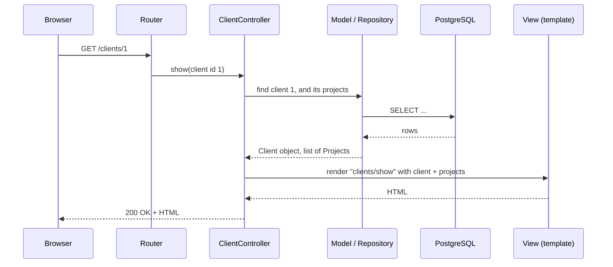

# 04 — MVC: controllers and views

**Outcomes:** ÕV3 — *realiseerib rakenduse MVC arhitektuuriga rakendusena* · **Time:** 2 h in class + ~2 h independent
**Before this lesson:** your project matches the end state of lesson 03 (see [what exists after each lesson](../../PROJECT.md#what-exists-after-each-lesson))
**Walkthroughs:** [Laravel](laravel.md) · [Spring Boot](spring-boot.md)

---

## Why this matters

In lesson 03 you put data into the database. Now users need to **see** it: a list of clients, a page for
one client with its projects. This is the part of a web application people actually use, and it is where
code gets messy fastest. Most legacy code you will meet at work has a "controller" of 800 lines with SQL,
calculations and HTML mixed together. Nobody dares to change it, because nobody can see what depends on
what.

**MVC** (Model–View–Controller) is the rule that prevents this. Each part of the code has one job, and
you can point at any line and say which part it belongs to. At the defence the teacher will open a
controller and ask "why is this here?" — after today you can answer.

Today is about **reading** data: lists, detail pages, pagination and "not found". Lesson 05 adds forms
(writing data).

## Today's goal

At the end of class your project has:

- `/clients` — a list of clients, 10 per page, sorted by name, with the number of projects per client,
- `/clients/{id}` — one client's details and the list of their projects, with amounts in euros,
- a proper **404 page** for a client id that does not exist,
- a "Clients" link in the navigation, and every page ready to show flash messages (lesson 05 sends them).

By the end you can:

- say what belongs in a controller, a view and a model — and what does not,
- name the seven RESTful routes of a resource and their HTTP verbs,
- explain how the framework turns `/clients/7` into a `Client` object, or into a 404,
- explain why `{{ }}` / `th:text` protect you from XSS,
- explain why lists are paginated.

---

## Concepts

### 1. MVC: three parts, three jobs



| Part | Its job | Allowed | Not allowed |
|---|---|---|---|
| **Controller** | Receive the request, ask the model for data, choose a view | Read route parameters and query strings; call models/repositories (until lesson 07, then services); return a view, redirect or error | Business rules, calculations, HTML, SQL strings |
| **View** | Display the data it was given | Loops, `if` for display, formatting (dates, euros), links | Queries, changing data, business decisions |
| **Model** | Represent the data and its simple rules | Relationships, casts, small rules about one object (`isArchived()`) | Knowing about HTTP, requests or HTML |

A good controller method is **short** — often 3–6 lines. It reads like a sentence: "find the client,
find their projects, show them on the client page".

**Why no queries in views?** Three reasons:

1. **Hidden cost.** A query inside a loop in the view runs once per row. The controller looks innocent,
   the page is slow, and nobody sees why. (This is the N+1 problem — lesson 06.)
2. **Testing.** You can test a controller's data without rendering HTML. You cannot easily test a query
   hidden inside a template.
3. **Change.** When the data comes from somewhere else later (a service in lesson 07, a cache, an API),
   only the controller changes. The view does not care where the data came from.

In the Spring track the framework even enforces this: we set `open-in-view=false` in lesson 03, so a
view that touches a lazy relation fails with an exception instead of silently running a query.

### 2. Routing and RESTful resource names

A **route** maps an HTTP method + URL to a controller method. A **resource** is a thing the user works
with — here, clients. There is a widely used convention for the routes of a resource, based on REST
(*Representational State Transfer*): the URL names the thing (a noun, plural), the HTTP verb says what
to do with it.

| Action | Verb | URL | Laravel route name / method | Spring mapping | What it does |
|---|---|---|---|---|---|
| index | GET | `/clients` | `clients.index` / `index()` | `@GetMapping("/clients")` | List clients |
| create | GET | `/clients/create` | `clients.create` / `create()` | `@GetMapping("/clients/new")` | Show empty form |
| store | POST | `/clients` | `clients.store` / `store()` | `@PostMapping("/clients")` | Save new client |
| show | GET | `/clients/{client}` | `clients.show` / `show()` | `@GetMapping("/clients/{id}")` | Show one client |
| edit | GET | `/clients/{client}/edit` | `clients.edit` / `edit()` | `@GetMapping("/clients/{id}/edit")` | Show filled form |
| update | PUT/PATCH | `/clients/{client}` | `clients.update` / `update()` | `@PostMapping("/clients/{id}")` | Save changes |
| destroy | DELETE | `/clients/{client}` | `clients.destroy` / `destroy()` | `@PostMapping("/clients/{id}/delete")` | Delete |

Today we build only **index** and **show**. The other five come in lesson 05. Two notes:

- HTML forms can only send GET and POST. Laravel fakes PUT and DELETE with a hidden `_method` field. In the
  Spring track we use plain POST URLs for update and delete, which is simpler and just as common; lesson 05
  explains why.
- Spring has no fixed convention for "create", so we use `/clients/new`; Laravel's is `/clients/create`.
  Both are fine — what matters is that one project uses one convention.

**Bad route names** use verbs: `/getClients`, `/showClient?id=7`, `/deleteClient/7`. The verb is already in
the HTTP method.

**Nested resources.** A project always belongs to a client, so its list can live "inside" the client:
`/clients/7/projects`. But a single project has its own id, so its page does not need the client id:
`/projects/12`. This is called **shallow nesting**: nest only where the parent is needed. (That is your
independent work.)

### 3. From an id in the URL to an object — or a 404

The URL `/clients/7` contains the id `7`. The controller needs the `Client` with that id, or a 404 page if
there is none. Both frameworks help:

```php
// Laravel — route model binding: the type hint does the lookup
public function show(Client $client): View
{
    // Laravel already ran Client::findOrFail(7). If no row: 404, and this method never runs.
}
```

```java
// Spring — the controller does the lookup explicitly
@GetMapping("/{id}")
public String show(@PathVariable Long id, Model model) {
  Client client = clients.findById(id)
      .orElseThrow(() -> new NotFoundException("Client " + id + " not found"));
  // ...
}
```

| | Laravel | Spring Boot |
|---|---|---|
| How the id reaches the method | Route parameter `{client}` + type hint `Client $client` | `@PathVariable Long id` |
| Who runs the query | The framework (implicit binding) | You (`findById`) |
| What happens if not found | `ModelNotFoundException` → 404 | Your `NotFoundException` with `@ResponseStatus(NOT_FOUND)` → 404 |
| Custom 404 page | `resources/views/errors/404.blade.php` | `templates/error/404.html` |
| `/clients/abc` (not a number) | 500 on PostgreSQL (`bigint` vs text) — unless you constrain the parameter with `Route::pattern('client', '[0-9]+')`, then 404 | 400 Bad Request (cannot convert `abc` to `Long`) |

Why the **status code** matters and not only the page text: search engines, browsers, monitoring tools and
tests read the status. A "Client not found" text with status 200 tells them everything is fine. Always
return **404** for "this thing does not exist".

### 4. Passing data to views

The controller gives the view a set of named values; the view uses them by name.

```php
// Laravel
return view('clients.show', ['client' => $client, 'projects' => $projects]);
// in Blade: {{ $client->name }}
```

```java
// Spring
model.addAttribute("client", client);
model.addAttribute("projects", projects);
return "clients/show";
// in Thymeleaf: <h1 th:text="${client.name}">
```

The view name `clients.show` / `clients/show` points to the file `resources/views/clients/show.blade.php`
or `templates/clients/show.html`. One folder per resource, one file per page — the same names as the
controller methods.

**Give the view exactly what it needs.** If the page shows a client's projects, the controller loads them
and passes them in. The view must not go looking for more data.

### 5. Layouts and partials

Every page has the same `<head>`, navigation and footer. Writing them in every file would mean changing
twenty files for one new menu link. Instead:

- A **layout** is the page frame. Each page fills in its own content.
- A **partial** (Laravel) or **fragment** (Thymeleaf) is a small reusable piece: the flash-message area,
  the pagination links, a table row.

```
 layouts/app.blade.php  /  layout.html
 ┌──────────────────────────────────────────┐
 │ <head> … Pico.css …                       │
 │ nav:  Billable   Clients   About          │
 │ ┌──────────────────────────────────────┐ │
 │ │ flash partial  (lesson 05 fills it)  │ │
 │ ├──────────────────────────────────────┤ │
 │ │ page content:                        │ │
 │ │   clients/index  or  clients/show    │ │
 │ │   ┌──────────────────────┐           │ │
 │ │   │ pagination partial   │           │ │
 │ │   └──────────────────────┘           │ │
 │ └──────────────────────────────────────┘ │
 └──────────────────────────────────────────┘
```

| | Laravel (Blade) | Spring (Thymeleaf) |
|---|---|---|
| Page uses the layout | `@extends('layouts.app')` + `@section('content')` | `<html th:replace="~{layout :: layout(~{::title}, ~{::main})}">`: the page hands its `<title>` and `<main>` to the layout |
| Include a partial | `@include('partials.flash')` | `<table th:replace="~{projects/table :: table(${projects})}"></table>` |

The layout from lesson 01 already has a **flash** area. It shows a one-time message such as "Client
saved." after a redirect. Nothing sets such a message yet — lesson 05 does. In Spring the flash box sits
in the layout itself, so every page shows it; the Laravel track moves it into its own partial.

### 6. Escaping output and XSS

**XSS** (*cross-site scripting*) means an attacker gets their JavaScript to run in another user's browser.
The classic way: store text like `<script>…</script>` as a client name, and wait for a page to print it as
HTML. The script then runs with the victim's session and can do anything the victim can.

The defence is **escaping**: before printing text into HTML, replace `<` with `&lt;`, `>` with `&gt;`,
`"` with `&quot;` and so on. The browser then shows the characters instead of running them.

| | Escaped (safe, default) | Not escaped (dangerous) |
|---|---|---|
| Blade | `{{ $client->name }}` | `{!! $client->name !!}` |
| Thymeleaf | `th:text="${client.name}"` | `th:utext="${client.name}"` |

Rule: **always use the escaped form.** Use the unescaped one only for HTML that *you* generated and trust
(never for anything a user typed), and add a comment explaining why. In the walkthrough you store a
client named `<script>alert('hi')</script>` and see that it is shown as text.

### 7. Pagination

A list page must never load "all rows". Today Billable has 3 clients; a real agency has hundreds, and a
time sheet has tens of thousands of entries. Loading all of them makes the page slow, uses memory for rows
nobody sees, and gets worse every month.

**Pagination** loads one page at a time. It needs two queries:

```sql
-- 1. the rows of the current page (page 2, 10 per page)
SELECT * FROM clients ORDER BY name LIMIT 10 OFFSET 10;
-- 2. the total, so the page can say "page 2 of 5"
SELECT COUNT(*) FROM clients;
```

Both frameworks do this for you: Laravel's `->paginate(10)` returns a `LengthAwarePaginator`; Spring Data's
`findAll(Pageable)` returns a `Page<Client>`. The page number comes from the query string: `?page=2` is
the second page in both tracks. Laravel starts at 1. Spring starts at 0 by default; Billable sets
`spring.data.web.pageable.one-indexed-parameters=true` so the URLs match Laravel's. Inside Java the page
number (`Page.getNumber()`) still starts at 0.

Two rules:

- **Always sort a paginated list** (`ORDER BY name`). Without `ORDER BY`, the database may return rows in a
  different order for each query, and a row can appear on two pages or on none.
- **Sort on something unique**, or add the id as a tie-breaker, if two rows can have the same value.

### 8. A preview: counting projects without N+1

The client list shows how many projects each client has. The tempting way is to ask in the view, row by
row — `$client->projects()->count()` or `countByClientId(client.id)` inside the loop. That is **one query for
the list plus one query per client**: 11 queries for 10 clients. This pattern is called **N+1**, and lesson
06 is about finding and fixing it.

Today we avoid it with one extra query for the whole page: Laravel's `withCount('projects')` adds a
sub-query that counts in the database; in Spring we count for all ids on the page in one `GROUP BY` query.
Do not worry about the details yet — just notice that the number of queries does **not** grow with the
number of rows.

### 9. Empty states

What does the client list show when there are no clients? A table with only a header row looks broken. An
**empty state** is a short message, ideally with the next step: "No clients yet." (Lesson 05 adds "Create
your first client" as a link.) Every list and every search needs one. The same for a client with no
projects: "This client has no projects yet."

### 10. Building URLs, not typing them

Do not write URLs as strings in templates (`href="/clients/{{ $client->id }}"`). If the URL changes, you
must find every copy. Build them:

| | Laravel | Spring (Thymeleaf) |
|---|---|---|
| Link to a named route | `route('clients.show', $client)` | `@{/clients/{id}(id=${client.id})}` |
| With a query string | `route('clients.index', ['page' => 2])` | `@{/clients(page=2)}` |

Laravel has **named routes**: you refer to `clients.show` and Laravel builds `/clients/7`. Thymeleaf's
`@{...}` link expressions fill path variables, add query parameters with correct escaping, and add the
application's context path if it runs under a sub-path.

### 11. Money in views — a temporary helper

Amounts are stored in cents (`6500`), but a page must show `65,00 €`. Both frameworks already know how
Estonian writes money — comma for decimals, a space between thousands, `€` at the end — so we do not
write those rules ourselves:

```
6500 cents    →  65,00 €
150000 cents  →  1 500,00 €
```

Laravel: a global function `euros(?int $cents)` in `app/helpers.php` that calls
`Number::currency($cents / 100, in: 'EUR', locale: 'et')`. Spring: a bean `common.Formatters` with
`euros(long cents)` that calls `NumberFormat.getCurrencyInstance(Locale.of("et", "EE"))`, used from
Thymeleaf as `${@formatters.eurosOrDash(...)}`.

Does `$cents / 100` break rule R1 (no floats)? No. R1 is about **storing and calculating** money: a float
that is added up, multiplied and saved collects rounding errors. For **display only**, the value is turned
into text once and thrown away; a float is exact enough for any realistic amount, and the formatter rounds
to 2 decimals. (Spring's `BigDecimal.valueOf(cents, 2)` is even exact, with no float at all.) The output
uses **non-breaking spaces** (U+00A0), so the amount never wraps onto two lines — remember this when a test
compares the text.

Formatting belongs to the view layer, so a helper called from the view is fine. **Lesson 10 replaces this
helper with a `Money` class.**

---

## Laravel vs Spring Boot

| Idea | Laravel | Spring Boot |
|---|---|---|
| Declare resource routes | `Route::resource('clients', ClientController::class)` | `@RequestMapping("/clients")` + `@GetMapping` on methods |
| See all routes | `php artisan route:list` | The startup log (with debug logging), or IntelliJ's *Endpoints* view |
| Id → object | Route model binding | `@PathVariable` + `findById(...).orElseThrow(...)` |
| Pagination | `->paginate(10)`, `$clients->links()` | `Pageable` parameter, `Page<Client>` |
| Page number in URL | `?page=1` is the first page | `?page=1` is the first page with `spring.data.web.pageable.one-indexed-parameters=true` (default: `?page=0`); `page.number` stays 0-based, so links use `page.number + 1` |
| Template folder | `resources/views/clients/index.blade.php` | `src/main/resources/templates/clients/index.html` |
| Escaped output | `{{ }}` | `th:text` |
| URL building | `route('name', params)` | `@{/path/{id}(id=...)}` |
| 404 page | `resources/views/errors/404.blade.php` | `templates/error/404.html` |

---

## Common mistakes

| Mistake | Why it hurts | What to do instead |
|---|---|---|
| Querying in the view (`@foreach (Client::all() as $c)`, `$client->projects()->count()` in a loop) | Hidden queries, often N+1; view cannot be understood alone | Load everything in the controller, pass it in |
| `Client::all()` / `findAll()` on a list page | Loads every row; slow and gets slower | Paginate |
| Paginating without `ORDER BY` | Rows jump between pages | Always sort; add `id` as a tie-breaker |
| Returning a "not found" page with status 200 | Tests, browsers and monitoring think it worked | Throw / abort with 404 |
| `{!! !!}` / `th:utext` for user data | XSS | `{{ }}` / `th:text` |
| Hard-coded URLs `href="/clients/7"` | Break when routes change | `route(...)` / `@{...}` |
| Formatting money by hand in the view (`/ 100`, string gluing) | Wrong separators, logic in the view, easy to slip into calculating with floats (R1) | The `euros()` helper (framework formatter) now, `Money` in lesson 10 |
| Verbs in URLs (`/showClient`) | Inconsistent, hard to guess | RESTful names |
| A 50-line controller method | Controller does the model's or view's work | Move logic out; keep methods short |
| No empty state | Page looks broken with no data | `@forelse … @empty` / `th:if="${page.empty}"` |

---

## Independent work (~2 h)

Do these at home after the walkthrough, in your own project (~2 h). Tasks build on each other across lessons, so finish at least the **Basic** ones. Solutions are at the bottom of the [Laravel](laravel.md#independent-work--solutions) and [Spring Boot](spring-boot.md#independent-work--solutions) walkthroughs — try first, compare after.

### Basic — Project list and project page (shallow nesting)

Add a `ProjectController` with two pages:

1. **`GET /clients/{client}/projects`** — the projects of one client, sorted by name. Columns: name
   (linked to the project page), billing type (label), hourly rate, fixed price, budget cap (in euros,
   `—` when empty), rounding (e.g. `15 min`), status (Active / Archived). Heading: "Projects of *client
   name*". Empty state if the client has no projects.
2. **`GET /projects/{project}`** — one project: all fields above, the client's name as a link back to the
   client page, and the created date.

Link to the projects list from the client page.

**Acceptance criteria:**

- `/clients/1/projects` lists Acme OÜ's 3 projects; `/projects/1` shows "Website redesign" and a link to
  Acme OÜ.
- `/clients/999/projects` and `/projects/999` show your 404 page with status **404**.
- Laravel: routes are declared as a shallow nested resource and use route names in links. Spring: the
  project page does not throw `LazyInitializationException` (the client must be loaded in the controller).
- No queries in the views; controller methods ≤ 6 lines each.

### Intermediate — Search clients by name

Add a search box above the client list. The form uses `GET` with a field `q`: `/clients?q=kala`.

**Acceptance criteria:**

- Search is case-insensitive and matches any part of the name (`kala` finds "Kuressaare Kala AS").
- The search box keeps the typed value after submit.
- Pagination links keep the search (`?q=kala&page=2`).
- If nothing matches, the page says: *No clients match "xyz".* — and the text is escaped (try searching for
  `<b>x</b>`).
- The search runs in the database (`LIKE` / `ILIKE`), not by filtering a PHP/Java list.

### Advanced — Sortable columns with a whitelist

Make the columns **Name**, **Email** and **VAT number** sortable by clicking the header:
`/clients?sort=email&direction=desc`. Clicking the active column again reverses the direction; an arrow
shows the current sort.

**Acceptance criteria:**

- Only the three allowed columns can be used. Any other value of `sort` (e.g. `sort=id;drop table clients`
  or `sort=created_at`) silently falls back to sorting by name. `direction` accepts only `asc`/`desc`.
- Sorting works together with search and pagination (all three survive in the links).
- In `docs/` or in a code comment, explain in 3–5 sentences **why a whitelist is needed** — column names
  cannot be sent as bound parameters the way values can.

---

## Self-check

1. A controller method is 40 lines long and contains an `if` that calculates a discount. What is wrong,
   and where should that code go (now, and after lesson 07)?
2. Which HTTP verb and URL does "update client 7" use in Laravel? Why can a normal HTML form not send it
   directly?
3. What happens, step by step, when a user opens `/clients/999` and there is no client 999?
4. Why is `{{ $client->name }}` safe and `{!! $client->name !!}` not?
5. Why must a paginated query have `ORDER BY`?
6. The client list shows 10 clients and their project counts. How many queries should that page run, and
   what would the naive approach run?
7. Why do we build URLs with `route()` / `@{...}` instead of typing them?

<details>
<summary>Answers</summary>

1. A controller should only receive input, call the model and choose a view. The discount rule is
   business logic: for now it can go on the model if it is about one object; from lesson 07 it goes into a
   service.
2. `PUT` (or `PATCH`) `/clients/7`. HTML forms support only GET and POST, so Laravel sends POST with a
   hidden `_method=PUT` field. (Spring track: we use `POST /clients/7` directly.)
3. The router matches `/clients/{client}` → the framework (Laravel) or your code (Spring) looks for client
   999 → nothing found → an exception is thrown (`ModelNotFoundException` / `NotFoundException`) → the
   framework turns it into status 404 → the custom 404 template is rendered.
4. `{{ }}` escapes HTML special characters, so `<script>` is displayed as text. `{!! !!}` prints it as HTML
   and the browser runs it — XSS.
5. Without `ORDER BY` the database may return rows in any order, and the order can change between the
   queries for page 1 and page 2, so rows can be skipped or repeated.
6. About 3 (Laravel: page + total count, with the project count as a sub-query; Spring: page + total count
   + one grouped count query), plus the page's other queries. The naive approach: 1 + 10 (one count per
   client) + the total — that is N+1.
7. If a URL changes, only the route definition changes; every link follows automatically. The helpers also
   escape parameters correctly.

</details>

---

## Checklist

- [ ] `/clients` lists clients, 10 per page, sorted by name, with project counts (ÕV3)
- [ ] `/clients/{id}` shows the client and their projects, with amounts in euros (ÕV3)
- [ ] An unknown client id shows the custom 404 page **with status 404** (ÕV3)
- [ ] Controllers are thin: no business logic, no HTML, no SQL strings (ÕV3)
- [ ] Views contain no queries; all output uses the escaped form (ÕV3)
- [ ] Layout has a Clients link; the flash area is shown on every page; links are built, not typed
- [ ] Formatter check passes, commits have clear messages (ÕV7)
- [ ] Independent: project list and project page, nested under the client

---

## Further reading

- Laravel: [Routing](https://laravel.com/docs/routing) · [Controllers](https://laravel.com/docs/controllers) ·
  [Blade templates](https://laravel.com/docs/blade) · [Pagination](https://laravel.com/docs/pagination) ·
  [Error handling](https://laravel.com/docs/errors)
- Spring: [Spring Web MVC](https://docs.spring.io/spring-framework/reference/web/webmvc.html) ·
  [Spring Boot — servlet web applications (includes error pages)](https://docs.spring.io/spring-boot/reference/web/servlet.html) ·
  [Spring Data JPA reference](https://docs.spring.io/spring-data/jpa/reference/)
- Thymeleaf: [Using Thymeleaf](https://www.thymeleaf.org/doc/tutorials/3.1/usingthymeleaf.html)
- Security: [OWASP Cross Site Scripting Prevention Cheat Sheet](https://cheatsheetseries.owasp.org/cheatsheets/Cross_Site_Scripting_Prevention_Cheat_Sheet.html)
