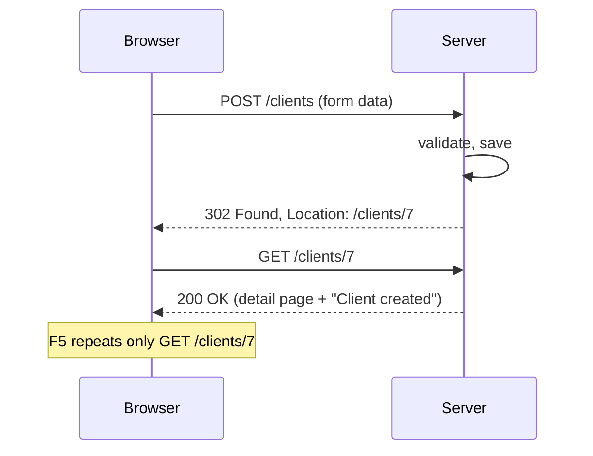

# 05 — MVC: forms and validation

**Outcomes:** ÕV3 — *realiseerib rakenduse MVC arhitektuuriga rakendusena* · **Time:** 2 h in class + ~2 h independent
**Before this lesson:** your project matches the end state of lesson 04 (see [what exists after each lesson](../../PROJECT.md#what-exists-after-each-lesson)): clients list and detail page, projects list and detail page nested under a client, a layout with navigation and a place for flash messages.
**Walkthroughs:** [Laravel](laravel.md) · [Spring Boot](spring-boot.md)

---

## Why this matters

Until now Billable could only **show** data. Today it starts to **accept** data from the user. This is
the moment where most security problems and most "bad data in the database" problems are born.

Think about the systems you use at work. Somebody types a client e-mail with a space at the end. Somebody
double-clicks the "Save" button and two identical invoices appear. Somebody pastes a VAT number in the
wrong format and the accountant finds it three months later. Somebody opens a page on another website
that secretly submits a form to your company's intranet. Every one of these is a form-handling problem,
and every one has a standard solution that frameworks give you. Today you learn those solutions and,
more importantly, **why** they exist.

In MVC terms (ÕV3): the **controller** receives the form, the **validation rules** protect the
**model**, and the **view** shows the form again with helpful messages when something is wrong.

## Today's goal

At the end of class your application can create, edit and delete clients:

- `/clients/create` (Laravel) or `/clients/new` (Spring) shows an empty form.
- Submitting a valid form saves the client and redirects to its detail page with a green message
  "Client … created."
- Submitting an invalid form shows the same form again, with your input still in the fields and a
  message under each wrong field.
- The e-mail must be unique. When you edit a client, its own e-mail does not count as a duplicate.
- Deleting asks for confirmation first. Deleting a client that still has projects shows a friendly
  red message instead of a crash.

By the end you can:

- explain the difference between GET and POST, and why a form that changes data must use POST;
- apply the Post/Redirect/Get pattern and explain the problem it solves;
- write validation rules for a form, including "unique, but ignore myself";
- explain CSRF with an example attack, and say how your framework protects against it;
- explain mass assignment and how a form object or an allow-list prevents it.

---

## Concepts

### 1. What a browser actually sends

An HTML form is a way to build an HTTP request. When you press "Save", the browser collects the named
fields and sends them to the URL in `action`, using the method in `method`.

```html
<form method="POST" action="/clients">
    <input name="name" value="Saar OÜ">
    <input name="email" value="info@saar.ee">
    <button>Save</button>
</form>
```

The browser sends something like this:

```
POST /clients HTTP/1.1
Host: localhost:8000
Content-Type: application/x-www-form-urlencoded
Cookie: session=abc123

name=Saar+O%C3%9C&email=info%40saar.ee
```

Important facts:

- **Everything arrives as text.** `85.50` is not a number, it is the five characters `8`, `5`, `.`,
  `5`, `0`. Your code has to check it and convert it.
- **Empty fields arrive as empty strings**, not as "nothing". An unchecked checkbox does not arrive at all.
- **The user controls the whole request.** They can open the browser's developer tools, delete the
  `required` attribute, add a field called `id`, or send the request with a tool like `curl` without
  any form at all.

### 2. GET vs POST

| | GET | POST |
|---|---|---|
| Meaning | "Give me this page" | "Here is data, do something with it" |
| Data travels in | the URL (`/clients?page=2`) | the request body |
| Safe to repeat? | Yes — it must not change anything | No — it may create or change data |
| Bookmarked, cached, prefetched | Yes | No |
| Use for | showing lists, detail pages, empty forms, search | create, update, delete |

The rule: **a GET request must never change data.** Browsers, search engines and link previews in chat
apps open GET links on their own. If `GET /clients/5/delete` deleted a client, a chat app that previews
the link would delete it.

HTTP also has `PUT`, `PATCH` and `DELETE`. They describe the intention better ("replace", "change part
of", "remove"). But **HTML forms can only send GET and POST**. There are two common answers:

| Approach | How it works | Used by |
|---|---|---|
| **Method spoofing** | The form sends POST with a hidden field `_method=PUT`. The framework reads the hidden field and treats the request as PUT. | Laravel: `@method('PUT')` in Blade |
| **Action URLs with POST** | Every change is a POST to a URL that names the action: `POST /clients/5` (update), `POST /clients/5/delete` | Our Spring Boot track |

Spring Boot can also do method spoofing (a setting called the hidden method filter), but we use POST
endpoints in the Spring track because there is nothing hidden: the URL you see in the form is exactly
the URL of the controller method, and there is one less setting to remember. Both approaches are
equally safe. Laravel's resource routes expect PUT/PATCH/DELETE, so in the Laravel track we use its
built-in spoofing.

### 3. Post/Redirect/Get (PRG)

What happens if the server answers a POST with a normal HTML page?

```
Browser                          Server
  | POST /clients  (name=Saar)     |
  |------------------------------->|  INSERT client "Saar"
  |   200 OK  <html>Saved!</html>  |
  |<-------------------------------|
  |                                |
  | user presses F5 (refresh)      |
  | "Resend form data?"  → OK      |
  | POST /clients  (name=Saar)     |
  |------------------------------->|  INSERT client "Saar"  ← duplicate!
```

The browser remembers that the last request was a POST, and refresh repeats it. With PRG the server
answers a successful POST with a **redirect** (`302` or `303` with a `Location` header). The browser
then makes a new GET request. Refresh now repeats only the harmless GET.



A redirect is a new request, so anything you want to show on the next page (like "Client created") must
survive one request. That is what **flash messages** are for (section 9).

What about a POST that **fails** validation? Nothing was saved, so repeating it is harmless. The two
frameworks handle it differently:

- **Laravel** redirects back to the form (PRG even on errors) and puts the errors and the old input
  into the session for one request.
- **Spring MVC** usually renders the form again directly as the answer to the POST. The errors and your
  input are still in memory, so no session is needed.

Both are fine. Just remember: **after a successful change, always redirect.**

### 4. Validation at the edge — never trust input

"The edge" is the place where data enters your application: a form, a URL parameter, an API call, a CSV
import. Validate there, **before** the data reaches the model or the database. Everything inside the
application can then trust that a `Client` has a name and a valid e-mail.

```
 untrusted world          │  edge  │            trusted inside
 browser, curl, bots  ────┼──▶ validate ──▶ controller ──▶ model ──▶ database
                          │   (reject with a message)        (constraints = last safety net)
```

There are three layers, and they have different jobs:

| Layer | Example | Job | Can the user bypass it? |
|---|---|---|---|
| Client-side (browser) | `<input required maxlength="120" type="email">` | Fast feedback, nicer experience | **Yes**, easily |
| Server-side (framework) | Form Request rules / Jakarta constraints | The real check, with friendly messages | No |
| Database | `NOT NULL`, `UNIQUE`, foreign keys | Last safety net against bugs and races | No, but errors are ugly |

Use all three, but **the server-side layer is the one that counts**. Client-side validation is a
convenience. Database constraints catch what slipped through, but they produce exceptions, not
messages a user can understand.

### 5. The validation rules for a client

| Field | Rules | Why |
|---|---|---|
| `name` | required, max 120 characters | Column is `varchar(120)`, `NOT NULL`. Longer text would cause a database error. |
| `email` | required, valid e-mail, max 255, **unique** | Invoices go to this address. Two clients with the same address would get each other's invoices. |
| `vat_number` | optional; if given, must match `^EE\d{9}$` | An Estonian VAT number is `EE` followed by 9 digits. Empty is allowed (private persons have none). |

Reading the regular expression `^EE\d{9}$`: `^` start of text, `EE` the two letters, `\d{9}` exactly
nine digits, `$` end of text. Without `^` and `$`, the text `xxEE123456789yy` would also match.

**Normalise before you validate.** Users type `ee 101 234 567` or ` Info@Saar.ee `. We remove spaces
and change the VAT number to upper case, and change the e-mail to lower case, **before** the rules run.
Then the stored data is consistent and uniqueness works (PostgreSQL treats `Info@saar.ee` and
`info@saar.ee` as different strings).

**Unique, but ignore myself.** When you edit client 7 and do not change the e-mail, a naive rule
"the e-mail must not exist in the table" fails — client 7 itself has that e-mail. On update the rule must
be "no **other** client has this e-mail":

```sql
-- create
SELECT EXISTS (SELECT 1 FROM clients WHERE lower(email) = lower(?));
-- update client 7
SELECT EXISTS (SELECT 1 FROM clients WHERE lower(email) = lower(?) AND id <> 7);
```

Laravel: `Rule::unique('clients', 'email')->ignore($client)`.
Spring: a repository method `existsByEmailIgnoreCaseAndIdNot(email, id)`.

### 6. Showing the form again: old input and error messages

A good form never throws away what the user typed. When validation fails, the form comes back with:

1. every field filled with the value the user sent (even the wrong ones, so they can fix them);
2. a message **next to the field** that is wrong, in plain words ("The e-mail has already been taken");
3. the field marked as invalid, so screen readers and CSS can highlight it. Pico.css shows a red border
   for `aria-invalid="true"`.

```
┌ New client ─────────────────────────────┐
│ Name       [ Saar OÜ                  ] │
│ E-mail     [ info@saar.ee             ] │  ← red border
│            The email has already been taken.
│ VAT number [ EE12345                  ] │  ← red border
│            The VAT number must be EE followed by 9 digits.
│ [ Create client ]                       │
└─────────────────────────────────────────┘
```

The **same form** is used for "create" and "edit". Only three things differ: the title, the URL it posts
to, and whether the fields start empty or filled with the existing client. So we write the fields once,
in a **partial** (a view fragment), and include it in both pages. When a rule changes, you change it in
one place.

### 7. CSRF — Cross-Site Request Forgery

**A story.** Mari is logged in to her company's internal Billable (her browser has a session cookie for
`billable.company.ee`). During lunch she opens a recipe site. The recipe site was hacked, and it contains
this hidden form:

```html
<form id="f" method="POST" action="https://billable.company.ee/clients/12/delete"></form>
<script>document.getElementById('f').submit();</script>
```

Mari's browser sends the POST to Billable **with her cookie attached**, because browsers attach cookies
to every request to that domain, no matter which page started it. Billable sees a valid session and
deletes client 12. Mari saw nothing.

That is CSRF: another site makes the user's browser send a request the user did not intend.

**The defence: a CSRF token.** When the server renders a form, it puts a random secret into a hidden
field. The same secret is stored in the user's session. When a POST arrives, the server compares them.
The hacked recipe site cannot read pages from Billable (the browser's same-origin policy blocks that),
so it cannot know the token, so its forged form fails.

```html
<form method="POST" action="/clients">
    <input type="hidden" name="_token" value="kX9f2...random...">
    ...
</form>
```

| | Laravel | Spring Boot |
|---|---|---|
| Is CSRF protection on? | **Yes, always**, for every POST/PUT/PATCH/DELETE in `web` routes | Only when **Spring Security** is added. Billable adds it in this lesson, with no login (`anyRequest().permitAll()`); CSRF is on by default. |
| How to add the token | `@csrf` inside the form | `th:action="@{...}"` on a POST form adds a hidden `_csrf` field automatically |
| Missing token | `419 Page Expired` | `403 Forbidden` |

The story above uses a login cookie, but "no login" does **not** mean "no risk". Billable without login
accepts **every** request. If it runs on a company network, the recipe site can make the browser of
anyone inside that network send the same POST — no cookie needed, and the firewall does not help, because
the request comes from the user's own browser. That is why both tracks keep CSRF protection on even
though Billable has no login. Laravel has it built in. The Spring track adds `spring-boot-starter-security`
with a rule that lets everyone in (`anyRequest().permitAll()`): no login, but CSRF tokens on every form.
Modern browsers also send cookies less freely than before (the `SameSite=Lax` default), which helps
against the cookie version, but it is not a full replacement for tokens.

### 8. Mass assignment

"Mass assignment" means copying all request fields into a model in one go. It is convenient and
dangerous:

```php
// DANGEROUS — takes every field the user sent
Client::create($request->all());
```

If the `clients` table later gets a column `is_vip` or `credit_limit_cents`, a user could add
`<input name="credit_limit_cents" value="99999999">` in the browser's developer tools and the model
would happily save it. The attack is "set a field the form never offered".

Protection is an **allow-list**: only named fields get through.

| | Laravel | Spring Boot |
|---|---|---|
| Model-level allow-list | `protected $fillable = ['name', 'email', 'vat_number'];` (from lesson 03) | Not needed — entities are never bound directly |
| Request-level allow-list | `$request->validated()` returns **only fields that have rules** | A form class `ClientForm` has **only the fields the form shows** |

In Spring, never use an `@Entity` as the `@ModelAttribute`. The binder would set any property that has a
setter, including `id`. A separate form class (also called a *form-backing object* or *command object*)
has only the fields you allow, and the controller copies them into the entity explicitly.

### 9. Flash messages

A flash message is a value stored in the session **for exactly one next request**. The controller
stores it just before redirecting; the next page shows it; then it is gone. Refreshing the page does not
show it again.

```
POST /clients  → save → flash "Client Saar OÜ created." → redirect
GET  /clients/7 → layout reads flash → shows green box → flash is deleted
GET  /clients/7 (F5) → no flash
```

We use two keys: **`status`** for success (green) and **`error`** for problems (red). The layout shows
them on every page, so controllers only have to set them.

### 10. Confirm before delete

Deleting is permanent. A small JavaScript `confirm()` dialog before submitting the delete form prevents
most accidents:

```html
<form method="POST" action="..." data-confirm="Delete client Saar OÜ?"
      onsubmit="return confirm(this.dataset.confirm)">
```

Why the `data-confirm` attribute and not the text directly in `onsubmit`? A client name like
`O'Brien & Sons` contains a quote. Written directly inside JavaScript it would break the script — or, with
a carefully chosen name, run the attacker's code (this is called XSS, cross-site scripting). The template
engine escapes a normal HTML attribute correctly, and `this.dataset.confirm` reads it as plain text.

The confirm dialog is a convenience only. The server still decides whether the delete is allowed.

### 11. Deleting a client that has projects

`projects.client_id` has a foreign key to `clients` with **restrict** on delete (PROJECT.md). The
database refuses to delete a client that still has projects:

```
ERROR: update or delete on table "clients" violates foreign key constraint
       "projects_client_id_foreign" on table "projects"
```

If the controller just calls `delete()`, this error becomes a `500 Server Error` page. The user learns
nothing. Better:

1. **Check first:** "does this client have projects?" If yes, redirect back with a red flash message:
   "Saar OÜ still has 3 projects. Delete or archive them first."
2. **Keep the foreign key** as the safety net. If two people act at the same moment (one adds a project
   while the other deletes the client), the check can pass and the database still protects the data.

Why restrict and not cascade? Cascade would silently delete all the client's projects — and from lesson
06 on, all their time entries, which are the basis of invoices. Losing billing history because of one
click is much worse than one extra step for the user.

### 12. Money typed by a user

A user types a project's hourly rate as `85.50` or `85,50` (Estonian users often use a comma). We store
integer cents (rule R1): `8550`. The tempting conversion is wrong:

```php
(int) ((float) '0.29' * 100);   // 28, not 29 — floats cannot store 0.29 exactly
```

```java
(int) (Double.parseDouble("0.29") * 100);   // 28 as well
```

The safe way treats the input as **text** until the very end:

1. Validate the format with a regular expression: `^\d{1,7}([.,]\d{1,2})?$` (1–7 digits, then
   optionally a dot or comma and 1–2 digits).
2. Replace `,` with `.`, split at the dot: `"85"` and `"50"`.
3. Pad the fraction to two digits (`"5"` → `"50"`), then `85 × 100 + 50 = 8550`.

Only integers are ever multiplied. The money columns are PostgreSQL `bigint` (PHP `int`, Java `long`),
so overflow is not a real risk; the limit of 7 digits (at most 9 999 999.99 €) is a sanity check that
catches typing mistakes such as too many digits.

Exact decimal types exist too: Java's `BigDecimal`, PHP 8.4's `BcMath\Number`, and the `brick/money`
package. We write the steps by hand once so you see that no float is involved.

This is the minimum for now. Lesson 10 introduces a proper `Money` type and explains rounding in
depth.

### 13. Validation that depends on another field

Projects (your independent work) need **conditional** rules. Which price fields are required depends on
the billing type:

| Billing type | `hourly_rate` | `fixed_price` | `budget_cap` |
|---|---|---|---|
| `hourly` | required | — (stored as null) | — (stored as null) |
| `fixed` | — | required | — |
| `capped` | required | — | required |

And for every project: `rounding_minutes` must be one of `1`, `6`, `15`.

Two decisions to notice: fields that do not apply are **stored as null** even if the user typed
something (otherwise a "fixed" project could carry an old hourly rate that confuses billing later), and
the list `1, 6, 15` is checked on the server even though the form offers a `<select>` — a request can
contain any value.

Both frameworks have a tool for this. Laravel: `exclude_unless:billing_type,hourly,capped` followed by
`required` — the field is checked only for the listed types and left out of `validated()` otherwise.
Spring: an `@AssertTrue` method on the form class that looks at both fields.

---

## Laravel vs Spring Boot

| Idea | Laravel | Spring Boot |
|---|---|---|
| Validation rules live in | Form Request class (`StoreClientRequest`) | Form class with annotations (`ClientForm`) |
| Run the rules | Type-hint the Form Request in the controller | `@Valid @ModelAttribute("form") ClientForm form` |
| Where errors go | Session → `$errors` in the view | `BindingResult` right after the form parameter |
| Old input | `old('name', $client->name)` | `th:field="*{name}"` reads the form object |
| Error under a field | `@error('name') {{ $message }} @enderror` | `th:errors="*{name}"`, `#fields.hasErrors('name')` |
| Unique check | `Rule::unique(...)->ignore($client)` | Repository `exists…` + `bindingResult.rejectValue(...)` |
| PUT / DELETE from a form | `@method('PUT')`, `@method('DELETE')` | POST to `/clients/{id}` and `/clients/{id}/delete` |
| Flash message | `->with('status', '...')` | `redirectAttributes.addFlashAttribute("status", "...")` |
| Mass assignment protection | `$fillable` + `$request->validated()` | Form class, never bind entities |
| Empty string → null | Built-in middleware `ConvertEmptyStringsToNull` | `StringTrimmerEditor(true)` in an `@InitBinder` |
| CSRF | Built in, `@csrf` in every POST form | Spring Security with `permitAll()` (`common.SecurityConfig`); `th:action` adds `_csrf` |

---

## Common mistakes

| Mistake | Why it hurts | What to do instead |
|---|---|---|
| Returning a view after a successful POST | Refresh repeats the POST → duplicates | Redirect (PRG) |
| Relying on `required` in HTML only | Anyone can remove it in DevTools or use `curl` | Always validate on the server |
| `Client::create($request->all())` | Mass assignment: user sets fields you never offered | `$request->validated()` |
| Binding a JPA `@Entity` to a form | User can set `id` or other properties | A separate `ClientForm` class |
| Unique rule without "ignore myself" on update | Editing a client without changing the e-mail fails | `ignore($client)` / `...AndIdNot(id)` |
| Deleting with a GET link | Crawlers and link previews delete data | A POST form with a confirm dialog |
| Letting the FK error become a 500 page | User sees a crash, not a reason | Check for projects first, flash a message |
| `(int) ($euros * 100)` with floats | `0.29 * 100 = 28.999…` → 28 cents | Parse the string into whole and fraction parts |
| Forgetting `@csrf` (Laravel) | `419 Page Expired` on every submit | Put `@csrf` at the top of every POST form |
| Error message far from the field (only at the top) | User must search for what is wrong | Message directly under each field |
| Validating before normalising | `ee123456789` fails; `Info@x.ee` and `info@x.ee` both saved | Trim, upper-/lower-case first, then validate |

---

## Independent work (~2 h)

Do these at home after the walkthrough, in your own project (~2 h). Tasks build on each other across lessons, so finish at least the **Basic** ones. Solutions are at the bottom of the [Laravel](laravel.md#independent-work--solutions) and [Spring Boot](spring-boot.md#independent-work--solutions) walkthroughs — try first, compare after.

### Basic — full CRUD for projects (required)

Projects are created **under a client** and edited on their own URL.

| Action | Laravel URL | Spring URL |
|---|---|---|
| New project form | `GET /clients/{client}/projects/create` | `GET /clients/{clientId}/projects/new` |
| Save new project | `POST /clients/{client}/projects` | `POST /clients/{clientId}/projects` |
| Edit form | `GET /projects/{project}/edit` | `GET /projects/{id}/edit` |
| Save changes | `PUT /projects/{project}` | `POST /projects/{id}` |
| Delete | `DELETE /projects/{project}` | `POST /projects/{id}/delete` |

Acceptance criteria:

- Fields: name, billing type (select: Hourly / Fixed price / Capped hourly), hourly rate (€), fixed
  price (€), budget cap (€), rounding (select: 1, 6, 15 minutes).
- Rules as in the table in concept 13. Name required, max 120. `rounding_minutes` in 1, 6, 15, checked
  on the server.
- Money fields accept `85`, `85.5`, `85.50` and `85,50`, and are stored as cents without floats. The
  edit form shows the stored value as `85.50`.
- Fields that do not apply to the chosen billing type are saved as `null`.
- The form is one partial used by both create and edit. Errors appear under the correct field.
- Success → redirect to the project page with a green flash message. Delete asks for confirmation.
- The client detail page has a "New project" link; the project page has "Edit" and "Delete".

### Intermediate — archive instead of delete

Projects will soon have time entries (lesson 06), and those must never disappear. Replace "Delete" with
"Archive" / "Unarchive".

- `archive` sets `archived_at` to now; `unarchive` sets it back to null. Both are POST-style actions
  (Laravel `PATCH`, Spring `POST`), with PRG and a flash message.
- The project page shows "Archived on 30.09.2026" when archived, and the correct button.
- In the client's project list, archived projects appear after active ones and are marked "archived".
- Remove the delete route and button for projects.

### Advanced — a reusable Estonian VAT number rule

The VAT regex is now written inside the client rules. Make it a reusable, named rule.

- Laravel: a rule class `App\Rules\EstonianVatNumber` (`php artisan make:rule`) used as
  `['nullable', new EstonianVatNumber()]`.
- Spring: a custom constraint annotation `@EstonianVatNumber` with a `ConstraintValidator`, used on
  `ClientForm.vatNumber`. `null` must be valid (the field is optional).
- The error message explains the format with an example: "must be EE followed by 9 digits, for example
  EE101234567".
- Replace the inline regex in the client rules with the new rule. All client form behaviour stays the same.

---

## Self-check

1. Why must a request that deletes data never be a GET?
2. What problem does Post/Redirect/Get solve, and what does the server send instead of HTML?
3. Why is `required` in the HTML not enough?
4. When you edit a client, why does a simple "unique e-mail" rule fail, and how do you fix it?
5. Explain CSRF in three sentences. Why can the attacker's page not simply read the token?
6. What is mass assignment, and which two things protect you from it in your track?
7. Why do we check for projects before deleting a client, if the foreign key already prevents it?
8. Why is `(int) ((float) "0.29" * 100)` wrong, and what do you do instead?

<details>
<summary>Answers</summary>

1. Browsers, crawlers and link previews open GET links automatically and may repeat them. GET must be
   safe (no changes). Deleting via GET means data can disappear without anyone pressing a button.
2. Refreshing a page that was the answer to a POST resends the POST and creates duplicates. With PRG
   the server answers a successful POST with a redirect (`302`/`303` + `Location`), the browser loads the
   new page with GET, and refresh repeats only the GET.
3. The user controls the browser and the request. They can remove the attribute, or send the request
   without a browser. Only server-side validation cannot be bypassed.
4. The client's own row already has that e-mail, so "must not exist" fails. The rule must ignore the row
   being edited: `Rule::unique(...)->ignore($client)` or `existsByEmailIgnoreCaseAndIdNot(email, id)`.
5. Another website makes the victim's browser send a request to our site, and the browser attaches the
   victim's cookies. The server cannot tell the difference without a secret token in the form. The
   browser's same-origin policy stops the other site from reading our pages, so it cannot get the token.
6. Copying every request field into a model, so users can set fields the form never offered. Laravel:
   `$fillable` on the model and `$request->validated()`. Spring: a form class with only the allowed
   fields, never binding the entity itself.
7. The foreign key error becomes a `500` page with no useful message. The check lets us show a friendly
   explanation. The foreign key stays as a safety net for race conditions and bugs.
8. `0.29` cannot be stored exactly as a float; `0.29 * 100` is `28.999…`, and the cast cuts it to 28.
   Validate the text with a regex, split it into whole and fraction parts, and compute
   `whole × 100 + fraction` with integers.

</details>

---

## Checklist

- [ ] Clients can be created, edited and deleted from the UI (ÕV3: full MVC cycle for one resource).
- [ ] All client rules are validated on the server, including unique e-mail ignoring the edited client.
- [ ] Invalid input shows the form again with old input and a message under each wrong field.
- [ ] Every successful POST ends with a redirect and a flash message.
- [ ] The create and edit pages share one form partial.
- [ ] Deleting asks for confirmation; deleting a client with projects shows a red message, not a 500.
- [ ] Every POST form carries a CSRF token (Laravel: `@csrf`; Spring: `SecurityConfig` + `th:action`), and you can explain why that matters even without login.
- [ ] Projects have full CRUD with conditional rules per billing type, money input stored as cents.
- [ ] The formatter passes (`./vendor/bin/pint --test` / `./mvnw spotless:check`) and your work is committed
      in small commits.

---

## Further reading

- Laravel: [Validation](https://laravel.com/docs/12.x/validation) ·
  [CSRF protection](https://laravel.com/docs/12.x/csrf) ·
  [Resource controllers](https://laravel.com/docs/12.x/controllers#resource-controllers) ·
  [Flash data](https://laravel.com/docs/12.x/session#flash-data) ·
  [Mass assignment](https://laravel.com/docs/12.x/eloquent#mass-assignment)
- Spring: [Java Bean Validation in Spring](https://docs.spring.io/spring-framework/reference/core/validation/beanvalidation.html) ·
  [Thymeleaf + Spring tutorial (forms, `th:field`, errors)](https://www.thymeleaf.org/doc/tutorials/3.1/thymeleafspring.html) ·
  [Jakarta Validation specification](https://jakarta.ee/specifications/bean-validation/)
- Web: [MDN — Sending form data](https://developer.mozilla.org/en-US/docs/Learn/Forms/Sending_and_retrieving_form_data) ·
  [OWASP — Cross Site Request Forgery](https://owasp.org/www-community/attacks/csrf) ·
  [OWASP — Mass assignment cheat sheet](https://cheatsheetseries.owasp.org/cheatsheets/Mass_Assignment_Cheat_Sheet.html)
