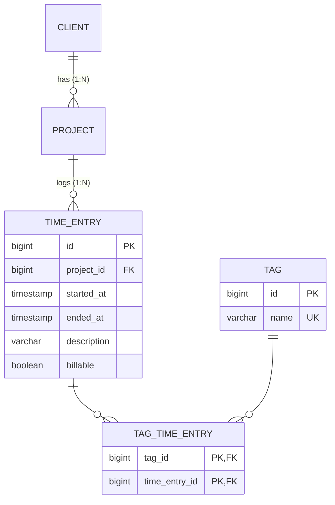

# 06 — ORM: relationships and the N+1 problem

**Outcomes:** ÕV4 — *kasutab parimate praktikate kohaselt ORM vahendeid* · **Time:** 2 h in class + ~2 h independent
**Before this lesson:** your project matches the end state of lesson 05 (see [what exists after each lesson](../../PROJECT.md#what-exists-after-each-lesson)): full CRUD for clients and projects with validation and flash messages.
**Walkthroughs:** [Laravel](laravel.md) · [Spring Boot](spring-boot.md)

---

## Why this matters

Billable's main screen is the **time sheet**: a list of your latest work, with the project, the client
and the tags of every entry. It looks like a simple table. Written the obvious way, it sends **more than
a hundred SQL queries** to the database every time you open it. On your laptop with 50 rows you will not
notice. In production, with a database on another server and 20 users, the page takes seconds and the
database is busy doing useless work.

This is called the **N+1 problem**, and it is the most common performance bug in applications that use
an ORM. It is also one of the first things an experienced reviewer looks for in a pull request. The
capstone requires "no N+1 on list pages" (ÕV4). Today you will cause it on purpose, **measure** it,
and fix it — and learn the relationship mapping that makes both possible.

## Today's goal

At the end of class:

- The tables `time_entries`, `tags` and `tag_time_entry` exist (as migrations).
- `TimeEntry` and `Tag` are mapped with their relationships to `Project` and to each other.
- About 60 seeded time entries over the last three weeks, some with tags.
- `/time-entries` shows the latest 50 entries: date, project, client, duration (h:mm), tags — with a
  **small, constant** number of queries, measured before and after the fix.
- A form to log a new time entry, validated by rule R4 (end after start, at most 12 hours).

By the end you can:

- choose the right relationship type and foreign-key behaviour for a new table;
- explain lazy and eager loading, and recognise the N+1 problem in code and in a query log;
- fix N+1 with eager loading (Laravel `with()`) or a fetch join / entity graph (JPA);
- say when a calculation belongs in SQL (an aggregate) instead of a loop in PHP or Java.

---

## Concepts

### 1. Relationship types

| Type | Meaning | Billable example | Where the foreign key lives |
|---|---|---|---|
| **1:1** (one-to-one) | One A has at most one B | (none yet) e.g. a client and its billing address | In either table, with a `UNIQUE` constraint |
| **1:N** (one-to-many) | One A has many B; each B has one A | client → projects, project → time entries | In the **many** side: `projects.client_id` |
| **N:M** (many-to-many) | Many A relate to many B | time entries ↔ tags | In a separate **pivot table** (join table) |



**Why N:M needs a pivot table.** A time entry can have several tags, and a tag is used on many entries.
You cannot store "the tags" in one column of `time_entries` (a list in one column breaks the first normal
form: you could not search, index or join on it). Instead, every pair gets its own row:

```
time_entries            tag_time_entry              tags
id | description        tag_id | time_entry_id      id | name
---+-------------       -------+--------------      ---+---------
 1 | Kick-off call          1  |  1                  1 | meeting
 2 | Fix login bug          2  |  2                  2 | bugfix
 3 | Review PR              3  |  2                  3 | review
                            3  |  3
```

Entry 2 has the tags `bugfix` and `review`. The pair `(tag_id, time_entry_id)` is the primary key, so
the same tag cannot be attached twice to the same entry.

### 2. Foreign keys and `ON DELETE`

A foreign key says "this value must exist in that table". The `ON DELETE` option says what happens when
someone tries to delete the row that is referenced:

| Option | What happens | Use when | Billable |
|---|---|---|---|
| `RESTRICT` / `NO ACTION` | The delete is refused with an error | The child is valuable on its own | `projects.client_id`, `time_entries.project_id` |
| `CASCADE` | The children are deleted too | The child has no meaning without the parent | both FKs of `tag_time_entry`, `invoice_lines.invoice_id` (lesson 13) |
| `SET NULL` | The FK column becomes `NULL` | The link is optional | `time_entries.invoice_id` could use this (lesson 13) |

**Why `time_entries.project_id` is restrict.** Time entries are the evidence behind every invoice. If
deleting a project cascaded, one click would silently destroy weeks of billable work and make old invoices
impossible to explain. Restrict forces a conscious decision (archive the project instead, lesson 05).
**Why the pivot is cascade.** A row in `tag_time_entry` only says "entry 2 has tag 3". If entry 2 is
deleted, that row means nothing, so it should go too. Same when a tag is deleted.

### 3. Mapping relationships in the ORM

| Relationship | Laravel (Eloquent) | JPA (Hibernate) |
|---|---|---|
| TimeEntry → Project (many-to-one) | `belongsTo(Project::class)` | `@ManyToOne(fetch = LAZY) @JoinColumn(name = "project_id")` |
| Project → TimeEntries (one-to-many) | `hasMany(TimeEntry::class)` | `@OneToMany(mappedBy = "project")` (optional) |
| TimeEntry ↔ Tags (many-to-many) | `belongsToMany(Tag::class)` on both | `@ManyToMany @JoinTable(...)` on the owning side, `mappedBy` on the other |

Eloquent guesses table and column names from conventions: `belongsToMany(Tag::class)` on `TimeEntry`
looks for a pivot table named from both model names in alphabetical order, singular, joined with `_`:
`tag` + `time_entry` → `tag_time_entry`. That is why the table has this name in both tracks.

### 4. Owning side and inverse side (JPA)

In SQL a relation lives in exactly one place: the foreign-key column (or the pivot table). In Java, both
objects can have a field pointing at the other. JPA must know **which field decides** what is written to
the database. That field is the **owning side**; the other is the **inverse side** and is marked with
`mappedBy`.

```java
// Owning side: this field controls the rows in tag_time_entry
@ManyToMany
@JoinTable(name = "tag_time_entry",
    joinColumns = @JoinColumn(name = "time_entry_id"),
    inverseJoinColumns = @JoinColumn(name = "tag_id"))
private Set<Tag> tags = new HashSet<>();

// Inverse side (in Tag), only for reading: changing it alone writes NOTHING
@ManyToMany(mappedBy = "tags")
private Set<TimeEntry> timeEntries = new HashSet<>();
```

If you add a tag only to `tag.timeEntries`, nothing is saved. If you map both sides, keep them in sync
with helper methods on the owning entity:

```java
public void addTag(Tag tag) {
  tags.add(tag);
  tag.getTimeEntries().add(this);   // only if the inverse side is mapped
}
```

**Our choice for Billable:** we map only the owning side (`TimeEntry.tags`) and no `Tag.timeEntries`. We
never need "all entries of a tag" as a Java collection — reports use SQL aggregates (section 9). One side
means nothing to keep in sync. The same goes for `Project.timeEntries`: a project can have thousands of
entries, and loading them all as a list is almost never what you want. Map the inverse side when you
really navigate from it; not "just in case".

Eloquent has no owning side: each relation method is only a query builder. Both `TimeEntry::tags()` and
`Tag::timeEntries()` read and write the same pivot table.

### 5. Lazy and eager loading

**Lazy loading:** related data is loaded the first time you touch it.

```php
$entry = TimeEntry::find(1);      // SELECT * FROM time_entries WHERE id = 1
echo $entry->project->name;       // SELECT * FROM projects WHERE id = 3   ← now, on first access
```

**Eager loading:** you say in advance which relations you need, and they are loaded together with the
main rows, in a fixed number of queries.

```php
$entries = TimeEntry::with('project')->limit(50)->get();
// SELECT * FROM time_entries LIMIT 50
// SELECT * FROM projects WHERE id IN (3, 5, 8)      ← one query for all 50 entries
```

Lazy loading is convenient and correct for a single object. It becomes a problem inside a **loop**.

In JPA, lazy loading works only while the **persistence context** (the Hibernate session) is open.
Outside it you get `LazyInitializationException: could not initialize proxy - no Session`. Always use
`fetch = FetchType.LAZY` on `@ManyToOne` — the JPA default for `@ManyToOne` is **EAGER**, which loads the
related object every time, whether you need it or not.

### 6. The N+1 problem

The time sheet shows 50 entries, and for each entry its project name, its client name and its tags:

```blade
@foreach ($entries as $entry)
    {{ $entry->project->name }}              {{-- lazy load: 1 query per entry --}}
    {{ $entry->project->client->name }}      {{-- lazy load: 1 query per entry --}}
    @foreach ($entry->tags as $tag) ... @endforeach   {{-- lazy load: 1 query per entry --}}
@endforeach
```

```
1 query   SELECT * FROM time_entries ORDER BY started_at DESC LIMIT 50
50 queries SELECT * FROM projects WHERE id = ?          (one per entry)
50 queries SELECT * FROM clients WHERE id = ?           (one per entry)
50 queries SELECT tags.* FROM tags JOIN tag_time_entry ... WHERE time_entry_id = ?
─────────
151 queries for one page
```

"N+1": **1** query for the list, then **N** more — one for each row — per relation you touch. Each
query is fast on its own (maybe 0.5 ms locally), but every one is a network round trip. With the database
on another server (1–2 ms per round trip) and more rows, the page gets slower in proportion to the data.

**With eager loading** the same page needs a constant number of queries:

```
SELECT * FROM time_entries ORDER BY started_at DESC LIMIT 50
SELECT * FROM projects WHERE id IN (1, 2, 3, 4, 5, 6)
SELECT * FROM clients  WHERE id IN (1, 2, 3)
SELECT tags.*, tag_time_entry.time_entry_id FROM tags
  JOIN tag_time_entry ON tags.id = tag_time_entry.tag_id
  WHERE tag_time_entry.time_entry_id IN (101, 102, ... 150)
─────────
4 queries — for 50 entries or for 5000
```

**Eloquent vs Hibernate.** Hibernate keeps an **identity map** inside the persistence context: every
entity with a given id is loaded only once per session. So in Hibernate, the lazy version needs one
query per **distinct** project and client, not per entry — still one query per entry for the tags. With
6 projects and 3 clients that is 1 + 6 + 3 + 50 = 60 queries. Eloquent has no identity map, so it really
loads project 3 again for every entry that belongs to it: 151. Both are N+1; the fix is the same idea.

### 7. How to see the queries

You cannot fix what you cannot see. Make the query count visible **before** you optimise.

| Tool | Laravel | Spring Boot / Hibernate |
|---|---|---|
| Log every SQL statement | `DB::listen(fn ($query) => ...)` | `logging.level.org.hibernate.SQL=debug` |
| Count per request | Counter in `DB::listen`, logged when the request ends | `spring.jpa.properties.hibernate.generate_statistics=true` → "N JDBC statements executed" per session |
| Fail loudly on lazy loading | `Model::preventLazyLoading(! app()->isProduction())` | `spring.jpa.open-in-view=false` → `LazyInitializationException` |
| Extra tools | Laravel Debugbar, Laravel Telescope | IntelliJ database tools, `p6spy` |

**`open-in-view` explained.** Spring Boot's default is `spring.jpa.open-in-view=true`. It keeps the
Hibernate session open until the view has been rendered, so lazy loading "just works" in Thymeleaf
templates — and N+1 happens silently in the view. If you leave the property unset, Boot even prints a
warning at startup about it. We set it to `false` in lesson 03. With `false`, the session closes when
the repository call ends; if the template touches a relation that was not loaded, you get an exception
instead of 150 hidden queries. A loud error in development is much better than a slow page in
production.

`Model::preventLazyLoading()` is the same idea in Laravel: in development, lazy loading a relation on a
model that was loaded as part of a list throws a `LazyLoadingViolationException`. In production it is
switched off, so a missed case only costs performance, not an error page. The walkthrough switches it
on with `Model::shouldBeStrict()`, which also turns on two related guards: no silently dropped
non-fillable keys (lesson 03) and no `null` for an attribute the model does not have.

(Laravel 12.8 also added `Model::automaticallyEagerLoadRelationships()`: when one model in a collection
lazy loads a relation, Laravel loads it for the whole collection at once. It is handy, but in this course
we write `with(...)` ourselves, so you see which queries run.)

### 8. Fixing N+1

| Fix | Laravel | JPA |
|---|---|---|
| Eager load when querying | `TimeEntry::with(['project.client', 'tags'])` | `@EntityGraph(attributePaths = {"project", "project.client", "tags"})` |
| Eager load later, on an existing collection | `$entries->load('tags')` | — |
| Join in the query | `join()` (then you get rows, not models) | `select e from TimeEntry e join fetch e.project p join fetch p.client` |
| Batch lazy loads | — | `@BatchSize(size = 50)` or `hibernate.default_batch_fetch_size` (needs an open session) |
| Select only what the page needs | `select()` + `join()` | DTO / interface projection |

**A JPA trap: collection fetch + limit.** If you fetch a **collection** (`tags`) in the same query as a
`LIMIT` (`findTop50...`), the SQL returns one row per tag, so the database cannot apply `LIMIT 50` to
entries. Hibernate then loads **all** matching rows and cuts the list in memory, with the warning
`HHH90003004: firstResult/maxResults specified with collection fetch; applying in memory`. For 60 rows
that is invisible; for 100 000 rows it is a disaster. The fix is two queries: first the 50 ids (with
`LIMIT`), then the entries with those ids plus their relations (no `LIMIT`). The Spring walkthrough
shows it.

Eloquent does not have this trap: `with('tags')` always runs a separate query per relation.

### 9. Aggregates in SQL, not in loops

"How many minutes per project this week?" can be answered in two ways:

```php
// Slow: load every entry into PHP, then add up
$minutes = [];
foreach (TimeEntry::whereBetween('started_at', [$from, $to])->get() as $entry) {
    $minutes[$entry->project_id] = ($minutes[$entry->project_id] ?? 0) + $entry->durationMinutes();
}
```

```sql
-- Fast: let the database add up, return one row per project
SELECT project_id, SUM(EXTRACT(EPOCH FROM (ended_at - started_at)) / 60) AS minutes
FROM time_entries
WHERE started_at >= :from AND started_at < :to
GROUP BY project_id;
```

The database is built for this: it reads the rows where they are, uses indexes, and sends back ten small
rows instead of thousands of full objects. Rule of thumb: **filter, count, sum and group in SQL; format
and display in the application.**

Note the date range `started_at >= Monday 00:00 AND started_at < next Monday 00:00`. A half-open range
(`>=` and `<`) never loses the last second of Sunday and never counts midnight twice.

### 10. Scopes and query methods

When the same condition appears in many places ("only active projects"), give it a name.

| | Laravel: local scope | Spring Data: query method |
|---|---|---|
| Define | `public function scopeActive(Builder $query): void { $query->whereNull('archived_at'); }` | `List<Project> findByArchivedAtIsNullOrderByNameAsc();` |
| Use | `Project::active()->orderBy('name')->get()` | `projects.findByArchivedAtIsNullOrderByNameAsc()` |

A named query is easier to read, easier to test, and when the rule changes you change it in one place.

### 11. Indexes

An **index** is a sorted structure (usually a B-tree) that lets the database find rows without reading
the whole table — like the index at the back of a book.

| Index | Speeds up | Why we need it |
|---|---|---|
| `time_entries (project_id, started_at)` | "entries of project 3 between two dates", ordered by time | Invoices (lesson 13), budget checks (lesson 09), the weekly report |
| `tag_time_entry (time_entry_id)` | "tags of these 50 entries" | The primary key `(tag_id, time_entry_id)` starts with `tag_id`, so it does not help when searching by `time_entry_id` |
| `tags (name)` UNIQUE | find a tag by name, no duplicates | Comes with the `UNIQUE` constraint |

A composite index `(project_id, started_at)` works for queries that filter on `project_id`, or on
`project_id` **and** `started_at` — but not for `started_at` alone (like a phone book sorted by last name,
then first name, cannot find "everyone called Mari"). PostgreSQL does **not** create indexes on foreign-key
columns automatically; you add the ones your queries need. Indexes are not free: every insert and update
must update them too. Add them for real queries, not for every column.

---

## Laravel vs Spring Boot

| Idea | Laravel | Spring Boot |
|---|---|---|
| New tables | Migration classes (`php artisan make:migration`) | Flyway SQL files `V3__...sql`, `V4__...sql` |
| Many-to-one | `belongsTo` | `@ManyToOne(fetch = LAZY)` + `@JoinColumn` |
| Many-to-many | `belongsToMany` (pivot found by convention) | `@ManyToMany` + `@JoinTable` on the owning side, `Set<Tag>` |
| Attach tags | `$entry->tags()->sync([1, 3])` | `entry.replaceTags(tags)` (our method) on the owning side, then `save()` |
| Eager loading | `with(['project.client', 'tags'])` | `@EntityGraph` / `join fetch` |
| Fail on lazy loading | `Model::preventLazyLoading()` | `open-in-view=false` → `LazyInitializationException` |
| Count queries | `DB::listen`; in tests `$this->expectsDatabaseQueryCount(n)` | `hibernate.generate_statistics` |
| Identity map | No — same row loaded twice becomes two objects | Yes — one object per id per session |
| Aggregate query | `DB::table(...)->groupBy()->selectRaw('SUM(...)')` | `@Query(nativeQuery = true)` with a projection |

---

## Common mistakes

| Mistake | Why it hurts | What to do instead |
|---|---|---|
| Touching a relation inside a loop without eager loading | N+1: queries grow with the number of rows | `with()` / entity graph, and measure |
| "Fixing" `LazyInitializationException` with `FetchType.EAGER` or `open-in-view=true` | Hides the problem; loads data on every query, even where not needed | Load what the page needs in the query (entity graph / fetch join) |
| Fetching a collection together with `LIMIT` in JPA | Hibernate paginates in memory (`HHH90003004`) | Two queries: ids with limit, then entities by ids |
| `ON DELETE CASCADE` on time entries | Deleting a project destroys billing history | `RESTRICT`, archive instead |
| Summing minutes in a PHP/Java loop | Loads thousands of objects to compute ten numbers | `GROUP BY` + `SUM` in SQL |
| `BETWEEN '2026-09-28' AND '2026-10-04'` on a timestamp | Misses everything on Sunday after 00:00 | Half-open range `>= Monday AND < next Monday` |
| No index on the pivot's second column | Loading tags per entry scans the whole pivot table | Index `tag_time_entry (time_entry_id)` |
| Mapping both sides of every relation "just in case" | Two places to keep in sync; easy to write only the inverse side and save nothing | Map the inverse side only when you navigate from it |
| `Set<Tag>` with default `equals`/`hashCode` across sessions | Same tag appears twice in the set | Implement `equals`/`hashCode` on a stable business key (`name`) |
| Optimising without measuring | You fix the wrong thing | Count queries before and after |

---

## Independent work (~2 h)

### Basic — tag time entries (required)

- The time entry form has a multi-select with all tags (sorted by name).
- Saving an entry stores the selected tags in `tag_time_entry`. Choosing no tag is allowed.
- Only existing tag ids are accepted (validated on the server).
- The time sheet shows each entry's tags, still with a constant number of queries.

### Basic — weekly summary report (required)

`GET /reports/weekly?week=2026-W40` (`ReportController`):

- Shows one row per project that has entries in that ISO week: client, project, total time as `h:mm`.
- Rows sorted by client name, then project name. A total row at the bottom.
- The minutes per project come from **one aggregate query** (`GROUP BY`), not from a loop over entries.
- No `week` parameter → the current week. An invalid value (e.g. `2026-W99`, `hello`) → a clear error
  message or a 404/400, not a 500.
- Links to the previous and next week. A link to the report in the navigation.
- Week boundaries: Monday 00:00 (inclusive) to next Monday 00:00 (exclusive), Europe/Tallinn time.

### Intermediate — filter the time sheet

`GET /time-entries?project=3&from=2026-09-01&to=2026-09-30`:

- A small filter form above the table: project (select, "All projects" = empty), from date, to date.
- Every filter is optional; they combine with AND. `to` is inclusive for the user (the whole day).
- Invalid values (unknown project, `to` before `from`) show an error, not a 500.
- The filter form keeps the chosen values after submitting (it is a GET form: the values are in the URL).
- Still the latest 50 matching entries, still a constant number of queries.

### Advanced — prove the query count is constant

- Show, with a repeatable check, that the time sheet uses the **same number of queries** for 5 entries
  and for 200 entries.
- Laravel: a feature test that creates data and checks the query count with Laravel's
  `$this->expectsDatabaseQueryCount(...)` for two data sizes; `Model::preventLazyLoading()` makes any
  missed relation fail the test.
- Spring: a dev-only interceptor that reads Hibernate statistics before and after each request, logs the
  number of statements per request, and logs a warning when a page uses more than a threshold (e.g. 10).
  Seed 200 extra entries and show the log line does not change.
- Write two sentences in your commit message about what you measured.

---

## Self-check

1. Where does the foreign key live in a one-to-many relation, and why there?
2. Why does Billable use `RESTRICT` for `time_entries.project_id` but `CASCADE` for `tag_time_entry`?
3. What is the owning side of a JPA relation, and what happens if you change only the inverse side?
4. Explain N+1 with the time sheet: which queries run, and how many?
5. Why does the lazy time sheet need fewer queries in Hibernate than in Eloquent?
6. What does `spring.jpa.open-in-view=false` change, and why is the exception a good thing?
7. Why can't you fetch `tags` together with a `LIMIT 50` in one JPA query?
8. Why is `started_at >= :from AND started_at < :to` better than `BETWEEN` for a week?

<details>
<summary><strong>Answers</strong></summary>

1. On the "many" side (`projects.client_id`, `time_entries.project_id`). Each child row has exactly one
   parent, so one column is enough. The parent would need a list, which a relational column cannot hold.
2. Time entries are billing evidence and must not disappear with a click, so the delete must be refused.
   A pivot row only links two things; without one of them it means nothing, so it is removed.
3. The side with the foreign key / `@JoinTable`, without `mappedBy`. Only changes to the owning side are
   written to the database. Changing only the inverse side saves nothing.
4. 1 query for the 50 entries, then per entry one for the project, one for the client and one for the
   tags: 1 + 50 + 50 + 50 = 151 in Eloquent.
5. Hibernate's persistence context is an identity map: each project and client id is loaded once per
   session. Eloquent loads the same project again for each entry. The tags are one query per entry in both.
6. The Hibernate session closes when the repository call ends, so templates cannot lazy load. Touching an
   unloaded relation throws `LazyInitializationException`. It shows the missing eager load in development,
   instead of hiding N+1 queries.
7. Joining a collection returns one SQL row per tag, so `LIMIT 50` would cut rows, not entries. Hibernate
   loads everything and paginates in memory. Use two queries: ids with `LIMIT`, then entities by ids.
8. `BETWEEN` includes both ends. With `'2026-10-04'` as the end it means Sunday 00:00:00, so the rest of
   Sunday is lost; with `'2026-10-05'` Monday 00:00 is counted in two weeks. The half-open range has
   neither problem.

</details>

---

## Checklist

- [ ] Migrations for `time_entries`, `tags`, `tag_time_entry` with the right FKs, `ON DELETE` rules and
      indexes (ÕV4).
- [ ] `TimeEntry` and `Tag` mapped; `@ManyToOne` is `LAZY` (Spring); pivot mapped on one owning side.
- [ ] Seeder creates about 60 entries over three weeks with some tags.
- [ ] The time sheet shows date, project, client, duration `h:mm`, tags.
- [ ] You measured the query count before and after the fix and can state both numbers.
- [ ] `preventLazyLoading` (Laravel) is on in development; `open-in-view=false` (Spring) and you can
      explain it.
- [ ] Creating a time entry validates R4 (end after start, maximum 12 hours) on the server.
- [ ] Entries can be tagged; the weekly report uses one `GROUP BY` query.
- [ ] Formatter check passes, work committed in small commits.

---

## Further reading

- Laravel: [Eloquent relationships](https://laravel.com/docs/12.x/eloquent-relationships) ·
  [Eager loading](https://laravel.com/docs/12.x/eloquent-relationships#eager-loading) ·
  [Preventing lazy loading](https://laravel.com/docs/12.x/eloquent-relationships#preventing-lazy-loading) ·
  [Migrations: foreign key constraints](https://laravel.com/docs/12.x/migrations#foreign-key-constraints) ·
  [Query builder: aggregates](https://laravel.com/docs/12.x/queries#aggregates)
- Spring / JPA: [Spring Data JPA query methods](https://docs.spring.io/spring-data/jpa/reference/jpa/query-methods.html) ·
  [Spring Data JPA projections](https://docs.spring.io/spring-data/jpa/reference/repositories/projections.html) ·
  [Hibernate ORM documentation](https://hibernate.org/orm/documentation/) ·
  [Flyway documentation](https://documentation.red-gate.com/flyway)
- PostgreSQL: [Indexes](https://www.postgresql.org/docs/current/indexes.html) ·
  [Constraints and foreign keys](https://www.postgresql.org/docs/current/ddl-constraints.html) ·
  [Aggregate functions](https://www.postgresql.org/docs/current/functions-aggregate.html)
