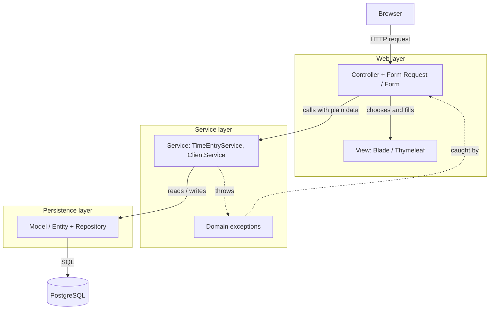
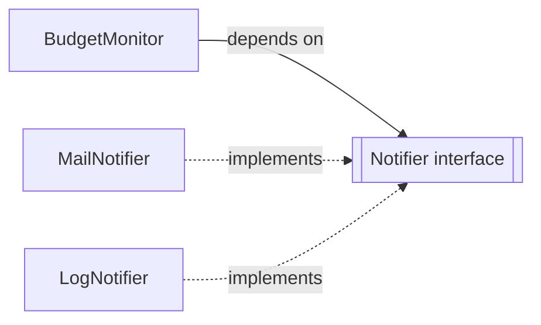

# 07 — Layers and dependency injection

**Outcomes:** ÕV1 — *tunneb enamlevinud programmeerimismustreid* · ÕV3 — *realiseerib rakenduse MVC arhitektuuriga rakendusena* · **Time:** 2 h in class + ~2 h independent
**Before this lesson:** your project matches the end state of lesson 06 (see [what exists after each lesson](../../PROJECT.md#what-exists-after-each-lesson))
**Walkthroughs:** [Laravel](laravel.md) · [Spring Boot](spring-boot.md)

---

## Why this matters

Up to now every controller did everything itself: it read the request, checked the rules, talked to the
database and chose the page to show. For five screens that is fine. But Billable is going to grow. In the
next lessons, logging one time entry must also:

- refuse entries on archived projects,
- check the budget of a capped project and warn the owner at 80 % (lesson 09),
- round the duration and calculate money correctly (lesson 10),
- refuse changes to entries that are already on an invoice (lesson 13).

If all of this goes into the controller, the controller becomes a 200-line method that nobody wants to
touch, and it cannot be tested without sending fake HTTP requests. At work you will meet these
"fat controllers" in almost every older code base. Knowing how to split them — and why — is one of the
most practical skills in this module.

The capstone rubric says it directly: **"No business logic in controllers or views."** ÕV3 at
*achieved* level means "thin controllers, logic in services, validation at the edge". This lesson is where
you learn how to get there.

The second topic, **dependency injection** (DI), is the pattern that makes layers work. It is also the
first pattern of ÕV1, and every later pattern (Strategy, Observer, Adapter) is wired together with it.

## Today's goal

At the end of class:

- Time entries are created through a **service** class, `TimeEntryService`, not in the controller.
- The service enforces a real business rule: **you cannot log time on an archived project**. It throws a
  domain exception, and the controller turns it into a friendly error message on the form.
- The work of the service runs inside a **database transaction**.
- Controllers receive their services through the **constructor** (constructor injection).
- Spring track: client create / update / delete also go through `ClientService`.

By the end you can:

1. explain why a fat controller is a problem, with an example from Billable;
2. draw the three layers and say what belongs in each one;
3. explain dependency injection, the IoC container and constructor injection in your own words;
4. say when an interface is worth adding and when it is not;
5. name the five SOLID principles and give a Billable example for each.

---

## Concepts

### 1. The problem: a controller that keeps growing

Here is the `store` method from lesson 06 (Laravel shown; the Spring version looks the same with more
lines):

```php
// app/Http/Controllers/TimeEntryController.php  (lesson 06)
public function store(StoreTimeEntryRequest $request): RedirectResponse
{
    $entry = TimeEntry::create($request->safe()->except('tags'));
    $entry->tags()->sync($request->validated('tags', []));

    return redirect()->route('time-entries.index')->with('status', 'Time entry logged.');
}
```

This is still readable. Now add today's rule, and the rules that the next lessons bring:

```php
// What store() would look like after lessons 07–13 if we keep everything in the controller
public function store(StoreTimeEntryRequest $request): RedirectResponse
{
    $project = Project::findOrFail($request->validated('project_id'));

    if ($project->archived_at !== null) {                          // lesson 07 rule
        return back()->withInput()->withErrors(['project_id' => 'This project is archived.']);
    }

    DB::beginTransaction();
    $entry = TimeEntry::create($request->safe()->except('tags'));
    $entry->tags()->sync($request->validated('tags', []));

    if ($project->billing_type === BillingType::Capped) {          // lesson 09 rule
        $minutes = $project->timeEntries()->where('billable', true)->get()
            ->sum(fn ($e) => $e->durationMinutes());
        $amount = intdiv($minutes * $project->hourly_rate_cents + 30, 60);
        if ($amount >= $project->budget_cap_cents * 0.8 && $project->budget_warning_sent_at === null) {
            Mail::to(config('billable.owner_email'))->send(new BudgetWarning($project));
            $project->update(['budget_warning_sent_at' => now()]);
        }
    }
    DB::commit();

    return redirect()->route('time-entries.index')->with('status', 'Time entry logged.');
}
```

Count what this one method now knows about: HTTP (requests, redirects, errors), the database (models,
transactions), a business rule (archived projects), money maths (with a `float` sneaking in through
`* 0.8`), and e-mail. Problems:

| Problem | Why it hurts |
|---|---|
| **Cannot be reused** | A CSV import or a console command that logs time must copy all of this — and the copies drift apart. |
| **Cannot be unit tested** | To test the budget rule you must fake an HTTP request, a database and a mailer at once. |
| **Hard to read** | The important thing ("log an entry") is hidden between technical details. |
| **Easy to break** | Every new feature edits the same method. Merge conflicts, forgotten `DB::commit()` on an early return… |

Notice the bug already in it: if `sync()` throws, `DB::commit()` never runs and the transaction is left
open. This kind of bug appears naturally when one method does too much.

### 2. Layered architecture

The fix is to give each kind of work its own place — a **layer**. A layer is a group of classes with
one kind of responsibility. A layer may call the layer below it, never the layer above.



| Layer | Its job | Knows about | Must NOT know about |
|---|---|---|---|
| **Web** (controller, form request / form, view) | Turn an HTTP request into a method call, and the result into a response. Validate the *shape* of input (required, format, max length). | HTTP, sessions, redirects, flash messages, which view to show | SQL, business rules |
| **Service** | Carry out one *use case* ("log time", "delete client"). Enforce business rules. Own the transaction. | Models / entities, repositories, other services, the clock | Requests, responses, redirects, sessions, views |
| **Persistence** (model / entity, repository) | Store and load data. Simple rules about one object (e.g. `isArchived()`). | The database | Services, controllers |

**Why dependencies point down only:** if a service imports a request class, the service can only be used
from HTTP. If a model calls a controller, you cannot change a page without risking the data. One
direction keeps every layer replaceable and testable on its own.

**Validation at the edge vs rules in the service.** Both tracks already validate forms (lesson 05). That
stays in the web layer, because it is about *input*: "is this a date?", "is the e-mail field filled?".
A **business rule** is about the *state of the system*: "is this project archived *right now*?". Business
rules go in the service, because they must hold no matter where the call comes from — a form today, a CSV
import or an API tomorrow.

### 3. Where is the "Model" of MVC really?

In lesson 04 we said: Model = data, View = page, Controller = glue. That was a simplification. In the
original MVC idea the **Model** is *the whole application logic*, everything that is not presentation.
The ORM class (`App\Models\Client`, `client.Client`) is only one part of it.

```
             MVC "Model" = everything below the controller
  ┌──────────────────────────────────────────────────────────┐
  │  Services (use cases, rules, transactions)                │
  │  Domain objects (enums, exceptions, later Money, strategies) │
  │  ORM models / entities and repositories                   │
  └──────────────────────────────────────────────────────────┘
```

Laravel puts only the ORM classes in `app/Models`, which makes many people think "model = table". Keep in
mind: when the rubric says "logic in the model layer", services count.

### 4. Dependency injection from scratch

A **dependency** is an object that another object needs to do its job. `TimeEntryController` needs
`TimeEntryService`. `TimeEntryService` (in Spring) needs `TimeEntryRepository`.

There are two ways to get a dependency.

**a) Create it yourself with `new`:**

```php
class TimeEntryController
{
    public function store(StoreTimeEntryRequest $request)
    {
        $service = new TimeEntryService(new ProjectRepository(new Connection('pgsql://...')));
        // ...
    }
}
```

The controller now decides *which* class is used and *how* it is built — including connection details it
should not care about. In a test you cannot swap the service for a fake, because the `new` is hard-coded
inside the method.

**b) Receive it from outside:**

```php
class TimeEntryController
{
    public function __construct(private readonly TimeEntryService $timeEntries) {}
}
```

```java
@Controller
class TimeEntryController {
    private final TimeEntryService timeEntries;

    TimeEntryController(TimeEntryService timeEntries) {
        this.timeEntries = timeEntries;
    }
}
```

The controller only says *what it needs*. Someone else creates the service and passes it in. That is
**dependency injection**: dependencies are *given to* an object instead of *created by* it.

Three forms exist. We use only the first:

| Form | Example | Verdict |
|---|---|---|
| **Constructor injection** | `__construct(TimeEntryService $s)` / Java constructor | Use this. Dependencies are visible, required and can be `readonly` / `final`. |
| Setter injection | `setService(TimeEntryService $s)` | Object can exist in a half-built state. Rarely needed. |
| Field injection | Java `@Autowired private TimeEntryService s;` | Hides dependencies, field cannot be `final`, you cannot build the object in a test with `new`. Avoid. |

### 5. The IoC container

If nobody calls `new` any more, who does? The **IoC container** (Inversion of Control container; Laravel
calls it the *service container*, Spring the *application context*).

"Inversion of control" means: your code no longer controls when and how objects are created — the
framework does, and it calls your code. You already rely on this: you never wrote `new ClientController()`.

How the container builds a controller:

1. A request arrives for `TimeEntryController@store`.
2. The container looks at the controller's constructor: it needs a `TimeEntryService`.
3. It looks at `TimeEntryService`'s constructor: it needs, for example, a `TimeEntryRepository`.
4. It builds the deepest object first, then the next one, then the controller — passing each object
   into the next constructor.
5. It calls `store()`.

Laravel reads the constructor's type hints with PHP *reflection* at runtime; any concrete class can be
built this way without configuration ("auto-resolution"). Spring scans your packages at start-up for
classes marked `@Service`, `@Controller`, `@Component` … and builds all of them once, before the first
request. A missing dependency in Spring therefore fails **at start-up**, in Laravel **on the first
request** that needs it.

**Scope** — how many instances the container makes:

| Scope | Laravel | Spring |
|---|---|---|
| New object every time it is requested | default (`bind`, or auto-resolution) | `@Scope("prototype")` |
| One object per HTTP request (or queue job) | `$this->app->scoped(...)` | `@RequestScope` |
| One shared object for the whole application | `$this->app->singleton(...)` | **default** for every bean |

In Laravel you can also put the scope on the class itself instead of in a service provider:
`#[Singleton]` or `#[Scoped]` on a class, and `#[Bind(MailNotifier::class)]` on an interface to say which
class implements it (all from `Illuminate\Container\Attributes`). This course registers bindings in
`AppServiceProvider` so you can see them all in one place; the attributes do the same job.

Because Spring beans are shared by every request at the same time, a service **must not keep request data
in fields**. Fields hold only other dependencies (all `final`). The same advice is good in Laravel too.

> **Singleton scope is not the Singleton pattern.** The GoF *Singleton pattern* is a class that
> enforces its own single instance with a private constructor and a static `getInstance()`. Everyone can
> reach it from everywhere, which makes it a hidden global and hard to replace in tests. *Singleton scope*
> is a decision made by the container: the class itself is ordinary, can still be created with `new` in a
> test, and receives its dependencies normally. Lesson 09 comes back to this when we list anti-patterns.

### 6. Interfaces and the Dependency Inversion Principle

The **Dependency Inversion Principle** (the "D" in SOLID): *high-level code should depend on
abstractions, not on low-level details.* In practice: a service that sends notifications should depend on
a `Notifier` **interface**, not directly on "send an e-mail through SMTP". Then you can replace the
detail (mail, Slack, a log file, a fake in tests) without changing the service.



With an interface, the container cannot guess which class you want, so you **bind** it once:

```php
// app/Providers/AppServiceProvider.php — register()
$this->app->bind(Notifier::class, MailNotifier::class);
```

```java
// Spring: mark one implementation as the default
@Component @Primary class MailNotifier implements Notifier { ... }
```

**But do not add an interface for every class.** A `TimeEntryServiceInterface` with exactly one
implementation adds a file and a jump in the IDE and gives nothing back. Add an interface when:

- there are (or will soon be) **two or more implementations** — billing strategies in lesson 08;
- the dependency is a **boundary** to the outside world — mail, SMS, an HTTP API, the clock. You will want
  a fake one in tests (lesson 12). Lesson 09 does this for `Notifier`.

Both Mockito and Mockery can mock concrete classes, so "for testing" alone is not a reason for an
interface on your own services.

### 7. SOLID in one page

SOLID is five design principles collected by Robert C. Martin. They are guidelines, not laws. S and D
matter most for this lesson.

| Letter | Principle | Meaning | Billable example |
|---|---|---|---|
| **S** | Single Responsibility | A class should have one reason to change. | `TimeEntryController` changes when *pages* change. `TimeEntryService` changes when *time-entry rules* change. Before today, both reasons hit one class. |
| **O** | Open/Closed | Open for extension, closed for modification: add behaviour by adding code, not by editing working code. | Lesson 08: a new billing type is a new strategy class; the existing strategies stay untouched. |
| **L** | Liskov Substitution | Any implementation of an interface must be usable wherever the interface is expected, without surprises. | Every `BillingStrategy` returns a non-negative amount in cents. A strategy that returned euros, or threw for zero minutes, would break callers. |
| **I** | Interface Segregation | Many small interfaces are better than one large one. | `Notifier` has one method `notify(...)`. It does not also have `sendInvoicePdf()` that the log notifier cannot implement. |
| **D** | Dependency Inversion | Depend on abstractions; details are plugged in from outside. | `BudgetMonitor` depends on `Notifier`, not on the mailer. The container decides which notifier is used. |

**Single Responsibility, deeper.** "One reason to change" is about *people and causes*, not about "one
method". Ask: *who* would ask me to change this class? The designer asks for a new layout → view. The
accountant asks for a new VAT rule → service / domain. If two different people could ask for changes to
the same class, it probably has two responsibilities. A service with 30 methods for clients, projects and
invoices ("god service") breaks S just as badly as a fat controller.

**Dependency Inversion, deeper.** The word *inversion* refers to the direction of the arrow. Without DIP,
the high-level rule (`BudgetMonitor`) points at the low-level detail (`Mail`). With DIP, *both* point at
an abstraction (`Notifier`) that belongs to the high-level side. The detail now depends on the rule, not
the other way round. DI (the technique) is how you deliver the implementation; DIP (the principle) is why
the dependency is an interface.

### 8. Passing data between layers

The service must not receive the HTTP request object — that would make it depend on the web layer. What
do we pass instead?

| Option | Laravel | Spring | When |
|---|---|---|---|
| Validated array | `$service->log($request->validated())` | — | Simple, idiomatic in Laravel. Keys are not type-checked. |
| Small data object (DTO) | `final readonly class LogTimeEntryData { ... }` | `record LogTimeEntryCommand(...)` | Many fields, or used from several places. The type system checks names and types. |
| Separate arguments | `log(int $projectId, Carbon $start, ...)` | same | Two or three values only. |

A **DTO** (data transfer object) is a simple object that only carries data between layers — no behaviour,
no database. A *command* is a DTO that describes one action ("log this time entry").

In this module: **Laravel** passes `$request->validated()` (the Form Request already guarantees the keys).
**Spring** converts the form into a command record with `form.toCommand()`. Why not pass the `ClientForm`
itself into the Spring service? The form is a web-layer class: it has mutable fields for data binding
and validation annotations for the form. The command is immutable and means "valid data for this use
case".

```php
// A readonly DTO in PHP, if you prefer one
final readonly class LogTimeEntryData
{
    /** @param list<int> $tagIds */
    public function __construct(
        public int $projectId,
        public CarbonImmutable $startedAt,
        public CarbonImmutable $endedAt,
        public string $description,
        public bool $billable,
        public array $tagIds,
    ) {}
}
```

### 9. Domain exceptions: how the service says "no"

The service must not return a redirect — that is HTTP. It **throws a domain exception**: an exception
class named after the broken rule, e.g. `ProjectArchivedException`. The controller catches it and decides
how to show it (field error, flash message, 409 status, …).

```
Controller                     Service
    │ log(data) ─────────────────►│
    │                             │ project archived?  yes
    │◄──── ProjectArchivedException┤
    │ show "This project is archived" on the form
```

Why a specific class and not `throw new Exception('archived')`? The controller can catch *exactly* this
case, while real errors (database down) still become a 500 error page. The name also documents the rule.

### 10. Transactions belong in the service

A **transaction** groups several database changes so that either all of them are saved or none. "Create
the entry" and "attach its tags" are one unit: an entry with half of its tags is wrong data.

The service is the right place, because it is the only layer that knows what "one unit of work" is:

- Laravel: `DB::transaction(function () { ... })` — commits when the closure returns, rolls back and
  re-throws when it throws.
- Spring: `@Transactional` on the service method. Spring wraps the bean in a **proxy** (a generated
  subclass). The proxy starts the transaction, calls your method, and commits — or rolls back on a
  `RuntimeException`. Consequence: calling a `@Transactional` method from *inside the same class*
  (`this.otherMethod()`) skips the proxy and gets no transaction.

### 11. What does NOT go in a service

| Does not belong in a service | Where it goes |
|---|---|
| `Request`, `$request->input()`, `HttpServletRequest` | Controller |
| `redirect()`, `back()`, `"redirect:/..."`, status codes | Controller |
| Flash messages, sessions, `RedirectAttributes`, `BindingResult` | Controller |
| Choosing a view, HTML | Controller / view |
| Input format checks (required, max length, is a date) | Form Request / Form |

A simple test: *could this service method be called from a console command?* If it needs anything that
only exists during an HTTP request, it is in the wrong layer.

And the other extreme — a **pass-through service** whose every method only forwards to the repository —
adds a layer without value. A service should have a reason to exist: rules, transactions, combining
several repositories. For a simple read it is fine for the service method to be one line; the point is that
the controller has *one* place to ask.

---

## Laravel vs Spring Boot

| Idea | Laravel | Spring Boot |
|---|---|---|
| Container | Service container, `app()` | `ApplicationContext` |
| Register a class | Nothing needed for concrete classes (auto-resolution) | Stereotype annotation: `@Service`, `@Component`, … |
| Bind interface → class | `$this->app->bind(A::class, B::class)` in `AppServiceProvider::register()`, or `#[Bind(B::class)]` on the interface | Only one implementation: automatic. Several: `@Primary` / `@Qualifier` |
| Shared instance | `$this->app->singleton(...)` or `#[Singleton]` on the class | Default (singleton scope) |
| One instance per request | `$this->app->scoped(...)` or `#[Scoped]` on the class | `@RequestScope` |
| Constructor injection | Constructor property promotion: `private readonly X $x` | Single constructor, `private final` fields, no `@Autowired` |
| Transaction | `DB::transaction(fn () => ...)` | `@Transactional` |
| Data into service | `$request->validated()` array | `form.toCommand()` record |
| Missing dependency | Error on first request | Application fails to start |

---

## Common mistakes

| Mistake | Why it hurts | What to do instead |
|---|---|---|
| Passing `$request` / `HttpServletRequest` into the service | Service works only over HTTP; cannot be tested or reused | Pass validated data or a command/DTO |
| Service returns a redirect or flash message | HTTP concern in the wrong layer | Throw a domain exception; controller maps it |
| `app(TimeEntryService::class)` or `new` inside controller methods | Hidden dependency; cannot be replaced in tests | Constructor injection |
| `@Autowired` on fields (Spring) | Hidden dependencies, no `final`, no plain-Java tests | One constructor with all dependencies |
| Mutable fields holding request data in a service | Singleton bean shared between requests → data leaks between users | Keep services stateless; fields only for dependencies |
| An interface for every class | More files, no benefit | Interface only for ≥2 implementations or an outside boundary |
| Catching `Exception` in the controller | Hides real bugs as "validation errors" | Catch only the specific domain exception |
| Calling a `@Transactional` method from the same class | Proxy is skipped → no transaction | Put the transaction on the public method called from outside |
| One `AppService` for everything | God class, breaks Single Responsibility | One service per feature / aggregate |
| Business rule only in the form validation | CSV import or console command skips it | Rule in the service; form validation only for input shape |

---

## Independent work (~2 h)

**Basic 1 — Extract the remaining logic from controllers.**
Laravel: create `ClientService` and `ProjectService`. Spring: create `ProjectService` (the `ClientService`
was built in class).
Acceptance criteria:
- Controllers for clients and projects do not contain any database queries and do not decide business
  rules; they call a service and map exceptions to messages.
- The rule "a client that still has projects cannot be deleted" lives in the client service and is
  reported with a domain exception (`ClientHasProjectsException`).
- The rule "a project that has time entries cannot be deleted" lives in the project service
  (`ProjectHasTimeEntriesException`).
- Services receive their dependencies through the constructor. No `new` of services anywhere.
- Every page still works as before. Commit with a `refactor(...)` message.

**Basic 2 — `docs/architecture.md`.**
Write a short architecture document in English: a layer diagram (Mermaid or ASCII) and one paragraph per
layer saying what belongs there and what does not, using class names from *your* project.
Acceptance criteria: diagram renders on GitHub; three paragraphs; at least one concrete example rule per
layer.

**Intermediate — "A time entry cannot be logged in the future."**
Add the rule to `TimeEntryService`: if the entry's end time is later than *now*, throw
`TimeEntryInFutureException` and show the message on the form (field `ended_at` / `endedAt`).
- Laravel: use `now()`. (Lesson 12 shows how to freeze time in tests.)
- Spring: inject `java.time.Clock`. Create `common.ClockConfig` with `@Bean Clock clock()` returning
  `Clock.systemDefaultZone()`, and use `LocalDateTime.now(clock)` in the service.
Acceptance criteria: an entry ending one minute in the future is rejected with a clear message; an entry
ending one minute ago is accepted; the time sheet is unchanged after a rejected attempt.

**Advanced — Enforce the layers with a test.**
Write an automated test that fails when a controller talks to the database directly.
- Spring: add ArchUnit and write rules: classes annotated with `@Controller` must not depend on Spring Data
  repositories; classes annotated with `@Service` must not depend on `org.springframework.web..` or
  `jakarta.servlet..`.
- Laravel: a PHPUnit test that reads every file in `app/Http/Controllers` and fails if it contains
  `DB::`, `::query(`, `::where(` or `::with(`.
Acceptance criteria: the test passes on your code; it fails if you paste `DB::table('clients')->get()`
(or inject `ClientRepository` into a controller); `ReportController` is fixed if the test finds it.

---

## Self-check

1. What is a "fat controller", and name two concrete problems it causes?
2. Which layer checks "the e-mail field is required" and which checks "this project is archived"? Why different?
3. What is the difference between dependency injection and the Dependency Inversion Principle?
4. Why is constructor injection preferred over field injection?
5. A classmate adds `TimeEntryServiceInterface` with one implementation. What do you tell them?
6. Why must a Spring `@Service` not keep the current user's data in a field?
7. Why does the transaction belong in the service and not in the controller or the model?
8. What happens if a `@Transactional` method calls another `@Transactional` method of the same class?

<details>
<summary>Answers</summary>

1. A controller that contains business rules, queries and side effects next to the HTTP handling. It
   cannot be reused (CSV import must copy it) and cannot be unit tested without faking HTTP. It is also
   hard to read and every feature edits it.
2. The Form Request / Form checks the input shape (required). The service checks the archived rule,
   because it depends on the current state of the data and must hold for every entry point, not only the
   web form.
3. DI is a *technique*: give an object its dependencies from outside. DIP is a *principle*: high-level
   code should depend on abstractions (interfaces), not on details. You usually use DI to deliver the
   implementation chosen for an abstraction.
4. Dependencies are visible in one place, required (no half-built object), can be `readonly`/`final`, and
   the object can be created with `new` in a test.
5. Remove it until there is a second implementation or a boundary to the outside world. Mocking libraries
   can mock concrete classes.
6. A Spring bean is a singleton: one instance serves all requests at the same time. A field would be
   shared by all users and overwritten by parallel requests.
7. Only the service knows which changes form one unit of work (entry + tags). The controller should not
   know about the database; a single model does not know about the other models involved.
8. The call goes through `this`, not through the Spring proxy, so the inner method's `@Transactional`
   settings are ignored. It runs inside the outer transaction if there is one, or with none at all.
</details>

---

## Checklist

- [ ] `TimeEntryService` exists and the time-entry controller only calls it (ÕV3)
- [ ] Logging time on an archived project shows an error on the form, and nothing is saved (ÕV3)
- [ ] Creating an entry with tags runs in one transaction (ÕV3, ÕV4)
- [ ] All services and controllers use constructor injection; no `new` of services, no `app()` in controllers, no `@Autowired` (ÕV1)
- [ ] Client and project rules have moved into services (independent work) (ÕV3)
- [ ] `docs/architecture.md` explains the layers in your own words (ÕV3, ÕV9)
- [ ] You can explain DI, the IoC container and the "D" of SOLID without notes (ÕV1)
- [ ] Code formatted (`pint` / `spotless:apply`) and committed with clear messages (ÕV7)

---

## Further reading

- Laravel: [Service Container](https://laravel.com/docs/12.x/container)
- Laravel: [Service Providers](https://laravel.com/docs/12.x/providers)
- Laravel: [Database transactions](https://laravel.com/docs/12.x/database#database-transactions)
- Spring Framework: [The IoC Container](https://docs.spring.io/spring-framework/reference/core/beans.html)
- Spring Framework: [Declarative transaction management](https://docs.spring.io/spring-framework/reference/data-access/transaction/declarative.html)
- Spring Boot: [Spring Beans and Dependency Injection](https://docs.spring.io/spring-boot/reference/using/spring-beans-and-dependency-injection.html)
- PHP manual: [Object interfaces](https://www.php.net/manual/en/language.oop5.interfaces.php)
- ArchUnit: [User Guide](https://www.archunit.org/userguide/html/000_Index.html)
