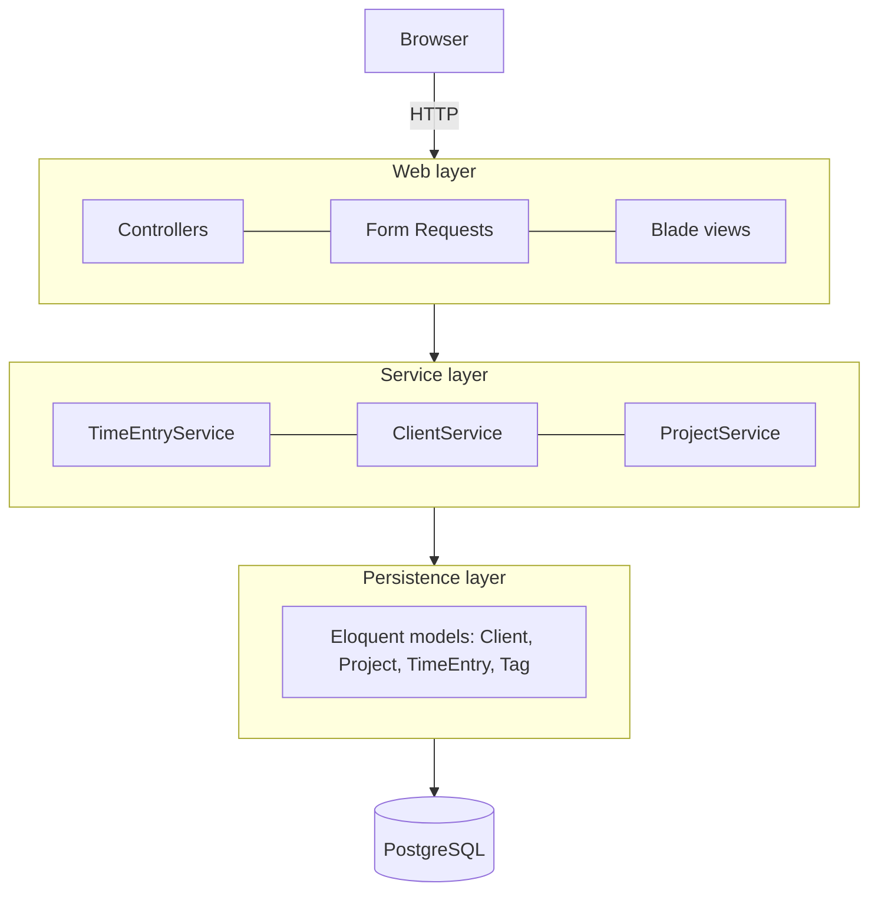

# 07 — Layers and dependency injection · Laravel

[← Concepts](README.md) · Starting point: end of lesson 06 · Estimated time in class: 2 h · Independent work tasks: [README](README.md#independent-work-2-h)

---

## What we build today

- `App\Models\Project::isArchived()` — a small helper on the model.
- `App\Exceptions\ProjectArchivedException` — a domain exception for the rule "no time on archived
  projects".
- `App\Services\TimeEntryService` — the time sheet query, the data for the form, and `log()`, which
  checks the rule, creates the entry and syncs its tags in **one transaction**.
- A thin `TimeEntryController` that receives the service through its **constructor** and turns the
  exception into a form error.
- A look inside the **service container** with Tinker: auto-resolution, `app()->make()`, singletons,
  and how interface bindings will work in lesson 09.

**Final result:** the time sheet and the "Log time" form work exactly as before. If somebody tries to log
time on an archived project, the form comes back with the message *"Project “…” is archived. You cannot
log time on it."* under the project field, and nothing is saved. The controller has no queries left.

> The class names in this lesson are fixed by the [code map](../../PROJECT.md#code-map). Your lesson 06
> code may use slightly different view or route names — keep yours, and change only what this guide
> changes.

---

## Step 1 — Look at the starting point

**Why:** before we move code, we need to know what is there. Open
`app/Http/Controllers/TimeEntryController.php`. After lesson 06 it looks roughly like this:

```php
<?php

// app/Http/Controllers/TimeEntryController.php  (end of lesson 06 — for reference, do not type)

namespace App\Http\Controllers;

use App\Http\Requests\StoreTimeEntryRequest;
use App\Models\Project;
use App\Models\Tag;
use App\Models\TimeEntry;
use Illuminate\Http\RedirectResponse;
use Illuminate\View\View;

class TimeEntryController extends Controller
{
    public function index(): View
    {
        $entries = TimeEntry::with(['project.client', 'tags'])
            ->latest('started_at')
            ->limit(50)
            ->get();

        return view('time-entries.index', ['entries' => $entries]);
    }

    public function create(): View
    {
        return view('time-entries.create', [
            'projects' => Project::with('client')->orderBy('name')->get(),
            'tags' => Tag::orderBy('name')->get(),
        ]);
    }

    public function store(StoreTimeEntryRequest $request): RedirectResponse
    {
        $entry = TimeEntry::create($request->safe()->except('tags'));
        $entry->tags()->sync($request->validated('tags', []));

        return redirect()->route('time-entries.index')->with('status', 'Time entry logged.');
    }
}
```

Every method talks to Eloquent directly. There are three queries and two writes in the controller, and no
transaction around the writes. Today all of this moves into a service.

**What happens today, in order:**

1. We add a helper to `Project` so the rule reads well.
2. We create the exception the rule throws.
3. We create the service and move the queries and writes into it.
4. We make the controller thin and inject the service.
5. We test the rule by hand, then look at how the container built everything.

---

## Step 2 — Add `isArchived()` to the Project model

**Why:** the service should say *what* it checks ("is the project archived?"), not *how*
(`archived_at !== null`). A small question about one object's own state belongs on the model. This is
not a business rule about the whole system, it is just a readable name for a field check.

Lesson 03 already added `isArchived()` to `Project` (and the lesson 05 intermediate task added
`archive()` and `unarchive()`) — check that it is there and skip to Step 3. If it is missing, open
`app/Models/Project.php` and add this method below the relationships. Your `casts()` method from lesson
03 should already cast `archived_at` to `datetime`; if it does not, add that line too.

```php
// app/Models/Project.php — add inside the class, below the relationship methods

    /**
     * An archived project is finished: it keeps its history but accepts no new time.
     */
    public function isArchived(): bool
    {
        return $this->archived_at !== null;
    }
```

```php
// app/Models/Project.php — casts() should contain at least these entries
    protected function casts(): array
    {
        return [
            'billing_type' => BillingType::class,
            'archived_at' => 'datetime',
        ];
    }
```

**What happens:**

1. `archived_at` is `null` for an active project and a Carbon date for an archived one.
2. `isArchived()` hides that detail. If one day "archived" also means "client is deleted", only this
   method changes.

**Check it works:**

```bash
php artisan tinker
```

```text
> App\Models\Project::first()->isArchived()
= false
```

---

## Step 3 — Create the domain exception

**Why:** the service must be able to say "no" without knowing anything about HTTP. It throws an
exception whose *class name* is the rule. The controller can then catch exactly this case.

Laravel 11 and newer no longer create an `app/Exceptions` folder by default. Create it, or let Artisan do
it:

```bash
php artisan make:exception ProjectArchivedException
```

Replace the generated file with:

```php
<?php

// app/Exceptions/ProjectArchivedException.php

namespace App\Exceptions;

use App\Models\Project;
use DomainException;

/**
 * Thrown when someone tries to log or move time onto an archived project.
 */
final class ProjectArchivedException extends DomainException
{
    public static function for(Project $project): self
    {
        return new self("Project “{$project->name}” is archived. You cannot log time on it.");
    }
}
```

**What happens:**

1. `DomainException` is a built-in PHP exception meaning "the value breaks a rule of the domain". Extending
   it tells readers this is a business error, not a technical failure.
2. `final` — nobody needs to extend this exception.
3. `for()` is a *named constructor*: a static method that builds the object with a good message. The
   caller writes `throw ProjectArchivedException::for($project);`, which reads like a sentence. (PHP
   allows keywords such as `for` as method names.)
4. The message is written for the end user, because the controller will show it on the form.

---

## Step 4 — Create `TimeEntryService`

**Why:** this is the heart of the lesson. The service holds every piece of time-entry logic that is not
about HTTP: the queries for the pages and the use case "log time".

Create the folder `app/Services` and the file (or run `php artisan make:class Services/TimeEntryService`
on Laravel 11+ and replace its content):

```php
<?php

// app/Services/TimeEntryService.php

namespace App\Services;

use App\Exceptions\ProjectArchivedException;
use App\Models\Project;
use App\Models\Tag;
use App\Models\TimeEntry;
use Illuminate\Database\Eloquent\Collection;
use Illuminate\Support\Arr;
use Illuminate\Support\Facades\DB;

/**
 * Use cases for time entries: reading the time sheet and logging new time.
 */
class TimeEntryService
{
    /**
     * The time sheet: newest entries first, with everything the page shows loaded up front (no N+1).
     *
     * @return Collection<int, TimeEntry>
     */
    public function timeSheet(int $limit = 50): Collection
    {
        return TimeEntry::query()
            ->with(['project.client', 'tags'])
            ->latest('started_at')
            ->limit($limit)
            ->get();
    }

    /**
     * Projects that can receive new time — archived ones are left out.
     *
     * @return Collection<int, Project>
     */
    public function loggableProjects(): Collection
    {
        return Project::query()
            ->with('client')
            ->whereNull('archived_at')
            ->orderBy('name')
            ->get();
    }

    /**
     * @return Collection<int, Tag>
     */
    public function availableTags(): Collection
    {
        return Tag::query()->orderBy('name')->get();
    }

    /**
     * Log a new time entry.
     *
     * @param  array<string, mixed>  $data  validated input: project_id, started_at, ended_at,
     *                                      description, billable, tags (list of tag ids, optional)
     *
     * @throws ProjectArchivedException when the project no longer accepts time
     */
    public function log(array $data): TimeEntry
    {
        return DB::transaction(function () use ($data): TimeEntry {
            $project = Project::query()->findOrFail($data['project_id']);

            if ($project->isArchived()) {
                throw ProjectArchivedException::for($project);
            }

            $entry = TimeEntry::create(Arr::except($data, ['tags']));
            $entry->tags()->sync($data['tags'] ?? []);

            return $entry;
        });
    }
}
```

**What happens:**

1. The three read methods are the queries that used to be in the controller. `loggableProjects()` now
   also leaves out archived projects — the same rule, used to build a better dropdown.
2. `log()` receives a plain **array**, not the request. That array is `$request->validated()`, so the
   keys are already checked by `StoreTimeEntryRequest`. The service can be called from a console command
   or a test with a hand-made array.
3. `DB::transaction(function () { ... })` opens a database transaction, runs the closure and **commits**
   when the closure returns. If anything inside throws, Laravel **rolls back** and re-throws the same
   exception. The return value of the closure is the return value of `DB::transaction()`.
4. Inside the transaction we load the project and check the rule **first**, before writing anything.
   `findOrFail()` throws `ModelNotFoundException` (shown as 404) if the id does not exist.
5. `throw ProjectArchivedException::for($project)` stops the method. Nothing has been written, and the
   transaction is rolled back anyway.
6. `Arr::except($data, ['tags'])` removes the `tags` key, because `tags` is not a column of
   `time_entries`. The remaining keys are filled into the model (they must be in `$fillable`, as in
   lesson 06).
7. `sync()` writes the pivot rows in `tag_time_entry`. If it fails (for example a tag id that does not
   exist), the whole transaction is rolled back — **no entry without its tags**.

**Why the class is not `final`:** in lesson 12 we will replace services with test doubles
(`$this->mock(TimeEntryService::class)`). Mockery creates a subclass of the class it mocks, and a `final`
class cannot be extended. Exceptions and small value objects can be `final`; services that are injected
elsewhere stay open.

**Why not `Rule::exists(...)->whereNull('archived_at')` in the form request?** That would work for the
web form. But the rule is about the *state of the business*, and it must also hold for a CSV import, an
API endpoint or a console command. Those will call the service, not the form request. Keep input checks
in the request and business rules in the service.

---

## Step 5 — Make the controller thin

**Why:** the controller should only translate HTTP into a service call and back.

Replace the whole controller:

```php
<?php

// app/Http/Controllers/TimeEntryController.php

namespace App\Http\Controllers;

use App\Exceptions\ProjectArchivedException;
use App\Http\Requests\StoreTimeEntryRequest;
use App\Services\TimeEntryService;
use Illuminate\Http\RedirectResponse;
use Illuminate\View\View;

class TimeEntryController extends Controller
{
    public function __construct(private readonly TimeEntryService $timeEntries) {}

    public function index(): View
    {
        return view('time-entries.index', [
            'entries' => $this->timeEntries->timeSheet(),
        ]);
    }

    public function create(): View
    {
        return view('time-entries.create', [
            'projects' => $this->timeEntries->loggableProjects(),
            'tags' => $this->timeEntries->availableTags(),
        ]);
    }

    public function store(StoreTimeEntryRequest $request): RedirectResponse
    {
        try {
            $this->timeEntries->log($request->validated());
        } catch (ProjectArchivedException $e) {
            return back()
                ->withInput()
                ->withErrors(['project_id' => $e->getMessage()]);
        }

        return redirect()
            ->route('time-entries.index')
            ->with('status', 'Time entry logged.');
    }
}
```

**What happens:**

1. `public function __construct(private readonly TimeEntryService $timeEntries) {}` uses **constructor
   property promotion**: PHP creates the private property `$timeEntries` and assigns the argument to it.
   `readonly` means it can be set only once — nobody can swap the service later by accident.
2. Nobody writes `new TimeEntryController(...)`. When a request arrives, Laravel's **service container**
   sees that the constructor needs a `TimeEntryService`, creates one (it has no constructor
   arguments of its own), and passes it in. This is **constructor injection**.
3. `store(StoreTimeEntryRequest $request)` is also injection — **method injection**. The container
   creates the Form Request, runs its validation, and only then calls `store()`. If validation fails, the
   user is redirected back before our code runs.
4. We catch **only** `ProjectArchivedException`. Any other exception (database down, a bug) is not
   hidden; it becomes Laravel's normal error page and appears in the log.
5. `back()->withInput()->withErrors([...])` returns to the form, fills the fields with the old values
   (`old()` in Blade) and puts the message into the `$errors` bag under the key `project_id`. Your lesson
   06 form already shows `@error('project_id')`, so the message appears under the project select.
6. The imports of `Project`, `Tag` and `TimeEntry` are gone. The controller no longer knows the models
   exist. That is the goal.

**Check it works:** open `/time-entries` — the list looks as before. Open `/time-entries/create` and log
an entry with two tags — you are redirected to the time sheet with "Time entry logged." and the tags are
shown.

**Commit:** `refactor(time-entries): move time entry logic into TimeEntryService`

---

## Step 6 — See the rule in action

**Why:** the dropdown no longer offers archived projects, so how can the error ever happen? Two ways:
the project is archived *while* the form is open, or someone edits the HTML and sends another id.
A rule in the UI alone is never enough — the server must check.

1. Open `/time-entries/create` in the browser and choose a project, but do not submit yet.
2. In another browser tab, archive that project with the Archive button from lesson 05 (intermediate
   task) — or, if you do not have that button, with Tinker (use the name you chose):

```bash
php artisan tinker
```

```text
> $p = App\Models\Project::where('name', 'Website redesign')->first();
> $p->archived_at = now();
> $p->save();
= true
```

   (`$p->update(['archived_at' => now()])` would not work: `archived_at` is deliberately not in
   `$fillable`, so lesson 03's guard throws a `MassAssignmentException`. Setting the attribute directly
   is not mass assignment.)

3. Fill in the rest of the form and submit.

**Check it works:**

- You are back on the form. Under the project field: *Project “Website redesign” is archived. You cannot
  log time on it.*
- The description and times you typed are still in the fields (`withInput()`).
- In Tinker, `App\Models\TimeEntry::count()` is the same as before.
- Reload the form: the archived project is no longer in the dropdown.

Un-archive it again so your data stays useful:

```text
> $p->archived_at = null;
> $p->save();
```

---

## Step 7 — Prove the transaction

**Why:** "it is in a transaction" is easy to say. Let us see a rollback happen.

The form request prevents invalid tag ids, so we call the service directly from Tinker with a tag id that
does not exist. The entry insert will succeed, then `sync()` fails on the foreign key.

```text
> $before = App\Models\TimeEntry::count();
> $service = app(App\Services\TimeEntryService::class);
> $service->log([
    'project_id' => App\Models\Project::whereNull('archived_at')->value('id'),
    'started_at' => '2026-09-28 09:00',
    'ended_at' => '2026-09-28 10:00',
    'description' => 'Transaction test',
    'billable' => true,
    'tags' => [999999],
  ]);
   Illuminate\Database\QueryException  SQLSTATE[23503]: Foreign key violation: 7 ERROR:
   insert or update on table "tag_time_entry" violates foreign key constraint ...
> App\Models\TimeEntry::count() === $before
= true
```

**What happens:**

1. `TimeEntry::create()` inserted a row — inside the open transaction.
2. `sync([999999])` tried to insert a pivot row pointing to a tag that does not exist. PostgreSQL
   refused it (error code `23503`, foreign key violation).
3. The exception left the closure, so `DB::transaction()` rolled back. The inserted entry disappeared.
4. The count is unchanged. Without the transaction you would now have an entry with no tags.

Notice also that the service worked **without any HTTP request**. That is what "reusable from a console
command" means in practice.

---

## Step 8 — Look inside the service container

**Why:** you now rely on the container every day. Let us see what it does, so it is not magic.

Still in Tinker:

```text
> app(App\Services\TimeEntryService::class)
= App\Services\TimeEntryService {#6123}

> app()->make(App\Services\TimeEntryService::class)
= App\Services\TimeEntryService {#6130}

> app(App\Services\TimeEntryService::class) === app(App\Services\TimeEntryService::class)
= false

> app()->make(App\Http\Controllers\TimeEntryController::class)
= App\Http\Controllers\TimeEntryController {#6141}
```

**What happens:**

1. `app(X::class)` and `app()->make(X::class)` do the same thing: ask the container for an object of
   class `X`.
2. We never registered `TimeEntryService` anywhere, yet the container built it. This is
   **auto-resolution**: for a *concrete* class, the container uses PHP reflection to read the constructor,
   builds each parameter the same way (recursively), and calls `new` for you.
3. The two objects are different (`false`): by default the container creates a **new instance each
   time**.
4. Making the controller works too: the container saw the `TimeEntryService` parameter and built one for
   it — exactly what happens on every request.

Now make it a singleton, only for this Tinker session:

```text
> app()->singleton(App\Services\TimeEntryService::class);
> app(App\Services\TimeEntryService::class) === app(App\Services\TimeEntryService::class)
= true
```

`singleton()` tells the container: build it once, then return the same object every time. In a real
project you would write this in `AppServiceProvider::register()`. We **do not need it** for our services
— they have no state, so creating a new one per request costs nothing. Close Tinker (`exit`); the
singleton setting is gone.

### `app()->make()` in your code vs constructor injection

You *could* write this in the controller:

```php
// Don't do this
public function store(StoreTimeEntryRequest $request): RedirectResponse
{
    $service = app(TimeEntryService::class);   // service locator
    // ...
}
```

This is called the **Service Locator** pattern: the class reaches out to a global registry and pulls
what it needs. It works, and Laravel's `$this->mock()` can still swap the object in feature tests. But
constructor injection wins because:

| | `app()->make()` inside methods | Constructor injection |
|---|---|---|
| Can you see the dependencies? | Only by reading every method | In the constructor signature |
| Can you create the class in a plain unit test? | Needs the whole Laravel container | `new TimeEntryController($fakeService)` |
| Can a dependency be missing? | Found at the moment that line runs | Found when the object is created |
| Is it clear the class is doing too much? | No | Yes — a constructor with 7 parameters is a warning sign |

Use `app()` only where injection is impossible (for example in a Blade helper function or a route
closure).

### Interfaces and bindings — when and how (read, do not type yet)

Auto-resolution works only for concrete classes. If a constructor asks for an **interface**, the
container cannot know which implementation you want:

```text
Target [App\Contracts\Notifier] is not instantiable while building [App\Services\BudgetMonitor].
```

You fix that with a **binding** in `AppServiceProvider::register()`:

```php
// app/Providers/AppServiceProvider.php — lesson 09 preview, do not add yet
public function register(): void
{
    $this->app->bind(Notifier::class, MailNotifier::class);          // new instance each time
    // or: $this->app->singleton(Notifier::class, MailNotifier::class); // one shared instance
}
```

When do you add an interface at all? In Billable:

| Class | Interface? | Why |
|---|---|---|
| `TimeEntryService` | No | One implementation. Mockery can mock the concrete class. |
| `ClientService`, `ProjectService` | No | Same. |
| `BillingStrategy` (lesson 08) | **Yes** | Three (later four) implementations chosen at runtime. |
| `Notifier` (lesson 09) | **Yes** | A boundary to the outside world (mail). Tests and local development want a different implementation. |

So: no `TimeEntryServiceInterface`. Interfaces come when there are **two or more implementations** or a
**boundary**.

---

## Step 9 — If you have edit and delete for time entries

If your lesson 06 independent work added `edit`, `update` and `destroy` to `TimeEntryController`, move
them into the service the same way. If you do not have them, skip this step.

Add to `TimeEntryService`, below `log()`:

```php
// app/Services/TimeEntryService.php — add below log()

    /**
     * @param  array<string, mixed>  $data  validated input, same keys as log()
     *
     * @throws ProjectArchivedException when the entry would be moved onto an archived project
     */
    public function update(TimeEntry $entry, array $data): TimeEntry
    {
        return DB::transaction(function () use ($entry, $data): TimeEntry {
            $project = Project::query()->findOrFail($data['project_id']);

            if ($project->isArchived()) {
                throw ProjectArchivedException::for($project);
            }

            $entry->update(Arr::except($data, ['tags']));
            $entry->tags()->sync($data['tags'] ?? []);

            return $entry;
        });
    }

    public function delete(TimeEntry $entry): void
    {
        // tag_time_entry has ON DELETE CASCADE, so the pivot rows go with the entry.
        $entry->delete();
    }
```

And in the controller:

```php
// app/Http/Controllers/TimeEntryController.php — replace update() and destroy()

    public function update(StoreTimeEntryRequest $request, TimeEntry $timeEntry): RedirectResponse
    {
        try {
            $this->timeEntries->update($timeEntry, $request->validated());
        } catch (ProjectArchivedException $e) {
            return back()->withInput()->withErrors(['project_id' => $e->getMessage()]);
        }

        return redirect()->route('time-entries.index')->with('status', 'Time entry updated.');
    }

    public function destroy(TimeEntry $timeEntry): RedirectResponse
    {
        $this->timeEntries->delete($timeEntry);

        return redirect()->route('time-entries.index')->with('status', 'Time entry deleted.');
    }
```

(Add `use App\Models\TimeEntry;` again for the route-model-bound parameter. Type-hinting a model for
route model binding is fine — it is the router loading the record, not your controller writing a query.)

**What happens:** `delete()` is a single SQL statement, so it needs no explicit transaction. Lesson 13
will add a rule here ("an entry on an invoice cannot be deleted", R14) — and now there is exactly one
place to add it.

---

## Step 10 — Format and commit

```bash
./vendor/bin/pint
git add -A
git commit -m "refactor(time-entries): inject TimeEntryService and reject archived projects"
```

**Check it works:** `./vendor/bin/pint --test` prints no files; CI is green after you push.

---

## Troubleshooting

| Error / symptom | Cause | Fix |
|---|---|---|
| `Class "App\Services\TimeEntryService" not found` | Wrong namespace or file name, or folder `Services` spelled differently | File must be `app/Services/TimeEntryService.php` with `namespace App\Services;`. Run `composer dump-autoload` if you renamed files. |
| `Target [App\...\Something] is not instantiable` | A constructor asks for an interface or abstract class without a binding | Type-hint the concrete class, or add a binding in `AppServiceProvider::register()` |
| `Unresolvable dependency resolving [Parameter #0 [ <required> int $perPage ]]` | You put a scalar (`int`, `string`) in a constructor the container builds | Scalars cannot be auto-resolved. Pass them as method arguments or give them a default value. |
| `Cannot modify readonly property ...::$timeEntries` | You assign the promoted property again | Assign only through the constructor |
| Error message does not appear on the form | The view shows errors under a different key, or `@error` is missing | The key in `withErrors([...])` must match `@error('project_id')` in the Blade form |
| `Add [archived_at] to fillable property ...` (`MassAssignmentException`) in Tinker | `archived_at` is not in `$fillable` | Use `$p->archived_at = now(); $p->save();`, or add it to `$fillable` |
| `SQLSTATE[25P02]: In failed sql transaction` | You caught a database exception *inside* `DB::transaction()` and continued | Do not catch exceptions inside the closure; let them roll back the transaction |
| AI suggests `App::make()` / `resolve()` inside the controller | Old or lazy pattern | Use constructor injection |

---

## Recap

- `app/Models/Project.php` — new `isArchived()` helper.
- `app/Exceptions/ProjectArchivedException.php` — domain exception with a named constructor.
- `app/Services/TimeEntryService.php` — queries for the pages, `log()` with a business rule and a
  transaction (plus `update()` / `delete()` if you have them).
- `app/Http/Controllers/TimeEntryController.php` — thin: constructor injection, one service call per
  action, catches only the domain exception.
- The service container auto-resolves concrete classes; interfaces need a binding in
  `AppServiceProvider::register()`.
- New instance per resolve is the default; `singleton()` shares one — not needed for stateless services.
- Constructor injection beats `app()->make()` because dependencies are visible and testable.

---

## Independent work — solutions

> **The tasks are not here.** The task descriptions (Basic / Intermediate / Advanced, with acceptance
> criteria) are in this lesson's [README.md → Independent work (~2 h)](README.md#independent-work-2-h).
> Read them there first and build the features in your project. This section only contains the
> solutions — try each task yourself, then open a solution to compare or when you are stuck.

<details>
<summary><strong>Basic 1</strong> — <code>ClientService</code> and <code>ProjectService</code></summary>

**Exceptions**

```php
<?php

// app/Exceptions/ClientHasProjectsException.php

namespace App\Exceptions;

use App\Models\Client;
use DomainException;

final class ClientHasProjectsException extends DomainException
{
    public static function for(Client $client): self
    {
        return new self("Client “{$client->name}” still has projects. Delete or move them first.");
    }
}
```

```php
<?php

// app/Exceptions/ProjectHasTimeEntriesException.php

namespace App\Exceptions;

use App\Models\Project;
use DomainException;

final class ProjectHasTimeEntriesException extends DomainException
{
    public static function for(Project $project): self
    {
        return new self("Project “{$project->name}” has logged time and cannot be deleted. Archive it instead.");
    }
}
```

**ClientService**

```php
<?php

// app/Services/ClientService.php

namespace App\Services;

use App\Exceptions\ClientHasProjectsException;
use App\Models\Client;
use Illuminate\Contracts\Pagination\LengthAwarePaginator;

class ClientService
{
    public function paginate(int $perPage = 10): LengthAwarePaginator
    {
        // withCount: the list page shows projects_count (lesson 04)
        return Client::query()
            ->withCount('projects')
            ->orderBy('name')
            ->orderBy('id')
            ->paginate($perPage);
    }

    /**
     * Load what the client detail page shows.
     */
    public function withProjects(Client $client): Client
    {
        return $client->load(['projects' => fn ($query) => $query->orderBy('name')]);
    }

    /**
     * @param  array<string, mixed>  $data  validated input: name, email, vat_number
     */
    public function create(array $data): Client
    {
        return Client::create($data);
    }

    /**
     * @param  array<string, mixed>  $data
     */
    public function update(Client $client, array $data): Client
    {
        $client->update($data);

        return $client;
    }

    /**
     * @throws ClientHasProjectsException
     */
    public function delete(Client $client): void
    {
        if ($client->projects()->exists()) {
            throw ClientHasProjectsException::for($client);
        }

        $client->delete();
    }
}
```

The e-mail uniqueness check stays in `StoreClientRequest` / `UpdateClientRequest` (`Rule::unique(...)`):
it is input validation with a nice field error, and the unique index on `clients.email` is the real
guarantee in the database.

**ClientController** (`create()` and `edit()` just return views and stay as in lesson 05)

```php
<?php

// app/Http/Controllers/ClientController.php

namespace App\Http\Controllers;

use App\Exceptions\ClientHasProjectsException;
use App\Http\Requests\StoreClientRequest;
use App\Http\Requests\UpdateClientRequest;
use App\Models\Client;
use App\Services\ClientService;
use Illuminate\Http\RedirectResponse;
use Illuminate\View\View;

class ClientController extends Controller
{
    public function __construct(private readonly ClientService $clients) {}

    public function index(): View
    {
        return view('clients.index', ['clients' => $this->clients->paginate()]);
    }

    public function show(Client $client): View
    {
        $client = $this->clients->withProjects($client);

        return view('clients.show', [
            'client' => $client,
            'projects' => $client->projects, // the lesson 04 view expects $projects
        ]);
    }

    public function create(): View
    {
        return view('clients.create', ['client' => new Client]); // the form partial needs $client
    }

    public function store(StoreClientRequest $request): RedirectResponse
    {
        $client = $this->clients->create($request->validated());

        return redirect()->route('clients.show', $client)->with('status', 'Client created.');
    }

    public function edit(Client $client): View
    {
        return view('clients.edit', ['client' => $client]);
    }

    public function update(UpdateClientRequest $request, Client $client): RedirectResponse
    {
        $this->clients->update($client, $request->validated());

        return redirect()->route('clients.show', $client)->with('status', 'Client updated.');
    }

    public function destroy(Client $client): RedirectResponse
    {
        try {
            $this->clients->delete($client);
        } catch (ClientHasProjectsException $e) {
            return redirect()->route('clients.show', $client)->with('error', $e->getMessage());
        }

        return redirect()->route('clients.index')->with('status', 'Client deleted.');
    }
}
```

If your layout only shows `session('status')`, add the error flash next to it:

```blade
<!-- resources/views/layouts/app.blade.php — next to the status message -->
@if (session('error'))
    <article role="alert" style="border-left: 4px solid var(--pico-del-color)">{{ session('error') }}</article>
@endif
```

**ProjectService**

Lesson 05 gave `StoreProjectRequest` (and `UpdateProjectRequest`, which extends it) a `projectData()`
method: it converts the euro inputs to cents and sets the prices that do not apply to the billing type to
`null`. That is input conversion, a web-layer job, so it stays in the request. The controller passes
`$request->projectData()` to the service.

```php
<?php

// app/Services/ProjectService.php

namespace App\Services;

use App\Exceptions\ProjectHasTimeEntriesException;
use App\Models\Client;
use App\Models\Project;
use Illuminate\Contracts\Pagination\LengthAwarePaginator;

class ProjectService
{
    public function forClient(Client $client, int $perPage = 15): LengthAwarePaginator
    {
        return $client->projects()->orderBy('name')->paginate($perPage);
    }

    /**
     * @param  array<string, mixed>  $data  from StoreProjectRequest::projectData() (cents, irrelevant prices null)
     */
    public function create(Client $client, array $data): Project
    {
        return $client->projects()->create($data);
    }

    /**
     * @param  array<string, mixed>  $data
     */
    public function update(Project $project, array $data): Project
    {
        $project->update($data);

        return $project;
    }

    /**
     * @throws ProjectHasTimeEntriesException
     */
    public function delete(Project $project): void
    {
        if ($project->timeEntries()->exists()) {
            throw ProjectHasTimeEntriesException::for($project);
        }

        $project->delete();
    }
}
```

`create()` and `update()` are short, and that is fine: the service is still the one place where a future
project rule goes (for example "a project that is already invoiced cannot change its billing type").
The real rule today is in `delete()`.

**ProjectController** — the changed methods (route names assume the shallow nested resource from lesson
04: `clients.projects.*` for index/create/store and `projects.*` for the rest):

```php
// app/Http/Controllers/ProjectController.php — constructor and changed methods
    public function __construct(private readonly ProjectService $projects) {}

    public function index(Client $client): View
    {
        return view('projects.index', [
            'client' => $client,
            'projects' => $this->projects->forClient($client),
        ]);
    }

    public function store(StoreProjectRequest $request, Client $client): RedirectResponse
    {
        $project = $this->projects->create($client, $request->projectData());

        return redirect()->route('projects.show', $project)->with('status', 'Project created.');
    }

    public function update(UpdateProjectRequest $request, Project $project): RedirectResponse
    {
        $this->projects->update($project, $request->projectData());

        return redirect()->route('projects.show', $project)->with('status', 'Project updated.');
    }

    public function destroy(Project $project): RedirectResponse
    {
        try {
            $this->projects->delete($project);
        } catch (ProjectHasTimeEntriesException $e) {
            return redirect()->route('projects.show', $project)->with('error', $e->getMessage());
        }

        return redirect()->route('clients.projects.index', $project->client_id)
            ->with('status', 'Project deleted.');
    }
```

**Check:** delete a client with projects → error flash on the client page, client still exists. Delete a
project with time entries → error flash. Create/edit still work.

Commit: `refactor(clients,projects): move rules into ClientService and ProjectService`
</details>

<details>
<summary><strong>Basic 2</strong> — <code>docs/architecture.md</code> (example)</summary>

````markdown
<!-- docs/architecture.md -->
# Architecture

Billable is a server-rendered Laravel application with three layers. Each layer may call only the
layer below it.



## Web layer

Controllers in `app/Http/Controllers` receive the HTTP request, let a Form Request validate the input
shape (for example `StoreTimeEntryRequest` checks that `ended_at` is after `started_at`), call one
service method and return a view or a redirect with a flash message. Controllers contain no queries and
no business rules. They catch domain exceptions such as `ProjectArchivedException` and show them as
form errors.

## Service layer

Services in `app/Services` implement the use cases. `TimeEntryService::log()` refuses time on archived
projects, creates the entry and attaches its tags in one database transaction. Services receive plain
validated arrays, never the request, so they can be used from console commands and tests. They know
nothing about redirects, sessions or views.

## Persistence layer

Eloquent models in `app/Models` map tables to objects and define relationships (`Project` belongs to
`Client`, `TimeEntry` has many `Tag`s). They may answer simple questions about their own data, such as
`Project::isArchived()`, but they do not coordinate other models or send e-mails.
````
</details>

<details>
<summary><strong>Intermediate</strong> — "a time entry cannot be logged in the future"</summary>

```php
<?php

// app/Exceptions/TimeEntryInFutureException.php

namespace App\Exceptions;

use Carbon\CarbonInterface;
use DomainException;

final class TimeEntryInFutureException extends DomainException
{
    public static function endingAt(CarbonInterface $endedAt): self
    {
        return new self("The entry ends at {$endedAt->format('d.m.Y H:i')}, which is in the future. You can only log time that has already happened.");
    }
}
```

In `TimeEntryService::log()`, add the check inside the transaction, after the archived check:

```php
// app/Services/TimeEntryService.php — inside log(), after the archived check
            $endedAt = Carbon::parse($data['ended_at']);

            if ($endedAt->isAfter(now())) {
                throw TimeEntryInFutureException::endingAt($endedAt);
            }
```

Add the imports at the top: `use App\Exceptions\TimeEntryInFutureException;` and
`use Illuminate\Support\Carbon;`.

In the controller, add a second `catch`:

```php
// app/Http/Controllers/TimeEntryController.php — store()
        try {
            $this->timeEntries->log($request->validated());
        } catch (ProjectArchivedException $e) {
            return back()->withInput()->withErrors(['project_id' => $e->getMessage()]);
        } catch (TimeEntryInFutureException $e) {
            return back()->withInput()->withErrors(['ended_at' => $e->getMessage()]);
        }
```

**What happens:** `Carbon::parse()` reads the string in the application timezone (Europe/Tallinn, set in
lesson 01). `now()` is the current moment. `isAfter()` compares the two.

`now()` asks the system clock directly, which makes the rule hard to test: "one minute in the future" is
a different moment every time the test runs. Laravel lets tests freeze `now()` with
`Carbon::setTestNow()` / `$this->travelTo()` — lesson 12 does exactly that. (Laravel also has a
`before_or_equal:now` validation rule; we keep the rule in the service so that every entry point
obeys it, and so it is tested together with the other rules.)

**Check:** end time one minute from now → error under the end-time field; one minute ago → saved.

Commit: `feat(time-entries): reject entries that end in the future`
</details>

<details>
<summary><strong>Advanced</strong> — a test that keeps queries out of controllers</summary>

A simple, honest approach: read every controller file and look for code that queries the database. It
is a text search, so it is not perfect, but it catches the common mistakes and runs in milliseconds.

```php
<?php

// tests/Unit/ControllersDoNotQueryTest.php

namespace Tests\Unit;

use FilesystemIterator;
use PHPUnit\Framework\Attributes\DataProvider;
use PHPUnit\Framework\TestCase;
use RecursiveDirectoryIterator;
use RecursiveIteratorIterator;
use SplFileInfo;

/**
 * Architecture rule: controllers call services; they never query the database themselves.
 */
class ControllersDoNotQueryTest extends TestCase
{
    /** Text that means "this line talks to the database". */
    private const FORBIDDEN = ['DB::', '::query(', '::where(', '::with(', '::create(', '::find(', '::all('];

    /**
     * @return iterable<string, array{string}>
     */
    public static function controllerFiles(): iterable
    {
        $directory = dirname(__DIR__, 2).'/app/Http/Controllers';
        $files = new RecursiveIteratorIterator(
            new RecursiveDirectoryIterator($directory, FilesystemIterator::SKIP_DOTS)
        );

        /** @var SplFileInfo $file */
        foreach ($files as $file) {
            if ($file->getExtension() === 'php') {
                yield $file->getFilename() => [$file->getPathname()];
            }
        }
    }

    #[DataProvider('controllerFiles')]
    public function test_controller_does_not_query_the_database(string $path): void
    {
        $code = (string) file_get_contents($path);

        foreach (self::FORBIDDEN as $needle) {
            $this->assertStringNotContainsString(
                $needle,
                $code,
                basename($path)." contains '{$needle}'. Move the query into a service."
            );
        }
    }
}
```

**What happens:**

1. It extends `PHPUnit\Framework\TestCase`, not Laravel's `Tests\TestCase`: it needs no application and
   no database, so it is a pure unit test.
2. `controllerFiles()` is a **data provider**: it yields one set of arguments per controller file. PHPUnit
   runs the test once per file and names each run after the file, so a failure says *which* controller.
3. The test fails with a readable message the moment someone writes `DB::table(...)` or
   `Client::where(...)` in a controller.

Run it:

```bash
php artisan test --filter=ControllersDoNotQueryTest
```

It will probably fail for `ReportController.php`, because the weekly report from lesson 06 runs its
`GROUP BY` query in the controller. Fix it by moving the query — unchanged — into a service:

```php
<?php

// app/Services/ReportService.php

namespace App\Services;

use Carbon\CarbonImmutable;
use Illuminate\Support\Collection;
use Illuminate\Support\Facades\DB;

class ReportService
{
    /**
     * Minutes per project for the week from $from (Monday 00:00) to $to (next Monday 00:00).
     * Paste YOUR lesson 06 query here, unchanged; this is the lesson 06 version.
     *
     * @return Collection<int, object{id: int, project_name: string, client_name: string, minutes: int}>
     */
    public function weeklySummary(CarbonImmutable $from, CarbonImmutable $to): Collection
    {
        return DB::table('time_entries')
            ->join('projects', 'projects.id', '=', 'time_entries.project_id')
            ->join('clients', 'clients.id', '=', 'projects.client_id')
            ->where('time_entries.started_at', '>=', $from)
            ->where('time_entries.started_at', '<', $to)
            ->groupBy('projects.id', 'projects.name', 'clients.name')
            ->orderBy('clients.name')
            ->orderBy('projects.name')
            ->select('projects.id', 'projects.name as project_name', 'clients.name as client_name')
            ->selectRaw('CAST(SUM(EXTRACT(EPOCH FROM (time_entries.ended_at - time_entries.started_at))) / 60 AS integer) AS minutes')
            ->get();
    }
}
```

```php
// app/Http/Controllers/ReportController.php — the controller keeps the week parsing, the query moves out
    public function __construct(private readonly ReportService $reports) {}

    public function weekly(Request $request): View
    {
        // ... the lesson 06 lines that read ?week= and compute $week, $from and $to stay unchanged ...

        $rows = $this->reports->weeklySummary($from, $to);

        return view('reports.weekly', [
            'week' => $week,
            'from' => $from,
            'to' => $to->subDay(),
            'rows' => $rows,
            'totalMinutes' => (int) $rows->sum('minutes'),
            'previousWeek' => $from->subWeek()->format('o-\WW'),
            'nextWeek' => $from->addWeek()->format('o-\WW'),
        ]);
    }
```

(Remove the `use Illuminate\Support\Facades\DB;` import from the controller and add
`use App\Services\ReportService;`. The view `reports/weekly.blade.php` does not change.)

**Check that the test really protects you:** paste `\DB::table('clients')->get();` into any controller
method, run the test — it fails naming that file. Remove the line — green.

(If you use Pest instead of PHPUnit, its architecture plugin can express the same rule as
`arch()->expect('App\Http\Controllers')->not->toUse('Illuminate\Support\Facades\DB');`. We stay with
PHPUnit in this module.)

Commit: `test(architecture): forbid database queries in controllers`
</details>
