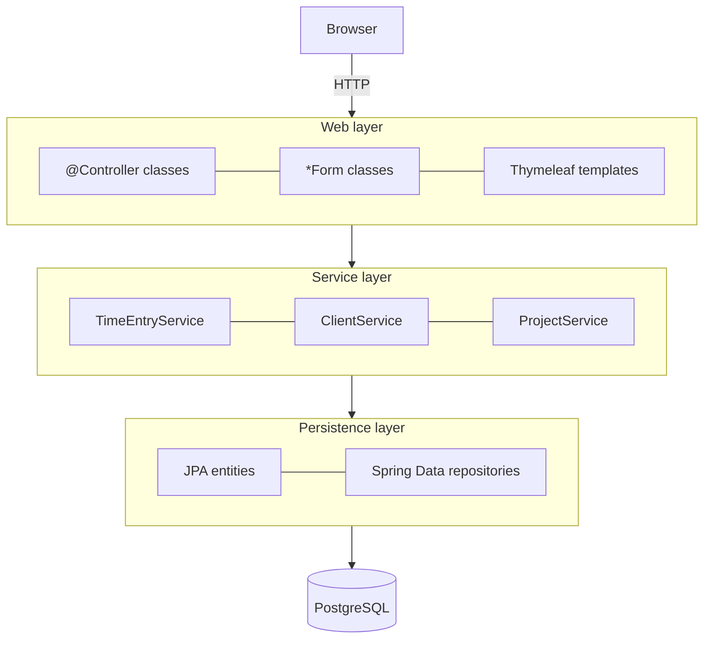

# 07 — Layers and dependency injection · Spring Boot

[← Concepts](README.md) · Starting point: end of lesson 06 · Estimated time in class: 2 h

---

## What we build today

- `project.Project.isArchived()` and `project.ProjectArchivedException` — the rule "no time on archived
  projects".
- `timeentry.LogTimeEntryCommand` — an immutable record that carries validated form data into the
  service.
- `timeentry.TimeEntryService` — the time sheet query, the data for the form, and `log()`, which checks
  the rule, creates the entry and attaches its tags in **one transaction** (`@Transactional`).
- `client.ClientService` — client create / update / delete, including the rules "e-mail must be unique"
  and "a client with projects cannot be deleted", reported with domain exceptions.
- Thin `TimeEntryController` and `ClientController` with **constructor injection** and no repositories.
- A look at how Spring builds beans: stereotypes, start-up failures and transaction proxies.

**Final result:** every page works as before. Logging time on an archived project returns the form with
*"Project “…” is archived. You cannot log time on it."* under the project field. Controllers depend only
on services.

> The class names come from the [code map](../../PROJECT.md#code-map). Your lesson 04–06 code may use
> slightly different template names or repository method names (for example the eager-loading query of
> the time sheet). Keep yours — what matters today is *where* the code lives.

---

## Step 1 — Look at the starting point

**Why:** we need to see what we are moving. After lesson 06, `TimeEntryController` looks roughly like this:

```java
// src/main/java/ee/ta25/billable/timeentry/TimeEntryController.java  (end of lesson 06 — do not type)
@Controller
@RequestMapping("/time-entries")
public class TimeEntryController {

  private final TimeEntryRepository timeEntries;
  private final ProjectRepository projects;
  private final TagRepository tags;

  public TimeEntryController(
      TimeEntryRepository timeEntries, ProjectRepository projects, TagRepository tags) {
    this.timeEntries = timeEntries;
    this.projects = projects;
    this.tags = tags;
  }

  @PostMapping
  public String store(
      @Valid @ModelAttribute("form") TimeEntryForm form,
      BindingResult bindingResult,
      Model model,
      RedirectAttributes redirectAttributes) {
    if (bindingResult.hasErrors()) {
      addFormData(model);
      return "time-entries/new";
    }
    Project project = projects.findById(form.getProjectId()).orElseThrow();
    var entry =
        new TimeEntry(
            project,
            form.getStartedAt(),
            form.getEndedAt(),
            form.getDescription(),
            form.isBillable());
    entry.getTags().addAll(tags.findAllById(form.getTagIds()));
    timeEntries.save(entry);
    redirectAttributes.addFlashAttribute("status", "Time entry logged.");
    return "redirect:/time-entries";
  }

  // index(), create() and addFormData(...) use the three repositories directly
}
```

The controller already uses constructor injection (good) — but it injects **repositories**. It builds
entities and saves them. There is no transaction: `save()` runs in its own small transaction, so if a
later step failed, the entry would already be committed.

`ClientController` from lesson 05 is similar: it checks `existsByEmail(...)` and "does this client have
projects?" itself, and calls `ClientRepository` directly.

---

## Step 2 — Spring stereotypes in one table

**Why:** we are about to add `@Service` classes. You should know which annotation means what.

Spring finds your classes by **component scanning**: at start-up it scans the package of the class with
`@SpringBootApplication` (`ee.ta25.billable`) and every sub-package, and creates one object (a *bean*)
for every class marked with a stereotype annotation.

| Annotation | Use it on | Extra behaviour |
|---|---|---|
| `@Component` | Any general bean (a strategy, a helper) | none — the base annotation |
| `@Service` | Classes in the service layer | none; it is a `@Component` with a clearer name |
| `@Repository` | Hand-written DAO classes | translates database exceptions into Spring's `DataAccessException`. **Spring Data interfaces (`extends JpaRepository`) need no annotation** — Spring creates them anyway |
| `@Controller` | MVC controllers that return view names | request mapping |
| `@RestController` | Controllers that return JSON | `@Controller` + `@ResponseBody` |
| `@Configuration` + `@Bean` | Classes that create beans by hand (e.g. a `Clock`) | the method's return value becomes a bean |

**Constructor injection in Spring, the modern way:**

- One constructor → Spring uses it automatically. **No `@Autowired` needed** (since Spring 4.3).
- Fields are `private final` → they must be set in the constructor and never change.
- No field injection (`@Autowired private X x;`) — AI tools still produce it; do not accept it.

---

## Step 3 — Add `isArchived()` and the domain exception

**Why:** the service should read like the rule: "if the project is archived, refuse". A small question
about an entity's own state belongs on the entity.

`Project` already has `isArchived()` and `archive(LocalDateTime)` since lesson 03 (and `archive()` /
`unarchive()` if you did the lesson 05 intermediate task) — keep them, do not add a second copy. Check
that yours looks like this:

```java
// src/main/java/ee/ta25/billable/project/Project.java — already there since lesson 03

  /** An archived project keeps its history but accepts no new time. */
  public boolean isArchived() {
    return archivedAt != null;
  }
```

Create the exception in the `project` package — the rule is about projects, even though the time-entry
service throws it:

```java
// src/main/java/ee/ta25/billable/project/ProjectArchivedException.java
package ee.ta25.billable.project;

/** Thrown when someone tries to log time on an archived project. */
public class ProjectArchivedException extends RuntimeException {

  public ProjectArchivedException(Project project) {
    super("Project “%s” is archived. You cannot log time on it.".formatted(project.getName()));
  }
}
```

**What happens:**

1. It extends `RuntimeException` (an *unchecked* exception). Callers are not forced to write
   `throws`, and — important — Spring's `@Transactional` **rolls back on unchecked exceptions by
   default**. A checked exception (`extends Exception`) would *commit* the transaction unless you
   configure `rollbackFor`.
2. The message is written for the end user; the controller will show it on the form.

---

## Step 4 — A command record for the service

**Why:** the service must not receive `TimeEntryForm`. The form is a web-layer class: it has setters for
data binding and validation annotations for the HTML form. The service gets an immutable **command** —
"log this entry" — that means "already validated data".

```java
// src/main/java/ee/ta25/billable/timeentry/LogTimeEntryCommand.java
package ee.ta25.billable.timeentry;

import java.time.LocalDateTime;
import java.util.Set;

/** Validated data for logging one time entry. */
public record LogTimeEntryCommand(
    long projectId,
    LocalDateTime startedAt,
    LocalDateTime endedAt,
    String description,
    boolean billable,
    Set<Long> tagIds) {

  public LogTimeEntryCommand {
    tagIds = tagIds == null ? Set.of() : Set.copyOf(tagIds);
  }
}
```

Add a method to `TimeEntryForm` that builds the command:

```java
// src/main/java/ee/ta25/billable/timeentry/TimeEntryForm.java — add inside the class

  public LogTimeEntryCommand toCommand() {
    return new LogTimeEntryCommand(
        projectId,
        startedAt,
        endedAt,
        description.strip(),
        billable,
        tagIds == null ? null : Set.copyOf(tagIds));
  }
```

(Add `import java.util.Set;`. If your field names differ, use yours. The `tagIds` field comes from the
lesson 06 Basic task "tag time entries" — if you skipped it, add the field and its getter/setter from
that solution first.)

**What happens:**

1. A **record** is an immutable data class: Java generates the constructor, accessors
   (`command.projectId()`), `equals`, `hashCode` and `toString`.
2. The block `public LogTimeEntryCommand { ... }` is a **compact constructor**. It runs before the fields
   are assigned, so we can normalise the arguments: a missing tag list becomes an empty set, and
   `Set.copyOf` makes an unmodifiable copy so nobody can change the command later.
3. `toCommand()` is called only **after** validation passed, so `projectId` is not null here
   (`@NotNull` on the form). Unboxing `Long` → `long` is safe.

---

## Step 5 — Create `TimeEntryService`

**Why:** this is the heart of the lesson — the class that owns the time-entry use cases.

The service uses `ProjectRepository.findByArchivedAtIsNullOrderByNameAsc()` for the project dropdown.
It **already exists since lesson 06** (with `@EntityGraph(attributePaths = "client")`, so the client
name in the dropdown is loaded in the same query) — do not add it again, or the interface will not
compile.

Now the service:

```java
// src/main/java/ee/ta25/billable/timeentry/TimeEntryService.java
package ee.ta25.billable.timeentry;

import ee.ta25.billable.common.NotFoundException;
import ee.ta25.billable.project.Project;
import ee.ta25.billable.project.ProjectArchivedException;
import ee.ta25.billable.project.ProjectRepository;
import java.util.List;
import org.springframework.data.domain.Sort;
import org.springframework.stereotype.Service;
import org.springframework.transaction.annotation.Transactional;

/** Use cases for time entries: reading the time sheet and logging new time. */
@Service
@Transactional(readOnly = true)
public class TimeEntryService {

  private final TimeEntryRepository timeEntries;
  private final ProjectRepository projects;
  private final TagRepository tags;

  public TimeEntryService(
      TimeEntryRepository timeEntries, ProjectRepository projects, TagRepository tags) {
    this.timeEntries = timeEntries;
    this.projects = projects;
    this.tags = tags;
  }

  /** The time sheet with project, client and tags loaded up front (your lesson 06 query). */
  public List<TimeEntry> timeSheet() {
    return timeEntries.findAllForTimeSheet();
  }

  /** Projects that can receive new time. */
  public List<Project> loggableProjects() {
    return projects.findByArchivedAtIsNullOrderByNameAsc();
  }

  public List<Tag> availableTags() {
    return tags.findAll(Sort.by("name"));
  }

  /**
   * Logs a new time entry with its tags.
   *
   * @throws NotFoundException if there is no project with this id
   * @throws ProjectArchivedException if the project no longer accepts time
   */
  @Transactional
  public TimeEntry log(LogTimeEntryCommand command) {
    Project project =
        projects
            .findById(command.projectId())
            .orElseThrow(
                () -> new NotFoundException("Project " + command.projectId() + " not found"));

    if (project.isArchived()) {
      throw new ProjectArchivedException(project);
    }

    var entry =
        new TimeEntry(
            project,
            command.startedAt(),
            command.endedAt(),
            command.description(),
            command.billable());
    entry.getTags().addAll(tags.findAllById(command.tagIds()));
    return timeEntries.save(entry);
  }
}
```

**What happens:**

1. `@Service` marks the class for component scanning. Spring creates **one** instance at start-up.
2. The constructor lists the three repositories. Spring sees one constructor and passes the repository
   beans in — no `@Autowired`. The fields are `final`, so the service is **stateless**: it holds only its
   dependencies, never request data. That matters because the same instance serves every request at the
   same time.
3. `@Transactional(readOnly = true)` on the **class** applies to every public method: each read runs in
   a read-only transaction (Hibernate skips dirty checking, which is a little faster, and the lazy
   relations can be loaded inside the method).
4. `@Transactional` on `log()` **overrides** the class setting: this method may write. The transaction
   starts before the first line and commits after `return`. If a `RuntimeException` escapes —
   `ProjectArchivedException`, or a database error while saving the tags — **everything rolls back**.
5. The rule is checked **before** anything is written. The dropdown already hides archived projects, but
   the server must check anyway: the project can be archived while the form is open, or someone can send
   a different id.
6. `findAllById(...)` loads all selected tags in one query; `getTags().addAll(...)` fills the
   `@ManyToMany` set; `save()` inserts the entry and, at commit, the rows in `tag_time_entry`.
7. A non-existent project id throws `common.NotFoundException` from lesson 04 → a **404** page, the
   same answer Laravel's `findOrFail()` gives. The dropdown only offers real projects, but someone can
   send any id, or the project can be deleted while the form is open. That is a "not found", not a
   server error, so it must not become a 500. (`ClientService.get()` in Step 9 uses the same exception.)

**Why the class is not `final`:** Spring implements `@Transactional` with a **proxy** — a generated
*subclass* of `TimeEntryService` that opens and closes the transaction around your method. A `final`
class cannot be subclassed, and the application would fail to start. A `final` *method* is worse: the
application starts, but the proxy cannot override that method, so it runs **without** a transaction.

---

## Step 6 — Make `TimeEntryController` thin

**Why:** the controller should only translate HTTP into a service call and back.

Replace the whole controller (keep your own template names if they differ):

```java
// src/main/java/ee/ta25/billable/timeentry/TimeEntryController.java
package ee.ta25.billable.timeentry;

import ee.ta25.billable.project.ProjectArchivedException;
import jakarta.validation.Valid;
import org.springframework.stereotype.Controller;
import org.springframework.ui.Model;
import org.springframework.validation.BindingResult;
import org.springframework.web.bind.annotation.GetMapping;
import org.springframework.web.bind.annotation.ModelAttribute;
import org.springframework.web.bind.annotation.PostMapping;
import org.springframework.web.bind.annotation.RequestMapping;
import org.springframework.web.servlet.mvc.support.RedirectAttributes;

@Controller
@RequestMapping("/time-entries")
public class TimeEntryController {

  private final TimeEntryService timeEntries;

  public TimeEntryController(TimeEntryService timeEntries) {
    this.timeEntries = timeEntries;
  }

  @GetMapping
  public String index(Model model) {
    model.addAttribute("entries", timeEntries.timeSheet());
    return "time-entries/index";
  }

  @GetMapping("/new")
  public String create(Model model) {
    model.addAttribute("form", new TimeEntryForm());
    addFormData(model);
    return "time-entries/new";
  }

  @PostMapping
  public String store(
      @Valid @ModelAttribute("form") TimeEntryForm form,
      BindingResult bindingResult,
      Model model,
      RedirectAttributes redirectAttributes) {
    if (bindingResult.hasErrors()) {
      addFormData(model);
      return "time-entries/new";
    }

    try {
      timeEntries.log(form.toCommand());
    } catch (ProjectArchivedException e) {
      bindingResult.rejectValue("projectId", "project.archived", e.getMessage());
      addFormData(model);
      return "time-entries/new";
    }

    redirectAttributes.addFlashAttribute("status", "Time entry logged.");
    return "redirect:/time-entries";
  }

  private void addFormData(Model model) {
    model.addAttribute("projects", timeEntries.loggableProjects());
    model.addAttribute("tags", timeEntries.availableTags());
  }
}
```

**What happens:**

1. The controller now has **one** dependency, the service. It imports nothing from Spring Data and no
   entity except through the service's return values.
2. Validation still happens at the edge: `@Valid` runs the Jakarta Validation annotations on the form
   (including your R4 check from lesson 06) and puts the problems into `BindingResult`.
3. After validation, `toCommand()` turns the form into the command and the service does the work.
4. We catch **only** `ProjectArchivedException`. Any other exception still becomes an error page and a
   stack trace in the log — real bugs stay visible.
5. `bindingResult.rejectValue("projectId", "project.archived", e.getMessage())` adds a **field error**
   as if validation had found it. The arguments are: field name, an error code (used to look up a text
   in `messages.properties` — we have none, so the third argument, the default message, is shown).
   Your template's `th:errors="*{projectId}"` shows it under the select.
6. We return the view directly (not a redirect), so the form keeps what the user typed.

**Check it works:** start the app (`./mvnw spring-boot:run`), open `http://localhost:8080/time-entries`
— the time sheet is unchanged. Log a new entry with two tags — you land on the time sheet with
"Time entry logged." and see the tags.

**Commit:** `refactor(time-entries): move time entry logic into TimeEntryService`

---

## Step 7 — See the rule and the transaction in action

**Why:** we want to *see* the rule and the rollback, not just believe them.

Turn on transaction logging for a moment in `application.properties`:

```properties
# src/main/resources/application.properties — temporary, remove after this step
logging.level.org.springframework.orm.jpa.JpaTransactionManager=DEBUG
```

1. Open `/time-entries/new` and pick a project. Do not submit yet.
2. In another tab, archive that project with the Archive button from the lesson 05 intermediate task —
   or, if you do not have it, directly in the database (a dev shortcut):

```bash
docker compose exec postgres psql -U billable -d billable \
  -c "UPDATE projects SET archived_at = now() WHERE name = 'Website redesign';"
```

3. Fill in the form and submit.

**Check it works:**

- The form comes back with *Project “Website redesign” is archived. You cannot log time on it.* under
  the project field, and your other input is still there.
- The console shows lines like:

```text
Creating new transaction with name [ee.ta25.billable.timeentry.TimeEntryService.log]: PROPAGATION_REQUIRED,ISOLATION_DEFAULT
...
Initiating transaction rollback
Rolling back JPA transaction on EntityManager [...]
```

- Reload the form: the archived project is gone from the dropdown.
- Log a normal entry and look for `Committing JPA transaction` instead.

Un-archive the project and remove the logging line again:

```bash
docker compose exec postgres psql -U billable -d billable \
  -c "UPDATE projects SET archived_at = NULL WHERE name = 'Website redesign';"
```

**What happens:** the transaction name is the **method** name — the proxy started it before `log()` ran.
The exception left the method, so the proxy rolled back instead of committing.

---

## Step 8 — Look at the container: proxies and start-up failures

**Why:** DI is not magic. Two small experiments show what Spring really does.

**Experiment 1 — the proxy.** Temporarily add one line to the `TimeEntryController` constructor:

```java
// TimeEntryController constructor — temporary
    System.out.println("Injected: " + timeEntries.getClass().getName());
```

Restart. The console shows something like:

```text
Injected: ee.ta25.billable.timeentry.TimeEntryService$$SpringCGLIB$$0
```

You did not get your own class, but a **subclass generated at runtime** (CGLIB is the library that
generates it). This proxy is how `@Transactional` works: its `log()` starts a transaction, calls your
`log()`, then commits or rolls back.

A consequence you must know: if a method *inside* `TimeEntryService` calls `this.log(...)`, the call does
not go through the proxy, so no transaction starts for it. Transaction settings apply only to calls that
come **from outside** the bean.

**Experiment 2 — a missing bean.** Temporarily remove `@Service` from `TimeEntryService` and restart:

```text
***************************
APPLICATION FAILED TO START
***************************

Description:

Parameter 0 of constructor in ee.ta25.billable.timeentry.TimeEntryController required a bean of type 'ee.ta25.billable.timeentry.TimeEntryService' that could not be found.

Action:

Consider defining a bean of type 'ee.ta25.billable.timeentry.TimeEntryService' in your configuration.
```

Spring builds the whole object graph **at start-up**. A missing dependency is found before the first
request — not when a user clicks a button. Put `@Service` back and remove the `println`.

**Singleton scope vs the Singleton pattern.** Spring created exactly one `TimeEntryService`. That is
*singleton scope*: a choice made by the container. The class itself is ordinary — in a unit test (lesson
12) you will write `new TimeEntryService(fakeRepo, fakeRepo, fakeRepo)` yourself. The GoF *Singleton
pattern* (private constructor + `static getInstance()`) would make that impossible. Lesson 09 lists it
among the patterns to avoid in application code.

**When do you need an interface?** Spring injects by type. With one class, like `TimeEntryService`, no
interface is needed. When there are two implementations of one interface, Spring cannot choose and fails
at start-up with *"expected single matching bean but found 2"* — then you mark one `@Primary` or pick one
with `@Qualifier`. Lesson 09 meets this with `Notifier` (a boundary to e-mail) and avoids it by letting
one `@Bean` method create only the implementation a setting asks for. In lesson 08 you
will inject **all** implementations at once as a `List<BillingStrategy>`.

---

## Step 9 — `ClientService`: move the client rules

**Why:** `ClientController` still decides two business rules itself. They move into a service that
throws domain exceptions; the controller maps them to a field error or a flash message.

### 9.1 Exceptions

For "not found" we keep using `common.NotFoundException` from lesson 04 — it already becomes a 404
page. Two new domain exceptions describe the client rules:

```java
// src/main/java/ee/ta25/billable/client/DuplicateEmailException.java
package ee.ta25.billable.client;

/** Another client already uses this e-mail address. */
public class DuplicateEmailException extends RuntimeException {

  public DuplicateEmailException(String email) {
    super("This e-mail is already used by another client: " + email);
  }
}
```

```java
// src/main/java/ee/ta25/billable/client/ClientHasProjectsException.java
package ee.ta25.billable.client;

/** A client that still has projects cannot be deleted (projects.client_id is ON DELETE RESTRICT). */
public class ClientHasProjectsException extends RuntimeException {

  public ClientHasProjectsException(Client client, long projectCount) {
    super(
        "%s still has %d project(s). Delete or archive them first."
            .formatted(client.getName(), projectCount));
  }
}
```

**What happens:** both extend `RuntimeException`, so a thrown exception rolls the transaction back. The
messages are the same texts lesson 05 showed, so the user sees no difference.

### 9.2 Command and form

```java
// src/main/java/ee/ta25/billable/client/ClientCommand.java
package ee.ta25.billable.client;

/** Validated data for creating or updating a client. */
public record ClientCommand(String name, String email, String vatNumber) {

  public ClientCommand {
    name = name.strip();
    email = email.strip();
    vatNumber = vatNumber == null || vatNumber.isBlank() ? null : vatNumber.strip();
  }
}
```

Add one method to `ClientForm` (the static `from(Client)` for the edit page exists since lesson 05):

```java
// src/main/java/ee/ta25/billable/client/ClientForm.java — add inside the class

  public ClientCommand toCommand() {
    return new ClientCommand(name, email, vatNumber);
  }
```

The compact constructor normalises the data once: spaces around the name or e-mail are removed and an
empty VAT field becomes `null`, whoever calls the service.

### 9.3 Repository methods

Nothing new. From lessons 04–05 you already have `ClientRepository.existsByEmailIgnoreCase(String)`,
`existsByEmailIgnoreCaseAndIdNot(String, Long)`, and `ProjectRepository.countByClientId(Long)`,
`findByClientIdOrderByName(Long)` and `countByClientIds(...)`. They simply move from the controller to
the service.

### 9.4 The service

```java
// src/main/java/ee/ta25/billable/client/ClientService.java
package ee.ta25.billable.client;

import ee.ta25.billable.common.NotFoundException;
import ee.ta25.billable.project.ClientProjectCount;
import ee.ta25.billable.project.Project;
import ee.ta25.billable.project.ProjectRepository;
import java.util.HashMap;
import java.util.List;
import java.util.Map;
import org.springframework.data.domain.Page;
import org.springframework.data.domain.Pageable;
import org.springframework.stereotype.Service;
import org.springframework.transaction.annotation.Transactional;

/** Use cases for clients. */
@Service
@Transactional(readOnly = true)
public class ClientService {

  private final ClientRepository clients;
  private final ProjectRepository projects;

  public ClientService(ClientRepository clients, ProjectRepository projects) {
    this.clients = clients;
    this.projects = projects;
  }

  public Page<Client> list(Pageable pageable) {
    return clients.findAll(pageable);
  }

  /** Number of projects per client id, for one page of clients, in a single query (lesson 04). */
  public Map<Long, Long> projectCountsFor(List<Client> pageOfClients) {
    Map<Long, Long> counts = new HashMap<>();
    if (pageOfClients.isEmpty()) {
      return counts;
    }
    List<Long> ids = pageOfClients.stream().map(Client::getId).toList();
    ids.forEach(id -> counts.put(id, 0L));
    for (ClientProjectCount row : projects.countByClientIds(ids)) {
      counts.put(row.getClientId(), row.getProjectCount());
    }
    return counts;
  }

  public Client get(long id) {
    return clients
        .findById(id)
        .orElseThrow(() -> new NotFoundException("Client " + id + " not found"));
  }

  public List<Project> projectsOf(long clientId) {
    return projects.findByClientIdOrderByName(clientId);
  }

  /**
   * @throws DuplicateEmailException if another client already uses the e-mail
   */
  @Transactional
  public Client create(ClientCommand command) {
    if (clients.existsByEmailIgnoreCase(command.email())) {
      throw new DuplicateEmailException(command.email());
    }
    return clients.save(new Client(command.name(), command.email(), command.vatNumber()));
  }

  /**
   * @throws DuplicateEmailException if another client already uses the e-mail
   */
  @Transactional
  public Client update(long id, ClientCommand command) {
    Client client = get(id);
    if (clients.existsByEmailIgnoreCaseAndIdNot(command.email(), id)) {
      throw new DuplicateEmailException(command.email());
    }
    client.update(command.name(), command.email(), command.vatNumber());
    return client;
  }

  /**
   * @throws ClientHasProjectsException if the client still has projects
   */
  @Transactional
  public void delete(long id) {
    Client client = get(id);
    long projectCount = projects.countByClientId(id);
    if (projectCount > 0) {
      throw new ClientHasProjectsException(client, projectCount);
    }
    clients.delete(client);
  }
}
```

(If your `ClientProjectCount` projection from lesson 04 lives in another package or has other accessor
names, adjust the import and the two getters.)

**What happens:**

1. `create()` checks the rule, then saves. If two users submit the same e-mail at the same millisecond,
   both checks can pass — the **unique index** on `clients.email` is the final guarantee and would throw
   `DataIntegrityViolationException`. The service check exists to give a *friendly* message in the
   normal case.
2. `update()` has **no `save()` call**. Inside a transaction, the entity loaded by `get(id)` is
   *managed*: Hibernate remembers its original state and, at commit, writes an `UPDATE` for every field
   that changed. This is called **dirty checking**. `Client.update(...)` is the method you added in
   lesson 05.
3. `update()` calls `get(id)` on `this`. That skips the proxy, so `get`'s read-only setting does not
   apply — it simply runs inside `update()`'s read-write transaction. Here that is exactly what we want.
4. `delete()` checks the project count first. Without the check, PostgreSQL would refuse the delete
   anyway (`ON DELETE RESTRICT`), but with an ugly 500 error. The domain exception carries a clear
   message.
5. `projectCountsFor(...)` moved here unchanged from the lesson 04 controller: it is a query, and queries
   do not belong in controllers.

### 9.5 The thin controller

```java
// src/main/java/ee/ta25/billable/client/ClientController.java
package ee.ta25.billable.client;

import jakarta.validation.Valid;
import org.springframework.data.domain.Page;
import org.springframework.data.domain.Pageable;
import org.springframework.data.web.PageableDefault;
import org.springframework.stereotype.Controller;
import org.springframework.ui.Model;
import org.springframework.validation.BindingResult;
import org.springframework.web.bind.annotation.GetMapping;
import org.springframework.web.bind.annotation.ModelAttribute;
import org.springframework.web.bind.annotation.PathVariable;
import org.springframework.web.bind.annotation.PostMapping;
import org.springframework.web.bind.annotation.RequestMapping;
import org.springframework.web.servlet.mvc.support.RedirectAttributes;

@Controller
@RequestMapping("/clients")
public class ClientController {

  private final ClientService clients;

  public ClientController(ClientService clients) {
    this.clients = clients;
  }

  @GetMapping
  public String index(
      @PageableDefault(size = 10, sort = {"name", "id"}) Pageable pageable, Model model) {
    Page<Client> page = clients.list(pageable);
    model.addAttribute("page", page);
    model.addAttribute("projectCounts", clients.projectCountsFor(page.getContent()));
    return "clients/index";
  }

  @GetMapping("/{id}")
  public String show(@PathVariable long id, Model model) {
    model.addAttribute("client", clients.get(id));
    model.addAttribute("projects", clients.projectsOf(id));
    return "clients/show";
  }

  @GetMapping("/new")
  public String create(Model model) {
    model.addAttribute("form", new ClientForm());
    return "clients/create";
  }

  @PostMapping
  public String store(
      @Valid @ModelAttribute("form") ClientForm form,
      BindingResult bindingResult,
      RedirectAttributes redirectAttributes) {
    if (bindingResult.hasErrors()) {
      return "clients/create";
    }
    try {
      Client client = clients.create(form.toCommand());
      redirectAttributes.addFlashAttribute("status", "Client " + client.getName() + " created.");
      return "redirect:/clients/" + client.getId();
    } catch (DuplicateEmailException e) {
      bindingResult.rejectValue("email", "duplicate", e.getMessage());
      return "clients/create";
    }
  }

  @GetMapping("/{id}/edit")
  public String edit(@PathVariable long id, Model model) {
    Client client = clients.get(id);
    model.addAttribute("client", client);
    model.addAttribute("form", ClientForm.from(client));
    return "clients/edit";
  }

  @PostMapping("/{id}")
  public String update(
      @PathVariable long id,
      @Valid @ModelAttribute("form") ClientForm form,
      BindingResult bindingResult,
      Model model,
      RedirectAttributes redirectAttributes) {
    if (!bindingResult.hasErrors()) {
      try {
        clients.update(id, form.toCommand());
        redirectAttributes.addFlashAttribute("status", "Client updated.");
        return "redirect:/clients/" + id;
      } catch (DuplicateEmailException e) {
        bindingResult.rejectValue("email", "duplicate", e.getMessage());
      }
    }
    model.addAttribute("client", clients.get(id));
    return "clients/edit";
  }

  @PostMapping("/{id}/delete")
  public String destroy(@PathVariable long id, RedirectAttributes redirectAttributes) {
    Client client = clients.get(id);
    try {
      clients.delete(id);
    } catch (ClientHasProjectsException e) {
      redirectAttributes.addFlashAttribute("error", e.getMessage());
      return "redirect:/clients/" + id;
    }
    redirectAttributes.addFlashAttribute("status", "Client " + client.getName() + " deleted.");
    return "redirect:/clients";
  }
}
```

The templates, the model attribute names (`form`, `client`, `page`, `projectCounts`) and the flash keys
(`status`, `error`) are the same as in lessons 04–05, so no template changes are needed.

**What happens:**

1. The controller has one dependency. The two `private` helpers from lessons 04–05 (`findClient`,
   `projectCountsFor`) are gone — their work is in the service.
2. A duplicate e-mail becomes a **field error**, exactly like before — but the decision is now made in
   the service and the controller only *displays* it. Because the check now happens *after* the form
   validation, a form with a blank name and a duplicate e-mail shows the name error first; the duplicate
   error appears on the next submit. That small change is the price of having the rule in one place.
3. In `update`, the edit page needs the `client` for its heading and form action, so we add it before
   re-rendering — in both error cases.
4. "Client has projects" becomes a **flash message** after a redirect, because the delete button is on
   the detail page and there is no form to re-render.
5. An unknown id anywhere → `NotFoundException` from `clients.get(id)` → 404.

**Check it works:**

- Create a client with an e-mail that already exists (try different capital letters) → error under the
  e-mail field.
- Delete a client that has projects → you stay on its page and see "… still has 2 project(s) …".
- Create, edit and delete a client without projects → everything works.
- `/clients/999999` → 404 page.
- `ClientController` no longer imports `ClientRepository` or `ProjectRepository`.

**Commit:** `refactor(clients): move client rules into ClientService`

---

## Step 10 — Format and verify

```bash
./mvnw spotless:apply
./mvnw verify
git add -A
git commit -m "refactor: thin controllers with constructor-injected services"
```

**Check it works:** `./mvnw verify` ends with `BUILD SUCCESS` (it runs `spotless:check` in the
`validate` phase). Search your code: `grep -rn "@Autowired" src/main` prints nothing, and no controller
imports a `*Repository` (except `ReportController`, which the advanced task fixes).

---

## Troubleshooting

| Error / symptom | Cause | Fix |
|---|---|---|
| `Parameter 0 of constructor in ...Controller required a bean of type '...Service' that could not be found.` | `@Service` missing, or the class is outside `ee.ta25.billable` | Add `@Service`; keep all classes under the application's package |
| `Could not generate CGLIB subclass of class ...TimeEntryService` at start-up | The **class** is `final`, so the proxy subclass cannot be created | Remove `final` from the class |
| No start-up error, but a `final` method runs without a transaction, or throws `NullPointerException` because a repository field is `null` | A **method** is `final`. The proxy cannot override it, so the call skips the transaction and runs on the empty proxy object | Remove `final` from service methods |
| `The dependencies of some of the beans in the application context form a cycle` | Service A injects B and B injects A | Usually a design problem: move the shared logic into a third class, or let one service call the other's repository |
| Change is not saved after `update()` | Method is not `@Transactional` (read-only class default), so dirty checking never flushes | Put `@Transactional` on the writing method |
| Change is saved although an exception was thrown | The exception is **checked** (`extends Exception`) — Spring commits on checked exceptions by default | Domain exceptions extend `RuntimeException` |
| `LazyInitializationException: could not initialize proxy - no Session` in a template | A lazy relation is used in the view after the transaction closed | Load it in the service query (`@EntityGraph`, `JOIN FETCH`) |
| Field error text shows `project.archived` instead of the message | You passed only two arguments to `rejectValue` | Use the three-argument version with the default message |
| AI suggests `@Autowired private TimeEntryService service;` | Old field-injection style | One constructor, `private final` field |

---

## Recap

- `project/Project.java` — `isArchived()`; `project/ProjectArchivedException.java` — domain exception.
- `timeentry/LogTimeEntryCommand.java` + `TimeEntryForm.toCommand()` — form → immutable command.
- `timeentry/TimeEntryService.java` — reads + `log()` with the archived rule, inside `@Transactional`.
- `client/ClientService.java` with `ClientCommand` and two domain exceptions — uniqueness and delete rules; 404 via `common.NotFoundException`.
- Controllers have one dependency each — a service — and map exceptions to field errors or flash messages.
- One constructor, `private final` fields, no `@Autowired`; beans are singletons, so they must be stateless.
- `@Transactional` works through a proxy subclass: only calls from outside the bean get the transaction.

---

## Independent work — solutions

<details>
<summary><strong>Basic 1</strong> — <code>ProjectService</code></summary>

**The exception:**

```java
// src/main/java/ee/ta25/billable/project/ProjectHasTimeEntriesException.java
package ee.ta25.billable.project;

public class ProjectHasTimeEntriesException extends RuntimeException {

  public ProjectHasTimeEntriesException(Project project) {
    super(
        "Project “%s” has logged time and cannot be deleted. Archive it instead."
            .formatted(project.getName()));
  }
}
```

**The command** (amounts already in cents):

```java
// src/main/java/ee/ta25/billable/project/ProjectCommand.java
package ee.ta25.billable.project;

/** Validated data for creating or updating a project. Money in cents; unused prices are null. */
public record ProjectCommand(
    String name,
    BillingType billingType,
    Long hourlyRateCents,
    Long fixedPriceCents,
    Long budgetCapCents,
    int roundingMinutes) {}
```

**The form.** Lesson 05's `ProjectForm.applyTo(Project)` writes straight into the entity. Replace it with
`toCommand()`: the form still converts euros to cents and drops the prices that do not apply (that is
input conversion — a web-layer job), but it no longer touches the entity.

```java
// src/main/java/ee/ta25/billable/project/ProjectForm.java — replace applyTo(...) with this

  /** The form as a command. Fields that do not apply to the billing type become null. */
  public ProjectCommand toCommand() {
    return new ProjectCommand(
        name.strip(),
        billingType,
        centsOrNull(usesHourlyRate(), hourlyRate),
        centsOrNull(billingType == BillingType.FIXED, fixedPrice),
        centsOrNull(billingType == BillingType.CAPPED, budgetCap),
        roundingMinutes);
  }

  private static Long centsOrNull(boolean applies, String euros) {
    return applies ? Long.valueOf(toCents(euros)) : null;
  }
```

`usesHourlyRate()` and `toCents(String)` are the lesson 05 helpers and stay. (`Long.valueOf(...)` makes
the conditional expression a `Long`; with a bare `int` it would be an `Integer`, which cannot be passed
where a `Long` is expected.)

**Repository method.** `TimeEntryRepository` needs:

```java
// src/main/java/ee/ta25/billable/timeentry/TimeEntryRepository.java — inside the interface
  boolean existsByProjectId(Long projectId);
```

**The service:**

```java
// src/main/java/ee/ta25/billable/project/ProjectService.java
package ee.ta25.billable.project;

import ee.ta25.billable.client.ClientService;
import ee.ta25.billable.common.NotFoundException;
import ee.ta25.billable.timeentry.TimeEntryRepository;
import java.util.List;
import org.springframework.stereotype.Service;
import org.springframework.transaction.annotation.Transactional;

/** Use cases for projects. */
@Service
@Transactional(readOnly = true)
public class ProjectService {

  private final ProjectRepository projects;
  private final TimeEntryRepository timeEntries;
  private final ClientService clients;

  public ProjectService(
      ProjectRepository projects, TimeEntryRepository timeEntries, ClientService clients) {
    this.projects = projects;
    this.timeEntries = timeEntries;
    this.clients = clients;
  }

  public List<Project> forClient(long clientId) {
    return projects.findByClientIdOrderByName(clientId);
  }

  /** With its client loaded (lesson 04 query): the project page shows the client's name. */
  public Project get(long id) {
    return projects
        .findWithClientById(id)
        .orElseThrow(() -> new NotFoundException("Project " + id + " not found"));
  }

  @Transactional
  public Project create(long clientId, ProjectCommand command) {
    var project = new Project(clients.get(clientId));
    apply(project, command);
    return projects.save(project);
  }

  @Transactional
  public Project update(long id, ProjectCommand command) {
    Project project = get(id);
    apply(project, command);
    return project;
  }

  /**
   * @throws ProjectHasTimeEntriesException if time has been logged on the project
   */
  @Transactional
  public void delete(long id) {
    Project project = get(id);
    if (timeEntries.existsByProjectId(id)) {
      throw new ProjectHasTimeEntriesException(project);
    }
    projects.delete(project);
  }

  private static void apply(Project project, ProjectCommand command) {
    project.update(
        command.name(),
        command.billingType(),
        command.hourlyRateCents(),
        command.fixedPriceCents(),
        command.budgetCapCents(),
        command.roundingMinutes());
  }
}
```

Notes:

- `ProjectService` injects `ClientService` to reuse `get(clientId)` and its 404. A service may depend on
  another service — just never in a circle (`ClientService` must not inject `ProjectService`).
- `update()` needs no `save()`: dirty checking writes the changes at commit.
- `new Project(client)` and `Project.update(...)` are the lesson 05 entity methods.

**The controller.** `ProjectController` now injects `ProjectService` and `ClientService` (for the client
shown on the create page) instead of the two repositories. The handlers keep their lesson 05 shape; the
changed lines:

```java
// src/main/java/ee/ta25/billable/project/ProjectController.java — changed parts
  private final ProjectService projects;
  private final ClientService clients;

  public ProjectController(ProjectService projects, ClientService clients) {
    this.projects = projects;
    this.clients = clients;
  }

  // store(): after the hasErrors() branch
    Project project = projects.create(clientId, form.toCommand());
    redirectAttributes.addFlashAttribute("status", "Project " + project.getName() + " created.");
    return "redirect:/projects/" + project.getId();

  // update(): after the hasErrors() branch
    projects.update(id, form.toCommand());

  // findClient(id) → clients.get(id), findProject(id) → projects.get(id); delete both helpers.

  @PostMapping("/projects/{id}/delete")
  public String destroy(@PathVariable long id, RedirectAttributes redirectAttributes) {
    Project project = projects.get(id);
    long clientId = project.getClient().getId();
    try {
      projects.delete(id);
    } catch (ProjectHasTimeEntriesException e) {
      redirectAttributes.addFlashAttribute("error", e.getMessage());
      return "redirect:/projects/" + id;
    }
    redirectAttributes.addFlashAttribute("status", "Project " + project.getName() + " deleted.");
    return "redirect:/clients/" + clientId;
  }
```

(`getClient().getId()` on a lazy proxy is safe outside a transaction: Hibernate knows the id without
loading the client.) If you built the archive / unarchive handlers in the lesson 05 intermediate task,
move them into `ProjectService.archive(id)` / `unarchive(id)` the same way — each is a
`@Transactional` method that calls `get(id).archive()`.

**Check:** delete a project with time entries → error flash on the project page, project still there.
Create and edit still work; wrong billing-type input still shows the lesson 05 field errors.

Commit: `refactor(projects): move project rules into ProjectService`
</details>

<details>
<summary><strong>Basic 2</strong> — <code>docs/architecture.md</code> (example)</summary>

````markdown
<!-- docs/architecture.md -->
# Architecture

Billable is a server-rendered Spring Boot application organised by feature (`client`, `project`,
`timeentry`, `report`, …). Inside every feature the same three layers appear, and each layer may call
only the layer below it.



## Web layer

Controllers turn HTTP requests into service calls. Form classes such as `TimeEntryForm` carry the
Jakarta Validation annotations (for example: the end time must be after the start time) and convert
themselves into immutable commands with `toCommand()`. Controllers catch domain exceptions like
`ProjectArchivedException` and turn them into field errors or flash messages. They never use a
repository.

## Service layer

`@Service` classes implement the use cases and own the transactions. `TimeEntryService.log()` refuses
time on archived projects and saves the entry with its tags in one `@Transactional` method. Services are
stateless singletons with constructor-injected, `final` dependencies. They do not know about requests,
models, redirects or `BindingResult`.

## Persistence layer

JPA entities map tables to objects and answer simple questions about their own state, such as
`Project.isArchived()`. Spring Data repositories load and store entities; custom queries use
`@EntityGraph` or `JOIN FETCH` to avoid N+1 problems.
````
</details>

<details>
<summary><strong>Intermediate</strong> — "a time entry cannot be logged in the future" with an injected <code>Clock</code></summary>

**Why a `Clock`:** `LocalDateTime.now()` reads the system clock directly. A test cannot control it, so
"one minute in the future" is a moving target. If the service receives a `java.time.Clock` bean instead,
production uses the real clock and tests (lesson 12) pass `Clock.fixed(...)`. This is the Dependency
Inversion Principle applied to *time*.

```java
// src/main/java/ee/ta25/billable/common/ClockConfig.java
package ee.ta25.billable.common;

import java.time.Clock;
import org.springframework.context.annotation.Bean;
import org.springframework.context.annotation.Configuration;

@Configuration
public class ClockConfig {

  /** The real clock in the JVM's default time zone (Europe/Tallinn on our machines). */
  @Bean
  public Clock clock() {
    return Clock.systemDefaultZone();
  }
}
```

`Clock` is a JDK class — we cannot put `@Component` on it. A `@Bean` method in a `@Configuration` class
is how you register objects you did not write.

```java
// src/main/java/ee/ta25/billable/timeentry/TimeEntryInFutureException.java
package ee.ta25.billable.timeentry;

import java.time.LocalDateTime;
import java.time.format.DateTimeFormatter;

public class TimeEntryInFutureException extends RuntimeException {

  private static final DateTimeFormatter FORMAT = DateTimeFormatter.ofPattern("dd.MM.yyyy HH:mm");

  public TimeEntryInFutureException(LocalDateTime endedAt) {
    super(
        "The entry ends at %s, which is in the future. You can only log time that has already happened."
            .formatted(FORMAT.format(endedAt)));
  }
}
```

Changes in `TimeEntryService`:

```java
// src/main/java/ee/ta25/billable/timeentry/TimeEntryService.java — fields, constructor and log()
  private final TimeEntryRepository timeEntries;
  private final ProjectRepository projects;
  private final TagRepository tags;
  private final Clock clock;

  public TimeEntryService(
      TimeEntryRepository timeEntries,
      ProjectRepository projects,
      TagRepository tags,
      Clock clock) {
    this.timeEntries = timeEntries;
    this.projects = projects;
    this.tags = tags;
    this.clock = clock;
  }

  @Transactional
  public TimeEntry log(LogTimeEntryCommand command) {
    Project project =
        projects
            .findById(command.projectId())
            .orElseThrow(
                () -> new NotFoundException("Project " + command.projectId() + " not found"));

    if (project.isArchived()) {
      throw new ProjectArchivedException(project);
    }
    if (command.endedAt().isAfter(LocalDateTime.now(clock))) {
      throw new TimeEntryInFutureException(command.endedAt());
    }

    var entry =
        new TimeEntry(
            project,
            command.startedAt(),
            command.endedAt(),
            command.description(),
            command.billable());
    entry.getTags().addAll(tags.findAllById(command.tagIds()));
    return timeEntries.save(entry);
  }
```

(Imports: `java.time.Clock`, `java.time.LocalDateTime`.)

In the controller, add a second `catch`:

```java
// src/main/java/ee/ta25/billable/timeentry/TimeEntryController.java — in store()
    } catch (TimeEntryInFutureException e) {
      bindingResult.rejectValue("endedAt", "endedAt.future", e.getMessage());
      addFormData(model);
      return "time-entries/new";
    }
```

**Check:** end time one minute from now → error under the end-time field; one minute ago → saved.

If the JVM's default zone is not Europe/Tallinn on your machine, `LocalDateTime.now(clock)` is off by
some hours. Either start the JVM with `-Duser.timezone=Europe/Tallinn` or use
`Clock.system(ZoneId.of("Europe/Tallinn"))` in `ClockConfig`.

Commit: `feat(time-entries): reject entries that end in the future`
</details>

<details>
<summary><strong>Advanced</strong> — enforce the layers with ArchUnit</summary>

Add the test dependency to `pom.xml`. Use the latest `archunit-junit5` version from Maven Central:

```xml
<!-- pom.xml — inside <dependencies> -->
<dependency>
  <groupId>com.tngtech.archunit</groupId>
  <artifactId>archunit-junit5</artifactId>
  <version><!-- latest version from Maven Central --></version>
  <scope>test</scope>
</dependency>
```

```java
// src/test/java/ee/ta25/billable/ArchitectureTest.java
package ee.ta25.billable;

import static com.tngtech.archunit.lang.syntax.ArchRuleDefinition.noClasses;

import com.tngtech.archunit.core.importer.ImportOption;
import com.tngtech.archunit.junit.AnalyzeClasses;
import com.tngtech.archunit.junit.ArchTest;
import com.tngtech.archunit.lang.ArchRule;
import org.springframework.data.repository.Repository;
import org.springframework.stereotype.Controller;
import org.springframework.stereotype.Service;

@AnalyzeClasses(packages = "ee.ta25.billable", importOptions = ImportOption.DoNotIncludeTests.class)
class ArchitectureTest {

  @ArchTest
  static final ArchRule controllersDoNotUseRepositories =
      noClasses()
          .that()
          .areMetaAnnotatedWith(Controller.class)
          .should()
          .dependOnClassesThat()
          .areAssignableTo(Repository.class)
          .because("controllers call services; services talk to the database");

  @ArchTest
  static final ArchRule servicesDoNotKnowTheWeb =
      noClasses()
          .that()
          .areMetaAnnotatedWith(Service.class)
          .should()
          .dependOnClassesThat()
          .resideInAnyPackage(
              "org.springframework.web..", "org.springframework.ui..", "jakarta.servlet..")
          .because("services must work without an HTTP request");
}
```

**What happens:**

1. `@AnalyzeClasses` reads the compiled classes of the application (not the tests) as bytecode.
2. `areMetaAnnotatedWith(Controller.class)` matches classes annotated with `@Controller` **or** with an
   annotation that carries it, such as `@RestController`.
3. `areAssignableTo(Repository.class)` matches every Spring Data repository, because they all extend
   `org.springframework.data.repository.Repository`.
4. The second rule forbids services from using `Model`, `RedirectAttributes`, `HttpServletRequest` and so
   on.

Run it with `./mvnw test -Dtest=ArchitectureTest`. It will most likely fail for `ReportController`,
which uses `ReportRepository` for the weekly report. Move the call into a service:

```java
// src/main/java/ee/ta25/billable/report/ReportService.java
package ee.ta25.billable.report;

import java.time.LocalDate;
import java.util.List;
import org.springframework.stereotype.Service;
import org.springframework.transaction.annotation.Transactional;

@Service
@Transactional(readOnly = true)
public class ReportService {

  private final ReportRepository reports;

  public ReportService(ReportRepository reports) {
    this.reports = reports;
  }

  /** Minutes per project for the week starting on Monday {@code weekStart}. */
  public List<ProjectMinutes> weeklySummary(LocalDate weekStart) {
    return reports.minutesPerProject(
        weekStart.atStartOfDay(), weekStart.plusWeeks(1).atStartOfDay());
  }
}
```

(`ReportRepository.minutesPerProject(...)` and `ProjectMinutes` are from the lesson 06 weekly report
solution — if your names differ, use yours.) `ReportController` then
injects `ReportService` instead of the repository.

**Prove it protects you:** inject `ClientRepository` into `ClientController` → the test fails and names
the class and the field. Remove it → green.

Commit: `test(architecture): enforce layers with ArchUnit`
</details>
