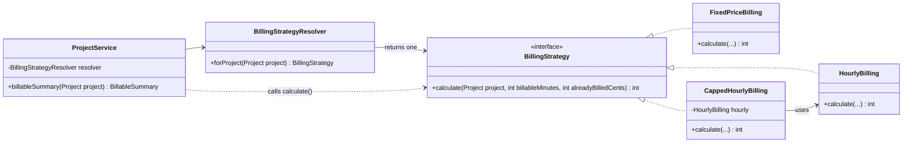
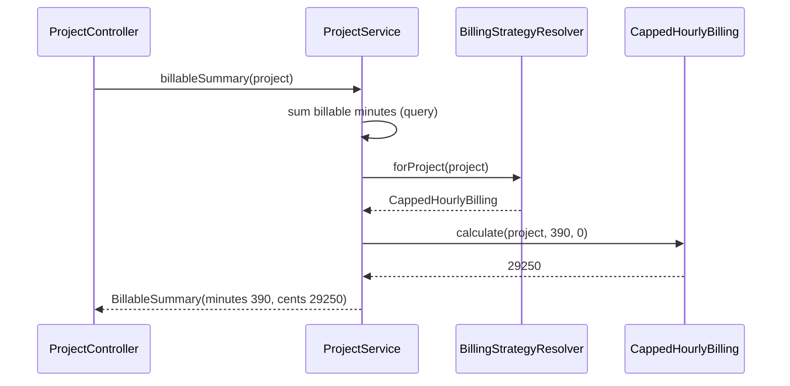
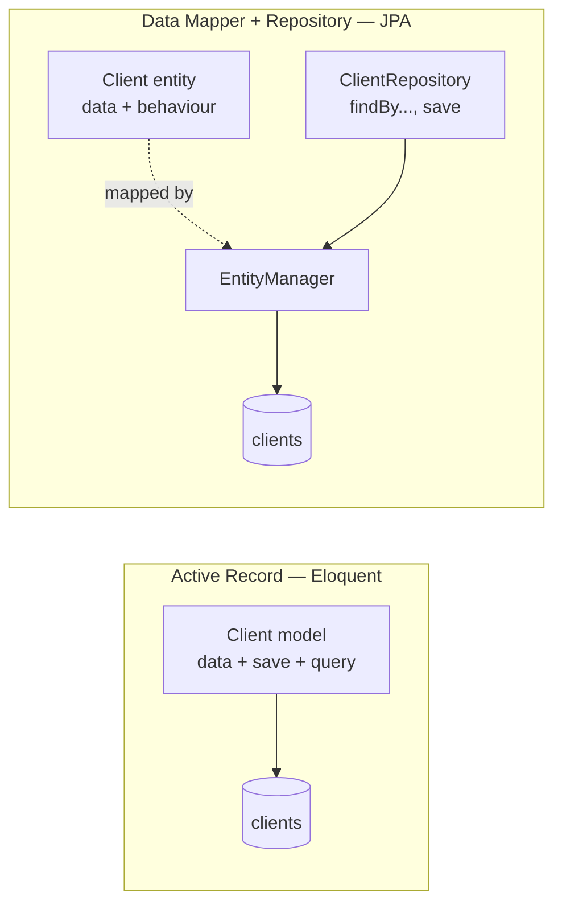

# 08 — Patterns I: Strategy and Repository

**Outcomes:** ÕV1 — *tunneb enamlevinud programmeerimismustreid* · **Time:** 2 h in class + ~2 h independent
**Before this lesson:** your project matches the end state of lesson 07, including the independent work (`ProjectService` exists) — see [what exists after each lesson](../../PROJECT.md#what-exists-after-each-lesson)
**Walkthroughs:** [Laravel](laravel.md) · [Spring Boot](spring-boot.md)

---

## Why this matters

Billable has three billing types: hourly, fixed price and capped hourly. Each one calculates the amount
to bill in a different way. The first idea everybody has is a `switch` on the billing type. It works —
until the fourth type arrives, and then the fifth, and the same `switch` appears in the project page,
the budget warning (lesson 09) and the invoice generator (lesson 13).

You will meet the same problem at work under other names: shipping cost per carrier, tax per country,
discount per customer group, payment per provider. The **Strategy** pattern is the standard answer, and
it is the pattern the capstone defence asks about first: *"Open the file where the billing strategy is
chosen. Why is it there and not in the controller?"*

The second half of the lesson is about the **Repository** pattern, and about the two very different ways
our two frameworks talk to the database. Knowing the difference stops you from copying Spring habits into
Laravel (or the other way round) where they do not fit.

## Today's goal

At the end of class:

- The billing calculation lives in four classes: a `BillingStrategy` interface and `HourlyBilling`,
  `FixedPriceBilling`, `CappedHourlyBilling`.
- A `BillingStrategyResolver` picks the right strategy for a project. It is the **only** place in the
  code that decides by billing type how to bill.
- Each project page shows **"Billable so far"** — the amount you could invoice today.
- You have started `docs/patterns.md`, the pattern log you will hand in with the capstone.

By the end you can:

1. say what a design pattern is and name the three GoF categories;
2. recognise the "growing switch" smell and refactor it into Strategy;
3. explain the Open/Closed principle with the billing example;
4. explain the difference between Active Record (Eloquent) and Data Mapper + Repository (JPA);
5. point at five patterns your framework already uses for you.

---

## Concepts

### 1. What a design pattern is — and what it is not

A **design pattern** is a *named, reusable solution to a problem that appears again and again* in
software design. The idea became popular with the book *Design Patterns* (1994) by Gamma, Helm, Johnson
and Vlissides — the "Gang of Four" (**GoF**). The book describes 23 patterns in three categories:

| Category | Question it answers | Examples |
|---|---|---|
| **Creational** | How are objects created? | Factory Method, Abstract Factory, Builder, Singleton, Prototype |
| **Structural** | How are objects combined into bigger structures? | Adapter, Decorator, Facade, Proxy, Composite |
| **Behavioural** | How do objects share work and communicate? | Strategy, Observer, Template Method, Command, Iterator, State |

Other well-known patterns come from later books, for example Martin Fowler's *Patterns of Enterprise
Application Architecture* (2002): Repository, Active Record, Data Mapper, Service Layer, Front Controller.

A pattern is:

- a **vocabulary**. "Make the notifier an adapter" says in four words what would take a paragraph;
- a **trade-off**. Every pattern solves one problem and adds some cost (more classes, more indirection).

A pattern is **not**:

- a piece of code to copy. The same pattern looks different in PHP and Java;
- a goal. Using many patterns does not make code good. A pattern that solves no real problem is just
  extra files.

The skill to learn is *recognising the problem*. Then the pattern follows.

### 2. Recognising the need: the growing `switch`

Here is the first version of "how much can we bill" — a method on the project:

```php
// Laravel — a method on App\Models\Project (the naive version)
public function billableAmountCents(int $minutes): int
{
    return match ($this->billing_type) {
        BillingType::Hourly => intdiv($minutes * $this->hourly_rate_cents + 30, 60),
        BillingType::Fixed => $this->fixed_price_cents,
        BillingType::Capped => min(intdiv($minutes * $this->hourly_rate_cents + 30, 60), $this->budget_cap_cents),
    };
}
```

```java
// Spring — a method on project.Project (the naive version)
public long billableAmountCents(long minutes) {
  return switch (billingType) {
    case HOURLY -> (minutes * hourlyRateCents + 30) / 60;
    case FIXED -> fixedPriceCents;
    case CAPPED -> Math.min((minutes * hourlyRateCents + 30) / 60, budgetCapCents);
  };
}
```

It looks harmless. Now think ahead:

- Lesson 09 needs "how close is this project to its cap?" → another `switch`.
- Lesson 13 needs the amount minus what is already invoiced → the method gets a second parameter, and
  every branch changes.
- A fourth billing type (your homework) → every one of those `switch`es must be found and edited.
- To test the capped rule you need a whole `Project` with all its fields, and every test runs through
  the other branches' code too.

**The smell:** *the same `switch` (or `if`/`else` chain) on the same type code, in several places, and
each new type means editing all of them.* When you see it, think **Strategy** (or plain polymorphism).

When is a `switch` fine? When it appears in **one** place, the cases are few and stable, and each branch
is one line. Do not refactor a two-case `if` into three classes "because patterns".

### 3. The Strategy pattern

> **Strategy** (GoF, behavioural): define a family of algorithms, put each one in its own class, and make
> them interchangeable behind one interface. The code that uses them does not need to know which one it
> has.

Three roles:

| Role | In Billable |
|---|---|
| **Strategy** (the interface) | `BillingStrategy` with one method `calculate(...)` |
| **Concrete strategies** | `HourlyBilling`, `FixedPriceBilling`, `CappedHourlyBilling` |
| **Context** (the user of a strategy) | `ProjectService` today; `BudgetMonitor` (09) and `InvoiceGenerator` (13) later |



(Java uses `long` instead of `int`. The resolver method is called `forProject` in both tracks — `for`
would be shorter, but it is a reserved word in Java, so we use one name everywhere.)

What happens when the project page is opened:



**The contract.** An interface is a promise. Every strategy in this module keeps these rules (this is
the Liskov principle from lesson 07 in practice):

| Rule | Why |
|---|---|
| Amounts are **integer cents** (`int` / `long`). Never `float`. | R1 — floats cannot store 0.10 exactly |
| `billableMinutes` = the minutes to bill *now*. In lesson 10 they arrive already rounded (R5). Today they are the raw sum. | The strategy does maths on money, not on time |
| `alreadyBilledCents` = what has already been invoiced for this project. Until invoices exist (lesson 13) we pass `0`. | Capped and fixed need to know what is left |
| The result is never negative. | An invoice line cannot be below zero |

The three calculations:

| Strategy | Formula | Rule |
|---|---|---|
| `HourlyBilling` | `(minutes × rate + 30) ÷ 60` (integer division) | R6; ignores `alreadyBilled` |
| `FixedPriceBilling` | `max(fixed − alreadyBilled, 0)` | R8; ignores minutes |
| `CappedHourlyBilling` | `min(hourly amount, max(cap − alreadyBilled, 0))` | R7 |

**Why `+ 30` before dividing by 60?** Integer division throws away the fraction: `7 ÷ 2 = 3`. We need
*half-up* rounding to the cent (R3): 0.5 cent or more goes up. Adding half of the divisor (60 ÷ 2 = 30)
before dividing does exactly that for non-negative numbers:

| Minutes | Rate (cents/h) | Exact cents | + 30, ÷ 60 | Result |
|---|---|---|---|---|
| 60 | 6000 | 6000.00 | 360030 ÷ 60 | 6000 |
| 7 | 4550 | 530.83 | 31880 ÷ 60 = 531.33 | 531 (up) |
| 1 | 4530 | 75.50 | 4560 ÷ 60 = 76 | 76 (half goes up) |
| 1 | 4520 | 75.33 | 4550 ÷ 60 = 75.83 | 75 (down) |

Lesson 10 explains rounding in depth and wraps cents in a `Money` type; the strategies will then return
`Money`. Today they return plain `int` / `long`.

### 4. The Open/Closed principle

> Software should be **open for extension** but **closed for modification**.

"Closed" means: code that works and is tested should not have to change when you add a feature. "Open"
means: you can still add behaviour — by writing *new* code.

With the naive `match`, adding the billing type "internal" means editing `Project` (and every other
`switch`). With Strategy, you add `InternalBilling` and register it. `HourlyBilling`,
`FixedPriceBilling` and `CappedHourlyBilling` do not change, so their tests stay valid.

Be honest about the limits: *something* must still map "internal" → `InternalBilling`. In the Laravel
version that is one new line in the resolver. In the Spring version the resolver finds every strategy
bean by itself, so not even the resolver changes. Open/Closed is a direction to move in, not a promise
that no file ever changes.

### 5. Choosing the strategy: a simple factory ("resolver")

Somebody has to look at `billing_type` and return the right object. We put that decision in exactly one
class, `BillingStrategyResolver`. This is a **simple factory**: a class whose job is to *choose and
return* an object. (It is not the GoF *Factory Method* pattern, which uses subclasses to decide; the name
"simple factory" is common for this lighter version.)

| | Laravel | Spring Boot |
|---|---|---|
| How the strategies arrive | The container builds the resolver and injects the three concrete strategy classes through its constructor | Spring injects a `List<BillingStrategy>` with **every** bean that implements the interface |
| How the choice is made | `match ($project->billing_type)` | Each strategy reports its `BillingType type()`; the resolver builds an `EnumMap<BillingType, BillingStrategy>` |
| Missing strategy | `UnhandledMatchError` when a project of that type is billed | `IllegalStateException` **at start-up** — the application does not start |

Why not choose in the controller? Because then every controller, listener and generator that needs an
amount would repeat the choice — the very `switch` we are removing. Why not in the `Project` model? Then
the model would have to know all strategy classes; the resolver keeps the model small and the choice
replaceable.

**Fail fast.** The Spring resolver checks at start-up that every `BillingType` has exactly one
strategy. A missing strategy is then found by the developer on their machine, not by a customer on the
invoice page.

### 6. The Null Object pattern

What should "billing" do for an internal, non-billable project? One option: `if ($strategy === null)` in
every caller. The **Null Object** pattern is the better option: a real implementation of the interface
that does *nothing* in a safe way — here, it always returns 0 cents. Callers treat it like any other
strategy and never check for null. Your homework adds `InternalBilling` as a Null Object.

### 7. The Repository pattern: Active Record vs Data Mapper

Both frameworks save objects to the database, but in two different ways.

**Active Record** (Eloquent): the object *knows how to save itself*. The class maps to a table, and the
same class has the data **and** the database methods.

```php
$client = new Client(['name' => 'Acme', 'email' => 'info@acme.ee']);
$client->save();                          // the object writes itself
$clients = Client::where('name', 'like', 'A%')->get();   // the class queries its table
```

**Data Mapper** (JPA / Hibernate): the object is a plain class with data and behaviour and knows
*nothing* about the database. A separate component (the `EntityManager`) moves data between objects and
tables. The **Repository** pattern puts a collection-like interface on top: "give me the clients whose
name starts with A", as if they were in a list in memory.

```java
var client = new Client("Acme", "info@acme.ee", null);
clientRepository.save(client);                               // someone else saves it
List<Client> clients = clientRepository.findByNameStartingWith("A");
```



| | Active Record (Eloquent) | Data Mapper + Repository (JPA) |
|---|---|---|
| Who saves the object | The object itself: `$client->save()` | The repository / entity manager |
| Model knows the database | Yes | No (only annotations) |
| Amount of code | Less | More (entity + repository interface) |
| Unit testing domain logic | Model needs Laravel booted; keep logic in plain classes | Entities are plain objects: `new Client(...)` works in a unit test |
| Changes are written | When you call `save()` / `update()` | At commit (dirty checking) |
| Good for | Straightforward CRUD, fast development | Rich domain logic, complex mappings |

**Should you add repositories in Laravel?** Usually **no**. Eloquent already *is* the data-access layer,
and a `ClientRepository` that only wraps `Client::find()` is a pass-through layer with no value. Many
Laravel tutorials add them "to be able to switch the ORM" — which almost never happens. Better tools for
a Laravel project:

- **Query scopes** on the model for reusable conditions: `TimeEntry::query()->billable()->get()`.
- **Query objects** — a small class that builds one complex query — when a query has many optional
  filters or is used in several services.
- **Services** (lesson 07) for use cases.

**In Spring, the repository is the default.** Spring Data generates the implementation of your
interface; derived queries (`findByArchivedAtIsNull...`), `@Query` and `@EntityGraph` cover most cases.
When they do not, a **custom repository fragment** adds hand-written methods to the same interface.
Your intermediate task compares both approaches in writing.

### 8. Patterns you already use without knowing it

Frameworks are built from patterns. Recognising them makes the framework less magical — and gives you
examples for `docs/patterns.md`.

| Pattern | Laravel | Spring Boot | What it does for you |
|---|---|---|---|
| **Front Controller** | `public/index.php` + the HTTP kernel | `DispatcherServlet` | One entry point for every request; routing decides which controller runs |
| **MVC** | Controllers, Blade, Eloquent | `@Controller`, Thymeleaf, entities | Separates input, presentation and data (lessons 04–05) |
| **Template View** | Blade templates | Thymeleaf templates | HTML with placeholders filled from data |
| **Dependency Injection / IoC** | Service container | Application context | Objects receive their dependencies (lesson 07) |
| **Service Locator** | `app()`, `resolve()` | `ApplicationContext.getBean()` | Pulling a dependency from a registry — possible, but prefer DI |
| **Facade** (Laravel's meaning) | `DB::`, `Mail::`, `Cache::` | — | A static-looking shortcut to an object in the container. Not exactly the GoF Facade, which simplifies a complex subsystem behind one class |
| **Builder** | Query builder: `->where()->orderBy()->get()` | `UriComponentsBuilder`, `RestClient.builder()` (`Sort.by(...)` is a static factory method, not a Builder) | Build a complex object step by step |
| **Iterator** | Collections, `foreach` over results | `Iterable`, streams, `Page` | Walk through elements without knowing the storage |
| **Active Record / Data Mapper** | Eloquent | JPA / Hibernate | See section 7 |
| **Repository** | (not by default) | Spring Data repositories | Collection-like access to stored objects |
| **Proxy** | Lazy collections, some facades | Transaction proxies (`@Transactional`), lazy `@ManyToOne` proxies | A stand-in object that adds behaviour or loads data later |
| **Observer** | Events and listeners | `ApplicationEventPublisher`, `@EventListener` | Next lesson |
| **Strategy** | Session/cache/mail drivers | `PasswordEncoder`, `HttpMessageConverter` | Swappable algorithms behind one interface |

---

## Laravel vs Spring Boot

| Idea | Laravel | Spring Boot |
|---|---|---|
| Strategy interface | `App\Billing\BillingStrategy` | `billing.BillingStrategy` (+ `type()`) |
| Registering strategies | None — concrete classes are auto-resolved | `@Component` on each strategy |
| Resolver | Constructor gets the three strategies, `match` on the enum | Constructor gets `List<BillingStrategy>`, builds `EnumMap` |
| Resolver method | `forProject(Project $project)` | `forProject(Project project)` |
| Money type today | `int` cents | `long` cents |
| Integer division | `intdiv($a, $b)` | `a / b` on `long` |
| Data access style | Active Record | Data Mapper + Repository |
| Reusable query | Query scope / query object | Derived query / `@Query` / custom fragment |

---

## Common mistakes

| Mistake | Why it hurts | What to do instead |
|---|---|---|
| Keeping the old `switch` "just in case" next to the strategies | Two sources of truth; they will disagree | Delete the naive method once the strategies work |
| Choosing the strategy in the controller | The choice is repeated in every caller | One resolver, used by services |
| Strategy reads the database or the request | Cannot be tested with plain objects; hidden queries | Pass everything the calculation needs as arguments |
| Using `/` in PHP for money | `/` returns a `float` in PHP | `intdiv()` |
| Rounding with `round($x / 60)` or `Math.round(double)` | Float in the middle of a money calculation | `(a + 30) / 60` in integers (lesson 10 goes deeper) |
| Strategies with state (a field storing the last result) | Shared instance → results leak between requests | Strategies are stateless; only constructor dependencies in fields |
| An interface for a single, stable algorithm | Pattern without a problem | Use Strategy when there are several interchangeable algorithms |
| `ClientRepository` in Laravel that only wraps `Client::find()` | Pass-through layer, more code, no value | Eloquent + scopes + services |
| Two Spring beans for one `BillingType` | The map silently keeps one of them | Resolver throws at start-up on duplicates |

---

## Independent work (~2 h)

**Basic 1 — A fourth billing type: `internal`.**
Internal projects (your own admin, learning) are tracked but never billed.
- Add the enum case / constant `internal` with the label "Internal (not billed)".
- Project validation accepts `internal` and requires none of the three price fields.
- Add `InternalBilling`, which always returns 0 — a **Null Object**.
- The resolver returns it for internal projects.
- No database migration is needed: `billing_type` is a `varchar(20)`. (If you added a `CHECK` constraint
  on the column in lesson 03, you do need one.)

Acceptance criteria: you can create an internal project; its page shows "Billable so far: 0,00 €";
`git diff` shows that `HourlyBilling`, `FixedPriceBilling` and `CappedHourlyBilling` did not change.

**Basic 2 — `docs/patterns.md`: Strategy and Factory.**
Add an entry for Strategy and one for the simple factory (resolver) in your own words: the problem in
Billable, the classes involved (with file paths), a Mermaid class diagram, and one sentence on the
trade-off. Acceptance criteria: renders on GitHub; someone who has not seen your code understands why
the resolver exists.

**Intermediate — Active Record vs Repository write-up with code.**
Add a section to `docs/patterns.md` (half a page) comparing the two approaches, with one real example
from your project:
- Laravel: a query scope `billable()` on `TimeEntry` **and** a small query object class (for example
  `BillableEntriesQuery` with optional project and date filters) used by `ProjectService`.
- Spring: a custom repository fragment (`TimeEntryQueries` + `TimeEntryQueriesImpl`) with a method that
  derived queries cannot express well (for example optional filters), used by `ProjectService`.
Acceptance criteria: the code runs and is used by the page; the write-up names one advantage and one
disadvantage of each approach.

**Advanced — Template Method or Decorator instead of Strategy?**
Implement one alternative design for the capped rule — either **Template Method** (an abstract
`HourlyBasedBilling` with a final `calculate()` and a hook `limit(...)`) or **Decorator** (a
`BudgetCapDecorator` that wraps any strategy and applies the cap) — on a separate Git branch. Write half a
page in `docs/patterns.md`: which design is better for Billable, and why? Acceptance criteria: the
alternative compiles and gives the same results as your strategies for three example inputs; your
argument mentions inheritance vs composition.

---

## Self-check

1. Name the three GoF pattern categories and one pattern in each.
2. What is the smell that suggests Strategy? When is a plain `switch` still fine?
3. Which three roles does the Strategy pattern have, and which Billable classes play them?
4. Why is `(minutes × rate + 30) ÷ 60` half-up rounding? What goes wrong with `/` in PHP?
5. What does the resolver do, and why is it not in the controller?
6. How does the Spring resolver notice a missing strategy, and when?
7. What is a Null Object? Give the Billable example.
8. Explain Active Record vs Data Mapper in two sentences each. Why do we *not* add repositories in Laravel?

<details>
<summary>Answers</summary>

1. Creational (Builder, Singleton, Factory Method), structural (Adapter, Decorator, Proxy), behavioural
   (Strategy, Observer, Template Method).
2. The same `switch` on the same type code in several places, and every new type means editing all of
   them. A single, short `switch` with few, stable cases is fine.
3. Strategy interface (`BillingStrategy`), concrete strategies (`HourlyBilling`, `FixedPriceBilling`,
   `CappedHourlyBilling`), context (`ProjectService`, later `BudgetMonitor` and `InvoiceGenerator`).
4. Integer division drops the fraction. Adding half the divisor first moves every value with a fraction
   of 0.5 or more over the next whole number. In PHP `/` returns a `float`, so you would be back to
   floating-point money; `intdiv()` stays in integers.
5. It maps a project's billing type to the matching strategy object. It is a separate class so the
   decision exists in exactly one place and every caller (service, listener, invoice generator) reuses it.
6. At start-up: its constructor receives all strategy beans, builds the `EnumMap`, and throws
   `IllegalStateException` if any `BillingType` has no strategy (or two). The application does not start.
7. A real implementation of the interface that does nothing harmful, so callers need no null checks.
   `InternalBilling` always returns 0 cents.
8. Active Record: the model has the data and saves/queries itself (`$client->save()`); simple and fast
   for CRUD. Data Mapper: the entity is a plain object and a separate mapper/repository stores it; more
   code, but the domain is independent of the database. In Laravel, Eloquent already is the data-access
   layer — a repository that only forwards calls adds files without value; scopes and query objects
   solve the real reuse problems.
</details>

---

## Checklist

- [ ] `BillingStrategy` and three strategies exist; each has one small `calculate()` with integer maths (ÕV1)
- [ ] `BillingStrategyResolver` is the only code that maps billing type → strategy (ÕV1)
- [ ] The naive `switch` on `Project` has been removed; both versions are visible in your Git history (ÕV1)
- [ ] The project page shows "Billable so far", calculated in the service, not in the controller or view (ÕV3)
- [ ] `internal` billing type with a Null Object strategy works (independent) (ÕV1)
- [ ] `docs/patterns.md` has entries for DI, Strategy and Factory in your own words (ÕV1, ÕV9)
- [ ] You can explain Active Record vs Repository with your own code as the example (ÕV1, ÕV4)
- [ ] Code formatted and committed with clear messages (ÕV7)

---

## Further reading

- Laravel: [Eloquent query scopes](https://laravel.com/docs/12.x/eloquent#query-scopes)
- Laravel: [Facades](https://laravel.com/docs/12.x/facades)
- Laravel: [Service Container — binding](https://laravel.com/docs/12.x/container#binding)
- PHP manual: [`match` expression](https://www.php.net/manual/en/control-structures.match.php) · [`intdiv()`](https://www.php.net/manual/en/function.intdiv.php)
- Spring Data JPA: [Custom repository implementations](https://docs.spring.io/spring-data/jpa/reference/repositories/custom-implementations.html)
- Spring Data JPA: [Query methods](https://docs.spring.io/spring-data/jpa/reference/jpa/query-methods.html)
- Java API: [`EnumMap`](https://docs.oracle.com/en/java/javase/25/docs/api/java.base/java/util/EnumMap.html)
- Mermaid: [Class diagrams](https://mermaid.js.org/syntax/classDiagram.html)
