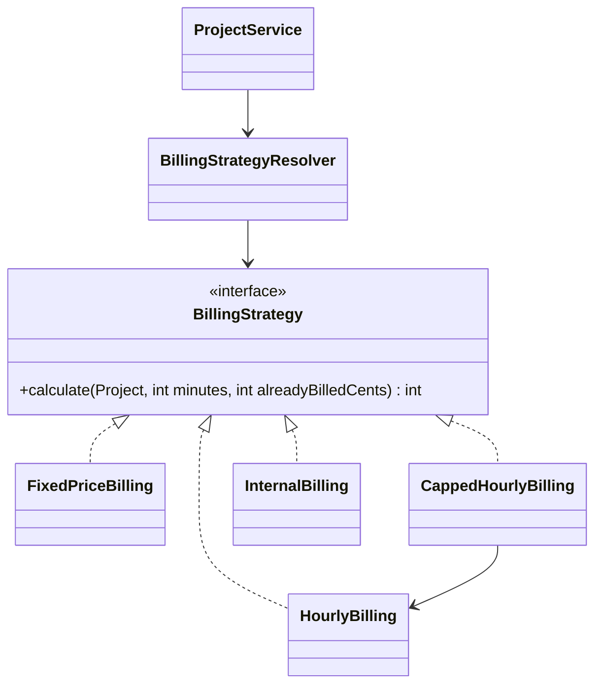

# 08 — Patterns I: Strategy and Repository · Laravel

[← Concepts](README.md) · Starting point: end of lesson 07 (with `ProjectService` from the independent work) · Estimated time in class: 2 h · Independent work tasks: [README](README.md#independent-work-2-h)

---

## What we build today

- A naive `billableAmountCents()` method with a `match` on the billing type — written on purpose, so we
  can see the problem and keep it in Git history.
- `App\Billing\BillingStrategy` (interface) and three strategies: `HourlyBilling`, `FixedPriceBilling`,
  `CappedHourlyBilling`.
- `App\Billing\BillingStrategyResolver` — the one place that chooses a strategy by billing type.
- `App\Services\BillableSummary` and `ProjectService::billableSummary()` — minutes and amount for one
  project.
- A "Billable so far" box on the project page.
- `docs/patterns.md` — the start of your pattern log.

**Final result:** open any project. Under the project details you see *Billable so far: 292,50 € —
6 h 30 min of billable time*. The amount is calculated by the right strategy for the project's billing
type. There is no `match` on billing type left in the model or controller.

---

## Step 1 — The naive version (on purpose)

**Why:** you learn to recognise a pattern need by *feeling* the problem first. We write the
straightforward version, get it working, commit it, and then refactor. Both versions stay in your Git
history — the capstone rubric rewards "an anti-pattern you refactored away", and this is your first one.

Add a method to the `Project` model:

```php
// app/Models/Project.php — add inside the class (temporary, removed in Step 7)

    /**
     * Naive version: how much can be billed for $minutes of work?
     */
    public function billableAmountCents(int $minutes): int
    {
        return match ($this->billing_type) {
            BillingType::Hourly => intdiv($minutes * $this->hourly_rate_cents + 30, 60),
            BillingType::Fixed => $this->fixed_price_cents,
            BillingType::Capped => min(
                intdiv($minutes * $this->hourly_rate_cents + 30, 60),
                $this->budget_cap_cents,
            ),
        };
    }
```

Now give `ProjectService` a method that sums the billable minutes of a project and asks the model:

```php
// app/Services/ProjectService.php — add inside the class (temporary version)

    public function billableSoFarCents(Project $project): int
    {
        $minutes = (int) $project->timeEntries()
            ->where('billable', true)
            ->get()
            ->sum(fn (TimeEntry $entry): int => $entry->durationMinutes());

        return $project->billableAmountCents($minutes);
    }
```

(Add `use App\Models\TimeEntry;` at the top.)

In `ProjectController::show()` pass the value to the view:

```php
// app/Http/Controllers/ProjectController.php — show() (temporary version)
    public function show(Project $project): View
    {
        return view('projects.show', [
            'project' => $project,
            'billableSoFar' => $this->projects->billableSoFarCents($project),
        ]);
    }
```

And show it on the page, below the project details:

```blade
<!-- resources/views/projects/show.blade.php — below the project details -->
<p><strong>Billable so far:</strong> {{ euros($billableSoFar) }}</p>
```

**What happens:**

1. `match` compares `$this->billing_type` (a `BillingType` enum, thanks to the cast) with each arm and
   returns the value of the matching arm. If no arm matches, PHP throws `UnhandledMatchError`.
2. `intdiv(a, b)` is integer division. `+ 30` before dividing by 60 gives **half-up** rounding to the
   cent (see the concepts page). PHP's `/` would return a `float` — never use it for money.
3. The service loads the project's billable entries, adds up `durationMinutes()` (unrounded — lesson 10
   adds rounding) and passes the total to the model.

**Check it works:** open a project page. You see "Billable so far: …". For an hourly project with rate
60,00 € and 90 minutes of billable entries, it shows 90,00 €.

**Commit:** `feat(projects): show billable amount (naive switch version)`

---

## Step 2 — Feel the problem

**Why:** before refactoring, name exactly what is wrong. Look at the method and ask four questions.

1. **What happens when invoices arrive (lesson 13)?** Fixed price must become "the fixed price minus
   what is already invoiced". Capped must subtract too. Every arm changes, and the method gets a second
   parameter.
2. **Where else will we `match` on the billing type?** Search your project:

```bash
grep -rn "BillingType::" app/
```

   You will find it in `StoreProjectRequest` (the conditional rules and `projectData()` from lesson 05)
   and now in `Project`. The budget warning (lesson 09)
   and the invoice generator (lesson 13) would add more.
3. **How do I test the capped rule alone?** You need a whole `Project` and the test runs through code
   shared with the other types.
4. **Who changes this method?** Anyone who touches *any* billing type. That breaks the Single
   Responsibility Principle from lesson 07.

Validation and "which price fields are relevant" are *input* questions, and a `match` there is fine.
The **calculation** is an algorithm that differs per type — a family of interchangeable algorithms.
That is the Strategy pattern's problem.

---

## Step 3 — The `BillingStrategy` interface

**Why:** the interface is the contract every billing algorithm must keep. Callers depend only on it.

Create the folder `app/Billing` and the interface:

```php
<?php

// app/Billing/BillingStrategy.php

namespace App\Billing;

use App\Models\Project;

/**
 * One way of turning billable time into an amount of money.
 *
 * All amounts are integer cents (R1). The result is never negative.
 */
interface BillingStrategy
{
    /**
     * @param  int  $billableMinutes  minutes to bill now (rounded per entry from lesson 10 on)
     * @param  int  $alreadyBilledCents  amount already invoiced for this project (0 until lesson 13)
     * @return int amount to bill now, in cents
     */
    public function calculate(Project $project, int $billableMinutes, int $alreadyBilledCents): int;
}
```

**What happens:**

1. An interface only declares *what* can be done, not *how*. Each strategy class will provide the how.
2. The signature is fixed for the whole module (see the concepts page). `alreadyBilledCents` looks
   useless today — we pass `0` — but it means lesson 13 will not have to change the interface, only the
   caller.
3. The PHPDoc states the units. With plain `int`s, a comment is the only thing that says "cents, not
   euros". Lesson 10 replaces these `int`s with a `Money` type so the compiler checks it instead.

---

## Step 4 — `HourlyBilling`

```php
<?php

// app/Billing/HourlyBilling.php

namespace App\Billing;

use App\Models\Project;

/**
 * R6: minutes × hourly rate ÷ 60, rounded half up to the cent.
 */
class HourlyBilling implements BillingStrategy
{
    public function calculate(Project $project, int $billableMinutes, int $alreadyBilledCents): int
    {
        // intdiv rounds down; adding half of the divisor first rounds half up (for values >= 0).
        return intdiv($billableMinutes * $project->hourly_rate_cents + 30, 60);
    }
}
```

**What happens:**

1. `implements BillingStrategy` promises that the class has a `calculate()` with exactly this signature.
   PHP checks it when the class is loaded.
2. `$alreadyBilledCents` is ignored: an hourly project has no upper limit.
3. Example: 7 minutes at 45,50 €/h → `intdiv(7 × 4550 + 30, 60)` = `intdiv(31880, 60)` = 531 cents.
   The exact value is 530,83 cents, which rounds half up to 531. ✔

---

## Step 5 — `FixedPriceBilling`

```php
<?php

// app/Billing/FixedPriceBilling.php

namespace App\Billing;

use App\Models\Project;

/**
 * R8: the part of the agreed fixed price that has not been billed yet.
 */
class FixedPriceBilling implements BillingStrategy
{
    public function calculate(Project $project, int $billableMinutes, int $alreadyBilledCents): int
    {
        return max($project->fixed_price_cents - $alreadyBilledCents, 0);
    }
}
```

**What happens:** the minutes do not matter — the price was agreed in advance. `max(..., 0)` protects
against a negative result if more than the fixed price was ever billed (for example after a manual
correction).

---

## Step 6 — `CappedHourlyBilling`, built from `HourlyBilling`

**Why:** capped billing is "hourly, but never more than what is left of the cap". Instead of copying the
hourly formula, the capped strategy **uses** an `HourlyBilling` object. This is *composition*: one object
does part of its work by asking another. Now the formula for R6 exists exactly once.

```php
<?php

// app/Billing/CappedHourlyBilling.php

namespace App\Billing;

use App\Models\Project;

/**
 * R7: hourly billing, but the project's total billed amount never exceeds budget_cap_cents.
 */
class CappedHourlyBilling implements BillingStrategy
{
    public function __construct(private readonly HourlyBilling $hourly) {}

    public function calculate(Project $project, int $billableMinutes, int $alreadyBilledCents): int
    {
        $hourlyAmount = $this->hourly->calculate($project, $billableMinutes, $alreadyBilledCents);
        $remainingBudget = max($project->budget_cap_cents - $alreadyBilledCents, 0);

        return min($hourlyAmount, $remainingBudget);
    }
}
```

**What happens:**

1. `HourlyBilling` is injected through the constructor — the same DI you learned in lesson 07. The
   container sees the parameter type and builds an `HourlyBilling` for it.
2. `$remainingBudget` is what is left of the cap. `max(..., 0)` means "nothing is left" instead of a
   negative number if the cap was already exceeded.
3. `min(...)` takes the smaller value: either the full hourly amount, or what still fits under the cap.

Example: cap 500,00 €, already billed 450,00 €, 120 minutes at 60 €/h → hourly 12 000 cents, remaining
5 000 cents → result 5 000 cents (50,00 €).

---

## Step 7 — `BillingStrategyResolver`

**Why:** something must look at `billing_type` and return the right strategy. We put that decision in
exactly one class.

```php
<?php

// app/Billing/BillingStrategyResolver.php

namespace App\Billing;

use App\Enums\BillingType;
use App\Models\Project;

/**
 * Chooses the billing strategy for a project. This is the only place in the application
 * that decides, by billing type, how a project is billed.
 */
class BillingStrategyResolver
{
    public function __construct(
        private readonly HourlyBilling $hourly,
        private readonly FixedPriceBilling $fixed,
        private readonly CappedHourlyBilling $capped,
    ) {}

    public function forProject(Project $project): BillingStrategy
    {
        return match ($project->billing_type) {
            BillingType::Hourly => $this->hourly,
            BillingType::Fixed => $this->fixed,
            BillingType::Capped => $this->capped,
        };
    }
}
```

**What happens:**

1. The container builds the resolver by building its three constructor arguments first — including
   `HourlyBilling` for `CappedHourlyBilling`. We register nothing: all four are concrete classes, so
   auto-resolution (lesson 07) is enough.
2. `forProject()` returns the object, typed as the **interface** `BillingStrategy`. Callers never learn which
   class they got — and they do not need to.
3. Yes, this is still a `match`. The difference is that it is now the **only** one for billing, it only
   *chooses* (one line per type, no maths), and it is easy to find. A new type means a new strategy
   class plus one line here.
4. If a project has a billing type with no arm, PHP throws `UnhandledMatchError`. That is loud and early,
   which is what we want.

> **Alternative you may see:** registering the strategies in `AppServiceProvider` with
> `$this->app->tag([...], 'billing')` and injecting them as a group with the `#[Tag('billing')]`
> attribute on a constructor parameter (`#[Tag('billing')] iterable $strategies`). It removes the
> `match` but makes the wiring harder to follow. For four types, the explicit `match` is clearer.

Now remove the naive method `billableAmountCents()` from `Project`. It must not survive next to the
strategies — two versions of the same rule will one day disagree.

---

## Step 8 — Use the resolver in `ProjectService`

**Why:** the service is the **context** of the pattern: it gathers the data (minutes), asks the resolver
for a strategy and calls it. The page needs both the minutes and the amount, so the service returns a
small data object instead of two separate calls with two queries.

```php
<?php

// app/Services/BillableSummary.php

namespace App\Services;

/**
 * What a project could bill right now.
 */
final readonly class BillableSummary
{
    public function __construct(
        public int $minutes,
        public int $cents,
    ) {}

    public function hours(): int
    {
        return intdiv($this->minutes, 60);
    }

    public function remainingMinutes(): int
    {
        return $this->minutes % 60;
    }
}
```

Replace the temporary `billableSoFarCents()` in `ProjectService`, and add the constructor:

```php
// app/Services/ProjectService.php — constructor (new) and billableSummary() (replaces billableSoFarCents)

use App\Billing\BillingStrategyResolver;
use App\Models\TimeEntry;

class ProjectService
{
    public function __construct(private readonly BillingStrategyResolver $billing) {}

    // ... forClient(), create(), update(), delete() from lesson 07 stay as they are

    /**
     * Billable minutes and amount for the project so far.
     * Nothing is invoiced yet, so alreadyBilled is 0 until lesson 13.
     */
    public function billableSummary(Project $project): BillableSummary
    {
        $minutes = (int) $project->timeEntries()
            ->where('billable', true)
            ->get()
            ->sum(fn (TimeEntry $entry): int => $entry->durationMinutes());

        $cents = $this->billing->forProject($project)->calculate($project, $minutes, 0);

        return new BillableSummary($minutes, $cents);
    }
}
```

**What happens:**

1. `ProjectService` receives the resolver through its constructor. `ProjectController` already receives
   `ProjectService` — so the container now builds a chain: controller → service → resolver → three
   strategies → `HourlyBilling`. You configured none of it.
2. We sum the minutes **per entry** in PHP, not with `SUM()` in SQL. Today both would work, but lesson 10
   rounds each entry up to the project's `rounding_minutes` *before* summing (R5). That rounding needs
   each entry separately.
3. `$this->billing->forProject($project)` returns a `BillingStrategy`; `->calculate(...)` runs it. The service
   does not know which of the three classes it is calling. That is the point of the pattern.
4. `BillableSummary` is a small **readonly DTO** (lesson 07): it carries two numbers to the view. The
   formatting helpers `hours()` and `remainingMinutes()` keep arithmetic out of Blade.

---

## Step 9 — Show it on the project page

```php
// app/Http/Controllers/ProjectController.php — show()
    public function show(Project $project): View
    {
        return view('projects.show', [
            'project' => $project,
            'summary' => $this->projects->billableSummary($project),
        ]);
    }
```

```blade
<!-- resources/views/projects/show.blade.php — replace the temporary "Billable so far" line -->
<article>
    <header><strong>Billable so far</strong></header>
    <p>
        <strong>{{ euros($summary->cents) }}</strong>
        — {{ $summary->hours() }} h {{ $summary->remainingMinutes() }} min of billable time
    </p>
    <small>Before rounding (lesson 10) and before invoices (lesson 13).</small>
</article>
```

**What happens:** the controller asks the service one question and hands the answer to the view. The
view only formats. `euros()` is your helper from lesson 04 that turns cents into `292,50 €`.

**Check it works:** open one project of each billing type.

| Project (example seed data) | Expect |
|---|---|
| Hourly, 60,00 €/h, 1 h 30 min billable | 90,00 € |
| Fixed, 2 000,00 € | 2 000,00 € (whatever the minutes) |
| Capped, 45,00 €/h, cap 250,00 €, 6 h 30 min billable | 250,00 € (hourly would be 292,50 €) |

Non-billable entries must not count: mark one entry as not billable and the amount goes down.

---

## Step 10 — Sanity checks in Tinker

**Why:** we want quick evidence that each strategy calculates correctly, including the rounding edge
cases. Real, automated unit tests for the strategies come in **lesson 11**; today we check by hand.

```bash
php artisan tinker
```

```text
> use App\Models\Project; use App\Enums\BillingType; use App\Billing\BillingStrategyResolver;
> $resolver = app(BillingStrategyResolver::class);

> $hourly = (new Project)->forceFill(['billing_type' => BillingType::Hourly, 'hourly_rate_cents' => 4530]);
> get_class($resolver->forProject($hourly))
= "App\Billing\HourlyBilling"
> $resolver->forProject($hourly)->calculate($hourly, 1, 0)
= 76
> $hourly->hourly_rate_cents = 4520;
> $resolver->forProject($hourly)->calculate($hourly, 1, 0)
= 75

> $fixed = (new Project)->forceFill(['billing_type' => BillingType::Fixed, 'fixed_price_cents' => 200000]);
> $resolver->forProject($fixed)->calculate($fixed, 999, 0)
= 200000
> $resolver->forProject($fixed)->calculate($fixed, 999, 250000)
= 0

> $capped = (new Project)->forceFill(['billing_type' => BillingType::Capped, 'hourly_rate_cents' => 6000, 'budget_cap_cents' => 50000]);
> $resolver->forProject($capped)->calculate($capped, 120, 45000)
= 5000
> $resolver->forProject($capped)->calculate($capped, 120, 0)
= 12000
```

**What happens:**

1. `(new Project)->forceFill([...])` creates a project **in memory only** — nothing is saved. The
   strategies need no database, because they only read fields of the object they are given. This is
   why they will be so easy to unit test in lesson 11.
2. `get_class(...)` shows which strategy the resolver chose.
3. 4530 cents/h × 1 min = 75,5 cents exactly → rounds **up** to 76. 4520 × 1 = 75,33 → rounds down to 75.
   That is half-up rounding at the boundary.
4. The fixed and capped results match the formulas in the concepts page.

Write these cases down — they become your first unit tests in lesson 11.

---

## Step 11 — Start `docs/patterns.md`

**Why:** `docs/patterns.md` is a capstone deliverable for ÕV1: each pattern you use, *in your own words*,
with the real file names. Starting it now, while the code is fresh, is far easier than writing it in
lesson 15.

```markdown
<!-- docs/patterns.md -->
# Patterns used in Billable

Each entry: the problem in Billable, the pattern, where it is in the code, and the trade-off.

| Pattern | Where | Lesson |
|---|---|---|
| Dependency Injection | Constructors of controllers and services | 07 |
| Strategy | `app/Billing/*Billing.php` | 08 |
| Simple Factory | `app/Billing/BillingStrategyResolver.php` | 08 |

## Dependency Injection

**Problem.** Controllers used to build or look up what they needed, so we could not replace a
dependency in a test and could not see what a class depends on.

**Solution.** Every class lists its dependencies as constructor parameters. Laravel's service container
reads the parameter types and passes the objects in. For example `ProjectController` receives
`ProjectService`, which receives `BillingStrategyResolver`.

**Where.** `app/Http/Controllers/TimeEntryController.php`, `app/Services/ProjectService.php`.

**Trade-off.** The wiring is invisible in the code — you have to know that the container does it.

## Strategy

_(independent work)_

## Simple Factory (BillingStrategyResolver)

_(independent work)_
```

Write the DI entry in your own words — the text above is only an example of the level of detail.

---

## Step 12 — Format and commit

```bash
./vendor/bin/pint
git add -A
git commit -m "refactor(billing): replace billing-type switch with strategies and a resolver"
```

**Check it works:** `git log --oneline -3` shows the naive commit and the refactor commit. `grep -rn
"billableAmountCents" app/` prints nothing.

---

## Troubleshooting

| Error / symptom | Cause | Fix |
|---|---|---|
| `UnhandledMatchError: Unhandled match case App\Enums\BillingType::...` | A billing type has no arm in the resolver | Add the arm (and the strategy class) |
| `UnhandledMatchError: Unhandled match case 'hourly'` | `billing_type` is not cast to the enum, so `match` compares a string with enum cases | Add `'billing_type' => BillingType::class` to `casts()` |
| `TypeError: ... calculate(): Argument #2 ($billableMinutes) must be of type int, float given` | Carbon 3 (Laravel 11+) returns `float` from `diffInMinutes()`, so `durationMinutes()` or the sum is a float | Cast in `durationMinutes()`: `return (int) $this->started_at->diffInMinutes($this->ended_at);` and cast the sum with `(int)` |
| `Unsupported operand types: null * int` | Hourly or capped project without `hourly_rate_cents` | Fix the data; your lesson 05 validation should require the rate for these types |
| `Class "App\Billing\HourlyBilling" not found` | Folder or namespace mismatch | File `app/Billing/HourlyBilling.php`, `namespace App\Billing;` |
| Amount looks 100× too big or too small | Mixing euros and cents | Everything in PHP is cents; only `euros()` in the view converts |
| AI suggests `round($minutes / 60 * $rate, 2)` | Float maths | `intdiv($minutes * $rate + 30, 60)` |

---

## Recap

- `app/Billing/BillingStrategy.php` — the contract: integer cents, never negative.
- `app/Billing/HourlyBilling.php`, `FixedPriceBilling.php`, `CappedHourlyBilling.php` — one algorithm each;
  capped reuses hourly by composition.
- `app/Billing/BillingStrategyResolver.php` — the single place that maps billing type → strategy.
- `app/Services/BillableSummary.php` + `ProjectService::billableSummary()` — the context that uses a
  strategy.
- Project page shows "Billable so far". The naive `match` is gone from `Project`, but lives on in Git
  history.
- `docs/patterns.md` started.

---

## Independent work — solutions

> **The tasks are not here.** The task descriptions (Basic / Intermediate / Advanced, with acceptance
> criteria) are in this lesson's [README.md → Independent work (~2 h)](README.md#independent-work-2-h).
> Read them there first and build the features in your project. This section only contains the
> solutions — try each task yourself, then open a solution to compare or when you are stuck.

<details>
<summary><strong>Basic 1</strong> — the <code>internal</code> billing type with a Null Object</summary>

**1. The enum case.** Add it to your lesson 03 enum:

```php
<?php

// app/Enums/BillingType.php

namespace App\Enums;

enum BillingType: string
{
    case Hourly = 'hourly';
    case Fixed = 'fixed';
    case Capped = 'capped';
    case Internal = 'internal';

    public function label(): string
    {
        return match ($this) {
            self::Hourly => 'Hourly',
            self::Fixed => 'Fixed price',
            self::Capped => 'Capped hourly',
            self::Internal => 'Internal (not billed)',
        };
    }
}
```

**2. Validation.** If `StoreProjectRequest` uses `Rule::enum(BillingType::class)`, the new value is
accepted automatically. The conditional rules should already require the rate only for hourly/capped,
the fixed price only for fixed, and the cap only for capped — check that none of them fires for
`internal`. If your rules use `required_if:billing_type,hourly,capped` style, they need no change.

If your create/edit form builds the `<select>` from `BillingType::cases()`, the new option appears by
itself.

**3. `StoreProjectRequest::projectData()`** from lesson 05 keeps the rate only for hourly/capped, the
fixed price only for fixed and the cap only for capped. For `internal` all three become `null` — exactly
what we want, with no change. Check it in Tinker after saving an internal project: all three `*_cents`
columns are `null`.

**4. The Null Object strategy:**

```php
<?php

// app/Billing/InternalBilling.php

namespace App\Billing;

use App\Models\Project;

/**
 * Null Object: internal projects are tracked but never billed.
 * Callers can treat it like any other strategy — no null checks needed.
 */
class InternalBilling implements BillingStrategy
{
    public function calculate(Project $project, int $billableMinutes, int $alreadyBilledCents): int
    {
        return 0;
    }
}
```

**5. The resolver** — one constructor parameter and one arm:

```php
// app/Billing/BillingStrategyResolver.php — constructor and forProject()
    public function __construct(
        private readonly HourlyBilling $hourly,
        private readonly FixedPriceBilling $fixed,
        private readonly CappedHourlyBilling $capped,
        private readonly InternalBilling $internal,
    ) {}

    public function forProject(Project $project): BillingStrategy
    {
        return match ($project->billing_type) {
            BillingType::Hourly => $this->hourly,
            BillingType::Fixed => $this->fixed,
            BillingType::Capped => $this->capped,
            BillingType::Internal => $this->internal,
        };
    }
```

**Check:** create an internal project, log time on it, open it → "Billable so far: 0,00 €".
`git diff --stat` lists `BillingType.php`, `InternalBilling.php` and `BillingStrategyResolver.php` — but
not the three existing strategies. That is Open/Closed in practice. (The
Spring track's resolver does not even need to change — compare the two and mention it in
`docs/patterns.md`.)

**Why no migration:** `billing_type` is `varchar(20)` and `'internal'` is 8 characters. The database does
not know the list of allowed values; the enum and validation do.

Commit: `feat(billing): add internal billing type with a null-object strategy`
</details>

<details>
<summary><strong>Basic 2</strong> — <code>docs/patterns.md</code>: Strategy and Simple Factory (example)</summary>

````markdown
## Strategy

**Problem.** Billable has several billing types, and each one calculates the amount differently. The
first version used a `match` on `billing_type` inside `Project`. Every new type or rule change meant
editing that method, and the same `match` would have been needed again for budget warnings and invoices.

**Solution.** Each calculation is its own class behind the `BillingStrategy` interface. The code that
needs an amount (`ProjectService`, later `InvoiceGenerator`) calls `calculate()` without knowing which
class it has. `CappedHourlyBilling` reuses `HourlyBilling` instead of copying its formula.



**Where.** `app/Billing/BillingStrategy.php` and the four `*Billing.php` classes.

**Trade-off.** Five small files instead of one method. For two stable billing types a `match` would be
simpler; with four types used in three places, the strategies are easier to change and to test.

## Simple Factory — `BillingStrategyResolver`

**Problem.** Someone must turn "this project is capped" into "use `CappedHourlyBilling`". If every caller
did that itself, the `match` would be back in many places.

**Solution.** `BillingStrategyResolver::forProject($project)` is the only code that maps a billing type to a
strategy. The container injects all strategies into it.

**Where.** `app/Billing/BillingStrategyResolver.php`, used by `app/Services/ProjectService.php`.

**Trade-off.** A new billing type still needs one new line here, so the resolver is not fully closed for
modification. In exchange the mapping is explicit and easy to read.
````
</details>

<details>
<summary><strong>Intermediate</strong> — Active Record vs Repository: a scope and a query object</summary>

**A query scope** — a reusable condition on the model:

```php
// app/Models/TimeEntry.php — add inside the class
use Illuminate\Database\Eloquent\Builder;

    /**
     * Only entries that can be billed.
     *
     * @param  Builder<TimeEntry>  $query
     */
    public function scopeBillable(Builder $query): void
    {
        $query->where('billable', true);
    }
```

`TimeEntry::query()->billable()->get()` now reads like the domain. (Laravel 12 also offers a
`#[Scope]` attribute on a protected method; the `scope...` prefix works in all versions.)

**A query object** — one class that builds one query with optional filters:

```php
<?php

// app/Queries/BillableEntriesQuery.php

namespace App\Queries;

use App\Models\Project;
use App\Models\TimeEntry;
use Carbon\CarbonInterface;
use Illuminate\Database\Eloquent\Collection;

/**
 * Billable time entries, optionally limited to one project and a date range.
 */
final class BillableEntriesQuery
{
    private ?Project $project = null;

    private ?CarbonInterface $from = null;

    private ?CarbonInterface $until = null;

    public function forProject(Project $project): self
    {
        $this->project = $project;

        return $this;
    }

    public function between(CarbonInterface $from, CarbonInterface $until): self
    {
        $this->from = $from;
        $this->until = $until;

        return $this;
    }

    /**
     * @return Collection<int, TimeEntry>
     */
    public function get(): Collection
    {
        return TimeEntry::query()
            ->billable()
            ->when($this->project, fn ($q, Project $p) => $q->where('project_id', $p->id))
            ->when($this->from, fn ($q, CarbonInterface $d) => $q->where('started_at', '>=', $d))
            ->when($this->until, fn ($q, CarbonInterface $d) => $q->where('started_at', '<', $d))
            ->orderBy('started_at')
            ->get();
    }
}
```

Used in `ProjectService::billableSummary()`:

```php
// app/Services/ProjectService.php — inside billableSummary()
        $minutes = (int) (new BillableEntriesQuery)
            ->forProject($project)
            ->get()
            ->sum(fn (TimeEntry $entry): int => $entry->durationMinutes());
```

Note: a query object has state (the filters), so we create a **new** one for each use with `new` —
it is a short-lived value, not a shared service. That is one of the few good places for `new` inside a
service. Lesson 13's invoice generator can reuse it with `->between(...)`.

> **Built-in alternative:** a *custom Eloquent builder* — a class that extends
> `Illuminate\Database\Eloquent\Builder` with methods such as `billable()` and `between()`, attached to
> the model with `#[UseEloquentBuilder(TimeEntryBuilder::class)]` (Laravel 12.19+). Then
> `TimeEntry::query()->billable()->between(...)` works everywhere. We use a separate query object here
> because it shows the idea without any framework magic.

**Write-up (example, put it in `docs/patterns.md`):**

```markdown
## Active Record vs Repository

Eloquent uses **Active Record**: `TimeEntry` holds the data of one row and also knows how to query
and save its table (`TimeEntry::query()`, `$entry->save()`). Spring Data JPA uses a **Data Mapper**
(Hibernate) with **Repositories**: the entity is a plain object and a separate repository interface
loads and stores it.

In Billable we do not add repository classes on top of Eloquent. A `TimeEntryRepository` that only
forwards to `TimeEntry::query()` would be a pass-through layer. Instead, reusable conditions are
**query scopes** (`scopeBillable`) and a query with optional filters is a **query object**
(`app/Queries/BillableEntriesQuery.php`), used by `ProjectService`.

+ Active Record: little code, very fast for CRUD, easy to read.
− Active Record: models depend on the database, so domain logic in models needs a booted framework to
  test — we keep calculations in plain classes like the billing strategies.
+ Repository: the domain does not depend on the database; persistence can be replaced in tests.
− Repository: more code, and in Laravel it fights the framework instead of using it.
```
</details>

<details>
<summary><strong>Advanced</strong> — Template Method and Decorator alternatives</summary>

Work on a branch: `git switch -c experiment/template-method`.

**Template Method.** An abstract base class defines the steps of the algorithm in a `final` method; the
subclasses fill in one step (the *hook*).

```php
<?php

// app/Billing/HourlyBasedBilling.php  (experiment branch)

namespace App\Billing;

use App\Models\Project;

/**
 * Template Method: every hourly-based strategy computes the hourly amount the same way,
 * then applies its own limit.
 */
abstract class HourlyBasedBilling implements BillingStrategy
{
    final public function calculate(Project $project, int $billableMinutes, int $alreadyBilledCents): int
    {
        $hourlyAmount = intdiv($billableMinutes * $project->hourly_rate_cents + 30, 60);

        return $this->limit($project, $hourlyAmount, $alreadyBilledCents);
    }

    /** The step subclasses decide. */
    abstract protected function limit(Project $project, int $hourlyAmount, int $alreadyBilledCents): int;
}
```

```php
// app/Billing/HourlyBilling.php  (experiment branch)
class HourlyBilling extends HourlyBasedBilling
{
    protected function limit(Project $project, int $hourlyAmount, int $alreadyBilledCents): int
    {
        return $hourlyAmount;
    }
}

// app/Billing/CappedHourlyBilling.php  (experiment branch)
class CappedHourlyBilling extends HourlyBasedBilling
{
    protected function limit(Project $project, int $hourlyAmount, int $alreadyBilledCents): int
    {
        return min($hourlyAmount, max($project->budget_cap_cents - $alreadyBilledCents, 0));
    }
}
```

`FixedPriceBilling` does not fit the template at all — it is not hourly-based — so it still implements
the interface directly. The resolver needs no change (the classes have the same names).

**Decorator** (for comparison — lesson 09 uses this pattern for the notifier): a class that implements
the interface *and* wraps another object of the same interface, adding behaviour around it.

```php
// app/Billing/BudgetCapDecorator.php  (experiment, sketch)
class BudgetCapDecorator implements BillingStrategy
{
    public function __construct(private readonly BillingStrategy $inner) {}

    public function calculate(Project $project, int $billableMinutes, int $alreadyBilledCents): int
    {
        $amount = $this->inner->calculate($project, $billableMinutes, $alreadyBilledCents);

        return min($amount, max($project->budget_cap_cents - $alreadyBilledCents, 0));
    }
}
// capped = new BudgetCapDecorator(new HourlyBilling)
```

**Check:** in Tinker, run the same three capped examples from Step 10 on the experiment branch — the
results must be identical (5000, 12000, and the cap case).

**Which is better for Billable? (example argument)**

- *Template Method* uses **inheritance**. The shared step is guaranteed (`final`), but the subclasses are
  tied to the base class forever, and a strategy that does not fit (fixed price) stays outside. Adding a
  second varying step means more hooks and a harder base class.
- *Decorator* uses **composition**. A cap could be put around *any* strategy, for example a future
  "capped fixed price". But the cap needs `budget_cap_cents`, which only capped projects have, so the
  generality is not used today.
- *Our current design* (`CappedHourlyBilling` holding an `HourlyBilling`) is also composition, but
  specific: easy to read, no inheritance, the hourly formula exists once.

Conclusion: keep the current Strategy + composition design. Prefer composition over inheritance unless
the shared steps are many and truly fixed. Record the argument in `docs/patterns.md`, then switch back:
`git switch main` (the branch stays as evidence).
</details>
