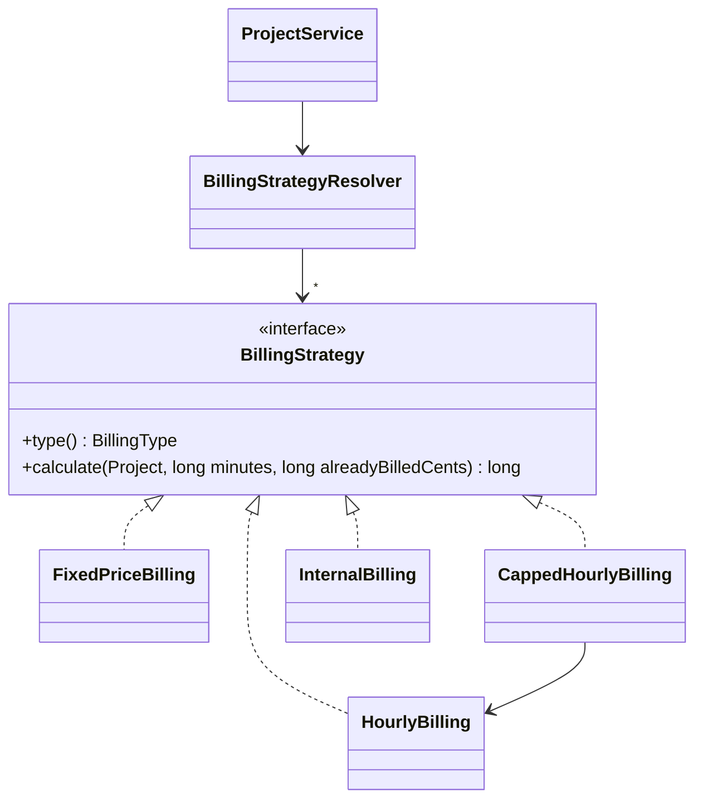

# 08 — Patterns I: Strategy and Repository · Spring Boot

[← Concepts](README.md) · Starting point: end of lesson 07 (with `ProjectService` from the independent work) · Estimated time in class: 2 h · Independent work tasks: [README](README.md#independent-work-2-h)

---

## What we build today

- A naive `billableAmountCents()` method with a `switch` on the billing type — written on purpose, so we
  can see the problem and keep it in Git history.
- `billing.BillingStrategy` (interface) and three `@Component` strategies: `HourlyBilling`,
  `FixedPriceBilling`, `CappedHourlyBilling`.
- `billing.BillingStrategyResolver` — receives **all** strategies as a `List`, builds an `EnumMap`, and
  refuses to start if a billing type has no strategy.
- `project.BillableSummary` and `ProjectService.billableSummary()` — minutes and amount for one project.
- A "Billable so far" box on the project page.
- A temporary sanity-check runner, and the start of `docs/patterns.md`.

**Final result:** open any project. Under the project details you see *Billable so far: 292,50 € —
6 h 30 min of billable time*. The amount comes from the right strategy for the project's billing type.
There is no `switch` on billing type left in the entity or the controller.

---

## Step 1 — The naive version (on purpose)

**Why:** you learn to recognise a pattern need by *feeling* the problem first. We write the
straightforward version, commit it, and then refactor. Both versions stay in your Git history — evidence
for the ÕV1 criterion "an anti-pattern you refactored away".

Add a method to the `Project` entity:

```java
// src/main/java/ee/ta25/billable/project/Project.java — add inside the class (removed in Step 7)

  /** Naive version: how much can be billed for {@code minutes} of work? */
  public long billableAmountCents(long minutes) {
    return switch (billingType) {
      case HOURLY -> (minutes * hourlyRateCents + 30) / 60;
      case FIXED -> fixedPriceCents;
      case CAPPED -> Math.min((minutes * hourlyRateCents + 30) / 60, budgetCapCents);
    };
  }
```

`TimeEntryRepository` needs a derived query for the billable entries of one project:

```java
// src/main/java/ee/ta25/billable/timeentry/TimeEntryRepository.java — add inside the interface
  List<TimeEntry> findByProjectAndBillableTrue(Project project);
```

Add a temporary method to `ProjectService`. The constructor gets `TimeEntryRepository` if it does not
have it yet (it does if you did the lesson 07 solution):

```java
// src/main/java/ee/ta25/billable/project/ProjectService.java — add inside the class (temporary)

  public long billableSoFarCents(Project project) {
    long minutes =
        timeEntries.findByProjectAndBillableTrue(project).stream()
            .mapToLong(TimeEntry::durationMinutes)
            .sum();
    return project.billableAmountCents(minutes);
  }
```

(Import `ee.ta25.billable.timeentry.TimeEntry`.)

In `ProjectController`, add the value to the model in the project detail handler:

```java
// src/main/java/ee/ta25/billable/project/ProjectController.java — in the show handler
    Project project = projects.get(id);
    model.addAttribute("project", project);
    model.addAttribute("billableSoFar", projects.billableSoFarCents(project));
```

And in the template, below the project details. `@formatters` is the `common.Formatters` bean from
lesson 04; `@beanName` is how a Thymeleaf expression calls a Spring bean:

```html
<!-- src/main/resources/templates/projects/show.html — below the project details -->
<p><strong>Billable so far:</strong>
  <span th:text="${@formatters.euros(billableSoFar)}">0,00 €</span></p>
```

**What happens:**

1. The switch **expression** returns the value of the matching case. Because `billingType` is an enum
   and this is an expression, the compiler checks that every constant is covered.
2. `hourlyRateCents` is a `Long` (the column is a nullable `bigint`). `minutes * hourlyRateCents`
   unboxes it to `long`. If it is `null`, you get a `NullPointerException` — validation from
   lesson 05 must make sure hourly and capped projects have a rate.
3. `(… + 30) / 60` on `long` values is integer division with half-up rounding to the cent.
4. The service adds up `durationMinutes()` of every billable entry (unrounded — lesson 10 adds rounding)
   and asks the entity.

**Check it works:** open a project page. For an hourly project at 60,00 €/h with 90 minutes of billable
entries you see "Billable so far: 90,00 €".

**Commit:** `feat(projects): show billable amount (naive switch version)`

---

## Step 2 — Feel the problem

**Why:** before refactoring, name exactly what is wrong.

```bash
grep -rn "case HOURLY\|BillingType\.\(HOURLY\|FIXED\|CAPPED\)" src/main/java
```

You will find the billing type decided in several places: `Project.billableAmountCents()`, and in
`ProjectForm` (`usesHourlyRate()`, the `@AssertTrue` rules such as `isHourlyRateGiven()`, and `toCommand()`
from lessons 05 and 07).
The budget warning (lesson 09) and the invoice generator (lesson 13) would add more.

Now ask:

1. **What happens when invoices arrive?** Fixed and capped must subtract what is already invoiced.
   Every case changes; the method gets a second parameter.
2. **How do I test the capped rule alone?** You need a `Project` entity with every field set, and the
   test runs through the shared method.
3. **Who changes this method?** Anyone who touches any billing type — a Single Responsibility problem.
4. **Does the entity belong here?** The entity now knows money maths for every type. It will grow with
   every billing rule.

The pricing `switch` in `ProjectService` and the form checks are about *input* ("which fields does this
type need?") — a `switch` is fine there. The **calculation** is a family of interchangeable algorithms.
That is the Strategy pattern's problem.

(Java's exhaustive switch expression is a real advantage over the PHP track: forgetting a case is a
compile error. It still does not fix points 1–4.)

---

## Step 3 — The `BillingStrategy` interface

**Why:** the interface is the contract every billing algorithm keeps. Callers depend only on it.

```java
// src/main/java/ee/ta25/billable/billing/BillingStrategy.java
package ee.ta25.billable.billing;

import ee.ta25.billable.project.BillingType;
import ee.ta25.billable.project.Project;

/**
 * One way of turning billable time into an amount of money. All amounts are in cents (R1); the
 * result is never negative.
 */
public interface BillingStrategy {

  /** The billing type this strategy handles. Used by {@link BillingStrategyResolver}. */
  BillingType type();

  /**
   * @param project the project being billed
   * @param billableMinutes minutes to bill now (rounded per entry from lesson 10 on)
   * @param alreadyBilledCents amount already invoiced for this project (0 until lesson 13)
   * @return amount to bill now, in cents
   */
  long calculate(Project project, long billableMinutes, long alreadyBilledCents);
}
```

**What happens:**

1. `type()` lets each strategy *say* which billing type it handles. The resolver uses it to build its
   map, so nobody has to maintain a list by hand.
2. The `calculate` signature is fixed for the whole module. `alreadyBilledCents` is always `0` today, but
   lesson 13 will not need to change the interface — only the caller.
3. `long` for cents, matching the `bigint` columns and the `Long` fields of `Project`. An `int` would
   overflow at about 21 million euros — unlikely for an invoice, but `minutes × rate` in the middle of
   the calculation grows faster than the result.
4. Lesson 10 replaces these `long`s with a `Money` record, so the compiler can tell cents from minutes.

---

## Step 4 — `HourlyBilling`

```java
// src/main/java/ee/ta25/billable/billing/HourlyBilling.java
package ee.ta25.billable.billing;

import ee.ta25.billable.project.BillingType;
import ee.ta25.billable.project.Project;
import org.springframework.stereotype.Component;

/** R6: minutes × hourly rate ÷ 60, rounded half up to the cent. */
@Component
public class HourlyBilling implements BillingStrategy {

  @Override
  public BillingType type() {
    return BillingType.HOURLY;
  }

  @Override
  public long calculate(Project project, long billableMinutes, long alreadyBilledCents) {
    // Integer division rounds down; adding half the divisor first rounds half up (values >= 0).
    return (billableMinutes * project.getHourlyRateCents() + 30) / 60;
  }
}
```

**What happens:**

1. `@Component` makes it a Spring bean. It has no dependencies, so Spring calls the default constructor.
2. `alreadyBilledCents` is ignored: hourly projects have no upper limit.
3. Example: 7 minutes at 45,50 €/h → `(7 × 4550 + 30) / 60` = `31880 / 60` = 531. The exact value
   530,83 rounds half up to 531. ✔

---

## Step 5 — `FixedPriceBilling`

```java
// src/main/java/ee/ta25/billable/billing/FixedPriceBilling.java
package ee.ta25.billable.billing;

import ee.ta25.billable.project.BillingType;
import ee.ta25.billable.project.Project;
import org.springframework.stereotype.Component;

/** R8: the part of the agreed fixed price that has not been billed yet. */
@Component
public class FixedPriceBilling implements BillingStrategy {

  @Override
  public BillingType type() {
    return BillingType.FIXED;
  }

  @Override
  public long calculate(Project project, long billableMinutes, long alreadyBilledCents) {
    return Math.max(project.getFixedPriceCents() - alreadyBilledCents, 0);
  }
}
```

**What happens:** the minutes do not matter — the price was agreed in advance. `Math.max(…, 0)` prevents
a negative amount if more than the fixed price was ever billed.

---

## Step 6 — `CappedHourlyBilling`, built from `HourlyBilling`

**Why:** capped is "hourly, but never more than what is left of the cap". Instead of copying the hourly
formula, the capped strategy **uses** the hourly one — composition, with the dependency injected.

```java
// src/main/java/ee/ta25/billable/billing/CappedHourlyBilling.java
package ee.ta25.billable.billing;

import ee.ta25.billable.project.BillingType;
import ee.ta25.billable.project.Project;
import org.springframework.stereotype.Component;

/** R7: hourly billing, but the project's total billed amount never exceeds its budget cap. */
@Component
public class CappedHourlyBilling implements BillingStrategy {

  private final HourlyBilling hourly;

  public CappedHourlyBilling(HourlyBilling hourly) {
    this.hourly = hourly;
  }

  @Override
  public BillingType type() {
    return BillingType.CAPPED;
  }

  @Override
  public long calculate(Project project, long billableMinutes, long alreadyBilledCents) {
    long hourlyAmount = hourly.calculate(project, billableMinutes, alreadyBilledCents);
    long remainingBudget = Math.max(project.getBudgetCapCents() - alreadyBilledCents, 0);
    return Math.min(hourlyAmount, remainingBudget);
  }
}
```

**What happens:**

1. The constructor asks for `HourlyBilling` — the **concrete class**, not the interface. There is exactly
   one bean of that class, so Spring can inject it. (Asking for `BillingStrategy` here would fail: there
   are three candidates.)
2. `remainingBudget` is what is left of the cap; `Math.max(…, 0)` avoids a negative value.
3. `Math.min` picks the full hourly amount or what still fits under the cap, whichever is smaller.

Example: cap 500,00 €, already billed 450,00 €, 120 minutes at 60 €/h → hourly 12 000 cents, remaining
5 000 → result 5 000 cents.

---

## Step 7 — `BillingStrategyResolver`

**Why:** something must turn a project's billing type into the right strategy. We put that decision in
exactly one class — and let Spring hand us every strategy, so the resolver never needs editing when a
strategy is added.

```java
// src/main/java/ee/ta25/billable/billing/BillingStrategyResolver.java
package ee.ta25.billable.billing;

import ee.ta25.billable.project.BillingType;
import ee.ta25.billable.project.Project;
import java.util.Collections;
import java.util.EnumMap;
import java.util.List;
import java.util.Map;
import org.springframework.stereotype.Component;

/**
 * Chooses the billing strategy for a project. The only place that decides, by billing type, how a
 * project is billed.
 */
@Component
public class BillingStrategyResolver {

  private final Map<BillingType, BillingStrategy> strategies;

  public BillingStrategyResolver(List<BillingStrategy> strategies) {
    var byType = new EnumMap<BillingType, BillingStrategy>(BillingType.class);
    for (BillingStrategy strategy : strategies) {
      BillingStrategy previous = byType.put(strategy.type(), strategy);
      if (previous != null) {
        throw new IllegalStateException(
            "Two billing strategies for %s: %s and %s"
                .formatted(
                    strategy.type(),
                    previous.getClass().getSimpleName(),
                    strategy.getClass().getSimpleName()));
      }
    }
    for (BillingType type : BillingType.values()) {
      if (!byType.containsKey(type)) {
        throw new IllegalStateException("No BillingStrategy for billing type " + type);
      }
    }
    this.strategies = Collections.unmodifiableMap(byType);
  }

  public BillingStrategy forProject(Project project) {
    return strategies.get(project.getBillingType());
  }
}
```

**What happens:**

1. `List<BillingStrategy>` in a constructor tells Spring: *give me every bean that implements this
   interface*. Spring passes `HourlyBilling`, `FixedPriceBilling` and `CappedHourlyBilling`. This is a
   very useful Spring idiom on its own.
2. An `EnumMap` is a `Map` whose keys are the constants of one enum. It is stored internally as an array
   indexed by the constant's position — small and fast.
3. `put` returns the value that was there before. If it is not `null`, two strategies claim the same type
   — we stop with a clear message instead of silently keeping one of them. The same first loop as a
   stream, if you prefer it:

   ```java
   var byType =
       strategies.stream()
           .collect(
               Collectors.toMap(
                   BillingStrategy::type,
                   Function.identity(),
                   (a, b) -> {
                     throw new IllegalStateException("Two billing strategies for " + a.type());
                   },
                   () -> new EnumMap<>(BillingType.class)));
   ```

   The third argument is called when two strategies have the same key; the fourth creates the
   `EnumMap` (`EnumMap::new` does not work here, because the constructor needs the enum class).
   Imports: `java.util.function.Function`, `java.util.stream.Collectors`.
4. The second loop checks that **every** `BillingType` has a strategy. If not, the constructor throws,
   the bean cannot be created, and **the application does not start**. You find the mistake on your own
   machine within seconds — "fail fast".
5. `forProject` is a map lookup. There is no `switch` at all; a new strategy class with a new `type()` is
   picked up automatically. (The method is not called `for` because `for` is a reserved word in Java; the Laravel track uses the same name `forProject` for parity.)
6. `Collections.unmodifiableMap` makes the map read-only: the resolver is a shared singleton and nobody
   should change it after start-up.

Now **delete** `billableAmountCents()` from `Project`. It must not live on next to the strategies.

---

## Step 8 — Use the resolver in `ProjectService`

**Why:** the service is the **context** of the pattern: it gathers the minutes, gets a strategy and calls
it. The page needs minutes and amount, so the service returns one small record.

```java
// src/main/java/ee/ta25/billable/project/BillableSummary.java
package ee.ta25.billable.project;

/** What a project could bill right now. */
public record BillableSummary(long minutes, long cents) {

  public long hours() {
    return minutes / 60;
  }

  public long remainingMinutes() {
    return minutes % 60;
  }
}
```

Update `ProjectService`: add the resolver to the constructor and replace the temporary method.

```java
// src/main/java/ee/ta25/billable/project/ProjectService.java — fields, constructor, billableSummary()
  private final ProjectRepository projects;
  private final TimeEntryRepository timeEntries;
  private final ClientService clients;
  private final BillingStrategyResolver billing;

  public ProjectService(
      ProjectRepository projects,
      TimeEntryRepository timeEntries,
      ClientService clients,
      BillingStrategyResolver billing) {
    this.projects = projects;
    this.timeEntries = timeEntries;
    this.clients = clients;
    this.billing = billing;
  }

  // ... forClient(), get(), create(), update(), delete(), apply() from lesson 07 stay as they are

  /**
   * Billable minutes and amount of all billable time; alreadyBilled is 0 here (the invoice generator
   * in lesson 13 works out billed amounts itself).
   */
  public BillableSummary billableSummary(Project project) {
    long minutes =
        timeEntries.findByProjectAndBillableTrue(project).stream()
            .mapToLong(TimeEntry::durationMinutes)
            .sum();
    long cents = billing.forProject(project).calculate(project, minutes, 0);
    return new BillableSummary(minutes, cents);
  }
```

(Import `ee.ta25.billable.billing.BillingStrategyResolver`.)

**What happens:**

1. The class-level `@Transactional(readOnly = true)` from lesson 07 also covers `billableSummary`.
2. We sum minutes **per entry** in Java instead of `SUM()` in SQL, because lesson 10 rounds each entry up
   to the project's `rounding_minutes` *before* summing (R5).
3. `billing.forProject(project)` returns a `BillingStrategy`; the service does not know or care which
   class it is.
4. The dependency chain Spring now builds: `ProjectController` → `ProjectService` →
   `BillingStrategyResolver` → all strategies → `HourlyBilling` (for capped). All through constructors.

---

## Step 9 — Show it on the project page

```java
// src/main/java/ee/ta25/billable/project/ProjectController.java — the show handler
  @GetMapping("/projects/{id}")
  public String show(@PathVariable long id, Model model) {
    Project project = projects.get(id);
    model.addAttribute("project", project);
    model.addAttribute("summary", projects.billableSummary(project));
    return "projects/show";
  }
```

```html
<!-- src/main/resources/templates/projects/show.html — replace the temporary "Billable so far" line -->
<article>
  <header><strong>Billable so far</strong></header>
  <p>
    <strong th:text="${@formatters.euros(summary.cents())}">0,00 €</strong>
    — <span th:text="${summary.hours()}">0</span> h
    <span th:text="${summary.remainingMinutes()}">0</span> min of billable time
  </p>
  <small>Before rounding (lesson 10) and before invoices (lesson 13).</small>
</article>
```

**What happens:** the controller asks one question and passes the answer on. We call the record
accessors as methods (`summary.cents()`), which works in every Spring version's expression language.

**Check it works:** open one project of each type.

| Project (example seed data) | Expect |
|---|---|
| Hourly, 60,00 €/h, 1 h 30 min billable | 90,00 € |
| Fixed, 2 000,00 € | 2 000,00 € (whatever the minutes) |
| Capped, 45,00 €/h, cap 250,00 €, 6 h 30 min billable | 250,00 € (hourly would be 292,50 €) |

Mark one entry as not billable → the amount goes down.

---

## Step 10 — A temporary sanity check

**Why:** quick evidence that each strategy calculates correctly at the rounding boundaries. Real unit
tests come in **lesson 11**. Today we use a throw-away `CommandLineRunner` — a bean whose `run()` method
Spring calls once after start-up — active only under a special profile.

```java
// src/main/java/ee/ta25/billable/billing/BillingSanityCheck.java  (temporary — delete after this step)
package ee.ta25.billable.billing;

import ee.ta25.billable.project.Project;
import ee.ta25.billable.project.ProjectRepository;
import org.springframework.boot.CommandLineRunner;
import org.springframework.context.annotation.Profile;
import org.springframework.stereotype.Component;

@Component
@Profile("sanity")
class BillingSanityCheck implements CommandLineRunner {

  private final ProjectRepository projects;
  private final BillingStrategyResolver resolver;

  BillingSanityCheck(ProjectRepository projects, BillingStrategyResolver resolver) {
    this.projects = projects;
    this.resolver = resolver;
  }

  @Override
  public void run(String... args) {
    for (Project project : projects.findAll()) {
      BillingStrategy strategy = resolver.forProject(project);
      System.out.printf(
          "%-25s %-20s 1 min=%d  60 min=%d  120 min after 450,00 billed=%d%n",
          project.getName(),
          strategy.getClass().getSimpleName(),
          strategy.calculate(project, 1, 0),
          strategy.calculate(project, 60, 0),
          strategy.calculate(project, 120, 45_000));
    }
  }
}
```

Run the application with the profile:

```bash
./mvnw spring-boot:run -Dspring-boot.run.profiles=sanity
```

**Check it works:** before the "Started BillableApplication" line you see one line per project, for
example:

```text
Website redesign          HourlyBilling        1 min=100  60 min=6000  120 min after 450,00 billed=12000
Logo package              FixedPriceBilling    1 min=200000  60 min=200000  120 min after 450,00 billed=155000
Support 2026              CappedHourlyBilling  1 min=75  60 min=4500  120 min after 450,00 billed=5000
```

Compare with the formulas. For an exact half-cent case, temporarily set one hourly project's rate to
4530 cents: 1 minute must give **76** (75,5 rounds up). A rate of 4520 must give **75**.

**What happens:**

1. `@Profile("sanity")` means the bean exists only when the `sanity` profile is active. Normal runs and
   tests ignore it.
2. `-Dspring-boot.run.profiles=sanity` tells the Spring Boot Maven plugin which profile to activate.
3. The class and constructor are package-private — nothing else needs them.

Stop the app (`Ctrl+C`) and **delete** `BillingSanityCheck.java`. Keep the numbers — they become test
cases in lesson 11.

---

## Step 11 — Start `docs/patterns.md`

**Why:** `docs/patterns.md` is a capstone deliverable for ÕV1: every pattern you use, in your own words,
with real file names. Start it now while the code is fresh.

```markdown
<!-- docs/patterns.md -->
# Patterns used in Billable

Each entry: the problem in Billable, the pattern, where it is in the code, and the trade-off.

| Pattern | Where | Lesson |
|---|---|---|
| Dependency Injection | Constructors of controllers, services, strategies | 07 |
| Strategy | `billing/*Billing.java` | 08 |
| Simple Factory | `billing/BillingStrategyResolver.java` | 08 |

## Dependency Injection

**Problem.** A class that creates its own dependencies hides them and cannot be tested with replacements.

**Solution.** Every bean lists its dependencies as constructor parameters and keeps them in `final`
fields. Spring builds all beans at start-up and passes them in. For example `ProjectController`
receives `ProjectService`, which receives `BillingStrategyResolver`, which receives every
`BillingStrategy` as a `List`.

**Where.** `project/ProjectService.java`, `billing/BillingStrategyResolver.java`.

**Trade-off.** The wiring happens outside our code; a missing bean is reported at start-up.

## Strategy

_(independent work)_

## Simple Factory (BillingStrategyResolver)

_(independent work)_
```

Rewrite the DI entry in your own words — the text above only shows the level of detail.

---

## Step 12 — Format, verify, commit

```bash
./mvnw spotless:apply
./mvnw verify
git add -A
git commit -m "refactor(billing): replace billing-type switch with strategies and a resolver"
```

**Check it works:** `BUILD SUCCESS`; `git log --oneline -3` shows the naive and the refactor commit;
`grep -rn billableAmountCents src/` prints nothing; `BillingSanityCheck.java` is not committed.

---

## Troubleshooting

| Error / symptom | Cause | Fix |
|---|---|---|
| `Failed to instantiate [ee.ta25.billable.billing.BillingStrategyResolver]: Constructor threw exception` … `No BillingStrategy for billing type CAPPED` | A strategy class is missing `@Component`, or its `type()` returns the wrong constant | Add `@Component`; check `type()` |
| `… Two billing strategies for HOURLY: HourlyBilling and …` | Copy-paste: two classes return the same `type()` | Fix `type()` in the copied class |
| `Parameter 0 of constructor in …CappedHourlyBilling required a single bean, but 3 were found` | Constructor asks for `BillingStrategy` instead of `HourlyBilling` | Inject the concrete `HourlyBilling` |
| `NullPointerException: Cannot invoke "java.lang.Long.longValue()" because … getHourlyRateCents() is null` | Hourly/capped project without a rate | Fix the data; lesson 05 validation must require it |
| `EL1004E: Method call: Method cents() cannot be found` / property not found in Thymeleaf | Wrong attribute name or not a record | Check `model.addAttribute("summary", …)` and the record accessor names |
| Sanity runner prints nothing | Profile not active | Check the `-Dspring-boot.run.profiles=sanity` spelling; the class must be in a scanned package |
| `LazyInitializationException` when the page shows the client name | The project was loaded without its client and the template navigates `project.client.name` | Load the client in the repository query (`@EntityGraph(attributePaths = "client")` on `findById` override) or pass the client separately |
| AI suggests `Math.round(minutes / 60.0 * rate)` | `double` in a money calculation | `(minutes * rate + 30) / 60` on `long` |

---

## Recap

- `billing/BillingStrategy.java` — contract: `type()` and `calculate()` in cents, never negative.
- `billing/HourlyBilling.java`, `FixedPriceBilling.java`, `CappedHourlyBilling.java` — one algorithm each;
  capped reuses hourly through constructor injection.
- `billing/BillingStrategyResolver.java` — `List<BillingStrategy>` → `EnumMap`; fails at start-up if a
  type is missing or doubled.
- `project/BillableSummary.java` + `ProjectService.billableSummary()` — the context; the page shows
  "Billable so far".
- The naive `switch` is gone from `Project`, but visible in Git history.
- `docs/patterns.md` started.

---

## Independent work — solutions

> **The tasks are not here.** The task descriptions (Basic / Intermediate / Advanced, with acceptance
> criteria) are in this lesson's [README.md → Independent work (~2 h)](README.md#independent-work-2-h).
> Read them there first and build the features in your project. This section only contains the
> solutions — try each task yourself, then open a solution to compare or when you are stuck.

<details>
<summary><strong>Basic 1</strong> — the <code>INTERNAL</code> billing type with a Null Object</summary>

**1. The enum.** Add the constant to your lesson 03 enum (shape shown; keep your own fields):

```java
// src/main/java/ee/ta25/billable/project/BillingType.java
package ee.ta25.billable.project;

import jakarta.persistence.EnumeratedValue;

/** How a project is billed. The database stores {@link #dbValue()}. */
public enum BillingType {
  HOURLY("hourly", "Hourly"),
  FIXED("fixed", "Fixed price"),
  CAPPED("capped", "Capped hourly"),
  INTERNAL("internal", "Internal (not billed)");

  @EnumeratedValue private final String dbValue;
  private final String label;

  BillingType(String dbValue, String label) {
    this.dbValue = dbValue;
    this.label = label;
  }

  /** The value stored in {@code projects.billing_type}. */
  public String dbValue() {
    return dbValue;
  }

  /** Human-readable name for pages and forms. */
  public String label() {
    return label;
  }
}
```

`@EnumeratedValue` from lesson 03 maps the new constant to `internal` without any other change. No migration: the column is `varchar(20)`. (If you added a `CHECK` constraint on
`billing_type`, write a Flyway migration that drops and re-creates it with `'internal'`.)

**2. The compiler shows you the first place.** `./mvnw compile` now fails on the switch expression in
`ProjectForm.usesHourlyRate()` (lesson 05):

```text
the switch expression does not cover all possible input values
```

An exhaustive switch expression over an enum is checked by the compiler, so a new constant cannot be
forgotten. Add it to the `false` case:

```java
// src/main/java/ee/ta25/billable/project/ProjectForm.java — usesHourlyRate()
  private boolean usesHourlyRate() {
    return switch (billingType) {
      case HOURLY, CAPPED -> true;
      case FIXED, INTERNAL -> false;
    };
  }
```

**3. Start the application now — before writing the strategy.** It fails:

```text
No BillingStrategy for billing type INTERNAL
```

That is the fail-fast check from Step 7 doing its job.

**4. Validation.** The `@AssertTrue` rules in `ProjectForm` require the rate only for `HOURLY`/`CAPPED`,
the fixed price only for `FIXED`, the cap only for `CAPPED` — so `INTERNAL` passes with all three empty,
and `toCommand()` sets all three prices to `null`. The select is filled from `BillingType.values()`
(the `billingTypes` model attribute), so the option appears by itself.

**5. The Null Object strategy:**

```java
// src/main/java/ee/ta25/billable/billing/InternalBilling.java
package ee.ta25.billable.billing;

import ee.ta25.billable.project.BillingType;
import ee.ta25.billable.project.Project;
import org.springframework.stereotype.Component;

/**
 * Null Object: internal projects are tracked but never billed. Callers treat it like any other
 * strategy — no null checks needed.
 */
@Component
public class InternalBilling implements BillingStrategy {

  @Override
  public BillingType type() {
    return BillingType.INTERNAL;
  }

  @Override
  public long calculate(Project project, long billableMinutes, long alreadyBilledCents) {
    return 0;
  }
}
```

**Check:** the application starts; an internal project shows "Billable so far: 0,00 €".
`git diff --stat` shows `BillingType.java`, `InternalBilling.java`, `ProjectForm.java` — and **not**
`BillingStrategyResolver.java` or the three other strategies. In Spring the resolver is truly closed for
modification. Mention that in `docs/patterns.md`; the Laravel track has to add one line to its resolver.

Commit: `feat(billing): add internal billing type with a null-object strategy`
</details>

<details>
<summary><strong>Basic 2</strong> — <code>docs/patterns.md</code>: Strategy and Simple Factory (example)</summary>

````markdown
## Strategy

**Problem.** Each billing type (hourly, fixed, capped, internal) calculates the amount differently. The
first version was a `switch` in `Project.billableAmountCents()`. Every rule change meant editing the
entity, and the same `switch` would have been needed in the budget warning and the invoice generator.

**Solution.** Each calculation is its own `@Component` behind the `BillingStrategy` interface. Code that
needs an amount (`ProjectService`, later `InvoiceGenerator`) calls `calculate()` and does not know which
class it has. `CappedHourlyBilling` reuses `HourlyBilling` through constructor injection.



**Where.** `src/main/java/ee/ta25/billable/billing/`.

**Trade-off.** Five small classes instead of one method, and the choice happens at runtime, so "find
usages" on a strategy shows no direct callers. In return, each rule can be changed and tested alone.

## Simple Factory — `BillingStrategyResolver`

**Problem.** Something must map "this project is capped" to `CappedHourlyBilling`; if every caller did
it, the `switch` would come back everywhere.

**Solution.** Spring injects every `BillingStrategy` bean as a `List`. The resolver indexes them in an
`EnumMap` by `type()` and checks at start-up that every `BillingType` has exactly one strategy.
`forProject(project)` is a map lookup.

**Where.** `billing/BillingStrategyResolver.java`, used by `project/ProjectService.java`.

**Trade-off.** Adding a billing type needs no change here (Open/Closed), but the mapping is implicit —
you have to read each strategy's `type()` to see it.
````
</details>

<details>
<summary><strong>Intermediate</strong> — Active Record vs Repository: a custom repository fragment</summary>

Derived query names get unreadable with optional filters (`findByProjectAndBillableTrueAndStartedAtGreaterThanEqualAndStartedAtLessThan…`)
and cannot skip a filter when a parameter is `null`. A **custom fragment** adds hand-written methods to
the same repository interface.

```java
// src/main/java/ee/ta25/billable/timeentry/TimeEntryQueries.java
package ee.ta25.billable.timeentry;

import ee.ta25.billable.project.Project;
import java.time.LocalDateTime;
import java.util.List;

/** Hand-written queries that derived query methods cannot express well. */
public interface TimeEntryQueries {

  /**
   * Billable entries, optionally limited to one project and a time range. Pass {@code null} to skip
   * a filter.
   */
  List<TimeEntry> findBillable(Project project, LocalDateTime from, LocalDateTime until);
}
```

```java
// src/main/java/ee/ta25/billable/timeentry/TimeEntryQueriesImpl.java
package ee.ta25.billable.timeentry;

import ee.ta25.billable.project.Project;
import jakarta.persistence.EntityManager;
import jakarta.persistence.TypedQuery;
import java.time.LocalDateTime;
import java.util.List;

/** Spring Data finds this class by name: fragment interface name + "Impl". */
class TimeEntryQueriesImpl implements TimeEntryQueries {

  private final EntityManager entityManager;

  TimeEntryQueriesImpl(EntityManager entityManager) {
    this.entityManager = entityManager;
  }

  @Override
  public List<TimeEntry> findBillable(Project project, LocalDateTime from, LocalDateTime until) {
    var jpql = new StringBuilder("select e from TimeEntry e where e.billable = true");
    if (project != null) {
      jpql.append(" and e.project = :project");
    }
    if (from != null) {
      jpql.append(" and e.startedAt >= :from");
    }
    if (until != null) {
      jpql.append(" and e.startedAt < :until");
    }
    jpql.append(" order by e.startedAt");

    TypedQuery<TimeEntry> query = entityManager.createQuery(jpql.toString(), TimeEntry.class);
    if (project != null) {
      query.setParameter("project", project);
    }
    if (from != null) {
      query.setParameter("from", from);
    }
    if (until != null) {
      query.setParameter("until", until);
    }
    return query.getResultList();
  }
}
```

```java
// src/main/java/ee/ta25/billable/timeentry/TimeEntryRepository.java — extend the fragment
public interface TimeEntryRepository extends JpaRepository<TimeEntry, Long>, TimeEntryQueries {
  // existing methods stay
}
```

Use it in `ProjectService.billableSummary()`:

```java
// src/main/java/ee/ta25/billable/project/ProjectService.java — inside billableSummary()
    long minutes =
        timeEntries.findBillable(project, null, null).stream()
            .mapToLong(TimeEntry::durationMinutes)
            .sum();
```

**What happens:**

1. Spring Data sees that `TimeEntryRepository` extends `TimeEntryQueries`, looks for a class named
   `TimeEntryQueriesImpl`, creates it as a bean and routes calls of `findBillable` to it. All other
   methods are still generated.
2. The `EntityManager` is injected through the constructor; Spring provides a thread-safe shared proxy.
3. The JPQL uses entity and field names (`TimeEntry`, `startedAt`), not table and column names. Values
   are always **parameters** (`:project`), never concatenated into the string — that prevents SQL
   injection.

(Alternative with less string building: Spring Data *Specifications* via `JpaSpecificationExecutor`.
Worth reading about; the fragment is the more general tool.)

**Write-up (example, put it in `docs/patterns.md`):**

```markdown
## Active Record vs Repository

Spring Data JPA uses a **Data Mapper** (Hibernate) plus **Repositories**. `TimeEntry` is a plain object
with JPA annotations; it cannot load or save itself. `TimeEntryRepository` is an interface; Spring
generates the implementation. Laravel's Eloquent uses **Active Record** instead: the model class has
the data *and* the query and save methods (`TimeEntry::where(...)`, `$entry->save()`).

For simple lookups we use derived queries (`findByProjectAndBillableTrue`). For a query with optional
filters we added a custom fragment, `TimeEntryQueries` / `TimeEntryQueriesImpl`, used by
`ProjectService`.

+ Repository: entities are plain objects, so domain logic is easy to unit test; persistence is behind
  an interface that can be replaced with a mock (lesson 12).
− Repository: more code and more concepts (entity manager, managed state, flush at commit).
+ Active Record: little code, very fast for CRUD, easy to read.
− Active Record: models depend on the database; logic in models is harder to test in isolation.
```
</details>

<details>
<summary><strong>Advanced</strong> — Template Method and Decorator alternatives</summary>

Work on a branch: `git switch -c experiment/template-method`.

**Template Method** — an abstract base class fixes the steps in a `final` method; subclasses fill in the
varying step (the *hook*):

```java
// src/main/java/ee/ta25/billable/billing/HourlyBasedBilling.java  (experiment branch)
package ee.ta25.billable.billing;

import ee.ta25.billable.project.Project;

/** Template Method: compute the hourly amount the same way, then let the subclass limit it. */
public abstract class HourlyBasedBilling implements BillingStrategy {

  @Override
  public final long calculate(Project project, long billableMinutes, long alreadyBilledCents) {
    long hourlyAmount = (billableMinutes * project.getHourlyRateCents() + 30) / 60;
    return limit(project, hourlyAmount, alreadyBilledCents);
  }

  /** The step each subclass decides. */
  protected abstract long limit(Project project, long hourlyAmount, long alreadyBilledCents);
}
```

```java
// src/main/java/ee/ta25/billable/billing/HourlyBilling.java  (experiment branch)
@Component
public class HourlyBilling extends HourlyBasedBilling {

  @Override
  public BillingType type() {
    return BillingType.HOURLY;
  }

  @Override
  protected long limit(Project project, long hourlyAmount, long alreadyBilledCents) {
    return hourlyAmount;
  }
}
```

```java
// src/main/java/ee/ta25/billable/billing/CappedHourlyBilling.java  (experiment branch)
@Component
public class CappedHourlyBilling extends HourlyBasedBilling {

  @Override
  public BillingType type() {
    return BillingType.CAPPED;
  }

  @Override
  protected long limit(Project project, long hourlyAmount, long alreadyBilledCents) {
    return Math.min(hourlyAmount, Math.max(project.getBudgetCapCents() - alreadyBilledCents, 0));
  }
}
```

`FixedPriceBilling` does not fit the template (it is not hourly-based) and still implements the
interface directly. The resolver is unchanged.

**Decorator** (lesson 09 uses this pattern for the notifier) — implements the interface *and* wraps
another instance of it:

```java
// Sketch — not a Spring bean in this form
public class BudgetCapDecorator implements BillingStrategy {

  private final BillingStrategy inner;

  public BudgetCapDecorator(BillingStrategy inner) {
    this.inner = inner;
  }

  @Override
  public BillingType type() {
    return BillingType.CAPPED;
  }

  @Override
  public long calculate(Project project, long billableMinutes, long alreadyBilledCents) {
    long amount = inner.calculate(project, billableMinutes, alreadyBilledCents);
    return Math.min(amount, Math.max(project.getBudgetCapCents() - alreadyBilledCents, 0));
  }
}
// capped = new BudgetCapDecorator(hourlyBilling) — registered with a @Bean method
```

**Check:** bring back the sanity runner on the branch (or write a small `main`) and compare the capped
results with the main branch for three inputs: `(1, 0)`, `(60, 0)`, `(120, 45000)`.

**Which is better for Billable? (example argument)**

- *Template Method* relies on **inheritance**. The shared step is guaranteed by `final`, but subclasses
  are tied to the base class, a strategy that does not fit (fixed) stays outside, and every new variation
  needs a new hook. Spring proxies also cannot override `final` methods — harmless here, but a trap if a
  strategy ever gets `@Transactional`.
- *Decorator* relies on **composition**. A cap could wrap *any* strategy, but it needs a `@Bean` method to
  wire, and `type()` of a wrapper is an awkward question. The flexibility is not needed today.
- *Current design* — `CappedHourlyBilling` holding an injected `HourlyBilling` — is composition too, but
  simple: the formula exists once and each class is readable alone.

Conclusion: keep Strategy + composition; prefer composition over inheritance unless the fixed steps are
many and stable. Write the argument in `docs/patterns.md`, then `git switch main` (keep the branch as
evidence).
</details>
