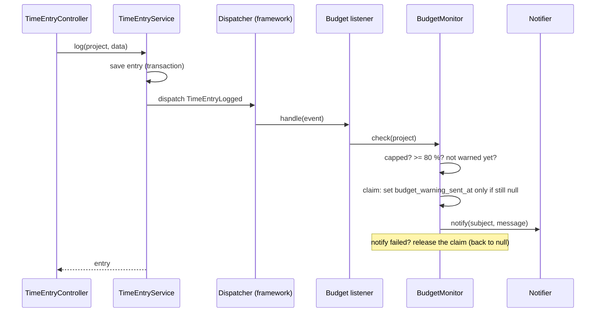
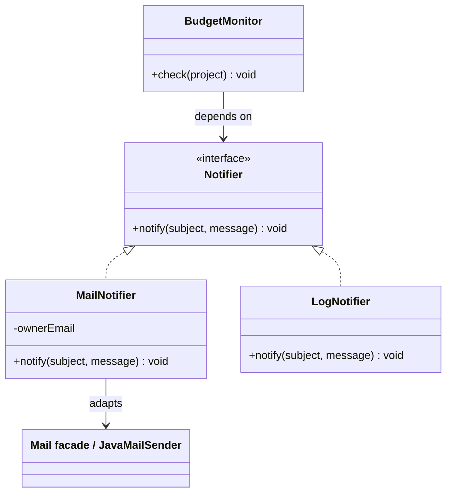

# 09 — Patterns II: Observer, Adapter, Decorator

**Outcomes:** ÕV1 — *tunneb enamlevinud programmeerimismustreid* · **Time:** 2 h in class + ~2 h independent
**Before this lesson:** your project matches the end state of lesson 08 (see [what exists after each lesson](../../PROJECT.md#what-exists-after-each-lesson))
**Walkthroughs:** [Laravel](laravel.md) · [Spring Boot](spring-boot.md)

---

## Why this matters

Business rule **R9** says: *when a capped project's value reaches 80 % of its cap, the owner is warned —
once.* It sounds like a small feature. The interesting question is **where the code goes**.

The obvious place is inside `TimeEntryService::log()`: save the entry, then check the budget, then send
an email. It works on the first day. Then the requests arrive:

- "Also post the warning to our Slack channel."
- "Also write an audit row every time an entry is logged."
- "Don't send real emails from the test suite."
- "The email provider changed — use their HTTP API instead of SMTP."

Every one of these requests would change `TimeEntryService`, a class whose job is *logging time*. After
a year it is 600 lines long and nobody wants to touch it. You have probably seen a class like this at
work.

This lesson gives you three patterns that keep responsibilities apart:

| Pattern | The problem it solves in Billable |
|---|---|
| **Observer** (events) | `TimeEntryService` announces "an entry was logged" and does not care who listens |
| **Adapter** | The domain talks to our own `Notifier` interface, not to Laravel's `Mail` or Spring's `JavaMailSender` |
| **Decorator** | We add logging around any notifier without changing the notifier class |

Together with Strategy and Repository (lesson 08) and dependency injection (lesson 07) these are the
patterns the capstone rubric asks for under ÕV1. At the defence you will be asked to open the file and
explain *why* the pattern is there — so the "why" in this lesson matters more than the syntax.

---

## Today's goal

At the end of class your application:

- has a new nullable column `projects.budget_warning_sent_at`;
- has a `Notifier` interface with two implementations, `LogNotifier` and `MailNotifier`, and a setting
  that chooses between them;
- sends real emails in development to **Mailpit**, a fake mail server that runs in Docker and shows the
  emails in a web page at `http://localhost:8025`;
- fires a `TimeEntryLogged` event every time a time entry is logged;
- has a listener that asks `BudgetMonitor` to check the project, and `BudgetMonitor` warns the owner
  **once** when a capped project reaches 80 % of its cap.

By the end you can:

- explain the Observer pattern with the words *publisher*, *subscriber* and *event object*;
- explain why a listener should run **after the database transaction commits**;
- explain what an Adapter is and why `MailNotifier` is one;
- write a Decorator and explain how it differs from inheritance;
- name six anti-patterns and find an example of each in a codebase.

---

## Concepts

### 1. The coupling problem

**Coupling** is how much one class needs to know about another. If class A calls class B directly, A
is coupled to B: when B changes, A may have to change too. Some coupling is necessary — a program is
classes working together. The question is whether the coupling is *in the right direction*.

Here is the direct version of R9:

```php
// The version we do NOT want
public function log(array $data): TimeEntry
{
    $entry = /* ... save the entry and its tags in a transaction ... */;
    $project = $entry->project;

    if ($project->billing_type === BillingType::Capped) {          // budget logic
        $value = /* ... calculate ... */;
        if ($value * 100 >= $project->budget_cap_cents * 80) {
            Mail::raw('Budget warning...', fn ($m) => $m->to('owner@...')); // mail logic
        }
    }

    return $entry;
}
```

`TimeEntryService` now depends on three things that are not its job: the budget rule, the mail system
and the owner's email address. Draw the dependencies and the problem is clear:

```
BEFORE                                   AFTER
                                         
TimeEntryService ──► budget rule         TimeEntryService ──► TimeEntryLogged (event)
       │                                                           ▲
       ├──────────► Mail facade /                                  │ listens
       │            JavaMailSender       CheckProjectBudget ───────┘
       └──────────► owner email                 │
                                                ▼
                                          BudgetMonitor ──► Notifier (interface)
                                                                 ▲
                                                    ┌────────────┴───────────┐
                                                MailNotifier            LogNotifier
                                                    │
                                                    ▼
                                           Mail / JavaMailSender
```

After the refactoring, `TimeEntryService` knows only one extra thing: an event class. The budget rule
lives in one class (`BudgetMonitor`), the mail system is touched by one class (`MailNotifier`), and each
of them can be tested alone.

### 2. Observer: publisher, subscriber, event object

The **Observer** pattern (also called *publish–subscribe*, or simply *events*) has three parts:

| Part | What it is | In Billable |
|---|---|---|
| **Event object** | A small object that describes *something that already happened*. Named in the past tense. Carries the data a listener needs. | `TimeEntryLogged` / `TimeEntryLoggedEvent` |
| **Publisher** | The code where the thing happened. It creates the event and hands it to a dispatcher. It does not know who listens. | `TimeEntryService` |
| **Subscriber** (listener, observer) | A class that reacts to one kind of event. There can be zero, one or many. | `CheckProjectBudget` / `BudgetListener` |
| **Dispatcher** (event bus) | The framework part that keeps a list of listeners per event type and calls them. | Laravel's `Event` dispatcher; Spring's `ApplicationEventPublisher` |



Why the event is named in the **past tense**: `TimeEntryLogged` is a fact. It says what happened, not
what should happen next. Compare it with a name like `SendBudgetEmail` — that is a *command*, and it
couples the publisher to one specific reaction again. A good test: could a completely different listener
(audit log, statistics, Slack) also want this event? If yes, the name is right.

**What goes into the event object?** The minimum the listeners need. Laravel's convention is to pass
the model (`TimeEntryLogged` carries the `TimeEntry`). In Spring we pass only the id
(`TimeEntryLoggedEvent(Long projectId)`), because the listener runs after the transaction and should
load a fresh copy of the project itself. Both are fine; ids are safer when events cross transaction or
process boundaries.

**The cost of events.** Events are not free. When you read `TimeEntryService` you no longer see what
happens after an entry is logged — "Find usages" on the service does not show the listener. Use events
where the publisher really should not know about the reaction. Do not turn every method call into an
event.

### 3. Synchronous and queued listeners

By default, both frameworks call listeners **synchronously**: in the same process, in the same thread,
before `dispatch()` / `publishEvent()` returns. The user's HTTP request waits until the email is sent.

A **queued** (asynchronous) listener is put on a queue instead and runs later in another process
(Laravel: `implements ShouldQueue` plus a queue worker, `php artisan queue:work`; Spring: `@Async` with
a thread pool, or a message broker).

| | Synchronous | Queued / async |
|---|---|---|
| Speed of the request | Slower — waits for the listener | Fast — returns immediately |
| If the listener fails | The user sees an error (unless you catch it) | The user sees nothing. A Laravel queued listener is retried by the worker; a Spring `@Async` method is **not** retried — the exception is only logged |
| Setup | None | Queue driver, worker process, monitoring |
| Order and timing | Predictable | The listener may run seconds later |
| Good for | Cheap checks, anything that must happen before the response | Sending mail, calling slow external APIs |

We use synchronous listeners in this course because they are simpler to follow and to test. In a real
product the mail would usually be queued. Because the notifier is behind an interface, switching later
changes one class, not the domain code.

### 4. Why "after commit" matters

`TimeEntryService::log()` saves the entry inside a **database transaction** (lesson 07): either
everything is saved, or nothing is. Now think about *when* the listener runs.

```
Listener runs INSIDE the transaction            Listener runs AFTER COMMIT

BEGIN                                           BEGIN
INSERT time_entry                               INSERT time_entry
  → event → listener sends email ✉             INSERT tag_time_entry
INSERT tag_time_entry  ✗ fails                  COMMIT ✓
ROLLBACK                                          → event → listener sends email ✉

Result: an email about an entry that            Result: the email is only sent for
does not exist.                                 data that really is in the database.
```

Three things go wrong when a listener runs inside the transaction:

1. **Emails cannot be rolled back.** The database can undo the insert; nobody can undo an email.
2. **The listener may read data that is not committed yet.** A queued listener in another process
   would not even see the new row, because other connections cannot see uncommitted data.
3. **A failing listener rolls back the publisher's work.** If the mail server is down, the user's time
   entry is lost. That is almost never what you want.

So the rule is: **side effects that leave the system (mail, HTTP calls, messages) happen after
commit.** Both frameworks support this:

- **Spring:** `@TransactionalEventListener(phase = TransactionPhase.AFTER_COMMIT)` instead of
  `@EventListener`. Spring holds the event until the surrounding transaction commits; if it rolls back,
  the listener is never called.
- **Laravel:** an event class that `implements ShouldDispatchAfterCommit` is held back until the open
  database transaction commits. For **queued** listeners, the listener can `implement
  ShouldHandleEventsAfterCommit` (older code uses a `public $afterCommit = true;` property). Or you
  simply dispatch the event *after* the `DB::transaction(...)` call has returned — which is what we do,
  plus the interface as a safety net.

One more Spring detail, explained in the walkthrough: code that runs after commit is outside the
original transaction. If it wants to *write* to the database (we set `budget_warning_sent_at`), it needs
a **new** transaction: `@Transactional(propagation = Propagation.REQUIRES_NEW)`.

> **Built-in shortcut (Spring):** the Spring Modulith project has `@ApplicationModuleListener`, one
> annotation that means "after commit, asynchronously, in a new transaction". With its event
> publication registry, events whose listener failed are stored and can be retried. We write the three
> parts by hand so you can see what each one does.

### 5. Adapter: our interface in front of their API

An **Adapter** converts the interface of one class into the interface another class expects. The
classic picture is a travel plug: your laptop charger (the domain) has one shape, the wall socket (the
framework or vendor library) has another, and the adapter sits between them.



`Notifier` is **our** interface. It has exactly one method, `notify(string subject, string message)`,
in words that make sense in Billable. It says nothing about SMTP, recipients, headers or HTML.
`MailNotifier` is the adapter: it takes our simple call and translates it into the framework's mail API.

Why bother, when Laravel and Spring already have a nice mail API?

- **The domain depends on something stable.** `BudgetMonitor` will never change because Laravel renamed
  a mail method or because you moved from SMTP to an HTTP email service.
- **Swapping is one line of configuration.** `LogNotifier` for local work, `MailNotifier` in
  production, a `SlackNotifier` next year. `BudgetMonitor` does not change.
- **Tests speak the domain's language.** In lesson 12 you replace `Notifier` with a mock and assert
  "notify was called once with this subject". Frameworks do have good test tools for mail (Laravel
  `Mail::fake()`, Spring's mocked `JavaMailSender`), but those tests check mail details. With our own
  one-method interface the `BudgetMonitor` test does not care whether the warning goes by mail, log or
  Slack.
- **It is the "D" in SOLID** (Dependency Inversion Principle): high-level code (the budget rule) and
  low-level code (sending mail) both depend on an abstraction that the high-level side owns.

**Choosing the implementation.** With two implementations of one interface, the container needs to
know which one to inject. We make it a setting, `billable.notifier = mail | log`:

- Laravel: a `bind()` in `AppServiceProvider::register()` that reads the config value.
- Spring: the settings are bound to a validated `@ConfigurationProperties` record with a
  `NotifierType` enum, and one `@Bean` method switches on that enum, so only one notifier becomes a
  bean. (Alternatives: `@ConditionalOnProperty` on each implementation, `@Primary` on the default one,
  or `@Qualifier` at the injection point.)

### 6. Decorator: add behaviour without changing the class

A **Decorator** implements the same interface as the object it wraps, holds a reference to that object,
does something extra, and delegates the real work to it.

```php
final class LoggingNotifier implements Notifier
{
    public function __construct(private Notifier $inner, private LoggerInterface $logger) {}

    public function notify(string $subject, string $message): void
    {
        $this->logger->info('Sending notification', ['subject' => $subject]);
        $this->inner->notify($subject, $message);   // delegate
    }
}
```

```
BudgetMonitor ──► LoggingNotifier ──► MailNotifier ──► Mailpit
                  (logs, then          (sends the
                   delegates)           email)
```

`BudgetMonitor` still sees "a `Notifier`". It has no idea there are now two objects. Because a decorator
*is* a `Notifier`, you can stack them: `RetryingNotifier(LoggingNotifier(MailNotifier))`.

**Decorator vs inheritance.** You could write `class LoggingMailNotifier extends MailNotifier`. But then
you also need `LoggingLogNotifier`, `LoggingSlackNotifier`… one subclass per combination. A decorator is
written once and wraps *any* notifier. This is the idea "favour composition over inheritance".

You already use decorators without knowing: Laravel middleware wraps the next request handler, and
Spring's `@Transactional` wraps your bean in a proxy that starts and commits a transaction around the
real method. Your independent work adds `LoggingNotifier`.

### 7. Adapter, Decorator, Proxy — how to tell them apart

They all "wrap" something, so students mix them up. Ask: *does the interface change?*

| Pattern | Interface of the wrapper | Purpose |
|---|---|---|
| **Adapter** | Different from the wrapped object (our `notify()` vs their `Mail::raw()`) | Make an incompatible API fit |
| **Decorator** | Same as the wrapped object | Add behaviour (logging, retry, caching) |
| **Proxy** | Same as the wrapped object | Control access (lazy loading, transactions, security) |

### 8. Singleton — the pattern and the problem

The classic **Singleton** pattern guarantees that a class has only one instance and gives global access
to it:

```php
final class Settings
{
    private static ?Settings $instance = null;
    private function __construct() {}
    public static function getInstance(): self
    {
        return self::$instance ??= new self();
    }
}
// anywhere in the code:
$rate = Settings::getInstance()->vatRate();
```

The problem is not "one instance". The problem is **global access**:

- **Hidden dependencies.** A class that calls `Settings::getInstance()` inside a method does not show
  that dependency in its constructor. You find out only by reading every line.
- **Tests leak into each other.** The instance lives for the whole test run. A test that changes it
  affects every test that runs after it — tests pass alone and fail together.
- **You cannot replace it.** There is no place to pass a fake. That is exactly why `now()` without
  `Carbon::setTestNow()`, or `LocalDate.now()` without an injected `Clock`, is hard to test.

**Container singletons are fine.** Laravel's `$this->app->singleton(...)` and Spring's default bean
scope also create one instance — but the container creates it and *injects* it through constructors.
Dependencies stay visible, and a test can pass a different object. The one rule: a shared instance must
be **stateless** (no fields that change per request), because every request uses the same object.

### 9. Anti-patterns

An **anti-pattern** is a common solution that looks reasonable but causes problems later. Knowing their
names helps you talk about code in reviews: "this is shotgun surgery" is faster than a paragraph.

| Anti-pattern | What it looks like | Billable example | Fix |
|---|---|---|---|
| **God class** | One class that does everything; hundreds of lines; many unrelated dependencies | `TimeEntryService` that validates, saves, calculates billing, sends mail and builds the weekly report | Split by responsibility: `TimeEntryService`, `BudgetMonitor`, `Notifier`, a report query class |
| **Magic numbers / strings** | Literal values with a hidden meaning | `if ($value * 100 >= $cap * 80)`, `if ($type === 'capped')`, `2400` in three files | Named constants (`WARNING_THRESHOLD_PERCENT = 80`), enums (`BillingType::Capped`), config values |
| **Primitive obsession** | Using `int`/`string` for domain ideas | `int $amount` — cents or euros? Easy to pass minutes where cents are expected | A value object: `Money` in lesson 10 |
| **Shotgun surgery** | One change needs edits in many files | Changing the warning text means editing the service, the controller and a view | Keep one reason to change in one place (`BudgetMonitor`) |
| **Copy-paste programming** | The same logic in two places that slowly drift apart | "Billable minutes of a project" calculated once for the project page and again, slightly differently, in `BudgetMonitor` | Extract one method (`ProjectService::billableMinutes()`, done in today's walkthrough) and call it from both places |
| **Service locator abuse** | Pulling dependencies out of a global container inside methods | `app(Notifier::class)->notify(...)` inside `BudgetMonitor`; `applicationContext.getBean(...)` in Spring | Constructor injection |
| **Anemic domain model** | Entities are only data (getters/setters); every rule lives in services | `if ($project->billing_type === BillingType::Capped && $project->budget_cap_cents !== null)` repeated in many services | Put small rules on the model: `$project->isCapped()`. Keep cross-object workflows in services |

**Anemic vs rich domain** deserves one more sentence. A *rich* domain model puts behaviour next to the
data it uses (`$project->isArchived()`, `$invoice->canBeEdited()`). An *anemic* model has none. Neither
extreme is right: rules that need only the object's own fields belong on the object; rules that combine
several objects, the database and the outside world (like the budget warning) belong in a service.

---

## Laravel vs Spring Boot

| Idea | Laravel | Spring Boot |
|---|---|---|
| Event object | `App\Events\TimeEntryLogged` (class with `Dispatchable`) | `budget.TimeEntryLoggedEvent` (a `record`) |
| Publish | `TimeEntryLogged::dispatch($entry)` | `publisher.publishEvent(new TimeEntryLoggedEvent(id))` |
| Listener | `App\Listeners\CheckProjectBudget::handle(TimeEntryLogged $e)` | `@TransactionalEventListener void on(TimeEntryLoggedEvent e)` |
| Registration | Auto-discovery: any `handle()` in `app/Listeners` with a typed event parameter | Any bean with an `@EventListener` / `@TransactionalEventListener` method |
| After commit | `ShouldDispatchAfterCommit` on the event; `ShouldHandleEventsAfterCommit` on queued listeners | `phase = TransactionPhase.AFTER_COMMIT` |
| Queued | `implements ShouldQueue` | `@Async` (+ `@EnableAsync`) |
| Mail API being adapted | `Mail::raw()` | `JavaMailSender.send(SimpleMailMessage)` |
| Choose implementation | `bind()` with `match` on `config('billable.notifier')` | `@Bean` method with a `switch` on `BillableProperties.notifier()` (`@ConfigurationProperties` record) |
| List what is registered | `php artisan event:list` | Log at startup / `@EventListener` methods in beans |

---

## Common mistakes

| Mistake | Why it hurts | What to do instead |
|---|---|---|
| Sending mail inside the database transaction | Mail is sent for data that is later rolled back; a mail error loses the user's data | Dispatch after commit (`ShouldDispatchAfterCommit` / `AFTER_COMMIT`) |
| Naming events as commands (`SendBudgetWarning`) | Couples the publisher to one reaction | Past tense facts: `TimeEntryLogged` |
| Laravel: registering a listener manually *and* by auto-discovery | The listener runs twice — two emails | Rely on auto-discovery; check with `php artisan event:list` |
| Spring: `@TransactionalEventListener` but the publisher has no transaction | The listener is silently never called | Publish from a `@Transactional` method (or set `fallbackExecution = true`) |
| Spring: writing to the DB in an after-commit listener without `REQUIRES_NEW` | The change is never committed | `@Transactional(propagation = REQUIRES_NEW)` on the method that writes |
| Forgetting "once" in R9 | The owner gets an email for every new entry after 80 % | Remember the warning in `budget_warning_sent_at` — and set it with a claim, not a plain check (next row) |
| "Check, then set" for "once" | Two entries saved at the same moment both read `null` and both send | Claim → notify → release on failure: a conditional `UPDATE … WHERE budget_warning_sent_at IS NULL` picks one winner; only the call that changed 1 row sends, and it sets the column back to `null` if sending fails |
| Comparing with floats: `$value / $cap >= 0.8` | Floating-point error at the exact boundary | Integer compare: `value × 100 >= cap × 80` |
| Interface that leaks the vendor: `notify(Mailable $m)` | The domain depends on the mail library again | Parameters in domain words only: subject and message |
| A static `getInstance()` for configuration or the clock | Hidden dependency, state leaks between tests | Constructor injection; container singleton if needed |

---

## Independent work (~2 h)

Do these at home after the walkthrough, in your own project (~2 h). Tasks build on each other across lessons, so finish at least the **Basic** ones. Solutions are at the bottom of the [Laravel](laravel.md#independent-work--solutions) and [Spring Boot](spring-boot.md#independent-work--solutions) walkthroughs — try first, compare after.

**Basic** tasks are required so your project stays in line with [PROJECT.md](../../PROJECT.md).

### Task 1 — Document Observer and Adapter (Basic)

Add two sections to `docs/patterns.md` (you started this file in lesson 08).

Acceptance criteria:

- [ ] One section **Observer** and one section **Adapter**, each with: the problem in Billable (2–4
      sentences), the classes involved with their file paths, and a Mermaid diagram (sequence diagram for
      Observer, class diagram for Adapter).
- [ ] Each section has one sentence on a *drawback* of the pattern.
- [ ] Written in your own words, in English. The diagrams render on GitHub.

### Task 2 — Reset the warning when the cap is raised (Basic)

If the owner raises a project's budget cap, the old warning no longer applies. When a project is
updated and its `budget_cap_cents` **increases**, set `budget_warning_sent_at` back to `null`.

Acceptance criteria:

- [ ] The rule lives in the project service (not in the controller, not in the view).
- [ ] Raising the cap resets the timestamp; lowering it or leaving it unchanged does not.
- [ ] After raising the cap, the next logged entry that crosses 80 % of the **new** cap sends a new
      warning (check in Mailpit).

### Task 3 — `LoggingNotifier` decorator (Intermediate)

Write `LoggingNotifier` (Laravel: `App\Notifiers\LoggingNotifier`; Spring: `notification.LoggingNotifier`)
that logs `"Sending notification: <subject>"` at info level and then delegates to another `Notifier`.

Acceptance criteria:

- [ ] `LoggingNotifier` implements `Notifier` and receives the wrapped `Notifier` through its
      constructor.
- [ ] `BudgetMonitor` is **not** changed.
- [ ] The wiring wraps whichever notifier the `billable.notifier` setting selects.
      (Laravel has a container method for exactly this: `$this->app->extend()`.)
- [ ] When a warning is sent you see the log line **and** the email in Mailpit (or the `LogNotifier`
      line).

### Task 4 — Anti-pattern hunt (Advanced)

Find **two** anti-patterns from the table above in your own Billable code (lessons 01–09). Refactor
both. For each, add a section to `docs/patterns.md` with: the name, the file, a short *before* code
excerpt, a short *after* excerpt, and why the new version is better.

Acceptance criteria:

- [ ] Two different anti-patterns, both real (from your code, not invented for the task).
- [ ] Each refactoring is its own commit, e.g. `refactor(budget): replace magic threshold with constant`.
- [ ] The application behaves exactly as before (click through the pages you touched).

---

## Self-check

1. What are the three parts of the Observer pattern, and which Billable class plays each part?
2. Why is `TimeEntryLogged` a better event name than `SendBudgetWarning`?
3. Describe one thing that goes wrong if the budget listener runs inside the transaction.
4. Why is `MailNotifier` an Adapter and `LoggingNotifier` a Decorator?
5. Why does Spring need `REQUIRES_NEW` in `BudgetMonitor`?
6. A container singleton and a classic Singleton both have one instance. Why is one fine and the
   other a problem?
7. How does Billable make sure the warning is sent only once?

<details>
<summary>Answers</summary>

1. The **event object** (`TimeEntryLogged` / `TimeEntryLoggedEvent`), the **publisher**
   (`TimeEntryService`), the **subscriber** (`CheckProjectBudget` / `BudgetListener`). The framework's
   dispatcher connects them.
2. A past-tense event describes a fact and allows any number of different reactions. A command name
   ties the publisher to one reaction, which is the coupling we wanted to remove.
3. Any of: an email is sent for an entry that is then rolled back; a mail error rolls back the user's
   entry; a listener in another process cannot see the uncommitted row.
4. `MailNotifier` changes one interface (our `notify(subject, message)`) into a different one (the mail
   framework's API) — that is adapting. `LoggingNotifier` has the *same* interface as the object it wraps
   and adds behaviour — that is decorating.
5. After commit, the original transaction is finished. Database work at that point would join the
   finished transaction and never be committed. `REQUIRES_NEW` starts a fresh transaction that commits
   when `check()` returns.
6. A classic Singleton is reached through global static access, so the dependency is hidden and cannot
   be replaced in tests. A container singleton is injected through the constructor, so it is visible and
   replaceable.
7. `BudgetMonitor` returns early if `budget_warning_sent_at` is not null. Before sending, it *claims*
   the warning with a conditional update (`… SET budget_warning_sent_at = now() WHERE id = ? AND
   budget_warning_sent_at IS NULL`); only the call that changed one row sends. If sending fails, it sets
   the column back to `null`, so a later entry tries again (claim → notify → release on failure).

</details>

---

## Checklist

- [ ] Migration adds `projects.budget_warning_sent_at` (nullable timestamp) — no manual DB changes
- [ ] `Notifier` interface with `LogNotifier` and `MailNotifier`; setting `billable.notifier` selects one
- [ ] Mailpit runs from `compose.yaml` and you have seen a budget warning at `http://localhost:8025`
- [ ] `TimeEntryService` dispatches `TimeEntryLogged` and does **not** know about mail or budgets
- [ ] The listener runs after commit; `BudgetMonitor` warns once at 80 % for capped projects only
- [ ] `docs/patterns.md` explains Observer and Adapter in your own words (ÕV1)
- [ ] Cap increase resets the warning
- [ ] Formatter passes (`pint --test` / `spotless:check`) and your commits have clear messages (ÕV7)

---

## Further reading

- Laravel: [Events](https://laravel.com/docs/12.x/events) · [Mail](https://laravel.com/docs/12.x/mail) · [Service container](https://laravel.com/docs/12.x/container)
- Spring Framework: [Standard and custom events](https://docs.spring.io/spring-framework/reference/core/beans/context-introduction.html) · [Transaction-bound events](https://docs.spring.io/spring-framework/reference/data-access/transaction/event.html)
- Spring Boot: [Sending email](https://docs.spring.io/spring-boot/reference/io/email.html)
- [Mailpit documentation](https://mailpit.axllent.org/docs/)
