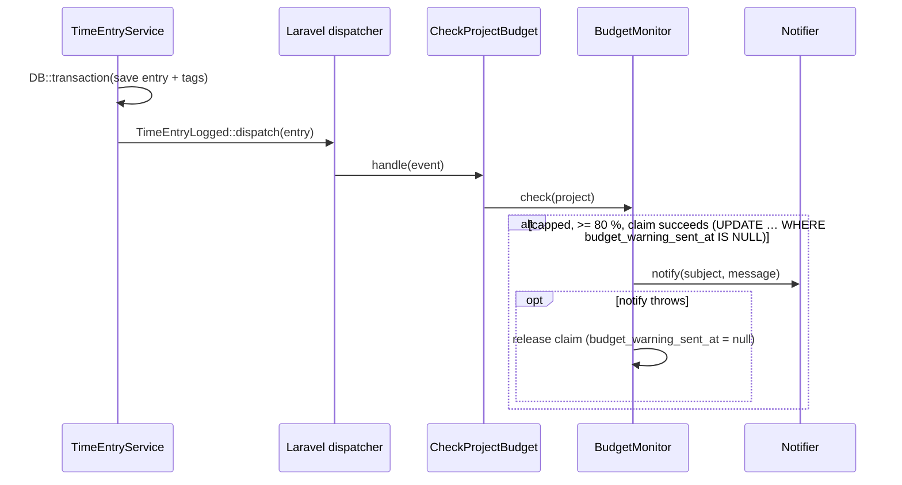

# 09 — Patterns II: Observer, Adapter, Decorator · Laravel

[← Concepts](README.md) · Starting point: end of lesson 08 · Estimated time in class: 2 h

---

## What we build today

- **Mailpit** in `compose.yaml`, so emails sent in development appear in a web page instead of in
  somebody's real inbox.
- A migration that adds `projects.budget_warning_sent_at`.
- `config/billable.php` with the owner's email address and the notifier choice.
- The **Adapter**: `App\Contracts\Notifier` with `App\Notifiers\LogNotifier` and
  `App\Notifiers\MailNotifier`, bound in `AppServiceProvider`.
- The **Observer**: event `App\Events\TimeEntryLogged`, dispatched by `TimeEntryService`, and listener
  `App\Listeners\CheckProjectBudget`.
- `App\Services\BudgetMonitor`, which implements R9: warn the owner **once** when a capped project
  reaches 80 % of its cap — safe even when two requests arrive at the same moment.

**Final result:** you log time on a capped project. As soon as the project's hourly value reaches 80 % of
the cap, an email "Budget warning: …" appears in Mailpit at `http://localhost:8025`. Logging more time
does not send a second email.

---

## Step 1 — Run Mailpit next to PostgreSQL

**Why:** we want to see real emails without sending them to real people. Mailpit is a small SMTP server
for development. It accepts every email on port **1025** and shows it in a web interface on port
**8025**. Nothing leaves your computer.

Open `compose.yaml` in the project root and add the `mailpit` service under `services:` (keep the
`postgres` service you already have):

```yaml
# compose.yaml
services:
  postgres:
    image: postgres:17
    environment:
      POSTGRES_DB: billable
      POSTGRES_USER: billable
      POSTGRES_PASSWORD: secret
    ports:
      - "5432:5432"
    volumes:
      - postgres-data:/var/lib/postgresql/data

  mailpit:
    image: axllent/mailpit
    ports:
      - "1025:1025" # SMTP: the application sends mail here
      - "8025:8025" # Web UI: you read the mail here

volumes:
  postgres-data:
```

Your `postgres` service may look slightly different (volume name, health check). Do not change it —
only add the `mailpit` block.

Start it:

```bash
docker compose up -d
```

**What happens:**

1. Docker downloads the `axllent/mailpit` image the first time (a few seconds).
2. It starts a container and connects container port 1025 to port 1025 on your computer, and the same
   for 8025.
3. PostgreSQL is already running, so Docker leaves it alone.

Now tell Laravel to send mail over SMTP to Mailpit. Open `.env` and change the `MAIL_` lines:

```dotenv
# .env
MAIL_MAILER=smtp
MAIL_SCHEME=null
MAIL_HOST=127.0.0.1
MAIL_PORT=1025
MAIL_USERNAME=null
MAIL_PASSWORD=null
MAIL_FROM_ADDRESS="billable@example.test"
MAIL_FROM_NAME="${APP_NAME}"
```

A fresh Laravel project has `MAIL_MAILER=log`, which writes emails into `storage/logs/laravel.log`.
`smtp` sends them to a real SMTP server — here, Mailpit. Copy the same lines into `.env.example` so a
classmate who clones your project gets the same setup.

**Check it works:** open `http://localhost:8025`. You see the Mailpit inbox with no messages.
`docker compose ps` lists both `postgres` and `mailpit` as running.

**Commit:** `chore(dev): add Mailpit to compose.yaml`

---

## Step 2 — Migration: `budget_warning_sent_at`

**Why:** R9 says "warn **once**". To know whether we already warned, we must remember it. A nullable
timestamp does two jobs: `null` means "not warned yet", a value means "warned, and this is when".

```bash
php artisan make:migration add_budget_warning_sent_at_to_projects_table --table=projects
```

Replace the generated file's content:

```php
<?php

// database/migrations/xxxx_xx_xx_xxxxxx_add_budget_warning_sent_at_to_projects_table.php

use Illuminate\Database\Migrations\Migration;
use Illuminate\Database\Schema\Blueprint;
use Illuminate\Support\Facades\Schema;

return new class extends Migration
{
    public function up(): void
    {
        Schema::table('projects', function (Blueprint $table) {
            $table->timestamp('budget_warning_sent_at')->nullable()->after('archived_at');
        });
    }

    public function down(): void
    {
        Schema::table('projects', function (Blueprint $table) {
            $table->dropColumn('budget_warning_sent_at');
        });
    }
};
```

**What happens:**

1. `--table=projects` makes Artisan generate a `Schema::table()` (change an existing table) instead of
   `Schema::create()`.
2. `timestamp(...)->nullable()` creates a `timestamp(0) without time zone` column in PostgreSQL that
   may be empty.
3. `after('archived_at')` is only honoured by MySQL; PostgreSQL always adds the column at the end. It
   does no harm, and it documents where the column belongs.
4. `down()` removes the column, so `php artisan migrate:rollback` works.

Run it:

```bash
php artisan migrate
```

Now tell the model that this column is a date. In `app/Models/Project.php`, add the new key to the
`casts()` method you already have (keep your existing casts):

```php
// app/Models/Project.php  — inside the class
protected function casts(): array
{
    return [
        'billing_type' => BillingType::class,
        'archived_at' => 'datetime',
        'budget_warning_sent_at' => 'datetime',
    ];
}
```

We do **not** add `budget_warning_sent_at` to `$fillable`. Users must never set it through a form; only
`BudgetMonitor` sets it, with a query-builder `update()` (Step 9), which does not use `$fillable`.

**Check it works:**

```bash
php artisan tinker
> App\Models\Project::first()->budget_warning_sent_at
= null
```

**Commit:** `feat(projects): add budget_warning_sent_at column`

---

## Step 3 — Configuration: owner email and notifier choice

**Why:** the owner's email address and "mail or log?" are *settings*, not code. They differ between
your laptop, the teacher's laptop and production. Settings live in `.env` and are read through a config
file. Code reads `config('billable.…')`, never `env()` directly — after `php artisan config:cache`,
`env()` returns `null` outside config files.

If you already have `config/billable.php` from an earlier lesson, add the two keys. Otherwise create the
file:

```php
<?php

// config/billable.php

return [

    // Who receives budget warnings and other notifications.
    'owner_email' => env('BILLABLE_OWNER_EMAIL', 'owner@example.test'),

    // Which Notifier implementation to use: "mail" or "log".
    'notifier' => env('BILLABLE_NOTIFIER', 'mail'),

];
```

Add to `.env` and `.env.example`:

```dotenv
# .env
BILLABLE_OWNER_EMAIL=owner@example.test
BILLABLE_NOTIFIER=mail
```

**Check it works:**

```bash
php artisan tinker
> config('billable.notifier')
= "mail"
```

---

## Step 4 — The `Notifier` interface

**Why:** this is the heart of the Adapter pattern. The domain (`BudgetMonitor`) will depend on this
interface only. It uses Billable's words — *subject* and *message* — and nothing from the mail system.

```php
<?php

// app/Contracts/Notifier.php

namespace App\Contracts;

/**
 * Sends a short notification to the owner of this Billable installation.
 *
 * Implementations decide HOW (email, log file, chat). Callers only decide WHAT.
 */
interface Notifier
{
    public function notify(string $subject, string $message): void;
}
```

**What happens:** nothing runs yet. We have defined a contract: "anything that is a `Notifier` can take
a subject and a message". `App\Contracts` is Laravel's usual namespace for our own interfaces (Laravel's
own interfaces live in `Illuminate\Contracts`).

---

## Step 5 — Two implementations: `LogNotifier` and `MailNotifier`

**Why:** two implementations prove that the interface is really independent of the mail system. The
log version is also useful when you are offline or do not want Docker running.

```php
<?php

// app/Notifiers/LogNotifier.php

namespace App\Notifiers;

use App\Contracts\Notifier;
use Psr\Log\LoggerInterface;

/**
 * Writes notifications to the application log instead of sending them.
 */
final class LogNotifier implements Notifier
{
    public function __construct(private LoggerInterface $logger) {}

    public function notify(string $subject, string $message): void
    {
        $this->logger->info('Notification: '.$subject, ['message' => $message]);
    }
}
```

```php
<?php

// app/Notifiers/MailNotifier.php

namespace App\Notifiers;

use App\Contracts\Notifier;
use Illuminate\Container\Attributes\Config;
use Illuminate\Mail\Message;
use Illuminate\Support\Facades\Mail;

/**
 * Adapter: turns Billable's notify(subject, message) into a plain-text email
 * sent with Laravel's Mail facade.
 */
final class MailNotifier implements Notifier
{
    public function __construct(
        #[Config('billable.owner_email')] private string $ownerEmail,
    ) {}

    public function notify(string $subject, string $message): void
    {
        Mail::raw($message, function (Message $mail) use ($subject): void {
            $mail->to($this->ownerEmail)->subject($subject);
        });
    }
}
```

**What happens:**

1. `LogNotifier` asks for a `Psr\Log\LoggerInterface`. PSR-3 is the PHP standard logger interface;
   Laravel's container knows how to build it (it is Laravel's log manager). We inject it instead of using
   the `Log` facade so the dependency is visible in the constructor.
2. `MailNotifier` receives the owner's email as a plain `string`. The type alone does not tell the
   container *which* string, so the attribute `#[Config('billable.owner_email')]` does: when the
   container builds `MailNotifier`, it reads `config('billable.owner_email')` and passes that value.
   This is one of Laravel 12's *contextual attributes* (namespace `Illuminate\Container\Attributes`;
   others are `#[Log]`, `#[DB]`, `#[Storage]`). The class stays a plain PHP class: `new
   MailNotifier('someone@example.test')` still works, for example in a test.
3. `Mail::raw($text, $callback)` sends a plain-text email. The callback receives an
   `Illuminate\Mail\Message` on which we set the recipient and subject. The *from* address comes from
   `MAIL_FROM_ADDRESS`.
4. `MailNotifier` is the **only** class in Billable that knows the `Mail` facade exists. That is the
   point of the adapter: if you ever switch to an email API or a Slack webhook, you write a new
   `Notifier` class and change one line in the service provider.

> **Built-in alternative: Laravel Notifications.** Laravel has its own notification system:
> `Notification::route('mail', $ownerEmail)->notify(new BudgetWarning(...))` sends through mail, Slack,
> SMS and more, and `Notification::fake()` checks it in tests. In a real project you would often use it
> — wrapped behind our `Notifier` interface or instead of it. We write the adapter by hand because the
> point of this lesson is the pattern: *our* one-method interface, owned by the domain.

---

## Step 6 — Bind the interface in `AppServiceProvider`

**Why:** when `BudgetMonitor` asks for a `Notifier`, Laravel must know which class to give. An
interface cannot be instantiated, so we tell the container.

Open `app/Providers/AppServiceProvider.php` and add the binding to `register()` (keep anything that is
already there — lessons 07 and 08 needed no bindings, so `register()` is probably still empty):

```php
<?php

// app/Providers/AppServiceProvider.php

namespace App\Providers;

use App\Contracts\Notifier;
use App\Notifiers\LogNotifier;
use App\Notifiers\MailNotifier;
use Illuminate\Contracts\Foundation\Application;
use Illuminate\Database\Eloquent\Model;
use Illuminate\Pagination\Paginator;
use Illuminate\Support\ServiceProvider;
use InvalidArgumentException;

class AppServiceProvider extends ServiceProvider
{
    public function register(): void
    {
        // ... your existing bindings from lessons 07–08 stay here ...

        $this->app->bind(Notifier::class, function (Application $app): Notifier {
            return match (config('billable.notifier')) {
                'mail' => $app->make(MailNotifier::class),
                'log' => $app->make(LogNotifier::class),
                default => throw new InvalidArgumentException(
                    'Unknown billable.notifier: '.config('billable.notifier')
                ),
            };
        });
    }

    public function boot(): void
    {
        Model::shouldBeStrict(! $this->app->isProduction()); // lesson 06
        Paginator::defaultView('partials.pagination'); // lesson 04

        // ... the query-count logging from lesson 06 stays here, together with
        //     its private logQueryCountPerRequest() method and its DB/Log imports ...
    }
}
```

**What happens:**

1. `bind(Notifier::class, closure)` registers a *factory*: every time something asks for a `Notifier`,
   Laravel calls the closure and uses what it returns.
2. `match` reads the setting and asks the container for the chosen class. The container fills the
   constructor for us: the owner's email for `MailNotifier` (through `#[Config]`), the logger for
   `LogNotifier`. The provider only decides *which* class; each class says what it needs.
3. An unknown value (a typo like `BILLABLE_NOTIFIER=mial`) fails loudly with a clear message instead of
   silently sending nothing.
4. Why `bind` and not `singleton`? Both would work, because the notifiers are stateless. `bind` creates
   a new object each time; the cost is tiny and tests that change the config get the right class.
5. `boot()` is the same as after lesson 06 (strict mode, pagination view, query-count logging). It is
   shown so you can compare your whole file.

**Check it works:** send a test notification from Tinker.

```bash
php artisan tinker
> app(App\Contracts\Notifier::class)->notify('Hello from Tinker', 'If you can read this, the adapter works.');
= null
```

Open `http://localhost:8025`. You see one email from `billable@example.test` to `owner@example.test`
with the subject "Hello from Tinker".

Now change `.env` to `BILLABLE_NOTIFIER=log`, restart Tinker (it reads `.env` once at start) and repeat.
No new email appears; instead the last line of `storage/logs/laravel.log` is:

```
[2026-10-05 18:12:40] local.INFO: Notification: Hello from Tinker {"message":"If you can read this, the adapter works."}
```

Set it back to `mail`.

**Commit:** `feat(notification): add Notifier adapter with mail and log implementations`

---

## Step 7 — The event: `TimeEntryLogged`

**Why:** the event object is the message "a time entry was logged". The publisher creates it; any number
of listeners can react.

```bash
php artisan make:event TimeEntryLogged
```

Replace the generated file (the stub contains broadcasting code we do not need):

```php
<?php

// app/Events/TimeEntryLogged.php

namespace App\Events;

use App\Models\TimeEntry;
use Illuminate\Contracts\Events\ShouldDispatchAfterCommit;
use Illuminate\Foundation\Events\Dispatchable;

/**
 * A time entry has been saved. Dispatched by TimeEntryService.
 */
class TimeEntryLogged implements ShouldDispatchAfterCommit
{
    use Dispatchable;

    public function __construct(public TimeEntry $timeEntry) {}
}
```

**What happens:**

1. The class is a plain data holder: it carries the new `TimeEntry`. Listeners read
   `$event->timeEntry`.
2. `use Dispatchable` adds the static helper `TimeEntryLogged::dispatch(...)`, which creates the event
   with the given arguments and hands it to the dispatcher.
3. `implements ShouldDispatchAfterCommit` tells Laravel: *if a database transaction is open when this
   event is dispatched, wait until it commits; if it rolls back, drop the event.* If no transaction is
   open, the event is dispatched immediately. This is our safety net for the "after commit" rule from
   the concepts page.
4. The name is past tense — a fact, not an instruction.

---

## Step 8 — Dispatch the event from `TimeEntryService`

**Why:** the publisher announces what happened. This is the **only** change to `TimeEntryService` in
this lesson — no budget logic, no mail.

Open `app/Services/TimeEntryService.php`. In lesson 07, `log()` did all its work inside
`DB::transaction(...)` and returned the result directly. We now keep that result in `$entry`, dispatch
the event **after** the transaction has returned, and then return the entry. The changed lines are
marked `NEW`; everything inside the closure stays exactly as you have it (including the "not in the
future" check if you did the lesson 07 intermediate task):

```php
// app/Services/TimeEntryService.php — add the use line at the top and replace log()

use App\Events\TimeEntryLogged; // NEW

    /**
     * Log a new time entry.
     *
     * @param  array<string, mixed>  $data  validated input: project_id, started_at, ended_at,
     *                                      description, billable, tags (list of tag ids, optional)
     *
     * @throws ProjectArchivedException when the project no longer accepts time
     */
    public function log(array $data): TimeEntry
    {
        $entry = DB::transaction(function () use ($data): TimeEntry { // NEW: keep the result
            $project = Project::query()->findOrFail($data['project_id']);

            if ($project->isArchived()) {
                throw ProjectArchivedException::for($project);
            }

            // (lesson 07 intermediate: the "ends in the future" check stays here)

            $entry = TimeEntry::create(Arr::except($data, ['tags']));
            $entry->tags()->sync($data['tags'] ?? []);

            return $entry;
        });

        TimeEntryLogged::dispatch($entry); // NEW — the transaction has committed

        return $entry; // NEW
    }
```

**What happens:**

1. `DB::transaction(...)` runs the closure, commits, and returns what the closure returned — the new
   entry.
2. Only then do we dispatch `TimeEntryLogged`. At this point the entry and its tags are definitely in
   the database. If the closure throws `ProjectArchivedException`, the transaction rolls back, the
   exception leaves `log()`, and the dispatch line is never reached — no event for time that was not
   logged.
3. Why also `ShouldDispatchAfterCommit` on the event? Because someone might later call `log()` from
   inside *another* transaction (for example a CSV import that wraps many entries in one transaction).
   Then our dispatch line runs while the outer transaction is still open, and the interface makes
   Laravel wait for the outer commit.
4. `TimeEntryService` still knows nothing about budgets or email. It knows that an event class exists.

**Check it works:** log a time entry through the time sheet form. Nothing visible changes yet — there
is no listener. That is the point: the publisher works with zero listeners.

---

## Step 9 — `BudgetMonitor`: the rule R9 in one class

**Why:** the budget rule needs a home that is not the time-entry service and not the listener. A
listener should be a thin connector ("when X happens, call Y"), just like a controller is a thin
connector for HTTP. The rule itself goes in a service that can be tested and reused.

The monitor needs the project's billable minutes. Lesson 08 already calculates them inside
`ProjectService::billableSummary()`. Copying that query into `BudgetMonitor` would be the
**copy-paste** anti-pattern (see the concepts page): two versions of one rule that slowly drift apart.
So first we extract it into its own public method, and let `billableSummary()` call it:

```php
// app/Services/ProjectService.php — add billableMinutes() and let billableSummary() use it

    /**
     * Billable minutes of a project so far. Used by the project page and by BudgetMonitor,
     * so both always agree. (Lesson 10 adds per-entry rounding here.)
     */
    public function billableMinutes(Project $project): int
    {
        return (int) $project->timeEntries()
            ->where('billable', true)
            ->get()
            ->sum(fn (TimeEntry $entry): int => $entry->durationMinutes());
    }

    public function billableSummary(Project $project): BillableSummary
    {
        $minutes = $this->billableMinutes($project);

        $cents = $this->billing->forProject($project)->calculate($project, $minutes, 0);

        return new BillableSummary($minutes, $cents);
    }
```

(If you did the lesson 08 intermediate task, keep your `BillableEntriesQuery` inside
`billableMinutes()` — only the place of the code changes.)

Now the monitor:

```php
<?php

// app/Services/BudgetMonitor.php

namespace App\Services;

use App\Billing\HourlyBilling;
use App\Contracts\Notifier;
use App\Enums\BillingType;
use App\Models\Project;
use Throwable;

/**
 * R9: when a capped project's value reaches 80 % of its cap, warn the owner once.
 */
class BudgetMonitor
{
    public const WARNING_THRESHOLD_PERCENT = 80;

    public function __construct(
        private readonly Notifier $notifier,
        private readonly HourlyBilling $hourlyBilling,
        private readonly ProjectService $projects,
    ) {}

    public function check(Project $project): void
    {
        if ($project->billing_type !== BillingType::Capped) {
            return; // only capped projects have a budget to watch
        }

        if ($project->budget_warning_sent_at !== null) {
            return; // R9: once (a quick check; the claim below is the real guard)
        }

        $capCents = (int) $project->budget_cap_cents;
        if ($capCents <= 0) {
            return; // no meaningful cap — nothing to compare against
        }

        // The UNCAPPED value: what the work would cost at the hourly rate.
        $minutes = $this->projects->billableMinutes($project);
        $valueCents = $this->hourlyBilling->calculate($project, $minutes, 0);

        // value / cap >= 80 / 100, rewritten without division: value * 100 >= cap * 80
        if ($valueCents * 100 < $capCents * self::WARNING_THRESHOLD_PERCENT) {
            return;
        }

        if (! $this->claimWarning($project)) {
            return; // another request has already claimed (and sent) this warning
        }

        try {
            $this->notifier->notify(
                "Budget warning: {$project->name}",
                sprintf(
                    'Project "%s" has reached %d %% of its budget cap: %s of %s.',
                    $project->name,
                    intdiv($valueCents * 100, $capCents),
                    euros($valueCents),
                    euros($capCents),
                ),
            );
        } catch (Throwable $e) {
            $this->releaseWarning($project); // nobody was warned: let a later entry try again
            throw $e;
        }
    }

    /**
     * Set budget_warning_sent_at, but only if it is still empty in the database.
     * Returns true for exactly one caller, even when two requests run at the same moment.
     */
    private function claimWarning(Project $project): bool
    {
        $claimed = Project::query()
            ->whereKey($project->id)
            ->whereNull('budget_warning_sent_at')
            ->update(['budget_warning_sent_at' => now()]);

        return $claimed === 1;
    }

    private function releaseWarning(Project $project): void
    {
        Project::query()
            ->whereKey($project->id)
            ->update(['budget_warning_sent_at' => null]);
    }
}
```

**What happens:**

1. Three **guard clauses** at the top return early for the cases where nothing should happen: not
   capped, already warned, no cap. The happy path is not nested inside `if` blocks.
2. The minutes come from `ProjectService::billableMinutes()` — the same method the project page uses.
   The warning and the page can never disagree.
3. We reuse `HourlyBilling` from lesson 08 to compute the *uncapped* hourly value.
   `CappedHourlyBilling` would never go above the cap, so it cannot tell us "you are at 120 %". We pass
   `0` as "already billed" because `HourlyBilling` ignores it anyway.
4. The comparison uses **only integers**. `$valueCents / $capCents >= 0.8` would bring floats into
   money code (lesson 10 shows why that fails at boundaries). Multiplying both sides by 100 keeps the
   same meaning with exact arithmetic.
5. `WARNING_THRESHOLD_PERCENT` is a named constant instead of a bare `80` — see "magic numbers" in the
   anti-pattern table.
6. `claimWarning()` **claims** the warning before anything is sent: one `UPDATE … SET
   budget_warning_sent_at = now() WHERE id = ? AND budget_warning_sent_at IS NULL`. `update()` on a query
   returns the number of changed rows. `1` means "this call set the timestamp, so this call sends";
   `0` means somebody else set it first. (The Eloquent query also sets `updated_at`, as a model save
   would.)
7. `notify()` is called on the **interface**. `BudgetMonitor` does not know whether this sends mail,
   writes a log line or posts to Slack.
8. If `notify()` throws, `releaseWarning()` sets the timestamp back to `null` and `throw $e;` passes the
   same exception on. Nobody received the warning, so the next logged entry must be able to try again.
9. `now()` returns a Carbon date that tests can freeze with `$this->travelTo(...)` (lesson 12).
10. `euros()` is the formatting helper from lesson 04. Lesson 10 replaces its inside with `Money`.
11. There is no dependency cycle: `ProjectService` depends on the billing resolver, not on
   `BudgetMonitor`.

**Why claim → notify → release on failure.** "Warn once" has two ways to go wrong:

- **Two warnings.** Two entries for the same project are saved at the same moment. If the code only
  *read* `budget_warning_sent_at` and saved it after sending, both requests could read `null` and both
  could send. The conditional `UPDATE` lets the database pick one winner: PostgreSQL changes the row for
  the first request, and the second request's `WHERE … IS NULL` no longer matches, so it gets `0` and
  stops. The check at the top of `check()` only saves work; the claim is what makes "once" safe.
- **No warning at all.** If we marked the warning as sent and the mail server was down, the owner would
  never hear about it. So a failed `notify()` releases the claim, and the next logged entry tries again.

The order matters: claim first, so only one request can reach `notify()`; release only when
`notify()` failed. One rare case is left: the mail server accepts the email but `notify()` still throws
(for example a timeout while waiting for the answer). Then the claim is released and a later entry may
send a second email. That is the price of the retry, and a second warning is better than none.
Lesson 14 looks at races like this in detail.

---

## Step 10 — The listener: `CheckProjectBudget`

**Why:** the listener connects the event to the monitor. It is the subscriber in the Observer pattern.

```bash
php artisan make:listener CheckProjectBudget --event=TimeEntryLogged
```

Replace the generated file:

```php
<?php

// app/Listeners/CheckProjectBudget.php

namespace App\Listeners;

use App\Events\TimeEntryLogged;
use App\Services\BudgetMonitor;

/**
 * When a time entry is logged, check whether its project needs a budget warning.
 */
class CheckProjectBudget
{
    public function __construct(private BudgetMonitor $monitor) {}

    public function handle(TimeEntryLogged $event): void
    {
        // The time entry is already saved. A failed warning must not turn
        // the user's successful save into an error page.
        rescue(fn () => $this->monitor->check($event->timeEntry->project));
    }
}
```

**What happens:**

1. **Auto-discovery.** Since Laravel 11, Laravel scans `app/Listeners`. Every public `handle()` method
   whose first parameter is type-hinted with an event class is registered as a listener for that
   event. You do **not** write `Event::listen(...)` anywhere.
2. The constructor asks for `BudgetMonitor`; the container builds it, and for `BudgetMonitor` it builds
   the `Notifier` through our binding from Step 6.
3. `$event->timeEntry->project` loads the project of the new entry (one query).
4. The listener is synchronous: it runs inside the same HTTP request, right after the dispatch.
5. `rescue()` is Laravel's helper for "try, and if it throws, report and carry on". It is the same as
   `try { ... } catch (Throwable $e) { report($e); }`. This is a deliberate choice. The entry was
   committed before the event ran. If Mailpit is not running, `check()` throws. Without `rescue()`, the
   user would see an error page although the entry was saved — and would probably submit the form
   again, creating a duplicate. Reporting writes the exception to the log (and to an error tracker if
   you have one), so the problem is not hidden.

**Check it works:**

```bash
php artisan event:list
```

Among Laravel's own events you see:

```
  App\Events\TimeEntryLogged ................................................
  ⇂ App\Listeners\CheckProjectBudget@handle
```

If it appears twice, you registered it manually somewhere as well — remove the manual registration.

**Commit:** `feat(budget): warn owner when capped project reaches 80 % of cap`

---

## Step 11 — Try the whole flow

**Why:** we test the three important cases by hand: below 80 %, crossing 80 %, and above 80 % again.
Automatic tests follow in lesson 12.

Create a test project through your project form:

| Field | Value |
|---|---|
| Name | Budget demo |
| Billing type | Capped hourly |
| Hourly rate | 50,00 € (5000 cents) |
| Budget cap | 100,00 € (10000 cents) |
| Rounding | 1 minute |

80 % of 100 € is 80 €. At 50 €/h that is reached after 96 minutes.

1. Log a **60-minute** billable entry. Value: 50 €, which is 50 %. → **No email** in Mailpit.
2. Log another **60-minute** billable entry. Value: 100 €, which is 100 %. → **One email** appears:

   ```
   Subject: Budget warning: Budget demo
   Project "Budget demo" has reached 100 % of its budget cap: 100,00 € of 100,00 €.
   ```

   (`euros()` from lesson 04 formats the amounts.)
3. Log a **third** entry. → **No new email.** The timestamp is set, so R9 "once" holds.

Check the timestamp:

```bash
php artisan tinker
> App\Models\Project::where('name', 'Budget demo')->value('budget_warning_sent_at')
= "2026-10-05 18:31:02"
```

To repeat the demo, reset it in Tinker:

```bash
> App\Models\Project::where('name', 'Budget demo')->update(['budget_warning_sent_at' => null]);
```

(A query-builder `update()` ignores `$fillable`, which is why this works from Tinker — and why
`BudgetMonitor` can use it. Never pass form input to it: there `$fillable` is your protection.)

4. Log an entry on an **hourly** project. → No email, no error. The first guard clause returned early.
5. Stop Mailpit (`docker compose stop mailpit`), reset the timestamp and log an entry that crosses
   80 %. → The entry is saved, the page works, `storage/logs/laravel.log` contains a
   "Connection could not be established" error, and the timestamp is `null` again (claimed, then
   released). Start Mailpit again (`docker compose start mailpit`) and log one more entry → now the
   email arrives. This is "release on failure" working.

Run the formatter before you commit:

```bash
./vendor/bin/pint
```

**Commit:** `chore(budget): format` (only if Pint changed something)

---

## Troubleshooting

| Error or symptom | Cause | Fix |
|---|---|---|
| `Connection could not be established with host "127.0.0.1:1025"` | Mailpit is not running | `docker compose up -d mailpit`; check `docker compose ps` |
| No email and no error | `BILLABLE_NOTIFIER=log`, or `MAIL_MAILER=log` | Check `.env`; look in `storage/logs/laravel.log` |
| `.env` change has no effect | Config is cached, or Tinker/`serve` was started before the change | `php artisan config:clear`; restart `php artisan serve` and Tinker |
| `Target [App\Contracts\Notifier] is not instantiable.` | The binding in `AppServiceProvider::register()` is missing or has a typo in the class name | Add the binding from Step 6 |
| `Unknown billable.notifier: ...` | Typo in `BILLABLE_NOTIFIER` | Use `mail` or `log` |
| Two emails for one entry | The listener is registered twice (auto-discovery + a manual `Event::listen`) | Remove the manual registration; check `php artisan event:list` |
| Listener never runs, `event:list` does not show it | Events are cached from before (`php artisan event:cache` or `optimize`), or `handle()` has no type-hinted parameter | `php artisan event:clear`; make sure the signature is `handle(TimeEntryLogged $event)` |
| `Call to undefined function euros()` | Composer does not load `app/helpers.php` | Check the `files` entry in `composer.json` (lesson 04), run `composer dump-autoload` |
| `Target class [App\Services\ProjectService] ... Circular dependency` | `ProjectService` was given a `BudgetMonitor` parameter | Only `BudgetMonitor` depends on `ProjectService`, never the other way round |
| After a mail failure the warning never arrives, even when Mailpit is back | `budget_warning_sent_at` stayed set: the claim was not released | Keep the `try` / `catch` around `notify()` that calls `releaseWarning()`; reset the timestamp in Tinker (Step 11) |
| `Unresolvable dependency resolving [Parameter #0 [ <required> string $ownerEmail ]] in class App\Notifiers\MailNotifier` | `billable.owner_email` is `null`, or the `#[Config]` attribute or its `use` line is missing | Check `config/billable.php` and `.env`; check the attribute and `use Illuminate\Container\Attributes\Config;` |

---

## Recap

- `compose.yaml` — added the `mailpit` service; `.env` sends mail to `127.0.0.1:1025`.
- Migration — `projects.budget_warning_sent_at` (nullable timestamp); cast to `datetime` in `Project`.
- `config/billable.php` — `owner_email` and `notifier`.
- `App\Contracts\Notifier`, `App\Notifiers\LogNotifier`, `App\Notifiers\MailNotifier` — the Adapter;
  bound with `match` in `AppServiceProvider::register()`.
- `App\Events\TimeEntryLogged` — event object, `ShouldDispatchAfterCommit`.
- `TimeEntryService::log()` — keeps the transaction result and dispatches after commit.
- `ProjectService::billableMinutes()` — extracted from `billableSummary()`, shared with the monitor.
- `App\Listeners\CheckProjectBudget` — auto-discovered subscriber, catches and reports failures.
- `App\Services\BudgetMonitor` — R9 with guard clauses and an integer comparison; "once" through a
  conditional `UPDATE` that claims `budget_warning_sent_at` before notifying, released again if
  `notify()` throws.

---

## Independent work — solutions

<details>
<summary>Task 1 — docs/patterns.md: Observer and Adapter</summary>

Write the text in your own words; this is an example of the expected depth.

````markdown
## Observer — budget warning

**Problem.** When a time entry is logged, a capped project may need a budget warning (R9). The
time-entry service should not know about budgets or email, because those change for other reasons.

**Solution.** `TimeEntryService` dispatches a `TimeEntryLogged` event after the entry is committed.
`CheckProjectBudget` listens for it and calls `BudgetMonitor::check()`.

| Role | Class |
|---|---|
| Event | `app/Events/TimeEntryLogged.php` |
| Publisher | `app/Services/TimeEntryService.php` (`log()`) |
| Subscriber | `app/Listeners/CheckProjectBudget.php` |
| Rule | `app/Services/BudgetMonitor.php` |



**Drawback.** Reading `TimeEntryService` alone, you cannot see that logging time can send an email.
`php artisan event:list` shows the connection.

## Adapter — notifications

**Problem.** `BudgetMonitor` must warn the owner, but should not depend on Laravel's `Mail` facade:
we want to switch to logging locally, mock it in tests, and maybe use Slack later.

**Solution.** Our own interface `Notifier` with one method `notify(subject, message)`.
`MailNotifier` adapts it to `Mail::raw()`; `LogNotifier` writes to the log. `AppServiceProvider`
chooses one from `config('billable.notifier')`.

```mermaid
classDiagram
    class Notifier {
        <<interface>>
        +notify(string subject, string message) void
    }
    Notifier <|.. MailNotifier
    Notifier <|.. LogNotifier
    BudgetMonitor --> Notifier
    MailNotifier --> Mail : Mail::raw()
    LogNotifier --> LoggerInterface
```

**Drawback.** One more interface and two more classes for something the framework could do in one
line. It pays off only because we really do swap the implementation (config, tests).
````

**Commit:** `docs(patterns): describe Observer and Adapter`
</details>

<details>
<summary>Task 2 — reset the warning when the cap is raised</summary>

Put the rule in `ProjectService::update()` from lesson 07. There it was one line,
`$project->update($data)`, which fills *and* saves. We split it into `fill()` and `save()` so we can
compare the old and the new cap in between:

```php
// app/Services/ProjectService.php  — replace your update() method

/**
 * @param  array<string, mixed>  $data  validated data from UpdateProjectRequest
 */
public function update(Project $project, array $data): Project
{
    $project->fill($data);

    // A higher cap makes the old warning obsolete: allow a new one at 80 % of the new cap.
    if ($project->isDirty('budget_cap_cents')
        && (int) $project->budget_cap_cents > (int) $project->getOriginal('budget_cap_cents')) {
        $project->budget_warning_sent_at = null;
    }

    $project->save();

    return $project;
}
```

**What happens:**

1. `fill()` copies the validated form data into the model but does not save yet.
2. `isDirty('budget_cap_cents')` is `true` if the new value differs from the value loaded from the
   database. `getOriginal()` returns the old value.
3. Only an **increase** resets the timestamp. Lowering the cap keeps the warning — the owner already
   knows the budget is tight.
4. The `(int)` casts turn `null` into `0`, so a project that changes from hourly (no cap) to capped also
   counts as "cap increased". That is correct: it has never been warned about this cap.

**Check it works:** the demo project from Step 11 has three hours (150 €) and was warned. Edit the cap
to 200 €. In Tinker, `budget_warning_sent_at` is now `null`. 150 € is 75 % of the new cap, so nothing
happens yet. Log a fourth hour (200 €, 100 %) → a new warning in Mailpit.

**Commit:** `feat(projects): reset budget warning when cap is raised`
</details>

<details>
<summary>Task 3 — LoggingNotifier decorator</summary>

```php
<?php

// app/Notifiers/LoggingNotifier.php

namespace App\Notifiers;

use App\Contracts\Notifier;
use Psr\Log\LoggerInterface;

/**
 * Decorator: logs every notification, then passes it on to the wrapped notifier.
 */
final class LoggingNotifier implements Notifier
{
    public function __construct(
        private Notifier $inner,
        private LoggerInterface $logger,
    ) {}

    public function notify(string $subject, string $message): void
    {
        $this->logger->info('Sending notification: '.$subject, [
            'notifier' => $this->inner::class,
        ]);

        $this->inner->notify($subject, $message);
    }
}
```

Leave the existing `Notifier` binding exactly as it is. Below it in `AppServiceProvider::register()`, tell
the container to wrap whatever that binding produces:

```php
// app/Providers/AppServiceProvider.php — register(), below the Notifier binding
$this->app->extend(Notifier::class, function (Notifier $inner, Application $app): Notifier {
    return new LoggingNotifier($inner, $app->make(LoggerInterface::class));
});
```

Add `use App\Notifiers\LoggingNotifier;` and `use Psr\Log\LoggerInterface;` at the top.

**What happens:**

1. `BudgetMonitor` still asks for a `Notifier` and gets a `LoggingNotifier`. Its code did not change.
2. `LoggingNotifier` logs, then calls the real notifier. `$this->inner::class` records which one, which
   is handy when debugging configuration.
3. `extend()` is Laravel's built-in support for the Decorator pattern: the container first builds the
   service from the original binding (`MailNotifier` or `LogNotifier`), then passes it to your closure as
   `$inner` and hands out whatever the closure returns. The `match` binding does not know the decorator
   exists, and you can stack several `extend()` calls — each one wraps the previous result.
   We still write `new LoggingNotifier(...)`: if we asked the container for a `LoggingNotifier`, it would
   try to fill its `Notifier $inner` parameter by resolving `Notifier` — which is being built right now.
4. With `BILLABLE_NOTIFIER=log` you now get two log lines per notification: the decorator's and
   `LogNotifier`'s. That is correct behaviour and shows the chain clearly.

**Check it works:** reset the demo project's timestamp, cross 80 % again. `storage/logs/laravel.log`
contains `Sending notification: Budget warning: Budget demo {"notifier":"App\\Notifiers\\MailNotifier"}`
and the email is in Mailpit.

**Commit:** `feat(notification): add LoggingNotifier decorator`
</details>

<details>
<summary>Task 4 — anti-pattern hunt (example write-up)</summary>

Your two anti-patterns must come from your own code. Here are two that almost every Billable project
has at this point, with the expected write-up format.

**1. Magic strings — billing type compared as a string**

Before (`resources/views/projects/show.blade.php`):

```blade
@if ($project->billing_type->value === 'capped')
    <p>Cap: {{ euros($project->budget_cap_cents) }}</p>
@endif
```

After — a small method on the model (a step away from an anemic model):

```php
// app/Models/Project.php
public function isCapped(): bool
{
    return $this->billing_type === BillingType::Capped;
}
```

```blade
@if ($project->isCapped())
    <p>Cap: {{ euros($project->budget_cap_cents) }}</p>
@endif
```

Why it is better: a typo in `'caped'` is silently false forever; a typo in `isCaped()` is an error on
the first page load. The meaning ("is this a capped project?") has a name, and `BudgetMonitor` can use
the same method.

**2. Service locator — resolving from the container inside a method**

Before (a shortcut often found in helpers, listeners or console commands, e.g.
`app/Console/Commands/ProjectReport.php`):

```php
public function handle(): void
{
    foreach (Project::all() as $project) {
        $summary = app(ProjectService::class)->billableSummary($project);
        $this->line($project->name.': '.euros($summary->cents));
    }
}
```

After:

```php
public function handle(ProjectService $projects): void
{
    foreach (Project::all() as $project) {
        $summary = $projects->billableSummary($project);
        $this->line($project->name.': '.euros($summary->cents));
    }
}
```

(Artisan commands receive dependencies as `handle()` parameters; controllers and services through the
constructor, as in lesson 07.)

Why it is better: the dependency is visible in the method signature, and a test can pass its own
`ProjectService` without touching the global container.

Put each case in `docs/patterns.md` under a heading `## Anti-pattern: <name>` with the file path, the
before and after excerpts and the "why" paragraph.

**Commits:** `refactor(projects): replace billing type string with isCapped()` and
`refactor(reports): inject ProjectService instead of app()`
</details>
