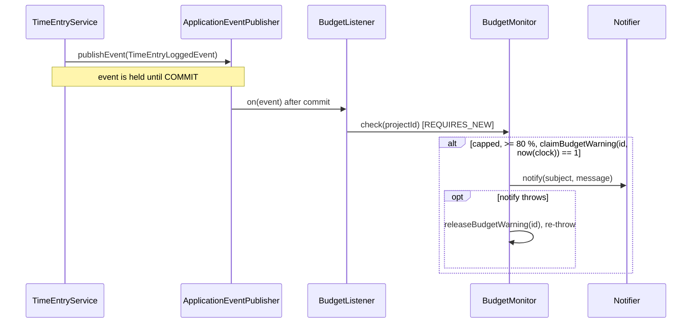
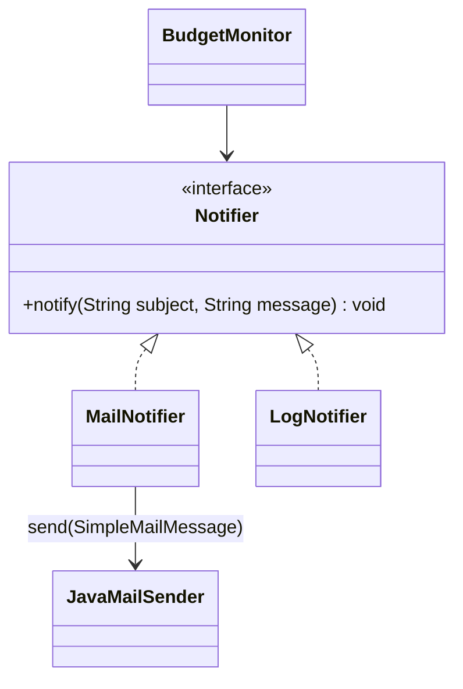

# 09 — Patterns II: Observer, Adapter, Decorator · Spring Boot

[← Concepts](README.md) · Starting point: end of lesson 08 · Estimated time in class: 2 h

---

## What we build today

- **Mailpit** in `compose.yaml` and the mail starter in `pom.xml`, so emails sent in development appear
  in a web page instead of somebody's real inbox.
- A Flyway migration that adds `projects.budget_warning_sent_at`.
- `common.ClockConfig` with a `Clock` bean (if you do not have it yet).
- `common.BillableProperties` — one validated record for all `billable.*` settings.
- The **Adapter**: `notification.Notifier` with `notification.LogNotifier` and
  `notification.MailNotifier`; `notification.NotifierConfig` picks one from the setting
  `billable.notifier`.
- The **Observer**: `budget.TimeEntryLoggedEvent`, published by `TimeEntryService`, and
  `budget.BudgetListener` with `@TransactionalEventListener(phase = AFTER_COMMIT)`.
- `budget.BudgetMonitor`, which implements R9: warn the owner **once** when a capped project reaches
  80 % of its cap.

**Final result:** you log time on a capped project. As soon as the project's hourly value reaches 80 % of
the cap, an email "Budget warning: …" appears in Mailpit at `http://localhost:8025`. Logging more time
does not send a second email.

---

## Step 1 — Mailpit and the mail starter

**Why:** we want to see real emails without sending them to real people. Mailpit is a small SMTP server
for development. It accepts every email on port **1025** and shows it in a web interface on port
**8025**. Nothing leaves your computer.

Open `compose.yaml` in the project root and add the `mailpit` service under `services:` (keep your
`postgres` service as it is):

```yaml
# compose.yaml
services:
  postgres:
    image: postgres:17
    environment:
      POSTGRES_DB: billable
      POSTGRES_USER: billable
      POSTGRES_PASSWORD: secret
    ports:
      - "5432:5432"
    volumes:
      - pgdata:/var/lib/postgresql/data
    healthcheck:
      test: ["CMD-SHELL", "pg_isready -U billable -d billable"]
      interval: 5s
      timeout: 5s
      retries: 10

  mailpit:
    image: axllent/mailpit
    ports:
      - "1025:1025" # SMTP: the application sends mail here
      - "8025:8025" # Web UI: you read the mail here

volumes:
  pgdata:
```

Now add the mail starter to `pom.xml`, inside `<dependencies>`. Do not write a version — the Spring Boot
parent manages it:

```xml
<!-- pom.xml — inside <dependencies> -->
<dependency>
  <groupId>org.springframework.boot</groupId>
  <artifactId>spring-boot-starter-mail</artifactId>
</dependency>
```

Add these lines to `src/main/resources/application.properties`:

```properties
# src/main/resources/application.properties

# Mail goes to Mailpit (started from compose.yaml)
spring.mail.host=localhost
spring.mail.port=1025

# Billable settings
billable.owner-email=owner@example.test
billable.mail-from=billable@example.test
# Which Notifier to use: mail or log
billable.notifier=mail
```

**What happens:**

1. The **Docker Compose support** you added in lesson 01 starts *every* service in `compose.yaml` when
   the application starts. So Mailpit starts automatically with `./mvnw spring-boot:run`.
2. For PostgreSQL, Spring Boot also reads the connection details from the container. For Mailpit it
   does not, so we set `spring.mail.host` and `spring.mail.port` ourselves.
3. `spring-boot-starter-mail` brings Jakarta Mail and Spring's `JavaMailSender`. When
   `spring.mail.host` is set, Spring Boot auto-configures a `JavaMailSender` bean that talks SMTP to that
   host.
4. The `billable.*` keys are our own settings. Spring does not know them; in Step 5 we bind the whole
   group to one record, `BillableProperties`.

Reload Maven in your IDE (IntelliJ: the "Load Maven Changes" button), then start the application:

```bash
./mvnw spring-boot:run
```

**Check it works:** open `http://localhost:8025`. You see the Mailpit inbox with no messages.
`docker compose ps` lists both `postgres` and `mailpit` as running.

**Commit:** `chore(dev): add Mailpit and spring-boot-starter-mail`

---

## Step 2 — Migration: `budget_warning_sent_at`

**Why:** R9 says "warn **once**". To know whether we already warned, we must remember it. A nullable
timestamp does two jobs: `null` means "not warned yet", a value means "warned, and this is when".

Look in `src/main/resources/db/migration/` and find the highest version number. Use the next one. In
this guide it is `V5` (after `V1`–`V4` from lessons 03 and 06); yours may be different — **never** change or renumber a migration that has
already run.

```sql
-- src/main/resources/db/migration/V5__add_budget_warning_sent_at_to_projects.sql
ALTER TABLE projects
    ADD COLUMN budget_warning_sent_at TIMESTAMP NULL;
```

Now add the field to the entity. Open `project/Project.java` and add the field next to `archivedAt`,
plus a getter and setter:

```java
// src/main/java/ee/ta25/billable/project/Project.java  — inside the class

  @Column(name = "budget_warning_sent_at")
  private LocalDateTime budgetWarningSentAt;

  public LocalDateTime getBudgetWarningSentAt() {
    return budgetWarningSentAt;
  }

  public void setBudgetWarningSentAt(LocalDateTime budgetWarningSentAt) {
    this.budgetWarningSentAt = budgetWarningSentAt;
  }
```

**Same type as `archivedAt`.** Lesson 03 mapped `archived_at` (`TIMESTAMP`) to `LocalDateTime`; the
new column uses the same pair, so the whole table is consistent. With `ddl-auto=validate`, Hibernate
checks that the Java type and the column type match and refuses to start if they do not (see
Troubleshooting).

**What happens:**

1. At startup, Flyway sees a new script with a higher version, runs it, and records it in the
   `flyway_schema_history` table.
2. Hibernate then validates the entities against the tables. The new column and field match, so the
   application starts.

**Check it works:** start the application. The log contains a line like
`Migrating schema "public" to version "5 - add budget warning sent at to projects"`.

**Commit:** `feat(projects): add budget_warning_sent_at column`

---

## Step 3 — A `Clock` bean

**Why:** `BudgetMonitor` records *when* it sent the warning. If it calls `LocalDateTime.now()`, a test
can never control that value. With an injected `java.time.Clock`, production code uses the real clock
and tests use `Clock.fixed(...)` (lesson 12).

If you did the lesson 07 intermediate task, `common.ClockConfig` already exists — skip this step.
Otherwise create it exactly as in lesson 07:

```java
// src/main/java/ee/ta25/billable/common/ClockConfig.java
package ee.ta25.billable.common;

import java.time.Clock;
import org.springframework.context.annotation.Bean;
import org.springframework.context.annotation.Configuration;

@Configuration
public class ClockConfig {

  /** The real clock in the JVM's default time zone (Europe/Tallinn on our machines). */
  @Bean
  public Clock clock() {
    return Clock.systemDefaultZone();
  }
}
```

**What happens:** `@Configuration` marks a class with bean factory methods. `@Bean` tells Spring:
"call this method once and register the result as a bean". Any constructor that asks for a `Clock` now
receives this one. `LocalDateTime.now(clock)` returns the current local time. (Lesson 10 makes the
time zone explicit.)

---

## Step 4 — The `Notifier` interface

**Why:** this is the heart of the Adapter pattern. The domain (`BudgetMonitor`) will depend on this
interface only. It uses Billable's words — *subject* and *message* — and nothing from the mail library.

```java
// src/main/java/ee/ta25/billable/notification/Notifier.java
package ee.ta25.billable.notification;

/**
 * Sends a short notification to the owner of this Billable installation.
 *
 * <p>Implementations decide HOW (email, log, chat). Callers only decide WHAT.
 */
public interface Notifier {

  void notify(String subject, String message);
}
```

**A note on the name.** `java.lang.Object` already has a method `notify()` with **no** parameters (it is
used for thread synchronisation). Ours has two `String` parameters, so it is a different method
(an *overload*) and completely legal. Your IDE will show both in autocomplete — pick the one with two
parameters.

---

## Step 5 — Settings, two implementations, one choice

**Why:** two implementations prove the interface does not depend on email. The log version is also
useful when you work offline. The setting `billable.notifier` chooses one, and `MailNotifier` needs the
two addresses from Step 1. Instead of reading each key with `@Value("${...}")` in the class that needs
it, we bind the whole `billable.*` group to **one record**. Spring checks it once at startup: a missing
address or a typo like `billable.notifier=mial` stops the application with a clear message.

First the possible values of `billable.notifier`, as an enum:

```java
// src/main/java/ee/ta25/billable/notification/NotifierType.java
package ee.ta25.billable.notification;

/** The values of the setting billable.notifier. */
public enum NotifierType {
  MAIL,
  LOG
}
```

Then the settings record:

```java
// src/main/java/ee/ta25/billable/common/BillableProperties.java
package ee.ta25.billable.common;

import ee.ta25.billable.notification.NotifierType;
import jakarta.validation.constraints.Email;
import jakarta.validation.constraints.NotBlank;
import org.springframework.boot.context.properties.ConfigurationProperties;
import org.springframework.boot.context.properties.bind.DefaultValue;
import org.springframework.validation.annotation.Validated;

/** All billable.* settings from application.properties, bound and checked once at startup. */
@Validated
@ConfigurationProperties("billable")
public record BillableProperties(
    @NotBlank @Email String ownerEmail,
    @NotBlank @Email String mailFrom,
    @DefaultValue("mail") NotifierType notifier) {}
```

Spring Boot only creates beans from `@ConfigurationProperties` classes it is told about. Add
`@ConfigurationPropertiesScan` to the application class from lesson 01:

```java
// src/main/java/ee/ta25/billable/BillableApplication.java
package ee.ta25.billable;

import org.springframework.boot.SpringApplication;
import org.springframework.boot.autoconfigure.SpringBootApplication;
import org.springframework.boot.context.properties.ConfigurationPropertiesScan;

@SpringBootApplication
@ConfigurationPropertiesScan // NEW: finds BillableProperties
public class BillableApplication {

  public static void main(String[] args) {
    SpringApplication.run(BillableApplication.class, args);
  }
}
```

Now the two implementations. They are **plain classes** — no `@Component`. One configuration class
below decides which one becomes the bean.

```java
// src/main/java/ee/ta25/billable/notification/LogNotifier.java
package ee.ta25.billable.notification;

import org.slf4j.Logger;
import org.slf4j.LoggerFactory;

/** Writes notifications to the application log instead of sending them. */
public class LogNotifier implements Notifier {

  private static final Logger log = LoggerFactory.getLogger(LogNotifier.class);

  @Override
  public void notify(String subject, String message) {
    log.info("Notification: {} — {}", subject, message);
  }
}
```

```java
// src/main/java/ee/ta25/billable/notification/MailNotifier.java
package ee.ta25.billable.notification;

import org.springframework.mail.SimpleMailMessage;
import org.springframework.mail.javamail.JavaMailSender;

/**
 * Adapter: turns Billable's notify(subject, message) into a plain-text email sent with Spring's
 * JavaMailSender.
 */
public class MailNotifier implements Notifier {

  private final JavaMailSender mailSender;
  private final String ownerEmail;
  private final String fromAddress;

  public MailNotifier(JavaMailSender mailSender, String ownerEmail, String fromAddress) {
    this.mailSender = mailSender;
    this.ownerEmail = ownerEmail;
    this.fromAddress = fromAddress;
  }

  @Override
  public void notify(String subject, String message) {
    var mail = new SimpleMailMessage();
    mail.setFrom(fromAddress);
    mail.setTo(ownerEmail);
    mail.setSubject(subject);
    mail.setText(message);
    mailSender.send(mail);
  }
}
```

Finally the one place that chooses:

```java
// src/main/java/ee/ta25/billable/notification/NotifierConfig.java
package ee.ta25.billable.notification;

import ee.ta25.billable.common.BillableProperties;
import org.springframework.beans.factory.ObjectProvider;
import org.springframework.context.annotation.Bean;
import org.springframework.context.annotation.Configuration;
import org.springframework.mail.javamail.JavaMailSender;

/** Creates the one Notifier bean, chosen by the setting billable.notifier. */
@Configuration
public class NotifierConfig {

  @Bean
  public Notifier notifier(BillableProperties settings, ObjectProvider<JavaMailSender> mailSender) {
    return switch (settings.notifier()) {
      case MAIL ->
          new MailNotifier(mailSender.getObject(), settings.ownerEmail(), settings.mailFrom());
      case LOG -> new LogNotifier();
    };
  }
}
```

**What happens:**

1. `@ConfigurationProperties("billable")` binds every key that starts with `billable.` to the record
   component of the same name. Spring Boot's *relaxed binding* turns the kebab-case key
   `billable.owner-email` into the component `ownerEmail`, and `billable.mail-from` into `mailFrom`.
   A record needs no setters: Spring calls its constructor with the bound values.
2. `billable.notifier=mail` becomes `NotifierType.MAIL`. Spring Boot converts text to an enum without
   caring about case, so `mail`, `MAIL` and `Mail` all work. `@DefaultValue("mail")` is used when the
   key is missing.
3. `@Validated` makes Spring run the Jakarta Validation constraints (lesson 05) on the record at
   startup. A missing or invalid address **stops the application** with a message that names the key;
   an unknown notifier value already fails while binding, because it is not an enum constant — see
   Troubleshooting. Wrong settings are found at startup, not when the first warning should go out.
4. `@ConfigurationPropertiesScan` finds `@ConfigurationProperties` classes in the application's package
   and below, and registers each one as a bean. Without it, `NotifierConfig` fails with "required a bean
   of type `BillableProperties` that could not be found". (The other way is
   `@EnableConfigurationProperties(BillableProperties.class)` on a `@Configuration` class.)
5. `NotifierConfig` is a `@Configuration` class with a `@Bean` method (like `ClockConfig`). Spring
   calls `notifier(...)` once and registers the result. So there is always exactly **one** `Notifier`
   bean, and constructor injection of `Notifier` is never ambiguous.
6. The `switch` has **no `default`**. A `switch` expression on an enum must cover every value, so the
   compiler checks that `MAIL` and `LOG` are both handled. Add `SLACK` to `NotifierType` later and this
   method stops compiling until you decide what `SLACK` means.
7. `ObjectProvider<JavaMailSender>` asks for the mail sender *lazily*: `getObject()` is only called in
   the `MAIL` branch. With `billable.notifier=log` the application starts even without `spring.mail.host`.
8. `MailNotifier` gets the `JavaMailSender` (auto-configured in Step 1) and the two addresses as plain
   constructor arguments. It does not know where they come from, so a test can call
   `new MailNotifier(sender, "a@example.test", "b@example.test")`.
9. `SimpleMailMessage` is Spring's plain-text email. `mailSender.send(...)` opens an SMTP connection to
   `localhost:1025` and hands the email to Mailpit.
10. `MailNotifier` is the **only** class in Billable that imports anything from `org.springframework.mail`
    (besides the wiring in `NotifierConfig`). Switching to an email API or Slack later means one new
    `Notifier` class, not changes in the domain.

**Why not `@Value`?** `@Value("${billable.owner-email}") String ownerEmail` in a constructor also works,
and you will see it a lot. But each class then reads its own keys as free text, nothing checks them as a
group, and a free-text notifier type is only compared with strings. One record gives one place that
lists every setting, with types and rules. Lesson 10 adds the VAT rate to the same record.

**Alternatives you will see at work.** Instead of one `@Bean` method, some teams put
`@ConditionalOnProperty(name = "billable.notifier", havingValue = "mail")` on each implementation, or
create both beans and mark the default with `@Primary`, or choose at the injection point with
`@Qualifier`. All work; the `@Bean` method keeps the choice in one readable place, and the compiler checks
it.

---

## Step 6 — Check the adapter with a temporary runner

**Why:** before wiring events, make sure one email really arrives. Spring has no Tinker, but a
`CommandLineRunner` bean runs once after startup — perfect for a quick check. We delete it afterwards.

```java
// src/main/java/ee/ta25/billable/notification/NotifierSmokeCheck.java  (TEMPORARY — delete after this step)
package ee.ta25.billable.notification;

import org.springframework.boot.CommandLineRunner;
import org.springframework.stereotype.Component;

@Component
class NotifierSmokeCheck implements CommandLineRunner {

  private final Notifier notifier;

  NotifierSmokeCheck(Notifier notifier) {
    this.notifier = notifier;
  }

  @Override
  public void run(String... args) {
    notifier.notify("Hello from Spring", "If you can read this, the adapter works.");
  }
}
```

**Check it works:** restart the application and open `http://localhost:8025`. You see one email from
`billable@example.test` to `owner@example.test` with the subject "Hello from Spring".

Now set `billable.notifier=log` and restart. No new email; instead the console shows:

```
INFO  ... e.t.billable.notification.LogNotifier : Notification: Hello from Spring — If you can read this, the adapter works.
```

Set it back to `mail` and **delete `NotifierSmokeCheck.java`** — otherwise you get an email on every
restart.

**Commit:** `feat(notification): add Notifier adapter with mail and log implementations`

---

## Step 7 — The event: `TimeEntryLoggedEvent`

**Why:** the event object is the message "a time entry was logged". Any number of listeners can react
to it.

```java
// src/main/java/ee/ta25/billable/budget/TimeEntryLoggedEvent.java
package ee.ta25.billable.budget;

/** A time entry has been saved for the given project. Published by TimeEntryService. */
public record TimeEntryLoggedEvent(Long projectId) {}
```

**What happens:**

1. Since Spring 4.2, **any object** can be an event — no need to extend `ApplicationEvent`. A record
   is ideal: immutable, with `equals`, `hashCode` and `toString` for free.
2. We carry only the **id**, not the `Project` entity. The listener runs after the transaction and
   loads a fresh copy in its own transaction. Passing a managed entity from one transaction to another
   invites `LazyInitializationException`.
3. The name is past tense — a fact, not an instruction.

---

## Step 8 — Publish the event from `TimeEntryService`

**Why:** the publisher announces what happened. This is the **only** change to `TimeEntryService`
today — no budget logic, no mail.

Open `timeentry/TimeEntryService.java`. Add an `ApplicationEventPublisher` to the fields and the
constructor, and publish the event at the end of `log()`. The new lines are marked `NEW`. The `Clock`
and the "not in the future" check are there if you did the lesson 07 intermediate task — keep them; if
you did not, your version simply has no `clock` field.

```java
// src/main/java/ee/ta25/billable/timeentry/TimeEntryService.java — imports, fields, constructor and log()

import ee.ta25.billable.budget.TimeEntryLoggedEvent; // NEW
import org.springframework.context.ApplicationEventPublisher; // NEW

  private final TimeEntryRepository timeEntries;
  private final ProjectRepository projects;
  private final TagRepository tags;
  private final Clock clock;
  private final ApplicationEventPublisher events; // NEW

  public TimeEntryService(
      TimeEntryRepository timeEntries,
      ProjectRepository projects,
      TagRepository tags,
      Clock clock,
      ApplicationEventPublisher events) { // NEW parameter
    this.timeEntries = timeEntries;
    this.projects = projects;
    this.tags = tags;
    this.clock = clock;
    this.events = events; // NEW
  }

  @Transactional
  public TimeEntry log(LogTimeEntryCommand command) {
    Project project =
        projects
            .findById(command.projectId())
            .orElseThrow(
                () -> new NotFoundException("Project " + command.projectId() + " not found"));

    if (project.isArchived()) {
      throw new ProjectArchivedException(project);
    }
    if (command.endedAt().isAfter(LocalDateTime.now(clock))) {
      throw new TimeEntryInFutureException(command.endedAt());
    }

    var entry =
        new TimeEntry(
            project,
            command.startedAt(),
            command.endedAt(),
            command.description(),
            command.billable());
    entry.getTags().addAll(tags.findAllById(command.tagIds()));
    TimeEntry saved = timeEntries.save(entry); // NEW: keep the result

    events.publishEvent(new TimeEntryLoggedEvent(project.getId())); // NEW

    return saved; // NEW
  }
```

**What happens:**

1. `ApplicationEventPublisher` is provided by Spring itself (the application context *is* a publisher).
   We inject it like any other dependency.
2. `publishEvent(...)` is called **inside** the `@Transactional` method, before the commit. That is
   fine: our listener will be a *transactional* event listener, so Spring holds the event until the
   transaction has committed (Step 10). If `ProjectArchivedException` is thrown, we never reach
   `publishEvent` — and even if we had, the rollback would discard the held event.
3. The class keeps its `@Transactional(readOnly = true)` from lesson 07; `log()` overrides it with a
   read-write `@Transactional`.
4. `TimeEntryService` still knows nothing about budgets or email.

**Check it works:** log a time entry through the time sheet. Nothing visible changes — there is no
listener yet. The publisher works with zero listeners.

---

## Step 9 — `BudgetMonitor`: the rule R9 in one class

**Why:** the budget rule needs a home that is not the time-entry service and not the listener. The
listener should be a thin connector, like a controller. The rule goes in a service that can be tested
alone.

The monitor needs the project's billable minutes. Lesson 08 already calculates them inside
`ProjectService.billableSummary()`. Copying that stream into `BudgetMonitor` would be the
**copy-paste** anti-pattern (see the concepts page). So first extract it into its own public method,
and let `billableSummary()` call it:

```java
// src/main/java/ee/ta25/billable/project/ProjectService.java — add billableMinutes(), change billableSummary()

  /**
   * Billable minutes of a project so far. Used by the project page and by BudgetMonitor, so both
   * always agree. (Lesson 10 adds per-entry rounding here.)
   */
  public long billableMinutes(Project project) {
    return timeEntries.findByProjectAndBillableTrue(project).stream()
        .mapToLong(TimeEntry::durationMinutes)
        .sum();
  }

  /**
   * Billable minutes and amount of all billable time; alreadyBilled is 0 here (the invoice generator
   * in lesson 13 works out billed amounts itself).
   */
  public BillableSummary billableSummary(Project project) {
    long minutes = billableMinutes(project);
    long cents = billing.forProject(project).calculate(project, minutes, 0);
    return new BillableSummary(minutes, cents);
  }
```

(If you did the lesson 08 intermediate task, keep `timeEntries.findBillable(project, null, null)` inside
`billableMinutes()` — only the place of the code changes.)

"Warn **once**" also needs help from the database. If the monitor first reads
`budget_warning_sent_at`, then sends, then sets it, two requests at the same moment can both read
`null` and both send. So we let the database decide in **one** statement who may send: an `UPDATE`
that only changes the row while the column is still empty. Add two methods to `ProjectRepository`:

```java
// src/main/java/ee/ta25/billable/project/ProjectRepository.java — add inside the interface
// (imports: java.time.LocalDateTime, org.springframework.data.jpa.repository.Modifying)

  /**
   * R9 "once": sets budget_warning_sent_at only if it is still empty, in one UPDATE. Returns 1 for
   * the caller that claimed the warning, 0 if it was already claimed.
   */
  @Modifying(flushAutomatically = true, clearAutomatically = true)
  @Query(
      """
      update Project p set p.budgetWarningSentAt = :now
      where p.id = :id and p.budgetWarningSentAt is null
      """)
  int claimBudgetWarning(@Param("id") long id, @Param("now") LocalDateTime now);

  /** Undoes a claim when the warning could not be sent, so a later check tries again. */
  @Modifying
  @Query("update Project p set p.budgetWarningSentAt = null where p.id = :id")
  int releaseBudgetWarning(@Param("id") long id);
```

Now the monitor:

```java
// src/main/java/ee/ta25/billable/budget/BudgetMonitor.java
package ee.ta25.billable.budget;

import ee.ta25.billable.billing.HourlyBilling;
import ee.ta25.billable.common.Formatters;
import ee.ta25.billable.notification.Notifier;
import ee.ta25.billable.project.BillingType;
import ee.ta25.billable.project.Project;
import ee.ta25.billable.project.ProjectRepository;
import ee.ta25.billable.project.ProjectService;
import java.time.Clock;
import java.time.LocalDateTime;
import org.springframework.stereotype.Service;
import org.springframework.transaction.annotation.Propagation;
import org.springframework.transaction.annotation.Transactional;

/** R9: when a capped project's value reaches 80 % of its cap, warn the owner once. */
@Service
public class BudgetMonitor {

  static final int WARNING_THRESHOLD_PERCENT = 80;

  private final ProjectRepository projects;
  private final ProjectService projectService;
  private final HourlyBilling hourlyBilling;
  private final Notifier notifier;
  private final Formatters formatters;
  private final Clock clock;

  public BudgetMonitor(
      ProjectRepository projects,
      ProjectService projectService,
      HourlyBilling hourlyBilling,
      Notifier notifier,
      Formatters formatters,
      Clock clock) {
    this.projects = projects;
    this.projectService = projectService;
    this.hourlyBilling = hourlyBilling;
    this.notifier = notifier;
    this.formatters = formatters;
    this.clock = clock;
  }

  @Transactional(propagation = Propagation.REQUIRES_NEW)
  public void check(long projectId) {
    Project project = projects.findById(projectId).orElseThrow();

    if (project.getBillingType() != BillingType.CAPPED) {
      return; // only capped projects have a budget to watch
    }
    if (project.getBudgetWarningSentAt() != null) {
      return; // R9: already warned (a quick check; the claim below is the safe one)
    }
    if (project.getBudgetCapCents() == null || project.getBudgetCapCents() <= 0) {
      return; // no meaningful cap
    }
    long capCents = project.getBudgetCapCents();

    // The UNCAPPED value: what the work would cost at the hourly rate.
    long minutes = projectService.billableMinutes(project);
    long valueCents = hourlyBilling.calculate(project, minutes, 0);

    // value / cap >= 80 / 100, rewritten without division: value * 100 >= cap * 80
    if (Math.multiplyExact(valueCents, 100)
        < Math.multiplyExact(capCents, WARNING_THRESHOLD_PERCENT)) {
      return;
    }

    // R9: claim the warning in the database first. Only one caller gets 1 back.
    if (projects.claimBudgetWarning(projectId, LocalDateTime.now(clock)) != 1) {
      return; // another request has already claimed it
    }
    try {
      notifier.notify(
          "Budget warning: " + project.getName(),
          "Project \"%s\" has reached %d %% of its budget cap: %s of %s."
              .formatted(
                  project.getName(),
                  valueCents * 100 / capCents,
                  formatters.euros(valueCents),
                  formatters.euros(capCents)));
    } catch (RuntimeException e) {
      projects.releaseBudgetWarning(projectId); // not sent, so not claimed: a later check retries
      throw e;
    }
  }
}
```

**What happens:**

1. **Guard clauses** at the top return early when nothing should happen: not capped, already warned,
   no cap. The happy path is not nested inside `if` blocks.
2. The minutes come from `ProjectService.billableMinutes()` — the same method the project page uses.
   The warning and the page can never disagree. There is no dependency cycle: `ProjectService` does not
   depend on `BudgetMonitor`.
3. We reuse `HourlyBilling` from lesson 08 (injected by its concrete class, exactly like
   `CappedHourlyBilling` does) to compute the *uncapped* value. `CappedHourlyBilling` never goes above
   the cap, so it cannot say "you are at 120 %". `0` is "already billed", which `HourlyBilling` ignores.
4. The comparison uses **only integers**. `(double) value / cap >= 0.8` would bring floating point into
   money code (lesson 10 shows why that fails at boundaries). `Math.multiplyExact` throws
   `ArithmeticException` on overflow instead of silently wrapping to a negative number.
5. `budget_cap_cents` is a `BIGINT` column mapped to a `Long` field (nullable, because only capped
   projects have a cap). `long capCents = project.getBudgetCapCents();` unboxes it to a primitive
   `long`. We checked for `null` first, because unboxing `null` throws `NullPointerException`.
6. **Claim, then notify.** `claimBudgetWarning(...)` runs
   `UPDATE projects SET budget_warning_sent_at = … WHERE id = 7 AND budget_warning_sent_at IS NULL` and
   returns the number of changed rows. Only the caller that gets `1` sends the email. If two requests
   arrive at the same moment, PostgreSQL locks the row for the first `UPDATE`; the second waits, then
   checks `IS NULL` again, finds the timestamp and gets `0`. The early `getBudgetWarningSentAt() != null`
   check stays: it is cheap and skips the minutes query, but only the claim is safe against races.
7. `@Modifying` tells Spring Data that this `@Query` changes data, so it runs it as an `UPDATE` and
   returns the row count (`int`). It runs inside the transaction of `check()` (see below).
8. **The object in memory is now out of date.** A bulk `UPDATE` goes straight to the database; the
   `project` object loaded above still says `budgetWarningSentAt = null`. Spring Data does not fix this
   by default. `flushAutomatically = true` first writes any pending changes of this transaction to the
   database; `clearAutomatically = true` afterwards *clears* the persistence context, so Hibernate stops
   tracking the stale `project` and can never write its old `null` back at commit. Reading
   `project.getName()` still works — the value was loaded before. (Without `flushAutomatically`, the
   clear would silently drop unsaved changes.)
9. `notify()` is called on the **interface**. `BudgetMonitor` does not know about mail.
10. **Release on failure.** If `notify()` throws (mail server down), we set the column back to `null`
    and re-throw: not sent means not claimed, so the next logged entry tries again. The release must be
    a query too — `project.setBudgetWarningSentAt(null)` would change nothing, because the object
    already says `null` and is no longer tracked. In this method the re-thrown exception also rolls back
    the `REQUIRES_NEW` transaction, which on its own would undo the claim. The explicit release states
    the rule in code and stays correct if the claim is ever moved into its own, shorter transaction.
11. `Formatters` is the bean from lesson 04 that the templates call as `@formatters`. Here we inject it
    like any other bean. Lesson 10 replaces it with `Money`.

**Why `REQUIRES_NEW`?** This method will be called *after* the time-entry transaction has committed.
At that moment Spring still has the old, finished transaction attached to the thread. With the default
propagation (`REQUIRED`) our method would *join* that finished transaction — and the claim `UPDATE`
for `budget_warning_sent_at` would never be committed. `REQUIRES_NEW` always starts a fresh
transaction, which commits when `check()` returns. The Spring documentation on transaction-bound events
says exactly this. The two repository methods have no `@Transactional` of their own (Spring Data gives
declared `@Query` methods none by default), so they run inside this new transaction.
(`projectService.billableMinutes()` joins it too; its class-level `readOnly = true` changes nothing.)

**Order: claim, notify, release on failure.** The claim comes *before* the email, so two requests can
never both send. If the mail server is down, `notify()` throws, the claim is released, the timestamp
stays `null`, and the next logged entry tries again. While `check()` runs, the claimed row stays locked
until the commit; a second request for the same project waits for a moment. For a short mail call that
is fine. Lesson 14 looks at races and locks like this in detail.

---

## Step 10 — The listener: `BudgetListener`

**Why:** the listener connects the event to the monitor. It is the subscriber in the Observer pattern.

```java
// src/main/java/ee/ta25/billable/budget/BudgetListener.java
package ee.ta25.billable.budget;

import org.slf4j.Logger;
import org.slf4j.LoggerFactory;
import org.springframework.stereotype.Component;
import org.springframework.transaction.event.TransactionPhase;
import org.springframework.transaction.event.TransactionalEventListener;

/** When a time entry is logged, check whether its project needs a budget warning. */
@Component
public class BudgetListener {

  private static final Logger log = LoggerFactory.getLogger(BudgetListener.class);

  private final BudgetMonitor monitor;

  public BudgetListener(BudgetMonitor monitor) {
    this.monitor = monitor;
  }

  @TransactionalEventListener(phase = TransactionPhase.AFTER_COMMIT)
  public void on(TimeEntryLoggedEvent event) {
    try {
      monitor.check(event.projectId());
    } catch (RuntimeException e) {
      // The time entry is already committed. Log clearly what failed; do not hide it.
      log.error("Budget check failed for project {}", event.projectId(), e);
    }
  }
}
```

**What happens:**

1. At startup Spring scans all beans for methods annotated with `@EventListener` or
   `@TransactionalEventListener`. The parameter type (`TimeEntryLoggedEvent`) decides which events the
   method receives. No other registration is needed.
2. `@TransactionalEventListener(phase = AFTER_COMMIT)` means: when the event is published inside a
   transaction, do not call me now — call me after that transaction has **committed**. If it rolls back,
   never call me. (`AFTER_COMMIT` is also the default phase; we write it out because it is the point of
   this lesson.)
3. The listener runs **synchronously** in the same thread, just after the commit, before the HTTP
   response is sent.
4. The `try/catch`: the entry is already safely committed. A failed warning (Mailpit not running) must
   not look like a failed save. We log our own message with the project id and the exception, so the
   problem is visible in the console.

The whole flow now looks like this:

```
POST /time-entries
 └─ TimeEntryController → TimeEntryService.log()            ┐
      ├─ INSERT time_entries, INSERT tag_time_entry         │ transaction 1
      ├─ publishEvent(TimeEntryLoggedEvent(7))  → held      │
      └─ COMMIT                                             ┘
 └─ after commit: BudgetListener.on(event)
      └─ BudgetMonitor.check(7)                             ┐
           ├─ SELECT project, SELECT billable entries       │ transaction 2
           ├─ UPDATE projects SET budget_warning_sent_at    │ (REQUIRES_NEW)
           │    WHERE … IS NULL  → 1 row: we may send       │
           ├─ notifier.notify(...)  → SMTP → Mailpit        │
           └─ COMMIT                                        ┘
 └─ redirect to the time sheet
```

**Commit:** `feat(budget): warn owner when capped project reaches 80 % of cap`

---

## Step 11 — Try the whole flow

**Why:** we test the important cases by hand: below 80 %, crossing 80 %, and above 80 % again.
Automatic tests follow in lesson 12.

Create a test project through your project form:

| Field | Value |
|---|---|
| Name | Budget demo |
| Billing type | Capped hourly |
| Hourly rate | 50,00 € (5000 cents) |
| Budget cap | 100,00 € (10000 cents) |
| Rounding | 1 minute |

80 % of 100 € is 80 €. At 50 €/h that is reached after 96 minutes.

1. Log a **60-minute** billable entry. Value 50 € = 50 %. → **No email.**
2. Log another **60-minute** billable entry. Value 100 € = 100 %. → **One email** in Mailpit:

   ```
   Subject: Budget warning: Budget demo
   Project "Budget demo" has reached 100 % of its budget cap: 100,00 € of 100,00 €.
   ```

   (`Formatters.euros()` from lesson 04 formats the amounts.)
3. Log a **third** entry. → **No new email.**

Check the timestamp in the database (any SQL client, or from the terminal):

```bash
docker compose exec postgres psql -U billable -d billable \
  -c "select name, budget_warning_sent_at from projects where name = 'Budget demo';"
```

```
    name     |   budget_warning_sent_at
-------------+----------------------------
 Budget demo | 2026-10-05 18:31:02.123456
```

To repeat the demo, reset it:

```bash
docker compose exec postgres psql -U billable -d billable \
  -c "update projects set budget_warning_sent_at = null where name = 'Budget demo';"
```

(Resetting test data by hand is fine for a demo. Schema changes are **always** migrations.)

4. Log an entry on an **hourly** project. → No email, no error.
5. Stop Mailpit (`docker compose stop mailpit`), reset the timestamp and log an entry that crosses 80 %.
   → The page works and the entry is saved; the console shows `Budget check failed for project …` with a
   `MailSendException`; the timestamp stays `null`. Start Mailpit again (`docker compose start mailpit`),
   log one more entry → the email arrives.

Format the code before committing:

```bash
./mvnw spotless:apply
```

---

## Troubleshooting

| Error or symptom | Cause | Fix |
|---|---|---|
| `No qualifying bean of type 'org.springframework.mail.javamail.JavaMailSender' available` when the `notifier` bean is created | The mail starter is missing, or `spring.mail.host` is not set (with `billable.notifier=mail`) | Add `spring-boot-starter-mail`, reload Maven, set `spring.mail.host=localhost` |
| `... required a single bean, but 2 were found: mailNotifier, notifier` | `MailNotifier` or `LogNotifier` still has `@Component`, so it is a bean **and** `NotifierConfig` creates one | Remove `@Component`; only `NotifierConfig` creates notifiers |
| `Failed to bind properties under 'billable.notifier' to ee.ta25.billable.notification.NotifierType` and `The following values are valid: LOG MAIL` | Typo in `billable.notifier` | Use `mail` or `log` |
| `Binding to target ... BillableProperties failed` with `Reason: must not be blank` or `must be a well-formed email address` | `billable.owner-email` or `billable.mail-from` is missing or not an address | Add both keys from Step 1 |
| `... required a bean of type 'ee.ta25.billable.common.BillableProperties' that could not be found.` | `@ConfigurationPropertiesScan` is missing | Add it to `BillableApplication` (Step 5) |
| `the switch expression does not cover all possible input values` | `NotifierType` got a new value that `NotifierConfig` does not handle | Add a `case` for it — this is the compiler helping you |
| An `update` query fails with a message like `Expecting a SELECT query` | `@Modifying` is missing on `claimBudgetWarning` / `releaseBudgetWarning` | Add `@Modifying` (Step 9) |
| A second warning is sent although `budget_warning_sent_at` is set | `check()` notifies without looking at the claim result | Send only when `claimBudgetWarning(...)` returned `1` |
| `MailSendException: Mail server connection failed ... Connection refused` | Mailpit is not running | `docker compose up -d mailpit` |
| Listener is never called, no error | The event was published outside a transaction; transactional listeners ignore it | Make sure `log()` is `@Transactional` and is called from another bean (not `this.log()`) |
| No warning arrives; the log shows `Budget check failed` with `Executing an update/delete query` | `check()` is missing `REQUIRES_NEW`, so the claim runs outside any open transaction | Add `@Transactional(propagation = Propagation.REQUIRES_NEW)` to `BudgetMonitor.check` |
| Startup error that a `@TransactionalEventListener` method must not be `@Transactional` unless `REQUIRES_NEW` or `NOT_SUPPORTED` | You put `@Transactional` on the listener method itself | Keep the listener plain; put the transaction on `BudgetMonitor.check` |
| `Schema-validation: wrong column type encountered in column [budget_warning_sent_at]` | Java type and SQL type do not match (e.g. `Instant` vs `TIMESTAMP`) | Use `LocalDateTime` with `TIMESTAMP`, like `archived_at` (see Step 2) |
| `Found more than one migration with version 6` | Two scripts with the same version | Rename the **new** script to the next free number |
| `The dependencies of some of the beans in the application context form a cycle` | `ProjectService` was given a `BudgetMonitor` (or `TimeEntryService` a `BudgetMonitor`) | Only `BudgetMonitor` depends on `ProjectService`; the publisher never depends on its listeners |

---

## Recap

- `compose.yaml` — `mailpit` service; `pom.xml` — `spring-boot-starter-mail`; `application.properties`
  — `spring.mail.*` and `billable.*`.
- `V5__add_budget_warning_sent_at_to_projects.sql` and the new field in `Project`.
- `common.ClockConfig` — a `Clock` bean for "now".
- `common.BillableProperties` — `@Validated @ConfigurationProperties("billable")` record, registered
  with `@ConfigurationPropertiesScan`; `notification.NotifierType` enum (`MAIL`, `LOG`).
- `notification.Notifier`, `LogNotifier`, `MailNotifier` — the Adapter, chosen in
  `NotifierConfig` with an exhaustive `switch` on `NotifierType`.
- `ProjectRepository.claimBudgetWarning()` / `releaseBudgetWarning()` — `@Modifying` updates; the
  conditional `UPDATE … WHERE budget_warning_sent_at IS NULL` picks exactly one sender.
- `budget.TimeEntryLoggedEvent` — a record with the project id; published by `TimeEntryService.log()`.
- `budget.BudgetListener` — `@TransactionalEventListener(phase = AFTER_COMMIT)`.
- `ProjectService.billableMinutes()` — extracted from `billableSummary()`, shared with the monitor.
- `budget.BudgetMonitor` — R9 with guard clauses, exact integer comparison, claim → notify → release
  on failure, `REQUIRES_NEW`, `Clock`.

---

## Independent work — solutions

<details>
<summary>Task 1 — docs/patterns.md: Observer and Adapter</summary>

Write the text in your own words; this is an example of the expected depth.

````markdown
## Observer — budget warning

**Problem.** When a time entry is logged, a capped project may need a budget warning (R9). The
time-entry service should not know about budgets or email, because those change for other reasons.

**Solution.** `TimeEntryService.log()` publishes a `TimeEntryLoggedEvent(projectId)`.
`BudgetListener` receives it after the transaction commits and calls `BudgetMonitor.check()`.

| Role | Class |
|---|---|
| Event | `budget/TimeEntryLoggedEvent.java` |
| Publisher | `timeentry/TimeEntryService.java` (`log()`) |
| Subscriber | `budget/BudgetListener.java` (`@TransactionalEventListener`) |
| Rule | `budget/BudgetMonitor.java` |



**Drawback.** Reading `TimeEntryService` alone, you cannot see that logging time can send an email,
and the transaction rules (AFTER_COMMIT, REQUIRES_NEW) are easy to get wrong.

## Adapter — notifications

**Problem.** `BudgetMonitor` must warn the owner, but should not depend on `JavaMailSender`: we want
log output locally, a mock in tests, and maybe Slack later.

**Solution.** Our own interface `Notifier` with one method `notify(subject, message)`. `MailNotifier`
adapts it to `JavaMailSender`; `LogNotifier` writes to the log. `NotifierConfig` creates one of them,
chosen by the setting `billable.notifier` (`BillableProperties.notifier()`).



**Drawback.** An extra interface and two classes where the framework API would work directly. It pays
off because we really swap the implementation (configuration and tests).
````

**Commit:** `docs(patterns): describe Observer and Adapter`
</details>

<details>
<summary>Task 2 — reset the warning when the cap is raised</summary>

Put the rule in `ProjectService.update(...)` from lesson 07. The new lines are marked `NEW`:

```java
// src/main/java/ee/ta25/billable/project/ProjectService.java — replace update()

  @Transactional
  public Project update(long id, ProjectCommand command) {
    Project project = get(id);
    long oldCap = project.getBudgetCapCents() == null ? 0 : project.getBudgetCapCents(); // NEW

    apply(project, command);

    long newCap = project.getBudgetCapCents() == null ? 0 : project.getBudgetCapCents(); // NEW
    if (newCap > oldCap) { // NEW
      // A higher cap makes the old warning obsolete: allow a new one at 80 % of the new cap.
      project.setBudgetWarningSentAt(null);
    }
    return project; // managed entity — dirty checking writes the changes on commit
  }
```

**What happens:**

1. We read the old cap **before** `apply(...)` copies the command into the entity; afterwards it would
   be gone.
2. `null` is treated as `0`. A project that changes from hourly to capped therefore counts as "cap
   increased" — correct, because it was never warned about this cap.
3. Only an increase resets the timestamp. Lowering the cap keeps the warning.
4. A cleaner alternative (rich domain model): move the rule into the entity's `update(...)` method from
   lesson 05, so no caller can forget it. Both are acceptable; say in `docs/patterns.md` which you chose.

**Check it works:** the demo project from Step 11 has three hours (150 €) and was warned. Raise the cap
to 200 €. The database shows `budget_warning_sent_at = null`; 150 € is 75 % of the new cap, so nothing
happens yet. Log a fourth hour (200 € = 100 %) → a new warning in Mailpit.

**Commit:** `feat(projects): reset budget warning when cap is raised`
</details>

<details>
<summary>Task 3 — LoggingNotifier decorator</summary>

A decorator needs "the other notifier" as a constructor argument. If `LoggingNotifier` were a
`@Component` asking for a `Notifier`, Spring would have two candidates — or would try to inject
`LoggingNotifier` into itself. We already have the clean solution from Step 5: **one `@Bean` method**
creates the only `Notifier` bean. It only has to wrap its result.

**1. The decorator:**

```java
// src/main/java/ee/ta25/billable/notification/LoggingNotifier.java
package ee.ta25.billable.notification;

import org.slf4j.Logger;
import org.slf4j.LoggerFactory;

/** Decorator: logs every notification, then passes it on to the wrapped notifier. */
public class LoggingNotifier implements Notifier {

  private static final Logger log = LoggerFactory.getLogger(LoggingNotifier.class);

  private final Notifier inner;

  public LoggingNotifier(Notifier inner) {
    this.inner = inner;
  }

  @Override
  public void notify(String subject, String message) {
    log.info("Sending notification: {} (via {})", subject, inner.getClass().getSimpleName());
    inner.notify(subject, message);
  }
}
```

**2. Wrap the chosen notifier in `NotifierConfig`** from Step 5. `MailNotifier` and `LogNotifier` stay
as they are:

```java
// src/main/java/ee/ta25/billable/notification/NotifierConfig.java
package ee.ta25.billable.notification;

import ee.ta25.billable.common.BillableProperties;
import org.springframework.beans.factory.ObjectProvider;
import org.springframework.context.annotation.Bean;
import org.springframework.context.annotation.Configuration;
import org.springframework.mail.javamail.JavaMailSender;

/** Creates the one Notifier bean, chosen by billable.notifier and decorated with logging. */
@Configuration
public class NotifierConfig {

  @Bean
  public Notifier notifier(BillableProperties settings, ObjectProvider<JavaMailSender> mailSender) {
    Notifier inner =
        switch (settings.notifier()) {
          case MAIL ->
              new MailNotifier(mailSender.getObject(), settings.ownerEmail(), settings.mailFrom());
          case LOG -> new LogNotifier();
        };
    return new LoggingNotifier(inner); // NEW
  }
}
```

**What happens:**

1. `BudgetMonitor` still asks for a `Notifier`. There is exactly one bean of that type — the
   `LoggingNotifier` returned here. `BudgetMonitor` did not change.
2. The `switch` now assigns to a local variable instead of being returned directly; it is still
   exhaustive, with no `default`.
3. `LoggingNotifier` is a plain class too. Because it is not a bean itself, Spring never sees two
   `Notifier` candidates.

**Check it works:** reset the demo project and cross 80 % again. The console shows
`Sending notification: Budget warning: Budget demo (via MailNotifier)` and the email is in Mailpit.

**Commit:** `feat(notification): add LoggingNotifier decorator`
</details>

<details>
<summary>Task 4 — anti-pattern hunt (example write-up)</summary>

Your two anti-patterns must come from your own code. Two that are common at this point:

**1. Magic string — billing type compared by name in a template**

Before (`templates/projects/show.html`):

```html
<p th:if="${project.billingType.name() == 'CAPPED'}"
   th:text="${'Cap: ' + @formatters.eurosOrDash(project.budgetCapCents)}"></p>
```

After — a small method on the entity (a step away from an anemic model):

```java
// src/main/java/ee/ta25/billable/project/Project.java
public boolean isCapped() {
  return billingType == BillingType.CAPPED;
}
```

```html
<p th:if="${project.capped}"
   th:text="${'Cap: ' + @formatters.eurosOrDash(project.budgetCapCents)}"></p>
```

Why it is better: a typo in `'CAPED'` is silently false; a typo in `project.caped` fails on the first
page load. The rule has a name, and `BudgetMonitor` can use `project.isCapped()` too. (Thymeleaf reads
`project.capped` through the `isCapped()` getter.)

**2. Field injection**

Before (typical in code copied from older tutorials):

```java
@Controller
public class ProjectController {
  @Autowired private ProjectService projects;
  @Autowired private ClientService clients;
}
```

After (the lesson 07 style):

```java
@Controller
public class ProjectController {
  private final ProjectService projects;
  private final ClientService clients;

  public ProjectController(ProjectService projects, ClientService clients) {
    this.projects = projects;
    this.clients = clients;
  }
}
```

Why it is better: dependencies are visible and `final`; a unit test can create the controller with
`new` and two test doubles, without starting Spring.

Put each case in `docs/patterns.md` under `## Anti-pattern: <name>` with file path, before, after and the
"why" paragraph.

**Commits:** `refactor(projects): replace billing type string with isCapped()` and
`refactor(projects): use constructor injection in ProjectController`
</details>
