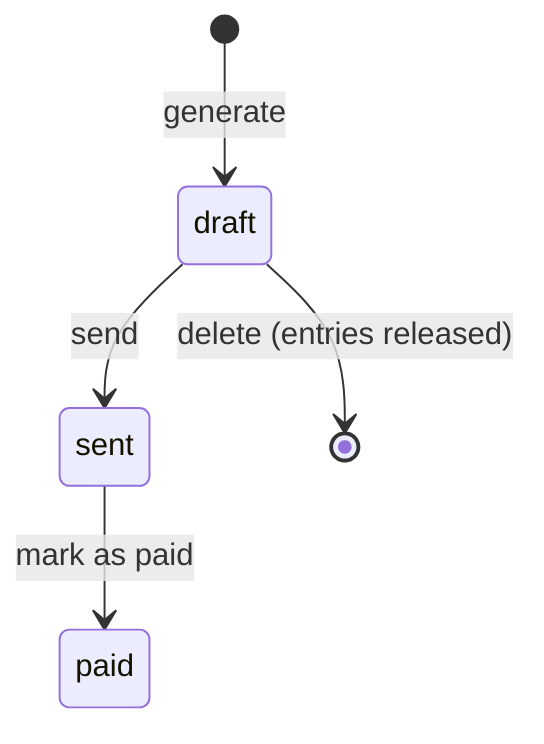

# 10 — Math and Logic in Applications · Laravel

[← Concepts](README.md) · Starting point: end of lesson 09 · Estimated time in class: 2 h · Independent work tasks: [README](README.md#independent-work-2-h)

---

## What we build today

- `App\Support\Money` — an immutable value object for euro cents: parsing without floats, arithmetic
  with overflow checks, percentages in basis points with half-up rounding, Estonian formatting.
- `App\Support\TimeRounding::roundUp()` — R5 with ceiling division.
- `TimeEntry::durationMinutes()` made DST-safe, and `ProjectService::billableMinutes()` (from lesson 09)
  changed to round **each entry** up to the project's increment.
- The billing strategies from lesson 08 changed to take and return `Money`, with R6 in
  `HourlyBilling::forMinutes()`.
- `BudgetMonitor` using `Money`.
- `App\Services\BillableSummary` (from lesson 08) extended with subtotal, VAT and total, and a project
  page that shows *billable so far*, *VAT 24 %* and *total*.

**Final result:** a capped project at 85 €/h with three 10-minute entries and 15-minute rounding shows
**0 h 45 min**, subtotal **63,75 €**, VAT 24 % **15,30 €**, total **79,05 €**. Every number is
calculated with integers.

---

## Step 1 — See the problem with your own eyes

**Why:** two minutes in Tinker convince better than any explanation.

```bash
php artisan tinker
> 0.1 + 0.2
= 0.30000000000000004
> 0.1 + 0.2 == 0.3
= false
> (int) (19.99 * 100)
= 1998
> 7 / 2
= 3.5
> intdiv(7, 2)
= 3
> intdiv(-7, 2)
= -3
> -7 % 2
= -1
> PHP_INT_MAX + 1
= 9.223372036854776E+18
```

**What happens:**

1. `0.1 + 0.2` is not `0.3`, because neither 0.1 nor 0.2 can be stored exactly in binary (see the
   concepts page, section 1).
2. `(int) (19.99 * 100)` is 1998: the product is 1998.9999999999998, and `(int)` truncates.
3. In PHP, `/` returns a float whenever the division is not exact (`7 / 2` is `3.5`). `intdiv()` is
   integer division, rounding toward zero.
4. `PHP_INT_MAX + 1` quietly becomes a **float**. There is no error. Our `Money` class will refuse this.

Search your project for money calculations that use `/` or `round()` on amounts:

```bash
grep -rn "/ 100\|round(\|floatval\|(float)" app resources/views
```

Anything you find in money code is replaced during this lesson.

---

## Step 2 — The `Money` value object

**Why:** amounts are plain `int` today. Nothing stops you from adding minutes to cents, formatting code
is spread over helpers and views, and every division needs its own rounding. A value object puts all
money rules in one tested class.

```php
<?php

// app/Support/Money.php

namespace App\Support;

use InvalidArgumentException;
use OverflowException;

/**
 * An amount of money in euro cents (R1).
 *
 * Immutable: every operation returns a new Money and never changes the current one.
 */
final readonly class Money
{
    private function __construct(public int $cents)
    {
        if ($cents === PHP_INT_MIN) {
            throw new OverflowException('Money amount is out of range.');
        }
    }

    public static function zero(): self
    {
        return new self(0);
    }

    public static function fromCents(int $cents): self
    {
        return new self($cents);
    }

    /**
     * Parses a euro amount such as "85.50", "85,5", "1200" or "-3.10" without using floats.
     *
     * More than two decimals is an error, not a silent rounding.
     */
    public static function fromEuros(string $euros): self
    {
        $euros = trim($euros);

        if (preg_match('/^(-)?(\d{1,15})(?:[.,](\d{1,2}))?$/', $euros, $parts) !== 1) {
            throw new InvalidArgumentException("Not a valid euro amount: \"{$euros}\"");
        }

        $whole = (int) $parts[2];
        $fraction = (int) str_pad($parts[3] ?? '', 2, '0');
        $cents = $whole * 100 + $fraction;

        return new self($parts[1] === '-' ? -$cents : $cents);
    }

    public function add(Money $other): self
    {
        return new self(self::checked($this->cents + $other->cents));
    }

    public function subtract(Money $other): self
    {
        return new self(self::checked($this->cents - $other->cents));
    }

    public function multiply(int $factor): self
    {
        return new self(self::checked($this->cents * $factor));
    }

    /**
     * A percentage of this amount, given in basis points (1 % = 100 bp, 24 % = 2400 bp),
     * rounded half up to the cent (R3).
     */
    public function percentageBp(int $basisPoints): self
    {
        return new self(self::divideHalfUp(self::checked($this->cents * $basisPoints), 10_000));
    }

    public function min(Money $other): self
    {
        return $this->cents <= $other->cents ? $this : $other;
    }

    public function max(Money $other): self
    {
        return $this->cents >= $other->cents ? $this : $other;
    }

    public function isZero(): bool
    {
        return $this->cents === 0;
    }

    public function isNegative(): bool
    {
        return $this->cents < 0;
    }

    public function greaterThanOrEqual(Money $other): bool
    {
        return $this->cents >= $other->cents;
    }

    public function equals(Money $other): bool
    {
        return $this->cents === $other->cents;
    }

    /**
     * Estonian style: "1 234,50 €" — space between thousands, comma before the cents.
     */
    public function format(): string
    {
        $absolute = abs($this->cents);
        $euros = number_format(intdiv($absolute, 100), 0, ',', ' ');

        return sprintf('%s%s,%02d €', $this->cents < 0 ? '-' : '', $euros, $absolute % 100);
    }

    /**
     * Integer division rounded half up, where "up" means away from zero: 2.5 → 3, -2.5 → -3.
     * Public so that HourlyBilling (R6) rounds with exactly the same rule as percentageBp() (R3).
     */
    public static function divideHalfUp(int $numerator, int $divisor): int
    {
        $quotient = intdiv(abs($numerator) + intdiv($divisor, 2), $divisor);

        return $numerator < 0 ? -$quotient : $quotient;
    }

    /**
     * PHP silently turns an int that overflows into a float. Refuse it instead.
     */
    private static function checked(int|float $value): int
    {
        if (! is_int($value)) {
            throw new OverflowException('Money amount is out of range.');
        }

        return $value;
    }
}
```

**What happens — line by line where it matters:**

1. `final readonly class` — `readonly` makes every property write-once: `$cents` is set in the
   constructor and can never change (`$money->cents = 5` is an error). `final` stops subclasses that
   could add mutable state.
2. The constructor is **private**. The only ways to create a `Money` are the named factories `zero()`,
   `fromCents()` and `fromEuros()`, so the reader always sees which unit is meant. The constructor body
   rejects `PHP_INT_MIN`, because `abs(PHP_INT_MIN)` cannot be represented as an `int`.
3. `public int $cents` — you can *read* the cents (`$money->cents`) for saving to the database. Because
   of `readonly`, being public is safe.
4. `fromEuros()` parses text with a regular expression, never through a float:
   - `(-)?` an optional minus sign → `$parts[1]`;
   - `(\d{1,15})` the whole euros, at most 15 digits so the result fits in an `int` → `$parts[2]`;
   - `(?:[.,](\d{1,2}))?` optionally a dot **or** comma and one or two decimals → `$parts[3]`.
   - `"85,5"`: whole = 85, `str_pad('5', 2, '0')` = `'50'` → 85 × 100 + 50 = **8550**.
   - `"85.505"` does not match and throws. Silently rounding user input would be a hidden decision.
5. `add`, `subtract`, `multiply` return a **new** object. The result goes through `checked()`: if the
   `int` overflowed, PHP produced a `float`, and we throw `OverflowException` instead of continuing with
   a wrong number.
6. `percentageBp(2400)` is 24 %. It multiplies by the basis points and divides by 10 000 with
   `divideHalfUp` — the formula `(n + d div 2) div d` from the concepts page, applied to the absolute
   value so negative amounts round away from zero too.
7. `min`/`max` return one of the two existing objects. That is safe *because* they are immutable.
8. `format()` works only with integers: `intdiv($absolute, 100)` for euros, `% 100` for cents, and
   `sprintf('%02d', ...)` pads 5 cents to `05`. `number_format(..., 0, ',', ' ')` puts a space between
   every group of three digits. It gets an `int` and zero decimals, so nothing is rounded.
9. Why not a ready-made formatter? Laravel's `Number::currency()` (lesson 04 used it) wraps
   `NumberFormatter`. It takes euros, so you pass `$cents / 100` — a float — and its output contains
   *non-breaking* spaces. `Money` formats by itself: exact integers, no float, and normal spaces, so the
   lesson 11 tests can compare with plain strings like `'1 234,56 €'`. Task 4 adds the locale-aware
   version.
10. `divideHalfUp()` is `public static`: `HourlyBilling` (Step 7) uses it too, so Billable has **one**
    half-up rounding rule.

**Commit:** `feat(money): add Money value object`

---

## Step 3 — Try `Money` in Tinker

**Why:** we test properly in lesson 11. Today we verify by hand, with values we calculated on paper
first. Knowing the expected result *before* running the code is the habit that makes tests useful.

```bash
php artisan tinker
> use App\Support\Money;
> Money::fromEuros('85.50')->cents
= 8550
> Money::fromEuros('85,5')->format()
= "85,50 €"
> Money::fromEuros('1234567.89')->format()
= "1 234 567,89 €"
> Money::fromCents(-5)->format()
= "-0,05 €"
> Money::fromCents(123456)->percentageBp(2400)->format()
= "296,29 €"
> Money::fromCents(75)->percentageBp(2200)->cents
= 17
> $a = Money::fromCents(100);
> $b = $a->add(Money::fromCents(50));
> [$a->cents, $b->cents]
= [100, 150]
> Money::fromEuros('85.505')
   InvalidArgumentException  Not a valid euro amount: "85.505".
> Money::fromCents(PHP_INT_MAX)->add(Money::fromCents(1))
   OverflowException  Money amount is out of range.
```

**What happens:**

1. The VAT line is the worked example from the concepts page: 123 456 × 0,24 = 29 629,44 cents →
   29 629 → 296,29 €.
2. 75 × 22 % = 16,5 cents → **17**: half up, not half even (which would give 16).
3. `$a` is still 100 after `$a->add(...)`. That is immutability.
4. Invalid input and overflow **fail loudly**. A loud error during development is much cheaper than a
   wrong invoice in production.

---

## Step 4 — Make the old `euros()` helper use `Money`

**Why:** your views have used the `euros()` helper since lesson 04, which formats with
`Number::currency()`. Now `Money::format()` formats too, and we do not want two formatting rules.
Decision: **keep the helper as a thin wrapper** that delegates to `Money`, so every existing view keeps
working and the formatting rule lives only in `Money::format()`. New code uses `Money` directly.

Open `app/helpers.php` and replace the `euros()` function (keep the other helpers from lessons 05 and 06
as they are):

```php
// app/helpers.php — replace euros()

use App\Support\Money;

if (! function_exists('euros')) {
    /**
     * Format integer cents for display. Null → "—" (an empty nullable column).
     * Kept for existing views; new code should use Money::format().
     */
    function euros(?int $cents): string
    {
        return $cents === null ? '—' : Money::fromCents($cents)->format();
    }
}
```

The `use App\Support\Money;` line goes at the top of the file, directly below `<?php`. It replaces
`use Illuminate\Support\Number;` from lesson 04, which nothing uses any more.

**What happens:** the signature stays exactly as in lesson 04 (`?int`, with "—" for `null`), so no view
changes. The helper no longer calls `Number::currency()`; it asks `Money::format()`, so the pages, the
emails and the lesson 11 tests all use the same rule.

**Check it works:** open the clients and projects pages. Every amount looks as before (`1 234,50 €`),
and empty prices still show "—". The differences are hard to see: the spaces are now normal spaces
instead of the non-breaking spaces that `Number::currency()` writes, and a negative amount starts with a
plain `-` instead of the minus sign `−` (U+2212).

**Commit:** `refactor(money): format amounts through Money`

---

## Step 5 — `TimeRounding`: R5 with ceiling division

**Why:** R5 says each entry is rounded **up** to the project's increment (1, 6 or 15 minutes). This is
a tiny pure function, but it is the kind that is wrong at the boundaries if written quickly.

```php
<?php

// app/Support/TimeRounding.php

namespace App\Support;

use InvalidArgumentException;

/**
 * R5: time entries are rounded UP to the project's increment before billing.
 */
final class TimeRounding
{
    /** The increments a project may use (projects.rounding_minutes). */
    public const ALLOWED_INCREMENTS = [1, 6, 15];

    /**
     * Rounds $minutes up to the next multiple of $increment.
     *
     * @throws InvalidArgumentException if minutes is negative or the increment is not 1, 6 or 15
     */
    public static function roundUp(int $minutes, int $increment): int
    {
        if (! in_array($increment, self::ALLOWED_INCREMENTS, true)) {
            throw new InvalidArgumentException(
                "Rounding increment must be 1, 6 or 15 minutes, got {$increment}."
            );
        }

        if ($minutes < 0) {
            throw new InvalidArgumentException("Minutes must not be negative, got {$minutes}.");
        }

        // Ceiling division (a + b - 1) div b, then back to minutes.
        return intdiv($minutes + $increment - 1, $increment) * $increment;
    }
}
```

**What happens:**

1. Two guard clauses reject invalid input. An increment of 0 would crash with "division by zero"; an
   increment of 10 is not allowed by the business rules. `in_array(..., true)` compares strictly, so the
   string `"15"` is not accepted by accident.
2. `intdiv($minutes + $increment - 1, $increment)` is the number of started blocks. Multiplying by the
   increment turns blocks back into minutes.
3. Why `static`? `roundUp` has no state and no dependencies — the same input always gives the same
   output. A static pure function is easy to test and cannot hide global state. (The problem with
   Singletons in lesson 09 was *state*, not `static` itself.)

**Check it works:**

```bash
php artisan tinker
> use App\Support\TimeRounding;
> [TimeRounding::roundUp(0, 15), TimeRounding::roundUp(1, 15), TimeRounding::roundUp(15, 15), TimeRounding::roundUp(16, 15), TimeRounding::roundUp(7, 6)]
= [0, 15, 15, 30, 12]
> TimeRounding::roundUp(10, 10)
   InvalidArgumentException  Rounding increment must be 1, 6 or 15 minutes, got 10.
```

These are exactly the rows of the table in the concepts page (section 7).

**Commit:** `feat(billing): add TimeRounding for R5`

---

## Step 6 — Per-entry rounding in the one place for billable minutes

**Why:** in lesson 09 we extracted `ProjectService::billableMinutes()` so the project page and
`BudgetMonitor` use the same minutes. R5 ("each entry is rounded up") is still missing there. Because
there is only one method, adding it is one change in one place.

First, the duration of one entry. `TimeEntry::durationMinutes()` exists since lesson 06, using
`diffInMinutes()`. Since Carbon 3 (Laravel 11+) `diffInMinutes()` returns a **float** and is negative
when the arguments are reversed; the `(int)` cast hides this. Replace the method body with plain integer
arithmetic on Unix timestamps:

```php
// app/Models/TimeEntry.php — replace durationMinutes()

    /**
     * Real elapsed minutes between start and end (not rounded), independent of
     * daylight-saving changes.
     */
    public function durationMinutes(): int
    {
        return intdiv($this->ended_at->getTimestamp() - $this->started_at->getTimestamp(), 60);
    }
```

Then add the rounding to `ProjectService::billableMinutes()`:

```php
// app/Services/ProjectService.php — add the use line at the top and replace billableMinutes()

use App\Support\TimeRounding;

    /**
     * Billable minutes of a project: each billable entry rounded up to the project's
     * increment (R5), then added together. Shared by the project page and BudgetMonitor.
     */
    public function billableMinutes(Project $project): int
    {
        return (int) $project->timeEntries()
            ->where('billable', true)
            ->get(['id', 'project_id', 'started_at', 'ended_at'])
            ->sum(fn (TimeEntry $entry): int => TimeRounding::roundUp(
                $entry->durationMinutes(),
                $project->rounding_minutes,
            ));
    }
```

**What happens:**

1. `getTimestamp()` returns the Unix timestamp — seconds since 1970 in UTC. Subtracting two of them gives
   real elapsed seconds, even across a DST change (as long as the dates were read in the right time
   zone — see the DST task). `intdiv(..., 60)` turns seconds into whole minutes.
2. The time sheet (lesson 06) also calls `durationMinutes()`, so it gets the fix for free.
3. `->get([...])` loads only the four columns we need. It is still one query.
4. Each entry is rounded **separately**, then summed. Three 7-minute entries with a 15-minute increment
   give 45 minutes, not `roundUp(21, 15)` = 30. That is R5 ("each entry"), and it is a business
   decision, not a technical one.
5. `BudgetMonitor` calls this method too, so the budget warning now also uses rounded minutes — without
   touching `BudgetMonitor` for it.
6. This method counts **all** billable time of the project, invoiced or not — that is what the project
   page and the budget warning (R9) need: the cap is about everything worked, not just what is still
   unbilled. In lesson 13 the invoice generator selects un-invoiced entries with its own query. (If you did the lesson 08 intermediate
   task, keep `BillableEntriesQuery` here instead of the inline query; only the `sum()` callback changes.)

**Check it works:**

```bash
php artisan tinker
> $p = App\Models\Project::first();
> [$p->rounding_minutes, app(App\Services\ProjectService::class)->billableMinutes($p)]
```

With a rounding of 15 the second number is now a multiple of 15 for every entry — compare it with the
time sheet.

---

## Step 7 — Billing strategies return `Money`

**Why:** in lesson 08 the strategies used `int` cents, and the PHPDoc was the only thing that said
"cents". Now the contract says what the numbers *are*. The interface changes, so every implementation
must change with it — including `InternalBilling` from your lesson 08 independent work.

Replace the interface:

```php
<?php

// app/Billing/BillingStrategy.php

namespace App\Billing;

use App\Models\Project;
use App\Support\Money;

/**
 * One way of turning billable time into an amount of money. The result is never negative.
 */
interface BillingStrategy
{
    /**
     * @param  int  $billableMinutes  already rounded per entry (R5)
     * @param  Money  $alreadyBilled  what earlier invoices billed for this project (zero until lesson 13)
     */
    public function calculate(Project $project, int $billableMinutes, Money $alreadyBilled): Money;
}
```

```php
<?php

// app/Billing/HourlyBilling.php

namespace App\Billing;

use App\Models\Project;
use App\Support\Money;
use InvalidArgumentException;

/**
 * R6: minutes × hourly rate ÷ 60, rounded half up to the cent.
 */
class HourlyBilling implements BillingStrategy
{
    public function calculate(Project $project, int $billableMinutes, Money $alreadyBilled): Money
    {
        return self::forMinutes(Money::fromCents((int) $project->hourly_rate_cents), $billableMinutes);
    }

    /**
     * R6 — the one place where minutes × rate ÷ 60 is calculated and rounded.
     */
    public static function forMinutes(Money $hourlyRate, int $minutes): Money
    {
        if ($minutes < 0 || $hourlyRate->isNegative()) {
            throw new InvalidArgumentException('Minutes and hourly rate must not be negative.');
        }

        // ÷ 60 rounded half up, with the same rule as percentageBp() (R3).
        return Money::fromCents(Money::divideHalfUp($hourlyRate->multiply($minutes)->cents, 60));
    }
}
```

```php
<?php

// app/Billing/CappedHourlyBilling.php

namespace App\Billing;

use App\Models\Project;
use App\Support\Money;

/**
 * R7: hourly billing, but the project's total billed amount never exceeds budget_cap_cents.
 */
class CappedHourlyBilling implements BillingStrategy
{
    public function __construct(private readonly HourlyBilling $hourly) {}

    public function calculate(Project $project, int $billableMinutes, Money $alreadyBilled): Money
    {
        $hourlyAmount = $this->hourly->calculate($project, $billableMinutes, $alreadyBilled);

        $remainingBudget = Money::fromCents((int) $project->budget_cap_cents)
            ->subtract($alreadyBilled)
            ->max(Money::zero());

        return $hourlyAmount->min($remainingBudget);
    }
}
```

```php
<?php

// app/Billing/FixedPriceBilling.php

namespace App\Billing;

use App\Models\Project;
use App\Support\Money;

/**
 * R8: the part of the agreed fixed price that has not been billed yet.
 */
class FixedPriceBilling implements BillingStrategy
{
    public function calculate(Project $project, int $billableMinutes, Money $alreadyBilled): Money
    {
        return Money::fromCents((int) $project->fixed_price_cents)
            ->subtract($alreadyBilled)
            ->max(Money::zero());
    }
}
```

```php
<?php

// app/Billing/InternalBilling.php — only if you did the lesson 08 basic task

namespace App\Billing;

use App\Models\Project;
use App\Support\Money;

/**
 * Null Object: internal projects are tracked but never billed.
 */
class InternalBilling implements BillingStrategy
{
    public function calculate(Project $project, int $billableMinutes, Money $alreadyBilled): Money
    {
        return Money::zero();
    }
}
```

**What happens:**

1. The formulas are the same as in lesson 08 — `min(hourly, max(cap − billed, 0))` and
   `max(fixed − billed, 0)` — but now they read like the business rules: `subtract`, `max`, `min`.
2. `HourlyBilling::forMinutes()` is the **only** place where the hourly amount (R6) is calculated and
   rounded. It is `static` and public so that code which has a rate but no `Project` (lesson 13's invoice
   lines, lesson 11's tests) can use the same formula. `calculate()` just reads the rate from the project
   and calls it. Billable has exactly two places where a money fraction appears — here and VAT in
   `percentageBp()` — and both round with the same `Money::divideHalfUp()` (R3).
3. `CappedHourlyBilling` keeps the composition from lesson 08: it asks the injected `HourlyBilling`, so
   the R6 formula still exists once.
4. Example: 45 minutes at 85,00 €: 8 500 × 45 = 382 500; + 30 (half of 60) = 382 530; div 60 =
   **6 375 cents**. For 10 minutes: 85 000 + 30 = 85 030; div 60 = 1 417 (exact 1 416.67 → half up).
5. `BillingStrategyResolver` does not change: `forProject()` still chooses a strategy by billing type.
6. PHP reports a strategy you forgot as soon as the class is loaded (see Troubleshooting).

**Commit:** `refactor(billing): strategies take and return Money`

---

## Step 8 — `BudgetMonitor` uses `Money`

**Why:** the strategies return `Money` now, so `BudgetMonitor` must too. It already gets its minutes
from `ProjectService::billableMinutes()` (lesson 09), so it uses the rounded minutes from Step 6
automatically. Replace the whole class:

```php
<?php

// app/Services/BudgetMonitor.php

namespace App\Services;

use App\Billing\HourlyBilling;
use App\Contracts\Notifier;
use App\Enums\BillingType;
use App\Models\Project;
use App\Support\Money;
use Throwable;

/**
 * R9: when a capped project's value reaches 80 % of its cap, warn the owner once.
 */
class BudgetMonitor
{
    public const WARNING_THRESHOLD_PERCENT = 80;

    public function __construct(
        private readonly Notifier $notifier,
        private readonly HourlyBilling $hourlyBilling,
        private readonly ProjectService $projects,
    ) {}

    public function check(Project $project): void
    {
        if ($project->billing_type !== BillingType::Capped) {
            return;
        }

        if ($project->budget_warning_sent_at !== null) {
            return; // quick check; the claim below is the real guard
        }

        $cap = Money::fromCents((int) $project->budget_cap_cents);
        if ($cap->isZero() || $cap->isNegative()) {
            return;
        }

        // The UNCAPPED value, from the same minutes the project page uses.
        $value = $this->hourlyBilling->calculate(
            $project,
            $this->projects->billableMinutes($project),
            Money::zero(),
        );

        // value / cap >= 80 / 100  ⇔  value × 100 >= cap × 80 — exact, no rounding.
        if (! $value->multiply(100)->greaterThanOrEqual($cap->multiply(self::WARNING_THRESHOLD_PERCENT))) {
            return;
        }

        if (! $this->claimWarning($project)) {
            return; // another request has already claimed (and sent) this warning
        }

        try {
            $this->notifier->notify(
                "Budget warning: {$project->name}",
                sprintf(
                    'Project "%s" has reached %d %% of its budget cap: %s of %s.',
                    $project->name,
                    intdiv($value->cents * 100, $cap->cents),
                    $value->format(),
                    $cap->format(),
                ),
            );
        } catch (Throwable $e) {
            $this->releaseWarning($project); // nobody was warned: let a later entry try again
            throw $e;
        }
    }

    /**
     * Set budget_warning_sent_at, but only if it is still empty in the database.
     * Returns true for exactly one caller, even when two requests run at the same moment.
     */
    private function claimWarning(Project $project): bool
    {
        $claimed = Project::query()
            ->whereKey($project->id)
            ->whereNull('budget_warning_sent_at')
            ->update(['budget_warning_sent_at' => now()]);

        return $claimed === 1;
    }

    private function releaseWarning(Project $project): void
    {
        Project::query()
            ->whereKey($project->id)
            ->update(['budget_warning_sent_at' => null]);
    }
}
```

**What happens:**

1. The rule is unchanged; only the types changed. `euros()` is no longer needed here — `Money` formats
   itself. `claimWarning()` and `releaseWarning()` are the same as in lesson 09 (claim → notify →
   release on failure).
2. Why not compare with `$value->greaterThanOrEqual($cap->percentageBp(8000))`? Because `percentageBp`
   **rounds**. With a cap of 10,04 €, 80 % is 8,032 € → rounded to 8,03 €, and a value of 8,03 € would
   already trigger the warning although it is only 79,98 %. Multiplying both sides keeps the comparison
   exact. Rounding is for amounts you *show or bill*, not for comparisons.
3. The percentage in the message uses `intdiv` — it rounds down, so the message never claims "80 %"
   when the value is 79,9 %.

**Check it works:** repeat Step 11 of lesson 09 (reset the demo project's timestamp in Tinker, cross
80 %). The email arrives in Mailpit and the amounts are formatted by `Money`.

**Commit:** `refactor(budget): use Money in BudgetMonitor`

---

## Step 9 — The project page: billable so far, VAT and total

**Why:** since lesson 08 the project page shows "billable so far" from `BillableSummary`. We add VAT
(R2) and a total. The calculation stays in the service and in the summary object; the controller does
not change at all.

Add the VAT rate to `config/billable.php` (you created the file in lesson 09):

```php
// config/billable.php — add this key to the returned array

    // R2: VAT in basis points (24 % = 2400). Invoices store their own copy (lesson 13).
    'vat_rate_bp' => (int) env('BILLABLE_VAT_RATE_BP', 2400),
```

Replace `BillableSummary` from lesson 08. It keeps `minutes`, `hours()` and `remainingMinutes()`; the
single `int $cents` becomes a `Money` subtotal, plus VAT and total:

```php
<?php

// app/Services/BillableSummary.php

namespace App\Services;

use App\Support\Money;

/**
 * What a project could bill right now: rounded minutes, subtotal, VAT and total.
 */
final readonly class BillableSummary
{
    public function __construct(
        public int $minutes,
        public Money $subtotal,
        public int $vatRateBp,
        public Money $vat,
        public Money $total,
    ) {}

    public static function of(int $minutes, Money $subtotal, int $vatRateBp): self
    {
        $vat = $subtotal->percentageBp($vatRateBp); // VAT once, on the subtotal (R3)

        return new self($minutes, $subtotal, $vatRateBp, $vat, $subtotal->add($vat));
    }

    public function hours(): int
    {
        return intdiv($this->minutes, 60);
    }

    public function remainingMinutes(): int
    {
        return $this->minutes % 60;
    }

    /** 2400 → "24 %", 850 → "8,5 %" */
    public function vatRateLabel(): string
    {
        $whole = intdiv($this->vatRateBp, 100);
        $rest = $this->vatRateBp % 100;

        return $rest === 0
            ? "{$whole} %"
            : sprintf('%d,%s %%', $whole, rtrim(sprintf('%02d', $rest), '0'));
    }
}
```

Now replace `billableSummary()` in `ProjectService` (the constructor with `$billing` from lesson 08
stays):

```php
// app/Services/ProjectService.php — add the use line at the top and replace billableSummary()

use App\Support\Money;

    /**
     * Billable minutes, subtotal, VAT and total so far.
     * Shows the value of all billable time; alreadyBilled is zero here (the invoice
     * generator in lesson 13 works out billed amounts itself).
     */
    public function billableSummary(Project $project): BillableSummary
    {
        $minutes = $this->billableMinutes($project);

        $subtotal = $this->billing->forProject($project)->calculate($project, $minutes, Money::zero());

        return BillableSummary::of($minutes, $subtotal, (int) config('billable.vat_rate_bp'));
    }
```

`ProjectController::show()` stays exactly as in lesson 08: it passes
`$this->projects->billableSummary($project)` to the view as `summary`.

Finally the view. Replace the "Billable so far" block from lesson 08:

```blade
{{-- resources/views/projects/show.blade.php — replace the "Billable so far" block --}}
<article>
    <header><strong>Billable so far</strong></header>

    <p>
        {{ $summary->hours() }} h {{ $summary->remainingMinutes() }} min of billable time
        <small>(each entry rounded up to {{ $project->rounding_minutes }} min)</small>
    </p>

    <table>
        <tbody>
            <tr>
                <th scope="row">Subtotal</th>
                <td>{{ $summary->subtotal->format() }}</td>
            </tr>
            <tr>
                <th scope="row">VAT {{ $summary->vatRateLabel() }}</th>
                <td>{{ $summary->vat->format() }}</td>
            </tr>
            <tr>
                <th scope="row">Total</th>
                <td><strong>{{ $summary->total->format() }}</strong></td>
            </tr>
        </tbody>
    </table>

    <small>Before invoices (lesson 13).</small>
</article>
```

**What happens:**

1. The controller calls one service method, as before. The service asks itself for minutes, the resolver
   for the strategy, and `BillableSummary::of()` for VAT and total.
2. VAT is calculated **once**, on the subtotal, with half-up rounding inside `percentageBp`.
3. `total = subtotal + vat` needs no rounding: both are already whole cents. So subtotal + VAT on the
   page always adds up exactly to the total.
4. The view only calls formatting methods. No arithmetic in Blade.
5. `vatRateLabel()` is integer formatting practice: 850 bp → whole 8, rest 50 → `"50"` → trimmed to
   `"5"` → "8,5 %".
6. If anything else still reads `$summary->cents` (search with `grep -rn "summary->cents" app resources`),
   change it to `$summary->subtotal`.

**Check it works:** create a project "Rounding demo", **capped**, 85,00 €/h, cap 1 000,00 €, rounding
**15** minutes. Log three billable entries of **10 minutes** each. The page shows:

| Line | Value | Why |
|---|---|---|
| Duration | 0 h 45 min | 3 × `roundUp(10, 15)` = 3 × 15 |
| Subtotal | 63,75 € | (45 × 8 500 + 30) div 60 = 6 375 |
| VAT 24 % | 15,30 € | (6 375 × 2 400 + 5 000) div 10 000 = 1 530 |
| Total | 79,05 € | 6 375 + 1 530 |

Now edit the project and change rounding to **1** minute. The page shows 0 h 30 min, 42,50 €,
VAT 10,20 €, total 52,70 €. Change the billing type to hourly: the same numbers (the cap is far away).

**Commit:** `feat(projects): show subtotal, VAT and total with Money`

---

## Step 10 — Final checks

Run the formatter and look for leftover floats:

```bash
./vendor/bin/pint
grep -rn "float\|/ 100\|round(" app
```

The only acceptable hits are in comments, or in code unrelated to money. `Money` itself uses
`int|float` only to *detect* overflow.

**Commit:** `chore: format` (if Pint changed something)

---

## Troubleshooting

| Error or symptom | Cause | Fix |
|---|---|---|
| `Declaration of App\Billing\XyzBilling::calculate(...): int must be compatible with App\Billing\BillingStrategy::calculate(...): App\Support\Money` | One strategy (often `InternalBilling`) still has the old signature | Change its parameters and return type to `Money` |
| `App\Billing\HourlyBilling::calculate(): Argument #3 ($alreadyBilled) must be of type App\Support\Money, int given` | A caller still passes `0` | Search for `->calculate(` and pass `Money::zero()` |
| `Call to private App\Support\Money::__construct() from global scope` | `new Money(500)` | Use `Money::fromCents(500)` |
| `Cannot modify readonly property App\Support\Money::$cents` | Code tries to change an amount in place | Use the result: `$total = $total->add($x);` |
| `Object of class App\Support\Money could not be converted to string` | A view prints `{{ $money }}` | Print `{{ $money->format() }}` |
| `Unsupported operand types: App\Support\Money + App\Support\Money` | Operators do not work on objects | Use `add()`, `subtract()`, `multiply()` |
| `OverflowException: Money amount is out of range.` | Absurd numbers, often minutes and cents mixed up | Check the arguments; `multiply()` takes a plain number |
| `InvalidArgumentException: Rounding increment must be 1, 6 or 15 minutes, got 0.` | A project has `rounding_minutes = 0` (old seed data) | Fix the seeder and the data with a migration or reseed; validation should only allow 1, 6, 15 |
| The duration is 60 minutes too long or too short for one entry | The entry crosses a DST change and the time zone setting is wrong | See Task 3 (DST experiment) |
| `Undefined property: App\Services\BillableSummary::$cents` | A view still uses the lesson 08 property | Use `$summary->subtotal->format()` |
| Two strings that look identical are not equal (`1 234,50 €`) | One contains a non-breaking space (U+00A0), e.g. copied from `Number::currency()` or `NumberFormatter` output | Our `format()` uses a normal space (U+0020); see Task 4 |

---

## Recap

- `app/Support/Money.php` — immutable cents, `fromEuros` without floats, overflow checks,
  `percentageBp` half up through the public `divideHalfUp()`, `format()` Estonian style with
  `number_format()` on an `int`.
- `app/helpers.php` — `euros()` now delegates to `Money::format()`.
- `app/Support/TimeRounding.php` — `roundUp()` with `(a + b − 1) div b` and input validation.
- `TimeEntry::durationMinutes()` — timestamp arithmetic instead of `diffInMinutes()`.
- `ProjectService::billableMinutes()` — the one place, now with per-entry rounding (R5).
- `app/Billing/*` — strategies use `Money`; R6 only in `HourlyBilling::forMinutes()`, rounded with the
  same `Money::divideHalfUp()` as VAT.
- `BudgetMonitor` — exact comparison with `Money`.
- `BillableSummary` (extended), `ProjectService::billableSummary()`, the project view — VAT once on the
  subtotal.

---

## Independent work — solutions

> **The tasks are not here.** The task descriptions (Basic / Intermediate / Advanced, with acceptance
> criteria) are in this lesson's [README.md → Independent work (~2 h)](README.md#independent-work-2-h).
> Read them there first and build the features in your project. This section only contains the
> solutions — try each task yourself, then open a solution to compare or when you are stuck.

<details>
<summary>Task 1 — DueDateCalculator (R12)</summary>

```php
<?php

// app/Support/DueDateCalculator.php

namespace App\Support;

use Carbon\CarbonImmutable;

/**
 * R12: an invoice is due 14 days after it is issued; a due date on a Saturday or Sunday
 * moves to the next Monday.
 */
final class DueDateCalculator
{
    public const PAYMENT_TERM_DAYS = 14;

    public function dueDate(CarbonImmutable $issuedOn): CarbonImmutable
    {
        $due = $issuedOn->startOfDay()->addDays(self::PAYMENT_TERM_DAYS);

        return match (true) {
            $due->isSaturday() => $due->addDays(2),
            $due->isSunday() => $due->addDay(),
            default => $due,
        };
    }
}
```

**What happens:**

1. `CarbonImmutable` — every `add...()` returns a new object; the caller's date is never changed.
2. `startOfDay()` removes the time, so an invoice issued at 23:59 does not end up on a different date
   than one issued at 00:01.
3. `match (true)` checks the arms from top to bottom and uses the first that is `true` — a compact
   decision table with three rows. Carbon has shortcuts for this: `$due->isWeekend()` and
   `$due->next(CarbonInterface::MONDAY)` give the same result in one line. We keep the `match` because
   it shows the rule row by row, exactly like R12.
4. The class does not call `now()`. The caller passes the issue date, so the function is pure and trivial
   to test (lesson 11). Not static, so lesson 13's `InvoiceGenerator` can receive it through the
   constructor and a test can replace it if needed.

**Check it works:**

```bash
php artisan tinker
> $c = new App\Support\DueDateCalculator;
> use Carbon\CarbonImmutable;
> collect(['2026-10-01', '2026-10-03', '2026-10-04', '2026-12-19'])->map(fn ($d) => $d.' → '.$c->dueDate(CarbonImmutable::parse($d))->toDateString())
= [
    "2026-10-01 → 2026-10-15",   // Thursday → Thursday
    "2026-10-03 → 2026-10-19",   // Saturday → Saturday 17th → Monday 19th
    "2026-10-04 → 2026-10-19",   // Sunday → Sunday 18th → Monday 19th
    "2026-12-19 → 2027-01-04",   // Saturday → Saturday 2 Jan → Monday 4 Jan (year change)
  ]
```

**Commit:** `feat(invoicing): add DueDateCalculator for R12`
</details>

<details>
<summary>Task 2 — docs/invoice-rules.md (decision table)</summary>

````markdown
# Invoice rules

Source: PROJECT.md R13 ("only drafts can be edited or deleted; deleting a draft releases its
time entries"), R14, and the status flow draft → sent → paid.

## Decision table

| Status | Edit | Delete | Send | Mark as paid |
|---|---|---|---|---|
| draft | allowed | allowed (releases its time entries) | allowed → `sent` | not allowed |
| sent | not allowed | not allowed | not allowed | allowed → `paid` |
| paid | not allowed | not allowed | not allowed | not allowed |

Why the non-obvious cells are "not allowed":

- **Sent → edit / delete:** the customer already has this invoice. Changing or deleting it would
  make our records differ from theirs, and would leave a gap in the numbering (R11). A mistake on
  a sent invoice is corrected with a credit note, not by editing.
- **Draft → mark as paid:** nobody can pay an invoice they have not received. It must be sent first.
- **Sent → send:** sending twice is not a state change. (Re-sending the email could be a separate
  action that does not change the status.)
- **Paid → anything:** a paid invoice is final.

## Transitions



## Pseudocode

```
function isAllowed(status, action): bool
    match (status, action)
        (draft, edit)     -> true
        (draft, delete)   -> true
        (draft, send)     -> true
        (sent,  markPaid) -> true
        otherwise         -> false
```

Only the "allowed" cells are listed; everything else is denied by default. That is the safe
default: a new status or action is forbidden until someone adds a rule for it.

## Implementation

Lesson 13 implements this with the `InvoiceStatus` enum (methods such as `canBeEdited()`), and every
cell of the table (3 statuses × 4 actions = 12 cases) becomes one row of a data-provider test.
````

**Commit:** `docs(invoicing): decision table for invoice actions`
</details>

<details>
<summary>Task 3 — DST experiment</summary>

**Part 1 — the two calculations in Tinker:**

```bash
php artisan tinker
> use Carbon\CarbonImmutable;
> $a = CarbonImmutable::parse('2026-03-29 02:30', 'Europe/Tallinn');
> $b = CarbonImmutable::parse('2026-03-29 04:30', 'Europe/Tallinn');
> intdiv($b->getTimestamp() - $a->getTimestamp(), 60)        // instant-based
= 60
> $a->toIso8601String() . ' / ' . $b->toIso8601String()
= "2026-03-29T02:30:00+02:00 / 2026-03-29T04:30:00+03:00"
> $x = CarbonImmutable::parse('2026-03-29 02:30', 'UTC');      // the same wall clock, no DST
> $y = CarbonImmutable::parse('2026-03-29 04:30', 'UTC');
> intdiv($y->getTimestamp() - $x->getTimestamp(), 60)        // naive wall-clock
= 120
```

The offsets tell the story: +02:00 before the change, +03:00 after it.

**Part 2 — what your app does.** Log an entry on 29 March 2026 from 02:30 to 04:30 and look at the
time sheet.

- **It shows 1 h (60 min):** this is what you should see. Lesson 01 set the application time zone to
  `Europe/Tallinn`, and Laravel parses `2026-03-29T02:30` from the form in that zone. Good.
- **It shows 2 h (120 min):** the lesson 01 setting is missing or overridden. Check it:

  ```bash
  > config('app.timezone')
  = "UTC"
  ```

  With `UTC` there is no DST, so the wall-clock difference is used. Fix it as in lesson 01: in
  `config/app.php` set `'timezone' => 'Europe/Tallinn'` (or `APP_TIMEZONE=Europe/Tallinn` in `.env` if
  the line reads `env('APP_TIMEZONE', 'UTC')`), then `php artisan config:clear`. Existing rows keep
  their stored wall-clock values, which are now read as Tallinn time.
- **To see the bug yourself:** set the time zone to `'UTC'` for a moment (the same place as in lesson
  01), run `php artisan config:clear` and reload the time sheet — the entry shows 2 h. Change it back
  afterwards.

**Part 3 — October.** Our `timestamp` columns store a wall-clock value **without** a time zone. On
25 October 2026, "03:30" happens twice (first at +03:00, then at +02:00). The database cannot tell
which one you meant; PHP picks the second one (`2026-10-25T03:30:00+02:00`). An entry typed as
02:30–03:30 may therefore be 1 h or 2 h in reality, and Billable will say 2 h.

Example write-up (put it in `docs/patterns.md` or as a note for an ADR in lesson 15):

> Durations are computed from Unix timestamps, so they are correct across the March change as long as
> the application time zone is Europe/Tallinn. Times between 03:00 and 04:00 on the last Sunday of
> October are ambiguous because we store local wall-clock time without an offset. The robust fix is
> to store UTC (`timestampTz` columns, or `app.timezone = UTC` and converting input/output to
> Europe/Tallinn in the forms and views). We accept the risk for now: one hour a year, at night.

**Commit:** `fix(time-entries): use Europe/Tallinn for durations` (only if you changed something)
</details>

<details>
<summary>Task 4 — locale-aware formatting with NumberFormatter</summary>

Check that the `intl` extension is installed (Herd includes it):

```bash
php -m | grep intl
intl
```

Add to `Money`:

```php
// app/Support/Money.php  — add the use line at the top and the method inside the class

use NumberFormatter;
use RuntimeException;

/**
 * Formats this amount with the rules of a locale, e.g. "et_EE" → "1 234,50 €",
 * "en_IE" → "€1,234.50".
 *
 * ICU (the library behind NumberFormatter) uses a NON-BREAKING space (U+00A0) as the
 * thousands separator and before "€" in et_EE, so the amount never wraps onto two lines.
 * It looks like a normal space but is a different character: in tests write "\u{00A0}".
 *
 * NumberFormatter only accepts int|float. Dividing by 100 creates a float, which is fine
 * HERE ONLY: all calculation is finished, this value is used for display and thrown away,
 * and for amounts below about 90 trillion euros the float is so close to the exact value
 * that rounding to two decimals always gives back the exact cents.
 */
public function formatLocale(string $locale): string
{
    $formatter = new NumberFormatter($locale, NumberFormatter::CURRENCY);
    $formatted = $formatter->formatCurrency($this->cents / 100, 'EUR');

    if ($formatted === false) {
        throw new RuntimeException($formatter->getErrorMessage());
    }

    return $formatted;
}
```

**Check it works:**

```bash
php artisan tinker
> $m = App\Support\Money::fromCents(123450);
> $m->formatLocale('et_EE')
= "1 234,50 €"
> bin2hex($m->formatLocale('et_EE'))
= "31c2a03233342c3530c2a0e282ac"          // c2a0 = U+00A0 non-breaking space, e282ac = €
> $m->formatLocale('en_IE')
= "€1,234.50"
> App\Support\Money::fromCents(-123450)->formatLocale('en_IE')
= "-€1,234.50"
> $m->formatLocale('et_EE') === "1\u{00A0}234,50\u{00A0}€"
= true
> $m->formatLocale('et_EE') === $m->format()
= false                                   // format() uses normal spaces
```

`Number::currency()`, which lesson 04's `euros()` used, wraps the same `NumberFormatter`. Writing it
yourself once shows what the helper does.

**Commit:** `feat(money): add locale-aware formatting`
</details>
