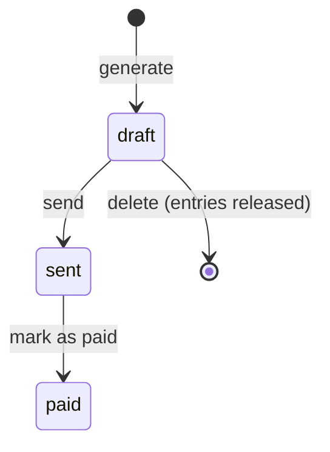

# 10 — Math and Logic in Applications · Spring Boot

[← Concepts](README.md) · Starting point: end of lesson 09 · Estimated time in class: 2 h · Independent work tasks: [README](README.md#independent-work-2-h)

---

## What we build today

- `common.Money` — an immutable `record` for euro cents: parsing without floating point, arithmetic
  that throws on overflow, percentages in basis points with half-up rounding, Estonian formatting.
- `common.TimeRounding.roundUp()` — R5 with ceiling division.
- `TimeEntry.durationMinutes()` made DST-safe, and `ProjectService.billableMinutes()` (from lesson 09)
  changed to round **each entry** up to the project's increment.
- The billing strategies from lesson 08 changed to take and return `Money`, with R6 in
  `HourlyBilling.forMinutes()`.
- `BudgetMonitor` using `Money`.
- `project.BillableSummary` (from lesson 08) extended with subtotal, VAT and total, and a project page
  that shows *billable so far*, *VAT 24 %* and *total*.
- `billable.vat-rate-bp` as a new, validated component `vatRateBp` of `common.BillableProperties`
  (lesson 09).

**Final result:** a capped project at 85 €/h with three 10-minute entries and 15-minute rounding shows
**0 h 45 min**, subtotal **63,75 €**, VAT 24 % **15,30 €**, total **79,05 €**. Every number is
calculated with `long`.

---

## Step 1 — See the problem with your own eyes

**Why:** two minutes in `jshell` (the Java REPL that comes with the JDK) convince better than any
explanation.

```bash
jshell
jshell> 0.1 + 0.2
$1 ==> 0.30000000000000004
jshell> 0.1 + 0.2 == 0.3
$2 ==> false
jshell> (long) (19.99 * 100)
$3 ==> 1998
jshell> 7 / 2
$4 ==> 3
jshell> -7 / 2
$5 ==> -3
jshell> Math.floorDiv(-7, 2)
$6 ==> -4
jshell> -7 % 2
$7 ==> -1
jshell> Math.floorMod(-7, 2)
$8 ==> 1
jshell> Math.round(-2.5)
$9 ==> -2
jshell> Long.MAX_VALUE + 1
$10 ==> -9223372036854775808
jshell> Math.addExact(Long.MAX_VALUE, 1)
|  Exception java.lang.ArithmeticException: long overflow
jshell> /exit
```

**What happens:**

1. `0.1 + 0.2` is not `0.3`, because neither can be stored exactly in binary (concepts, section 1).
2. `(long) (19.99 * 100)` is 1998: the product is 1998.9999999999998 and the cast truncates.
3. `/` with two `int`s is integer division toward zero; `Math.floorDiv` rounds toward −∞.
4. `Math.round(-2.5)` is **−2**: Java rounds halves toward +∞, not away from zero.
5. `Long.MAX_VALUE + 1` silently wraps to the most negative number. `Math.addExact` throws instead —
   our `Money` uses the `*Exact` methods everywhere.

Search your project for money code that uses `double`, `float` or `/ 100`:

```bash
grep -rn "double\|float\|/ 100\|Math.round" src/main/java src/main/resources/templates
```

Anything you find in money code is replaced during this lesson.

---

## Step 2 — The `Money` record

**Why:** amounts are plain `long` today. Nothing stops you from adding minutes to cents, formatting is
in `Formatters`, and every division needs its own rounding. A value object puts all money rules in one
tested type.

```java
// src/main/java/ee/ta25/billable/common/Money.java
package ee.ta25.billable.common;

import java.util.Locale;
import java.util.Objects;
import java.util.regex.Matcher;
import java.util.regex.Pattern;

/**
 * An amount of money in euro cents (R1).
 *
 * <p>Immutable: every operation returns a new {@code Money}. Arithmetic throws {@link
 * ArithmeticException} on overflow instead of silently wrapping around.
 */
public record Money(long cents) implements Comparable<Money> {

  private static final Pattern EUROS = Pattern.compile("(-)?(\\d{1,15})(?:[.,](\\d{1,2}))?");
  private static final Money ZERO = new Money(0);

  public Money {
    if (cents == Long.MIN_VALUE) {
      throw new ArithmeticException("Money amount is out of range");
    }
  }

  public static Money zero() {
    return ZERO;
  }

  public static Money fromCents(long cents) {
    return new Money(cents);
  }

  /**
   * Parses a euro amount such as "85.50", "85,5", "1200" or "-3.10" without using floating point.
   * More than two decimals is an error, not a silent rounding.
   */
  public static Money fromEuros(String euros) {
    Objects.requireNonNull(euros, "euros");
    Matcher parts = EUROS.matcher(euros.strip());
    if (!parts.matches()) {
      throw new IllegalArgumentException("Not a valid euro amount: \"" + euros + "\"");
    }
    long whole = Long.parseLong(parts.group(2));
    String decimals = parts.group(3) == null ? "00" : (parts.group(3) + "0").substring(0, 2);
    long cents = whole * 100 + Integer.parseInt(decimals);
    return new Money(parts.group(1) != null ? -cents : cents);
  }

  public Money add(Money other) {
    return new Money(Math.addExact(cents, other.cents));
  }

  public Money subtract(Money other) {
    return new Money(Math.subtractExact(cents, other.cents));
  }

  public Money multiply(long factor) {
    return new Money(Math.multiplyExact(cents, factor));
  }

  /**
   * A percentage of this amount in basis points (1 % = 100 bp, 24 % = 2400 bp), rounded half up to
   * the cent (R3).
   */
  public Money percentageBp(int basisPoints) {
    return new Money(divideHalfUp(Math.multiplyExact(cents, basisPoints), 10_000));
  }

  public Money min(Money other) {
    return cents <= other.cents ? this : other;
  }

  public Money max(Money other) {
    return cents >= other.cents ? this : other;
  }

  public boolean isZero() {
    return cents == 0;
  }

  public boolean isNegative() {
    return cents < 0;
  }

  public boolean greaterThanOrEqual(Money other) {
    return cents >= other.cents;
  }

  @Override
  public int compareTo(Money other) {
    return Long.compare(cents, other.cents);
  }

  /** Estonian style: "1 234,50 €" — space between thousands, comma before the cents. */
  public String format() {
    long absolute = Math.abs(cents);
    String euros = String.format(Locale.ROOT, "%,d", absolute / 100).replace(',', ' ');
    return "%s%s,%02d €".formatted(cents < 0 ? "-" : "", euros, absolute % 100);
  }

  /**
   * Integer division rounded half up, where "up" means away from zero: 2.5 → 3, -2.5 → -3.
   *
   * <p>Public so that {@code HourlyBilling} (R6) rounds with the same rule as {@link #percentageBp}.
   */
  public static long divideHalfUp(long numerator, long divisor) {
    long quotient = Math.addExact(Math.absExact(numerator), divisor / 2) / divisor;
    return numerator < 0 ? -quotient : quotient;
  }
}
```

**What happens — where it matters:**

1. `record Money(long cents)` — a record has one `private final` field per component, a public
   accessor `cents()`, and generated `equals`, `hashCode` and `toString`. So
   `Money.fromCents(500).equals(Money.fromCents(500))` is `true`, and the value can never change.
2. The **compact constructor** `public Money { ... }` runs before the fields are assigned. It rejects
   `Long.MIN_VALUE`, the only `long` whose absolute value does not fit in a `long`.
3. We keep the canonical constructor public (records require it to be at least as visible as the
   record), but code in Billable uses the named factories `zero()`, `fromCents()` and `fromEuros()`, so
   the reader sees which unit is meant.
4. `fromEuros()` parses text with a regular expression, never through `double`:
   - `(-)?` optional minus → group 1; `(\d{1,15})` whole euros, at most 15 digits so the result fits →
     group 2; `(?:[.,](\d{1,2}))?` optional dot **or** comma plus one or two decimals → group 3.
   - `"85,5"`: whole 85, decimals `("5" + "0").substring(0, 2)` = `"50"` → **8550**.
   - `"85.505"` does not match and throws. Silently rounding user input would be a hidden decision.
5. `Math.addExact`, `subtractExact`, `multiplyExact`, `absExact` throw `ArithmeticException` on
   overflow. Plain `+` and `*` would wrap to a wrong (often negative) amount without any error.
6. `percentageBp(2400)` is 24 %: multiply by the basis points, divide by 10 000 with `divideHalfUp` —
   `(n + d / 2) / d` from the concepts page, on the absolute value so negatives round away from zero.
7. `min`/`max` return one of the existing objects — safe because records are immutable.
8. `format()` uses only integers: `/ 100` for euros, `% 100` for cents, `%02d` pads 5 cents to `05`.
   `String.format(Locale.ROOT, "%,d", 123456)` gives `123,456` (the `,` flag groups thousands);
   `Locale.ROOT` makes it the same on every computer, and `.replace(',', ' ')` turns it into `123 456`.
9. Why not a ready-made formatter? `NumberFormat.getCurrencyInstance(...)` (lesson 04 used it) formats
   currency for a locale, and with `BigDecimal.valueOf(cents, 2)` it is exact too. But its Estonian
   output contains *non-breaking* spaces. `Money` formats by itself: exact `long` arithmetic, no
   `double`, and normal spaces, so the lesson 11 tests can compare with plain strings like
   `"1 234,56 €"`. Task 4 adds the locale-aware version.
10. `divideHalfUp()` is `public static`: `HourlyBilling` (Step 7) uses it too, so Billable has **one**
    half-up rounding rule.
11. `implements Comparable<Money>` lets you sort amounts and use `Collections.max(...)`.

**Why a record and not `BigDecimal`?** `BigDecimal` is exact too, and you will use it at work. We use
integer cents because the database stores integer cents (R1), the Laravel track uses the same design,
and the rounding is visible in our own code instead of hidden in a `RoundingMode` argument. The
BigDecimal equivalent of `percentageBp` would be
`amount.multiply(rate).setScale(2, RoundingMode.HALF_UP)`.

**Commit:** `feat(money): add Money value object`

---

## Step 3 — Try `Money` in jshell

**Why:** we test properly in lesson 11. Today we verify by hand, with values we calculated on paper
first. Knowing the expected result *before* running the code is the habit that makes tests useful.

Compile, write the classpath (all your dependencies) to a file once, and start jshell with it:

```bash
./mvnw -q compile
./mvnw -q dependency:build-classpath -Dmdep.outputFile=target/cp.txt
jshell --class-path "target/classes:$(cat target/cp.txt)"
```

On Windows PowerShell use a semicolon: `jshell --class-path "target/classes;$(Get-Content target/cp.txt)"`.

```
jshell> import ee.ta25.billable.common.*
jshell> Money.fromEuros("85.50")
$2 ==> Money[cents=8550]
jshell> Money.fromEuros("85,5").format()
$3 ==> "85,50 €"
jshell> Money.fromEuros("1234567.89").format()
$4 ==> "1 234 567,89 €"
jshell> Money.fromCents(-5).format()
$5 ==> "-0,05 €"
jshell> Money.fromCents(123456).percentageBp(2400).format()
$6 ==> "296,29 €"
jshell> Money.fromCents(75).percentageBp(2200)
$7 ==> Money[cents=17]
jshell> var a = Money.fromCents(100)
jshell> var b = a.add(Money.fromCents(50))
jshell> a + " " + b
$10 ==> "Money[cents=100] Money[cents=150]"
jshell> Money.fromEuros("85.505")
|  Exception java.lang.IllegalArgumentException: Not a valid euro amount: "85.505"
jshell> Money.fromCents(Long.MAX_VALUE).add(Money.fromCents(1))
|  Exception java.lang.ArithmeticException: long overflow
```

After changing Java code, run `./mvnw -q compile` again and restart jshell (`/exit`).

**What happens:**

1. The VAT line is the worked example from the concepts page: 123 456 × 0,24 = 29 629,44 cents →
   29 629 → 296,29 €.
2. 75 × 22 % = 16,5 cents → **17**: half up, not half even.
3. `a` is still 100 after `a.add(...)`. That is immutability.
4. Invalid input and overflow **fail loudly**.

---

## Step 4 — Make `Formatters` use `Money`

**Why:** your templates have called `${@formatters.euros(...)}` and `${@formatters.eurosOrDash(...)}`
since lesson 04, which format with `NumberFormat`. Now `Money.format()` formats too, and we do not want
two formatting rules. Decision: **keep the `Formatters` bean as a thin
wrapper** that delegates to `Money`, so every existing template keeps working and the rule lives only in
`Money.format()`. New Java code uses `Money` directly.

```java
// src/main/java/ee/ta25/billable/common/Formatters.java — replace euros(); eurosOrDash() and hoursMinutes() stay

  /** Formats integer cents: 150000 → "1 500,00 €". Kept for templates; new code uses Money. */
  public String euros(long cents) {
    return Money.fromCents(cents).format();
  }
```

`eurosOrDash(Long)` calls `euros(...)`, so it follows automatically. Delete the `ESTONIAN` constant and
the imports that only the old `euros()` body used (`BigDecimal`, `NumberFormat`, `Locale`) if nothing
else in the class uses them — Spotless does not remove unused imports.

**Check it works:** open the clients and projects pages. All amounts look as before (`1 234,50 €`), and
empty prices still show "—". The differences are hard to see: the spaces are now normal spaces instead
of the non-breaking spaces that `NumberFormat` writes, and a negative amount starts with a plain `-`
instead of the minus sign `−` (U+2212). The pages, the emails and the lesson 11 tests all
use the same rule now.

**Commit:** `refactor(money): format amounts through Money`

---

## Step 5 — `TimeRounding`: R5 with ceiling division

**Why:** R5 says each entry is rounded **up** to the project's increment (1, 6 or 15 minutes). A tiny
pure function — and exactly the kind that is wrong at the boundaries if written quickly.

```java
// src/main/java/ee/ta25/billable/common/TimeRounding.java
package ee.ta25.billable.common;

import java.util.Set;

/** R5: time entries are rounded UP to the project's increment before billing. */
public final class TimeRounding {

  /** The increments a project may use (projects.rounding_minutes). */
  public static final Set<Integer> ALLOWED_INCREMENTS = Set.of(1, 6, 15);

  private TimeRounding() {}

  /**
   * Rounds {@code minutes} up to the next multiple of {@code increment}.
   *
   * @throws IllegalArgumentException if minutes is negative or the increment is not 1, 6 or 15
   */
  public static long roundUp(long minutes, int increment) {
    if (!ALLOWED_INCREMENTS.contains(increment)) {
      throw new IllegalArgumentException(
          "Rounding increment must be 1, 6 or 15 minutes, got " + increment);
    }
    if (minutes < 0) {
      throw new IllegalArgumentException("Minutes must not be negative, got " + minutes);
    }
    // Ceiling division (the number of started blocks), then back to minutes.
    return Math.ceilDiv(minutes, increment) * increment;
  }
}
```

**What happens:**

1. Two guard clauses reject invalid input: an increment of 0 would throw `ArithmeticException: / by
   zero`; 10 is not allowed by the business rules.
2. `Math.ceilDiv(minutes, increment)` (Java 18+) is integer division rounded **up**: the number of
   started blocks. It gives the same result as the formula `(a + b − 1) / b` from the concepts page, but
   the name says what it does. Multiplying by the increment turns blocks back into minutes.
3. A `final` class with a `private` constructor and `static` methods is a *utility class*. It has no
   state and no dependencies, so `static` is fine here. (The Singleton problem in lesson 09 was
   *state*, not `static` itself.) Because it is not a bean, `BudgetMonitor` and the tests can call it
   directly.

**Check it works** (recompile and restart jshell first):

```
jshell> import ee.ta25.billable.common.*
jshell> java.util.List.of(TimeRounding.roundUp(0, 15), TimeRounding.roundUp(1, 15), TimeRounding.roundUp(15, 15), TimeRounding.roundUp(16, 15), TimeRounding.roundUp(7, 6))
$2 ==> [0, 15, 15, 30, 12]
jshell> TimeRounding.roundUp(10, 10)
|  Exception java.lang.IllegalArgumentException: Rounding increment must be 1, 6 or 15 minutes, got 10
```

These are exactly the rows of the table in the concepts page (section 7).

**Commit:** `feat(billing): add TimeRounding for R5`

---

## Step 6 — Per-entry rounding in the one place for billable minutes

**Why:** in lesson 09 we extracted `ProjectService.billableMinutes()` so the project page and
`BudgetMonitor` use the same minutes. R5 ("each entry is rounded up") is still missing there, and
`TimeEntry.durationMinutes()` from lesson 06 has a DST bug. Both are fixed in one place each.

First, make the time zone explicit. `ClockConfig` (lesson 07) used `Clock.systemDefaultZone()`, which
depends on the machine the app runs on — a server in a data centre often runs in UTC. Add a constant and
use it:

```java
// src/main/java/ee/ta25/billable/common/ClockConfig.java
package ee.ta25.billable.common;

import java.time.Clock;
import java.time.ZoneId;
import org.springframework.context.annotation.Bean;
import org.springframework.context.annotation.Configuration;

@Configuration
public class ClockConfig {

  /** Billable's business time zone. Wall-clock times in the database are in this zone. */
  public static final ZoneId ZONE = ZoneId.of("Europe/Tallinn");

  /** The real clock in Europe/Tallinn, whatever the server's own time zone is. */
  @Bean
  public Clock clock() {
    return Clock.system(ZONE);
  }
}
```

Now the duration of one entry. Lesson 06 wrote `Duration.between(startedAt, endedAt)` on two
`LocalDateTime`s. That is the **wall-clock** difference — wrong by one hour on the nights the clocks
change (concepts, section 8). Replace the method body:

```java
// src/main/java/ee/ta25/billable/timeentry/TimeEntry.java — replace durationMinutes()
// (import: ee.ta25.billable.common.ClockConfig)

  /** Real elapsed minutes between start and end (not rounded), correct across DST changes. */
  public long durationMinutes() {
    return Duration.between(startedAt.atZone(ClockConfig.ZONE), endedAt.atZone(ClockConfig.ZONE))
        .toMinutes();
  }
```

Then add the rounding to `ProjectService.billableMinutes()`:

```java
// src/main/java/ee/ta25/billable/project/ProjectService.java — replace billableMinutes()
// (import: ee.ta25.billable.common.TimeRounding)

  /**
   * Billable minutes of a project: each billable entry rounded up to the project's increment (R5),
   * then added together. Shared by the project page and BudgetMonitor.
   */
  public long billableMinutes(Project project) {
    int increment = project.getRoundingMinutes();
    return timeEntries.findByProjectAndBillableTrue(project).stream()
        .mapToLong(entry -> TimeRounding.roundUp(entry.durationMinutes(), increment))
        .sum();
  }
```

**What happens:**

1. `startedAt.atZone(ZONE)` turns a wall-clock `LocalDateTime` into a `ZonedDateTime` — a real point in
   time with the correct offset (+02:00 in winter, +03:00 in summer). `Duration.between` of two such
   values is the **real** elapsed time.
2. The time sheet (lesson 06) also calls `durationMinutes()` through `@formatters.hoursMinutes(...)`, so
   it gets the fix for free.
3. `int increment = project.getRoundingMinutes();` — whether your getter returns `int`, `short` or a
   boxed type, Java converts it to `int` here.
4. Each entry is rounded **separately**, then summed. Three 7-minute entries with a 15-minute increment
   give 45 minutes, not `roundUp(21, 15)` = 30. That is R5 ("each entry").
5. `BudgetMonitor` calls this method too, so the budget warning now also uses rounded minutes — without
   touching `BudgetMonitor` for it.
6. The method counts **all** billable time of the project, invoiced or not. That is what the project page
   and the R9 budget warning need: the cap is about everything worked. In lesson 13 the invoice
   generator selects the un-invoiced entries with its own query.
   (If you did the lesson 08 intermediate task, keep `timeEntries.findBillable(project, null, null)`
   here; only the `mapToLong` changes.)

**Check it works:** open a project with rounding 15. After Step 9 the page shows the rounded total;
right now you can already see that the time sheet durations are unchanged for normal entries (only DST
nights differ).

---

## Step 7 — Billing strategies return `Money`

**Why:** in lesson 08 the strategies used `long` cents, and the Javadoc was the only thing that said
"cents". Now the contract says what the numbers *are*. The interface changes, so every implementation
changes with it — including `InternalBilling` from your lesson 08 independent work.

```java
// src/main/java/ee/ta25/billable/billing/BillingStrategy.java
package ee.ta25.billable.billing;

import ee.ta25.billable.common.Money;
import ee.ta25.billable.project.BillingType;
import ee.ta25.billable.project.Project;

/** One way of turning billable time into an amount of money. The result is never negative. */
public interface BillingStrategy {

  /** The billing type this strategy handles. Used by {@link BillingStrategyResolver}. */
  BillingType type();

  /**
   * @param project the project being billed
   * @param billableMinutes already rounded per entry (R5)
   * @param alreadyBilled what earlier invoices billed for this project (zero until lesson 13)
   * @return amount to bill now
   */
  Money calculate(Project project, long billableMinutes, Money alreadyBilled);
}
```

```java
// src/main/java/ee/ta25/billable/billing/HourlyBilling.java
package ee.ta25.billable.billing;

import ee.ta25.billable.common.Money;
import ee.ta25.billable.project.BillingType;
import ee.ta25.billable.project.Project;
import java.util.Objects;
import org.springframework.stereotype.Component;

/** R6: minutes × hourly rate ÷ 60, rounded half up to the cent. */
@Component
public class HourlyBilling implements BillingStrategy {

  @Override
  public BillingType type() {
    return BillingType.HOURLY;
  }

  @Override
  public Money calculate(Project project, long billableMinutes, Money alreadyBilled) {
    long rate = Objects.requireNonNull(project.getHourlyRateCents(), "hourly rate");
    return forMinutes(Money.fromCents(rate), billableMinutes);
  }

  /** R6 — the one place where minutes × rate ÷ 60 is calculated and rounded. */
  public static Money forMinutes(Money hourlyRate, long minutes) {
    if (minutes < 0 || hourlyRate.isNegative()) {
      throw new IllegalArgumentException("Minutes and hourly rate must not be negative");
    }
    // ÷ 60 rounded half up, with the same rule as percentageBp() (R3).
    return Money.fromCents(Money.divideHalfUp(hourlyRate.multiply(minutes).cents(), 60));
  }
}
```

```java
// src/main/java/ee/ta25/billable/billing/CappedHourlyBilling.java
package ee.ta25.billable.billing;

import ee.ta25.billable.common.Money;
import ee.ta25.billable.project.BillingType;
import ee.ta25.billable.project.Project;
import java.util.Objects;
import org.springframework.stereotype.Component;

/** R7: hourly billing, but the project's total billed amount never exceeds its budget cap. */
@Component
public class CappedHourlyBilling implements BillingStrategy {

  private final HourlyBilling hourly;

  public CappedHourlyBilling(HourlyBilling hourly) {
    this.hourly = hourly;
  }

  @Override
  public BillingType type() {
    return BillingType.CAPPED;
  }

  @Override
  public Money calculate(Project project, long billableMinutes, Money alreadyBilled) {
    long cap = Objects.requireNonNull(project.getBudgetCapCents(), "budget cap");

    Money hourlyAmount = hourly.calculate(project, billableMinutes, alreadyBilled);
    Money remainingBudget = Money.fromCents(cap).subtract(alreadyBilled).max(Money.zero());
    return hourlyAmount.min(remainingBudget);
  }
}
```

```java
// src/main/java/ee/ta25/billable/billing/FixedPriceBilling.java
package ee.ta25.billable.billing;

import ee.ta25.billable.common.Money;
import ee.ta25.billable.project.BillingType;
import ee.ta25.billable.project.Project;
import java.util.Objects;
import org.springframework.stereotype.Component;

/** R8: the part of the agreed fixed price that has not been billed yet. */
@Component
public class FixedPriceBilling implements BillingStrategy {

  @Override
  public BillingType type() {
    return BillingType.FIXED;
  }

  @Override
  public Money calculate(Project project, long billableMinutes, Money alreadyBilled) {
    long fixed = Objects.requireNonNull(project.getFixedPriceCents(), "fixed price");
    return Money.fromCents(fixed).subtract(alreadyBilled).max(Money.zero());
  }
}
```

```java
// src/main/java/ee/ta25/billable/billing/InternalBilling.java — only if you did the lesson 08 basic task
package ee.ta25.billable.billing;

import ee.ta25.billable.common.Money;
import ee.ta25.billable.project.BillingType;
import ee.ta25.billable.project.Project;
import org.springframework.stereotype.Component;

/** Null Object: internal projects are tracked but never billed. */
@Component
public class InternalBilling implements BillingStrategy {

  @Override
  public BillingType type() {
    return BillingType.INTERNAL;
  }

  @Override
  public Money calculate(Project project, long billableMinutes, Money alreadyBilled) {
    return Money.zero();
  }
}
```

**What happens:**

1. The formulas are the same as in lesson 08 — `min(hourly, max(cap − billed, 0))` and
   `max(fixed − billed, 0)` — but now they read like the business rules.
2. `HourlyBilling.forMinutes()` is the **only** place where the hourly amount (R6) is calculated and
   rounded. It is `public static` so that code with a rate but no `Project` (lesson 13's invoice lines,
   lesson 11's tests) uses the same formula. `CappedHourlyBilling` keeps the composition from lesson 08
   and asks the injected `HourlyBilling`. Billable has exactly two places where a money fraction appears
   — here and VAT in `percentageBp()` — and both round with the same `Money.divideHalfUp()` (R3).
3. `Objects.requireNonNull(..., "hourly rate")` turns a missing rate into a clear
   `NullPointerException: hourly rate` instead of an anonymous unboxing error. Validation in
   `ProjectForm` should make this impossible; the check documents the assumption.
4. Example: 45 minutes at 85,00 €: 8 500 × 45 = 382 500; + 30 (half of 60) = 382 530; / 60 =
   **6 375 cents**. For 10 minutes: 85 030 / 60 = 1 417 (exact 1 416.67 → half up).
5. `BillingStrategyResolver` does not change: it still builds its `EnumMap` from the injected
   `List<BillingStrategy>`, and `forProject(project)` looks up the type.
6. The compiler lists every strategy you forgot to change.

**Commit:** `refactor(billing): strategies take and return Money`

---

## Step 8 — `BudgetMonitor` uses `Money`

**Why:** the strategies return `Money` now, so `BudgetMonitor` must too. It already gets its minutes
from `ProjectService.billableMinutes()` (lesson 09), so it uses the rounded minutes from Step 6
automatically. It no longer needs `Formatters`. Replace the whole class:

```java
// src/main/java/ee/ta25/billable/budget/BudgetMonitor.java
package ee.ta25.billable.budget;

import ee.ta25.billable.billing.HourlyBilling;
import ee.ta25.billable.common.Money;
import ee.ta25.billable.notification.Notifier;
import ee.ta25.billable.project.BillingType;
import ee.ta25.billable.project.Project;
import ee.ta25.billable.project.ProjectRepository;
import ee.ta25.billable.project.ProjectService;
import java.time.Clock;
import java.time.LocalDateTime;
import org.springframework.stereotype.Service;
import org.springframework.transaction.annotation.Propagation;
import org.springframework.transaction.annotation.Transactional;

/** R9: when a capped project's value reaches 80 % of its cap, warn the owner once. */
@Service
public class BudgetMonitor {

  static final int WARNING_THRESHOLD_PERCENT = 80;

  private final ProjectRepository projects;
  private final ProjectService projectService;
  private final HourlyBilling hourlyBilling;
  private final Notifier notifier;
  private final Clock clock;

  public BudgetMonitor(
      ProjectRepository projects,
      ProjectService projectService,
      HourlyBilling hourlyBilling,
      Notifier notifier,
      Clock clock) {
    this.projects = projects;
    this.projectService = projectService;
    this.hourlyBilling = hourlyBilling;
    this.notifier = notifier;
    this.clock = clock;
  }

  @Transactional(propagation = Propagation.REQUIRES_NEW)
  public void check(long projectId) {
    Project project = projects.findById(projectId).orElseThrow();

    if (project.getBillingType() != BillingType.CAPPED) {
      return;
    }
    if (project.getBudgetWarningSentAt() != null) {
      return;
    }
    if (project.getBudgetCapCents() == null || project.getBudgetCapCents() <= 0) {
      return;
    }
    Money cap = Money.fromCents(project.getBudgetCapCents());

    // The UNCAPPED value, from the same minutes the project page uses.
    Money value =
        hourlyBilling.calculate(project, projectService.billableMinutes(project), Money.zero());

    // value / cap >= 80 / 100  ⇔  value × 100 >= cap × 80 — exact, no rounding.
    if (!value.multiply(100).greaterThanOrEqual(cap.multiply(WARNING_THRESHOLD_PERCENT))) {
      return;
    }

    // R9: claim the warning in the database first. Only one caller gets 1 back.
    if (projects.claimBudgetWarning(projectId, LocalDateTime.now(clock)) != 1) {
      return;
    }
    try {
      notifier.notify(
          "Budget warning: " + project.getName(),
          "Project \"%s\" has reached %d %% of its budget cap: %s of %s."
              .formatted(
                  project.getName(),
                  value.cents() * 100 / cap.cents(),
                  value.format(),
                  cap.format()));
    } catch (RuntimeException e) {
      projects.releaseBudgetWarning(projectId); // not sent, so not claimed: a later check retries
      throw e;
    }
  }
}
```

**What happens:**

1. The rule is unchanged; only the types changed. `Formatters` is gone from the constructor — `Money`
   formats itself. Claim → notify → release on failure stays exactly as in lesson 09.
2. Why not `value.greaterThanOrEqual(cap.percentageBp(8000))`? Because `percentageBp` **rounds**. With a
   cap of 10,04 €, 80 % is 8,032 € → 8,03 €, and a value of 8,03 € (79,98 %) would already warn.
   Multiplying both sides keeps the comparison exact. Rounding is for amounts you show or bill, not for
   comparisons.
3. `value.cents() * 100 / cap.cents()` is integer division — it rounds **down**, so the message never
   says "80 %" when the value is 79,9 %.

**Check it works:** repeat Step 11 of lesson 09 (reset the demo project's timestamp, cross 80 %). The
email arrives in Mailpit with amounts formatted by `Money`.

**Commit:** `refactor(budget): use Money in BudgetMonitor`

---

## Step 9 — The project page: billable so far, VAT and total

**Why:** since lesson 08 the project page shows "billable so far" from `BillableSummary`. We add VAT
(R2) and a total. The calculation stays in the service and in the record; the controller does not
change at all.

Add the VAT rate to `application.properties`:

```properties
# src/main/resources/application.properties
# R2: VAT in basis points (24 % = 2400). Invoices store their own copy (lesson 13).
billable.vat-rate-bp=2400
```

The new key belongs to the `billable.*` group, so it goes into `BillableProperties` from lesson 09.
**Add a component** at the end of the record (the new lines are marked `NEW`):

```java
// src/main/java/ee/ta25/billable/common/BillableProperties.java
package ee.ta25.billable.common;

import ee.ta25.billable.notification.NotifierType;
import jakarta.validation.constraints.Email;
import jakarta.validation.constraints.Max; // NEW
import jakarta.validation.constraints.NotBlank;
import jakarta.validation.constraints.Positive; // NEW
import org.springframework.boot.context.properties.ConfigurationProperties;
import org.springframework.boot.context.properties.bind.DefaultValue;
import org.springframework.validation.annotation.Validated;

/** All billable.* settings from application.properties, bound and checked once at startup. */
@Validated
@ConfigurationProperties("billable")
public record BillableProperties(
    @NotBlank @Email String ownerEmail,
    @NotBlank @Email String mailFrom,
    @DefaultValue("mail") NotifierType notifier,
    @Positive @Max(10_000) int vatRateBp) {} // NEW: billable.vat-rate-bp, 1–10 000 (0,01 %–100 %)
```

Relaxed binding maps `billable.vat-rate-bp` to `vatRateBp`, and Spring converts the text `2400` to an
`int`. Adding a component changes the record's constructor; nothing else needs to change, because
Spring creates the record for us and `NotifierConfig` only calls the accessors.

Replace `BillableSummary` from lesson 08. It keeps `minutes`, `hours()` and `remainingMinutes()`; the
single `long cents` becomes a `Money` subtotal, plus VAT and total:

```java
// src/main/java/ee/ta25/billable/project/BillableSummary.java
package ee.ta25.billable.project;

import ee.ta25.billable.common.Money;

/** What a project could bill right now: rounded minutes, subtotal, VAT and total. */
public record BillableSummary(
    long minutes, Money subtotal, int vatRateBp, Money vat, Money total) {

  public static BillableSummary of(long minutes, Money subtotal, int vatRateBp) {
    Money vat = subtotal.percentageBp(vatRateBp); // VAT once, on the subtotal (R3)
    return new BillableSummary(minutes, subtotal, vatRateBp, vat, subtotal.add(vat));
  }

  public long hours() {
    return minutes / 60;
  }

  public long remainingMinutes() {
    return minutes % 60;
  }

  /** 2400 → "24 %", 850 → "8,5 %" */
  public String vatRateLabel() {
    int whole = vatRateBp / 100;
    int rest = vatRateBp % 100;
    if (rest == 0) {
      return whole + " %";
    }
    return whole + "," + "%02d".formatted(rest).replaceAll("0+$", "") + " %";
  }
}
```

Now `ProjectService`: one new constructor parameter (the settings record) and the new
`billableSummary()`. The other fields and methods from lessons 07–09 stay:

```java
// src/main/java/ee/ta25/billable/project/ProjectService.java — fields, constructor, billableSummary()
// (imports: ee.ta25.billable.common.BillableProperties, ee.ta25.billable.common.Money)

  private final ProjectRepository projects;
  private final TimeEntryRepository timeEntries;
  private final ClientService clients;
  private final BillingStrategyResolver billing;
  private final int vatRateBp;

  public ProjectService(
      ProjectRepository projects,
      TimeEntryRepository timeEntries,
      ClientService clients,
      BillingStrategyResolver billing,
      BillableProperties settings) {
    this.projects = projects;
    this.timeEntries = timeEntries;
    this.clients = clients;
    this.billing = billing;
    this.vatRateBp = settings.vatRateBp();
  }

  /**
   * Shows the value of all billable time; alreadyBilled is zero here (the invoice generator in
   * lesson 13 works out billed amounts itself).
   */
  public BillableSummary billableSummary(Project project) {
    long minutes = billableMinutes(project);
    Money subtotal = billing.forProject(project).calculate(project, minutes, Money.zero());
    return BillableSummary.of(minutes, subtotal, vatRateBp);
  }
```

The `show` handler in `ProjectController` stays exactly as in lesson 08: it adds
`projects.billableSummary(project)` to the model as `summary`.

Finally the template. Replace the "Billable so far" block from lesson 08:

```html
<!-- src/main/resources/templates/projects/show.html — replace the "Billable so far" block -->
<article>
  <header><strong>Billable so far</strong></header>

  <p>
    <span th:text="${summary.hours()}">0</span> h
    <span th:text="${summary.remainingMinutes()}">0</span> min of billable time
    <small th:text="|(each entry rounded up to ${project.roundingMinutes} min)|">(rounding)</small>
  </p>

  <table>
    <tbody>
      <tr>
        <th scope="row">Subtotal</th>
        <td th:text="${summary.subtotal().format()}">0,00 €</td>
      </tr>
      <tr>
        <th scope="row" th:text="|VAT ${summary.vatRateLabel()}|">VAT</th>
        <td th:text="${summary.vat().format()}">0,00 €</td>
      </tr>
      <tr>
        <th scope="row">Total</th>
        <td><strong th:text="${summary.total().format()}">0,00 €</strong></td>
      </tr>
    </tbody>
  </table>

  <small>All billable time, invoiced or not.</small>
</article>
```

**What happens:**

1. The controller calls one service method, as before. The service gets the minutes from
   `billableMinutes()`, the strategy from the resolver, and VAT and total from `BillableSummary.of`.
2. VAT is calculated **once**, on the subtotal, with half-up rounding inside `percentageBp`.
3. `total = subtotal + vat` needs no rounding — both are whole cents — so the page always adds up.
4. In the template we call the record accessors as methods: `summary.subtotal().format()`, as lesson 08
   did with `summary.cents()`.
5. `|...|` is Thymeleaf's literal substitution: text with `${...}` inside, without string
   concatenation.
6. `ProjectService` asks for the whole `BillableProperties` bean and keeps only the number it needs.
   A missing `billable.vat-rate-bp` binds as `0` (the default for an `int`), and `@Positive` then
   stops the application at startup with a clear message — what we want for a value that affects
   invoices. `@Max(10_000)` catches a rate typed as `24000`.
7. If anything else still calls `summary.cents()` (search with
   `grep -rn "summary.cents" src/main`), change it to `summary.subtotal()`.

**Check it works:** create a project "Rounding demo", **capped**, 85,00 €/h, cap 1 000,00 €, rounding
**15** minutes. Log three billable entries of **10 minutes** each. The page shows:

| Line | Value | Why |
|---|---|---|
| Duration | 0 h 45 min | 3 × `roundUp(10, 15)` = 3 × 15 |
| Subtotal | 63,75 € | (45 × 8 500 + 30) / 60 = 6 375 |
| VAT 24 % | 15,30 € | (6 375 × 2 400 + 5 000) / 10 000 = 1 530 |
| Total | 79,05 € | 6 375 + 1 530 |

Change rounding to **1** minute: 0 h 30 min, 42,50 €, VAT 10,20 €, total 52,70 €.

**Commit:** `feat(projects): show subtotal, VAT and total with Money`

---

## Step 10 — Final checks

```bash
./mvnw spotless:apply
./mvnw -q compile
grep -rn "double\|float\|Math.round" src/main/java
```

There should be no hits in money code.

**Commit:** `chore: format` (if Spotless changed something)

---

## Troubleshooting

| Error or symptom | Cause | Fix |
|---|---|---|
| `XyzBilling is not abstract and does not override abstract method calculate(Project,long,Money)` | One strategy (often `InternalBilling`) still has the old signature | Change parameters and return type to `Money` |
| `incompatible types: int cannot be converted to Money` | A caller still passes `0` as "already billed" | Pass `Money.zero()` |
| `bad operand types for binary operator '+'` with `Money` | Operators do not work on objects | Use `add()`, `subtract()`, `multiply()` |
| Page shows `Money[cents=6375]` | Template prints the record itself | Call `.format()`: `${summary.subtotal().format()}` |
| `EL1004E: Method call: Method format() cannot be found on type java.lang.Long` | Calling `format()` on a raw `long` field such as `project.hourlyRateCents` | Keep using `${@formatters.eurosOrDash(project.hourlyRateCents)}` for raw entity fields |
| `ArithmeticException: long overflow` | Absurd numbers, usually minutes and cents mixed up | Check the arguments |
| `IllegalArgumentException: Rounding increment must be 1, 6 or 15 minutes, got 0` | Old seed data with `rounding_minutes = 0` | Fix the seed data; validate 1/6/15 in `ProjectForm` |
| `Binding to target ... BillableProperties failed` with `Property: billable.vatRateBp`, `Value: "0"`, `Reason: must be greater than 0` | `billable.vat-rate-bp` missing (or 0) | Add `billable.vat-rate-bp=2400` to `application.properties` |
| `Reason: must be less than or equal to 10000` | Rate typed in per cent × 1000 or similar | Basis points: 24 % = `2400` |
| `The dependencies of some of the beans in the application context form a cycle` | You injected `BudgetMonitor` into `ProjectService` or `TimeEntryService` | Only `BudgetMonitor` depends on `ProjectService`; `TimeEntryService` only publishes events |
| jshell: `package ee.ta25.billable.common does not exist` | Not compiled, or wrong class path | `./mvnw -q compile`; start jshell from the project root with the class path from Step 3 |
| A duration is one hour off for one entry | The entry crosses a DST change and `durationMinutes()` subtracts `LocalDateTime`s | Use `atZone(ClockConfig.ZONE)` as in Step 6; see Task 3 |

---

## Recap

- `common.Money` — record with `long cents`, exact arithmetic, `fromEuros` without floating point,
  `percentageBp` half up through the public `divideHalfUp()`, `format()` Estonian style.
- `common.Formatters.euros()` — now delegates to `Money.format()`; templates unchanged.
- `common.TimeRounding.roundUp()` — `Math.ceilDiv` with input validation.
- `common.ClockConfig.ZONE` and `TimeEntry.durationMinutes()` — correct across DST.
- `ProjectService.billableMinutes()` — the one place, now with per-entry rounding (R5).
- `billing.*` — strategies use `Money`; R6 only in `HourlyBilling.forMinutes()`, rounded with the same
  `Money.divideHalfUp()` as VAT.
- `BudgetMonitor` — exact comparison with `Money`.
- `BillableSummary` (extended), `ProjectService.billableSummary()`, the project template — VAT once on
  the subtotal.
- `BillableProperties.vatRateBp` (`@Positive @Max(10_000)`) — the VAT rate from
  `billable.vat-rate-bp`, checked at startup.

---

## Independent work — solutions

> **The tasks are not here.** The task descriptions (Basic / Intermediate / Advanced, with acceptance
> criteria) are in this lesson's [README.md → Independent work (~2 h)](README.md#independent-work-2-h).
> Read them there first and build the features in your project. This section only contains the
> solutions — try each task yourself, then open a solution to compare or when you are stuck.

<details>
<summary>Task 1 — DueDateCalculator (R12)</summary>

```java
// src/main/java/ee/ta25/billable/common/DueDateCalculator.java
package ee.ta25.billable.common;

import java.time.LocalDate;
import org.springframework.stereotype.Component;

/**
 * R12: an invoice is due 14 days after it is issued; a due date on a Saturday or Sunday moves to
 * the next Monday.
 */
@Component
public class DueDateCalculator {

  static final int PAYMENT_TERM_DAYS = 14;

  public LocalDate dueDate(LocalDate issuedOn) {
    LocalDate due = issuedOn.plusDays(PAYMENT_TERM_DAYS);
    return switch (due.getDayOfWeek()) {
      case SATURDAY -> due.plusDays(2);
      case SUNDAY -> due.plusDays(1);
      default -> due;
    };
  }
}
```

**What happens:**

1. `LocalDate` is a date without time and without time zone — exactly right for "issued on" and "due
   on". `plusDays` returns a new object; `LocalDate` is immutable.
2. The `switch` expression over `DayOfWeek` is a three-row decision table. `default` covers Monday to
   Friday. The JDK has a shortcut: `due.with(TemporalAdjusters.next(DayOfWeek.MONDAY))` moves a weekend
   date to the next Monday. We keep the `switch` because it shows the rule row by row, exactly like R12.
3. The class does not call `LocalDate.now()`; the caller passes the date, so the method is pure and
   trivial to test. It is a `@Component` so lesson 13's `InvoiceGenerator` can receive it through the
   constructor.

**Check it works** (compile, restart jshell with the class path from Step 3):

```
jshell> import ee.ta25.billable.common.*
jshell> import java.time.LocalDate
jshell> var c = new DueDateCalculator()
jshell> java.util.stream.Stream.of("2026-10-01", "2026-10-03", "2026-10-04", "2026-12-19").map(d -> d + " → " + c.dueDate(LocalDate.parse(d))).toList()
$4 ==> [2026-10-01 → 2026-10-15, 2026-10-03 → 2026-10-19, 2026-10-04 → 2026-10-19, 2026-12-19 → 2027-01-04]
```

Thursday → Thursday; Saturday → Saturday 17th → Monday 19th; Sunday → Sunday 18th → Monday 19th;
Saturday 19 Dec → Saturday 2 Jan → Monday 4 Jan (year change).

**Commit:** `feat(invoicing): add DueDateCalculator for R12`
</details>

<details>
<summary>Task 2 — docs/invoice-rules.md (decision table)</summary>

The document is the same in both tracks.

````markdown
# Invoice rules

Source: PROJECT.md R13 ("only drafts can be edited or deleted; deleting a draft releases its
time entries"), R14, and the status flow draft → sent → paid.

## Decision table

| Status | Edit | Delete | Send | Mark as paid |
|---|---|---|---|---|
| draft | allowed | allowed (releases its time entries) | allowed → `sent` | not allowed |
| sent | not allowed | not allowed | not allowed | allowed → `paid` |
| paid | not allowed | not allowed | not allowed | not allowed |

Why the non-obvious cells are "not allowed":

- **Sent → edit / delete:** the customer already has this invoice. Changing or deleting it would
  make our records differ from theirs, and would leave a gap in the numbering (R11). A mistake on
  a sent invoice is corrected with a credit note, not by editing.
- **Draft → mark as paid:** nobody can pay an invoice they have not received. It must be sent first.
- **Sent → send:** sending twice is not a state change.
- **Paid → anything:** a paid invoice is final.

## Transitions



## Pseudocode

```
function isAllowed(status, action): bool
    match (status, action)
        (draft, edit)     -> true
        (draft, delete)   -> true
        (draft, send)     -> true
        (sent,  markPaid) -> true
        otherwise         -> false
```

Only the "allowed" cells are listed; everything else is denied by default — a new status or action
is forbidden until someone adds a rule for it.

## Implementation

Lesson 13 implements this with the `InvoiceStatus` enum (for example a `switch` expression in
`canBeEdited()`), and every cell of the table (3 statuses × 4 actions = 12 cases) becomes one row of a
`@ParameterizedTest` with `@CsvSource`.
````

**Commit:** `docs(invoicing): decision table for invoice actions`
</details>

<details>
<summary>Task 3 — DST experiment</summary>

**Part 1 — the two calculations in jshell** (no project classes needed; plain `jshell` is enough):

```
jshell> import java.time.*
jshell> var zone = ZoneId.of("Europe/Tallinn")
jshell> var start = LocalDateTime.of(2026, 3, 29, 2, 30)
jshell> var end = LocalDateTime.of(2026, 3, 29, 4, 30)
jshell> Duration.between(start, end).toMinutes()                              // naive wall clock
$5 ==> 120
jshell> Duration.between(start.atZone(zone), end.atZone(zone)).toMinutes()    // real time
$6 ==> 60
jshell> start.atZone(zone) + " / " + end.atZone(zone)
$7 ==> "2026-03-29T02:30+02:00[Europe/Tallinn] / 2026-03-29T04:30+03:00[Europe/Tallinn]"
```

The offsets tell the story: +02:00 before the change, +03:00 after it.

October, and the ambiguous hour:

```
jshell> var s = LocalDateTime.of(2026, 10, 25, 2, 30)
jshell> var e = LocalDateTime.of(2026, 10, 25, 4, 30)
jshell> Duration.between(s, e).toMinutes() + " vs " + Duration.between(s.atZone(zone), e.atZone(zone)).toMinutes()
$10 ==> "120 vs 180"
jshell> LocalDateTime.of(2026, 10, 25, 3, 30).atZone(zone)
$11 ==> 2026-10-25T03:30+03:00[Europe/Tallinn]
jshell> LocalDateTime.of(2026, 10, 25, 3, 30).atZone(zone).withLaterOffsetAtOverlap()
$12 ==> 2026-10-25T03:30+02:00[Europe/Tallinn]
```

**Part 2 — what your app does.** Log an entry on 29 March 2026 from 02:30 to 04:30 and look at the
time sheet and the project page.

- **Both show 1 h (60 min):** `durationMinutes()` from Step 6 uses `atZone`, and both the time sheet
  and the project page call it. Good.
- **To see the bug yourself:** temporarily change `durationMinutes()` back to the lesson 06 body
  (`Duration.between(startedAt, endedAt)`), restart, and reload — the entry shows 2 h. Restore the Step 6
  version afterwards. If you have any other place that subtracts two `LocalDateTime`s (a report, a
  template), replace it with `entry.durationMinutes()` — the copy-paste anti-pattern once more.

**Part 3 — October.** `LocalDateTime` in a `TIMESTAMP` column has no offset. On 25 October 2026,
"03:30" happens twice. Java's `atZone` picks the **earlier** offset (+03:00); PHP picks the later one.
An entry typed as 02:30–03:30 may be 1 h or 2 h in reality; Billable will say 1 h.

Example write-up (for `docs/patterns.md` or an ADR in lesson 15):

> Durations are computed from `ZonedDateTime` in Europe/Tallinn, so they are correct across the March
> change. Times between 03:00 and 04:00 on the last Sunday of October are ambiguous because we store
> local wall-clock time (`LocalDateTime`, `TIMESTAMP`). The robust fix is to store instants
> (`Instant` + `TIMESTAMP WITH TIME ZONE`) and convert to Europe/Tallinn only in forms and templates.
> We accept the risk for now: one hour a year, at night.

**Commit:** `fix(time-entries): compute durations in Europe/Tallinn` (only if you changed something)
</details>

<details>
<summary>Task 4 — locale-aware formatting with NumberFormat</summary>

Add to `Money`:

```java
// src/main/java/ee/ta25/billable/common/Money.java  — add inside the record
// (imports: java.math.BigDecimal, java.text.NumberFormat, java.util.Currency, java.util.Locale)

  /**
   * Formats this amount with the rules of a locale, e.g. {@code Locale.of("et", "EE")} → "1 234,50
   * €", {@code Locale.of("en", "IE")} → "€1,234.50".
   *
   * <p>The JDK's locale data uses a NON-BREAKING space (U+00A0) as the thousands separator and before
   * "€" for Estonian, so the amount never wraps onto two lines. It looks like a normal space but is
   * a different character: in tests write it as an escape, {@code "1\u00A0234,50\u00A0€"}.
   * ({@link #format()} uses normal spaces.)
   *
   * <p>{@code BigDecimal.valueOf(cents, 2)} means "cents × 10⁻²" — an exact decimal. No double is
   * created. NumberFormat is not thread-safe, so we create a new one per call.
   */
  public String format(Locale locale) {
    NumberFormat formatter = NumberFormat.getCurrencyInstance(locale);
    formatter.setCurrency(Currency.getInstance("EUR"));
    return formatter.format(BigDecimal.valueOf(cents, 2));
  }
```

**What happens:**

1. `NumberFormat.getCurrencyInstance(locale)` knows the grouping separator, decimal separator, symbol
   position and negative format of the locale.
2. `setCurrency(EUR)` — without it, `Locale.US` would print dollars. Our amounts are always euros.
3. `BigDecimal.valueOf(123450, 2)` is exactly `1234.50`. `DecimalFormat` formats `BigDecimal` without
   converting to `double`, so there is no rounding error anywhere on the way.

**Check it works:**

```
jshell> import ee.ta25.billable.common.*
jshell> import java.util.Locale
jshell> var m = Money.fromCents(123450)
jshell> m.format(Locale.of("et", "EE"))
$4 ==> "1 234,50 €"
jshell> m.format(Locale.of("et", "EE")).chars().mapToObj(Integer::toHexString).toList()
$5 ==> [31, a0, 32, 33, 34, 2c, 35, 30, a0, 20ac]        // a0 = non-breaking space, 20ac = €
jshell> m.format(Locale.of("en", "IE"))
$6 ==> "€1,234.50"
jshell> Money.fromCents(-123450).format(Locale.of("en", "IE"))
$7 ==> "-€1,234.50"
jshell> m.format(Locale.of("et", "EE")).equals(m.format())
$8 ==> false                                            // format() uses normal spaces
```

`Locale.of(...)` exists since Java 19; older code uses `new Locale("et", "EE")`, which is deprecated.

**Commit:** `feat(money): add locale-aware formatting`
</details>
