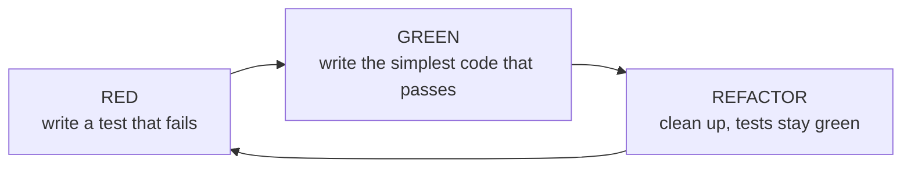

# 11 — Unit testing

**Outcomes:** ÕV5 — *mõistab ühiktestide olemust ning nende kasutamisvõimalusi* · **Time:** 2 h in class + ~2 h independent
**Before this lesson:** your project matches the end state of lesson 10 (see [what exists after each lesson](../../PROJECT.md#what-exists-after-each-lesson))
**Walkthroughs:** [Laravel](laravel.md) · [Spring Boot](spring-boot.md)

---

## Why this matters

In lesson 10 you wrote the most important code in Billable: `Money`, `TimeRounding`, the three billing
strategies and the due-date rule. If one of them is wrong, every invoice is wrong. How do you know they
are right today — and how will you know they are still right in three months, after you (or a
classmate, or an AI assistant) changed something nearby?

Clicking through the application does not scale. To check rounding by hand you would log a 16-minute
entry on a project with 15-minute rounding, open the project page and compare the amount with a
calculator. That takes two minutes. Now do it for 1-minute and 6-minute rounding, for all three billing
types, for a project that is almost at its cap… You will not do it every time you change code. Nobody
does. That is how bugs reach invoices.

A **unit test** is a small program that does this check for you, in a few milliseconds, every time.

The outcome for this lesson says *mõistab* — **understands**. Writing an assertion is easy. The skill
that makes you valuable in a team is judgement: *what* deserves a test, *which kind* of test, *which
inputs* to choose, and *what a test can and cannot prove*. In the defence you will be asked why a test
exists, not only whether it is green.

At work you will meet two kinds of codebases: those where people change code with confidence, because
the tests will tell them if something broke, and those where every change is scary. The difference is
not talent. It is tests.

---

## Today's goal

At the end of class your project has:

- unit tests for `Money`, `TimeRounding`, the three billing strategies and `DueDateCalculator`;
- data-driven tests (one test method, many rows) for the rounding and due-date boundaries;
- tests that check the error cases (invalid input throws an exception);
- a test run in CI on every push, next to the formatter check from lesson 02.

By the end you can:

- say what a unit test is and what it is not, using a class from your own project;
- explain the test pyramid and why most tests should be unit tests;
- write a test with Arrange–Act–Assert and a name that reads as a sentence;
- choose test inputs with equivalence classes and boundary value analysis;
- explain what code coverage measures and why 100 % coverage does not mean "no bugs";
- do one red–green–refactor cycle of test-driven development.

---

## Concepts

### 1. What a unit test is (and is not)

A **unit test** runs one small piece of your code — a *unit* — with inputs you choose, and checks the
result automatically. In practice a "unit" is one class or one function that does one job, like
`TimeRounding::roundUp()`.

A good unit test has four properties. Remember them as **FIRS**:

| Property | Meaning | Why it matters |
|---|---|---|
| **Fast** | Runs in milliseconds | You run the whole suite after every change, not once a day |
| **Isolated** | Needs no database, network, file system, real clock or other test | It fails for one reason only: the unit is wrong |
| **Repeatable** | Same result every time, on every machine, in any order | A red test always means a bug, never "bad luck" |
| **Self-checking** | Passes or fails by itself; nobody reads output | It can run in CI with nobody watching |

What a unit test is **not**:

- **Not a check that the page loads.** "Open `/projects/3` and see status 200" goes through routing,
  controllers, the database and Blade/Thymeleaf. That is a *feature* or *integration* test (lesson 14).
  Useful, but slower, and when it fails you do not know which part is broken.
- **Not a `dd()` / `System.out.println` that you look at.** If a human has to read the output to know
  whether it is right, it is not a test.
- **Not a copy of the implementation.** A test that calculates the expected value with the same formula
  as the code will agree with the code even when both are wrong (see section 10).

### 2. Why we write unit tests

| Benefit | What it means in Billable |
|---|---|
| **Fast feedback** | You change `CappedHourlyBilling` and know in one second whether the cap still works |
| **Regression safety** | A *regression* is a bug in something that used to work. Once a test exists for "16 minutes with 15-minute rounding is 30 minutes", that bug can never come back unnoticed |
| **Design pressure** | Code that is hard to test is usually badly designed: it does too much, or it hides its dependencies. Tests push you towards small classes with clear inputs and outputs |
| **Living documentation** | A test named `rounds_sixteen_minutes_up_to_thirty` tells a new developer the rule better than a comment, and — unlike a comment — it fails when it becomes untrue |
| **Safe refactoring** | In lesson 13 you will restructure invoice code. With tests around the calculations, you can move code around and prove that the numbers did not change |

### 3. The test pyramid

Not all tests are equal. They differ in speed, in how much of the system they run, and in how precisely
they tell you what is broken.

```
                 ▲  slower, more realistic, fewer
                / \
               /E2E\          End-to-end: a real browser clicks through the app
              /-----\         seconds per test · a handful
             /  Int. \        Integration / feature: controller + database + framework
            /---------\       ~0.1–2 s per test · dozens (lesson 14)
           /   Unit    \      One class, no framework, no database
          /-------------\     ~1 ms per test · hundreds (today)
                 ▼  faster, more precise, many
```

| Level | Runs | Typical speed | When it fails, you know… |
|---|---|---|---|
| Unit | One class, plain `new` | 1–10 ms | exactly which rule is wrong |
| Integration / feature | Several layers + real framework + database | 100 ms – 2 s | that something in a chain of classes is wrong |
| End-to-end | The whole app in a browser | several seconds | that a user-visible flow is broken — but not why |

The shape is a pyramid because **feedback speed changes how you work**. 300 unit tests run in about one
second, so you run them all the time. 300 browser tests take ten minutes, so you run them before lunch —
and by then you have forgotten which change broke them.

The pyramid is not a law. It is a default: test the *logic* with many fast unit tests, and test the
*wiring* (routes, queries, views) with fewer, slower tests.

### 4. What makes code testable

Some code is easy to unit test. Some is almost impossible. The difference is how the code gets its
inputs.

**Pure functions** are the easiest. A pure function:

1. returns a result that depends **only on its arguments**, and
2. changes nothing outside itself (no database write, no email, no global variable).

`TimeRounding::roundUp(16, 15)` is pure: it returns 30 today, tomorrow and on every computer. You can
test it with one line.

Code becomes hard to test when it **reaches out** for things instead of receiving them:

```php
// Hard to test: where do "now" and the data come from?
public function isOverdue(int $invoiceId): bool
{
    $invoice = Invoice::find($invoiceId);          // needs a database
    return now()->isAfter($invoice->due_on);       // needs the real clock
}

// Easy to test: everything comes in as an argument
public function isOverdue(CarbonImmutable $dueOn, CarbonImmutable $today): bool
{
    return $today->isAfter($dueOn);
}
```

This is why lessons 07 and 10 mattered:

- **Lesson 07 (dependency injection):** a class that receives its collaborators through the constructor
  can be built in a test with `new` and whatever collaborators the test chooses. A class that calls
  `new MailNotifier()` or `app(...)` inside a method cannot.
- **Lesson 10 (math and logic):** we pulled the calculations out of models and controllers into small
  classes — `Money`, `TimeRounding`, the strategies, `DueDateCalculator`. That is exactly the code that
  is cheap to test. Today is the pay-off.

Rule of thumb: **push decisions into pure code, keep the side effects at the edges.** The more of your
logic is pure, the more of it you can test in milliseconds.

### 5. Anatomy of a test: Arrange – Act – Assert

Every good test has three parts, in this order:

| Part | What it does | Example |
|---|---|---|
| **Arrange** | Build the inputs and the object under test | a project with rate 60 €/h |
| **Act** | Call the one method you are testing — once | `calculate($project, 90, Money::fromCents(0))` |
| **Assert** | Check the result | the amount is 90.00 € |

The two tracks side by side:

```php
// tests/Unit/Billing/HourlyBillingTest.php (excerpt)
public function test_bills_ninety_minutes_at_sixty_euros_per_hour(): void
{
    // Arrange
    $project = $this->projectWithRate(6000);
    $strategy = new HourlyBilling;

    // Act
    $amount = $strategy->calculate($project, 90, Money::fromCents(0));

    // Assert
    $this->assertEquals(Money::fromCents(9000), $amount);
}
```

```java
// src/test/java/ee/ta25/billable/billing/HourlyBillingTest.java (excerpt)
@Test
void bills_ninety_minutes_at_sixty_euros_per_hour() {
  // Arrange
  var project = ProjectTestData.hourly(6000).build();
  var strategy = new HourlyBilling();

  // Act
  var amount = strategy.calculate(project, 90, Money.fromCents(0));

  // Assert
  assertThat(amount).isEqualTo(Money.fromCents(9000));
}
```

Three habits that make tests easy to read:

1. **One behaviour per test.** "Bills 90 minutes correctly" is one behaviour. "Bills 90 minutes, ignores
   already-billed and rejects negative minutes" is three — write three tests. When a test with one
   behaviour fails, its name tells you what broke.
2. **A name that reads as a sentence.** Read it aloud with the class name in front:
   *"HourlyBilling bills ninety minutes at sixty euros per hour."* Names like `test1`, `testCalculate` or
   `itWorks` say nothing when they fail at 23:00 in CI.
3. **Obvious numbers.** Choose inputs where you can check the expected value in your head: 60 €/h and 90
   minutes → 90 €. Save the "strange" numbers for boundary tests, and explain them in the name.

The comments `// Arrange`, `// Act`, `// Assert` are optional. Use them while you learn; later a blank
line between the three parts is enough.

### 6. Assertions

An **assertion** is the line that decides pass or fail. Both tracks have many; you need few:

| Check | PHPUnit | AssertJ (Java) |
|---|---|---|
| Equal value | `assertEquals($expected, $actual)` | `assertThat(actual).isEqualTo(expected)` |
| Same value *and* type (scalars) | `assertSame(30, $minutes)` | — (Java is typed) |
| True / false | `assertTrue($x)`, `assertFalse($x)` | `assertThat(x).isTrue()` |
| Throws | `$this->expectException(X::class)` before the act | `assertThatThrownBy(() -> ...).isInstanceOf(X.class)` |
| Text contains | `assertStringContainsString('€', $s)` | `assertThat(s).contains("€")` |

Watch the argument order in PHPUnit: **expected first, actual second.** If you swap them the test still
works, but the failure message says "expected 29, got 30" when it should say the opposite — and you
lose ten minutes.

For value objects like `Money`, compare **whole objects**: `assertEquals(Money::fromCents(9000),
$amount)` (PHP compares the properties) or `isEqualTo(Money.fromCents(9000))` (a Java record has
`equals()` built in). The failure message then shows both amounts.

### 7. Choosing inputs: equivalence classes and boundary values

You cannot test every possible input — `roundUp()` accepts billions of integers. You need a small set
that finds most bugs. Two techniques do this.

**Equivalence classes.** Split all possible inputs into groups that the code *should* treat the same
way. One test per group is usually enough, because if the code handles 7 minutes correctly it almost
certainly handles 8 minutes correctly too.

**Boundary value analysis.** Bugs live at the **edges** between groups: `<` written instead of `<=`, an
off-by-one in a loop, a rounding that goes the wrong way at exactly half. So for each edge, test the
value **on** the boundary and the values **just below and just above** it.

Example — rounding up to 15-minute blocks (R5):

| Minutes | Class | Expected | Why this row |
|---|---|---|---|
| 0 | nothing worked | 0 | Lower edge: zero must stay zero, not become 15 |
| 1 | inside the first block | 15 | Smallest positive value |
| 14 | just below a boundary | 15 | |
| 15 | exactly on a boundary | 15 | Must **not** jump to 30 — the classic bug |
| 16 | just above a boundary | 30 | |

Example — the 80 % budget warning (R9), cap 100.00 €:

| Value | Percent | Warn? | Why this row |
|---|---|---|---|
| 79.99 € | 79.99 % | no | One cent below |
| 80.00 € | 80 % | **yes** | Exactly on the boundary — "reaches" means `>=` |
| 80.01 € | 80.01 % | yes | One cent above |
| 0.00 € | 0 % | no | Nothing logged |
| 120.00 € | 120 % | yes | Over the cap (possible after the cap was lowered) |

Example — due date (R12): 14 days after the issue date, moved to Monday if it falls on a weekend.
Because 14 days is exactly two weeks, the due date falls on the **same weekday** as the issue date:

| Issued on | +14 days | Expected due date | Why this row |
|---|---|---|---|
| Fri 2 Oct 2026 | Fri 16 Oct | Fri 16 Oct | Last weekday: must **not** move |
| Sat 3 Oct 2026 | Sat 17 Oct | Mon 19 Oct | +2 days |
| Sun 4 Oct 2026 | Sun 18 Oct | Mon 19 Oct | +1 day — a different distance than Saturday |
| Mon 5 Oct 2026 | Mon 19 Oct | Mon 19 Oct | First weekday after the weekend |
| Sat 19 Dec 2026 | Sat 2 Jan 2027 | Mon 4 Jan 2027 | Crosses a year boundary |

Invalid inputs are an equivalence class too: a negative number of minutes, a rounding increment of 7,
the string `"12.345"` (three decimals) for a euro amount. Decide what the code should do (usually: throw an exception) and
write a test for it. Often you discover that nobody decided — that is a real finding, not a waste of
time.

### 8. Data-driven tests

The tables above have the same shape: input → expected output. Writing five almost identical test
methods is boring and hides the table. Both frameworks let you write **one test method and a table of
rows**; the framework runs the method once per row and reports each row separately:

```php
// PHPUnit: the rows come from a public static method
#[DataProvider('roundingCases')]
public function test_rounds_up_to_the_increment(int $minutes, int $increment, int $expected): void
{
    $this->assertSame($expected, TimeRounding::roundUp($minutes, $increment));
}

public static function roundingCases(): array
{
    return [
        'zero stays zero' => [0, 15, 0],
        'exactly on a block' => [15, 15, 15],
        'one above a block' => [16, 15, 30],
    ];
}
```

```java
// JUnit 5: the rows are written in the annotation
@ParameterizedTest(name = "{0} min with {1}-min rounding -> {2} min")
@CsvSource({"0, 15, 0", "15, 15, 15", "16, 15, 30"})
void rounds_up_to_the_increment(long minutes, int increment, long expected) {
  assertThat(TimeRounding.roundUp(minutes, increment)).isEqualTo(expected);
}
```

A data-driven test **is** the boundary table. Anybody can read it and add a row. Give each row a name
(the array key in PHP, the `name` pattern in JUnit) so the failure says *which* row broke.

### 9. Testing exceptions

"Invalid input is rejected" is a behaviour, so it gets a test. The test passes only if the exception is
thrown; if the code silently returns something, the test fails.

```php
public function test_rejects_an_amount_with_three_decimals(): void
{
    $this->expectException(InvalidArgumentException::class);   // must come BEFORE the act

    Money::fromEuros('12.345');
}
```

```java
@Test
void rejects_an_amount_with_three_decimals() {
  assertThatThrownBy(() -> Money.fromEuros("12.345"))
      .isInstanceOf(IllegalArgumentException.class);
}
```

Check the exception **type**. Checking the message as well (`expectExceptionMessage`,
`.hasMessageContaining`) is useful when the message is shown to users, but makes the test break when
somebody improves the wording — use it with care.

### 10. Independence and determinism

A test is **deterministic** when it gives the same result every time. A test that passes on Monday and
fails on Saturday is worse than no test: people learn to ignore red builds.

The usual causes:

| Cause | Example | Fix |
|---|---|---|
| The current time | Due-date test calls `now()` → result depends on today's weekday | Pass the date in as an argument; lesson 12 shows how to control the clock |
| Randomness | Factory creates a random amount, test expects a specific VAT | Use fixed values in unit tests |
| Shared state | Test A changes a static variable, test B depends on it | Build fresh objects in each test |
| The database | Test expects "3 clients", another test added one | No database for pure logic; for feature tests, reset it (lesson 12/14) |
| Test order | Test B only passes if test A ran first | Every test arranges everything it needs itself |

Rule: **a unit test for pure logic never touches the clock, randomness or the database.** If you feel
you need one of them, the code under test is probably not pure yet.

**A deliberately bad test.** Read it and count the problems before you read the list:

```php
public function test_money(): void
{
    $minutes = random_int(1, 600);
    $expected = Money::fromCents(intdiv($minutes * 6000 + 30, 60));
    $project = Project::first();

    $result = (new HourlyBilling)->calculate($project, $minutes, Money::fromCents(0));

    $this->assertTrue($result->greaterThanOrEqual(Money::fromCents(0)));
}
```

1. The **name** says nothing. When it fails, what broke?
2. **Random input:** a failure cannot be reproduced.
3. The **expected value is computed with the same formula** as the production code. If the formula is
   wrong, both are wrong in the same way and the test is green. Expected values should be written as
   plain numbers you worked out by hand (90 minutes at 60 €/h is `9000` cents).
4. `Project::first()` needs a **database** and depends on whatever data is in it.
5. `$expected` is **never used**. The assertion only checks "not negative", which a method that always
   returns zero also passes.

The walkthroughs show the fixed version.

### 11. Code coverage — what it means and what it does not

**Code coverage** is a report of which lines (or branches) of your code were executed while the tests
ran. Tools: PHPUnit with Xdebug or PCOV; JaCoCo for Java.

- **Line coverage:** percentage of lines executed at least once.
- **Branch coverage:** percentage of decision outcomes executed — for every `if`, both the "true" and the
  "false" path. Branch coverage is the stricter and more useful number.

Coverage answers one question well: **"Which code has no test at all?"** A red line in the report is
code whose bugs no test will ever catch. That is valuable.

It does **not** answer "are my tests good?". Look at the bad test above: it executes every line of
`HourlyBilling`, so the coverage report shows 100 % — yet it would pass even if the rate were ignored.
Coverage measures what was *executed*, not what was *checked*.

So use coverage as a **flashlight, not a target**. Look at the red lines and ask: "Is this important? Why
is it not tested?" Sometimes the honest answer is "it is simple glue, a feature test covers it" — that is
a fine, written-down decision. Chasing 100 % leads to tests of getters and framework code that prove
nothing and slow every refactor.

A stronger check exists: **mutation testing** (Infection for PHP, PIT for Java). The tool makes small
changes to your code — `>=` becomes `>`, `+ 30` becomes `- 30` — and runs your tests. If the tests still
pass, the change "survived", which means no test really checks that line. It is slow, so it is an
advanced task this lesson.

### 12. Test-driven development: red – green – refactor

**TDD** turns the order around: you write the test *before* the code.



1. **Red.** Write one small test for behaviour that does not exist yet. Run it and **watch it fail**. The
   failure proves that the test can fail — a test that has never been red might be testing nothing.
2. **Green.** Write the simplest code that makes it pass. Not the most elegant — the simplest.
3. **Refactor.** Now improve names and structure. The tests protect you: if they stay green, you did not
   break behaviour.

Why bother? You design the method from the caller's point of view (its name, arguments and result)
before you think about the inside. And you never have untested code, because no code is written without
a failing test first. In the walkthrough we do one short cycle: `Money::sum()`, which adds any number of amounts.

You do not have to use TDD for everything. It works best exactly where Billable has its hardest code:
calculations with clear inputs and outputs.

### 13. When NOT to write a unit test

Unit tests cost time to write and to maintain. Do not write them where they add nothing:

| Code | Unit test? | Why |
|---|---|---|
| `Money`, `TimeRounding`, strategies, `DueDateCalculator` | **Yes** | Pure logic, many edge cases, bugs cost real money |
| `BudgetMonitor` decision "reached 80 %?" | **Yes**, after extracting a pure method | The threshold is a boundary rule |
| A thin controller that calls a service and redirects | No — a feature test (lesson 14) | Its job is wiring; a unit test would only repeat the code |
| Eloquent relations, JPA mappings, migrations | No — integration test | The interesting part is the database, which a unit test does not have |
| Getters, setters, constructors without logic | No | They cannot be wrong in an interesting way |
| Framework code (routing, validation engine, ORM) | No | The framework authors test it; you test *your* configuration of it in feature tests |

### 14. Tests in CI

Since lesson 02, CI (GitHub Actions) runs the formatter on every push. Today it also runs the tests. From
now on, a pull request with a red test cannot be "fine, it works on my machine". CI builds a fresh
machine every time, so it also catches tests that depend on your local database or your time zone.

- **Laravel:** a new `tests` job in the workflow runs `php artisan test`.
- **Spring Boot:** CI already runs `./mvnw verify`, and `verify` includes the `test` phase — your new
  tests run automatically.

---

## Laravel vs Spring Boot

| Idea | Laravel | Spring Boot |
|---|---|---|
| Test framework | PHPUnit | JUnit 5 API (Boot 4 ships JUnit 6, same annotations) + AssertJ |
| Where unit tests live | `tests/Unit`, extend `PHPUnit\Framework\TestCase` | `src/test/java`, same package as the class |
| Mark a test | Method name starts with `test_` (or `#[Test]`) | `@Test` |
| Data-driven | `#[DataProvider('method')]` + `public static` method; for a few short rows `#[TestWith([0, 15, 0])]` on the test itself | `@ParameterizedTest` + `@CsvSource` / `@MethodSource` |
| Group tests | Separate test classes | `@Nested` inner classes |
| Expect exception | `$this->expectException(X::class)` | `assertThatThrownBy(() -> ...)` |
| Run all | `php artisan test` | `./mvnw test` |
| Run one | `php artisan test --filter=MoneyTest` | `./mvnw test -Dtest=MoneyTest` |
| Coverage | `php artisan test --coverage` (needs Xdebug or PCOV) | JaCoCo Maven plugin → `target/site/jacoco/index.html` |
| Mutation testing | Infection | PIT (pitest) |

---

## Common mistakes

| Mistake | Why it hurts | What to do instead |
|---|---|---|
| Laravel: unit test extends `Tests\TestCase` | Boots the whole framework for every test — slow, and hides dependencies | Extend `PHPUnit\Framework\TestCase` in `tests/Unit` |
| Spring: `@SpringBootTest` on a test of `Money` | Starts the whole application and the database for a pure calculation | Plain JUnit class, `new Money...` |
| Expected value calculated with the production formula | Test agrees with the bug | Write expected values as literal numbers you worked out by hand |
| Only happy-path tests | The bugs are at the boundaries | Equivalence classes + boundary table for every rule |
| Test calls `now()` / `LocalDate.now()` | Fails on some days, or in another time zone | Pass the date in; control the clock (lesson 12) |
| Several behaviours in one test | When it fails you don't know which one broke; later asserts never run | One behaviour per test, or a data-driven table |
| Test named `test1`, `testCalculate` | Failure message says nothing | Name the behaviour: `caps_the_amount_at_the_remaining_budget` |
| Swapped `assertEquals` arguments | Confusing failure messages | Expected first, actual second |
| Chasing 100 % coverage | Tests of getters; brittle suite; false confidence | Use coverage to find untested *important* code |
| Never seeing the test fail | It may test nothing (wrong method, missing assert) | Break the code on purpose once, watch it go red |
| Old tutorial syntax (`@dataProvider` doc comment, `@MockBean`, JUnit 4 `@Before`) | Removed or deprecated in current versions | Attributes in PHPUnit 11+, JUnit 5 annotations |

---

## Independent work (~2 h)

Solutions are at the bottom of the [Laravel](laravel.md#independent-work--solutions) and
[Spring Boot](spring-boot.md#independent-work--solutions) walkthroughs.

### Task 1 — 15+ meaningful unit tests (Basic)

Bring your unit test suite to **at least 15 meaningful tests** (a data-driven row counts as one test only
if it covers a different class or boundary).

Acceptance criteria:

- [ ] Every billing type is tested **at its boundaries**:
  - Hourly: 0 minutes; an amount that lands exactly on half a cent (rounds up); ignores already-billed.
  - Capped: remaining budget below, equal to and above the hourly amount; already over the cap → zero.
  - Fixed: nothing billed yet; partly billed; exactly fully billed; over-billed → zero; minutes do not
    matter.
- [ ] `Money`, `TimeRounding` and `DueDateCalculator` each have at least one error-case or boundary
      test.
- [ ] All tests are in the unit test folder and use no database, no clock and no framework boot.
- [ ] Names read as sentences. Arrange–Act–Assert is visible.
- [ ] The suite is green locally and in CI.

### Task 2 — Boundary table for the 80 % rule (Basic)

The decision "has this capped project reached 80 % of its cap?" is currently hidden inside
`BudgetMonitor`, next to database and notifier code, so you cannot unit test it. Extract it.

Acceptance criteria:

- [ ] `BudgetMonitor` has a pure, static method `reachedThreshold(Money value, Money cap): bool`
      (Laravel `BudgetMonitor::reachedThreshold()`, Spring `BudgetMonitor.reachedThreshold()`), and
      `check()` uses it.
- [ ] The method uses **exact integer** comparison. (Hint: think about what happens to a cap of 9.99 €
      if you first calculate 80 % of it and round.)
- [ ] One data-driven test with at least these rows: 0 %, 79.99 %, exactly 80 %, 80.01 %, 100 %, over
      100 %, and one row with an odd cap (9.99 €) where rounding would give the wrong answer.
- [ ] The budget warning still works in the application (check in Mailpit).

### Task 3 — Coverage report and a written judgement (Intermediate)

Acceptance criteria:

- [ ] You generate an HTML coverage report (Laravel: Xdebug or PCOV; Spring: JaCoCo).
- [ ] You write `docs/testing.md` (English) with: how to run the tests and the coverage report; the
      coverage percentage of the `Support`/`common` and `Billing`/`billing` code; **two or three things
      that are not unit tested and why** (a reason, not "no time").
- [ ] The report folder is in `.gitignore` (do not commit generated files).

### Task 4 — Mutation testing (Advanced)

Acceptance criteria:

- [ ] You run Infection (Laravel) or PIT (Spring) on the `Support`/`common` and `Billing`/`billing`
      classes only.
- [ ] In `docs/testing.md` you note the mutation score, show **one surviving mutant** (what was changed)
      and either add a test that kills it or explain why it is harmless (an *equivalent mutant*).

---

## Self-check

1. Name the four FIRS properties and give a Billable example of a test that breaks one of them.
2. Why should most tests be unit tests? What would you lose if all tests were end-to-end tests?
3. Which of these is a pure function: `TimeRounding::roundUp()`, `BudgetMonitor::check()`,
   `DueDateCalculator::dueDate()`? Why?
4. For the rule "an entry may be at most 12 hours long", which inputs would you test and why?
5. Your coverage report says 100 % for `CappedHourlyBilling`. Can there still be a bug? How?
6. What is the point of watching a new test fail before you make it pass?
7. Why is it a bad idea to compute the expected value with the same formula as the code?
8. Give one piece of Billable code you would *not* unit test, and say how you would test it instead.

<details>
<summary>Answers</summary>

1. Fast, Isolated, Repeatable, Self-checking. A test that reads the first project from the database is
   not isolated; a due-date test that calls `now()` is not repeatable; a test that prints the amount for a
   human to read is not self-checking; a test that sends a real email is not fast (and not isolated).
2. Unit tests are fast and tell you exactly which rule is broken. With only end-to-end tests the suite
   would take minutes, you would run it rarely, and a failure would only say "the invoice page shows the
   wrong total" — not which of ten classes is wrong. You would also struggle to reach edge cases (half a
   cent, 15 vs 16 minutes) through a browser.
3. `roundUp()` and `dueDate()` are pure — the result depends only on the arguments and nothing outside
   changes. `check()` is not: it reads the database, may send a notification and writes
   `budget_warning_sent_at`.
4. Equivalence classes: valid length, too long, end before start. Boundaries: exactly 12 h (valid), 12 h
   1 min (invalid), 1 minute (valid), 0 minutes / end equals start (invalid), end before start (invalid).
5. Yes. Coverage only proves the lines ran. If the assertions are weak (for example "result is not
   negative"), or a boundary like "remaining budget exactly equals the hourly amount" is never used as
   input, a `<` vs `<=` bug survives with 100 % coverage.
6. It proves that the test can fail, i.e. that it really checks the behaviour. A test that has never been
   red may call the wrong method or have no effective assertion.
7. If the formula is wrong, the test repeats the same mistake and stays green. Expected values should be
   independent — worked out by hand from the rule.
8. For example the `ClientController::store()` method: it only validates (framework), calls the service
   and redirects. A feature test that posts the form and checks the redirect and the database row is more
   useful than a unit test that mocks everything.

</details>

---

## Checklist

- [ ] `tests/Unit` (Laravel) or `src/test/java/...` (Spring) contains tests for `Money`, `TimeRounding`,
      all three billing strategies and `DueDateCalculator`.
- [ ] At least 15 meaningful unit tests; boundaries and error cases included.
- [ ] At least two data-driven tests (rounding, due date or 80 % threshold).
- [ ] No unit test boots the framework, uses the database or reads the current time.
- [ ] `php artisan test` / `./mvnw test` is green locally **and** in CI.
- [ ] `BudgetMonitor::reachedThreshold()` extracted and tested with a boundary table.
- [ ] You can explain, with your own code, the difference between a unit test and an integration test,
      and what coverage does and does not tell you. (ÕV5 — *mõistab ühiktestide olemust*)

---

## Further reading

- [Laravel — Testing: Getting Started](https://laravel.com/docs/testing)
- [PHPUnit Manual](https://docs.phpunit.de/)
- [JUnit User Guide](https://docs.junit.org/current/user-guide/)
- [AssertJ documentation](https://assertj.github.io/doc/)
- [JaCoCo documentation](https://www.jacoco.org/jacoco/trunk/doc/)
- [Infection PHP](https://infection.github.io/)
- [PIT mutation testing](https://pitest.org/)
- [Martin Fowler — The Practical Test Pyramid](https://martinfowler.com/articles/practical-test-pyramid.html)
