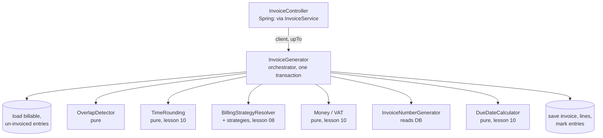
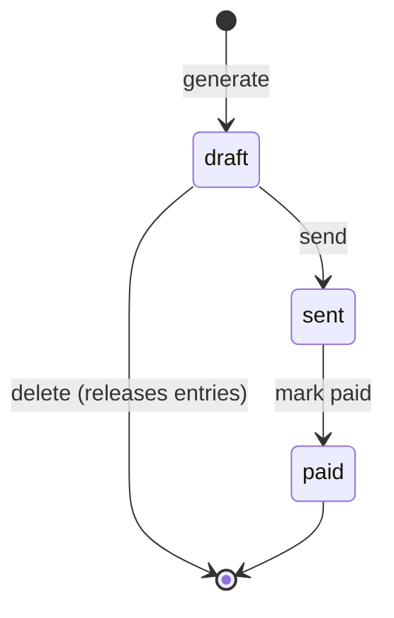

# 13 — A complex component: invoice generation

**Outcomes:** ÕV8 — *loob suurema keerukusastmega rakendusi, kasutades ka matemaatiliselt ja loogiliselt keerukamaid algoritme ja rakenduse osiseid* · ÕV2 — *kasutab rakenduste koostamisel matemaatika- ja loogikafunktsioone* · **Time:** 2 h in class + ~2 h independent
**Before this lesson:** your project matches the end state of lesson 12 (see [what exists after each lesson](../../PROJECT.md#what-exists-after-each-lesson))
**Walkthroughs:** [Laravel](laravel.md) · [Spring Boot](spring-boot.md)

---

## Why this matters

Until now every feature in Billable was small: one form, one table, one calculation. Invoice generation
is different. It is the feature that uses **everything** you have built: time entries, rounding, billing
strategies, `Money`, VAT, the due-date rule and the clock. If one piece is wrong, the number on the
invoice is wrong, and an invoice is a legal document. You cannot "fix it in the next release" once the
client has paid it and the accountant has filed it.

This is also the feature the defence goes straight to. "Generate an invoice for a client from real
entries" is the first thing in the demo, and questions like *"What happens if two entries overlap?"* or
*"Why is VAT calculated here and not per line?"* are exactly what the teacher will ask.

At work you will meet the same shape of problem again and again: payroll runs, order checkout, stock
reservations, month-end reports. They all look like this:

- many rules that depend on each other,
- the result must be correct, not approximately correct,
- the work must happen completely or not at all.

Learning how to split such a feature into small, testable pieces is the main skill of this lesson.

## Today's goal

At the end of class your application can generate a real invoice. You choose a client and a date, press
a button, and Billable:

1. collects all billable, not yet invoiced time entries of that client up to that date,
2. refuses if two of them overlap in time, and tells you which two,
3. rounds every entry, groups the entries by project and prices each project with its billing strategy,
4. adds VAT once on the subtotal,
5. gives the invoice the next number of the year and a due date,
6. saves everything and marks the entries as invoiced — in one transaction.

By the end you can:

- explain what makes a component "complex" and how to split it into pure pieces and one orchestrator,
- explain the overlap-detection algorithm, its complexity, and why touching entries are allowed,
- explain why VAT is calculated once on the subtotal, and show the difference in cents,
- draw the invoice status state machine and say which transitions are allowed,
- explain what a transaction guarantees and what must be inside it,
- write `docs/algorithm.md` for your own component.

---

## Concepts

### 1. What makes a component "complex"?

"Complex" does not mean "long" or "clever". A component is complex when several of these are true:

| Property | In invoice generation |
|---|---|
| **Many rules interact.** Changing one rule changes the result of another. | Rounding (R5) changes the minutes, the minutes change the hourly amount (R6), the amount changes what the cap allows (R7), the subtotal changes the VAT (R3). |
| **All-or-nothing.** A half-finished result is worse than no result. | An invoice without lines, or lines without the entries marked as invoiced, would bill the same hours twice next month. |
| **Correctness matters more than speed.** | Nobody cares if generation takes 200 ms. Everybody cares if it is one cent wrong. |
| **Inputs can be inconsistent.** | Two entries can overlap. There can be nothing to invoice. A fixed-price project can be fully billed already. |
| **The result has legal meaning.** | Invoice numbers must have no gaps and no duplicates (R11). A sent invoice must not change (R13). |

A CRUD form has none of these properties. That is why ÕV8 asks for a component like this one.

### 2. Decompose: small pure pieces plus one orchestrator

The worst way to build this feature is one 200-line method in a controller. You cannot test it without
a database, you cannot read it, and every change risks breaking a rule you forgot about.

The better way is to split the work into **small pieces that each do one thing**, and **one
orchestrator** that calls them in the right order.



A **pure** function is one whose result depends only on its arguments, and which changes nothing
outside itself. It does not read the clock, the database or a file. `TimeRounding::roundUp(70, 15)`
returns `75` today, tomorrow and on every machine. Pure pieces are easy to test (lesson 11): no
database, no mocks, milliseconds per test.

The **orchestrator** (`InvoiceGenerator`) has no clever logic of its own. It loads data, calls the pieces
in order, and saves the result. Reading it should feel like reading the list in "Today's goal". This
split gives you:

| Benefit | Why |
|---|---|
| Each rule lives in one place | "Where is rounding done?" has one answer: `TimeRounding`. |
| Each piece is tested alone | The overlap algorithm gets 10 data-driven test cases; the orchestrator gets one or two bigger tests. |
| The orchestrator is readable | It reads like the business process. |
| Pieces are reused | `OverlapDetector` could also check a new entry when it is saved. |

Most of these pieces already exist. Today we write three new ones (`OverlapDetector` with its `TimeSlot`
value object, `InvoiceNumberGenerator`, `InvoiceGenerator`), plus `InvoiceService` for send / mark paid /
delete, and the models and pages around them.

### 3. The algorithm: overlap detection (R10)

**The problem.** You are one person. You cannot work on two things at the same time. If two time entries
overlap, at least one of them is wrong, and billing both would overcharge the client. Rule R10 says: do
not generate the invoice, and name both entries so the user can fix them.

**When do two intervals overlap?** Entry A runs from `A.start` to `A.end`, entry B from `B.start` to
`B.end`. They overlap when each one starts before the other one ends:

```
A.start < B.end   AND   B.start < A.end
```

Note the strict `<`. If A ends at 10:00 and B starts at 10:00, they **touch** but do not overlap. That
is normal: you finish one task and start the next one in the same minute. Treating touching entries as an
overlap would reject almost every real time sheet.

```
A: 09:00 |-------| 10:00
B:               10:00 |-------| 11:00      touching  → OK
C:          09:30 |--------| 10:30          overlaps A and B → error
```

#### The naive approach: compare every pair — O(n²)

The obvious solution is to compare each entry with every other entry:

```
for i in 0 .. n-1
    for j in i+1 .. n-1
        if overlaps(entries[i], entries[j]) → return (i, j)
```

It is correct and easy to read. The problem is the number of comparisons. With `n` entries there are
`n × (n − 1) / 2` pairs. Double the entries and the work grows four times.

#### The better approach: sort, then one sweep — O(n log n)

1. **Sort** the entries by start time (and by end time when two start at the same moment).
2. **Walk through them once**, from the earliest to the latest. Remember the entry with the **latest
   end time seen so far** — call it `latest`.
3. For each next entry: if it starts **before** `latest` ends, those two overlap. Stop and report both.
4. Otherwise, if this entry ends later than `latest`, it becomes the new `latest`.

```
sort entries by (start, end)
latest = none
for each entry in sorted order
    if latest exists and entry.start < latest.end → return (latest, entry)
    if latest is none or entry.end > latest.end   → latest = entry
return none
```

**Why this finds every overlap.** Suppose two entries X and Y overlap and X starts first (so X comes
first in the sorted list). When the loop reaches Y, `latest` is the entry with the latest end among
everything before Y — and X is one of those, so `latest.end ≥ X.end`. X and Y overlap, so
`Y.start < X.end ≤ latest.end`. The test `entry.start < latest.end` is therefore true, and the loop
stops. It may report `latest` instead of X, but that is also a real overlap: `latest` started no later
than Y and ends after Y starts. So **if any overlap exists, the sweep reports a real one**. If none
exists, the test is never true and it returns "none".

**Why the latest end and not just the previous entry?** For "is there at least one overlap?" comparing
neighbours happens to be enough. But a long entry can "hide" behind shorter ones, and as soon as you want
to continue the scan (for example to list *every* conflicting entry, see the self-check), only the
latest-end rule stays correct. Look at E5 in the example below: its neighbour E4 ends at 14:00, but E3
is still running until 17:00.

#### Step-through

Input (in the order the database returned it, not sorted):

| Entry | Start | End | Description |
|---|---|---|---|
| E3 | Mon 13:00 | 17:00 | API integration |
| E1 | Mon 09:00 | 10:00 | Standup and planning |
| E5 | Mon 16:00 | 16:30 | Code review |
| E2 | Mon 10:00 | 12:00 | Homepage layout |
| E4 | Mon 13:30 | 14:00 | Client call |

After sorting by start: E1, E2, E3, E4, E5.

| Step | Entry | Its start | `latest` before the step | `start < latest.end`? | Action |
|---|---|---|---|---|---|
| 1 | E1 | 09:00 | none | — | `latest` = E1 (ends 10:00) |
| 2 | E2 | 10:00 | E1, ends 10:00 | 10:00 < 10:00? **No** (touching) | E2 ends later → `latest` = E2 (12:00) |
| 3 | E3 | 13:00 | E2, ends 12:00 | 13:00 < 12:00? No | `latest` = E3 (17:00) |
| 4 | E4 | 13:30 | E3, ends 17:00 | 13:30 < 17:00? **Yes** | **Stop: E3 and E4 overlap** |
| (5) | E5 | 16:00 | E3, ends 17:00 | 16:00 < 17:00? Yes | (only reached if we continued; E4 ends 14:00, so E3 stays `latest`) |

The error message then says: *"Entries overlap: 'API integration' (Mon 13:00–17:00) and 'Client call'
(Mon 13:30–14:00)."*

#### Big-O in plain words

**Big-O** describes how the amount of work grows when the input grows. It ignores constant factors
("each comparison takes 3 ns") and keeps only the shape of the growth.

| Notation | Plain words | Example |
|---|---|---|
| O(1) | the same work, whatever the size | reading one array element |
| O(n) | twice the data, twice the work | one loop over the entries |
| O(n log n) | a bit more than linear | a good sort (PHP `usort`, Java `List.sort`) |
| O(n²) | twice the data, four times the work | a loop inside a loop over the same data |

Sorting costs about `n × log₂ n` comparisons, and the sweep adds `n − 1` more. The naive version needs
`n × (n − 1) / 2`.

| Entries (n) | Naive pairs, n(n−1)/2 | Sort + sweep, ≈ n·log₂n + n | Naive is … times more work |
|---|---|---|---|
| 100 | 4,950 | ≈ 760 | ≈ 7 |
| 1,000 | 499,500 | ≈ 11,000 | ≈ 45 |
| 10,000 | 49,995,000 | ≈ 143,000 | ≈ 350 |

Measured on the teacher's laptop (PHP 8.4, no overlap in the data, so both versions must look at
everything): 10,000 entries took about **3.9 seconds** with the naive version and about **17 ms** with
sort + sweep. A freelancer has maybe 60 entries a month, so both are fast enough here. We still use the
sweep because it costs no more code, it is the standard technique for interval problems (calendar
clashes, room bookings, shift planning), and you must be able to explain the difference. The advanced
independent task asks you to measure this yourself.

**Space:** the sweep needs a sorted copy of the list, so O(n) extra memory. That is fine.

### 4. Invoice numbering (R11)

Invoice numbers look like `2026-0001`, `2026-0002`, … They restart every year. Rule R11 says **no gaps
and no duplicates**. Why so strict?

- **Legal.** The Estonian Accounting Act and the VAT rules require invoices to be numbered so that every
  invoice can be identified and the series can be checked. A tax auditor who sees `2026-0041` and then
  `2026-0043` will ask where `0042` went. A missing number looks like a hidden, unreported sale.
- **Practical.** Two invoices with the same number break the client's accounting software and your own
  bookkeeping. Payments are matched to invoices by number.

**Today's approach — "max + 1":**

1. Find the largest number that starts with `2026-`.
2. Take the part after the dash (`0041` → `41`) and add one (`42`).
3. Pad it to four digits: `2026-0042`. If nothing exists yet, start at `0001`.

Because the numbers are zero-padded to the same length, comparing them as text gives the same order as
comparing them as numbers (`"2026-0010" > "2026-0009"`). That is why `MAX(number)` works.

This runs **inside the same transaction** as saving the invoice. If saving fails, the number is never
used, so no gap appears. However, this approach has a known weakness: if two people generate an invoice
at the same moment, both can read the same maximum and both get `2026-0042`. The `UNIQUE` constraint on
`invoices.number` stops the second save, so no duplicate reaches the database — but the second user gets
an error. **Lesson 14 shows this race and fixes it properly.** For today, knowing the weakness and
having the unique constraint is enough.

### 5. VAT: once on the subtotal, not per line (R3)

Rule R3 says: round once, at the point where a fraction appears. VAT is a percentage, so it creates a
fraction. Where should it be calculated?

Example: three lines of 10.05 € each, VAT 24 %.

| | Per line | Once on the subtotal |
|---|---|---|
| VAT per line | 10.05 × 0.24 = 2.412 → **2.41** (×3) | — |
| Subtotal | 30.15 | 30.15 |
| VAT | 2.41 + 2.41 + 2.41 = **7.23** | 30.15 × 0.24 = 7.236 → **7.24** |
| Total | 37.38 | 37.39 |

One cent different. It sounds small, but the rounding errors of per-line VAT add up across many lines,
and the VAT on the invoice no longer equals "24 % of the subtotal" — which is the first thing an
accountant checks. So we calculate VAT once, from the subtotal, with the integer formula from lesson 10:
`(subtotalCents × 2400 + 5000) / 10000`, which is `Money::percentageBp(2400)`.

The VAT rate is stored on the invoice (`vat_rate_bp = 2400`, R2) because rates change. An invoice from
2024 must still show the 22 % it was issued with.

### 6. The invoice status: a state machine (R13)

An invoice is not just data; it has a **life cycle**. A **state machine** is a model with a fixed set of
states and a fixed set of allowed moves (transitions) between them. Everything not listed is forbidden.



| From \ To | draft | sent | paid |
|---|---|---|---|
| **draft** | — | ✅ send | ❌ |
| **sent** | ❌ | — | ✅ mark paid |
| **paid** | ❌ | ❌ | — |

| State | Can edit or delete? | Why |
|---|---|---|
| draft | yes | Nobody outside has seen it. Deleting it puts its entries back into "not invoiced". |
| sent | no | The client has a copy. Changing ours would make the two copies disagree. Mistakes are fixed with a credit note (a capstone extension). |
| paid | no | Money has moved. |

Why write this as a state machine and not as `if` statements scattered in controllers? Because then the
rules live in **one place** — the `InvoiceStatus` enum with `canEdit()` and `canTransitionTo()` — and
every button, controller action and test asks the same question. When a new state such as `cancelled`
arrives, you change one enum and one table.

### 7. Transactions: all or nothing

A **database transaction** is a group of SQL statements that the database treats as one unit. Either
all of them take effect (`COMMIT`), or none of them do (`ROLLBACK`). Other users never see the
half-finished state.

Invoice generation writes to three tables. Imagine it fails half-way:

| Failure after … | Without a transaction | With a transaction |
|---|---|---|
| saving the invoice row | an empty invoice with a number exists → a gap or a useless document | nothing saved |
| saving the lines | an invoice exists but the entries are not marked → next month they are billed **again** | nothing saved |
| marking half the entries | some hours billed twice, some never | nothing saved |

So **everything** that reads or writes invoice data goes inside one transaction:

```
BEGIN
  load the un-invoiced entries          ← inside, so lesson 14 can lock them
  check overlaps, price the lines        (pure work — no harm being inside)
  read max number, compute next number   ← inside, so a failed save uses no number
  INSERT invoice, INSERT lines
  UPDATE time_entries SET invoice_id = …
COMMIT                                   ← any exception before this → ROLLBACK
```

In Laravel that is `DB::transaction(function () { ... })`; in Spring it is `@Transactional` on the
public method. In both, an exception thrown inside rolls everything back automatically. This is also
why domain errors such as "entries overlap" are **exceptions**: throwing one is the simplest way to say
"stop and undo".

What does **not** belong inside: sending an e-mail or calling an external API. A transaction can be
rolled back; an e-mail cannot be unsent. (Our generator sends nothing, so this does not come up today.)

### 8. Error messages that explain *why*

Compare these two messages:

- *"Invoice could not be generated."*
- *"Cannot generate the invoice: entry #12 "API integration" (29.09.2026 13:00–17:00) overlaps entry #14
  "Client call" (29.09.2026 13:30–14:00). Fix one of the entries and try again."*

The second one tells the user **what** is wrong, **where**, and **what to do**. Rule R10 demands it: the
error names both entries. This is why `OverlapDetector` returns the *pair* of conflicting entries instead
of just `true`, and why the exception is built from that pair. Good error reporting is part of the
algorithm, not decoration.

Our domain errors, in both tracks. They all extend one abstract `InvoicingException`:

| Exception | When | What the user sees |
|---|---|---|
| `NothingToInvoiceException` | no billable, un-invoiced entries up to that date | "Client X has no billable, un-invoiced time entries up to 30.09.2026." |
| `OverlappingEntriesException` | R10 | both entries with date, times and description |
| `InvalidStatusTransitionException` | e.g. "mark paid" on a draft | "An invoice cannot go from draft to paid." |
| `InvoiceNotEditableException` | delete a sent invoice (R13) | "Invoice 2026-0001 is sent. Only draft invoices can be changed or deleted." |
| `TimeEntryLockedException` | edit or delete an entry that is on an invoice (R14) | "Time entry #12 is on an invoice and cannot be changed. …" |

The controller catches `InvoicingException` and shows the message on the page. It does not catch everything: a
database failure is not something the user can fix, so it should produce a normal error page and a log
entry.

### 9. Design decisions you should be able to defend

| Question | Our choice | Why |
|---|---|---|
| Which entries? | billable, `invoice_id IS NULL`, belonging to the client's projects, `ended_at` ≤ end of the chosen day | An entry that is still running on that day belongs to the next invoice. |
| Internal projects (lesson 08 Null Object)? | their entries are not loaded at all | They are never billed, so they must not appear on an invoice or be locked by R14. |
| One line per …? | per project | The client wants to see "Website redesign — 12 h 30 min", not 40 separate entries. |
| Round per entry or per project sum? | per entry (R5), then sum | R5 says each entry is rounded. 3 × 5 min rounded to 15 = 45 min, not 15. |
| `alreadyBilled` for capped/fixed? | sum of this project's existing invoice lines | That is what R7 and R8 mean by "billed so far". |
| A line with 0 minutes **and** 0 €? | skipped | It tells the client nothing. |
| A line with minutes but 0 € (fixed project already fully billed)? | kept | It shows the work was done and included, and the entries are still linked to this invoice so they never appear again. |
| An invoice with total 0 €? | allowed | Rare, but honest. Your `docs/algorithm.md` should mention it. |

### 10. Writing `docs/algorithm.md`

Every complex component deserves one page that a new team member can read in five minutes. It is also
evidence for ÕV8 in your capstone. Use this structure:

```markdown
# Algorithm: overlap detection in invoice generation

## Problem
What goes in, what comes out, which rule (R10) it enforces.

## Approach
Sort by (start, end), single sweep keeping the entry with the latest end.
A short pseudocode block and one worked example.

## Why it is correct
Two or three sentences (the argument from this lesson, in your words).

## Complexity
Time O(n log n) — sort dominates. Space O(n) for the sorted copy.

## Rejected alternative
Pairwise comparison, O(n²): simpler, but 350× more work at 10,000 entries …

## Edge cases
Touching entries, identical start times, nested entries, one entry, no entries, …
```

Write it in your own words. "I copied the lesson" is not a rejected alternative.

---

## Laravel vs Spring Boot

| Idea | Laravel | Spring Boot |
|---|---|---|
| Transaction | `DB::transaction(fn () => …)` | `@Transactional` on a public service method |
| Roll back on error | any exception thrown in the closure | any `RuntimeException` (unchecked) by default |
| One-to-many with children saved together | `$invoice->lines()->createMany([...])` | `@OneToMany(mappedBy, cascade = ALL, orphanRemoval = true)` + `addLine()` |
| Enum stored as lowercase text | backed enum + `casts()` | `@Enumerated(EnumType.STRING)` + `@EnumeratedValue` on the enum |
| Mark many rows at once | `TimeEntry::whereKey($ids)->update([...])` | change each managed entity; Hibernate flushes at commit |
| "Today" | `today()` (controlled with `travelTo()` in tests) | `LocalDate.now(clock)` with the injected `Clock` |
| Domain exception | `extends DomainException` | `extends RuntimeException` |

---

## Common mistakes

| Mistake | Why it hurts | What to do instead |
|---|---|---|
| All logic in the controller | Untestable without HTTP and a database; controller becomes 200 lines | Controller calls one service method; the service calls pure pieces |
| `start <= other.end` in the overlap check | Touching entries (10:00–10:00) are reported as overlaps | Use strict `<` on both sides |
| Sorting the caller's array in place | The caller's data changes order behind its back | Sort a copy (PHP arrays are copied on write; in Java use `stream().sorted()`) |
| VAT per line, then summed | Totals disagree with "24 % of subtotal" by cents | VAT once on the subtotal |
| Rounding the project's total minutes instead of each entry | Violates R5; bills less than the rule says | Round each entry, then sum |
| Number generated outside the transaction | A failed save "uses up" a number → a gap | Generate the number inside the same transaction |
| Forgetting to mark entries as invoiced | The same hours appear on next month's invoice | Set `invoice_id` inside the same transaction |
| Catching every exception in the controller and showing "Something went wrong" | The user cannot fix it; real bugs are hidden | Catch only your domain exceptions; let real errors reach the error page and the log |
| Deleting a draft without releasing entries | Entries stay linked to a deleted invoice (or the delete fails on the foreign key) | Set `invoice_id = NULL` on its entries first, in one transaction |
| Checking status with `if ($invoice->status === 'draft')` in many places | Rules drift apart; a new state breaks everything | Ask the enum: `canEdit()`, `canTransitionTo()` |

---

## Independent work (~2 h)

Solutions are at the bottom of the [Laravel](laravel.md#independent-work--solutions) and
[Spring Boot](spring-boot.md#independent-work--solutions) walkthroughs.

### Task 1 — Complete the status transitions (Basic)

The class version has "send" and "mark paid" buttons. Make the rules complete and prove them.

- `Invoice` has one method `transitionTo(InvoiceStatus $to)` that changes the status only if
  `canTransitionTo()` allows it, and otherwise throws `InvalidStatusTransitionException` with a message
  that names both states.
- A data-driven unit test (data provider / `@ParameterizedTest`) covers **all 9** from/to combinations of
  `canTransitionTo()`, and another covers `canEdit()` for all three states.
- The show page only offers buttons for allowed transitions.

**Acceptance:** 12 test cases green; posting "mark paid" on a draft (e.g. with a hand-made form or a test)
shows the error message and changes nothing.

### Task 2 — Write `docs/algorithm.md` (Basic)

Write the document described in concept 10 for the overlap detection in **your** project: problem,
approach, why it is correct, complexity, one rejected alternative with a real reason, and at least five
edge cases, each linked to the unit test that covers it.

**Acceptance:** a classmate who has not seen your code can explain the algorithm after reading it.

### Task 3 — Discount with largest-remainder allocation (Intermediate)

The client negotiated a discount. The create form gets an optional field "Discount %" (a whole number
0–100). It is stored on the invoice in basis points (`discount_bp`: 5 % = `500`), and each line stores
its share in `discount_cents`. Both are new columns, added with a migration.

- The discount is calculated once on the subtotal: `discount = subtotal.percentageBp(discountBp)`.
- It is shown on every line, so that the lines still add up exactly. Spread it over the lines in
  proportion to their amounts with the **largest remainder method**: implement
  `Money::allocate(array $ratios): array` (Java `List<Money> allocate(long... ratios)`).
- VAT is calculated on the subtotal **after** the discount.

**Largest remainder method, in plain words:** to split 1.00 € in the ratio 1 : 1 : 1, give everyone the
rounded-down share (0.33 each, 0.99 in total), then hand out the missing cents one by one to the parts
whose rounded-down share lost the most (the largest remainders). Result: 0.34, 0.33, 0.33 — the parts
always add up to exactly the total.

**Acceptance:** unit tests for `allocate` (equal split, uneven ratios, a zero ratio, total smaller than
the number of parts, sum always equals the original); an invoice with discount where
`sum(line discounts) == invoice discount` to the cent.

### Task 4 — Measure naive vs sweep (Advanced)

Generate 10,000 non-overlapping time slots in memory (shuffled), and time the naive pairwise version and
the sort + sweep version for n = 100, 1,000 and 10,000.

**Acceptance:** a table in `docs/algorithm.md` with your measured times, a sentence on whether the
growth matches O(n²) and O(n log n), and a note on why the test data has no overlaps (hint: what does an
early `return` do to the naive version's timing?).

---

## Self-check

1. Entry A runs 09:00–10:00 and entry B 10:00–11:00. Do they overlap? Why is that the right answer?
2. Why do we sort before the sweep, and what does sorting cost?
3. The sweep compares each entry with the entry that has the *latest end so far*. Give an example where
   comparing with the previous entry only would miss a conflict if we kept scanning.
4. An invoice has lines of 10.05 €, 10.05 € and 10.05 €. What is the VAT, and why not 7.23 €?
5. Why must the invoice number be generated inside the same transaction as the invoice is saved?
6. A user tries to delete a sent invoice. What should happen, and which rule says so?
7. What happens to the time entries when a draft invoice is deleted?
8. Why does `OverlapDetector` not use the database, and what do we gain from that?

<details>
<summary>Answers</summary>

1. No. They touch: A ends exactly when B starts. The overlap test uses strict `<` (`A.start < B.end` and
   `B.start < A.end`); `10:00 < 10:00` is false. Finishing one task and starting the next in the same
   minute is normal work.
2. After sorting, any entry that could overlap the current one has already been seen, so one pass is
   enough. Sorting costs O(n log n), which dominates the O(n) sweep.
3. E3 13:00–17:00, E4 13:30–14:00, E5 16:00–16:30. E5's previous entry E4 ends at 14:00, so "previous
   only" says E5 is fine, but E5 overlaps E3. The latest end seen so far is still 17:00, so the sweep
   catches it.
4. 7.24 €. VAT is calculated once on the subtotal 30.15 € (30.15 × 0.24 = 7.236 → 7.24). Per-line VAT
   rounds three times (2.41 × 3 = 7.23) and disagrees with "24 % of the subtotal".
5. If the save fails, the transaction rolls back and the number was never used — no gap. If the number
   were taken outside, a failed save could leave a gap (or, with a counter, "burn" a number).
6. It is refused with a clear message; nothing changes. R13: only drafts can be edited or deleted.
7. They are released: `invoice_id` is set back to `NULL` in the same transaction, so they can be
   invoiced again.
8. It works on plain value objects (start, end, description). It is pure, so it can be tested in
   milliseconds with any input, including edge cases that are hard to create in a database, and it can
   be reused elsewhere.
</details>

---

## Checklist

- [ ] `invoices`, `invoice_lines` and `time_entries.invoice_id` exist, created by migrations (ÕV4)
- [ ] `InvoiceStatus` has `canEdit()` and `canTransitionTo()`; no status string comparisons elsewhere
- [ ] `OverlapDetector` is pure, uses sort + sweep, and has unit tests for none, touching, nested, chain and unsorted input (ÕV8, ÕV5)
- [ ] The overlap error names both entries with date, times and description (R10)
- [ ] Each entry is rounded before summing; VAT is calculated once on the subtotal (ÕV2)
- [ ] Invoice numbers are `YYYY-NNNN`, generated inside the transaction; `invoices.number` is unique (R11)
- [ ] Due date comes from `DueDateCalculator`; "today" comes from the clock you can control in tests
- [ ] Generation runs in one transaction; entries are marked as invoiced
- [ ] Only drafts can be deleted; deleting releases the entries; entries on an invoice cannot be edited (R13, R14)
- [ ] `docs/algorithm.md` exists (ÕV8)
- [ ] Code passes the formatter; commits are small and clearly named (ÕV7)

---

## Further reading

- [Laravel — Database transactions](https://laravel.com/docs/12.x/database#database-transactions)
- [Laravel — Eloquent relationships](https://laravel.com/docs/12.x/eloquent-relationships)
- [Spring Framework — Transaction management](https://docs.spring.io/spring-framework/reference/data-access/transaction.html)
- [Spring Data JPA — reference documentation](https://docs.spring.io/spring-data/jpa/reference/)
- [PHP manual — `usort`](https://www.php.net/manual/en/function.usort.php)
- [Java API — `Comparator`](https://docs.oracle.com/en/java/javase/25/docs/api/java.base/java/util/Comparator.html)
- [Mermaid — state diagrams](https://mermaid.js.org/syntax/stateDiagram.html)
