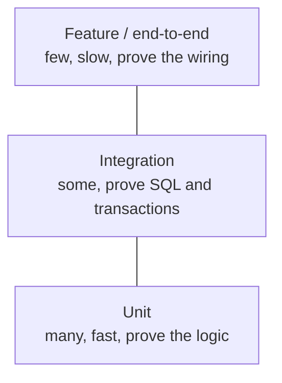
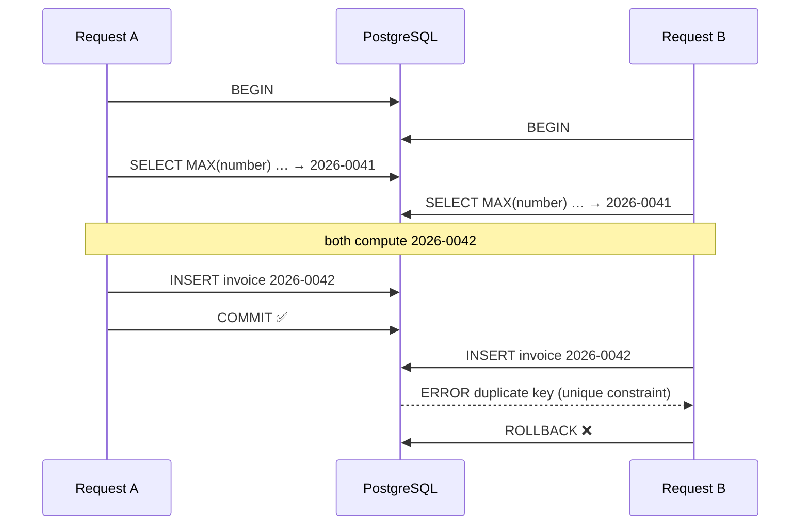
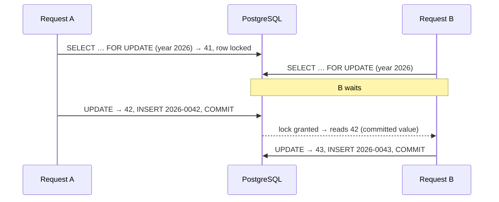

# 14 — Integration tests and data integrity

**Outcomes:** ÕV4 — *kasutab parimate praktikate kohaselt ORM vahendeid* · ÕV5 — *mõistab ühiktestide olemust ning nende kasutamisvõimalusi* · ÕV8 — *loob suurema keerukusastmega rakendusi, kasutades ka matemaatiliselt ja loogiliselt keerukamaid algoritme ja rakenduse osiseid* · **Time:** 2 h in class + ~2 h independent
**Before this lesson:** your project matches the end state of lesson 13 (see [what exists after each lesson](../../PROJECT.md#what-exists-after-each-lesson))
**Walkthroughs:** [Laravel](laravel.md) · [Spring Boot](spring-boot.md)

---

## Why this matters

Lesson 13 gave you invoice generation, tested piece by piece. Unit tests proved that the overlap
algorithm, the rounding and the number format are right. They did **not** prove that:

- the SQL query really finds the right entries,
- the form, the controller, the generator and the database work together,
- the transaction really rolls back,
- two invoices generated at the same moment get different numbers.

The last point is not theory. At the defence you will hear: *"What happens if two people generate an
invoice at the same second?"* With lesson 13's "max + 1" the honest answer is: *"One of them gets an
error, or — without the unique constraint — both get the same number."* Today you can answer: *"The
second one waits a few milliseconds and gets the next number. Here is the test that proves it."*

At work, this is the difference between code that passes on your laptop and code that survives real
users. Payment systems, ticket sales and stock reservations all fail in exactly this way when nobody
thinks about concurrent requests.

## Today's goal

By the end of class:

- your project has **feature / integration tests** that drive the application through HTTP and a real
  database: client CRUD and the full invoice flow;
- you have seen the **duplicate invoice number race** happen, and fixed it with an
  `invoice_sequences` table and a **row lock**;
- (Spring) `Invoice` has a `@Version` column, and a double "mark paid" is detected;
- you can read an **EXPLAIN** plan and decide whether an index is missing;
- you have a **query-count test** that fails if someone reintroduces N+1.

By the end you can:

- explain what unit, integration and feature tests each prove, and choose the right one;
- explain ACID and the default isolation level of PostgreSQL in plain words;
- draw the timeline of the duplicate-number race and explain three defences;
- explain why locking `MAX(number)` is not enough, and why a sequence table is;
- read the most important lines of an EXPLAIN plan;
- name four security mistakes ORMs and MVC frameworks protect you from — and how to break that
  protection by accident.

---

## Concepts

### 1. Three kinds of tests

| | Unit test | Integration test | Feature / end-to-end test |
|---|---|---|---|
| **Tests** | one class, alone | a class **with** a real collaborator (usually the database) | the application from the outside: an HTTP request in, a response out |
| **Proves** | the logic is right | the SQL, mappings, constraints and transactions are right | the pieces are wired together: routes, validation, controller, service, database, view |
| **Speed** | ~1 ms | 10–100 ms | 50–500 ms |
| **Laravel** | `tests/Unit`, extends `PHPUnit\Framework\TestCase` | `tests/Feature`, `RefreshDatabase`, calling a service | `tests/Feature`, `$this->post(...)`, `assertRedirect()` |
| **Spring** | JUnit + Mockito, no Spring | `@DataJpaTest` + Testcontainers | `@SpringBootTest` + `MockMvcTester` |
| **Example in Billable** | `OverlapDetectorTest` | "the aggregate query sums the right lines" | "posting the form creates invoice 2026-0001" |



This is the **test pyramid**: many fast unit tests at the bottom, fewer slow tests at the top. Why not
only feature tests? Because when one fails you do not know *which* of twenty pieces is wrong, and a
suite that takes ten minutes is a suite nobody runs. Why not only unit tests? Because a perfect
`OverlapDetector` is useless if the query that feeds it forgets `WHERE invoice_id IS NULL`.

Rule of thumb for Billable: every **rule** gets unit tests; every **query** you wrote by hand gets an
integration test; every **main user flow** (create client, generate invoice, delete draft) gets one
feature test.

### 2. Which database do tests run on?

| | SQLite in memory | Real PostgreSQL (test database or Testcontainers) |
|---|---|---|
| Setup | nothing (Laravel's default `phpunit.xml`) | a second database in Docker, or Testcontainers starts one per test run |
| Speed | very fast | a few seconds to start, then fast |
| Same SQL as production? | **no** | yes |
| Row locks (`FOR UPDATE`) | ignored — SQLite locks the whole file | real |
| `ON CONFLICT`, `generated ... as identity`, `bigint` limits, `timestamp` behaviour | partly different | identical |
| Concurrency tests | impossible | possible |

A **dialect** is the flavour of SQL a database speaks. Laravel's query builder hides most differences,
so SQLite is fine for most feature tests. But everything this lesson is about — locks, isolation,
constraints under concurrency — only exists in the real database. Spring's `ddl-auto=validate` and
Flyway's PostgreSQL SQL do not run on SQLite or H2 at all, which is why the Spring track uses
**Testcontainers**: a library that starts a throw-away PostgreSQL container for the tests and stops it
afterwards.

**Our choice:** Laravel keeps SQLite for speed and adds an optional PostgreSQL test database
(`billable_test`) for the concurrency work. Spring uses Testcontainers for all database tests; the
container has been there since lesson 01, where it started for the one `contextLoads` test.

### 3. Transactions, deeper

**ACID** is the set of promises a transaction gives:

| Letter | Means | In plain words |
|---|---|---|
| A | Atomicity | all statements happen, or none (lesson 13) |
| C | Consistency | constraints (foreign keys, unique, not null) hold after every commit |
| I | Isolation | transactions running at the same time do not see each other's unfinished work |
| D | Durability | after `COMMIT`, the data survives a crash |

"Isolation" has **levels**, because full isolation is slow. PostgreSQL's default is **READ
COMMITTED**: each statement sees all data committed **before that statement started**. It never sees
another transaction's uncommitted changes. But two statements in the same transaction can see different
data, if someone else committed in between.

| Level | What it prevents | PostgreSQL |
|---|---|---|
| READ UNCOMMITTED | nothing useful | treated as READ COMMITTED |
| **READ COMMITTED** | reading uncommitted data | **default** |
| REPEATABLE READ | the same query returning different rows inside one transaction | available |
| SERIALIZABLE | every anomaly — as if transactions ran one after another | available; conflicting transactions fail and must be retried |

READ COMMITTED does **not** stop two transactions from reading the same value and both acting on it.
That is the next problem.

### 4. What goes wrong: lost updates and the duplicate number

A **race condition** is a bug that appears only when two things happen at the same time, in an unlucky
order. A **lost update** is the classic one: two transactions read a value, both change it, both write
— and the first write is silently overwritten.

Our invoice numbering from lesson 13 has the same shape. Two users press *Generate* at the same moment:



Neither request did anything wrong alone. READ COMMITTED allowed both to read `0041`, because neither
had committed yet. The unique constraint saved us from a **duplicate**, but user B got an error page.
Without the constraint, there would be two invoices `2026-0042` — a legal problem (R11).

A second race hides in the same code: two requests generating an invoice **for the same client** can
both load the same un-invoiced entries, and bill them twice.

### 5. Defences

| Defence | How | Good for | Cost |
|---|---|---|---|
| **Unique constraint** | `UNIQUE (number)` | the last line of defence — **always** have it | turns a silent duplicate into an error |
| **Pessimistic lock** | `SELECT … FOR UPDATE` locks the rows it reads until commit; others wait | short, critical sections: counters, stock | waiting; deadlocks if you lock in random order |
| **Optimistic lock** | a `version` column; `UPDATE … WHERE id = ? AND version = ?`; 0 rows updated → someone else was faster | rare conflicts, long edits (a form open for minutes) | the loser must retry or reload |
| **Retry** | catch the conflict error and run the whole transaction again | serialization failures, deadlocks | only safe if the transaction has no side effects outside the database |

**Pessimistic** means "assume a conflict will happen, so lock first". **Optimistic** means "assume it
will not, but check at the end".

Laravel has pessimistic locking built in (`->lockForUpdate()`), but **no** built-in optimistic locking.
You add an integer `version` column (`$table->unsignedInteger('version')->default(0)`) and write the
check yourself as a conditional update:

```php
// Laravel: optimistic check by hand — only succeeds if nobody changed the row since we read it
$updated = Invoice::whereKey($invoice->id)
    ->where('version', $invoice->version)
    ->update(['status' => 'paid', 'version' => $invoice->version + 1]);
if ($updated === 0) { /* someone else changed it — reload and try again */ }
```

Why not compare `updated_at` instead? Laravel's `updated_at` columns are `timestamp(0)`: whole
seconds. If two changes happen in the same second, the second one still finds the "old" `updated_at`
and its update passes — exactly the lost update we wanted to catch. A counter changes on **every**
write, so it cannot have this gap.

Spring (JPA) has both: `@Lock(LockModeType.PESSIMISTIC_WRITE)` on a repository method, and a
`@Version` field that Hibernate checks on every update, throwing `ObjectOptimisticLockingFailureException`
when it does not match.

### 6. The clean fix for numbering: a sequence table

Why not just lock the `MAX()` query?

1. PostgreSQL does not allow it: `SELECT MAX(number) … FOR UPDATE` fails with
   `ERROR: FOR UPDATE is not allowed with aggregate functions`. A lock is placed on **rows**, and an
   aggregate result is not a row.
2. Locking all of this year's invoice rows instead (`SELECT … FOR UPDATE` without `MAX`) blocks far
   more than needed.
3. And the killer: on **1 January** there are no invoice rows for the new year yet. There is nothing to
   lock, so two requests both find "no invoices" and both create `2027-0001`.

The fix: one small table with **one row per year**, and lock that row.

| `invoice_sequences` | |
|---|---|
| `year` (PK) | `2026` |
| `last_number` | `41` |

```
BEGIN
  INSERT INTO invoice_sequences (year, last_number) VALUES (2026, 0)
      ON CONFLICT (year) DO NOTHING;                       -- make sure the row exists
  SELECT last_number FROM invoice_sequences
      WHERE year = 2026 FOR UPDATE;                        -- lock it: others wait here
  UPDATE invoice_sequences SET last_number = 42 WHERE year = 2026;
  INSERT INTO invoices (number, …) VALUES ('2026-0042', …);
COMMIT                                                      -- lock released
```



Why each part matters:

- **Insert-if-missing first.** `ON CONFLICT DO NOTHING` (Laravel `insertOrIgnore()`) creates the
  year's row if it is not there, and does nothing if it is. If two requests do this at the same time,
  the second waits for the first and then does nothing. Compare a hand-written "select, and insert if
  not found": both requests select, both find nothing, both insert → one fails with a duplicate key.
  That is the same race again, one level down. (Laravel's `firstOrCreate()` has handled this since
  Laravel 10: if its select finds nothing, it calls `createOrFirst()` — insert inside a savepoint, and
  on a duplicate key select the row the other request created. It works
  only because the column has a unique constraint. `insertOrIgnore()` does the same job in one
  statement, without an exception.)
- **The lock waits, then reads the new value.** In READ COMMITTED, when B finally gets the lock,
  PostgreSQL gives B the **committed** row — `42`, not the `41` it would have seen before.
- **The counter is transactional.** If the invoice insert fails, the whole transaction rolls back,
  including `last_number`. No gap.
- **Why not a PostgreSQL `SEQUENCE`?** A database sequence (`nextval()`) is fast and never blocks, but
  it is **not** rolled back: a failed transaction burns a number and leaves a gap. For database ids,
  gaps are fine. For invoice numbers (R11), they are not.
- **Keep the lock short.** The row is locked until commit, so everything slow (e-mails, PDFs) must happen
  after the transaction.

For the double-billing race, the same tool works: load the client's un-invoiced entries with
`FOR UPDATE`. A second request for the same client waits; when it continues, PostgreSQL re-checks the
`invoice_id IS NULL` condition on the now-updated rows and finds nothing to invoice.

### 7. Indexes and EXPLAIN

An **index** is a sorted copy of one or more columns with pointers to the rows, like the index at the
back of a book. It makes lookups fast and writes slightly slower.

`EXPLAIN ANALYZE` runs a query and shows **how** PostgreSQL executed it. Here is a time sheet query for
one week on a table with 20,000 entries (real output, PostgreSQL 17):

```
EXPLAIN ANALYZE SELECT * FROM time_entries
WHERE started_at >= '2026-01-12' AND started_at < '2026-01-19' ORDER BY started_at DESC;

 Sort  (cost=555.28..555.82 rows=214 width=67) (actual time=0.772..0.779 rows=215 loops=1)
   Sort Key: started_at DESC
   ->  Seq Scan on time_entries  (cost=0.00..547.00 rows=214 width=67) (actual time=0.401..0.730 rows=215 loops=1)
         Filter: ((started_at >= '2026-01-12 00:00:00'::timestamp without time zone) AND (started_at < ...))
         Rows Removed by Filter: 19785
 Execution Time: 0.796 ms
```

How to read it — from the **innermost** line outwards:

| Part | Meaning |
|---|---|
| `Seq Scan on time_entries` | reads **every** row of the table (sequential scan) |
| `Filter: …` / `Rows Removed by Filter: 19785` | it read 20,000 rows to keep 215 — a sign an index could help |
| `Sort` | the rows were sorted after reading |
| `cost=0.00..547.00` | the planner's estimate in abstract units (startup..total). Compare plans, not absolute values |
| `rows=214` vs `actual … rows=215` | estimate vs reality. Far apart → statistics are stale (`ANALYZE`) |
| `actual time=…` | real milliseconds (only with `ANALYZE`) |

Our index `(project_id, started_at)` is **not used**, because the query does not filter by
`project_id`. A multi-column index works like a phone book sorted by last name, then first name: it
helps to find "Tamm, Mari", but not "everyone called Mari". This is the **leftmost-prefix rule**. The
same index **is** used when the query filters by project first:

```
 Bitmap Index Scan on time_entries_project_id_started_at_index  (cost=0.00..4.42 rows=11 width=0)
       Index Cond: ((project_id = 3) AND (started_at >= ...) AND (started_at < ...))
```

After `CREATE INDEX time_entries_started_at_index ON time_entries (started_at)`:

```
 Index Scan Backward using time_entries_started_at_index on time_entries  (cost=0.29..14.57 rows=214 width=67) (actual time=0.017..0.044 rows=215 loops=1)
   Index Cond: ((started_at >= '2026-01-12 00:00:00'::timestamp without time zone) AND (started_at < ...))
 Execution Time: 0.059 ms
```

The sort is gone ("Backward" reads the index in descending order) and the time dropped from 0.8 ms to
0.06 ms. On 20,000 rows that does not matter; on 2 million it does.

Two warnings:

- **Small tables lie.** With 30 rows PostgreSQL always chooses `Seq Scan`, because reading one page is
  cheaper than using an index. Test with realistic data (a seeder with thousands of rows).
- **PostgreSQL does not index foreign keys automatically** (MySQL does). `time_entries.invoice_id`,
  `invoice_lines.project_id` and `invoices.client_id` have no index yet — every "entries of this
  invoice" lookup is a `Seq Scan`. (`projects.client_id` already has one from lesson 03.) Adding the
  missing ones, with EXPLAIN as evidence, is a basic independent task.

### 8. Pagination with eager loading, and counting queries

Lists grow. The invoices page must be **paginated** (only 20 rows per page) and **eager-loaded** (the
client names in one extra query, not one per row). Together that is a fixed number of queries per page,
whatever the table size:

| Query | Laravel `with('client')->paginate(20)` | Spring `Page<Invoice>` + `@EntityGraph("client")` |
|---|---|---|
| 1 | `SELECT count(*) FROM invoices` | `select count(...) from invoices` |
| 2 | `SELECT * FROM invoices … LIMIT 20 OFFSET 0` | `select … from invoices join clients … offset ? rows fetch first ? rows only` |
| 3 | `SELECT * FROM clients WHERE id IN (…)` | — (joined in query 2) |

A **query-count test** turns "no N+1" from a promise into a fact: create 30 invoices, request the page,
count the SQL statements, assert the count is small **and does not depend on the number of rows**.
If someone removes the eager loading, the count jumps to 20+ and the test fails.

One trap in JPA: **paginating while fetching a collection** (`@EntityGraph("lines")` on a `Page` query).
The database cannot `LIMIT` invoices when each invoice appears once per line, so Hibernate loads
**everything** and paginates in memory, logging `HHH90003004: firstResult/maxResults specified with
collection fetch; applying in memory`. Fetch `@ManyToOne` relations in list pages; load collections
only on the detail page.

### 9. Security basics your framework gives you — until you switch them off

| Risk | What it is | Framework protection | How you break it |
|---|---|---|---|
| **Mass assignment** | the user sends an extra field (`invoice_id=5`, `status=paid`) and it is saved | Laravel `$fillable` + `$request->validated()`; Spring form objects with only the allowed fields | `Model::create($request->all())`, `$guarded = []`, binding a form directly to an entity |
| **SQL injection** | user input becomes part of the SQL text | query builder and JPQL parameters send values separately (**bindings**) | string concatenation: `DB::select("… WHERE name = '$name'")`, `"… where name = '" + name + "'"` |
| **XSS** (cross-site scripting) | user input is sent to the browser as HTML/JavaScript | Blade `{{ }}` and Thymeleaf `th:text` escape everything | Blade `{!! !!}`, Thymeleaf `th:utext` on user data |
| **CSRF** (cross-site request forgery) | another site makes the user's browser post a form to your app | Laravel's `@csrf` token (every POST form); Spring Security's token, added by `th:action` (Billable-Spring since lesson 05, with `permitAll()`) | Laravel: excluding routes from CSRF checks. Spring: `http.csrf(csrf -> csrf.disable())`, or a plain `action="..."` form that gets no token |

Safe and unsafe, side by side:

```php
DB::select("SELECT * FROM clients WHERE name = '{$name}'");        // ❌ injection
DB::select('SELECT * FROM clients WHERE name = ?', [$name]);        // ✅ binding
Client::whereRaw('lower(name) = ?', [strtolower($name)])->get();    // ✅ raw, but bound
```

```java
em.createQuery("select c from Client c where c.name = '" + name + "'");                  // ❌
em.createQuery("select c from Client c where c.name = :name").setParameter("name", name); // ✅
```

---

## Laravel vs Spring Boot

| Idea | Laravel | Spring Boot |
|---|---|---|
| Fresh database per test | `RefreshDatabase` (transaction rolled back after each test) | `@DataJpaTest` rolls back; `@SpringBootTest` does **not** — clean up yourself |
| Real PostgreSQL in tests | a `billable_test` database + env in `phpunit.xml` | Testcontainers + `@ServiceConnection` |
| HTTP test | `$this->post(route(...), [...])->assertRedirect()` | `MockMvcTester` + `@AutoConfigureMockMvc` |
| Assert database state | `assertDatabaseHas('invoices', [...])` | repository / `JdbcTemplate` query + AssertJ |
| Count queries | `$this->expectsDatabaseQueryCount($n)` (built on `DB::listen()`) | Hibernate `Statistics` |
| Pessimistic lock | `->lockForUpdate()` | `@Lock(LockModeType.PESSIMISTIC_WRITE)` |
| Optimistic lock | by hand: `version` column + conditional `update()` | `@Version` → `ObjectOptimisticLockingFailureException` |
| Insert if missing | `insertOrIgnore()` | native `insert … on conflict do nothing` |

---

## Common mistakes

| Mistake | Why it hurts | What to do instead |
|---|---|---|
| Only unit tests | Wrong SQL, wiring and transactions stay invisible | One feature test per main flow |
| Concurrency "tested" on SQLite | SQLite ignores `FOR UPDATE`; the test proves nothing | Real PostgreSQL for anything about locks |
| Locking with `SELECT MAX(...) FOR UPDATE` | PostgreSQL refuses it; and with no rows there is nothing to lock | A sequence row per year, locked with `FOR UPDATE` |
| Hand-written "find, then insert" for the sequence row | Two requests both insert → duplicate key | `insertOrIgnore()` / `ON CONFLICT DO NOTHING`, then lock |
| Optimistic lock on `updated_at` | Whole-second timestamps: two changes in the same second both pass | An integer `version` column (Spring: `@Version`) |
| Using a database `SEQUENCE` for invoice numbers | Rolled-back transactions leave gaps (R11) | Transactional counter table |
| Removing the unique constraint "because we lock now" | The next bug in the locking code creates duplicates silently | Keep the constraint forever — defence in depth |
| Sending e-mail or calling an API while holding the lock | Everybody waits for a slow external service | Keep the transaction short; side effects after commit |
| Adding indexes "just in case" | Every index slows writes and costs space | Add an index when EXPLAIN shows a `Seq Scan` with many rows removed |
| Testing EXPLAIN on 10 rows | PostgreSQL always chooses `Seq Scan` on tiny tables | Seed thousands of rows first |
| `@SpringBootTest` tests that leave data behind | The next test sees old invoices; numbers start at `0003` | Truncate tables in `@BeforeEach`, or use `@DataJpaTest` where possible |
| `{!! $x !!}` / `th:utext` on user data | XSS | Only for HTML you generated yourself |

---

## Independent work (~2 h)

Do these at home after the walkthrough, in your own project (~2 h). Tasks build on each other across lessons, so finish at least the **Basic** ones. Solutions are at the bottom of the [Laravel](laravel.md#independent-work--solutions) and [Spring Boot](spring-boot.md#independent-work--solutions) walkthroughs — try first, compare after.

### Task 1 — More feature tests for the main flows (Basic)

Make sure you have **at least three** feature/integration tests beyond the ones from class, covering
flows the class did not: e.g. creating a project with conditional validation per billing type (lesson 05),
logging a time entry and seeing it on the time sheet, "mark paid" on a sent invoice, an entry on an
invoice that cannot be deleted (R14).

**Acceptance:** each test goes through HTTP (or a service with a real database), asserts the response
**and** the database state, and passes on a fresh clone with the command in your README.

### Task 2 — Indexes justified by EXPLAIN (Basic)

Seed at least 10,000 time entries. Run `EXPLAIN ANALYZE` for (a) the entries of one invoice, (b) the
invoice lines of one project (the "already billed" query), (c) the invoices of one client. Add the
missing indexes in a migration and run the plans again.

**Acceptance:** a short section in `docs/performance.md` with each query, the plan before and after
(the key lines are enough), and one sentence of reasoning per index.

### Task 3 — Query count for the invoices page (Intermediate)

A test that creates 30 invoices for 30 different clients, requests the first page of `/invoices`, and
asserts the number of SQL queries is at most 5 **and** stays the same with 60 invoices.

**Acceptance:** remove the eager loading and the test fails; put it back and it passes.

### Task 4 — A security fix with a test (Intermediate)

Search your project for `{!!` / `th:utext`, `$request->all()`, `whereRaw` / `DB::raw` / string-built
JPQL, and entities bound directly to forms. Fix one real problem (or, if you find none, deliberately
introduce one on a branch, show it, then fix it) and write a test that fails before the fix.

**Acceptance:** a commit `fix(security): …` with the test; the commit message says what the attack was.

### Task 5 — Concurrency evidence (Advanced)

Show the race **before** the fix and its absence **after** — with output you can paste into
`docs/algorithm.md`. Laravel: the two-process Artisan demo from the walkthrough, run against the
lesson 13 `InvoiceNumberGenerator` (git checkout of the old version) and the new one. Spring: the `ExecutorService`
test run against both versions.

**Acceptance:** before: an error or duplicate numbers in the output; after: 10 of 10 invoices with
numbers `…0001`–`…0010`; two sentences explaining the difference.

---

## Self-check

1. Name one bug a unit test cannot find but an integration test can.
2. Why can a concurrency test not run on SQLite?
3. PostgreSQL's default isolation level is READ COMMITTED. What exactly does a statement see?
4. Draw (or describe) the timeline in which two requests create the same invoice number.
5. Why is `SELECT MAX(number) … FOR UPDATE` not a solution? Give two reasons.
6. Why `insertOrIgnore()` / `ON CONFLICT DO NOTHING` and not "select, then insert if missing" for the sequence row?
7. Why not use a PostgreSQL `SEQUENCE` for invoice numbers?
8. In an EXPLAIN plan you see `Seq Scan … Rows Removed by Filter: 19785`. What does it tell you?

<details>
<summary>Answers</summary>

1. A wrong `WHERE` in a query (e.g. forgetting `invoice_id IS NULL`), a missing column in a migration,
   a mapping error, a unique constraint violation, a transaction that does not roll back.
2. SQLite ignores `FOR UPDATE` and locks the whole database file; in-memory SQLite is also private to one
   connection. There is no row locking to test.
3. Everything that was committed before **that statement** started — never uncommitted changes of other
   transactions. The next statement in the same transaction may see newer commits.
4. A and B both `BEGIN`; both read `MAX = 0041`; both compute `0042`; A inserts and commits; B inserts
   and hits the unique constraint (or, without it, creates a duplicate).
5. PostgreSQL does not allow `FOR UPDATE` with aggregates; and when no invoice exists yet for the year
   there is no row to lock, so two requests can both start at `0001`. (Also: locking all of the year's
   invoices blocks far too much.)
6. "Select, then insert if missing" is two statements — two requests can both see "missing" and
   both insert, and one fails. `ON CONFLICT DO NOTHING` is one atomic statement; the second request
   waits and then does nothing. (Laravel's `firstOrCreate()` adds a fallback for this case via
   `createOrFirst()`, but needs an exception and a savepoint to do it.)
7. `nextval()` is not rolled back with the transaction. A failed invoice would burn a number → a gap,
   which R11 forbids.
8. PostgreSQL read the whole table and threw away almost all rows. If the table is large and the query
   frequent, an index on the filtered column is probably missing.
</details>

---

## Checklist

- [ ] Feature tests for client CRUD and the full invoice flow over HTTP pass (ÕV5)
- [ ] The invoice flow test checks the numbers `…-0001` and `…-0002`, totals, linked entries, overlap rejection, draft deletion and "sent cannot be deleted"
- [ ] `invoice_sequences` exists; `InvoiceNumberGenerator` locks the year's row inside the transaction (ÕV8)
- [ ] The race was demonstrated before and after the fix, with evidence
- [ ] The unique constraint on `invoices.number` is still there
- [ ] (Spring) `Invoice` has `@Version`; a conflicting update is reported, not lost
- [ ] A query-count test protects the time sheet (and, independent, the invoices page) (ÕV4)
- [ ] Missing foreign-key indexes added, with EXPLAIN before/after (ÕV4)
- [ ] No `{!! !!}` / `th:utext` on user data, no `$request->all()` into models, no string-built SQL
- [ ] All tests green in CI; formatter clean (ÕV7)

---

## Further reading

- [PostgreSQL — Transaction isolation](https://www.postgresql.org/docs/current/transaction-iso.html)
- [PostgreSQL — Explicit locking](https://www.postgresql.org/docs/current/explicit-locking.html)
- [PostgreSQL — Using EXPLAIN](https://www.postgresql.org/docs/current/using-explain.html)
- [PostgreSQL — INSERT … ON CONFLICT](https://www.postgresql.org/docs/current/sql-insert.html)
- [Laravel — Database testing](https://laravel.com/docs/12.x/database-testing)
- [Laravel — HTTP tests](https://laravel.com/docs/12.x/http-tests)
- [Laravel — Pessimistic locking](https://laravel.com/docs/12.x/queries#pessimistic-locking)
- [Spring Boot — Testing](https://docs.spring.io/spring-boot/reference/testing/index.html)
- [Spring Boot — Testcontainers](https://docs.spring.io/spring-boot/reference/testing/testcontainers.html)
- [Spring Data JPA — Locking](https://docs.spring.io/spring-data/jpa/reference/jpa/locking.html)
- [OWASP — SQL Injection Prevention Cheat Sheet](https://cheatsheetseries.owasp.org/cheatsheets/SQL_Injection_Prevention_Cheat_Sheet.html)
- [OWASP — Cross Site Scripting Prevention Cheat Sheet](https://cheatsheetseries.owasp.org/cheatsheets/Cross_Site_Scripting_Prevention_Cheat_Sheet.html)
