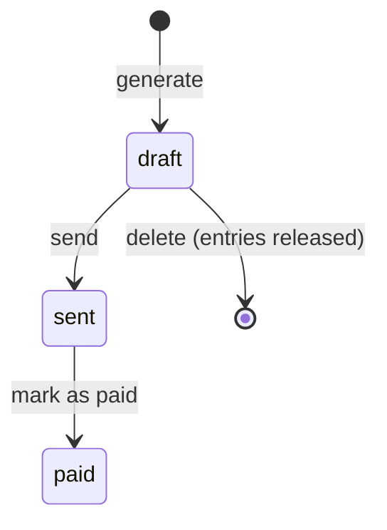

# 15 — Documentation in English

**Outcomes:** ÕV9 — *dokumenteerib loodud rakendused inglise keeles* · **Time:** 2 h in class + ~2 h independent
**Before this lesson:** your project matches the end state of lesson 14 (see [what exists after each lesson](../../PROJECT.md#what-exists-after-each-lesson)): the complete Billable application, invoice generation with the `invoice_sequences` row lock, and unit, mock, feature and integration tests green in CI. Your `docs/` folder already has `request-lifecycle.md`, `architecture.md`, `patterns.md`, `algorithm.md` and `ai-usage.md`.
**Walkthroughs:** [Laravel](laravel.md) · [Spring Boot](spring-boot.md)

---

## Why this matters

Your Billable application works. But "it works" is only true on your laptop, today, while you still
remember how you set it up. Documentation is what makes it work for everybody else, and for you in six
months.

Think about your day job. When you join a new team, the first thing you open is the README. If the
setup steps are wrong, you lose a day. If nobody wrote down *why* the code does something strange, you
"fix" it and break production. Most of the time a developer spends is spent **reading** code and
documents, not writing them.

For this module there is also a very direct reason. The capstone rule is: *the test suite passes on a
fresh clone, following only your README* ([CAPSTONE.md](../../CAPSTONE.md#hard-constraints)). The teacher
will clone your repository and follow your README. If it does not work, ÕV9 is *not yet*, and the
teacher cannot check the other outcomes easily either.

Finally, the outcome says **in English**. English is the working language of software, even in Estonian
companies: code, commit messages, pull requests and tickets are usually in English because the team, the
tools and the next maintainer may not speak Estonian. This lesson has a practical section on the
mistakes Estonian speakers make most often.

## Today's goal

At the end of class your repository has:

- a `README.md` that a stranger can follow on a fresh clone;
- doc comments (PHPDoc or Javadoc) on the main domain classes: `InvoiceGenerator`, `OverlapDetector`,
  `InvoiceNumberGenerator`, `Money` and the `BillingStrategy` interface;
- `docs/diagrams.md` with four Mermaid diagrams: ER, invoice-generation sequence, strategy classes,
  invoice states;
- `docs/adr/0001-integer-cents-for-money.md` (complete) and outlines for ADR 0002 and 0003;
- `CHANGELOG.md` with a `1.0.0` entry;
- a script that clones your repository into a temporary folder and follows the README.

By the end you can:

- say who reads each kind of documentation and what they need from it;
- write a README with a quick start that actually works;
- write doc comments that explain the contract, not the obvious;
- draw diagrams as code with Mermaid;
- record a decision as an ADR;
- avoid the most common English mistakes of Estonian speakers.

---

## Concepts

### 1. Who reads documentation, and what they need

Before you write anything, ask: *who will read this, and what are they trying to do?*

| Reader | Situation | What they need |
|---|---|---|
| **Future you** | Six months later, you have forgotten everything | Why you made the strange decisions. How to run the tests. |
| **A new teammate** | First day on the project | A quick start that works. Where things are. Words used in the domain. |
| **A reviewer** | Reads your pull request in 10 minutes | A clear commit message and PR description: what changed and why. |
| **A caller of your code** | Uses `InvoiceGenerator` from a new controller | The contract: inputs, output, exceptions, side effects. |
| **The teacher at the defence** | Checks the outcomes in 15 minutes | Where each outcome is in the code. Diagrams. Decisions with reasons. |

Notice that nobody in this table needs a description of what `$i++` does. Readers need the things that
the code **cannot** tell them: purpose, reasons, rules, and how to start.

### 2. The documentation map

| Type | Lives in | Answers | Billable example |
|---|---|---|---|
| README | `README.md` | What is this? How do I run it? | Quick start, tests, structure |
| Code comments | Inside methods | Why is this line like this? | "Round up before billing (R5)." |
| Doc comments | Above classes and public methods | How do I use this correctly? | `@throws OverlappingEntriesException` |
| Architecture docs and diagrams | `docs/*.md` | How do the parts fit together? | `architecture.md`, `diagrams.md` |
| ADR (Architecture Decision Record) | `docs/adr/NNNN-*.md` | Why did we choose X over Y? | Integer cents instead of decimals |
| CHANGELOG | `CHANGELOG.md` | What changed between versions? | `1.0.0`: first complete release |
| Commit messages | Git history | Why did this change happen? | `fix(invoices): lock sequence row` |
| API docs | Generated from doc comments | What does each public method do? | phpDocumentor or Javadoc HTML |

Each type has one job. When one document tries to do every job, nobody can find anything.

#### Diátaxis in brief

[Diátaxis](https://diataxis.fr/) is a simple framework that sorts user-facing documentation into four
kinds, by what the reader wants at that moment:

| Kind | The reader wants to… | Style | In Billable |
|---|---|---|---|
| **Tutorial** | *learn* by doing, guided | "Now we will…", one safe path | These lesson walkthroughs |
| **How-to guide** | *reach a goal* they already have | Numbered steps, imperative | "How to generate an invoice" |
| **Reference** | *look up* a fact | Dry, complete, consistent | Configuration table, Javadoc/PHPDoc |
| **Explanation** | *understand* why | Discussion, context, trade-offs | `algorithm.md`, ADRs, `patterns.md` |

The most common mistake is mixing them: a README that explains the history of money rounding in the
middle of the installation steps. Keep the steps short and **link** to the explanation.

### 3. A README that works

A README has one main job: take a stranger from "I found this repository" to "it runs and the tests
pass" in about 15 minutes. This order works for most projects:

1. **Name and one-paragraph description** — what it is and who it is for.
2. **Screenshot** — one image says more than a paragraph.
3. **Requirements** — exact versions (PHP 8.4, Java 25, Docker).
4. **Quick start** — commands to copy, in order, from `git clone` to an open browser page.
5. **Running the tests** — the one command, plus anything the tests need (Docker, a database).
6. **Project structure** — the main folders, one line each.
7. **Configuration** — the settings a user may change, with defaults.
8. **Documentation and key decisions** — links to `docs/` and the ADRs.
9. **Licence and author.**

Template (the walkthroughs fill it in for your track):

````markdown
# Billable

One paragraph: what the application does and for whom.


## Requirements
- Tool X version Y
- Docker Desktop (runs PostgreSQL 17)

## Quick start
```bash
git clone https://github.com/<your-user>/billable.git
cd billable
<command 1>
<command 2>
```
Open http://localhost:8000 — you should see the home page with seeded clients.

## Running the tests
```bash
<test command>
```
What the tests need, and how long they take the first time.

## Project structure
| Folder | What is in it |
|---|---|

## Configuration
| Setting | Default | Meaning |
|---|---|---|

## Documentation
- [Architecture](docs/architecture.md) · [Diagrams](docs/diagrams.md) · [Decisions](docs/adr/)

## Licence
MIT — see [LICENSE](LICENSE). Author: Your Name.
````

**The quick start must work on a fresh clone.** Your laptop has things that a fresh clone does not:
a filled-in `.env`, a database that already has tables, a Docker image already downloaded, an old build
in `target/` or `vendor/`. A README is only correct when it has been followed on a clean copy. That is
why the walkthrough ends with a script that clones your repository into an empty temporary folder and
runs the README commands one by one.

### 4. Code comments: explain *why*, not *what*

The code already says **what** it does. A comment is useful when it says something the code cannot:
the reason, the business rule, the danger.

```php
// Bad: repeats the code
$minutes = TimeRounding::roundUp($minutes, 15); // round up minutes to 15

// Good: gives the reason and the rule
// R5: bill whole rounding blocks. Round up, never down, so 1 minute of work is billed.
$minutes = TimeRounding::roundUp($minutes, $project->rounding_minutes);
```

```java
// Bad: describes the syntax
// lock the row
var sequence = sequences.findByYear(year).orElseThrow();

// Good: explains the danger the line prevents
// Two requests can generate invoices at the same moment. findByYear() holds a row lock
// (@Lock(PESSIMISTIC_WRITE)), so the second request waits until the first commits and both never
// read the same last_number (R11).
var sequence = sequences.findByYear(year).orElseThrow();
```

Three more rules:

- **Delete commented-out code.** Git remembers the old version. Commented-out code confuses the reader:
  is it important? Should it come back? Nobody knows, so nobody deletes it.
- **A TODO needs an issue reference**, e.g. `// TODO(#42): support credit notes`. A TODO without an
  issue is a wish that nobody tracks.
- **Improve the name before writing a comment.** If you need a comment to say what `$x` is, rename it
  to `$alreadyBilledCents`.

### 5. Doc comments on the public domain API

A doc comment (`/** … */`) sits above a class or a public method. Tools read it: your IDE shows it on
hover, PHPStan and the Java compiler check it, and documentation generators turn it into HTML.

Document the **contract**: what the caller must give, what they get back, what can go wrong, and any
side effect. Do not document getters, setters or methods whose name says everything.

**PHPDoc** (PHP):

```php
/**
 * Returns the first pair of time slots that overlap, or null if there is none.
 *
 * A slot that ends exactly when the next one starts does not overlap it.
 *
 * @param  list<TimeSlot>  $slots  slots of one client's entries, in any order
 * @return array{0: TimeSlot, 1: TimeSlot}|null
 */
public function find(array $slots): ?array
```

- The **summary** is one sentence in the present tense: "Returns…", "Calculates…".
- `list<TimeSlot>` and `array<int, TimeSlot>` are **generic array types**. PHP itself only knows
  `array`; the PHPDoc tells your IDE and PHPStan what is *inside* the array.
- `array{0: TimeSlot, 1: TimeSlot}` is an **array shape**: an array with known keys (here exactly
  `0` and `1`).
- `@throws` lists exceptions the caller should expect.

**Javadoc** (Java):

```java
/**
 * Returns the first pair of time slots that overlap.
 *
 * <p>A slot that ends exactly when the next one starts does not overlap it. Runs in {@code O(n
 * log n)} time because it sorts the slots by {@link TimeSlot#start() start time}.
 *
 * @param slots slots of one client's entries, in any order; not modified
 * @return the first overlapping pair, or {@link Optional#empty()} if there is none
 */
public Optional<Overlap> find(List<TimeSlot> slots)
```

- The **first sentence** is the summary; Javadoc shows it in the class overview. It ends at the first
  full stop followed by a space, so avoid "e.g. " in the first sentence.
- `{@code …}` formats code and lets you write `<` and `>` safely. `{@link …}` makes a clickable link.
- `<p>` starts a new paragraph (a blank line alone does not).

> **Markdown doc comments (Java 23+).** Since JDK 23 (JEP 467) a doc comment can also be written in
> Markdown, with `///` on every line instead of `/** … */`:
>
> ```java
> /// Returns the first pair of time slots that overlap.
> ///
> /// A slot that ends exactly when the next one starts does not overlap it. Runs in `O(n log n)`
> /// time because it sorts the slots by [start time][TimeSlot#start()].
> ///
> /// @param slots slots of one client's entries, in any order; not modified
> /// @return the first overlapping pair, or [Optional#empty()] if there is none
> ```
>
> Here a blank line **does** start a new paragraph, backticks replace `{@code …}`, and `[…]` replaces
> `{@link …}`. Our Java 25 project could use either style; the walkthrough uses the classic `/** */`,
> because most code and tutorials you will meet still do. Do not mix the two in one project.

### 6. Diagrams as code with Mermaid

[Mermaid](https://mermaid.js.org/) diagrams are written as text inside a Markdown code block marked
`mermaid`. GitHub renders them as pictures. Because they are text, they live in Git, they appear in
diffs, and you can update them in the same commit as the code.

````markdown

````

Billable needs four diagrams. The walkthrough has all four, with your track's class names:

| Diagram | Shows | Answers the question |
|---|---|---|
| ER diagram | Tables, columns, relationships | "Where is this stored?" |
| Sequence diagram | Invoice generation, step by step | "What happens when I click *Generate*?" |
| Class diagram | `BillingStrategy` and its implementations | "Where is the billing type chosen?" |
| State diagram | Invoice status `draft → sent → paid` | "Can this invoice still be edited?" |

A good diagram is **small** and answers one question. If a diagram has 30 boxes, split it.

### 7. Architecture Decision Records (ADRs)

An ADR is a short document that records **one** important decision and the reasons for it. The format
from Michael Nygard has five parts:

| Part | Content |
|---|---|
| **Title** | A short phrase: "Use integer cents for money" |
| **Status** | proposed · accepted · deprecated · superseded by ADR-000N |
| **Context** | The situation and the forces: what problem, which constraints, which options |
| **Decision** | What we do, in active voice: "We store all money as integer cents." |
| **Consequences** | What becomes easier, what becomes harder, what we must now remember |

Rules: one decision per ADR, numbered files (`0001-…`, `0002-…`), and **never rewrite an accepted
ADR**. If you change your mind, write a new ADR that supersedes the old one. The history of decisions
is the point.

Three ADRs for Billable (the walkthrough writes the first one in full):

1. **Integer cents for money** — instead of `float`/`double` (rounding errors) or `decimal`/`BigDecimal`.
2. **An `invoice_sequences` table with a row lock for invoice numbers** — instead of `MAX(number) + 1`,
   which gives duplicates when two requests run at the same moment (lesson 14).
3. **A `Notifier` adapter instead of calling the mailer directly** — so the budget warning can be sent
   by e-mail, written to the log, or replaced in tests.

Your extension feature needs its own ADR as well ([CAPSTONE.md](../../CAPSTONE.md#what-you-submit)).

### 8. CHANGELOG and semantic versioning

A `CHANGELOG.md` lists notable changes per version for humans. The
[Keep a Changelog](https://keepachangelog.com/en/1.1.0/) format groups changes under **Added**,
**Changed**, **Deprecated**, **Removed**, **Fixed** and **Security**, newest version first, with an
`[Unreleased]` section at the top.

[Semantic versioning](https://semver.org/) gives versions the form `MAJOR.MINOR.PATCH`:

| Change | Example | New version |
|---|---|---|
| Bug fix, nothing else changes | Due date on Sunday fixed | `1.0.0` → `1.0.1` |
| New feature, old behaviour still works | CSV import added | `1.0.1` → `1.1.0` |
| Breaking change | Invoice numbers get a new format | `1.1.0` → `2.0.0` |

The version you submit for the capstone is `1.0.0`. Tag it in Git: `git tag -a v1.0.0`.

### 9. English for Estonian speakers — the practical part

You do not need perfect English. You need **clear and consistent** English. These are the mistakes
that appear most often in Estonian students' documentation, and simple rules to avoid them.

#### Articles: *a*, *an*, *the*

Estonian has no articles, so they are the most common mistake. Rules of thumb:

| Rule | Example from Billable docs |
|---|---|
| **a/an** — one countable thing, mentioned for the first time, or any one of many | "Generates **an** invoice for **a** client." |
| **the** — the reader knows which one (only one exists, or it was just mentioned) | "**The** invoice number is unique per year." "Returns **the** total." |
| **no article** — plural or uncountable things in general | "Time entries must not overlap." "Money is stored in cents." |
| **an** before a vowel *sound*, **a** before a consonant *sound* | **an** hour, **an** ADR, **an** invoice · **a** user, **a** VAT number, **a** unique number |
| Headings, table cells, commit subjects may drop articles | "Add overlap check", "Invoice states" |

A quick self-test: read the sentence aloud. "Invoice is generated for client" sounds like a telegram.
"The invoice is generated for the client" sounds like a sentence.

#### Tense: present simple in docs, imperative in commands

| Where | Form | Good | Avoid |
|---|---|---|---|
| Doc comments, reference docs | present simple, 3rd person | "Returns the invoice." "Throws if…" | "Will return", "This method is returning" |
| Commit subjects, how-to steps, README commands | imperative | "Add overlap check", "Run the tests" | "Added overlap check", "Adding…", "I added…" |
| ADR decision | active voice, present | "We store money as integer cents." | "It was decided that…" |

A commit subject should complete the sentence *"If applied, this commit will…"* — "…**add** overlap
check". That is why the imperative works.

#### False friends and "Estonglish"

| Estonian thought | Wrong in English | Write instead |
|---|---|---|
| *aktuaalne* | "the actual rate" (actual = real, true) | "the **current** rate" |
| *eventuaalselt* | "eventually fails" (eventually = in the end, finally) | "**may** fail", "**possibly**" |
| *kontrollima* | "the service controls the dates" (control = command, steer) | "**checks** / **validates** / **verifies** the dates" |
| *informatsioon* (plural) | "informations", "datas", "feedbacks", "advices" | "information", "data", "feedback", "advice" — uncountable, no *-s* |
| *otsust tegema* | "do a decision" | "**make** a decision" |
| *sõltub millest* | "depends from" | "depends **on**" |
| *realiseerima* | "realise the feature" (realise = understand suddenly) | "**implement** the feature" |
| *võimalus* | "a possibility to export" | "an **option** to export", "you **can** export" |
| *samal ajal* | "in the same time" | "**at** the same time" |
| *arutama millest* | "discuss about the design" | "discuss the design" |
| *selgita mulle* | "explain me the rule" | "explain the rule **to me**" |
| *pildil* | "on the picture" | "**in** the picture / screenshot" |

#### Consistent terminology — a glossary

In Estonian it is good style to vary words. In technical English it is **bad** style: if one page says
*time entry*, another *log* and a third *record*, the reader thinks these are three different things.
Pick one word per concept and use it everywhere — in the UI, the code, the docs and the commits.

| Use | Do not mix with | Meaning |
|---|---|---|
| client | customer, company | Who you work for (`clients` table) |
| time entry | log, record, time log, booking | One block of work (`time_entries`) |
| invoice | bill | The document sent to a client |
| invoice line | row, item, position | One project on an invoice |
| billable | chargeable, paid | Should be invoiced |
| VAT | tax, KM | Value added tax, 24 % |
| due date | deadline, payment term | Date by which the client must pay |
| budget cap | limit, max budget | Maximum total for a capped project |

The walkthrough puts this table into `docs/glossary.md`.

#### Short sentences, no Estonian in code

- One idea per sentence. Aim for fewer than 20 words. Long Estonian-style sentences with many commas
  become hard to read in English.
- Active voice: "The generator locks the row", not "The row is locked by the generator".
- **No Estonian anywhere in the repository**: not in identifiers (`$summa`, `arvutaKaibemaks()`), not in
  comments, not in commit messages, not in test names. The rubric names "Estonian mixed into code" as
  *not yet* for ÕV9.

#### Tools

| Tool | Where | What it catches |
|---|---|---|
| Code Spell Checker | VS Code extension | Typos in code, comments, Markdown; understands `camelCase` |
| Spelling + Grazie | PhpStorm / IntelliJ (built in) | Typos and grammar in comments, commit messages and Markdown |
| LanguageTool | Browser add-on or web page | Grammar, articles, word choice in longer texts |

**AI for proofreading is allowed.** Use it like a strict colleague: ask it to *list* the mistakes and
explain each one, then fix them yourself. Do not let it rewrite the whole README — it will invent
features you do not have and commands that do not exist. You must be able to explain every sentence,
just like every line of code. Note it in `docs/ai-usage.md`.

### 10. The fresh-eyes test

You cannot see the gaps in your own README, because your brain fills them in. The fresh-eyes test
fixes that:

1. A classmate clones your repository on **their** machine.
2. They follow **only** the README. They do not ask you anything.
3. They write down every place where they got stuck, guessed, or needed something that was not written.
4. You fix each point, and save their notes in `docs/fresh-eyes-notes.md`.

Every point in their notes is a documentation bug. Doing this and attaching the notes is the
**exceeds** level of ÕV9 in the [rubric](../../CAPSTONE.md#assessment-rubric).

---

## Laravel vs Spring Boot

| Idea | Laravel | Spring Boot |
|---|---|---|
| Doc comment format | PHPDoc `/** @param … */` | Javadoc `/** @param … */` |
| Generic types in docs | `array<int, TimeEntry>`, `list<TimeEntry>`, `Collection<int, TimeEntry>` | Real generics in code: `List<TimeEntry>` |
| Checks doc comments | PHPStan / Larastan reads PHPDoc types | Javadoc tool and `-Xdoclint` |
| Generate HTML docs | phpDocumentor (optional) | `./mvnw javadoc:javadoc` |
| Package-level docs | (none; use `docs/`) | `package-info.java` |
| Quick start | `composer install`, `.env`, `migrate --seed`, `serve` | `./mvnw spring-boot:run` (Compose starts the database) |
| Tests in README | `php artisan test` | `./mvnw verify` (Testcontainers needs Docker) |

---

## Common mistakes

| Mistake | Why it hurts | What to do instead |
|---|---|---|
| README tested only on your own laptop | Your `.env`, database and caches hide missing steps | Run the fresh-clone script; ask a classmate |
| Quick start says "configure the database" | The reader does not know how | Give the exact commands and values |
| README describes planned features | The teacher tests them and they are not there | Describe the code as it is today; list limitations |
| Comments that repeat the code | Noise; readers learn to skip all comments | Explain the reason or the business rule |
| Commented-out code left in | Nobody knows whether it matters | Delete it; Git keeps history |
| Doc comment says `@return array` | Tells nothing new | `@return list<InvoiceLine>` or an array shape |
| Diagram as a PNG from a drawing tool | Goes out of date, cannot be diffed | Mermaid in Markdown |
| Rewriting an old ADR after changing your mind | The history of the decision is lost | New ADR with "Supersedes ADR-0002" |
| Mixed terms: *entry*, *log*, *record* | Reader thinks they are different things | Glossary; one word per concept |
| "Added X", "Fixed Y" in commits | Inconsistent with the agreed standard | Imperative: "Add X", "Fix Y" |
| Estonian words in identifiers or comments | Breaks ÕV9; unreadable for others | English everywhere, check with a search |
| AI rewrote the README | Invented commands, wrong versions | AI lists mistakes; you fix and verify |

---

## Independent work (~2 h)

**Basic** (required)

1. **Remaining ADRs.** Complete `docs/adr/0002-invoice-sequence-row-lock.md` and
   `docs/adr/0003-notifier-adapter.md` in the Nygard format.
   *Acceptance:* each has Title, Status (`accepted`), Context, Decision and Consequences; each names at
   least one rejected alternative and one negative consequence; each links to the code it describes.
2. **Final README and fresh-eyes test.** Finish your README. Ask a classmate to follow it on their
   machine without your help. Fix every problem they report. Save their notes and your fixes in
   `docs/fresh-eyes-notes.md`.
   *Acceptance:* the notes file lists who tested, when, each problem, and the commit that fixed it; the
   fresh-clone script passes.

**Intermediate**

3. **Doc comments on all public domain API, checked by a tool.** Add doc comments to every public class
   and public method in the domain code (Laravel: `app/Billing`, `app/Invoicing`, `app/Support`,
   `app/Services`, `app/Contracts`; Spring Boot: the services, strategies, `Money`, `TimeRounding`,
   `DueDateCalculator`, `Notifier` and the `invoice` classes). Then run a tool that reads them:
   Laravel — PHPStan with Larastan (PHPDoc types are checked against native types); Spring Boot —
   Javadoc with doclint.
   *Acceptance:* the tool runs with zero errors; no getter or setter has a comment that only repeats
   its name.

**Advanced**

4. **A user-facing guide.** Either record a 2-minute screen capture walkthrough of generating an invoice
   (link it from the README), **or** write `docs/how-to/generate-an-invoice.md` as a Diátaxis how-to
   guide for a user.
   *Acceptance:* the guide has a goal, prerequisites, numbered imperative steps, the expected result, and
   what to do when the overlap error appears; it contains no explanation of internals (link to
   `algorithm.md` instead).

Solutions are at the end of each walkthrough.

---

## Self-check

1. Name three readers of your documentation and one thing each of them needs.
   <details><summary>Answer</summary>Future you: why decisions were made, how to run tests. A new
   teammate: a working quick start, structure, glossary. A reviewer: what changed and why (commit and PR
   text). A caller of your class: the contract. The teacher: where each outcome is.</details>
2. Why is a README only "correct" after it has been followed on a fresh clone?
   <details><summary>Answer</summary>Your own machine has a filled-in <code>.env</code>, an existing
   database, downloaded images and build output. These hide missing steps. A fresh clone has none of
   them.</details>
3. Which Diátaxis kind is `docs/algorithm.md`, and which is the Quick start section?
   <details><summary>Answer</summary><code>algorithm.md</code> is explanation (it tells why and how the
   algorithm works). The Quick start is a how-to guide (steps to a goal).</details>
4. Rewrite this comment: `// check if minutes over 720`.
   <details><summary>Answer</summary>Explain the rule instead: <code>// R4: an entry may be at most 12
   hours long.</code> Even better, name a constant <code>MAX_ENTRY_MINUTES = 720</code> so the code
   says it.</details>
5. What does `array{0: TimeSlot, 1: TimeSlot}|null` tell PHPStan that `?array` does not?
   <details><summary>Answer</summary>The exact keys of the array and the type of each value. PHPStan can
   then warn when you read <code>$pair[2]</code> or treat a value as a string.</details>
6. You decide to replace the row lock with a database sequence. What happens to ADR 0002?
   <details><summary>Answer</summary>Nothing is rewritten. You write ADR 0004 with the new decision and
   "Supersedes ADR-0002", and change the status of 0002 to "superseded by ADR-0004".</details>
7. Correct this commit subject: `Fixed the controll of actual VAT informations`.
   <details><summary>Answer</summary><code>Fix the check of the current VAT rate</code> (imperative;
   "check", not "control"; "current", not "actual"; "information" is uncountable — and here the thing
   checked is really the rate).</details>
8. What is the next version after `1.0.0` if you add the CSV import extension?
   <details><summary>Answer</summary><code>1.1.0</code> — a new feature that does not break existing
   behaviour increases MINOR.</details>

---

## Checklist

- [ ] `README.md` has description, screenshot, requirements, quick start, tests, structure,
      configuration, documentation links and licence
- [ ] The fresh-clone script passes: a clean clone installs, migrates, seeds and passes all tests
- [ ] Doc comments on `InvoiceGenerator`, `OverlapDetector`, `InvoiceNumberGenerator`, `Money` and `BillingStrategy` describe the
      contract (parameters, return value, exceptions, side effects)
- [ ] No commented-out code; every TODO has an issue number
- [ ] `docs/diagrams.md` has ER, sequence, class and state diagrams, and they render on GitHub
- [ ] Three ADRs in `docs/adr/` (plus one for your extension feature)
- [ ] `CHANGELOG.md` with `1.0.0`, and the tag `v1.0.0` pushed
- [ ] `docs/glossary.md`, and the same terms used in UI, code and docs
- [ ] All code, comments, commits and docs in English; spell checker shows no warnings in `docs/`
- [ ] (Exceeds) `docs/fresh-eyes-notes.md` from a classmate's test, with your fixes

---

## Further reading

- [Diátaxis](https://diataxis.fr/) — the four kinds of documentation
- [Michael Nygard: Documenting Architecture Decisions](https://cognitect.com/blog/2011/11/15/documenting-architecture-decisions)
- [Keep a Changelog](https://keepachangelog.com/en/1.1.0/) · [Semantic Versioning](https://semver.org/)
- [Mermaid documentation](https://mermaid.js.org/) ·
  [GitHub: Creating diagrams](https://docs.github.com/en/get-started/writing-on-github/working-with-advanced-formatting/creating-diagrams)
- [PHPStan: PHPDoc types](https://phpstan.org/writing-php-code/phpdoc-types) ·
  [phpDocumentor](https://docs.phpdoc.org/)
- [Oracle: How to Write Doc Comments for the Javadoc Tool](https://www.oracle.com/technical-resources/articles/java/javadoc-tool.html)
- [LanguageTool](https://languagetool.org/) ·
  [Code Spell Checker for VS Code](https://marketplace.visualstudio.com/items?itemName=streetsidesoftware.code-spell-checker)
- [GitHub: Creating a pull request template](https://docs.github.com/en/communities/using-templates-to-encourage-useful-issues-and-pull-requests/creating-a-pull-request-template-for-your-repository)
