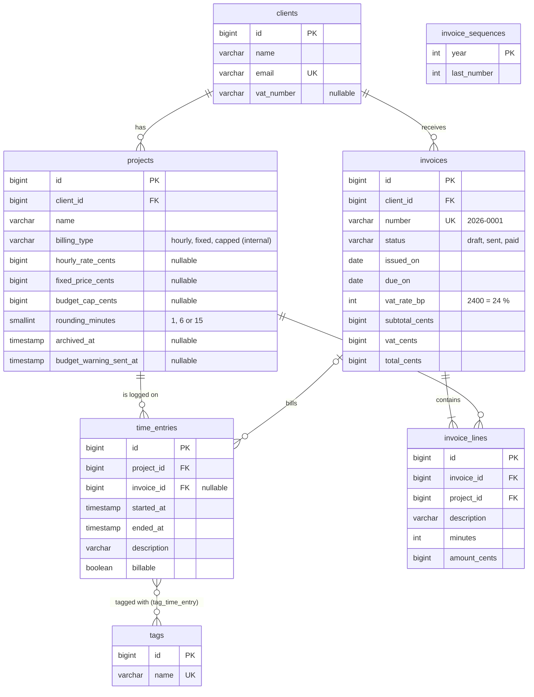
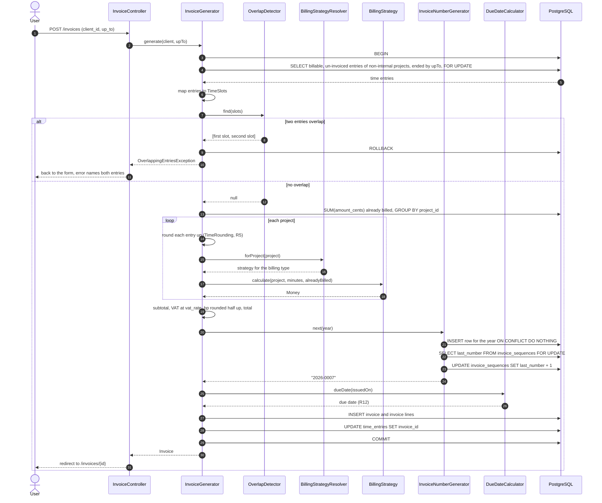
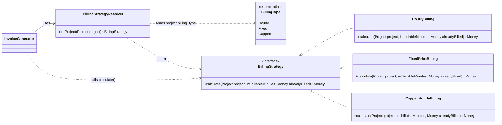
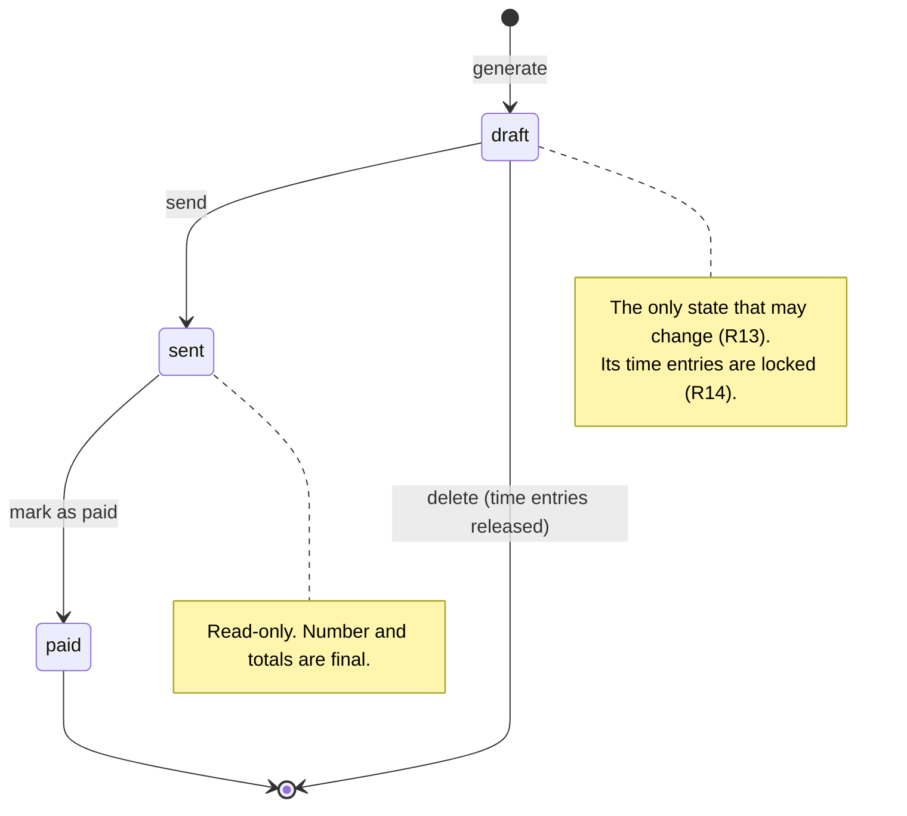

# 15 — Documentation in English · Laravel

[← Concepts](README.md) · Starting point: end of lesson 14 · Estimated time in class: 2 h

---

## What we build today

Today we write very little new PHP. We make the project **understandable and runnable by other people**.

- `docs/glossary.md` — one word per concept, used everywhere.
- A fixed `.env.example`, so a fresh clone connects to the Docker database.
- `README.md` — the full front page of the project, with a quick start that works.
- Doc comments (PHPDoc) on `Money`, `BillingStrategy`, `OverlapDetector`, `InvoiceGenerator` and
  `InvoiceNumberGenerator`, including generic array types and array shapes.
- Cleaned-up code comments: no commented-out code, no TODO without an issue.
- `docs/diagrams.md` with four Mermaid diagrams.
- `docs/adr/` with ADR 0001 complete and outlines for 0002 and 0003.
- `CHANGELOG.md` with version `1.0.0`, and a Git tag.
- `.github/pull_request_template.md` (optional).
- `scripts/fresh-clone-check.sh` — clones your repository into a temporary folder and follows the README.

**Final result:** when you open your repository on GitHub, the README shows what Billable is, a
screenshot, and commands that work. The `docs/` folder renders four diagrams as pictures. The fresh-clone
script ends with `Fresh clone check passed`.

> **Names in your project.** Class and method names below follow [PROJECT.md](../../PROJECT.md#code-map)
> and are exactly the ones you built in lessons 10–14 (`Money::fromCents()`, `OverlapDetector::find()`,
> `BillingStrategyResolver::forProject()`, `InvoiceGenerator::generate()` …). The code blocks show your
> existing code with doc comments added — the method bodies do not change. If you named something
> differently in your independent work, keep your names and copy the documentation style.

---

## Step 1 — Take stock and write the glossary

Before writing, look at what you already have. You will link to these files from the README, so you need
to know they exist and are up to date.

```bash
ls docs/
git log --oneline | head -20
```

You should see `request-lifecycle.md` (lesson 01), `architecture.md` (lesson 07), `patterns.md`
(lesson 08), `testing.md` (lesson 11) and `algorithm.md` (lesson 13). The capstone also asks for
`ai-usage.md`; if you have not kept one yet, create it now with a short list of where and how you used AI
tools. Open each file for one minute and check that it still describes the code as it is **today**.
For example, `patterns.md` from lesson 08 may still say that strategies return `int`; since lesson 10 they
return `Money`. Fix such details now.

Next, the glossary. It is short, but it makes every other document more consistent.

```markdown
<!-- docs/glossary.md -->
# Glossary

Billable uses one English word for each concept. The same word is used in the user interface, in
the code, in the documentation and in commit messages.

| Term | Meaning | In the code | Do not use |
|---|---|---|---|
| client | A company or person we work for | `App\Models\Client`, `clients` | customer, company |
| project | Work for one client, with one billing type | `App\Models\Project`, `projects` | job, task |
| billing type | How a project is billed: hourly, fixed or capped | `App\Enums\BillingType` | pricing, payment type |
| time entry | One block of work on a project, with start and end | `App\Models\TimeEntry`, `time_entries` | log, record, booking |
| billable | A time entry that should be invoiced | `time_entries.billable` | chargeable |
| rounding rule | Round each entry up to 1, 6 or 15 minutes | `projects.rounding_minutes`, `TimeRounding` | rounding step |
| budget cap | Maximum total amount for a capped project | `projects.budget_cap_cents` | limit, max budget |
| invoice | The document sent to a client | `App\Models\Invoice`, `invoices` | bill |
| invoice line | One project on an invoice | `App\Models\InvoiceLine`, `invoice_lines` | row, item, position |
| subtotal | Sum of the invoice lines, before VAT | `subtotal_cents` | net, sum |
| VAT | Value added tax, 24 %, stored in basis points (2400) | `vat_rate_bp`, `vat_cents` | tax, KM |
| total | Subtotal plus VAT | `total_cents` | gross, grand total |
| due date | Date by which the client must pay | `due_on`, `DueDateCalculator` | deadline, payment term |
| draft / sent / paid | The states of an invoice | `App\Enums\InvoiceStatus` | open, closed, done |
| cents | The smallest unit of money; 12.50 € is 1250 cents | `Money::$cents` | — |
```

**What happens:**

1. Each row pairs a word with its meaning **and** with the place in the code, so a reader can go from
   the README to the right class.
2. The "Do not use" column is the useful part. When you proofread, search for those words:
   `grep -rniwE "customer|bill|booking" app/ resources/views/ docs/`.
3. If your UI says "Customers" somewhere, change the label now. The UI is documentation too.

**Check it works:** open `docs/glossary.md` in your editor's Markdown preview (VS Code: `Ctrl+Shift+V`,
PhpStorm: the preview pane). The table renders with five columns.

**Commit:** `docs: add glossary of domain terms`

---

## Step 2 — Make `.env.example` match `compose.yaml`

A fresh clone has no `.env` file, because `.env` is in `.gitignore` (it may contain secrets). The quick
start therefore copies `.env.example` to `.env`. If `.env.example` still has the default values from the
Laravel installer, the fresh clone connects to the wrong database and every step after that fails.

First, compare the **keys** in your two files:

```bash
diff <(grep -o '^[A-Z_]*=' .env | sort) <(grep -o '^[A-Z_]*=' .env.example | sort)
```

No output means both files have the same keys. A line starting with `<` is a key that exists only in
your `.env` — add it to `.env.example`. Then open `.env.example` and make sure the database section
matches `compose.yaml` exactly:

```dotenv
# .env.example  (database and mail section — the rest stays as the installer created it)
APP_NAME=Billable

DB_CONNECTION=pgsql
DB_HOST=127.0.0.1
DB_PORT=5432
DB_DATABASE=billable
DB_USERNAME=billable
DB_PASSWORD=secret

MAIL_MAILER=log

BILLABLE_OWNER_EMAIL=owner@example.test
BILLABLE_NOTIFIER=mail
BILLABLE_VAT_RATE_BP=2400
```

**What happens:**

1. `DB_*` values are the same as in `compose.yaml` (service `postgres`, database `billable`, user
   `billable`, password `secret`). After `docker compose up -d`, Laravel can connect without any editing.
2. `MAIL_MAILER=log` means budget-warning e-mails (sent through your `MailNotifier` from lesson 09) are
   written to `storage/logs/laravel.log` instead of a real mail server. A stranger can see them without
   configuring SMTP.
3. The password `secret` is only for the local Docker database, so it is safe in `.env.example`. **Real
   passwords and API keys never go into `.env.example`** or any other committed file.
4. `APP_KEY=` stays empty. `php artisan key:generate` fills it in the copied `.env`.

The three `BILLABLE_*` keys are the ones `config/billable.php` reads (`owner_email` and `notifier` from
lesson 09, `vat_rate_bp` from lesson 10). They must be in `.env.example` too, with harmless example
values. (Lesson 09 put `MAIL_MAILER=smtp` for Mailpit into `.env.example`; `log` is simpler for a
stranger who has not started Mailpit. Either works — choose one and say so in the README.)

**Check it works:** `grep DB_ .env.example` prints the six lines above, and `grep APP_KEY= .env.example`
shows an empty value.

**Commit:** `chore: align .env.example with compose.yaml`

---

## Step 3 — Write the README

Now the main document. Replace the default Laravel README completely — it describes Laravel, not your
application. Here is the full version for Billable. Replace `<your-user>` and `Your Name`, and adapt the
details marked in the explanation below.

````markdown
<!-- README.md -->
# Billable

Billable is a time-tracking and invoicing web application for freelancers and small agencies.
You log the time you work for clients, and Billable turns the billable time into correct invoices
with Estonian VAT (24 %). It supports hourly, fixed-price and capped-hourly projects, and it warns
you once when a capped project reaches 80 % of its budget.

Built with Laravel 12, PHP 8.4 and PostgreSQL 17 as the capstone project of module M8 at
Kuressaare Ametikool.


## Requirements

- PHP 8.4 with the `pdo_pgsql` and `pdo_sqlite` extensions ([Laravel Herd](https://herd.laravel.com)
  includes both)
- Composer 2
- Docker Desktop (runs PostgreSQL 17)
- Git

You do not need Node.js: styles come from Pico.css via a CDN.

## Quick start

```bash
git clone https://github.com/<your-user>/billable.git
cd billable
composer install
cp .env.example .env
php artisan key:generate
docker compose up -d --wait
php artisan migrate --seed
php artisan serve
```

Open <http://127.0.0.1:8000>. You should see the home page. The seeders create three clients,
their projects and three weeks of time entries, so you can generate an invoice straight away:
**Invoices → Generate invoice**, choose a client and today's date.

With Laravel Herd you can skip `php artisan serve` and open <http://billable.test> instead.

To start again with fresh demo data: `php artisan migrate:fresh --seed`.

## Running the tests

```bash
php artisan test
```

- Unit tests (`tests/Unit`) test pure PHP classes such as `Money`, `TimeRounding` and the billing
  strategies. They do not touch a database.
- Feature tests (`tests/Feature`) send HTTP requests to the application. They use an in-memory
  SQLite database configured in `phpunit.xml`, so they need the `pdo_sqlite` extension.
- Optional: `php artisan test --configuration=phpunit.pgsql.xml` runs the same tests on PostgreSQL
  (database `billable_test`, created once with
  `docker compose exec postgres createdb -U billable billable_test`). SQLite ignores the
  `SELECT … FOR UPDATE` row locks, so locking behaviour is only really checked on PostgreSQL.

Code style is checked with Laravel Pint: `./vendor/bin/pint --test`. GitHub Actions runs Pint and
all tests on every push (`.github/workflows/`).

## Project structure

| Path | What is in it |
|---|---|
| `app/Http/Controllers`, `app/Http/Requests` | Thin controllers and Form Request validation |
| `app/Models` | Eloquent models: `Client`, `Project`, `TimeEntry`, `Tag`, `Invoice`, `InvoiceLine` |
| `app/Enums` | `BillingType`, `InvoiceStatus` |
| `app/Services` | Application services, e.g. `TimeEntryService`, `BudgetMonitor` |
| `app/Billing` | Billing strategies (hourly, fixed, capped) and `BillingStrategyResolver` |
| `app/Invoicing` | `InvoiceGenerator`, `OverlapDetector`, `InvoiceNumberGenerator` |
| `app/Support` | Value objects and calculations: `Money`, `TimeRounding`, `DueDateCalculator` |
| `app/Contracts`, `app/Notifiers`, `app/Mail` | The `Notifier` interface, its adapters (mail, log) and the `NotificationMail` mailable |
| `app/Events`, `app/Listeners` | `TimeEntryLogged` and the budget check |
| `database/` | Migrations, factories and seeders |
| `resources/views` | Blade templates; layout in `layouts/app.blade.php` |
| `tests/` | Unit and feature tests |
| `docs/` | Architecture, diagrams, decisions (ADRs) and glossary |

## Configuration

All settings are in `.env`. For local development the values from `.env.example` work unchanged.

| Setting | Default | Meaning |
|---|---|---|
| `DB_HOST`, `DB_PORT` | `127.0.0.1`, `5432` | PostgreSQL started by `compose.yaml` |
| `DB_DATABASE`, `DB_USERNAME`, `DB_PASSWORD` | `billable`, `billable`, `secret` | Local development only |
| `MAIL_MAILER` | `log` | Budget warnings are written to `storage/logs/laravel.log` |
| `BILLABLE_OWNER_EMAIL` | `owner@example.test` | Who receives budget warnings |
| `BILLABLE_NOTIFIER` | `mail` | `mail` (through Laravel's mailer) or `log` |
| `BILLABLE_VAT_RATE_BP` | `2400` | VAT for new invoices in basis points (24 %); each invoice stores its own rate |

The other business constants (due date 14 days, budget warning at 80 %) are defined in code, not in
`.env`, because they are business rules (`DueDateCalculator::PAYMENT_TERM_DAYS`,
`BudgetMonitor::WARNING_THRESHOLD_PERCENT`). The rules R1–R14 are listed in
[docs/architecture.md](docs/architecture.md).

## Documentation

- [Architecture and layers](docs/architecture.md)
- [Diagrams: data model, invoice generation, strategies, invoice states](docs/diagrams.md)
- [Design patterns used](docs/patterns.md)
- [The invoice generation algorithm](docs/algorithm.md)
- [Request lifecycle](docs/request-lifecycle.md)
- [Glossary](docs/glossary.md)
- [Architecture decision records](docs/adr/)
- [Changelog](CHANGELOG.md)
- [How AI tools were used](docs/ai-usage.md)

### Key decisions

- [ADR 0001 — Integer cents for money](docs/adr/0001-integer-cents-for-money.md)
- [ADR 0002 — Invoice numbers from a locked sequence row](docs/adr/0002-invoice-sequence-row-lock.md)
- [ADR 0003 — Notifier adapter instead of calling the mailer](docs/adr/0003-notifier-adapter.md)

## Known limitations

- Single user; there is no login.
- One currency (EUR) and one VAT rate per invoice.
- Invoices are shown as web pages; there is no PDF export.

## Licence

MIT — see [LICENSE](LICENSE). Author: Your Name, Kuressaare Ametikool.
````

**What happens:**

1. **The first paragraph** answers "what is it and for whom" in plain words. It uses the glossary terms:
   *client*, *time entry*, *invoice*, *capped*.
2. **Requirements** name exact versions and PHP extensions. `pdo_pgsql` is needed for the app,
   `pdo_sqlite` for the feature tests. A missing extension is the most common failure on a fresh machine.
3. **Quick start** is a single copy-paste block, in the order a fresh clone needs it:
   - `composer install` creates `vendor/` from `composer.lock` (exact versions, same as yours);
   - `cp .env.example .env` creates the settings file (Step 2 made it correct);
   - `php artisan key:generate` writes a random `APP_KEY` into `.env` — without it Laravel cannot encrypt
     sessions and shows "No application encryption key has been specified";
   - `docker compose up -d --wait` starts PostgreSQL in the background and waits until the healthcheck
     from lesson 01 reports it *healthy* — so the next command does not hit "Connection refused";
   - `php artisan migrate --seed` creates all tables and runs `DatabaseSeeder`;
   - `php artisan serve` starts the development server on port 8000.
4. The sentence after the block says **what the reader should see**. Without it, the reader does not know
   whether it worked.
5. **Running the tests** says what the tests need. Adapt the three bullets to what you built in lessons 11,
   12 and 14: if all your tests use SQLite, delete the PostgreSQL bullet; if you have a separate test
   database, say how it is created.
6. **Project structure** is a table with one line per folder. It is a map, not a tour.
7. **Configuration** lists only settings the application really reads. Do not invent tidy names that do
   not exist in the code. The README points to `docs/architecture.md` for the business rules; if that
   file does not list R1–R14 yet, copy the rules table from PROJECT.md into it.
8. **Known limitations** is honest about what is not there. Reviewers value this; it shows you know your
   system.
9. Pick a licence. MIT is a common choice for learning projects. GitHub can create the `LICENSE` file:
   **Add file → Create new file**, name it `LICENSE`, then click **Choose a license template**.

If your layout uses `@vite(...)` (for example because you kept a Laravel default view), the page needs
`npm install && npm run build` as well — either add that to the quick start or remove the `@vite` line.
The fresh-clone script in Step 13 will find this problem for you.

**Check it works:** push, then open the repository on GitHub. The README renders under the file list, the
code blocks have a copy button, and all links under **Documentation** open a file (a broken link shows a
404 page). The image is broken until Step 4.

**Commit:** `docs(readme): describe Billable, quick start and tests`

---

## Step 4 — Add a screenshot

1. Start the app (`php artisan serve`) and generate an invoice for a seeded client.
2. Take a screenshot of the invoice page: macOS `Cmd+Shift+4`, Windows `Win+Shift+S`.
3. Save it as `docs/screenshot.png`. Crop it to the browser content. Keep it under about 500 KB.
4. Use only seeded (fake) data. Never put real client names or e-mail addresses from your job in a public
   repository.

**Check it works:** the README preview in your editor shows the image.

**Commit:** `docs(readme): add screenshot of the invoice page`

---

## Step 5 — Clean up code comments

Comments rot faster than code. Search for the three worst kinds.

```bash
# 1. TODO and FIXME without an issue number
grep -rnE "TODO|FIXME" app/ tests/ resources/views/ | grep -v "#[0-9]"

# 2. Commented-out code (lines that look like PHP statements after //)
grep -rnE "^\s*//\s*(\\\$|return |if \(|foreach|public function|use )" app/ tests/

# 3. Estonian letters in code, views and tests
grep -rniE "[õäöüšž]" app/ resources/views/ routes/ database/ tests/
```

For each result, decide:

| Found | Do |
|---|---|
| Commented-out code | Delete it. Git has the old version. |
| TODO you will do now | Do it and delete the comment. |
| TODO for later | Create a GitHub issue and write `// TODO(#12): …` |
| Comment that repeats the code | Delete it, or rewrite it to say *why*. |
| Estonian word or letter | Translate it. Test names too: `test_arve_loomine` → `test_generates_invoice`. |

Here is a typical before and after from `TimeEntryService` — the R14 guard from lesson 13, as it might
look after a hurried evening (your code will look different — the point is the comments):

```php
// app/Services/TimeEntryService.php — BEFORE (the R14 guard from lesson 13)
private function assertNotInvoiced(TimeEntry $entry): void
{
    // kontrollime kas on arvel
    // if ($entry->invoice_id !== null) {
    if ($entry->isInvoiced()) { // is invoiced?
        throw TimeEntryLockedException::for($entry); // throw
    }
}
```

```php
// app/Services/TimeEntryService.php — AFTER

/**
 * R14: an entry on an invoice is part of a legal document, so it can no longer change.
 */
private function assertNotInvoiced(TimeEntry $entry): void
{
    if ($entry->isInvoiced()) {
        throw TimeEntryLockedException::for($entry);
    }
}
```

**What happens:**

1. The Estonian comment is replaced by the **reason** and the rule number, which a reader can look up.
2. The commented-out line is deleted.
3. `// is invoiced?` and `// throw` repeated the code, so they are removed.
4. The exception is the named domain exception from lesson 13. Its message is already a full English
   sentence, because users and logs will read it.

**Check it works:** run the three `grep` commands again. They print nothing (or only lines you
deliberately kept, like a TODO with an issue number). Run `php artisan test` — comments cannot break
tests, but a deleted "commented-out" line that was not really commented out can.

**Commit:** `refactor: remove dead code and explain business rules in comments`

---

## Step 6 — Document `Money`

Now the doc comments. We start with `Money`, because every other class uses it. Document the class (what
it is and why it exists) and the methods whose contract is not obvious from the name.

Open `app/Support/Money.php` and add the comments shown here. The method bodies are exactly the ones
from lesson 10 (plus `sum()` from lesson 11); they are shown so you can find the right place.

```php
<?php

// app/Support/Money.php

namespace App\Support;

use InvalidArgumentException;
use OverflowException;

/**
 * An amount of money in euro cents.
 *
 * Billable never uses floats for money (rule R1). All arithmetic is done on integers, and a
 * fraction of a cent is rounded half up exactly once, where it appears (rule R3).
 * See docs/adr/0001-integer-cents-for-money.md for the reasons.
 *
 * Money is immutable: every operation returns a new object. Create it with zero(), fromCents()
 * or fromEuros(); the constructor is private so the unit is always visible at the call site.
 */
final readonly class Money
{
    private function __construct(public int $cents)
    {
        if ($cents === PHP_INT_MIN) {
            throw new OverflowException('Money amount is out of range.');
        }
    }

    public static function zero(): self
    {
        return new self(0);
    }

    /**
     * Creates an amount from a whole number of cents.
     *
     * @param  int  $cents  the amount in cents, for example 1250 for 12.50 €; may be negative
     */
    public static function fromCents(int $cents): self
    {
        return new self($cents);
    }

    /**
     * Parses a euro amount typed by a user, without using floats.
     *
     * Accepts a dot or a comma as the decimal separator and at most two decimals:
     * "85", "85.5", "85,50", "-3.10". Surrounding spaces are ignored.
     *
     * @throws InvalidArgumentException for anything else, including three decimals ("85.505"),
     *                                  because silently rounding user input would hide a decision
     */
    public static function fromEuros(string $euros): self
    {
        // body from lesson 10 unchanged
    }

    /**
     * Adds up any number of amounts. The sum of no amounts is zero.
     */
    public static function sum(Money ...$amounts): self
    {
        // body from lesson 11 unchanged
    }

    public function add(Money $other): self
    {
        return new self(self::checked($this->cents + $other->cents));
    }

    /**
     * Returns this amount minus the other amount.
     *
     * The result may be negative. Callers that need "what is left" write
     * ->max(Money::zero()) explicitly, as the fixed-price and capped strategies do.
     */
    public function subtract(Money $other): self
    {
        return new self(self::checked($this->cents - $other->cents));
    }

    public function multiply(int $factor): self
    {
        return new self(self::checked($this->cents * $factor));
    }

    /**
     * Returns the given share of this amount, rounded half up to the cent (R3).
     *
     * The share is given in basis points: 1 % is 100 basis points, so 24 % VAT is 2400.
     * The calculation uses integers only: (cents × basisPoints + 5000) div 10000.
     * Example: 10.05 € at 2400 basis points is 2.412 €, which rounds to 2.41 €.
     * For negative amounts "half up" means away from zero: -0.5 cent becomes -1 cent.
     *
     * @param  int<0, max>  $basisPoints  the share in basis points
     *
     * @throws OverflowException if the intermediate product does not fit in an int
     */
    public function percentageBp(int $basisPoints): self
    {
        return new self(self::divideHalfUp(self::checked($this->cents * $basisPoints), 10_000));
    }

    public function min(Money $other): self
    {
        return $this->cents <= $other->cents ? $this : $other;
    }

    public function max(Money $other): self
    {
        return $this->cents >= $other->cents ? $this : $other;
    }

    // isZero(), isNegative(), greaterThanOrEqual() and equals() from lesson 10 unchanged —
    // their names say everything, so they get no doc comment.

    /**
     * Formats the amount Estonian style for display: "1 234,50 €".
     *
     * Uses a normal space (U+0020) between thousands. For calculation, always use the Money
     * object itself, never the formatted string.
     */
    public function format(): string
    {
        // body from lesson 10 unchanged
    }

    // divideHalfUp() and checked() are private helpers from lesson 10; their existing
    // one-line comments are enough.
}
```

**What happens:**

1. **The class comment** says what the class *is*, which rules it implements (R1, R3), and where the
   reasons are (the ADR). A reader who wonders "why not just use float?" gets the answer in one click.
2. `fromCents()` documents the **unit**. "cents" is in the name, but the example `1250 for 12.50 €` removes
   every doubt. Units are the most valuable thing to document for any number.
3. `zero()`, `add()`, `multiply()`, `min()` and `max()` have **no** doc comment. Their name and signature
   say everything. Writing `/** Adds two amounts. */` would be noise.
4. `subtract()` has a comment because it has a **trap**: the result can be negative. The comment names the
   pattern callers use instead (`->max(Money::zero())`).
5. `percentageBp()` is the most important one. It explains the unit (basis points), the exact formula, a
   worked example with rounding, and what happens to negative amounts. `int<0, max>` is a **PHPStan
   integer range type**: PHP only knows `int`, but PHPStan will warn if you pass a value that may be
   negative.
6. `@throws` names the exception **and** the reason (see `fromEuros()`). The reason stops a future
   developer from simply removing the check.
7. PHPDoc uses the Laravel style with two spaces between the parts of a tag (`@param  int  $cents`). Pint's
   `laravel` preset keeps this layout. Pint may also remove a `@param` tag that only repeats the native
   type and has no description — that is intended.

If you did the lesson 13 discount task, document `allocate()` the same way (what the ratios mean, that the
parts always add up to the whole, and how ties are broken). `HourlyBilling::forMinutes()` from lesson 10
is the other place where a money fraction is rounded — give it a doc comment with the formula
`(rate × minutes + 30) div 60` and an example.

**Check it works:** in your editor, hover over a call to `percentageBp(` in `InvoiceGenerator`. The
tooltip shows your summary, the parameter description and the exception.
Run `./vendor/bin/pint --test` — it passes (or run `./vendor/bin/pint` to fix the layout).

---

## Step 7 — Document the `BillingStrategy` interface

An interface is a contract that other classes implement, so it needs the best documentation of all. The
implementations then inherit it.

```php
<?php

// app/Billing/BillingStrategy.php

namespace App\Billing;

use App\Models\Project;
use App\Support\Money;

/**
 * Calculates how much to bill for one project on one invoice.
 *
 * There is one implementation per billing type: HourlyBilling, FixedPriceBilling,
 * CappedHourlyBilling (and InternalBilling, the Null Object for internal projects).
 * BillingStrategyResolver::forProject() chooses the right one from the project's billing type,
 * so callers never switch on the billing type themselves (Strategy pattern, see docs/patterns.md).
 */
interface BillingStrategy
{
    /**
     * Returns the amount to bill now for the given minutes of work.
     *
     * Implementations are pure calculations: they read the project's rates, but they do not
     * save anything, send anything or read the current time. This makes them easy to unit test.
     *
     * @param  Project  $project  the project being billed; the rate fields its billing type needs are set
     * @param  int<0, max>  $billableMinutes  billable minutes, already rounded up per time entry (R5)
     * @param  Money  $alreadyBilled  the total billed for this project on earlier invoices;
     *                                hourly billing ignores it
     * @return Money the amount to bill; never negative, and zero when nothing is left to bill
     */
    public function calculate(Project $project, int $billableMinutes, Money $alreadyBilled): Money;
}
```

(Leave out `InternalBilling` in the comment if you did not do the lesson 08 basic task.)

Now the implementations. They need a **class** comment that states their rule, but no method comment:
IDEs and PHPStan inherit the method documentation from the interface. Add a class comment to each of the
three classes, for example:

```php
// app/Billing/CappedHourlyBilling.php — replace the class comment above "class CappedHourlyBilling …" with:

/**
 * Bills like hourly billing, but the total for the project never exceeds its budget cap (R7).
 *
 * Amount = min(hourly amount, max(budget cap − already billed, 0)). The hourly amount comes from
 * the injected HourlyBilling, so the R6 formula exists only once.
 */
class CappedHourlyBilling implements BillingStrategy
```

```php
// app/Billing/FixedPriceBilling.php

/**
 * Bills the part of the fixed price that has not been billed yet (R8).
 *
 * The number of minutes does not change the amount. Amount = max(fixed price − already billed, 0).
 */
class FixedPriceBilling implements BillingStrategy
```

```php
// app/Billing/HourlyBilling.php

/**
 * Bills rounded minutes at the project's hourly rate (R6).
 *
 * Amount = (minutes × hourly rate in cents + 30) div 60, which is integer division rounded half up.
 * The formula lives in the static forMinutes(), so code without a Project can use it too.
 */
class HourlyBilling implements BillingStrategy
```

(The strategies are not `final` — lesson 07 explains why injected classes stay open. Keep the class line
as it is and only add or replace the comment.)

**What happens:**

1. The interface comment tells a new developer **where the decision is made** (the resolver). That is the
   exact question from the defence: "Open the file where the billing strategy is chosen."
2. The method comment states a **design rule** ("pure calculations") so nobody adds a database call to a
   strategy later.
3. `$billableMinutes` says "already rounded". Without this, one developer rounds in the generator and
   another rounds again in the strategy — a real bug that bills 15 extra minutes.
4. Each implementation's class comment states its formula in one line. The formula is the *what* at the
   business level, which the code alone does not show clearly.

**Check it works:** in `InvoiceGenerator`, hover over `->calculate(`. The tooltip shows the interface
documentation even though the object is a concrete strategy.

**Commit:** `docs(billing): document Money and the BillingStrategy contract`

---

## Step 8 — Document `OverlapDetector`, `InvoiceGenerator` and `InvoiceNumberGenerator`

These are the classes of your most complex component (ÕV8). Here we use **generic array types** and
**array shapes**, because these classes pass arrays and collections around.

### `OverlapDetector`

```php
<?php

// app/Invoicing/OverlapDetector.php

namespace App\Invoicing;

/**
 * Finds two time slots that overlap in time (R10).
 *
 * An invoice must not bill the same minutes twice, so InvoiceGenerator refuses to create an
 * invoice when two of its entries overlap. The detector works on TimeSlot value objects, not on
 * Eloquent models, so it is pure and has plain PHPUnit tests (tests/Unit/Invoicing).
 */
final class OverlapDetector
{
    /**
     * Returns the first pair of slots whose time ranges overlap, or null if there is none.
     *
     * Time ranges are half-open: a slot that ends at 10:00 does not overlap a slot that
     * starts at 10:00. The method sorts a copy of the list by start (then end), so it runs in
     * O(n log n) time and does not change the caller's array.
     *
     * @param  list<TimeSlot>  $slots  the slots of one invoice, in any order
     * @return array{0: TimeSlot, 1: TimeSlot}|null the pair; index 0 is the slot that started first
     */
    public function find(array $slots): ?array
    {
        // Sort by start: then a slot can only overlap an earlier one that has not ended yet.
        usort($slots, fn (TimeSlot $a, TimeSlot $b): int => [$a->start, $a->end] <=> [$b->start, $b->end]);

        $latest = null;

        foreach ($slots as $slot) {
            // Strictly "less than": touching slots are allowed (half-open ranges).
            if ($latest !== null && $slot->start < $latest->end) {
                return [$latest, $slot];
            }

            // Remember the slot that ends latest so far.
            if ($latest === null || $slot->end > $latest->end) {
                $latest = $slot;
            }
        }

        return null;
    }
}
```

**What happens:**

1. `list<TimeSlot>` means "an array with keys 0, 1, 2 … and `TimeSlot` values". `array<int, TimeSlot>`
   is similar but allows any integer keys. Use `list` when the keys do not matter.
2. `array{0: TimeSlot, 1: TimeSlot}|null` is an **array shape**: PHPStan now knows the exact keys and
   types. If someone writes `$pair[2]` or `$pair[0]->id` (the property is `entryId`), PHPStan reports it.
3. The comment documents the **boundary rule** (half-open ranges). That is the most likely question when
   a test fails at 10:00 exactly.
4. Complexity is documented because it is part of ÕV8 and because a caller may wonder whether it is safe
   for 10 000 entries.
5. The inline comments explain the **idea** of the algorithm, not the syntax of `usort`.

`TimeSlot` gets a class comment too ("the part of a time entry that the overlap check needs") — lesson 13
already gave it one; check that it still says so. If you changed the detector in your independent work
(for example to compare all pairs), write comments that describe **your** behaviour. If it compares all
pairs, the complexity is O(n²) — write that honestly.

### `InvoiceGenerator`

The generator is long, so here we show only the parts that get documentation. The method bodies stay
exactly as in lessons 13 and 14.

```php
<?php

// app/Invoicing/InvoiceGenerator.php — class comment, generate() and one private helper

/**
 * Turns a client's billable, not yet invoiced time entries into a draft invoice.
 *
 * This is the core algorithm of Billable. It is explained step by step in docs/algorithm.md
 * and drawn as a sequence diagram in docs/diagrams.md.
 */
final class InvoiceGenerator
{
    // constructor from lesson 13 unchanged:
    // (OverlapDetector, BillingStrategyResolver, InvoiceNumberGenerator, DueDateCalculator)

    /**
     * Generates a draft invoice for all billable, uninvoiced entries of a client up to a date.
     *
     * Everything happens in one database transaction. The invoice, its lines, the invoice number
     * and the link from each entry to the invoice are saved together, or not at all.
     *
     * Side effects: every included entry gets this invoice's id, which locks it against changes (R14),
     * and the year's row in invoice_sequences is incremented (R11). While the transaction runs, the
     * included entries are locked (SELECT … FOR UPDATE), so a parallel request cannot bill them too.
     *
     * @param  Client  $client  the client to invoice
     * @param  CarbonImmutable  $upTo  last day to include (Europe/Tallinn); entries that end on or before the end of this day are included
     * @return Invoice the saved draft invoice with its lines loaded; issued today, due date by R12
     *
     * @throws NothingToInvoiceException if the client has no billable, uninvoiced entries up to $upTo
     * @throws OverlappingEntriesException if two included entries overlap (R10); nothing is saved
     */
    public function generate(Client $client, CarbonImmutable $upTo): Invoice
    {
        // body from lessons 13–14 unchanged
    }

    /**
     * One invoice line per project: rounded minutes and the amount from the project's billing strategy.
     *
     * @param  Collection<int, TimeEntry>  $entries  entries with their project loaded
     * @return list<array{project_id: int, description: string, minutes: int, amount_cents: int}>
     */
    private function buildLines(Collection $entries): array
    {
        // body from lesson 13 unchanged
    }
}
```

**What happens:**

1. The **summary** of `generate()` is one sentence in the present tense, starting with a verb.
2. The second paragraph states the **transaction guarantee**. A caller needs to know that a failure leaves
   nothing half-saved.
3. **Side effects** get their own paragraph. They are invisible in the signature and very important: after
   this call, entries cannot be deleted or changed any more.
4. `$upTo` documents whether the day is **inclusive**, what exactly is compared (`ended_at`), and which
   timezone applies — the questions every date parameter raises.
5. `@throws` lists both exceptions from lesson 13 and the condition for each. Both extend
   `InvoicingException`, which is why `InvoiceController::store()` can catch them with one `catch`.
6. The private helper has a doc comment only for its **types**: `Collection<int, TimeEntry>` tells PHPStan
   what the Eloquent collection contains, and the array shape describes each line before
   `$invoice->lines()->createMany()` turns it into an `InvoiceLine`. The collection is
   `Illuminate\Database\Eloquent\Collection`, because the entries come from a query. Lesson 13 already
   wrote this `@return` shape; check that it still matches the keys you pass to `createMany()` (for
   example `discount_cents` if you did the discount task).

### `InvoiceNumberGenerator`

```php
// app/Invoicing/InvoiceNumberGenerator.php — above next(int $year) from lesson 14

/**
 * Reserves and returns the next invoice number for a year, for example "2026-0007".
 *
 * Must be called inside a database transaction. The method locks the year's row in
 * invoice_sequences (SELECT … FOR UPDATE), so a second request waits until the first one
 * commits. This guarantees numbers without gaps and without duplicates (R11).
 * If the transaction rolls back, the number is not used and the next invoice gets it.
 *
 * @param  int  $year  the year of the issue date, for example 2026
 * @return string the number in the format YYYY-NNNN
 *
 * @throws LogicException if it is called outside a transaction, because the lock would be released at once
 */
```

**Check it works:**

1. Run `./vendor/bin/pint` and then `php artisan test`. Everything is still green.
2. Hover over `generate(` in `InvoiceController`. You see the summary, the parameters and both exceptions.

**Optional — HTML documentation.** [phpDocumentor](https://docs.phpdoc.org/) can turn these PHPDoc
comments into a browsable HTML site. For a project of this size it is not required; the IDE tooltips and
PHPStan (see the intermediate task) give you most of the value.

**Commit:** `docs(invoicing): document invoice generation, overlap detection and numbering`

---

## Step 9 — Four diagrams in `docs/diagrams.md`

Create one file with all four diagrams. Each diagram has a short sentence saying what question it answers.

````markdown
<!-- docs/diagrams.md -->
# Diagrams

All diagrams are written in [Mermaid](https://mermaid.js.org/) and render on GitHub.
Update them in the same commit as the code they describe.

## 1. Data model

Which tables exist and how they are related. Money columns are integer cents.



`invoice_sequences` has no foreign keys. It holds one row per year and is locked while an invoice
number is reserved (see [ADR 0002](adr/0002-invoice-sequence-row-lock.md)).

## 2. Invoice generation

What happens when the user clicks **Generate invoice**. Everything between BEGIN and COMMIT is one
transaction.



If the query finds no entries at all, the generator throws `NothingToInvoiceException` before step 6 and
the transaction is rolled back; that branch is left out to keep the diagram readable.

## 3. Billing strategies

Where the billing type is turned into a calculation.



## 4. Invoice states

Which status changes are allowed. Only a draft can be edited or deleted (R13).


````

**What happens:**

1. **ER diagram.** Each relationship line uses crow's-foot symbols: `||--o{` means "exactly one to zero or
   more". `|o--o{` for invoices–time entries means an entry has **zero or one** invoice (the `invoice_id`
   is nullable). `||--|{` means an invoice has **at least one** line. The attribute blocks list the real
   column names from the migrations; the quoted text after a column is a comment.
2. **Sequence diagram.** `autonumber` numbers the arrows, so in the defence you can say "at step 22 the row
   is locked". `alt … else … end` shows the two outcomes. `loop` shows the per-project work. Solid arrows
   (`->>`) are calls, dashed arrows (`-->>`) are returns.
3. **Class diagram.** `<|..` means "implements". `..>` is a dependency ("uses or returns"), `-->` an
   association ("has a field of this type"). The resolver is the **only** class that knows about
   `BillingType`; that is the point of the Strategy pattern.
4. **State diagram.** `[*]` is the start and the end. The notes carry the business rules R13 and R14.
   If your lesson 13 independent work added more transitions (for example "cancel"), add them.
5. Check the names against your code: the method `forProject()`, the case names in `BillingType` (add
   `Internal` and `InternalBilling` if you did the lesson 08 task), the URL of the form. The diagram must
   describe **your** code.

**Check it works:** push and open `docs/diagrams.md` on GitHub. All four diagrams appear as pictures. If
one shows "Unable to render rich display" and a parse error, see Troubleshooting. You can also paste a
diagram into the [Mermaid live editor](https://mermaid.live/) to see errors while you type.

**Commit:** `docs: add ER, sequence, class and state diagrams`

---

## Step 10 — Architecture decision records

Create the folder `docs/adr/`. We write ADR 0001 in full now, and create 0002 and 0003 as outlines that
you complete at home.

```markdown
<!-- docs/adr/0001-integer-cents-for-money.md -->
# 1. Use integer cents for money

- **Status:** accepted
- **Date:** 2026-10-15
- **Deciders:** Your Name

## Context

Billable calculates hourly amounts, budget caps, fixed prices, VAT and invoice totals. The numbers
on an invoice are legal and financial data: they must be exact, and a client must be able to check
them by hand.

The obvious option is PHP's `float`. Floats are binary fractions, so most decimal amounts cannot be
stored exactly. For example `0.1 + 0.2` is `0.30000000000000004`, and a total built from many such
additions can be off by a cent. Rounding with `round()` hides the problem in some cases but not all.

We considered three options:

1. `float` in PHP and `double precision` in PostgreSQL.
2. Decimal strings in PHP (with the bcmath extension) and `numeric(12, 2)` in PostgreSQL.
3. Whole numbers of cents: `int` in PHP and `bigint` in PostgreSQL, wrapped in a `Money` value object.

## Decision

We store and calculate all money as integer cents (option 3).

- Every money column ends in `_cents` and has the type `bigint`.
- In PHP, amounts are `App\Support\Money` objects that hold an `int`.
- Where a fraction of a cent appears (hourly amounts and VAT), we round half up once, with integer
  arithmetic: `(minutes × rate + 30) ÷ 60` and `(subtotal × basisPoints + 5000) ÷ 10000`.
- Rates are stored in basis points: 24 % VAT is `2400`.
- `float` is not allowed anywhere money is calculated.

## Consequences

Positive:

- Addition and subtraction are always exact. The invoice total always equals the sum of its lines.
- Rounding happens in two known places, which are easy to unit test at the boundaries.
- Integer comparison is simple and fast; PostgreSQL `bigint` and PHP `int` (64-bit) have the same range.

Negative:

- Every amount must be converted for display (`1250` → `12,50 €`). Forgetting this shows wrong values
  on the page, so formatting lives in one method.
- Developers must remember the unit. The `_cents` suffix and the `Money` type make this visible.
- PHP silently turns an `int` that overflows into a `float`. `Money` checks every result and throws an
  `OverflowException` instead, so this can never produce a wrong amount — but it is one more rule the
  class must keep. (The range itself, about 92 quadrillion euros, is not a practical limit.)
- Division that must split an amount into parts (for example a discount across lines) needs an
  explicit allocation method, because integer division loses the remainder (`Money::allocate()`,
  lesson 13 independent work).

Rejected: option 1 because of rounding errors (rule R1). Option 2 is exact, but bcmath works with
strings, is easy to misuse, and adds nothing for amounts that have exactly two decimal places.
```

Now the two outlines. Copy the headings and write the key points as bullets; you complete them as
independent work.

```markdown
<!-- docs/adr/0002-invoice-sequence-row-lock.md -->
# 2. Reserve invoice numbers from a locked sequence row

- **Status:** proposed
- **Date:** 2026-10-15

## Context
- R11: numbers `YYYY-NNNN`, per year, no gaps, no duplicates.
- Lesson 13 used `MAX(number) + 1`. Lesson 14 showed two parallel requests get the same number.
- Options: MAX + 1 with a unique index and retry; PostgreSQL SEQUENCE; `invoice_sequences` table with row lock.

## Decision
- TODO

## Consequences
- TODO (positive and negative)
```

```markdown
<!-- docs/adr/0003-notifier-adapter.md -->
# 3. Send notifications through a Notifier adapter

- **Status:** proposed
- **Date:** 2026-10-15

## Context
- R9: warn the owner once at 80 % of the budget cap.
- Calling `Mail::to(...)` directly from `BudgetMonitor` ties the rule to e-mail and to Laravel's mailer.

## Decision
- TODO: `App\Contracts\Notifier`, `MailNotifier`, `LogNotifier`, binding in `AppServiceProvider`.

## Consequences
- TODO
```

**What happens:**

1. The file name has a four-digit number and a short slug. Numbers never change and are never reused.
2. **Context** is written so that someone who was not there understands the problem. It lists the real
   options. An ADR without alternatives is only an announcement.
3. **Decision** is in active voice and present tense: "We store…". It lists concrete rules a reviewer can
   check in the code.
4. **Consequences** has negative points too. Every decision has a cost; writing it down shows you
   understood the trade-off — exactly what the teacher asks at the defence ("Why are amounts integers?").
5. The outlines have status `proposed`. When you finish them, change it to `accepted`.

**Check it works:** the README links under **Key decisions** now open the three files.

**Commit:** `docs(adr): record integer cents decision and outline two more`

---

## Step 11 — `CHANGELOG.md` and the version tag

```markdown
<!-- CHANGELOG.md -->
# Changelog

All notable changes to this project are documented in this file.

The format is based on [Keep a Changelog](https://keepachangelog.com/en/1.1.0/),
and this project adheres to [Semantic Versioning](https://semver.org/spec/v2.0.0.html).

## [Unreleased]

## [1.0.0] - 2026-10-15

### Added

- Clients and projects with hourly, fixed-price and capped-hourly billing.
- Time sheet with tags, and a weekly summary report.
- Billing strategies selected by `BillingStrategyResolver`.
- Budget warning at 80 % of the cap, sent once through the `Notifier` adapter.
- `Money`, `TimeRounding` and `DueDateCalculator` with integer-cent arithmetic.
- Invoice generation with overlap detection, rounding, VAT and gap-free numbering.
- Invoice states draft, sent and paid; only drafts can be edited or deleted.
- Unit, mock-based and feature tests, run in GitHub Actions with Pint.
- README, doc comments, diagrams and architecture decision records.

### Fixed

- Duplicate invoice numbers when two invoices were generated at the same time.
- N+1 queries on the time sheet page.
```

Then tag the release:

```bash
git add CHANGELOG.md
git commit -m "docs: add changelog for 1.0.0"
git tag -a v1.0.0 -m "Billable 1.0.0"
git push origin main --tags
```

**What happens:**

1. `[Unreleased]` stays at the top. When you add your extension feature, write it there first; when you
   release, rename the section to `[1.1.0] - date`.
2. Entries are written for **users of the application**, not as a copy of `git log`.
3. Some features in the example are from independent work. List only what your project really has.
4. `git tag -a` creates an *annotated* tag (with author and message). `--tags` pushes it. On GitHub, the
   tag appears under **Releases → Tags**.

If you add the extension feature after tagging, release it as `1.1.0` with its own CHANGELOG entry.

**Check it works:** `git tag` prints `v1.0.0`; on GitHub the tag is visible.

---

## Step 12 — Pull request template (optional)

If you work with pull requests (lesson 02), a template reminds the author to explain the change and
update the documentation.

```markdown
<!-- .github/pull_request_template.md -->
## What and why

<!-- What does this change do, and why is it needed? Link the issue: Closes #12 -->

## How to test

1.

## Checklist

- [ ] `php artisan test` passes
- [ ] `./vendor/bin/pint --test` passes
- [ ] README / docs / diagrams updated if behaviour changed
- [ ] CHANGELOG `[Unreleased]` updated for user-visible changes
- [ ] New decision? ADR added in `docs/adr/`
```

**Check it works:** create a new branch, push it and open a pull request on GitHub. The description field
is pre-filled with the template.

**Commit:** `chore: add pull request template`

---

## Step 13 — The fresh-clone check

This script does what the teacher will do: clone your repository into an empty folder and follow the
README. It tests what you **pushed**, not what is on your disk.

```bash
#!/usr/bin/env bash
# scripts/fresh-clone-check.sh
# Clones the repository into a temporary folder and follows the README quick start.
# Usage: scripts/fresh-clone-check.sh [repository-url]
set -euo pipefail

REPO_URL="${1:-$(git remote get-url origin)}"
WORK_DIR="$(mktemp -d)"
PORT=8765

# A separate Compose project name, so this check never touches your development database.
export COMPOSE_PROJECT_NAME="billable-fresh-check"

step() { printf '\n==> %s\n' "$1"; }

cleanup() {
  step "Cleaning up"
  if [[ -n "${SERVER_PID:-}" ]]; then
    kill -- "-$SERVER_PID" 2>/dev/null || kill "$SERVER_PID" 2>/dev/null || true
  fi
  (cd "$WORK_DIR/billable" 2>/dev/null && docker compose down --volumes --remove-orphans) || true
  rm -rf "$WORK_DIR"
}
trap cleanup EXIT

if docker ps --format '{{.Ports}}' | grep -q ':5432->'; then
  echo "Port 5432 is in use. Stop your development database first: docker compose down"
  exit 1
fi

step "git clone $REPO_URL"
git clone --quiet "$REPO_URL" "$WORK_DIR/billable"
cd "$WORK_DIR/billable"

step "composer install"
composer install --no-interaction --no-progress

step "cp .env.example .env"
cp .env.example .env

step "php artisan key:generate"
php artisan key:generate

step "docker compose up -d --wait"
docker compose up -d --wait

step "php artisan migrate --seed"
php artisan migrate --seed

step "php artisan test"
php artisan test

step "php artisan serve (smoke test)"
set -m # run the server in its own process group, so cleanup can stop it and its children
php artisan serve --port="$PORT" >/dev/null 2>&1 &
SERVER_PID=$!
set +m
curl --fail --silent --show-error --retry 10 --retry-connrefused --retry-delay 1 \
  "http://127.0.0.1:$PORT/" >/dev/null
curl --fail --silent --show-error "http://127.0.0.1:$PORT/clients" >/dev/null

printf '\nFresh clone check passed\n'
```

Make it executable and run it:

```bash
chmod +x scripts/fresh-clone-check.sh
git add scripts/fresh-clone-check.sh
git commit -m "chore: add fresh clone check script"
git push
docker compose down        # stop your development database; its data stays in the volume
scripts/fresh-clone-check.sh
```

**What happens:**

1. `set -euo pipefail` stops the script at the **first** failing command, so the error is the last thing
   you see. That failing step is the gap in your README.
2. `git remote get-url origin` uses your GitHub repository. The clone contains only committed and pushed
   files — a file you forgot to add (a seeder, a migration, `.env.example`) makes the check fail, exactly
   as it would for the teacher.
3. `COMPOSE_PROJECT_NAME` gives the temporary database its own container and volume. Without it, Compose
   would use the folder name `billable` — the same as your real project — and `down --volumes` at the end
   would **delete your development data**.
4. The port check stops early if your development database still uses port 5432.
5. `--wait` makes `docker compose up` wait until the `postgres` service is *healthy* — the
   `pg_isready` healthcheck in `compose.yaml` from lesson 01. Plain `docker compose up -d` returns as
   soon as the container starts, which is a few seconds before the database is ready.
6. The commands in the middle are **exactly** the README commands. If you change the README, change the
   script too.
7. `php artisan serve` runs in the background and needs a moment to start. `--retry-connrefused`
   makes the first `curl` try again (up to 10 times, 1 second apart) while the port is still closed,
   instead of guessing a fixed `sleep`. `curl --fail` requests two pages and fails on any 4xx or 5xx
   response. `set -m` puts the server into its own process group, so `kill -- -PID` stops it together
   with the PHP process it starts.
8. `trap cleanup EXIT` runs the cleanup even when a step fails: it stops the server and the temporary
   database and deletes the folder.

The script uses Bash. It works on macOS, Linux and WSL. In Git Bash on Windows the steps work, but the
server clean-up may not; if so, do the same steps by hand in a new folder.

**Check it works:** the last line is `Fresh clone check passed`. Afterwards start your development
database again with `docker compose up -d`.

---

## Step 14 — The English review

Do this pass on the README, `docs/`, doc comments and the last 20 commit messages. It takes about 20
minutes and fixes most of the visible mistakes.

1. **Spell checker.** Install *Code Spell Checker* in VS Code, or use PhpStorm's built-in spelling and
   grammar check (Grazie). Open each Markdown file and fix every underlined word. Add real words that are
   not in the dictionary (`Billable`, `Pint`, `Tallinn`) to the project dictionary, not to your personal one,
   so classmates get the same result.
2. **Articles.** Read each sentence of the README aloud. Where it sounds like a telegram ("Invoice is
   generated for client"), add *a/an/the*.
3. **Tense.** Doc comments: "Returns…", "Calculates…", never "Will return". README steps and commit
   subjects: imperative ("Run…", "Add…").
4. **False friends.** Search your docs for the words from the concept page:

   ```bash
   grep -rniwE "actual|eventually|control|informations|realise|possibility|depends from" README.md docs/ app/
   ```

   Check every result. Some may be correct ("the actual amount billed" can be right), most are not.
5. **Terminology.** Search for the "Do not use" words from your glossary and replace them.
6. **Commit messages.** `git log --oneline -20`. You cannot change pushed commits (and should not), but
   check that your **next** commits follow the standard from `CODESTYLE.md`.
7. **LanguageTool.** Paste the README into [LanguageTool](https://languagetool.org/) as a final check. If
   you use an AI assistant instead, ask it: *"List the grammar and word-choice mistakes in this text and
   explain each one. Do not rewrite the text."* Then fix them yourself.

**Commit:** `docs: fix spelling, articles and terminology`

---

## Step 15 — Capstone submission and defence preparation

### Submission checklist

Go through the deliverables in [CAPSTONE.md](../../CAPSTONE.md#what-you-submit) and write, for each one,
the file where the teacher can find it. If you cannot name a file, that deliverable is missing.

| Deliverable | Where in your repository |
|---|---|
| Consistent commit history, `CODESTYLE.md`, Pint in CI | `CODESTYLE.md`, `pint.json`, `.github/workflows/` |
| MVC application | `app/Http/Controllers`, `resources/views` |
| Migrations, relationships, no N+1 | `database/migrations`, `app/Models`, eager loading in services |
| Strategies, Notifier adapter, budget observer, `docs/patterns.md` | `app/Billing`, `app/Notifiers`, `app/Listeners` |
| `Money`, `TimeRounding`, `DueDateCalculator` | `app/Support` |
| Invoice generation, `docs/algorithm.md` | `app/Invoicing` |
| 15+ unit tests, mock tests, 3+ feature tests, green in CI | `tests/Unit`, `tests/Feature`, Actions tab |
| README, doc comments, diagrams, three ADRs | `README.md`, `docs/diagrams.md`, `docs/adr/` |
| Extension feature with tests and ADR | your code, `docs/adr/0004-…` |
| `docs/ai-usage.md` | `docs/` |

Final checks:

- [ ] `scripts/fresh-clone-check.sh` passes on the pushed `main` branch.
- [ ] The latest GitHub Actions run on `main` is green.
- [ ] The repository is shared with the teacher (**Settings → Collaborators**) or public.
- [ ] `v1.0.0` (or `v1.1.0` with the extension) is tagged.

### Defence preparation

The defence is 7 minutes of demo and 8 minutes of questions.

1. **Practise the demo with a timer.** Seven minutes is short. Prepare the data before: run
   `php artisan migrate:fresh --seed`, and have the browser and terminal open. Order: generate an invoice
   from real entries → show one validation error (for example an entry that ends before it starts) → show
   the extension feature → run `php artisan test`.
2. **Prepare the "overlap" moment.** Know which seeded entries overlap, or create two before the demo, so
   you can show the error message that names both entries.
3. **Open files fast.** Practise opening by name (`Ctrl+P` in VS Code, `Shift Shift` in PhpStorm):
   `BillingStrategyResolver`, `InvoiceGenerator`, `InvoiceNumberGenerator`, `Money`.
4. **Answer the likely questions out loud** (the list in [CAPSTONE.md](../../CAPSTONE.md#the-defence)).
   Your ADRs and diagrams are your notes: ADR 0001 answers "why integers", ADR 0002 and the sequence
   diagram answer "two people at the same second", the class diagram answers "where is the strategy chosen".
5. **Know how many queries** the time sheet page makes, and show the evidence from lesson 06/14.
6. **Re-read the code you got from AI.** Pick any five lines and explain them to a classmate. If you
   cannot, study them now — "Explain this line" can be any line.

---

## Troubleshooting

| Problem | Cause and fix |
|---|---|
| `No application encryption key has been specified.` | `.env` has an empty `APP_KEY`. Run `php artisan key:generate`. Make sure the README lists it. |
| `SQLSTATE[08006] [7] connection to server at "127.0.0.1", port 5432 failed: Connection refused` | PostgreSQL is not running, or not ready yet. Run `docker compose up -d --wait`, then try again. |
| `could not find driver (Connection: pgsql, …)` | The `pdo_pgsql` extension is missing. Enable it in `php.ini` or use Herd. Add it to the README requirements. |
| `Database file at path [...database.sqlite] does not exist` during `migrate` | `.env.example` still has `DB_CONNECTION=sqlite` from the installer. Fix it as in Step 2. |
| `password authentication failed for user "billable"` | The Docker volume was created earlier with another password. For a fresh start: `docker compose down --volumes` (deletes the data), then `up -d`. |
| `Vite manifest not found at: …/public/build/manifest.json` | A view uses `@vite`. Remove it (Pico.css comes from the CDN), or add `npm install && npm run build` to the README. |
| `Your lock file does not contain a compatible set of packages` in `composer install` | The PHP version is older than the one in `composer.lock`. Install PHP 8.4, and say so in the README. |
| Fresh-clone script: `Class "Database\Seeders\…" not found` | A seeder file exists on your disk but was never committed. `git status`, add it, push. |
| `Bind for 0.0.0.0:5432 failed: port is already allocated` | Another PostgreSQL uses port 5432 (your dev container, or a local install). Stop it first. |
| `Conflict. The container name "/…" is already in use` | Your `compose.yaml` sets `container_name`. Stop the dev container, or remove `container_name` so Compose names it per project. |
| GitHub shows "Unable to render rich display" on a Mermaid block | Syntax error. Paste the block into mermaid.live. Common causes: a `;` or unbalanced quotes in a label, a missing `end` after `alt`/`loop`, or a space inside a type name in `erDiagram`. |
| Mermaid ER diagram: parse error at `varchar(120)` | Parentheses are not allowed in ER attribute types in older Mermaid versions. Write `varchar` and put the length in the comment. |
| Pint changes your PHPDoc layout | Normal: the `laravel` preset aligns tags. Run `./vendor/bin/pint` and commit the result. |
| `scripts/fresh-clone-check.sh: Permission denied` | The file is not executable. `chmod +x scripts/fresh-clone-check.sh`. On Windows: `git update-index --chmod=+x scripts/fresh-clone-check.sh` and commit. |

---

## Recap

- `docs/glossary.md` fixes one English word per concept; the UI, code and docs use the same words.
- `.env.example` matches `compose.yaml`, so `cp .env.example .env` is enough on a fresh clone.
- `README.md` has description, screenshot, requirements, a quick start that works, tests, structure,
  configuration, links and limitations.
- PHPDoc on `Money`, `BillingStrategy`, `OverlapDetector`, `InvoiceGenerator` and `InvoiceNumberGenerator`
  documents units, rounding, boundaries, side effects and exceptions, with `list<…>`, `Collection<int, …>`,
  `int<0, max>` and array shapes.
- Commented-out code, untracked TODOs and Estonian words are gone.
- `docs/diagrams.md` has ER, sequence, class and state diagrams in Mermaid.
- `docs/adr/0001` is complete; 0002 and 0003 are outlined.
- `CHANGELOG.md` has `1.0.0`, tagged as `v1.0.0`; `scripts/fresh-clone-check.sh` proves the README works.

---

## Independent work — solutions

<details>
<summary><strong>Basic 1</strong> — ADR 0002 and ADR 0003, complete</summary>

```markdown
<!-- docs/adr/0002-invoice-sequence-row-lock.md -->
# 2. Reserve invoice numbers from a locked sequence row

- **Status:** accepted
- **Date:** 2026-10-16
- **Deciders:** Your Name

## Context

Rule R11 requires invoice numbers in the format `YYYY-NNNN`, sequential per year, with no gaps and
no duplicates. Estonian accounting practice expects an unbroken series, so a gap must be explained
to an auditor and a duplicate is a real error.

In lesson 13 the next number was `MAX(number) + 1` for the current year. In lesson 14 the command
`invoices:race-demo`, started twice in parallel, showed the problem: both transactions read the same
maximum before either had committed, and both tried to save `2026-0003`. The unique index on
`invoices.number` turned this into an error for the second process instead of a duplicate, but in the
web application that user would still see a failure.

Options:

1. `MAX + 1` with the unique index, and retry on a unique-constraint error.
2. A PostgreSQL `SEQUENCE` per year.
3. A table `invoice_sequences (year, last_number)`, where the row for the year is locked with
   `SELECT … FOR UPDATE` inside the invoice transaction.

## Decision

We use option 3. `App\Invoicing\InvoiceNumberGenerator::next()` runs inside the transaction of
`InvoiceGenerator::generate()`. It creates the row for the issue year with `insertOrIgnore()` if the
year has none, locks it with `lockForUpdate()`, increments `last_number` and returns the formatted
number. The lock is held until the transaction commits or rolls back. The same transaction also locks
the time entries being invoiced, so they cannot be billed twice.

## Consequences

Positive:

- No duplicates: a second transaction waits at the lock until the first one commits, and then reads
  the new `last_number`.
- No gaps: if invoice generation fails (for example because of overlapping entries), the whole
  transaction rolls back, including the increment, so the number is used by the next invoice.
- The numbering rule is in one class and is easy to test.

Negative:

- Invoice generation is serialised per year. Two users must wait for each other for the length of one
  transaction. For a single-user application this is not noticeable.
- The generator must always be called inside a transaction. Called outside, the lock would be
  released at once and the guarantee lost, so `next()` throws a `LogicException` instead. The doc
  comment of `InvoiceNumberGenerator` says so.
- The concurrent behaviour can only be checked on PostgreSQL (the race demo, or the optional
  `phpunit.pgsql.xml`); SQLite ignores `SELECT … FOR UPDATE`.

Rejected: option 1 still shows errors to users and needs retry logic in every caller. Option 2 is
fast, but PostgreSQL sequences are not transactional: a rolled-back transaction still consumes the
number, which creates gaps.
```

```markdown
<!-- docs/adr/0003-notifier-adapter.md -->
# 3. Send notifications through a Notifier adapter

- **Status:** accepted
- **Date:** 2026-10-16
- **Deciders:** Your Name

## Context

Rule R9: when a capped project reaches 80 % of its budget cap, the owner is warned once.
The first idea was to call `Mail::to($owner)->send(...)` directly in `BudgetMonitor`.

That has three problems. The business rule would depend on e-mail and on Laravel's mail API.
Changing the channel (Slack, SMS, only a log line in development) would mean changing the rule.
And in unit tests we want to check "a warning was sent once" without configuring a mailer.

## Decision

`BudgetMonitor` depends on the interface `App\Contracts\Notifier`. Two adapters implement it:
`App\Notifiers\MailNotifier` (sends the `App\Mail\NotificationMail` mailable through Laravel's
mailer) and `App\Notifiers\LogNotifier` (writes to the log). `AppServiceProvider::register()` binds the
interface to one of them, chosen by `config('billable.notifier')`. Tests replace the notifier with a
mock or the `InMemoryNotifier` fake and assert that it was called once, or not at all.

## Consequences

Positive:

- The budget rule does not know how the message is delivered.
- A new channel is a new class; the rule does not change (open/closed principle).
- Tests are fast and do not need `Mail::fake()` for the budget rule.
- A decorator (lesson 09 independent work) can add behaviour, for example logging every notification,
  without changing either adapter.

Negative:

- One more interface and two more classes to understand.
- The binding in `AppServiceProvider` is a place a reader must know about; `docs/patterns.md` and
  the class diagram point to it.

Rejected: calling `Mail` directly (reasons above), and Laravel Notifications with channels. Laravel
Notifications would also work, but they tie the domain code to the framework's notification classes,
and the lesson's goal was to practise the Adapter pattern explicitly.
```

Adapt the details to your code: if your lesson 14 used `firstOrCreate` before the lock, or your binding
lives in another provider, write what you really did. The "Rejected" paragraph must name real
alternatives.

</details>

<details>
<summary><strong>Basic 2</strong> — Fresh-eyes notes: template and example</summary>

Give your classmate this template. They fill it in while they work; you add the "Fix" column afterwards.

```markdown
<!-- docs/fresh-eyes-notes.md -->
# Fresh-eyes test of the README

- **Tester:** Mari Tamm
- **Date:** 2026-10-20
- **Machine:** Windows 11, Laravel Herd, Docker Desktop 4
- **Commit tested:** `a1b2c3d`
- **Rule:** the tester followed only the README and did not ask the author anything.

| # | README section | What happened | Severity | Fix (commit) |
|---|---|---|---|---|
| 1 | Quick start | `docker compose up -d` failed: port 5432 already allocated (local PostgreSQL from another course). | blocker | Added a note under Quick start about port 5432 (`d4e5f6a`) |
| 2 | Quick start | `php artisan migrate --seed` ran before PostgreSQL was ready: "Connection refused". Worked the second time. | medium | Changed the command to `docker compose up -d --wait` (`d4e5f6a`) |
| 3 | Quick start | The page opened, but I did not know how to see an invoice. | medium | Added "Invoices → Generate invoice" sentence (`b7c8d9e`) |
| 4 | Running the tests | Feature tests failed: `could not find driver` for SQLite. | blocker | Added `pdo_sqlite` to Requirements (`b7c8d9e`) |
| 5 | Documentation | Link to `docs/algoritm.md` gave 404. | low | Fixed typo in link (`f0a1b2c`) |
| 6 | Whole README | Uses "entry", "log" and "record" for the same thing. | low | Used "time entry" everywhere, added glossary link (`f0a1b2c`) |

**Time to a running application:** 35 minutes (goal: 15).
**Time to green tests:** 40 minutes.

## Second run

- **Tester:** Jaan Kask, 2026-10-22, macOS 15, commit `c3d4e5f`
- No blockers. Time to a running application: 12 minutes.
```

**Tips:** do not sit next to your classmate — you will want to help, and then the test is worthless.
Every item is a documentation bug even if it "was their machine's fault": the README must say what the
machine needs. A second run by another person proves the fixes work.

</details>

<details>
<summary><strong>Intermediate 3</strong> — Doc comments on all public domain API, checked with Larastan</summary>

**1. Install Larastan** (PHPStan with Laravel knowledge). If you did lesson 02 task 4, you already have
Larastan, `phpstan.neon` and the CI step — skip to part 2.

```bash
composer require --dev larastan/larastan
```

```neon
# phpstan.neon
includes:
    - vendor/larastan/larastan/extension.neon

parameters:
    paths:
        - app/
    level: 5
```

Run it:

```bash
./vendor/bin/phpstan analyse
```

**2. Check the domain folders at level 6.** Level 6 reports missing value types for arrays and
generic classes, so it forces the PHPDoc types we learned today. Run it only on the domain code first:

```bash
./vendor/bin/phpstan analyse app/Billing app/Invoicing app/Support app/Services --level=6
```

Typical messages and fixes:

| PHPStan message | Fix |
|---|---|
| `Method App\Invoicing\OverlapDetector::find() has parameter $slots with no value type specified in iterable type array.` | `@param  list<TimeSlot>  $slots` |
| `Method App\Invoicing\InvoiceGenerator::buildLines() return type has no value type specified in iterable type array.` | `@return list<array{project_id: int, description: string, minutes: int, amount_cents: int}>` |
| `Method App\Models\Client::projects() return type with generic class Illuminate\Database\Eloquent\Relations\HasMany does not specify its types: TRelatedModel, TDeclaringModel` | `/** @return HasMany<Project, $this> */` above `projects()` |
| `PHPDoc tag @param for parameter $cents with type string is incompatible with native type int.` | The PHPDoc is wrong — fix the comment, not the code. |
| `Offset 2 does not exist on array{0: TimeSlot, 1: TimeSlot}.` | A real bug found by your array shape. |

**3. Add the check to CI**, next to Pint:

```yaml
# .github/workflows/ci.yml — add as a step after "composer install"
      - name: Static analysis
        run: ./vendor/bin/phpstan analyse --no-progress
```

**4. Which public API needs a doc comment?** Go through `app/Billing`, `app/Invoicing`, `app/Support`,
`app/Services` and `app/Contracts`. Every class gets a one- or two-sentence class comment. A public
method gets a doc comment if a caller could misuse it without reading the body: units, rounding,
boundaries, exceptions, side effects, "must be called inside a transaction". Examples for the remaining
classes:

```php
// app/Support/TimeRounding.php — above roundUp()

/**
 * Rounds a duration up to the next multiple of the project's rounding increment (R5).
 *
 * Examples with a 15-minute increment: 1 → 15, 15 → 15, 16 → 30. Zero stays zero.
 *
 * @param  int<0, max>  $minutes  the exact duration in minutes
 * @param  1|6|15  $increment  the project's rounding_minutes
 * @return int<0, max> the rounded duration in minutes
 *
 * @throws InvalidArgumentException for negative minutes or an increment other than 1, 6 or 15
 */
```

```php
// app/Support/DueDateCalculator.php — above dueDate()

/**
 * Returns the due date: 14 days after the issue date, moved to Monday if it is a weekend (R12).
 *
 * Public holidays are not considered.
 */
```

```php
// app/Contracts/Notifier.php

/**
 * Sends a short message to the owner of the application.
 *
 * Implementations decide the channel (e-mail, log). Callers must not assume the message
 * is delivered immediately or at all; a failure to deliver must not break the caller.
 */
```

```php
// app/Services/BudgetMonitor.php

/**
 * Warns the owner once when a capped project reaches 80 % of its budget cap (R9).
 *
 * Side effect: claims projects.budget_warning_sent_at with a conditional UPDATE before
 * notifying, so two requests at the same moment cannot both send. If the notifier throws,
 * the claim is released and the exception is re-thrown, so a later entry tries again.
 * Does nothing for hourly and fixed-price projects.
 */
```

Adjust the texts to your implementation if your independent work changed these classes. Getters, Eloquent relations (except the generic
`@return` for PHPStan) and controller actions do not need prose comments.

**Acceptance check:** `./vendor/bin/phpstan analyse` reports `[OK] No errors`, and the level-6 run on the
domain folders is clean too.

</details>

<details>
<summary><strong>Advanced 4</strong> — <code>docs/how-to/generate-an-invoice.md</code> in Diátaxis style</summary>

A how-to guide is for a **user** who already knows what they want. It contains steps, not explanations.
Adapt menu names and button labels to your UI.

```markdown
<!-- docs/how-to/generate-an-invoice.md -->
# How to generate an invoice

This guide shows how to create an invoice for a client from their billable time entries.

## Before you start

- The client has at least one project.
- The project has billable time entries that are not on an invoice yet.
- For hourly and capped projects, the hourly rate is set on the project.

## Steps

1. Open **Invoices** in the top menu.
2. Click **Generate invoice**.
3. Choose the client in the **Client** list.
4. In **Include entries up to**, choose the last day to invoice. Entries that end on this day or
   earlier are included. The date cannot be in the future.
5. Click **Generate**.

## Result

The invoice page opens. The invoice has:

- a number such as `2026-0007`,
- the status **draft**,
- one line per project, with the rounded time and the amount,
- the subtotal, VAT (24 %) and the total,
- a due date 14 days after today, or the next Monday if that is a weekend.

The included time entries now show *Invoiced* on the time sheet and can no longer be deleted or changed.

## If something goes wrong

**"Cannot generate the invoice: entry #12 "…" (…) overlaps entry #15 "…" (…)."**
Two entries cover the same time. Open the time sheet, correct or delete one of the entries,
and generate the invoice again. Nothing was saved, so no invoice number was used.

**"… has no billable, un-invoiced time entries up to …"**
All billable entries up to the chosen date are already on invoices, or they are marked as not
billable. Choose a later date or check the entries on the time sheet.

## Next steps

- There is no edit form. To correct a **draft**, delete it (**Delete draft**), fix the time entries and
  generate it again. Its time entries become available for the new invoice.
- When you have sent it to the client, click **Mark as sent**. After that it cannot be changed.

How the amounts are calculated is explained in [the invoice generation algorithm](../algorithm.md).
```

**Why this is a how-to and not a tutorial or explanation:** it starts from the user's goal, uses numbered
imperative steps, shows the expected result, and handles the likely errors. It does not explain rounding
or row locks — it links to `algorithm.md` for that.

**If you choose the screen capture instead:** record at most 2 minutes (macOS: `Cmd+Shift+5`; Windows:
Snipping Tool's video mode or the Xbox Game Bar). Show exactly the steps above. Upload it to a GitHub
release or a video service and link it from the README under **Documentation**; do not commit large video
files to the repository.

</details>
