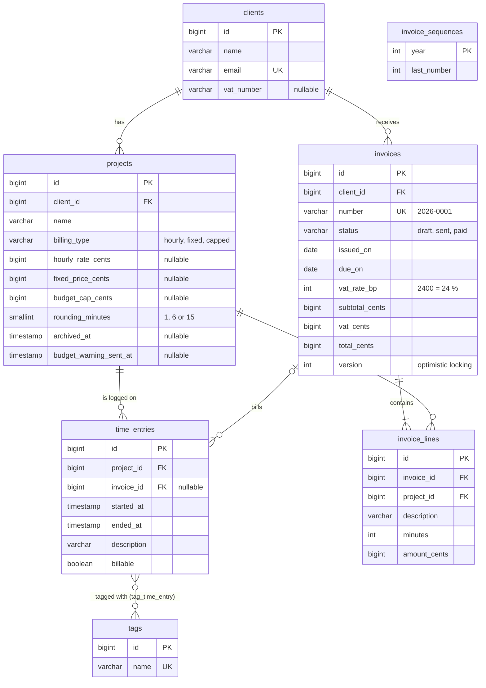
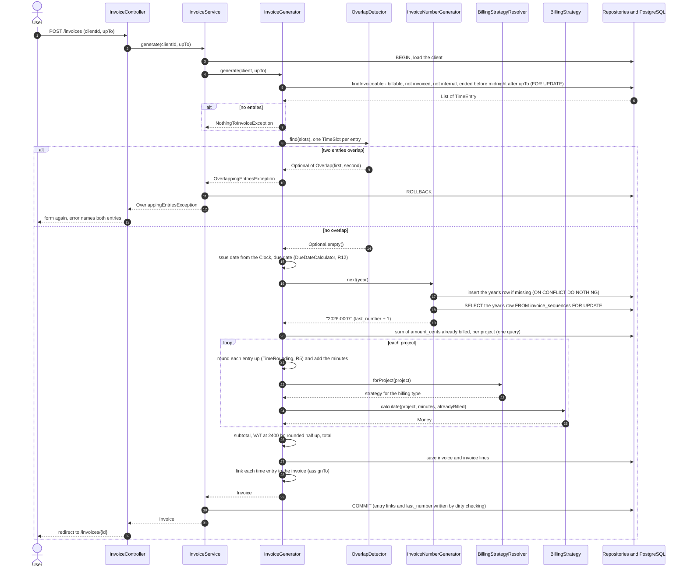
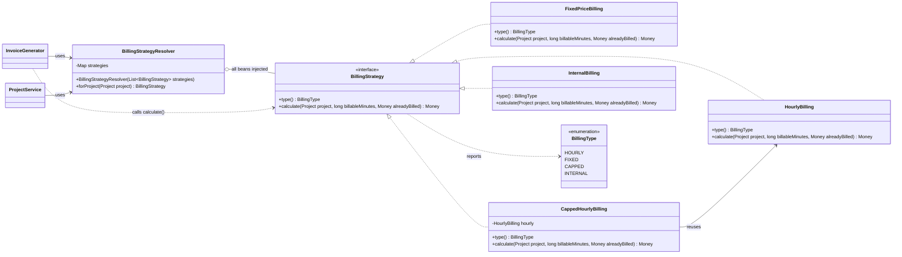
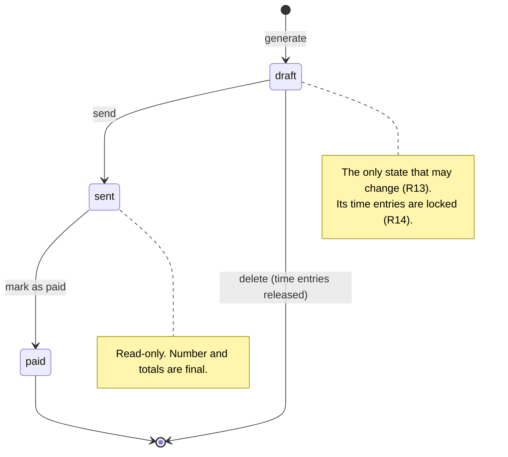

# 15 — Documentation in English · Spring Boot

[← Concepts](README.md) · Starting point: end of lesson 14 · Estimated time in class: 2 h

---

## What we build today

Today we write very little new Java. We make the project **understandable and runnable by other people**.

- `docs/glossary.md` — one word per concept, used everywhere.
- A repository that builds on a fresh clone: executable `mvnw`, wrapper files and `compose.yaml` committed.
- `README.md` — the full front page of the project, with a quick start that works.
- Javadoc on `Money`, `BillingStrategy`, `OverlapDetector`, `InvoiceGenerator`, `InvoiceNumberGenerator`
  and a `package-info.java` for the `invoice` package.
- HTML API documentation with `./mvnw javadoc:javadoc`.
- Cleaned-up code comments: no commented-out code, no TODO without an issue.
- `docs/diagrams.md` with four Mermaid diagrams.
- `docs/adr/` with ADR 0001 complete and outlines for 0002 and 0003.
- `CHANGELOG.md` with version `1.0.0`, and a Git tag.
- `.github/pull_request_template.md` (optional).
- `scripts/fresh-clone-check.sh` — clones your repository into a temporary folder and follows the README.

**Final result:** when you open your repository on GitHub, the README shows what Billable is, a
screenshot, and commands that work. The `docs/` folder renders four diagrams as pictures. The fresh-clone
script ends with `Fresh clone check passed`.

> **Names in your project.** The classes, methods and signatures below are the ones you built in lessons
> 03–14 (for example `BillingStrategyResolver.forProject(Project)`, `OverlapDetector.find(List<TimeSlot>)`
> and `InvoiceGenerator.generate(Client, LocalDate)`); package names follow
> [PROJECT.md](../../PROJECT.md#code-map). If you named something differently in an optional task, keep
> your code and describe **your** names in the documentation.

---

## Step 1 — Take stock and write the glossary

Before writing, look at what you already have. You will link to these files from the README, so you need
to know they exist and are up to date.

```bash
ls docs/
git log --oneline | head -20
```

You should see `request-lifecycle.md`, `architecture.md`, `patterns.md`, `algorithm.md` and
`ai-usage.md`. Open each one for one minute and check that it still describes the code as it is **today**.
For example, `patterns.md` from lesson 08 may still say that strategies return `long`; since lesson 10 they
return `Money`. Fix such details now.

Next, the glossary. It is short, but it makes every other document more consistent.

```markdown
<!-- docs/glossary.md -->
# Glossary

Billable uses one English word for each concept. The same word is used in the user interface, in
the code, in the documentation and in commit messages. Classes are in the package `ee.ta25.billable`.

| Term | Meaning | In the code | Do not use |
|---|---|---|---|
| client | A company or person we work for | `client.Client`, `clients` | customer, company |
| project | Work for one client, with one billing type | `project.Project`, `projects` | job, task |
| billing type | How a project is billed: hourly, fixed or capped | `project.BillingType` | pricing, payment type |
| time entry | One block of work on a project, with start and end | `timeentry.TimeEntry`, `time_entries` | log, record, booking |
| billable | A time entry that should be invoiced | `time_entries.billable` | chargeable |
| rounding rule | Round each entry up to 1, 6 or 15 minutes | `projects.rounding_minutes`, `common.TimeRounding` | rounding step |
| budget cap | Maximum total amount for a capped project | `projects.budget_cap_cents` | limit, max budget |
| invoice | The document sent to a client | `invoice.Invoice`, `invoices` | bill |
| invoice line | One project on an invoice | `invoice.InvoiceLine`, `invoice_lines` | row, item, position |
| subtotal | Sum of the invoice lines, before VAT | `subtotal_cents` | net, sum |
| VAT | Value added tax, 24 %, stored in basis points (2400) | `vat_rate_bp`, `vat_cents` | tax, KM |
| total | Subtotal plus VAT | `total_cents` | gross, grand total |
| due date | Date by which the client must pay | `due_on`, `common.DueDateCalculator` | deadline, payment term |
| draft / sent / paid | The states of an invoice | `invoice.InvoiceStatus` | open, closed, done |
| cents | The smallest unit of money; 12.50 € is 1250 cents | `common.Money#cents()` | — |
```

**What happens:**

1. Each row pairs a word with its meaning **and** with the place in the code, so a reader can go from
   the README to the right class.
2. The "Do not use" column is the useful part. When you proofread, search for those words:
   `grep -rniwE "customer|bill|booking" src/main docs/`.
3. If a Thymeleaf template says "Customers" somewhere, change the label now. The UI is documentation too.

**Check it works:** open `docs/glossary.md` in the Markdown preview of IntelliJ or VS Code. The table
renders with four columns.

**Commit:** `docs: add glossary of domain terms`

---

## Step 2 — Make sure a fresh clone can build

A fresh clone contains only what is committed. Three things often work on your machine and fail on
someone else's.

```bash
git ls-files --stage mvnw
git ls-files .mvn compose.yaml
git status --ignored --short | head -20
```

**What to look for:**

1. `git ls-files --stage mvnw` must start with `100755`. The `755` means "executable". If it shows
   `100644` (common when the project was created or edited on Windows), a Mac or Linux user gets
   `./mvnw: Permission denied`. Fix it:

   ```bash
   git update-index --chmod=+x mvnw
   git commit -m "chore: make Maven wrapper executable"
   ```

2. `git ls-files .mvn compose.yaml` must list `.mvn/wrapper/maven-wrapper.properties` and `compose.yaml`.
   Without the wrapper properties, `./mvnw` cannot download Maven; without `compose.yaml`, there is no
   database.
3. `git status --ignored` shows ignored files. Check that nothing the application **needs** is ignored —
   for example a Flyway migration or a local `application-dev.properties` that the README relies on. If
   the app needs a file with secrets, commit an example file instead and document it.

Why no `.env` step as in Laravel? Spring Boot's **Docker Compose support** reads `compose.yaml` and
creates the database connection details from it automatically. For local development you do not need to
set any database settings. That is a real advantage on a fresh clone — as long as `compose.yaml` is
committed.

**Check it works:** `git ls-files --stage mvnw` shows `100755 … mvnw`.

---

## Step 3 — Write the README

Replace the file `HELP.md` that Spring Initializr created (delete it) and write `README.md`. Here is the
full version for Billable. Replace `<your-user>` and `Your Name`, and adapt the details marked in the
explanation below.

````markdown
<!-- README.md -->
# Billable

Billable is a time-tracking and invoicing web application for freelancers and small agencies.
You log the time you work for clients, and Billable turns the billable time into correct invoices
with Estonian VAT (24 %). It supports hourly, fixed-price and capped-hourly projects, and it warns
you once when a capped project reaches 80 % of its budget.

Built with Spring Boot 4, Java 25, Thymeleaf and PostgreSQL 17 as the capstone project of module M8
at Kuressaare Ametikool.


## Requirements

- JDK 25 (for example Eclipse Temurin). Check with `java -version`.
- Docker Desktop, running (it runs PostgreSQL 17 and the integration tests).
- Git

You do not need to install Maven: the project includes the Maven wrapper (`./mvnw`).

## Quick start

```bash
git clone https://github.com/<your-user>/billable.git
cd billable
./mvnw spring-boot:run -Dspring-boot.run.profiles=dev
```

On Windows PowerShell, use `.\mvnw spring-boot:run "-Dspring-boot.run.profiles=dev"`.

Open <http://localhost:8080>. You should see the home page.

What happens on the first start:

- Maven downloads the dependencies (a few minutes the first time).
- Spring Boot's Docker Compose support starts PostgreSQL from `compose.yaml` and waits until it is
  ready. You do not need to run `docker compose up` yourself.
- Flyway creates the tables. The `dev` profile loads the demo data (`DevDataSeeder`,
  `TimeEntrySeeder`): three clients, seven projects and three weeks of time entries. Without the profile
  the application starts with an empty database. To try the main feature: **Invoices → Generate
  invoice**, choose a client and today's date.

Stop the application with `Ctrl+C`. Spring Boot then stops the database container too; the data
stays in a Docker volume. To start with an empty database: `docker compose down --volumes`.

Optional: start the database yourself with `docker compose up -d`. Spring Boot sees that it is
already running and uses it.

## Running the tests

```bash
./mvnw verify
```

This runs, in order:

1. the code style check (Spotless with Google Java Format; fix with `./mvnw spotless:apply`),
2. the unit tests — pure Java, no database, a few seconds,
3. the integration tests — `@SpringBootTest` and `@DataJpaTest` with a real PostgreSQL started by
   Testcontainers.

Docker must be running for step 3. The first run downloads the `postgres:17-alpine` image, which can take a
few minutes. The tests do not use `compose.yaml`; each run gets a fresh database.

GitHub Actions runs `./mvnw verify` on every push (`.github/workflows/`).

## API documentation

```bash
./mvnw javadoc:javadoc
```

Open `target/reports/apidocs/index.html`. The domain classes are documented; start with
`ee.ta25.billable.invoice.InvoiceGenerator`.

## Project structure

Packages are organised by feature, under `src/main/java/ee/ta25/billable`:

| Package | What is in it |
|---|---|
| `client` | Clients: entity, repository, service, controller, form |
| `project` | Projects and `BillingType` |
| `timeentry` | Time entries, tags and the time sheet |
| `billing` | Billing strategies (hourly, fixed, capped) and `BillingStrategyResolver` |
| `budget` | The budget warning: event, listener and `BudgetMonitor` |
| `notification` | The `Notifier` interface and its adapters (mail, log) |
| `invoice` | `InvoiceGenerator`, `OverlapDetector`, `InvoiceNumberGenerator`, invoice pages |
| `report` | The weekly summary report |
| `common` | `Money`, `TimeRounding`, `DueDateCalculator`, `ClockConfig`, home page |

Other folders: `src/main/resources/db/migration` (Flyway SQL), `src/main/resources/templates`
(Thymeleaf; the layout is `layout.html`), `src/test/java` (tests), `docs/` (documentation).

## Configuration

Settings are in `src/main/resources/application.properties`. For local development nothing needs to
be changed.

| Setting | Default | Meaning |
|---|---|---|
| `spring.jpa.hibernate.ddl-auto` | `validate` | Hibernate checks the schema but never changes it; Flyway owns the schema |
| `spring.jpa.open-in-view` | `false` | No lazy loading in views; services load what the page needs |
| `spring.docker.compose.enabled` | `true` | Set to `false` to use your own PostgreSQL instead of `compose.yaml` |
| `SPRING_DATASOURCE_URL`, `_USERNAME`, `_PASSWORD` | from `compose.yaml` | Environment variables for your own database, when Compose support is off |
| `billable.vat-rate-bp` | `2400` | VAT rate in basis points (24 %), 1–10 000; each invoice stores its own copy |
| `billable.notifier` | `mail` | `mail` sends budget warnings to Mailpit (`compose.yaml`, <http://localhost:8025>); `log` only logs them |
| `billable.owner-email`, `billable.mail-from` | `owner@example.test`, `billable@example.test` | Receiver and sender of budget warnings; must be e-mail addresses |

All `billable.*` settings are bound to one record, `common.BillableProperties`
(`@ConfigurationProperties("billable")`, `@Validated`). A missing or invalid value stops the
application at startup with a message that names the setting.

The other business constants (due date 14 days, budget warning at 80 %) are defined in code, because
they are business rules. The rules R1–R14 are listed in [docs/architecture.md](docs/architecture.md).

> If your `docs/architecture.md` (lesson 07) does not list R1–R14 yet, copy the business rules table from
> [PROJECT.md](../../PROJECT.md#business-rules) into it now, so this link in your README is true.

## Documentation

- [Architecture and layers](docs/architecture.md)
- [Diagrams: data model, invoice generation, strategies, invoice states](docs/diagrams.md)
- [Design patterns used](docs/patterns.md)
- [The invoice generation algorithm](docs/algorithm.md)
- [Request lifecycle](docs/request-lifecycle.md)
- [Glossary](docs/glossary.md)
- [Architecture decision records](docs/adr/)
- [Changelog](CHANGELOG.md)
- [How AI tools were used](docs/ai-usage.md)

### Key decisions

- [ADR 0001 — Integer cents for money](docs/adr/0001-integer-cents-for-money.md)
- [ADR 0002 — Invoice numbers from a locked sequence row](docs/adr/0002-invoice-sequence-row-lock.md)
- [ADR 0003 — Notifier adapter instead of calling the mailer](docs/adr/0003-notifier-adapter.md)

## Known limitations

- Single user; there is no login.
- One currency (EUR) and one VAT rate per invoice.
- Invoices are shown as web pages; there is no PDF export.

## Licence

MIT — see [LICENSE](LICENSE). Author: Your Name, Kuressaare Ametikool.
````

**What happens:**

1. **The first paragraph** answers "what is it and for whom" in plain words, using the glossary terms.
2. **Requirements** name exact versions. `java -version` lets the reader check before they start — a wrong
   JDK is the most common failure on a fresh machine.
3. **Quick start** is only three commands, because Spring Boot does a lot at start-up. That is why the
   README explains **what happens on the first start**: without it, a reader who waits three minutes for
   downloads thinks it is broken.
4. **Docker Compose support** (the `spring-boot-docker-compose` dependency from Spring Initializr) runs
   `docker compose up` when the application starts, waits for the database, and gives Spring the
   connection details. It is a development feature: it is not used in tests, and it is not included when
   the app is packaged as a jar for production.
5. **Demo data.** Flyway creates only the tables. The demo data comes from `DevDataSeeder` (lesson 03)
   and `TimeEntrySeeder` (lesson 06), which run only in the `dev` profile — that is why the quick start
   passes `-Dspring-boot.run.profiles=dev`, and why the README says so.
6. **Running the tests** says what `verify` does and what it needs. If your lesson 14 integration tests are
   named `*IT` and run with the Failsafe plugin, add: "`./mvnw test` runs only the unit tests." Testcontainers
   downloading an image on the first run is the second most common "is it broken?" moment.
7. **API documentation** — Step 9 sets this up. Remove the section if you skip Step 9.
8. **Configuration** lists only settings the application really reads (lessons 01, 03, 09 and 10). `SPRING_DATASOURCE_URL` works because
   Spring Boot maps environment variables to properties (`spring.datasource.url`). Do not invent tidy
   names that do not exist.
9. **Known limitations** is honest about what is not there. Reviewers value this.
10. Pick a licence. MIT is a common choice for learning projects. GitHub can create the `LICENSE` file:
    **Add file → Create new file**, name it `LICENSE`, then click **Choose a license template**.

**Check it works:** push, then open the repository on GitHub. The README renders under the file list, and
all links under **Documentation** open a file (a broken link shows a 404 page). The image is broken until
Step 4.

**Commit:** `docs(readme): describe Billable, quick start and tests`

---

## Step 4 — Add a screenshot

1. Start the app (`./mvnw spring-boot:run -Dspring-boot.run.profiles=dev`) and generate an invoice for a
   seeded client.
2. Take a screenshot of the invoice page: macOS `Cmd+Shift+4`, Windows `Win+Shift+S`.
3. Save it as `docs/screenshot.png`. Crop it to the browser content. Keep it under about 500 KB.
4. Use only seeded (fake) data. Never put real client names or e-mail addresses from your job in a public
   repository.

**Check it works:** the README preview in IntelliJ shows the image.

**Commit:** `docs(readme): add screenshot of the invoice page`

---

## Step 5 — Clean up code comments

Comments rot faster than code. Search for the three worst kinds.

```bash
# 1. TODO and FIXME without an issue number
grep -rnE "TODO|FIXME" src/ | grep -v "#[0-9]"

# 2. Commented-out code (lines that look like Java statements after //)
grep -rnE "^\s*//\s*(return |if \(|for \(|var |public |private |[a-z]+\.[a-z]+\(.*\);)" src/

# 3. Estonian letters in code, templates, migrations and tests
grep -rniE "[õäöüšž]" src/
```

IntelliJ can do the same: **Code → Inspect Code** reports "Commented out code", and the **TODO** tool window
lists all TODO comments.

For each result, decide:

| Found | Do |
|---|---|
| Commented-out code | Delete it. Git has the old version. |
| TODO you will do now | Do it and delete the comment. |
| TODO for later | Create a GitHub issue and write `// TODO(#12): …` |
| Comment that repeats the code | Delete it, or rewrite it to say *why*. |
| Estonian word or letter | Translate it. Test names too: `arveLoomineToimib()` → `generatesInvoice()`. |

A typical before and after in `TimeEntryService.delete()` from lesson 13 (the point is the comments):

```java
// src/main/java/ee/ta25/billable/timeentry/TimeEntryService.java — BEFORE (part of delete)
// kontrollime kas on arvel
if (entry.getInvoice() != null) {
  throw new IllegalStateException("Entry is invoiced");
}
// timeEntries.deleteById(id);
timeEntries.delete(entry); // delete the entry
```

```java
// src/main/java/ee/ta25/billable/timeentry/TimeEntryService.java — AFTER
// R14: an entry on an invoice is part of a legal document, so it can no longer change.
assertNotInvoiced(entry);
timeEntries.delete(entry);
```

**What happens:**

1. The Estonian comment is replaced by the **reason** and the rule number, which a reader can look up.
2. The commented-out line is deleted.
3. `// delete the entry` repeated the method name, so it is removed.
4. The inline check is replaced by the lesson 13 helper `assertNotInvoiced()`. Its
   `TimeEntryLockedException` has a full English message, because users and logs will read it.

**Check it works:** the three `grep` commands print nothing (or only lines you deliberately kept).
`./mvnw verify` is still green.

**Commit:** `refactor: remove dead code and explain business rules in comments`

---

## Step 6 — Javadoc on `Money`

Now the doc comments. We start with `Money`, because every other class uses it. Document the type (what it
is and why it exists) and the methods whose contract is not obvious from the name.

Open `src/main/java/ee/ta25/billable/common/Money.java` and add the comments. Your method bodies stay as
they are from lesson 10; they are shown so you can find the right place.

```java
// src/main/java/ee/ta25/billable/common/Money.java
package ee.ta25.billable.common;

// imports from lessons 10–11 unchanged

/**
 * An amount of money in euro cents.
 *
 * <p>Billable never uses {@code float} or {@code double} for money (rule R1). All arithmetic is done
 * on {@code long} values, and a fraction of a cent is rounded half up exactly once, where it appears
 * (rule R3). See {@code docs/adr/0001-integer-cents-for-money.md} for the reasons.
 *
 * <p>{@code Money} is immutable: every operation returns a new instance.
 *
 * @param cents the amount in cents, for example {@code 1250} for 12.50 €; may be negative
 */
public record Money(long cents) implements Comparable<Money> {

  // EUROS, ZERO, the compact constructor and fromEuros() from lesson 10 stay as they are.

  /** Zero euros. The same instance every time. */
  public static Money zero() {
    return ZERO;
  }

  public static Money fromCents(long cents) {
    return new Money(cents);
  }

  public Money add(Money other) {
    return new Money(Math.addExact(cents, other.cents));
  }

  /**
   * Returns this amount minus the other amount.
   *
   * <p>The result may be negative. Callers that need "what is left" should use {@link #max(Money)}
   * with {@link #zero()}, as the fixed-price and capped billing strategies do.
   *
   * @param other the amount to subtract
   * @return the difference, possibly negative
   * @throws ArithmeticException if the result does not fit in a {@code long}
   */
  public Money subtract(Money other) {
    return new Money(Math.subtractExact(cents, other.cents));
  }

  /**
   * Returns a percentage of this amount, rounded half up to the cent (R3).
   *
   * <p>The percentage is given in basis points: 1 % is 100 basis points, so 24 % VAT is {@code 2400}.
   * The calculation uses integers only: {@code cents * basisPoints / 10000}, rounded half up, where
   * "up" means away from zero. For example, 10.05 € at 2400 basis points is 2.412 €, which rounds to
   * 2.41 €.
   *
   * @param basisPoints the percentage in basis points, for example {@code 2400} for 24 %
   * @return the percentage of this amount, rounded half up to the cent
   * @throws ArithmeticException if {@code cents * basisPoints} does not fit in a {@code long}
   */
  public Money percentageBp(int basisPoints) {
    return new Money(divideHalfUp(Math.multiplyExact(cents, basisPoints), 10_000));
  }

  /**
   * Returns the smaller of the two amounts.
   *
   * @param other the amount to compare with
   * @return this amount if it is less than or equal to {@code other}, otherwise {@code other}
   */
  public Money min(Money other) {
    return cents <= other.cents ? this : other;
  }

  // multiply(), max(), isZero(), isNegative(), greaterThanOrEqual(), compareTo(), format(),
  // sum() (lesson 11) and divideHalfUp() stay as they are; document them the same way.
}
```

**What happens:**

1. **The type comment** says what the type *is*, which rules it implements (R1, R3), and where the reasons
   are (the ADR). A reader who wonders "why not `BigDecimal`?" gets the answer in one click.
2. In a record, `@param cents` in the type comment documents the **record component**. Javadoc shows it on
   the constructor and on the accessor `cents()`. It documents the **unit** with an example — units are the
   most valuable thing to document for any number.
3. `fromCents()` and `add()` have **no** Javadoc. Their name and signature say everything. We turn off the
   "missing comment" warning for such cases in Step 9.
4. `subtract()` has a comment because it has a **trap**: the result can be negative. `{@link #max(Money)}`
   is a clickable link to another method of the same class. (`ZERO` is private, so the comment links to
   the public `zero()` instead — Javadoc with `<show>public</show>` cannot link to a private field.)
5. `percentageBp()` explains the unit (basis points), the exact formula and a worked example with
   rounding. The formula is inside `{@code …}` so Javadoc does not try to read `*` or `/` as anything
   special.
6. `@throws` names the exception **and** when it happens. Lesson 10 chose `Math.multiplyExact` so that an
   overflow is an error, not a wrong amount; the comment stops a future developer from "simplifying" it
   back to `*`.
7. The first sentence of each comment is the **summary** that Javadoc shows in the method list. It is
   short, in the present tense, and starts with a verb.
8. Continuation lines of a tag are indented by four spaces. That is Google Java Format's style; Spotless
   will re-wrap your Javadoc to 100 columns if you do not.

Document `format()` and the hourly factory `HourlyBilling.forMinutes()` from lesson 10 the same way: unit,
rounding, example.

**Check it works:** in IntelliJ, put the cursor on a call to `percentageBp(` and press `Ctrl+Q`
(macOS: `F1`). The documentation popup shows your text with the formula formatted as code. Run
`./mvnw spotless:apply` to let the formatter fix the layout.

---

## Step 7 — Javadoc on the `BillingStrategy` interface

An interface is a contract that other classes implement, so it needs the best documentation of all. The
implementations inherit it: Javadoc copies the interface's method comment to an overriding method that has
no comment of its own.

```java
// src/main/java/ee/ta25/billable/billing/BillingStrategy.java
package ee.ta25.billable.billing;

import ee.ta25.billable.common.Money;
import ee.ta25.billable.project.BillingType;
import ee.ta25.billable.project.Project;

/**
 * Calculates how much to bill for one project on one invoice.
 *
 * <p>There is one implementation per {@link BillingType}: {@link HourlyBilling}, {@link
 * FixedPriceBilling} and {@link CappedHourlyBilling}. {@link BillingStrategyResolver} chooses the
 * right one, so callers never switch on the billing type themselves (Strategy pattern, see {@code
 * docs/patterns.md}).
 */
public interface BillingStrategy {

  /**
   * Returns the billing type this strategy handles.
   *
   * @return the billing type; each type has exactly one strategy
   */
  BillingType type();

  /**
   * Returns the amount to bill now for the given minutes of work.
   *
   * <p>Implementations are pure calculations: they read the project's rates, but they do not save
   * anything, publish events or read the clock. This makes them easy to unit test.
   *
   * @param project the project being billed; the rate fields its billing type needs are set
   * @param billableMinutes billable minutes, already rounded up per time entry (R5); not negative
   * @param alreadyBilled the total billed for this project on earlier invoices; hourly billing
   *     ignores it
   * @return the amount to bill; never negative, and {@link Money#zero()} when nothing is left to bill
   */
  Money calculate(Project project, long billableMinutes, Money alreadyBilled);
}
```

If you did the lesson 08 Basic task, `InternalBilling` (the Null Object for `INTERNAL`) is a fourth
implementation; add it to the list in the type comment.

Now the implementations. They need a **class** comment that states their rule, but no method comment.
Add one to each class, directly above `@Component` (or `@Service`):

```java
// src/main/java/ee/ta25/billable/billing/CappedHourlyBilling.java — above the class declaration

/**
 * Bills like {@link HourlyBilling}, but the total for the project never exceeds its budget cap (R7).
 *
 * <p>Amount = {@code min(hourly amount, max(budget cap - already billed, 0))}.
 */
```

```java
// src/main/java/ee/ta25/billable/billing/FixedPriceBilling.java — above the class declaration

/**
 * Bills the part of the fixed price that has not been billed yet (R8).
 *
 * <p>The number of minutes does not change the amount. Amount = {@code max(fixed price - already
 * billed, 0)}.
 */
```

```java
// src/main/java/ee/ta25/billable/billing/HourlyBilling.java — above the class declaration

/**
 * Bills rounded minutes at the project's hourly rate (R6).
 *
 * <p>Amount = {@code (minutes * hourly rate in cents + 30) / 60}: integer division, rounded half up.
 */
```

**What happens:**

1. The interface comment tells a new developer **where the decision is made** (the resolver). That is the
   exact question from the defence: "Open the file where the billing strategy is chosen."
2. `{@link HourlyBilling}` produces a link in the HTML and is **checked**: if you rename the class, Javadoc
   reports `reference not found`. Plain text would silently go out of date.
3. The method comment states a **design rule** ("pure calculations") so nobody adds a repository call to a
   strategy later.
4. `billableMinutes` says "already rounded". Without this, one developer rounds in the generator and another
   rounds again in the strategy — a real bug that bills 15 extra minutes.
5. The formulas are in `{@code …}` because they contain `-`, `*` and `/`. In plain Javadoc text an arrow
   like `->` gives the error `bad use of '>'`.

**Check it works:** in `InvoiceGenerator`, put the cursor on `.calculate(` and press `Ctrl+Q` / `F1`. The
popup shows the interface documentation even though the object is a concrete strategy.

**Commit:** `docs(billing): document Money and the BillingStrategy contract`

---

## Step 8 — Javadoc on the invoice package

These are the classes of your most complex component (ÕV8).

### `OverlapDetector`

```java
// src/main/java/ee/ta25/billable/invoice/OverlapDetector.java
package ee.ta25.billable.invoice;

import java.util.Comparator;
import java.util.List;
import java.util.Optional;
import org.springframework.stereotype.Component;

/**
 * Finds time slots that overlap in time.
 *
 * <p>An invoice must not bill the same minutes twice, so {@link InvoiceGenerator} refuses to create
 * an invoice when two of its entries overlap (R10). The generator turns each time entry into a {@link
 * TimeSlot} first, so this class does not depend on JPA entities and is easy to unit test.
 */
@Component
public class OverlapDetector {

  private static final Comparator<TimeSlot> BY_START_THEN_END =
      Comparator.comparing(TimeSlot::start).thenComparing(TimeSlot::end);

  /**
   * Returns the first pair of slots whose time ranges overlap.
   *
   * <p>Time ranges are half-open: a slot that ends at 10:00 does not overlap a slot that starts at
   * 10:00. The method sorts a copy of the list by start (then end) and sweeps it once, so it runs in
   * {@code O(n log n)} time and does not change the caller's list.
   *
   * @param slots the slots of one invoice, in any order; not modified
   * @return the first overlapping pair, or {@link Optional#empty()} if there is none
   */
  public Optional<Overlap> find(List<TimeSlot> slots) {
    // Sort by start: then a slot can only overlap an earlier one that has not ended yet.
    List<TimeSlot> sorted = slots.stream().sorted(BY_START_THEN_END).toList();

    TimeSlot latest = null;
    for (TimeSlot slot : sorted) {
      // Strictly "before": touching slots are allowed (half-open ranges).
      if (latest != null && slot.start().isBefore(latest.end())) {
        return Optional.of(new Overlap(latest, slot));
      }
      if (latest == null || slot.end().isAfter(latest.end())) {
        latest = slot;
      }
    }
    return Optional.empty();
  }
}
```

```java
// src/main/java/ee/ta25/billable/invoice/Overlap.java
package ee.ta25.billable.invoice;

/**
 * Two time slots whose time ranges overlap.
 *
 * @param first the slot that starts no later than {@code second}
 * @param second the slot that starts before {@code first} ends
 */
public record Overlap(TimeSlot first, TimeSlot second) {}
```

**What happens:**

1. The record `Overlap` (its own file since lesson 13) is documented with `@param` tags for its two
   components, so the HTML says which slot is which.
2. The method comment documents the **boundary rule** (half-open ranges). That is the most likely question
   when a test fails at exactly 10:00.
3. Complexity is documented because it is part of ÕV8, and a caller may wonder whether it is safe for
   10 000 entries. `{@code O(n log n)}` keeps the formula in code font.
4. The inline `//` comments explain the **idea** of the algorithm, not the syntax of the stream.

Document `TimeSlot` the same way: a type comment ("the part of a time entry that the overlap check
needs") and the half-open rule on `overlaps()`. If you replaced the sweep with a comparison of all pairs,
the complexity is `O(n²)` — write that honestly.

### `InvoiceGenerator`

The generator is long, so here we show only the parts that get documentation. Fields, constructor and
method bodies stay exactly as in lessons 13 and 14.

```java
// src/main/java/ee/ta25/billable/invoice/InvoiceGenerator.java — class comment and generate()

/**
 * Turns a client's billable, not yet invoiced time entries into a draft invoice.
 *
 * <p>This is the core algorithm of Billable. It is explained step by step in {@code
 * docs/algorithm.md} and drawn as a sequence diagram in {@code docs/diagrams.md}.
 */
@Service
public class InvoiceGenerator {

  // fields and constructor from lessons 13–14 unchanged

  /**
   * Generates a draft invoice for all billable, uninvoiced entries of a client up to a date.
   *
   * <p>Everything happens in one transaction. The invoice, its lines, the invoice number and the link
   * from each entry to the invoice are saved together, or not at all. Call this method through the
   * Spring bean: a call from inside this class bypasses {@code @Transactional}.
   *
   * <p>Included are the client's billable entries that are not on an invoice yet, do not belong to an
   * internal project, and end before midnight after {@code upTo}. Each entry is rounded up to its
   * project's increment (R5) before the project's billing strategy prices the minutes.
   *
   * <p>Side effects: the included entries are locked ({@code SELECT ... FOR UPDATE}, lesson 14) and
   * linked to the new invoice, which protects them against deletion (R14), and the year's row in
   * {@code invoice_sequences} is incremented (R11).
   *
   * @param client the client to invoice
   * @param upTo the last day to include, in the Europe/Tallinn time zone; entries that end on or
   *     before this day are included
   * @return the saved draft invoice; issued today according to the injected {@link java.time.Clock},
   *     with the due date from {@link ee.ta25.billable.common.DueDateCalculator} (R12)
   * @throws OverlappingEntriesException if two included entries overlap (R10); nothing is saved
   * @throws NothingToInvoiceException if the client has no billable, uninvoiced entries up to {@code
   *     upTo}
   */
  @Transactional
  public Invoice generate(Client client, LocalDate upTo) {
    // body from lessons 13–14 unchanged
  }
}
```

**What happens:**

1. The **summary** is one sentence in the present tense, starting with a verb.
2. The second paragraph states the **transaction guarantee** and one Spring trap: `@Transactional` works
   through a proxy, so a call from another method of the same class does not start a transaction.
3. **Side effects** get their own paragraph. They are invisible in the signature and very important: after
   this call, entries cannot be edited any more.
4. `upTo` documents whether the day is **inclusive** and which time zone applies — the two questions every
   date parameter raises. The query from lesson 13 compares `ended_at` with midnight after `upTo`, so the
   comment says "end", not "start".
5. The `@return` text names the `Clock`. That tells a test writer how to control "today" (with
   `Clock.fixed(...)`, as in lesson 12).
6. `{@link java.time.Clock}` uses the fully qualified name, because the class may not be imported in this
   file. A wrong reference is a Javadoc **error**, so the tool checks your links.
7. `@throws` lists both `InvoicingException` subclasses the method throws and the condition for each.
   `InvoiceController` catches `InvoicingException` and shows the message, so the message text is part of
   the contract too.

### `InvoiceNumberGenerator`

```java
// src/main/java/ee/ta25/billable/invoice/InvoiceNumberGenerator.java — above next(int year) (lesson 14)

  /**
   * Reserves and returns the next invoice number for a year, for example {@code "2026-0007"}.
   *
   * <p>Must run inside the caller's transaction ({@code Propagation.MANDATORY}). The method creates the
   * year's row in {@code invoice_sequences} if it is missing and locks it ({@code SELECT ... FOR
   * UPDATE}), so a second transaction waits until the first one commits. This guarantees numbers
   * without gaps and without duplicates (R11). If the transaction rolls back, the number is not used
   * and the next invoice gets it.
   *
   * @param year the year of the issue date, for example {@code 2026}
   * @return the number in the format {@code YYYY-NNNN}
   * @throws org.springframework.transaction.IllegalTransactionStateException if no transaction is
   *     active
   * @throws IllegalArgumentException if the year already has 9999 invoices
   */
```

### `package-info.java`

Java has one more place for documentation: a comment for a whole **package**. With feature-first packages
this is a natural overview page per feature.

```java
// src/main/java/ee/ta25/billable/invoice/package-info.java
/**
 * Invoices: generation, numbering, overlap detection and the invoice pages.
 *
 * <p>The entry point is {@link ee.ta25.billable.invoice.InvoiceGenerator}. An invoice moves through
 * the states draft, sent and paid ({@link ee.ta25.billable.invoice.InvoiceStatus}); only a draft can
 * be edited or deleted (R13). The algorithm is described in {@code docs/algorithm.md}.
 */
package ee.ta25.billable.invoice;
```

**What happens:** the file contains only the comment and the `package` line. Javadoc shows it on the
package page and in the package list. Add one for `billing` too if you have time.

**Check it works:** `./mvnw spotless:apply`, then `./mvnw verify` — all green.

**Commit:** `docs(invoice): document invoice generation, overlap detection and numbering`

---

## Step 9 — Generate the Javadoc HTML

The Javadoc tool turns your comments into an HTML site, and it **checks** them on the way: broken links,
bad HTML and wrong `@param` names are reported.

First, configure the plugin in `pom.xml`, inside `<build><plugins>` next to the Spring Boot and Spotless
plugins:

```xml
<!-- pom.xml — inside <build><plugins> -->
<plugin>
  <groupId>org.apache.maven.plugins</groupId>
  <artifactId>maven-javadoc-plugin</artifactId>
  <configuration>
    <!-- Check syntax, HTML and references, but do not require a comment on every method. -->
    <doclint>all,-missing</doclint>
    <show>public</show>
  </configuration>
</plugin>
```

Then run it:

```bash
./mvnw javadoc:javadoc
```

Open `target/reports/apidocs/index.html` in a browser. (Older versions of the plugin wrote to
`target/site/apidocs`; the build log prints the folder.)

**What happens:**

1. `javadoc:javadoc` runs the Javadoc tool from your JDK over `src/main/java` only; tests are not included.
2. `<doclint>all,-missing</doclint>` turns on all checks **except** "missing comment". Without `-missing`,
   you get a warning for every getter and every controller method — hundreds of warnings that train you to
   ignore warnings. We want comments where the contract needs them, not everywhere.
3. `<show>public</show>` includes only public classes and members: the API other code may use.
4. The Spring Boot parent POM manages the plugin version, so no `<version>` is needed. If Maven prints
   `'build.plugins.plugin.version' for org.apache.maven.plugins:maven-javadoc-plugin is missing`, add a
   `<version>` with the latest release from Maven Central.
5. Errors (bad HTML, unknown references) stop the build; the error names the file and line. See
   Troubleshooting for the common ones.

In the HTML, open the package `ee.ta25.billable.invoice`: you see the package comment from Step 8, the
class list with one-sentence summaries, and on `InvoiceGenerator` the full `generate` contract.

The `target/` folder is ignored by Git. Do not commit the generated HTML; anybody can generate it with one
command, and that command is in the README.

**Check it works:** the build ends with `BUILD SUCCESS` and the page opens in the browser.

**Commit:** `build: configure Javadoc with doclint`

---

## Step 10 — Four diagrams in `docs/diagrams.md`

Create one file with all four diagrams. Each diagram has a short sentence saying what question it answers.

````markdown
<!-- docs/diagrams.md -->
# Diagrams

All diagrams are written in [Mermaid](https://mermaid.js.org/) and render on GitHub.
Update them in the same commit as the code they describe.

## 1. Data model

Which tables exist and how they are related. Money columns are integer cents (`bigint`).



`invoice_sequences` has no foreign keys. It holds one row per year and is locked while an invoice
number is reserved (see [ADR 0002](adr/0002-invoice-sequence-row-lock.md)). The `version` column on
`invoices` (`@Version`, lesson 14) protects against two people changing the same invoice at once —
for example both pressing *Mark paid*; it is a different problem.

## 2. Invoice generation

What happens when the user clicks **Generate**. `InvoiceService.generate()` and
`InvoiceGenerator.generate()` are `@Transactional`; the generator joins the service's transaction, so
everything between BEGIN and COMMIT is one transaction.



## 3. Billing strategies

Where the billing type is turned into a calculation.



## 4. Invoice states

Which status changes are allowed. Only a draft can be edited or deleted (R13).


````

**What happens:**

1. **ER diagram.** Each relationship line uses crow's-foot symbols: `||--o{` means "exactly one to zero or
   more". `|o--o{` for invoices–time entries means an entry has **zero or one** invoice (`invoice_id` is
   nullable). `||--|{` means an invoice has **at least one** line. The attribute blocks list the real
   column names from your Flyway scripts — the database, not the Java field names.
2. **Sequence diagram.** `autonumber` numbers the arrows, so in the defence you can say "at step 18 the row
   is locked". `alt … else … end` shows the two outcomes, `loop` the per-project work. Solid arrows (`->>`)
   are calls, dashed arrows (`-->>`) are returns. Repositories and the database are one participant to keep
   the diagram readable.
3. **Class diagram.** `<|..` means "implements", `o--` "holds a collection of", `..>` "depends on". The
   resolver receives **all** `BillingStrategy` beans as a `List` and builds a map by `type()`. Mermaid
   writes generics with tildes: `List~BillingStrategy~`.
4. **State diagram.** The states use the lowercase values stored in the database; the transitions are
   exactly `InvoiceStatus.canTransitionTo()` from lesson 13. The notes carry rules R13 and R14. If your
   lesson 13 independent work added more transitions, add them.
5. Check the names against your code: `forProject`, `type()`, `find`, `next`, the enum constants
   (`InternalBilling` and `INTERNAL` come from the lesson 08 Basic task), the form's URL. The diagram must
   describe **your** code.

**Check it works:** push and open `docs/diagrams.md` on GitHub. All four diagrams appear as pictures. If one
shows a parse error, paste it into the [Mermaid live editor](https://mermaid.live/) to find the line.

**Commit:** `docs: add ER, sequence, class and state diagrams`

---

## Step 11 — Architecture decision records

Create the folder `docs/adr/`. We write ADR 0001 in full now, and create 0002 and 0003 as outlines that you
complete at home.

```markdown
<!-- docs/adr/0001-integer-cents-for-money.md -->
# 1. Use integer cents for money

- **Status:** accepted
- **Date:** 2026-10-15
- **Deciders:** Your Name

## Context

Billable calculates hourly amounts, budget caps, fixed prices, VAT and invoice totals. The numbers
on an invoice are legal and financial data: they must be exact, and a client must be able to check
them by hand.

The obvious option is Java's `double`. Doubles are binary fractions, so most decimal amounts cannot
be stored exactly: `0.1 + 0.2` is `0.30000000000000004`, and a total built from many additions can
be off by a cent.

We considered three options:

1. `double` in Java and `double precision` in PostgreSQL.
2. `BigDecimal` in Java with `RoundingMode.HALF_UP`, and `numeric(12, 2)` in PostgreSQL.
3. Whole numbers of cents: `long` in Java wrapped in `record Money(long cents)`, and `bigint`
   columns in PostgreSQL.

## Decision

We store and calculate all money as integer cents (option 3).

- Every money column ends in `_cents` and has the type `bigint`.
- In Java, amounts are `ee.ta25.billable.common.Money` values that hold a `long`.
- Where a fraction of a cent appears (hourly amounts and VAT), we round half up once, with integer
  arithmetic: `(minutes * rate + 30) / 60` and `(subtotal * basisPoints + 5000) / 10000`.
- Rates are stored in basis points: 24 % VAT is `2400`.
- `float` and `double` are not allowed anywhere money is calculated.

## Consequences

Positive:

- Addition and subtraction are always exact. The invoice total always equals the sum of its lines.
- Rounding happens in two known places, which are easy to unit test at the boundaries.
- `Money` is a small record with value equality, so tests can use `assertThat(a).isEqualTo(b)`.
- `Math.addExact` and `Math.multiplyExact` turn a silent overflow into an exception.

Negative:

- Every amount must be converted for display (`1250` → `12,50 €`). Forgetting this shows wrong values
  on the page, so formatting lives in one place.
- Developers must remember the unit. The `_cents` suffix and the `Money` type make this visible.
- The database columns are `bigint`, the same range as Java's `long`, so entities store `long` cents
  and convert to `Money` in their accessors (for example `Invoice.total()`). An intermediate product
  such as `cents * basisPoints` could still overflow in theory; `Math.multiplyExact` turns that into
  an exception instead of a wrong amount.
- Splitting an amount into parts (for example a discount across lines) needs an explicit allocation
  method, because integer division loses the remainder.

Rejected: option 1 because of rounding errors (rule R1). Option 2 is exact and a good choice in many
Java systems, but `BigDecimal` has traps of its own: `new BigDecimal(0.1)` is not 0.1, and `equals`
says `2.0` and `2.00` are different. For amounts that always have exactly two decimal places, whole
cents are simpler.
```

Now the two outlines. Copy the headings and write the key points as bullets; you complete them as
independent work.

```markdown
<!-- docs/adr/0002-invoice-sequence-row-lock.md -->
# 2. Reserve invoice numbers from a locked sequence row

- **Status:** proposed
- **Date:** 2026-10-15

## Context
- R11: numbers `YYYY-NNNN`, per year, no gaps, no duplicates.
- Lesson 13 used `MAX(number) + 1`. Lesson 14's integration test showed two parallel transactions get the same number.
- Options: MAX + 1 with a unique index and retry; PostgreSQL SEQUENCE; `invoice_sequences` table with a pessimistic lock.

## Decision
- TODO

## Consequences
- TODO (positive and negative)
```

```markdown
<!-- docs/adr/0003-notifier-adapter.md -->
# 3. Send notifications through a Notifier adapter

- **Status:** proposed
- **Date:** 2026-10-15

## Context
- R9: warn the owner once at 80 % of the budget cap.
- Calling `JavaMailSender` directly from `BudgetMonitor` ties the rule to e-mail.

## Decision
- TODO: `notification.Notifier`, `MailNotifier`, `LogNotifier`, how the implementation is chosen.

## Consequences
- TODO
```

**What happens:**

1. The file name has a four-digit number and a short slug. Numbers never change and are never reused.
2. **Context** is written so that someone who was not there understands the problem. It lists the real
   options. An ADR without alternatives is only an announcement.
3. **Decision** is in active voice and present tense: "We store…". It lists concrete rules a reviewer can
   check in the code.
4. **Consequences** has negative points too. Every decision has a cost; writing it down shows you
   understood the trade-off — exactly what the teacher asks at the defence ("Why are amounts integers?").
5. The "`bigint` in the database, `long` in the entity, `Money` in the accessor" point is written down
   because a reader of the entities sees `long` fields and may wonder where `Money` is. The ADR must match
   your code (R1: `bigint` columns since lesson 03).
6. The outlines have status `proposed`. When you finish them, change it to `accepted`.

**Check it works:** the README links under **Key decisions** now open the three files.

**Commit:** `docs(adr): record integer cents decision and outline two more`

---

## Step 12 — `CHANGELOG.md` and the version tag

```markdown
<!-- CHANGELOG.md -->
# Changelog

All notable changes to this project are documented in this file.

The format is based on [Keep a Changelog](https://keepachangelog.com/en/1.1.0/),
and this project adheres to [Semantic Versioning](https://semver.org/spec/v2.0.0.html).

## [Unreleased]

## [1.0.0] - 2026-10-15

### Added

- Clients and projects with hourly, fixed-price and capped-hourly billing.
- Time sheet with tags, and a weekly summary report.
- Billing strategies selected by `BillingStrategyResolver`.
- Budget warning at 80 % of the cap, sent once through the `Notifier` adapter.
- `Money`, `TimeRounding` and `DueDateCalculator` with integer-cent arithmetic.
- Invoice generation with overlap detection, rounding, VAT and gap-free numbering.
- Invoice states draft, sent and paid; only drafts can be edited or deleted.
- Unit, mock-based and Testcontainers integration tests, run in GitHub Actions with Spotless.
- README, Javadoc, diagrams and architecture decision records.

### Fixed

- Duplicate invoice numbers when two invoices were generated at the same time.
- N+1 queries on the time sheet page.
```

Set the version in `pom.xml` as well, so the jar and the tag agree. Near the top of `pom.xml`, change
`<version>0.0.1-SNAPSHOT</version>` (the Initializr default, directly below `<artifactId>billable</artifactId>`)
to:

```xml
<!-- pom.xml — the project's own version, below <artifactId>billable</artifactId> -->
<version>1.0.0</version>
```

Then tag the release:

```bash
git add CHANGELOG.md pom.xml
git commit -m "docs: add changelog for 1.0.0"
git tag -a v1.0.0 -m "Billable 1.0.0"
git push origin main --tags
```

**What happens:**

1. `[Unreleased]` stays at the top. When you add your extension feature, write it there first; at release,
   rename the section to `[1.1.0] - date` and set the POM version to `1.1.0`.
2. Entries are written for **users of the application**, not as a copy of `git log`.
3. Some features in the example come from independent work. List only what your project really has.
4. `-SNAPSHOT` in Maven means "a version in development". A release version has no suffix. Be careful to
   change the **project's** `<version>`, not the one inside `<parent>` (that is the Spring Boot version).
5. `git tag -a` creates an *annotated* tag with author and message; `--tags` pushes it.

**Check it works:** `git tag` prints `v1.0.0`; `./mvnw verify` still passes and builds
`target/billable-1.0.0.jar`.

---

## Step 13 — Pull request template (optional)

```markdown
<!-- .github/pull_request_template.md -->
## What and why

<!-- What does this change do, and why is it needed? Link the issue: Closes #12 -->

## How to test

1.

## Checklist

- [ ] `./mvnw verify` passes (Spotless, unit and integration tests)
- [ ] Javadoc updated for changed public domain methods; `./mvnw javadoc:javadoc` has no errors
- [ ] README / docs / diagrams updated if behaviour changed
- [ ] CHANGELOG `[Unreleased]` updated for user-visible changes
- [ ] New decision? ADR added in `docs/adr/`
```

**Check it works:** push a branch and open a pull request on GitHub. The description field is pre-filled.

**Commit:** `chore: add pull request template`

---

## Step 14 — The fresh-clone check

This script does what the teacher will do: clone your repository into an empty folder and follow the
README. It tests what you **pushed**, not what is on your disk.

```bash
#!/usr/bin/env bash
# scripts/fresh-clone-check.sh
# Clones the repository into a temporary folder and follows the README quick start.
# Usage: scripts/fresh-clone-check.sh [repository-url]
set -euo pipefail

REPO_URL="${1:-$(git remote get-url origin)}"
WORK_DIR="$(mktemp -d)"
PORT=8080

# A separate Compose project name, so this check never touches your development database.
export COMPOSE_PROJECT_NAME="billable-fresh-check"

step() { printf '\n==> %s\n' "$1"; }

cleanup() {
  step "Cleaning up"
  if [[ -n "${APP_PID:-}" ]]; then
    kill -- "-$APP_PID" 2>/dev/null || kill "$APP_PID" 2>/dev/null || true
    sleep 3
  fi
  (cd "$WORK_DIR/billable" 2>/dev/null && docker compose down --volumes --remove-orphans) || true
  rm -rf "$WORK_DIR"
}
trap cleanup EXIT

if docker ps --format '{{.Ports}}' | grep -q ':5432->'; then
  echo "Port 5432 is in use. Stop your development database first: docker compose down"
  exit 1
fi
if curl --silent --output /dev/null "http://localhost:$PORT/"; then
  echo "Port $PORT is in use. Stop the running application first."
  exit 1
fi

step "git clone $REPO_URL"
git clone --quiet "$REPO_URL" "$WORK_DIR/billable"
cd "$WORK_DIR/billable"

step "./mvnw verify"
./mvnw --batch-mode --no-transfer-progress verify

step "./mvnw spring-boot:run (smoke test)"
set -m # run the app in its own process group, so cleanup can stop Maven and the app together
./mvnw --batch-mode --no-transfer-progress spring-boot:run -Dspring-boot.run.profiles=dev >app.log 2>&1 &
APP_PID=$!
set +m

if ! curl --fail --silent --show-error --output /dev/null \
  --retry 120 --retry-connrefused --retry-delay 1 "http://localhost:$PORT/" ||
  ! curl --fail --silent --show-error --output /dev/null "http://localhost:$PORT/clients"; then
  echo "The application did not answer. Last lines of the log:"
  tail -n 40 app.log
  exit 1
fi

printf '\nFresh clone check passed\n'
```

Make it executable, commit, and run it:

```bash
chmod +x scripts/fresh-clone-check.sh
git add scripts/fresh-clone-check.sh
git update-index --chmod=+x scripts/fresh-clone-check.sh
git commit -m "chore: add fresh clone check script"
git push
docker compose down        # stop your development database; its data stays in the volume
scripts/fresh-clone-check.sh
```

**What happens:**

1. `set -euo pipefail` stops the script at the **first** failing command, so the error is the last thing
   you see. That failing step is the gap in your README.
2. The clone contains only committed and pushed files. A Flyway script you forgot to add makes
   `ddl-auto=validate` fail with "Schema-validation: missing table" — exactly what the teacher would see.
3. `./mvnw verify` is the README's test command. It runs Spotless, the unit tests and the Testcontainers
   integration tests, so Docker must be running.
4. `COMPOSE_PROJECT_NAME` gives the temporary database its own container and volume. Spring Boot's Docker
   Compose support calls the `docker compose` command, which reads this variable. Without it, Compose would
   use the folder name `billable` — the same as your real project — and `down --volumes` at the end would
   **delete your development data**.
5. `spring-boot:run` starts the app in the background, exactly as in the README. There is no "wait for
   PostgreSQL" loop: Docker Compose support already waits until the database is ready before Spring
   continues. `--retry-connrefused` makes `curl` try the home page again, once a second for up to 120
   tries, while the port is still closed; then the script checks `/clients`.
6. `set -m` puts Maven and the application JVM it starts into their own process group, so
   `kill -- -PID` stops both. `trap cleanup EXIT` runs the cleanup even when a step fails.

The script uses Bash. It works on macOS, Linux and WSL. In Git Bash on Windows the steps work, but the
clean-up of the background process may not; if so, do the same steps by hand in a new folder.

**Check it works:** the last line is `Fresh clone check passed`. Start your development app again with
`./mvnw spring-boot:run`.

---

## Step 15 — The English review

Do this pass on the README, `docs/`, Javadoc and the last 20 commit messages. It takes about 20 minutes.

1. **Spell checker.** IntelliJ checks spelling and grammar (Grazie) in comments, string literals, commit
   messages and Markdown. Open **Problems** (`Alt+6`) → **Project Errors**, or run **Code → Inspect Code**
   with the "Proofreading" inspections. VS Code users: install *Code Spell Checker*. Add real words
   (`Billable`, `Testcontainers`, `Tallinn`) to the **project** dictionary so classmates get the same result.
2. **Articles.** Read each README sentence aloud. Where it sounds like a telegram ("Invoice is generated for
   client"), add *a/an/the*.
3. **Tense.** Javadoc: "Returns…", "Calculates…", never "Will return". README steps and commit subjects:
   imperative ("Run…", "Add…").
4. **False friends.** Search for the words from the concept page and check each result:

   ```bash
   grep -rniwE "actual|eventually|control|informations|realise|possibility|depends from" README.md docs/ src/main/
   ```

5. **Terminology.** Search for the "Do not use" words from your glossary and replace them.
6. **Commit messages.** `git log --oneline -20`. Do not rewrite pushed history; make sure your **next**
   commits follow the standard from `CODESTYLE.md`.
7. **LanguageTool.** Paste the README into [LanguageTool](https://languagetool.org/) as a final check. If
   you use an AI assistant instead, ask it: *"List the grammar and word-choice mistakes in this text and
   explain each one. Do not rewrite the text."* Then fix them yourself.

**Commit:** `docs: fix spelling, articles and terminology`

---

## Step 16 — Capstone submission and defence preparation

### Submission checklist

Go through the deliverables in [CAPSTONE.md](../../CAPSTONE.md#what-you-submit) and write, for each one, the
file where the teacher can find it. If you cannot name a file, that deliverable is missing.

| Deliverable | Where in your repository |
|---|---|
| Consistent commit history, `CODESTYLE.md`, Spotless in CI | `CODESTYLE.md`, `pom.xml`, `.github/workflows/` |
| MVC application | `*Controller` classes, `src/main/resources/templates` |
| Flyway migrations, relationships, no N+1 | `db/migration`, entities, `@EntityGraph` or fetch joins in repositories |
| Strategies, Notifier adapter, budget observer, `docs/patterns.md` | `billing`, `notification`, `budget` |
| `Money`, `TimeRounding`, `DueDateCalculator` | `common` |
| Invoice generation, `docs/algorithm.md` | `invoice` |
| 15+ unit tests, mock tests, 3+ integration tests, green in CI | `src/test/java`, Actions tab |
| README, Javadoc, diagrams, three ADRs | `README.md`, `docs/diagrams.md`, `docs/adr/` |
| Extension feature with tests and ADR | your code, `docs/adr/0004-…` |
| `docs/ai-usage.md` | `docs/` |

Final checks:

- [ ] `scripts/fresh-clone-check.sh` passes on the pushed `main` branch.
- [ ] The latest GitHub Actions run on `main` is green.
- [ ] The repository is shared with the teacher (**Settings → Collaborators**) or public.
- [ ] `v1.0.0` (or `v1.1.0` with the extension) is tagged, and `pom.xml` has the same version.

### Defence preparation

The defence is 7 minutes of demo and 8 minutes of questions.

1. **Practise the demo with a timer.** Seven minutes is short. Start the app **before** the defence (the
   first start takes time) and have the browser and terminal open. Order: generate an invoice from real
   entries → show one validation error (for example an entry that ends before it starts) → show the
   extension feature → run the tests.
2. **Run the tests before your turn.** `./mvnw verify` with Testcontainers can take a minute or more. Run it
   once before the defence so the image is downloaded; in the demo you can run `./mvnw test` for the unit
   tests and show the last green CI run for the rest.
3. **Prepare the "overlap" moment.** Know which entries overlap, or create two before the demo, so you can
   show the error message that names both entries.
4. **Open files fast.** Practise **Navigate → Class** (`Ctrl+N` / `Cmd+O`): `BillingStrategyResolver`,
   `InvoiceGenerator`, `InvoiceNumberGenerator`, `Money`.
5. **Answer the likely questions out loud** (the list in [CAPSTONE.md](../../CAPSTONE.md#the-defence)). Your
   ADRs and diagrams are your notes: ADR 0001 answers "why integers", ADR 0002 and the sequence diagram
   answer "two people at the same second", the class diagram answers "where is the strategy chosen".
6. **Know how many queries** the time sheet page makes, and show the evidence from lesson 06/14
   (`spring.jpa.show-sql` or the Hibernate statistics).
7. **Re-read the code you got from AI.** Pick any five lines and explain them to a classmate. If you cannot,
   study them now — "Explain this line" can be any line, including an annotation like `@Transactional`.

---

## Troubleshooting

| Problem | Cause and fix |
|---|---|
| `./mvnw: Permission denied` | `mvnw` is not executable in Git. `git update-index --chmod=+x mvnw`, commit, push (Step 2). |
| `Fatal error compiling: error: release version 25 not supported` | Maven runs with an older JDK. Check `java -version` and `JAVA_HOME`; in IntelliJ set the project SDK to 25. |
| `Could not find a valid Docker environment` in tests | Testcontainers cannot reach Docker. Start Docker Desktop and run the tests again. |
| `Web server failed to start. Port 8080 was already in use.` | Another app runs on 8080 (often your own, in another terminal). Stop it, or start with `-Dspring-boot.run.arguments=--server.port=8081`. |
| `Bind for 0.0.0.0:5432 failed: port is already allocated` | Another PostgreSQL uses port 5432. Stop it first (`docker compose down` in the other project). |
| `Schema-validation: missing table [invoice_sequences]` | A Flyway migration was not committed, or its name does not follow `V<n>__name.sql`. `git status`, add the file, push. |
| No Docker Compose file found, when starting the app | You started the app from another folder. Run `./mvnw spring-boot:run` from the project root, where `compose.yaml` is. |
| Javadoc `error: bad use of '>'` | An arrow `->` or `>` in plain text. Put it in `{@code …}` or write "to". |
| Javadoc `error: malformed HTML` | A `<` in the text, for example `a < b` or `List<TimeEntry>`. Use `{@code a < b}`. |
| Javadoc `error: self-closing element not allowed` | You wrote `<p/>`. Write `<p>` at the start of the paragraph. |
| Javadoc `error: reference not found` | A `{@link}` to a class or method that does not exist or is not imported. Fix the name, or use the fully qualified name. |
| Javadoc summary is cut off after "e.g." | The first sentence ends at the first ". " Write "for example" in the first sentence. |
| `spotless:check` fails after you added Javadoc | Google Java Format re-wraps Javadoc. Run `./mvnw spotless:apply` and commit. |
| GitHub shows a Mermaid parse error | Paste the block into mermaid.live. Common causes: `;` or unbalanced quotes in a label, a missing `end` after `alt`/`loop`, parentheses in an ER attribute type (`varchar(120)` → `varchar`). |

---

## Recap

- `docs/glossary.md` fixes one English word per concept; templates, code and docs use the same words.
- `mvnw` is executable in Git, the wrapper and `compose.yaml` are committed; Docker Compose support removes
  the need for a `.env` step.
- `README.md` has description, screenshot, requirements, a three-command quick start with "what happens on
  the first start", tests with the Testcontainers note, structure, configuration and links.
- Javadoc on `Money`, `BillingStrategy`, `OverlapDetector`, `InvoiceGenerator`, `InvoiceNumberGenerator` and
  `package-info.java` documents units, rounding, boundaries, side effects and exceptions, with `{@code}` and
  checked `{@link}` references.
- `./mvnw javadoc:javadoc` with `doclint all,-missing` generates `target/reports/apidocs` and checks the
  comments.
- `docs/diagrams.md` has ER, sequence, class and state diagrams in Mermaid.
- `docs/adr/0001` is complete; 0002 and 0003 are outlined.
- `CHANGELOG.md` and `pom.xml` say `1.0.0`, tagged as `v1.0.0`; `scripts/fresh-clone-check.sh` proves the
  README works.

---

## Independent work — solutions

<details>
<summary><strong>Basic 1</strong> — ADR 0002 and ADR 0003, complete</summary>

```markdown
<!-- docs/adr/0002-invoice-sequence-row-lock.md -->
# 2. Reserve invoice numbers from a locked sequence row

- **Status:** accepted
- **Date:** 2026-10-16
- **Deciders:** Your Name

## Context

Rule R11 requires invoice numbers in the format `YYYY-NNNN`, sequential per year, with no gaps and
no duplicates. Estonian accounting practice expects an unbroken series, so a gap must be explained
to an auditor and a duplicate is a real error.

In lesson 13 the next number was `MAX(number) + 1` for the current year. In lesson 14 an integration
test (`@SpringBootTest` with Testcontainers PostgreSQL) started ten invoice generations in parallel
threads. Several transactions read the same maximum before any had committed, and they all tried to
save `2026-0001`. The unique constraint on `invoices.number` rejected the second one, so the user saw
an error instead of an invoice.

Options:

1. `MAX + 1` with the unique constraint, and retry on `DataIntegrityViolationException`.
2. A PostgreSQL `SEQUENCE` per year.
3. A table `invoice_sequences (year, last_number)`, where the row for the year is read with a
   pessimistic write lock (`SELECT … FOR UPDATE`) inside the invoice transaction.
4. Optimistic locking with `@Version` on the sequence row, and retry on conflict.

## Decision

We use option 3. `InvoiceNumberGenerator.next(year)` runs inside the `@Transactional` method
`InvoiceGenerator.generate()` (`Propagation.MANDATORY` enforces this). It first creates the year's row
if it is missing (`insert … on conflict (year) do nothing`), then loads it with
`InvoiceSequenceRepository.findByYear(year)`, annotated with `@Lock(LockModeType.PESSIMISTIC_WRITE)`,
which Hibernate turns into `SELECT … FOR UPDATE` on PostgreSQL. It increments `last_number` and
returns the formatted number. The lock is held until the transaction commits or rolls back.

## Consequences

Positive:

- No duplicates: a second transaction waits at the lock until the first one commits, and then reads
  the new `last_number`.
- No gaps: if invoice generation fails (for example because of overlapping entries), the whole
  transaction rolls back, including the increment, so the number is used by the next invoice.
- The integration test from lesson 14 proves this with ten parallel threads.

Negative:

- Invoice generation is serialised per year. Two users wait for each other for the length of one
  transaction. For a single-user application this is not noticeable.
- The generator must run inside a transaction; outside one, the lock is released at once. The Javadoc
  of `InvoiceNumberGenerator` says so.
- The test needs a real PostgreSQL (Testcontainers); an in-memory database would not prove anything.

Rejected: option 1 still shows errors to users and needs retry logic. Option 2 is fast, but sequences
are not transactional: a rolled-back transaction still consumes the number, which creates gaps.
Option 4 works but needs a retry loop; the `version` column on `invoices` solves a different problem
(two people changing the same invoice at once, e.g. both pressing *Mark paid*).
```

```markdown
<!-- docs/adr/0003-notifier-adapter.md -->
# 3. Send notifications through a Notifier adapter

- **Status:** accepted
- **Date:** 2026-10-16
- **Deciders:** Your Name

## Context

Rule R9: when a capped project reaches 80 % of its budget cap, the owner is warned once.
The first idea was to inject `JavaMailSender` into `BudgetMonitor` and send an e-mail there.

That has three problems. The business rule would depend on e-mail and on Spring's mail API.
Changing the channel (Slack, SMS, or only a log line in development) would mean changing the rule.
And a unit test of "the warning is sent once" would need a mail server or a mock of a framework class.

## Decision

`BudgetMonitor` depends on the interface `ee.ta25.billable.notification.Notifier`. Two adapters
implement it: `MailNotifier` (wraps `JavaMailSender`) and `LogNotifier` (writes to the log).
`NotifierConfig` creates the one `Notifier` bean with a `switch` on `BillableProperties.notifier()`,
an enum (`MAIL` or `LOG`) bound from the property `billable.notifier`; the compiler checks that every
value is handled, and an unknown value stops the application at startup. Unit tests use Mockito: `verify(notifier).notify(...)` checks the warning was
sent, `verify(notifier, never())` and `verifyNoInteractions(notifier)` check it was not sent below
80 % or a second time; a hand-written `InMemoryNotifier` fake checks "exactly once".

## Consequences

Positive:

- The budget rule does not know how the message is delivered.
- A new channel is a new class; the rule does not change (open/closed principle).
- Tests of the rule are plain unit tests with a mock of our own interface.
- A decorator (lesson 09 independent work) can add behaviour without changing either adapter.

Negative:

- One more interface and two more classes to understand.
- Which implementation is active depends on the `billable.notifier` property; a reader must know where
  to look. `NotifierConfig`, `docs/patterns.md` and the README's configuration table point to it.

Rejected: injecting `JavaMailSender` directly (reasons above), and Spring's `ApplicationEvent` alone.
The event (`TimeEntryLoggedEvent`) decides *when* to check the budget; the adapter decides *how* to
deliver the message. They solve different problems, and we use both.
```

Adapt the details if your code differs, for example if you did the lesson 09 decorator task: then
`NotifierConfig` also wraps the chosen implementation in `LoggingNotifier`.
The "Rejected" paragraph must name real alternatives.

</details>

<details>
<summary><strong>Basic 2</strong> — Fresh-eyes notes: template and example</summary>

Give your classmate this template. They fill it in while they work; you add the "Fix" column afterwards.

```markdown
<!-- docs/fresh-eyes-notes.md -->
# Fresh-eyes test of the README

- **Tester:** Mari Tamm
- **Date:** 2026-10-20
- **Machine:** macOS 15, Docker Desktop 4, IntelliJ IDEA Community
- **Commit tested:** `a1b2c3d`
- **Rule:** the tester followed only the README and did not ask the author anything.

| # | README section | What happened | Severity | Fix (commit) |
|---|---|---|---|---|
| 1 | Quick start | `./mvnw: Permission denied`. | blocker | Made `mvnw` executable in Git (`d4e5f6a`) |
| 2 | Quick start | `release version 25 not supported` — I had JDK 21 as default. | blocker | Added `java -version` check to Requirements (`d4e5f6a`) |
| 3 | Quick start | Nothing happened for 3 minutes; I thought it was stuck. | medium | Added "What happens on the first start" (`b7c8d9e`) |
| 4 | Running the tests | `Could not find a valid Docker environment` — Docker Desktop was closed. | medium | Said "Docker must be running" in bold (`b7c8d9e`) |
| 5 | Documentation | Link to `docs/algoritm.md` gave 404. | low | Fixed typo in link (`f0a1b2c`) |
| 6 | Whole README | Uses "entry", "log" and "record" for the same thing. | low | Used "time entry" everywhere (`f0a1b2c`) |

**Time to a running application:** 28 minutes (goal: 15).
**Time to green tests:** 36 minutes.

## Second run

- **Tester:** Jaan Kask, 2026-10-22, Windows 11 with WSL, commit `c3d4e5f`
- No blockers. Time to a running application: 11 minutes.
```

**Tips:** do not sit next to your classmate — you will want to help, and then the test is worthless.
Every item is a documentation bug even if it "was their machine's fault": the README must say what the
machine needs. A second run by another person proves the fixes work.

</details>

<details>
<summary><strong>Intermediate 3</strong> — Javadoc on all public domain API, checked by doclint</summary>

**1. Make Javadoc warnings fail the build.** Extend the plugin configuration from Step 9:

```xml
<!-- pom.xml — replace the maven-javadoc-plugin block from Step 9 -->
<plugin>
  <groupId>org.apache.maven.plugins</groupId>
  <artifactId>maven-javadoc-plugin</artifactId>
  <configuration>
    <doclint>all,-missing</doclint>
    <show>public</show>
    <failOnWarnings>true</failOnWarnings>
  </configuration>
</plugin>
```

Optionally let the **compiler** run the same checks on every build, so a broken `{@link}` is found in
`./mvnw verify` without a separate command. Add to the `maven-compiler-plugin` in `<build><plugins>` (add
the plugin block if it is not there yet):

```xml
<!-- pom.xml — inside <build><plugins> -->
<plugin>
  <groupId>org.apache.maven.plugins</groupId>
  <artifactId>maven-compiler-plugin</artifactId>
  <configuration>
    <compilerArgs>
      <arg>-Xdoclint:all,-missing</arg>
    </compilerArgs>
  </configuration>
</plugin>
```

`-Xdoclint` is a `javac` option. With `-missing`, it checks the comments that exist (HTML, references,
`@param` names that do not match a parameter) but does not complain about methods without comments — so
test classes and getters stay quiet.

**2. Find the domain API that still has no Javadoc.** Temporarily change `<doclint>` to `all` and
`<failOnWarnings>` to `false`, then:

```bash
./mvnw javadoc:javadoc 2>&1 | grep "warning: no comment" | grep -E "/(billing|invoice|common|budget|notification)/"
```

The output lists each public class or method without a comment in the domain packages. Go through the list:
a class always gets a one- or two-sentence comment; a method gets one if a caller could misuse it without
reading the body (units, rounding, boundaries, exceptions, side effects). Skip getters, `toString`, and
record accessors. Set `<doclint>` back to `all,-missing` when you are done.

Examples for the remaining classes:

```java
// src/main/java/ee/ta25/billable/common/TimeRounding.java — above roundUp(long minutes, int increment)

  /**
   * Rounds a duration up to the next multiple of the rounding increment (R5).
   *
   * <p>Examples with a 15-minute increment: 1 → 15, 15 → 15, 16 → 30. Zero stays zero.
   *
   * @param minutes the exact duration in minutes; not negative
   * @param increment the project's {@code rounding_minutes}: 1, 6 or 15
   * @return the rounded duration in minutes
   * @throws IllegalArgumentException if {@code minutes} is negative or {@code increment} is not 1, 6
   *     or 15
   */
```

```java
// src/main/java/ee/ta25/billable/common/DueDateCalculator.java — above dueDate(LocalDate issuedOn)

  /**
   * Returns the due date: 14 days after the issue date, moved to Monday if it falls on a weekend (R12).
   *
   * <p>Public holidays are not considered.
   *
   * @param issuedOn the issue date of the invoice
   * @return the due date, never a Saturday or Sunday
   */
```

```java
// src/main/java/ee/ta25/billable/notification/Notifier.java — above the interface

/**
 * Sends a short message to the owner of the application.
 *
 * <p>Implementations decide the channel (e-mail, log). If delivery fails, they throw an unchecked
 * exception; the caller decides what that means (BudgetMonitor releases its claim and re-throws).
 */
```

```java
// src/main/java/ee/ta25/billable/budget/BudgetMonitor.java — above the class

/**
 * Warns the owner once when a capped project reaches 80 % of its budget cap (R9).
 *
 * <p>Side effect: before sending, claims {@code budget_warning_sent_at} with one conditional
 * update, so two requests can never both send; if sending fails, the claim is released and the
 * exception is re-thrown. Does nothing for hourly and fixed-price projects.
 */
```

The `→` character in the `TimeRounding` example is fine in Javadoc (the Spring Boot parent sets the source
encoding to UTF-8); only `->` with a real `>` causes `bad use of '>'`. Adjust the texts to your
implementation — parameter names and exceptions must match your code, or doclint reports them.

**3. Run the check in CI.** Add a step after `./mvnw verify` in your workflow:

```yaml
# .github/workflows/ci.yml — add as a step after the verify step
      - name: Check Javadoc
        run: ./mvnw --batch-mode --no-transfer-progress javadoc:javadoc
```

**Acceptance check:** `./mvnw javadoc:javadoc` ends with `BUILD SUCCESS` with `failOnWarnings` on, and the
temporary "no comment" search shows only getters and other members you decided not to document.

</details>

<details>
<summary><strong>Advanced 4</strong> — <code>docs/how-to/generate-an-invoice.md</code> in Diátaxis style</summary>

A how-to guide is for a **user** who already knows what they want. It contains steps, not explanations.
Adapt menu names and button labels to your templates.

```markdown
<!-- docs/how-to/generate-an-invoice.md -->
# How to generate an invoice

This guide shows how to create an invoice for a client from their billable time entries.

## Before you start

- The client has at least one project.
- The project has billable time entries that are not on an invoice yet.
- For hourly and capped projects, the hourly rate is set on the project.

## Steps

1. Open **Invoices** in the top menu.
2. Click **Generate invoice**.
3. Choose the client in the **Client** list.
4. In **Include entries up to**, choose the last day to invoice. Entries that end on or before this day
   are included.
5. Click **Generate**.

## Result

The invoice page opens. The invoice has:

- a number such as `2026-0007`,
- the status **draft**,
- one line per project, with the rounded time and the amount,
- the subtotal, VAT (24 %) and the total,
- a due date 14 days after today, or the next Monday if that is a weekend.

The included time entries now show *Invoiced* on the time sheet and can no longer be deleted.

## If something goes wrong

**"Cannot generate the invoice: entry #12 "…" (…) overlaps entry #15 "…" (…)."**
Two entries cover the same time. Open the time sheet, correct the start or end time of one entry,
and generate the invoice again. Nothing was saved, so no invoice number was used.

**"… has no billable, un-invoiced time entries up to …"**
All billable entries up to the chosen date are already on invoices, or they are marked as not
billable. Choose a later date or check the entries on the time sheet.

## Next steps

- To correct the invoice while it is a **draft**, delete it, fix the time entries and generate it again.
- To remove it, delete the draft. Its time entries become available for a new invoice.
- When you have sent it to the client, click **Mark as sent**. After that it cannot be changed.

How the amounts are calculated is explained in [the invoice generation algorithm](../algorithm.md).
```

**Why this is a how-to and not a tutorial or explanation:** it starts from the user's goal, uses numbered
imperative steps, shows the expected result, and handles the likely errors. It does not explain rounding or
row locks — it links to `algorithm.md` for that.

**If you choose the screen capture instead:** record at most 2 minutes (macOS: `Cmd+Shift+5`; Windows:
Snipping Tool's video mode or the Xbox Game Bar). Show exactly the steps above. Upload it to a GitHub
release or a video service and link it from the README under **Documentation**; do not commit large video
files to the repository.

</details>
